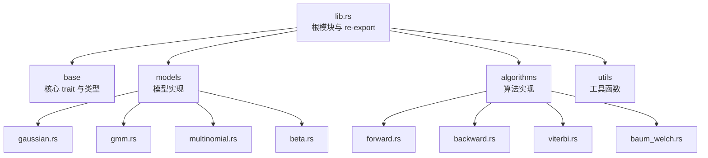
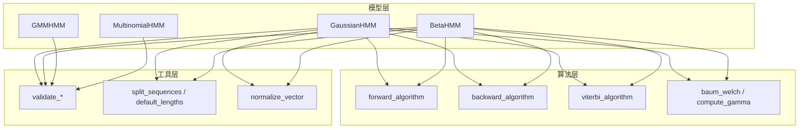
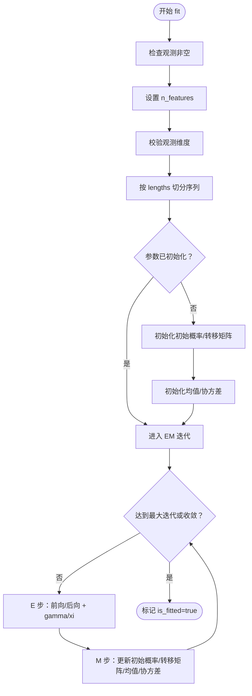
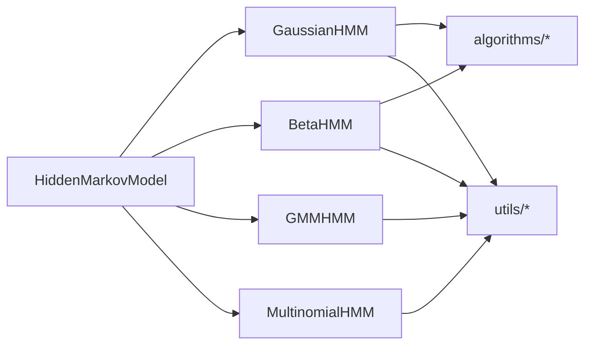

# API 参考

<cite>
**本文引用的文件**
- [src/lib.rs](file://src/lib.rs)
- [src/base/mod.rs](file://src/base/mod.rs)
- [src/base/hmm.rs](file://src/base/hmm.rs)
- [src/base/types.rs](file://src/base/types.rs)
- [src/models/mod.rs](file://src/models/mod.rs)
- [src/models/gaussian.rs](file://src/models/gaussian.rs)
- [src/models/gmm.rs](file://src/models/gmm.rs)
- [src/models/multinomial.rs](file://src/models/multinomial.rs)
- [src/models/beta.rs](file://src/models/beta.rs)
- [src/algorithms/mod.rs](file://src/algorithms/mod.rs)
- [src/algorithms/forward.rs](file://src/algorithms/forward.rs)
- [src/algorithms/backward.rs](file://src/algorithms/backward.rs)
- [src/algorithms/viterbi.rs](file://src/algorithms/viterbi.rs)
- [src/algorithms/baum_welch.rs](file://src/algorithms/baum_welch.rs)
- [src/utils/mod.rs](file://src/utils/mod.rs)
- [examples/beta_hmm_example.rs](file://examples/beta_hmm_example.rs)
</cite>

## 目录
1. [简介](#简介)
2. [项目结构](#项目结构)
3. [核心组件](#核心组件)
4. [架构总览](#架构总览)
5. [详细组件分析](#详细组件分析)
6. [依赖关系分析](#依赖关系分析)
7. [性能与复杂度](#性能与复杂度)
8. [故障排查与错误处理](#故障排查与错误处理)
9. [版本兼容性与迁移指南](#版本兼容性与迁移指南)
10. [结论](#结论)
11. [附录：类型与算法参考](#附录类型与算法参考)

## 简介
rhmm 是一个受 Python hmmlearn 启发的 Rust 隐马尔可夫模型（HMM）库，提供多种模型类型（高斯、高斯混合、多项式、Beta 分布）与标准算法（前向、后向、维特比、Baum-Welch）。它以 ndarray 作为核心数组后端，提供训练、解码、评分与采样等能力，并通过统一的 trait 接口抽象不同模型。

## 项目结构
- 根模块导出公共 API 并重导出常用类型与错误类型
- base 模块定义核心 trait 与通用类型别名
- models 模块包含具体模型实现
- algorithms 模块提供前向/后向/维特比/Baum-Welch 等算法
- utils 提供观测校验、序列切分、归一化等工具
- examples 展示用法示例

图表来源
- [src/lib.rs](file://src/lib.rs#L19-L27)
- [src/base/mod.rs](file://src/base/mod.rs#L3-L7)
- [src/models/mod.rs](file://src/models/mod.rs#L3-L11)
- [src/algorithms/mod.rs](file://src/algorithms/mod.rs#L3-L11)

章节来源
- [src/lib.rs](file://src/lib.rs#L1-L28)
- [src/base/mod.rs](file://src/base/mod.rs#L1-L8)
- [src/models/mod.rs](file://src/models/mod.rs#L1-L12)
- [src/algorithms/mod.rs](file://src/algorithms/mod.rs#L1-L12)
- [src/utils/mod.rs](file://src/utils/mod.rs#L1-L12)

## 核心组件
- 核心 trait HiddenMarkovModel：统一的 HMM 接口，定义状态数、特征数、fit、predict、score、sample、decode 等方法
- 类型别名：转移矩阵、初始概率、观测序列、状态序列；以及协方差类型 CovarianceType
- 错误类型：HmmError 与 Result 宏，用于统一错误处理

章节来源
- [src/base/hmm.rs](file://src/base/hmm.rs#L6-L61)
- [src/base/types.rs](file://src/base/types.rs#L5-L29)
- [src/lib.rs](file://src/lib.rs#L25-L27)

## 架构总览
下图展示模型与算法之间的交互关系，以及模型如何调用算法完成训练与推理。

图表来源
- [src/models/gaussian.rs](file://src/models/gaussian.rs#L328-L612)
- [src/models/beta.rs](file://src/models/beta.rs#L384-L669)
- [src/algorithms/forward.rs](file://src/algorithms/forward.rs#L20-L47)
- [src/algorithms/backward.rs](file://src/algorithms/backward.rs#L19-L44)
- [src/algorithms/viterbi.rs](file://src/algorithms/viterbi.rs#L20-L74)
- [src/algorithms/baum_welch.rs](file://src/algorithms/baum_welch.rs#L25-L44)

## 详细组件分析

### 核心 trait：HiddenMarkovModel
- 方法签名与职责
  - n_states()：返回隐藏状态数
  - n_features()：返回观测特征维度
  - fit(&mut self, observations, lengths) -> Result<()>：训练模型；支持多序列拼接长度
  - predict(&self, observations) -> Result<States>：维特比解码，返回最可能的状态序列
  - score(&self, observations) -> Result<f64>：计算对数似然
  - sample(&self, n_samples) -> Result<(Observations, States)>：从模型采样生成观测与状态
  - decode(&self, observations) -> Result<(f64, States)>：同时返回对数似然与状态序列（predict + score 的组合）
- 输入输出约定
  - 观测形状：(n_samples, n_features)
  - 状态序列：(n_samples,)
  - 返回值类型：States 为 usize 数组，f64 为标量
- 使用限制
  - 未训练时调用 predict/score/sample 将返回模型未拟合错误
  - 维特比与评分要求观测特征维度与模型一致

章节来源
- [src/base/hmm.rs](file://src/base/hmm.rs#L6-L61)

### 类型系统与通用类型别名
- 类型别名
  - TransitionMatrix：二维概率矩阵，(n_states, n_states)
  - InitialProbs：初始概率向量，(n_states,)
  - Observations：观测矩阵，(n_samples, n_features)
  - States：状态序列，(n_samples,)
- 枚举 CovarianceType
  - Full：全协方差（当前简化实现按对角处理）
  - Diagonal：对角协方差（默认）
  - Spherical：球面协方差（单方差）
  - Tied：所有状态共享协方差（当前简化实现按对角处理）

章节来源
- [src/base/types.rs](file://src/base/types.rs#L5-L29)

### 模型类型与构造函数

#### 高斯 HMM（GaussianHMM）
- 构造函数
  - new(n_states)：创建指定状态数的模型，默认协方差类型为对角
  - with_covariance_type(n_states, covariance_type)：指定协方差类型
- 关键字段
  - n_states：隐藏状态数
  - n_features：观测特征数（训练时设置）
  - covariance_type：协方差类型
  - start_prob、transition_matrix、means、covars：模型参数（训练后填充）
  - is_fitted：是否已训练
- 训练流程要点
  - fit 支持多序列（通过 lengths 切分），内部使用 Baum-Welch 进行 EM 迭代
  - 初始化：初始概率与转移矩阵按均匀分布初始化；均值与协方差基于数据统计初始化
  - E 步：前向/后向计算；M 步：更新初始概率、转移矩阵、均值与协方差
- 解码与评分
  - predict：基于 emission 概率与维特比算法
  - score：基于 emission 概率与前向算法取对数
- 采样
  - 从初始状态与转移矩阵采样状态序列，再按各状态的高斯分布采样观测

章节来源
- [src/models/gaussian.rs](file://src/models/gaussian.rs#L11-L101)
- [src/models/gaussian.rs](file://src/models/gaussian.rs#L328-L612)

#### Beta HMM（BetaHMM）
- 构造函数
  - new(n_states)：创建指定状态数的模型
- 关键字段
  - n_states、n_features、start_prob、transition_matrix、alphas、betas、is_fitted
- 训练流程要点
  - fit 支持多序列；使用 Baum-Welch；E 步：前向/后向；M 步：更新初始概率、转移矩阵、以及每个状态每个特征的 Beta 分布参数（alpha/beta）
  - 参数初始化：基于观测的矩估计转换为 Beta 参数
- 解码与评分
  - predict/score 基于 emission 概率（Beta PDF）与维特比/前向算法
- 采样
  - 从初始状态与转移矩阵采样状态，再按对应状态的 Beta 分布采样观测

章节来源
- [src/models/beta.rs](file://src/models/beta.rs#L14-L89)
- [src/models/beta.rs](file://src/models/beta.rs#L384-L669)

#### 高斯混合 HMM（GMMHMM）
- 构造函数
  - new(n_states, n_mix)：指定状态数与每状态混合分量数
- 当前实现状态
  - 训练、解码、评分、采样均为占位实现（TODO），尚未提供完整 EM 流程
- 使用建议
  - 在完整实现前，请勿依赖训练/解码/评分/采样的结果

章节来源
- [src/models/gmm.rs](file://src/models/gmm.rs#L8-L42)
- [src/models/gmm.rs](file://src/models/gmm.rs#L44-L107)

#### 多项式 HMM（MultinomialHMM）
- 构造函数
  - new(n_states, n_features)：指定状态数与离散观测种类数
- 当前实现状态
  - 训练、解码、评分、采样均为占位实现（TODO），尚未提供完整实现
- 使用建议
  - 在完整实现前，请勿依赖训练/解码/评分/采样的结果

章节来源
- [src/models/multinomial.rs](file://src/models/multinomial.rs#L8-L33)
- [src/models/multinomial.rs](file://src/models/multinomial.rs#L35-L94)

### 算法接口规范

#### 前向算法（forward_algorithm）
- 功能：计算前向概率矩阵 alpha
- 输入
  - start_prob：初始概率向量 (n_states,)
  - transition_matrix：转移矩阵 (n_states, n_states)
  - emission_probs：发射概率矩阵 (n_samples, n_states)
- 输出：alpha：(n_samples, n_states)
- 复杂度：时间 O(T·N^2)，空间 O(T·N)

章节来源
- [src/algorithms/forward.rs](file://src/algorithms/forward.rs#L20-L47)

#### 后向算法（backward_algorithm）
- 功能：计算后向概率矩阵 beta
- 输入：transition_matrix、emission_probs
- 输出：beta：(n_samples, n_states)
- 复杂度：时间 O(T·N^2)，空间 O(T·N)

章节来源
- [src/algorithms/backward.rs](file://src/algorithms/backward.rs#L19-L44)

#### 维特比算法（viterbi_algorithm）
- 功能：寻找最可能的状态序列
- 输入：start_prob、transition_matrix、emission_probs
- 输出：(log_prob, path)
- 复杂度：时间 O(T·N^2)，空间 O(T·N)

章节来源
- [src/algorithms/viterbi.rs](file://src/algorithms/viterbi.rs#L20-L74)

#### Baum-Welch 与 gamma 计算（baum_welch / compute_gamma）
- 功能：EM 参数估计框架（占位与 gamma 计算）
- 输入：observations、start_prob、transition_matrix、emission_probs（占位）
- 输出：迭代次数（占位）；gamma：(n_samples, n_states)
- 复杂度：gamma 计算 O(T·N)

章节来源
- [src/algorithms/baum_welch.rs](file://src/algorithms/baum_welch.rs#L25-L44)
- [src/algorithms/baum_welch.rs](file://src/algorithms/baum_welch.rs#L56-L74)

### 数据流与处理逻辑（以 GaussianHMM.fit 为例）

图表来源
- [src/models/gaussian.rs](file://src/models/gaussian.rs#L337-L491)

## 依赖关系分析
- 模块耦合
  - 模型实现依赖 algorithms 提供的前向/后向/维特比/Baum-Welch 工具
  - 模型实现依赖 utils 的观测校验、序列切分与归一化
  - base 提供统一 trait 与类型别名，被所有模型实现依赖
- 外部依赖
  - ndarray：张量与矩阵运算
  - rand/rand_distr：随机采样与分布
  - f64 常量与数学函数

图表来源
- [src/base/hmm.rs](file://src/base/hmm.rs#L6-L61)
- [src/models/gaussian.rs](file://src/models/gaussian.rs#L3-L9)
- [src/models/beta.rs](file://src/models/beta.rs#L3-L9)
- [src/utils/mod.rs](file://src/utils/mod.rs#L8-L11)

章节来源
- [src/base/hmm.rs](file://src/base/hmm.rs#L6-L61)
- [src/models/gaussian.rs](file://src/models/gaussian.rs#L3-L9)
- [src/models/beta.rs](file://src/models/beta.rs#L3-L9)
- [src/utils/mod.rs](file://src/utils/mod.rs#L1-L12)

## 性能与复杂度
- 训练复杂度
  - 单序列：O(I·T·N^2)，I 为迭代次数，T 为序列长度，N 为状态数
  - 多序列：按序列独立处理，整体复杂度线性叠加
- 内存占用
  - 主要消耗在 alpha/beta/gamma/xi 等中间变量，约为 O(T·N)
- 稳定性
  - 对协方差/参数进行最小阈值保护，避免数值不稳定
  - log 概率域计算，避免下溢

章节来源
- [src/models/gaussian.rs](file://src/models/gaussian.rs#L384-L491)
- [src/models/beta.rs](file://src/models/beta.rs#L440-L547)

## 故障排查与错误处理
- 常见错误类型
  - 模型未拟合：调用 predict/score/sample 前必须先 fit
  - 维度不匹配：观测列数需与模型 n_features 一致
  - 参数非法：观测为空、Beta 观测不在 (0,1)、协方差参数过小等
  - 数值错误：分布参数无效导致的随机数生成失败
- 建议
  - 训练前校验观测维度与范围
  - 使用默认 lengths 或显式提供序列长度
  - 对于高斯模型，注意协方差类型选择与最小方差约束
  - 对于 Beta 模型，确保观测在 (0,1) 区间内

章节来源
- [src/models/gaussian.rs](file://src/models/gaussian.rs#L337-L517)
- [src/models/beta.rs](file://src/models/beta.rs#L393-L600)
- [src/base/hmm.rs](file://src/base/hmm.rs#L14-L60)

## 版本兼容性与迁移指南
- 当前实现状态
  - GaussianHMM 与 BetaHMM 提供完整训练/解码/评分/采样
  - GMMHMM 与 MultinomialHMM 仍为占位实现（TODO）
- 迁移建议
  - 若使用占位实现，请关注后续版本的 API 变更
  - 对于数值稳定性，建议在调用前自行做观测范围与维度校验
- 兼容性提示
  - trait 接口保持稳定，模型实现细节可能调整
  - 错误类型与返回值保持一致，便于替换实现

章节来源
- [src/models/gmm.rs](file://src/models/gmm.rs#L69-L70)
- [src/models/multinomial.rs](file://src/models/multinomial.rs#L56-L57)

## 结论
rhmm 提供了清晰的 HMM 抽象与多种实现，具备良好的扩展性与数值稳定性。当前高斯与 Beta 模型已可直接使用，GMM 与多项式模型建议等待完整实现后再集成到生产环境。通过统一的 trait 与算法模块，开发者可以快速构建、训练与评估 HMM 模型。

## 附录：类型与算法参考

### 类型定义
- TransitionMatrix：(n_states, n_states) 概率矩阵
- InitialProbs：(n_states,) 初始概率
- Observations：(n_samples, n_features) 观测矩阵
- States：(n_samples,) 状态序列
- CovarianceType：枚举，支持 Full、Diagonal（默认）、Spherical、Tied

章节来源
- [src/base/types.rs](file://src/base/types.rs#L5-L29)

### 算法接口一览
- 前向：输入 (start_prob, transition_matrix, emission_probs)，输出 alpha
- 后向：输入 (transition_matrix, emission_probs)，输出 beta
- 维特比：输入 (start_prob, transition_matrix, emission_probs)，输出 (log_prob, path)
- Baum-Welch：占位（完整实现位于模型内部）
- gamma：输入 (alpha, beta)，输出 (n_samples, n_states)

章节来源
- [src/algorithms/forward.rs](file://src/algorithms/forward.rs#L20-L69)
- [src/algorithms/backward.rs](file://src/algorithms/backward.rs#L19-L44)
- [src/algorithms/viterbi.rs](file://src/algorithms/viterbi.rs#L20-L74)
- [src/algorithms/baum_welch.rs](file://src/algorithms/baum_welch.rs#L25-L44)

### 使用示例与最佳实践
- 示例文件
  - examples/beta_hmm_example.rs：展示 BetaHMM 的基本用法
- 最佳实践
  - 显式提供序列长度 lengths，避免歧义
  - 训练前对观测进行范围与缺失值检查
  - 针对高斯模型选择合适的协方差类型
  - 对于 Beta 模型，确保观测在 (0,1) 区间内

章节来源
- [examples/beta_hmm_example.rs](file://examples/beta_hmm_example.rs)