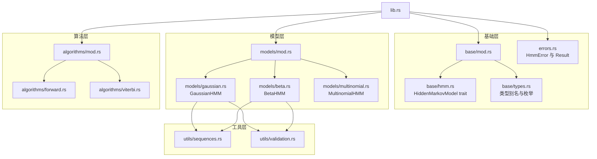
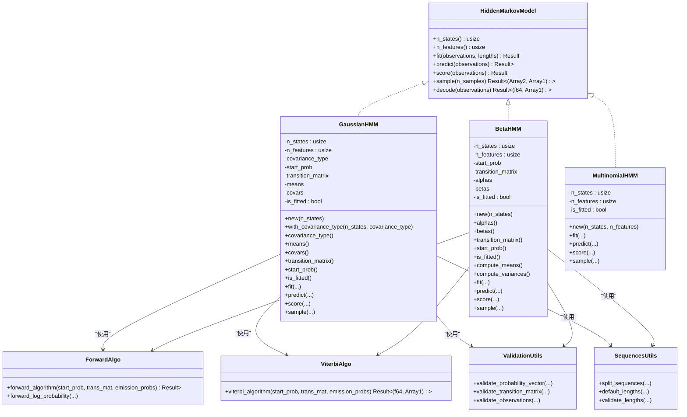
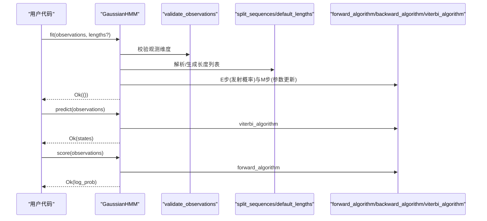
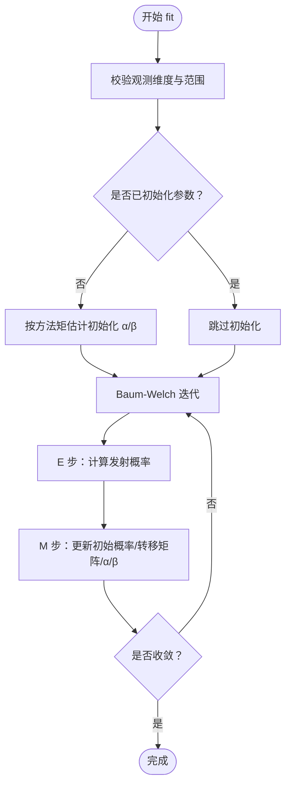
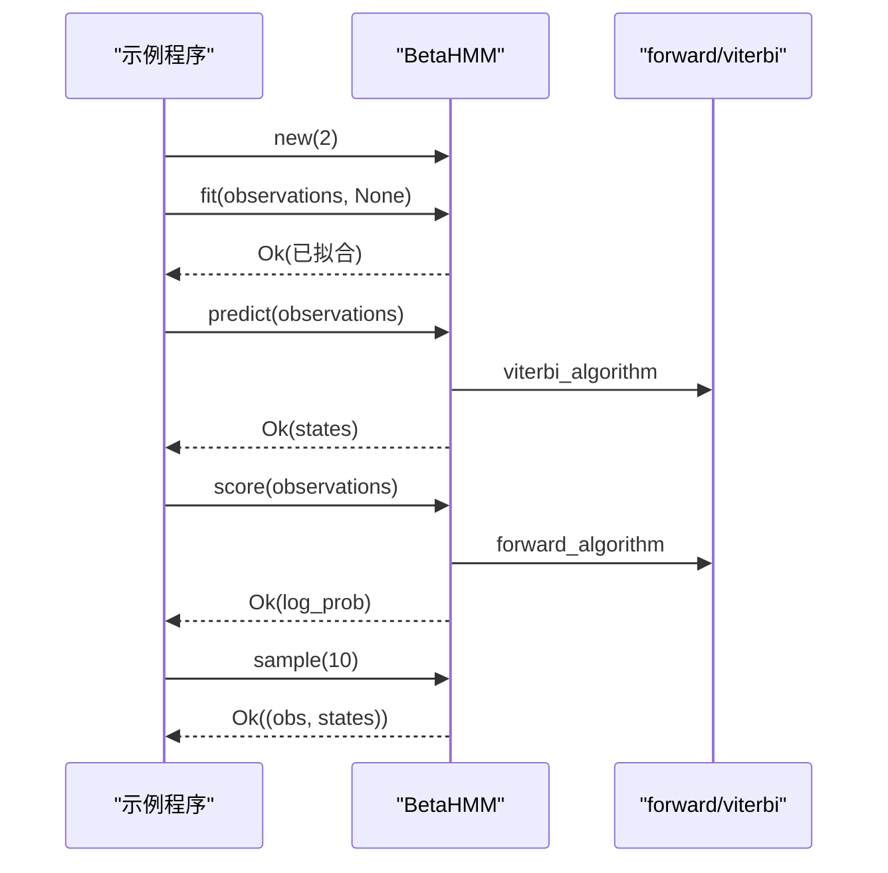
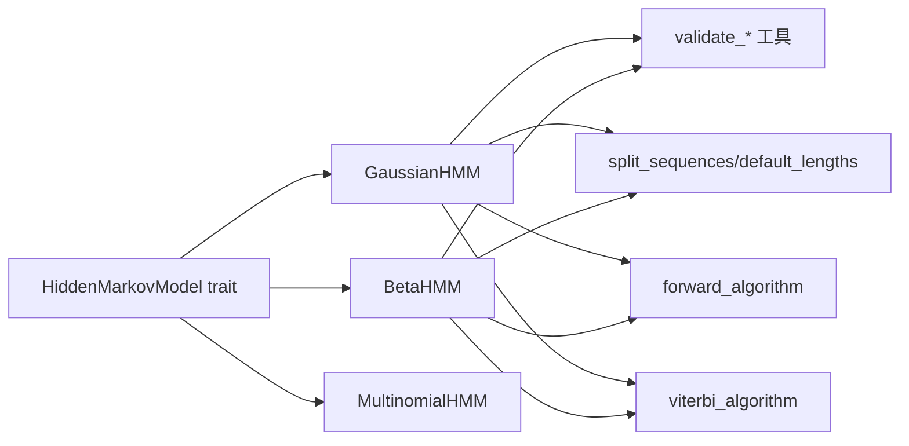

# 核心 Trait 接口

<cite>
**本文引用的文件**
- [src/lib.rs](file://src/lib.rs)
- [src/base/mod.rs](file://src/base/mod.rs)
- [src/base/hmm.rs](file://src/base/hmm.rs)
- [src/base/types.rs](file://src/base/types.rs)
- [src/models/mod.rs](file://src/models/mod.rs)
- [src/models/gaussian.rs](file://src/models/gaussian.rs)
- [src/models/beta.rs](file://src/models/beta.rs)
- [src/models/multinomial.rs](file://src/models/multinomial.rs)
- [src/algorithms/mod.rs](file://src/algorithms/mod.rs)
- [src/algorithms/forward.rs](file://src/algorithms/forward.rs)
- [src/algorithms/viterbi.rs](file://src/algorithms/viterbi.rs)
- [src/utils/validation.rs](file://src/utils/validation.rs)
- [src/utils/sequences.rs](file://src/utils/sequences.rs)
- [src/errors.rs](file://src/errors.rs)
- [examples/beta_hmm_example.rs](file://examples/beta_hmm_example.rs)
</cite>

## 目录
1. [简介](#简介)
2. [项目结构](#项目结构)
3. [核心组件](#核心组件)
4. [架构总览](#架构总览)
5. [详细组件分析](#详细组件分析)
6. [依赖关系分析](#依赖关系分析)
7. [性能考量](#性能考量)
8. [故障排查指南](#故障排查指南)
9. [结论](#结论)
10. [附录](#附录)

## 简介
本文件面向 HiddenMarkovModel 核心 trait 的使用者与贡献者，系统化梳理其 API 设计、方法语义、参数约束、返回值与错误处理机制，并结合具体模型（高斯、Beta、多项式）的实现细节，给出最佳实践与常见使用模式。文档同时解释 trait 的设计原则与扩展机制，帮助读者在不改变核心接口的前提下为该库添加新的模型类型。

## 项目结构
rhmm 是一个基于 ndarray 的 Rust 隐藏马尔可夫模型库，采用模块化组织：基础 trait 与通用类型位于 base 模块；多种模型实现在 models 子模块；标准算法（前向、后向、维特比、Baum-Welch）位于 algorithms；工具函数（参数校验、序列切分等）位于 utils；错误类型定义于 errors；examples 提供使用示例。

**图示来源**
- [src/lib.rs](file://src/lib.rs#L19-L28)
- [src/base/mod.rs](file://src/base/mod.rs#L1-L8)
- [src/base/hmm.rs](file://src/base/hmm.rs#L1-L62)
- [src/base/types.rs](file://src/base/types.rs#L1-L61)
- [src/models/mod.rs](file://src/models/mod.rs#L1-L12)
- [src/algorithms/mod.rs](file://src/algorithms/mod.rs#L1-L12)
- [src/utils/validation.rs](file://src/utils/validation.rs#L1-L141)
- [src/utils/sequences.rs](file://src/utils/sequences.rs#L1-L153)
- [src/errors.rs](file://src/errors.rs#L1-L105)

**章节来源**
- [src/lib.rs](file://src/lib.rs#L1-L28)
- [src/base/mod.rs](file://src/base/mod.rs#L1-L8)
- [src/models/mod.rs](file://src/models/mod.rs#L1-L12)
- [src/algorithms/mod.rs](file://src/algorithms/mod.rs#L1-L12)

## 核心组件
本节聚焦 HiddenMarkovModel trait 的 API 定义与行为规范，涵盖 n_states()、n_features()、fit()、predict()、score()、sample()、decode() 方法的签名、参数、返回值与错误处理。

- 方法概览
  - n_states(): 获取隐藏状态数
  - n_features(): 获取特征维度数
  - fit(&mut self, observations: &Array2<f64>, lengths: Option<&[usize]>): 训练模型
  - predict(&self, observations: &Array2<f64>): 使用维特比算法预测最可能的状态序列
  - score(&self, observations: &Array2<f64>): 计算观测序列的对数概率
  - sample(&self, n_samples: usize): 从模型中采样生成观测与状态
  - decode(&self, observations: &Array2<f64>): 返回 (log_prob, states)，即 score 与 predict 的组合

- 参数与返回值约定
  - 观测矩阵 observations: 形状为 (n_samples, n_features)，其中 n_features 由 n_features() 决定
  - 长度参数 lengths: 可选，用于多序列拼接场景；若未提供则默认单序列
  - 返回值类型：除 sample 返回元组外，其余方法返回 Result 类型，内部成功时返回具体结果，失败时返回 HmmError

- 错误处理机制
  - ModelNotFitted: 当模型未训练却进行预测/评分/采样时抛出
  - DimensionMismatch: 当观测特征维度与模型不一致时抛出
  - InvalidParameter: 当输入为空或长度数组非法时抛出
  - InvalidProbability: 当概率向量或转移矩阵不合法时抛出
  - NumericalError: 数值计算异常（如分布初始化失败）
  - ConvergenceError: 迭代收敛失败（当前实现中未直接触发）

- 设计原则与扩展机制
  - 统一接口：所有模型均实现同一 trait，便于替换与多态使用
  - 参数校验：通过 utils/validation.rs 对初始概率、转移矩阵与观测维度进行严格校验
  - 多序列支持：通过 utils/sequences.rs 支持 lengths 参数，自动切分观测序列
  - 算法解耦：算法（前向、维特比等）独立于模型实现，通过函数形式注入到各模型中

**章节来源**
- [src/base/hmm.rs](file://src/base/hmm.rs#L6-L62)
- [src/base/types.rs](file://src/base/types.rs#L1-L61)
- [src/errors.rs](file://src/errors.rs#L8-L34)
- [src/utils/validation.rs](file://src/utils/validation.rs#L58-L74)
- [src/utils/sequences.rs](file://src/utils/sequences.rs#L43-L83)

## 架构总览
下图展示了 HiddenMarkovModel trait 与其典型实现之间的关系，以及与算法与工具模块的交互。

**图示来源**
- [src/base/hmm.rs](file://src/base/hmm.rs#L6-L62)
- [src/models/gaussian.rs](file://src/models/gaussian.rs#L1-L681)
- [src/models/beta.rs](file://src/models/beta.rs#L1-L734)
- [src/models/multinomial.rs](file://src/models/multinomial.rs#L1-L95)
- [src/algorithms/forward.rs](file://src/algorithms/forward.rs#L1-L129)
- [src/algorithms/viterbi.rs](file://src/algorithms/viterbi.rs#L1-L118)
- [src/utils/validation.rs](file://src/utils/validation.rs#L1-L141)
- [src/utils/sequences.rs](file://src/utils/sequences.rs#L1-L153)

## 详细组件分析

### HiddenMarkovModel trait API 详解
- n_states()
  - 功能：返回隐藏状态数量
  - 返回：usize
  - 典型实现：GaussianHMM/BetaHMM/MultinomialHMM 均维护 n_states 字段
- n_features()
  - 功能：返回观测特征维度
  - 返回：usize
  - 典型实现：GaussianHMM/BetaHMM 在 fit 中根据观测设置；MultinomialHMM 由构造函数指定
- fit(&mut self, observations: &Array2<f64>, lengths: Option<&[usize]>)
  - 输入
    - observations: 形状 (n_samples, n_features)
    - lengths: 可选，多序列拼接时提供每条序列长度；None 表示单序列
  - 行为
    - 校验观测维度与概率/转移矩阵合法性
    - 若未初始化参数则进行初始化（如随机/矩估计）
    - 使用 Baum-Welch 迭代更新参数，直到收敛或达到最大迭代次数
  - 返回：Result<()>，成功时标记 is_fitted=true
  - 错误：InvalidParameter、DimensionMismatch、InvalidProbability、ModelNotFitted（在某些路径）
- predict(&self, observations: &Array2<f64>)
  - 输入：observations: 形状 (n_samples, n_features)
  - 行为：计算发射概率，调用维特比算法得到最可能状态序列
  - 返回：Result<Array1<usize>>
  - 错误：ModelNotFitted、DimensionMismatch
- score(&self, observations: &Array2<f64>)
  - 输入：observations: 形状 (n_samples, n_features)
  - 行为：计算发射概率，调用前向算法得到对数概率
  - 返回：Result<f64>
  - 错误：ModelNotFitted、DimensionMismatch
- sample(&self, n_samples: usize)
  - 输入：n_samples: 要生成的样本数
  - 行为：按初始状态与转移概率生成状态序列，再按各状态的发射分布生成观测
  - 返回：Result<(Array2<f64>, Array1<usize>)>
  - 错误：ModelNotFitted
- decode(&self, observations: &Array2<f64>)
  - 行为：等价于 (self.score(observations)?, self.predict(observations)?)
  - 返回：Result<(f64, Array1<usize>)>

最佳实践与常见模式
- 训练前确保观测矩阵的列数与模型 n_features() 一致
- 多序列训练时提供正确的 lengths，否则会触发维度不匹配或长度校验错误
- 预测/评分/采样前必须先调用 fit 并检查 is_fitted
- 对于数值稳定性，建议在外部对观测进行归一化或截断（例如 Beta 模型要求观测在开区间 (0,1)）

**章节来源**
- [src/base/hmm.rs](file://src/base/hmm.rs#L6-L62)
- [src/base/types.rs](file://src/base/types.rs#L5-L15)
- [src/errors.rs](file://src/errors.rs#L8-L34)

### GaussianHMM 实现要点
- 发射分布：高斯分布，支持协方差类型（全/对角/球面/耦合），对角/球面版本在实现中直接使用对角协方差近似
- 参数估计：fit 中使用 Baum-Welch，E 步计算发射概率，M 步更新初始概率、转移矩阵与均值/协方差
- 预测与评分：predict 调用 Viterbi，score 调用 Forward
- 采样：按状态转移与高斯分布采样

**图示来源**
- [src/models/gaussian.rs](file://src/models/gaussian.rs#L337-L544)
- [src/utils/validation.rs](file://src/utils/validation.rs#L58-L74)
- [src/utils/sequences.rs](file://src/utils/sequences.rs#L43-L83)
- [src/algorithms/forward.rs](file://src/algorithms/forward.rs#L20-L47)
- [src/algorithms/viterbi.rs](file://src/algorithms/viterbi.rs#L20-L74)

**章节来源**
- [src/models/gaussian.rs](file://src/models/gaussian.rs#L1-L681)

### BetaHMM 实现要点
- 发射分布：Beta 分布，适用于 [0,1] 区间观测（如转化率、比例）
- 参数估计：fit 中使用 Baum-Welch，E 步计算发射概率，M 步使用加权矩估计更新 α/β
- 预测与评分：predict 调用 Viterbi，score 调用 Forward
- 采样：按状态转移与 Beta 分布采样

**图示来源**
- [src/models/beta.rs](file://src/models/beta.rs#L393-L547)
- [src/utils/validation.rs](file://src/utils/validation.rs#L58-L74)
- [src/utils/sequences.rs](file://src/utils/sequences.rs#L43-L83)

**章节来源**
- [src/models/beta.rs](file://src/models/beta.rs#L1-L734)

### MultinomialHMM 实现要点
- 发射分布：离散多项式分布，适合整数计数或类别观测
- 当前实现：训练、预测、评分、采样均为占位实现（TODO），仅做基本维度校验
- 扩展建议：实现完整的 Baum-Welch 与 Viterbi/Forward 算法

**章节来源**
- [src/models/multinomial.rs](file://src/models/multinomial.rs#L1-L95)

### 示例：BetaHMM 使用流程
以下示例演示了从训练到预测/评分/采样的完整流程，展示了 trait 的统一使用方式。

**图示来源**
- [examples/beta_hmm_example.rs](file://examples/beta_hmm_example.rs#L15-L266)
- [src/models/beta.rs](file://src/models/beta.rs#L384-L669)
- [src/algorithms/forward.rs](file://src/algorithms/forward.rs#L20-L47)
- [src/algorithms/viterbi.rs](file://src/algorithms/viterbi.rs#L20-L74)

**章节来源**
- [examples/beta_hmm_example.rs](file://examples/beta_hmm_example.rs#L1-L266)

## 依赖关系分析
- 模型到算法：GaussianHMM/BetaHMM 通过函数调用使用 forward_algorithm 与 viterbi_algorithm
- 模型到工具：通过 validate_observations、validate_probability_vector、validate_transition_matrix 与 split_sequences/default_lengths
- trait 到模型：models/mod.rs re-export 各模型类型，lib.rs 将 base::HiddenMarkovModel 作为公共 API

**图示来源**
- [src/base/hmm.rs](file://src/base/hmm.rs#L6-L62)
- [src/models/gaussian.rs](file://src/models/gaussian.rs#L1-L681)
- [src/models/beta.rs](file://src/models/beta.rs#L1-L734)
- [src/models/multinomial.rs](file://src/models/multinomial.rs#L1-L95)
- [src/utils/validation.rs](file://src/utils/validation.rs#L1-L141)
- [src/utils/sequences.rs](file://src/utils/sequences.rs#L1-L153)
- [src/algorithms/forward.rs](file://src/algorithms/forward.rs#L1-L129)
- [src/algorithms/viterbi.rs](file://src/algorithms/viterbi.rs#L1-L118)

**章节来源**
- [src/models/mod.rs](file://src/models/mod.rs#L1-L12)
- [src/lib.rs](file://src/lib.rs#L19-L28)

## 性能考量
- 时间复杂度
  - fit：每次迭代对每个序列执行 O(T·N^2) 的前向/后向与参数更新（T 为序列长度，N 为状态数）
  - predict/score：O(T·N^2)
  - sample：O(T·N·F)（F 为特征数）
- 空间复杂度
  - 主要消耗在 alpha/beta 与发射概率矩阵上，约为 O(T·N)
- 优化建议
  - 对大序列使用更稳定的数值计算（如 log-space）
  - 对高维特征考虑稀疏化或降维
  - 多序列训练时避免不必要的拷贝，优先使用视图

[本节为通用指导，无需列出具体文件来源]

## 故障排查指南
- ModelNotFitted
  - 现象：在未训练模型上调用 predict/score/sample
  - 处理：先调用 fit，确认 is_fitted 为真
- DimensionMismatch
  - 现象：观测列数与模型 n_features() 不一致
  - 处理：检查训练与测试数据的特征维度，或重新创建模型
- InvalidParameter
  - 现象：观测为空、长度数组为空或总长不匹配
  - 处理：确保观测非空且 lengths 合法
- InvalidProbability
  - 现象：初始概率/转移矩阵不合法（越界或不归一）
  - 处理：使用 validate_probability_vector/validate_transition_matrix 校验
- NumericalError
  - 现象：分布初始化失败（如 Beta/Gaussian 参数非法）
  - 处理：检查输入参数范围与数值稳定性

**章节来源**
- [src/errors.rs](file://src/errors.rs#L8-L34)
- [src/utils/validation.rs](file://src/utils/validation.rs#L6-L74)
- [src/utils/sequences.rs](file://src/utils/sequences.rs#L16-L41)

## 结论
HiddenMarkovModel trait 以最小接口实现了 HMM 的核心能力，配合算法与工具模块，既保证了易用性，又提供了良好的扩展性。通过统一的 fit/predict/score/sample/decode 接口，用户可以无缝切换不同发射分布的模型；通过严格的参数校验与错误类型，提升了鲁棒性。建议在新模型实现中遵循现有模式：先实现发射概率计算，再接入 Baum-Welch 与 Viterbi/Forward 算法，并完善参数校验与采样逻辑。

[本节为总结性内容，无需列出具体文件来源]

## 附录
- 常用类型别名
  - TransitionMatrix: Array2<f64>
  - InitialProbs: Array1<f64>
  - Observations: Array2<f64>
  - States: Array1<usize>
- CovarianceType 枚举
  - Full、Diagonal（默认）、Spherical、Tied

**章节来源**
- [src/base/types.rs](file://src/base/types.rs#L5-L29)