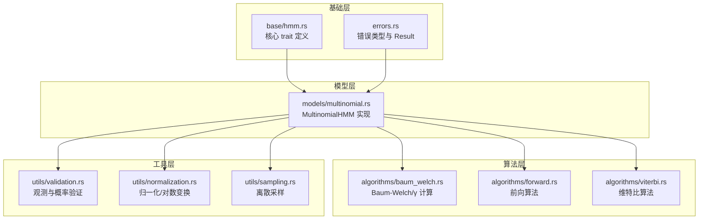
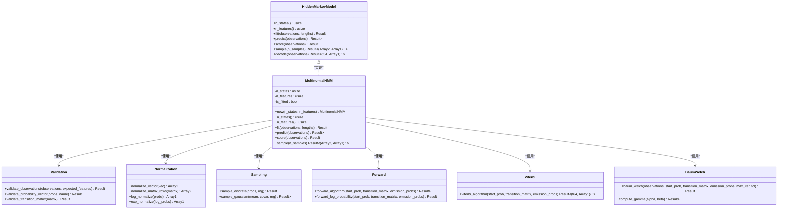
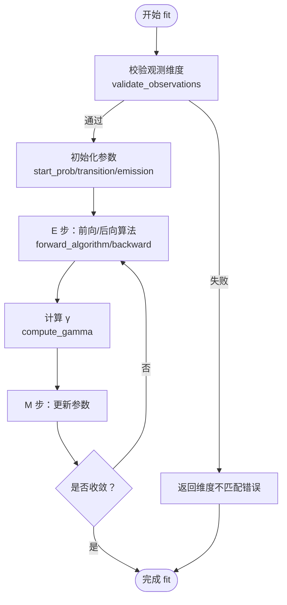
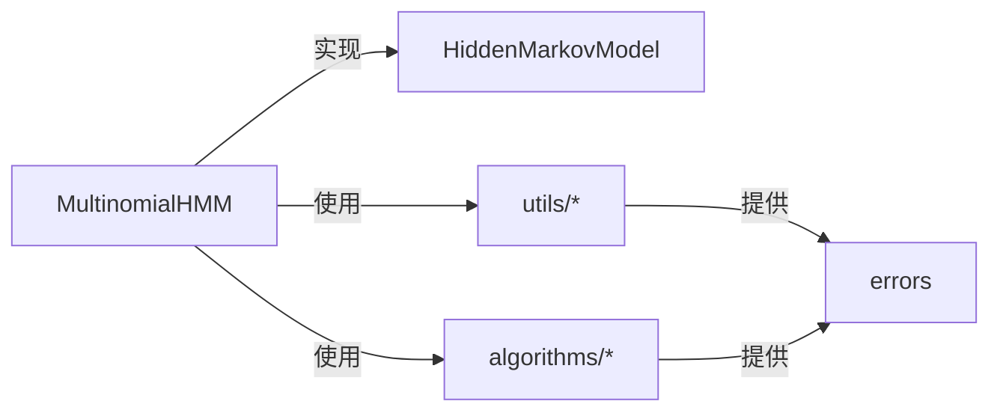

# 多项式 HMM API

<cite>
**本文引用的文件**
- [src/models/multinomial.rs](file://src/models/multinomial.rs)
- [src/base/hmm.rs](file://src/base/hmm.rs)
- [src/algorithms/baum_welch.rs](file://src/algorithms/baum_welch.rs)
- [src/algorithms/forward.rs](file://src/algorithms/forward.rs)
- [src/algorithms/viterbi.rs](file://src/algorithms/viterbi.rs)
- [src/utils/validation.rs](file://src/utils/validation.rs)
- [src/utils/normalization.rs](file://src/utils/normalization.rs)
- [src/utils/sampling.rs](file://src/utils/sampling.rs)
- [src/errors.rs](file://src/errors.rs)
- [src/lib.rs](file://src/lib.rs)
- [README.md](file://README.md)
</cite>

## 目录
1. [简介](#简介)
2. [项目结构](#项目结构)
3. [核心组件](#核心组件)
4. [架构总览](#架构总览)
5. [详细组件分析](#详细组件分析)
6. [依赖关系分析](#依赖关系分析)
7. [性能考量](#性能考量)
8. [故障排查指南](#故障排查指南)
9. [结论](#结论)
10. [附录：使用示例与参数调优](#附录使用示例与参数调优)

## 简介
本文件为“多项式隐马尔可夫模型（Multinomial HMM）”的完整 API 文档。当前仓库已提供核心接口定义与基础框架，但多项式 HMM 的训练与推理方法仍处于占位实现阶段（标记为 TODO）。本文将：
- 详述 MultinomialHMM 的公共方法与属性
- 解释多项式分布发射概率的特性与适用场景
- 说明参数初始化、概率质量函数计算、参数估计流程
- 介绍 fit()、predict()、score()、sample() 的设计与当前实现状态
- 对比多项式 HMM 与其他模型类型
- 提供使用示例与参数调优建议

## 项目结构
该库采用模块化组织，核心模块如下：
- base：定义 HMM 核心 trait 与通用能力
- models：各具体模型实现（含 MultinomialHMM）
- algorithms：算法实现（Forward、Backward、Viterbi、Baum-Welch）
- utils：验证、归一化、采样、序列处理等工具
- errors：统一错误类型与 Result 类型别名
- lib：对外 re-export 与模块入口

图表来源
- [src/base/hmm.rs](file://src/base/hmm.rs#L1-L62)
- [src/models/multinomial.rs](file://src/models/multinomial.rs#L1-L95)
- [src/algorithms/baum_welch.rs](file://src/algorithms/baum_welch.rs#L1-L75)
- [src/algorithms/forward.rs](file://src/algorithms/forward.rs#L1-L129)
- [src/algorithms/viterbi.rs](file://src/algorithms/viterbi.rs#L1-L118)
- [src/utils/validation.rs](file://src/utils/validation.rs#L1-L141)
- [src/utils/normalization.rs](file://src/utils/normalization.rs#L1-L102)
- [src/utils/sampling.rs](file://src/utils/sampling.rs#L1-L130)
- [src/errors.rs](file://src/errors.rs#L1-L105)

章节来源
- [src/lib.rs](file://src/lib.rs#L1-L28)
- [README.md](file://README.md#L1-L303)

## 核心组件
- MultinomialHMM：多项式 HMM 的结构体，包含隐藏状态数 n_states 与特征维度 n_features；当前 is_fitted 标记用于控制预测/评分/采样的前置条件。
- HiddenMarkovModel trait：所有 HMM 模型必须实现的方法集合，包括 n_states、n_features、fit、predict、score、sample、decode。
- 工具与算法：观测验证、概率向量/矩阵归一化、离散采样、前向/维特比算法、Baum-Welch 参数估计框架。

章节来源
- [src/models/multinomial.rs](file://src/models/multinomial.rs#L13-L33)
- [src/base/hmm.rs](file://src/base/hmm.rs#L7-L61)
- [src/utils/validation.rs](file://src/utils/validation.rs#L58-L74)
- [src/utils/normalization.rs](file://src/utils/normalization.rs#L5-L35)
- [src/utils/sampling.rs](file://src/utils/sampling.rs#L7-L38)
- [src/algorithms/forward.rs](file://src/algorithms/forward.rs#L20-L47)
- [src/algorithms/viterbi.rs](file://src/algorithms/viterbi.rs#L20-L74)
- [src/algorithms/baum_welch.rs](file://src/algorithms/baum_welch.rs#L25-L44)

## 架构总览
下图展示 MultinomialHMM 与核心 trait、算法与工具之间的交互关系。

图表来源
- [src/base/hmm.rs](file://src/base/hmm.rs#L7-L61)
- [src/models/multinomial.rs](file://src/models/multinomial.rs#L35-L94)
- [src/utils/validation.rs](file://src/utils/validation.rs#L58-L74)
- [src/utils/normalization.rs](file://src/utils/normalization.rs#L5-L35)
- [src/utils/sampling.rs](file://src/utils/sampling.rs#L7-L38)
- [src/algorithms/forward.rs](file://src/algorithms/forward.rs#L20-L69)
- [src/algorithms/viterbi.rs](file://src/algorithms/viterbi.rs#L20-L74)
- [src/algorithms/baum_welch.rs](file://src/algorithms/baum_welch.rs#L25-L74)

## 详细组件分析

### MultinomialHMM 结构体与公共方法
- 结构体字段
  - n_states：隐藏状态数量
  - n_features：离散观测的特征维度（即词汇表大小）
  - is_fitted：模型是否已完成训练
- 公共方法
  - new(n_states, n_features)：构造函数
  - n_states()、n_features()：查询模型参数
  - fit(observations, lengths)：训练模型（当前仅进行观测维度校验与 is_fitted 标记）
  - predict(observations)：维特比解码（当前返回占位数组）
  - score(observations)：前向算法计算日志概率（当前返回占位值）
  - sample(n_samples)：从模型中采样（当前返回占位数组）

章节来源
- [src/models/multinomial.rs](file://src/models/multinomial.rs#L13-L33)
- [src/models/multinomial.rs](file://src/models/multinomial.rs#L35-L94)

### HiddenMarkovModel trait
- 规定所有 HMM 模型必须实现的方法签名与语义，包括：
  - n_states、n_features：模型参数查询
  - fit：训练（支持多序列长度切分）
  - predict：维特比解码
  - score：计算观测序列的日志概率
  - sample：生成样本（观测与状态）
  - decode：同时返回最优路径与日志概率

章节来源
- [src/base/hmm.rs](file://src/base/hmm.rs#L7-L61)

### 多项式分布发射概率与适用场景
- 特点
  - 发射概率以多项式分布建模，适用于离散计数数据或分类数据
  - 观测向量通常为非负整数或归一化的计数向量，满足每条观测的特征和为固定值
- 适用场景
  - 自然语言处理：词袋模型下的词频向量
  - 生物信息学：DNA/RNA 序列的 k-mer 计数
  - 用户行为：点击流或事件计数
  - 天气/气候：离散天气状态的计数表示

章节来源
- [README.md](file://README.md#L135-L139)

### 参数初始化与观测验证
- 初始化
  - 通过 new(n_states, n_features) 创建模型实例
- 观测验证
  - validate_observations：检查观测矩阵非空且列数等于 n_features
  - validate_probability_vector/validate_transition_matrix：用于概率向量与转移矩阵的合法性校验（在其他模型中广泛使用）

章节来源
- [src/models/multinomial.rs](file://src/models/multinomial.rs#L26-L32)
- [src/utils/validation.rs](file://src/utils/validation.rs#L58-L74)

### 概率质量函数与归一化
- 归一化工具
  - normalize_vector：向量求和归一化
  - normalize_matrix_rows：按行归一化
  - log_normalize/exp_normalize：对数空间安全转换
- 在多项式 HMM 中，发射概率矩阵通常按行归一化，确保每条观测对应的状态发射概率和为 1

章节来源
- [src/utils/normalization.rs](file://src/utils/normalization.rs#L5-L35)

### 参数估计流程（EM 与 Baum-Welch）
- 当前实现状态
  - fit() 仅进行观测维度校验并标记 is_fitted
  - predict()/score()/sample() 返回占位结果
- 未来实现要点（基于现有算法模块）
  - E 步：使用 forward_algorithm 计算前向概率
  - M 步：使用 compute_gamma 基于 α 和 β 计算 γ；更新初始概率、转移矩阵与发射概率
  - 迭代直到收敛或达到最大迭代次数

图表来源
- [src/models/multinomial.rs](file://src/models/multinomial.rs#L44-L58)
- [src/algorithms/baum_welch.rs](file://src/algorithms/baum_welch.rs#L25-L44)
- [src/algorithms/forward.rs](file://src/algorithms/forward.rs#L20-L47)
- [src/utils/validation.rs](file://src/utils/validation.rs#L58-L74)

### 维特比解码（predict）
- 当前实现
  - 预测前需模型已训练（is_fitted），否则报错
  - 返回占位数组
- 未来实现要点
  - 使用 viterbi_algorithm 计算最优状态序列与日志概率
  - 输出形状为 (n_samples,) 的状态索引数组

章节来源
- [src/models/multinomial.rs](file://src/models/multinomial.rs#L60-L69)
- [src/algorithms/viterbi.rs](file://src/algorithms/viterbi.rs#L20-L74)

### 前向算法与评分（score）
- 当前实现
  - 评分前需模型已训练，否则报错
  - 返回占位值
- 未来实现要点
  - 使用 forward_algorithm 或 forward_log_probability 计算观测序列的日志概率

章节来源
- [src/models/multinomial.rs](file://src/models/multinomial.rs#L71-L80)
- [src/algorithms/forward.rs](file://src/algorithms/forward.rs#L60-L69)

### 采样（sample）
- 当前实现
  - 采样前需模型已训练，否则报错
  - 返回占位数组（观测矩阵与状态序列）
- 未来实现要点
  - 可结合 sample_discrete 与模型参数生成符合多项式分布的观测与状态序列

章节来源
- [src/models/multinomial.rs](file://src/models/multinomial.rs#L82-L93)
- [src/utils/sampling.rs](file://src/utils/sampling.rs#L7-L38)

## 依赖关系分析
- 模块耦合
  - MultinomialHMM 依赖 base trait、utils 工具与算法模块
  - 算法模块之间相互独立，便于替换与扩展
- 错误处理
  - errors.rs 提供统一错误类型与 Result 别名，贯穿整个库

图表来源
- [src/models/multinomial.rs](file://src/models/multinomial.rs#L3-L6)
- [src/base/hmm.rs](file://src/base/hmm.rs#L3-L4)
- [src/errors.rs](file://src/errors.rs#L5-L6)

章节来源
- [src/lib.rs](file://src/lib.rs#L19-L28)
- [src/errors.rs](file://src/errors.rs#L1-L105)

## 性能考量
- 数值稳定性
  - 对数空间归一化与 exp_normalize 避免数值溢出
- 向量化操作
  - 使用 ndarray 进行批量计算，减少内存分配
- 热路径优化
  - 尽量避免在循环中重复计算，优先使用向量化 API

章节来源
- [src/utils/normalization.rs](file://src/utils/normalization.rs#L25-L35)
- [README.md](file://README.md#L222-L229)

## 故障排查指南
- 常见错误类型
  - InvalidParameter：参数非法（如观测为空、维度不匹配）
  - DimensionMismatch：观测列数与 n_features 不一致
  - InvalidProbability：概率向量未归一或取值越界
  - ModelNotFitted：在未训练状态下调用 predict/score/sample
- 排查步骤
  - 确认 fit() 成功执行且 is_fitted 为 true
  - 检查观测矩阵维度与 n_features 是否一致
  - 校验概率向量与转移矩阵的合法性

章节来源
- [src/errors.rs](file://src/errors.rs#L9-L34)
- [src/utils/validation.rs](file://src/utils/validation.rs#L58-L74)
- [src/models/multinomial.rs](file://src/models/multinomial.rs#L44-L58)

## 结论
- MultinomialHMM 当前处于接口完备但实现占位阶段，适合作为后续功能扩展的基础
- 建议优先实现 fit() 的 EM 流程与 predict()/score()/sample() 的核心逻辑
- 与高斯/贝塔/GMM 等模型相比，多项式 HMM 更适合离散计数与分类数据，具备明确的统计意义与解释性

## 附录：使用示例与参数调优

### 使用示例（概念性流程）
- 创建模型
  - 使用 new(n_states, n_features) 初始化
- 训练
  - fit(observations, lengths=None)：支持单序列或多序列拼接
- 预测与评分
  - predict(observations)：得到状态序列
  - score(observations)：得到日志概率
- 采样
  - sample(n_samples)：生成观测与状态对

章节来源
- [README.md](file://README.md#L185-L188)
- [src/base/hmm.rs](file://src/base/hmm.rs#L14-L53)

### 参数调优建议
- n_states
  - 通过交叉验证或信息准则选择最优状态数
- n_features
  - 与数据预处理一致，确保观测列数等于 n_features
- 初始化策略
  - 使用合理的初始参数（如均匀分布）以提升收敛稳定性
- 收敛控制
  - Baum-Welch 的 max_iter 与 tol 需根据数据规模与噪声调整

章节来源
- [src/algorithms/baum_welch.rs](file://src/algorithms/baum_welch.rs#L25-L44)
- [README.md](file://README.md#L232-L265)