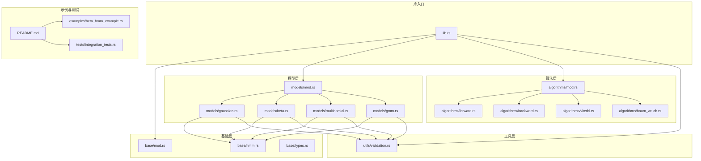
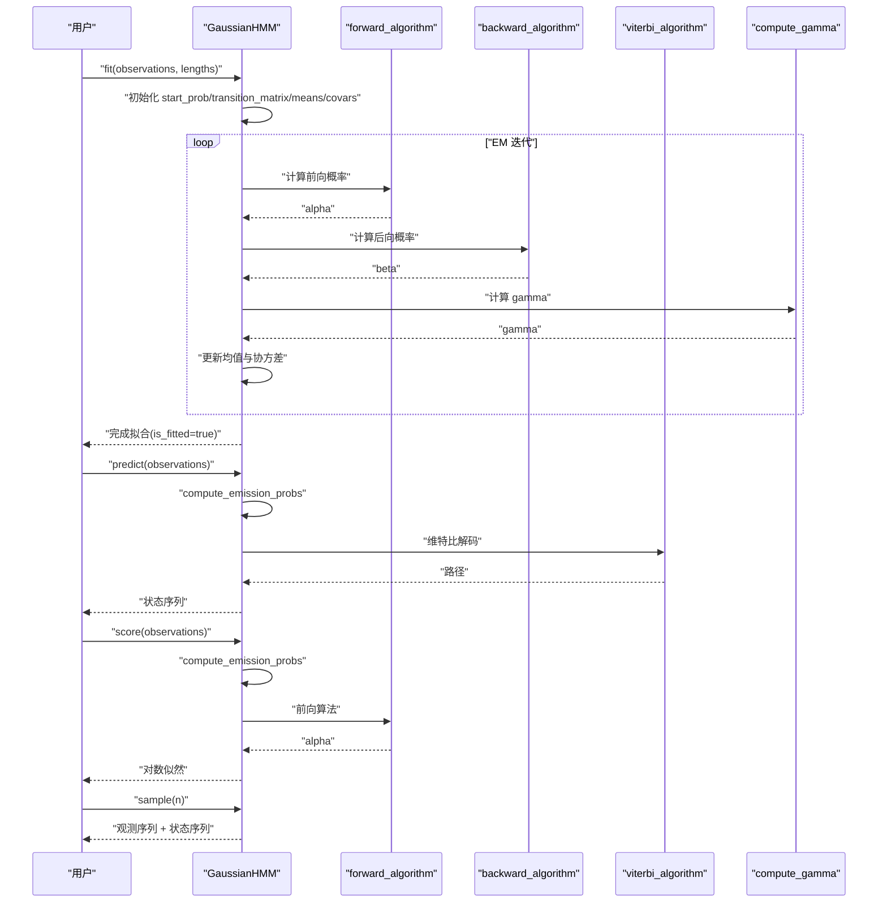
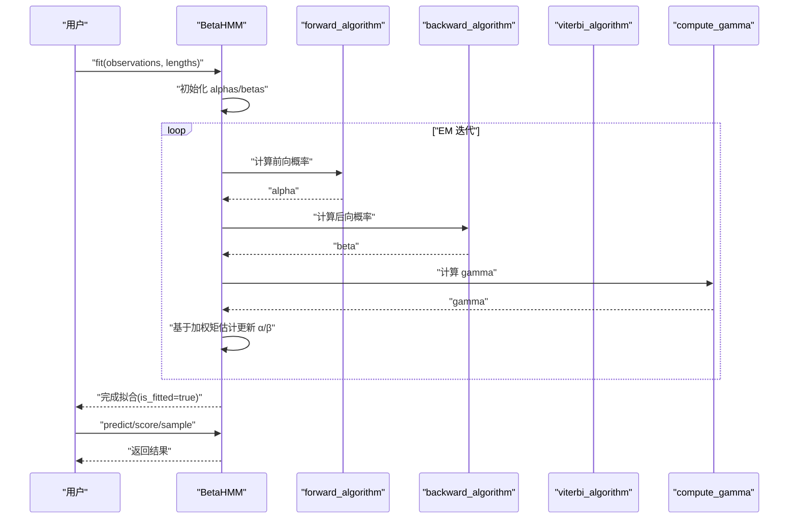
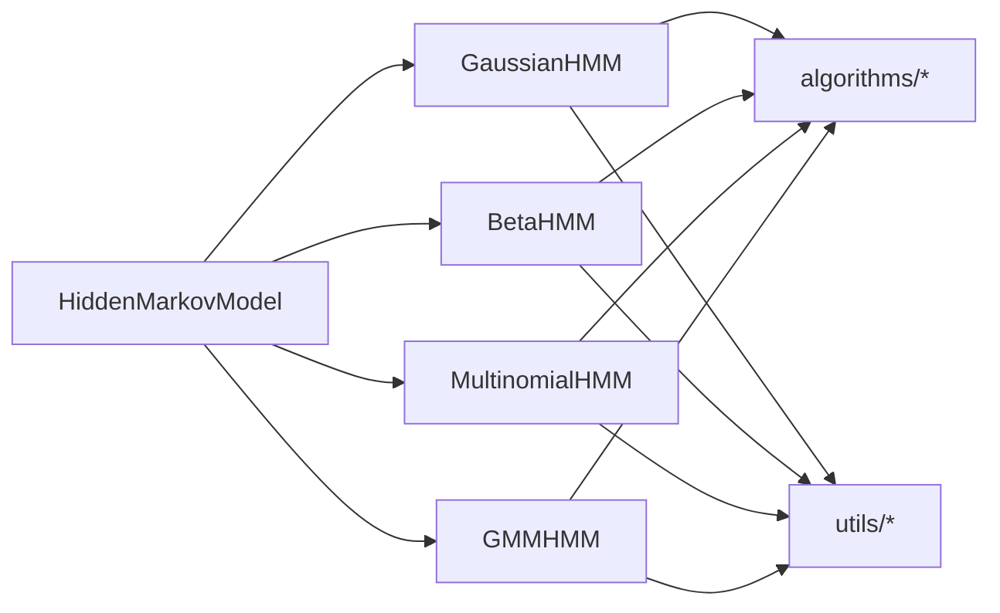

# 模型实现 API

<cite>
**本文引用的文件**
- [src/lib.rs](file://src/lib.rs)
- [src/models/mod.rs](file://src/models/mod.rs)
- [src/base/mod.rs](file://src/base/mod.rs)
- [src/base/hmm.rs](file://src/base/hmm.rs)
- [src/base/types.rs](file://src/base/types.rs)
- [src/models/gaussian.rs](file://src/models/gaussian.rs)
- [src/models/beta.rs](file://src/models/beta.rs)
- [src/models/multinomial.rs](file://src/models/multinomial.rs)
- [src/models/gmm.rs](file://src/models/gmm.rs)
- [src/algorithms/mod.rs](file://src/algorithms/mod.rs)
- [src/algorithms/forward.rs](file://src/algorithms/forward.rs)
- [src/algorithms/backward.rs](file://src/algorithms/backward.rs)
- [src/algorithms/viterbi.rs](file://src/algorithms/viterbi.rs)
- [src/algorithms/baum_welch.rs](file://src/algorithms/baum_welch.rs)
- [src/utils/validation.rs](file://src/utils/validation.rs)
- [examples/beta_hmm_example.rs](file://examples/beta_hmm_example.rs)
- [tests/integration_tests.rs](file://tests/integration_tests.rs)
- [README.md](file://README.md)
</cite>

## 目录
1. [简介](#简介)
2. [项目结构](#项目结构)
3. [核心组件](#核心组件)
4. [架构总览](#架构总览)
5. [详细组件分析](#详细组件分析)
6. [依赖关系分析](#依赖关系分析)
7. [性能考量](#性能考量)
8. [故障排查指南](#故障排查指南)
9. [结论](#结论)
10. [附录](#附录)

## 简介
本文件为 rhmm 库中 HMM 模型实现的完整 API 文档，覆盖以下模型与能力：
- GaussianHMM：高斯发射分布的连续值 HMM
- BetaHMM：Beta 发射分布的 [0,1] 区间数据 HMM
- GMMHMM（计划中）：高斯混合发射分布的复杂连续 HMM
- MultinomialHMM（计划中）：多项式发射分布的离散 HMM

内容包括：
- 构造函数与参数配置
- 核心方法与返回值
- 模型特有属性与方法（如协方差类型、Beta 参数等）
- 适用场景与使用限制
- 完整构造示例与参数调优建议
- 不同模型间的差异与选择标准

## 项目结构
该库采用模块化组织，核心接口由 trait 抽象，具体模型在 models 子模块中实现，算法与工具分别位于 algorithms 与 utils。

图表来源
- [src/lib.rs](file://src/lib.rs#L19-L28)
- [src/base/mod.rs](file://src/base/mod.rs#L1-L8)
- [src/models/mod.rs](file://src/models/mod.rs#L1-L12)
- [src/algorithms/mod.rs](file://src/algorithms/mod.rs#L1-L12)
- [src/utils/validation.rs](file://src/utils/validation.rs#L1-L141)
- [examples/beta_hmm_example.rs](file://examples/beta_hmm_example.rs#L1-L266)
- [tests/integration_tests.rs](file://tests/integration_tests.rs#L1-L103)
- [README.md](file://README.md#L1-L303)

章节来源
- [src/lib.rs](file://src/lib.rs#L1-L28)
- [README.md](file://README.md#L1-L303)

## 核心组件
- 核心 trait：HiddenMarkovModel，统一定义了 n_states、n_features、fit、predict、score、sample、decode 等方法签名与行为约束。
- 类型别名：TransitionMatrix、InitialProbs、Observations、States；枚举 CovarianceType 支持 Full、Diagonal、Spherical、Tied。
- 算法模块：forward、backward、viterbi、baum_welch 提供前向、后向、维特比解码与参数估计框架。
- 验证工具：validate_probability_vector、validate_transition_matrix、validate_observations 确保概率与观测维度合法。

章节来源
- [src/base/hmm.rs](file://src/base/hmm.rs#L6-L62)
- [src/base/types.rs](file://src/base/types.rs#L5-L30)
- [src/algorithms/mod.rs](file://src/algorithms/mod.rs#L1-L12)
- [src/utils/validation.rs](file://src/utils/validation.rs#L6-L74)

## 架构总览
下图展示模型与算法、验证工具之间的交互关系，以及模型如何实现统一的 HMM 接口。

```mermaid
classDiagram
class HiddenMarkovModel {
+n_states() usize
+n_features() usize
+fit(observations, lengths) Result
+predict(observations) Result
+score(observations) Result
+sample(n_samples) Result
+decode(observations) Result
}
class GaussianHMM {
-n_states : usize
-n_features : usize
-covariance_type : CovarianceType
-start_prob : Option
-transition_matrix : Option
-means : Option
-covars : Option
-is_fitted : bool
+new(n_states)
+with_covariance_type(n_states, cov_type)
+covariance_type() CovarianceType
+means() Option<&Array2>
+covars() Option<&Array2>
+transition_matrix() Option<&TransitionMatrix>
+start_prob() Option<&InitialProbs>
+is_fitted() bool
}
class BetaHMM {
-n_states : usize
-n_features : usize
-start_prob : Option
-transition_matrix : Option
-alphas : Option
-betas : Option
-is_fitted : bool
+new(n_states)
+alphas() Option<&Array2>
+betas() Option<&Array2>
+transition_matrix() Option<&TransitionMatrix>
+start_prob() Option<&InitialProbs>
+is_fitted() bool
+compute_means() Option<&Array2>
+compute_variances() Option<&Array2>
}
class MultinomialHMM {
-n_states : usize
-n_features : usize
-is_fitted : bool
+new(n_states, n_features)
}
class GMMHMM {
-n_states : usize
-n_features : usize
-n_mix : usize
-covariance_type : CovarianceType
-is_fitted : bool
+new(n_states, n_mix)
+n_mix() usize
}
class Forward {
+forward_algorithm(start_prob, trans_mat, emission_probs) Result
+forward_log_probability(start_prob, trans_mat, emission_probs) Result
}
class Backward {
+backward_algorithm(trans_mat, emission_probs) Result
}
class Viterbi {
+viterbi_algorithm(start_prob, trans_mat, emission_probs) Result
}
class BaumWelch {
+baum_welch(observations, start_prob, trans_mat, emission_probs, max_iter, tol) Result
+compute_gamma(alpha, beta) Result
}
class Validation {
+validate_probability_vector(probs, name) Result
+validate_transition_matrix(matrix) Result
+validate_observations(observations, expected_features) Result
}
GaussianHMM ..|> HiddenMarkovModel
BetaHMM ..|> HiddenMarkovModel
MultinomialHMM ..|> HiddenMarkovModel
GMMHMM ..|> HiddenMarkovModel
GaussianHMM --> Forward : "使用"
GaussianHMM --> Backward : "使用"
GaussianHMM --> Viterbi : "使用"
GaussianHMM --> BaumWelch : "使用"
BetaHMM --> Forward : "使用"
BetaHMM --> Backward : "使用"
BetaHMM --> Viterbi : "使用"
BetaHMM --> BaumWelch : "使用"
MultinomialHMM --> Forward : "占位"
MultinomialHMM --> Backward : "占位"
MultinomialHMM --> Viterbi : "占位"
GMMHMM --> Forward : "占位"
GMMHMM --> Backward : "占位"
GMMHMM --> Viterbi : "占位"
GaussianHMM --> Validation : "使用"
BetaHMM --> Validation : "使用"
MultinomialHMM --> Validation : "使用"
GMMHMM --> Validation : "使用"
```

图表来源
- [src/base/hmm.rs](file://src/base/hmm.rs#L6-L62)
- [src/models/gaussian.rs](file://src/models/gaussian.rs#L11-L32)
- [src/models/beta.rs](file://src/models/beta.rs#L24-L39)
- [src/models/multinomial.rs](file://src/models/multinomial.rs#L12-L17)
- [src/models/gmm.rs](file://src/models/gmm.rs#L11-L19)
- [src/algorithms/forward.rs](file://src/algorithms/forward.rs#L20-L47)
- [src/algorithms/backward.rs](file://src/algorithms/backward.rs#L19-L45)
- [src/algorithms/viterbi.rs](file://src/algorithms/viterbi.rs#L20-L74)
- [src/algorithms/baum_welch.rs](file://src/algorithms/baum_welch.rs#L25-L44)
- [src/utils/validation.rs](file://src/utils/validation.rs#L6-L74)

## 详细组件分析

### GaussianHMM（高斯发射分布）
- 构造与初始化
  - new(n_states)：创建指定隐藏状态数的模型，默认协方差类型为对角阵。
  - with_covariance_type(n_states, covariance_type)：指定协方差类型（Diagonal、Spherical、Full、Tied）。
- 关键参数与属性
  - n_states：隐藏状态数
  - n_features：观测特征维度（训练时自动推断）
  - covariance_type：协方差类型
  - start_prob、transition_matrix：初始状态概率与转移矩阵（可选，训练时自动初始化）
  - means、covars：每个状态的均值向量与协方差（或对角/球面协方差）
  - is_fitted：是否已完成拟合
- 核心方法
  - fit(observations, lengths=None)：基于 EM 的 Baum-Welch 训练，支持多序列（通过 lengths 切分）。
  - predict(observations)：维特比解码，返回最可能的状态序列。
  - score(observations)：计算对数似然。
  - sample(n_samples)：从已训练模型生成观测与状态序列。
  - decode(observations)：等价于 predict + score。
- 模型特性
  - 协方差类型影响发射密度计算：对角、球面、全协方差（当前简化实现按对角处理）。
  - 初始化采用随机选择观测与基于数据方差的最小方差约束。
  - E-M 迭代中使用 forward、backward、compute_gamma、compute_xi 更新参数。
- 使用限制与注意事项
  - 观测必须为连续值，且 n_features 在训练后固定。
  - 建议根据数据复杂度选择协方差类型：简单场景用 Diagonal，追求精度可用 Spherical 或 Full（注意数值稳定性）。
- 示例与调优
  - 参考 README 中的快速开始与多序列训练示例。
  - 调优建议：合理设置状态数；当数据噪声大时增加最小方差约束；多序列训练时正确提供 lengths。

图表来源
- [src/models/gaussian.rs](file://src/models/gaussian.rs#L337-L491)
- [src/algorithms/forward.rs](file://src/algorithms/forward.rs#L20-L47)
- [src/algorithms/backward.rs](file://src/algorithms/backward.rs#L19-L45)
- [src/algorithms/viterbi.rs](file://src/algorithms/viterbi.rs#L20-L74)
- [src/algorithms/baum_welch.rs](file://src/algorithms/baum_welch.rs#L56-L74)

章节来源
- [src/models/gaussian.rs](file://src/models/gaussian.rs#L11-L681)
- [README.md](file://README.md#L53-L87)

### BetaHMM（Beta 发射分布）
- 构造与初始化
  - new(n_states)：创建指定隐藏状态数的模型。
- 关键参数与属性
  - n_states、n_features：状态数与特征数（训练时自动推断）
  - start_prob、transition_matrix：初始与转移概率（可选，训练时自动初始化）
  - alphas、betas：每个状态每个特征的 Beta 分布形状参数（α、β）
  - is_fitted：是否已完成拟合
- 核心方法
  - fit(observations, lengths=None)：EM 训练，观测需满足 0 < x < 1。
  - predict(observations)：维特比解码。
  - score(observations)：计算对数似然。
  - sample(n_samples)：从 Beta 分布采样。
  - decode(observations)：等价于 predict + score。
  - compute_means()/compute_variances()：基于 α、β 计算均值与方差。
- 模型特性
  - 发射密度为独立特征的 Beta 分布乘积，使用对数形式避免数值下溢。
  - 参数初始化采用各状态样本的矩估计，若无样本则回退到整体统计。
  - xi 计算采用向量化广播以提升效率。
- 使用限制与注意事项
  - 观测必须严格在开区间 (0,1)，否则报错。
  - 当方差接近边界时，参数会进行最小值钳制以保证稳定性。
- 示例与调优
  - 参考示例程序中的电商转化率分析案例。
  - 调优建议：状态数与特征数应结合业务含义设定；当数据稀疏时，适当增大正则项（当前实现中已对参数与观测进行钳制与最小值约束）。

图表来源
- [src/models/beta.rs](file://src/models/beta.rs#L393-L547)
- [src/algorithms/forward.rs](file://src/algorithms/forward.rs#L20-L47)
- [src/algorithms/backward.rs](file://src/algorithms/backward.rs#L19-L45)
- [src/algorithms/viterbi.rs](file://src/algorithms/viterbi.rs#L20-L74)
- [src/algorithms/baum_welch.rs](file://src/algorithms/baum_welch.rs#L56-L74)

章节来源
- [src/models/beta.rs](file://src/models/beta.rs#L14-L734)
- [examples/beta_hmm_example.rs](file://examples/beta_hmm_example.rs#L15-L266)

### MultinomialHMM（多项式发射分布，计划中）
- 构造与初始化
  - new(n_states, n_features)：n_features 表示离散观测的类别数。
- 当前状态
  - 训练、预测、评分、采样均为占位实现，尚未完成。
- 使用限制与注意事项
  - 请勿在生产环境直接使用，等待后续版本实现。

章节来源
- [src/models/multinomial.rs](file://src/models/multinomial.rs#L8-L95)
- [README.md](file://README.md#L135-L139)

### GMMHMM（高斯混合发射分布，计划中）
- 构造与初始化
  - new(n_states, n_mix)：n_mix 为每个状态的混合成分数。
- 当前状态
  - 训练、预测、评分、采样均为占位实现，尚未完成。
- 使用限制与注意事项
  - 请勿在生产环境直接使用，等待后续版本实现。

章节来源
- [src/models/gmm.rs](file://src/models/gmm.rs#L8-L108)
- [README.md](file://README.md#L190-L193)

### 共同接口与算法
- HiddenMarkovModel 接口
  - 统一的 n_states、n_features、fit、predict、score、sample、decode 方法。
- 算法实现
  - forward_algorithm：前向概率矩阵
  - backward_algorithm：后向概率矩阵
  - viterbi_algorithm：维特比最优路径
  - compute_gamma：状态占用概率（用于 M 步更新）

章节来源
- [src/base/hmm.rs](file://src/base/hmm.rs#L6-L62)
- [src/algorithms/forward.rs](file://src/algorithms/forward.rs#L6-L69)
- [src/algorithms/backward.rs](file://src/algorithms/backward.rs#L6-L45)
- [src/algorithms/viterbi.rs](file://src/algorithms/viterbi.rs#L6-L74)
- [src/algorithms/baum_welch.rs](file://src/algorithms/baum_welch.rs#L46-L74)

## 依赖关系分析
- 模块耦合
  - 所有模型均实现 HiddenMarkovModel，内部依赖 algorithms 与 utils。
  - GaussianHMM 与 BetaHMM 对 CovarianceType 与观测维度校验有更强约束。
- 外部依赖
  - ndarray、ndarray-linalg、rand、rand_distr、thiserror、serde（见 README 依赖列表）。
- 循环依赖
  - 未发现循环导入；模块间通过 trait 与函数调用解耦。

图表来源
- [src/base/hmm.rs](file://src/base/hmm.rs#L6-L62)
- [src/models/gaussian.rs](file://src/models/gaussian.rs#L3-L10)
- [src/models/beta.rs](file://src/models/beta.rs#L3-L12)
- [src/models/multinomial.rs](file://src/models/multinomial.rs#L3-L6)
- [src/models/gmm.rs](file://src/models/gmm.rs#L3-L6)
- [src/algorithms/mod.rs](file://src/algorithms/mod.rs#L1-L12)
- [src/utils/validation.rs](file://src/utils/validation.rs#L1-L141)

章节来源
- [src/base/mod.rs](file://src/base/mod.rs#L1-L8)
- [src/models/mod.rs](file://src/models/mod.rs#L1-L12)
- [README.md](file://README.md#L44-L52)

## 性能考量
- 数值稳定性
  - 所有概率密度计算尽量使用对数形式，避免下溢。
  - 协方差类型选择影响计算复杂度与稳定性：Diagonal 最快，Spherical 次之，Full/Tied 当前简化实现按 Diagonal 处理。
- 向量化与内存
  - 使用 ndarray 进行数组操作，尽量减少中间拷贝。
  - 多序列训练时按长度切分，避免跨序列转移统计。
- 迭代收敛
  - Baum-Welch 默认最大迭代次数与容差可调，建议根据数据规模与噪声调整。

## 故障排查指南
- 常见错误与定位
  - 模型未拟合：调用 predict/score/sample 前必须先 fit。
  - 维度不匹配：n_features 必须与训练一致。
  - 观测非法：BetaHMM 要求 0 < x < 1；Multinomial/GMM 需要离散非负整数。
  - 概率向量/转移矩阵非法：概率应在 [0,1] 且行和为 1。
- 定位方法
  - 使用 validate_probability_vector、validate_transition_matrix、validate_observations 进行显式校验。
  - 查看单元测试与集成测试中的错误分支，复现问题场景。

章节来源
- [src/utils/validation.rs](file://src/utils/validation.rs#L6-L74)
- [tests/integration_tests.rs](file://tests/integration_tests.rs#L88-L102)

## 结论
- GaussianHMM 适合连续观测的多状态建模，支持多种协方差类型，训练稳定、可解释性强。
- BetaHMM 专为 [0,1] 比例/转化率等数据设计，参数具有明确的概率意义，适合比例类时间序列。
- MultinomialHMM 与 GMMHMM 当前为计划实现，将在后续版本提供离散与复杂连续分布的能力。
- 选择建议：连续观测优先考虑 GaussianHMM；比例/转化率数据优先 BetaHMM；离散分类数据等待 MultinomialHMM；复杂连续分布等待 GMMHMM。

## 附录

### 参数与方法速查表
- GaussianHMM
  - 构造：new(n_states)、with_covariance_type(n_states, covariance_type)
  - 属性：n_states、n_features、covariance_type、start_prob、transition_matrix、means、covars、is_fitted
  - 方法：fit、predict、score、sample、decode
- BetaHMM
  - 构造：new(n_states)
  - 属性：n_states、n_features、start_prob、transition_matrix、alphas、betas、is_fitted
  - 方法：fit、predict、score、sample、decode、compute_means、compute_variances
- MultinomialHMM（计划中）
  - 构造：new(n_states, n_features)
  - 方法：fit/predict/score/sample（占位）
- GMMHMM（计划中）
  - 构造：new(n_states, n_mix)
  - 方法：fit/predict/score/sample（占位）

章节来源
- [src/models/gaussian.rs](file://src/models/gaussian.rs#L34-L100)
- [src/models/beta.rs](file://src/models/beta.rs#L41-L89)
- [src/models/multinomial.rs](file://src/models/multinomial.rs#L19-L33)
- [src/models/gmm.rs](file://src/models/gmm.rs#L21-L42)
- [README.md](file://README.md#L141-L194)