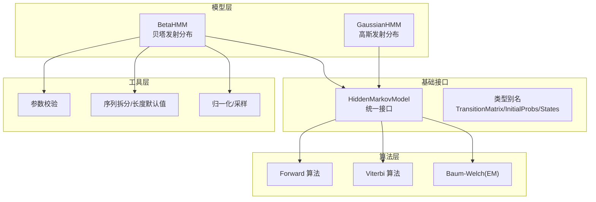
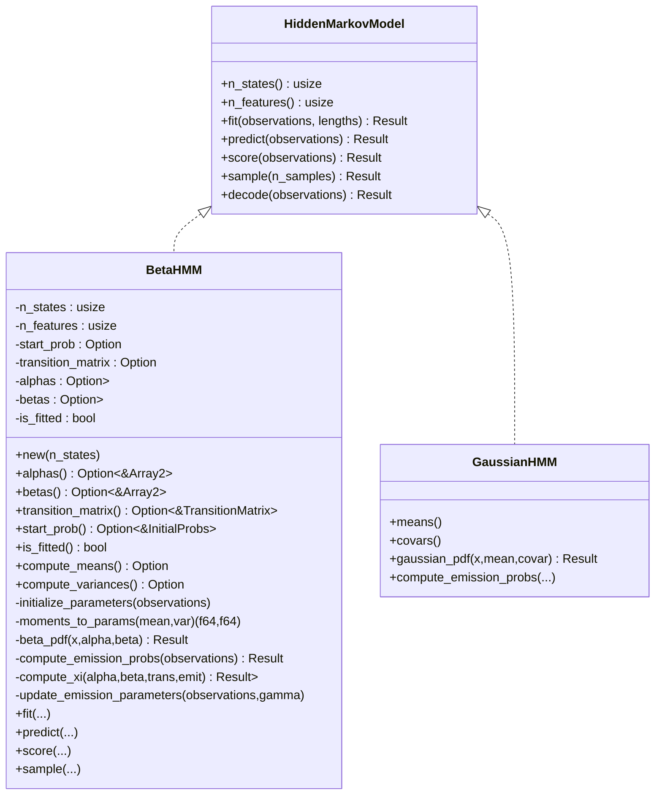
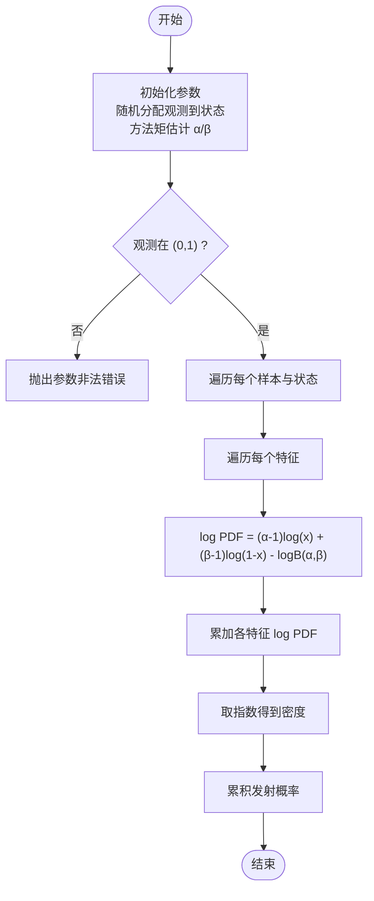
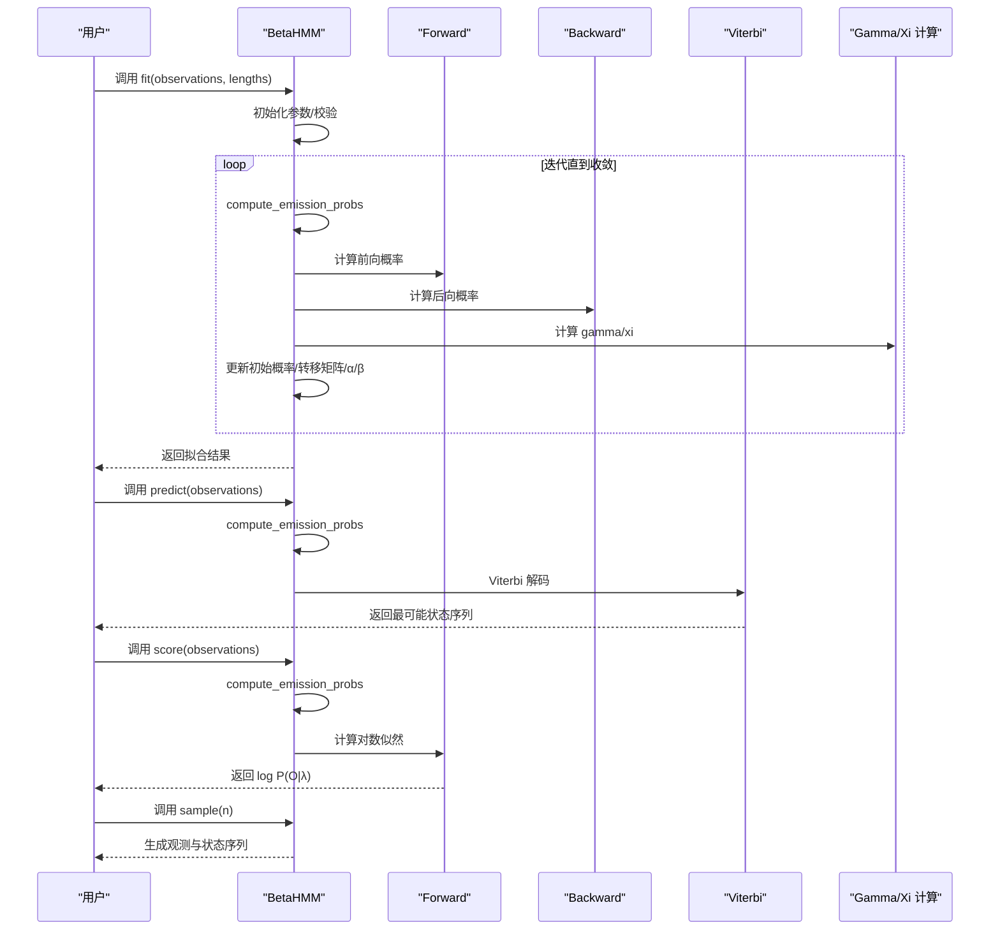
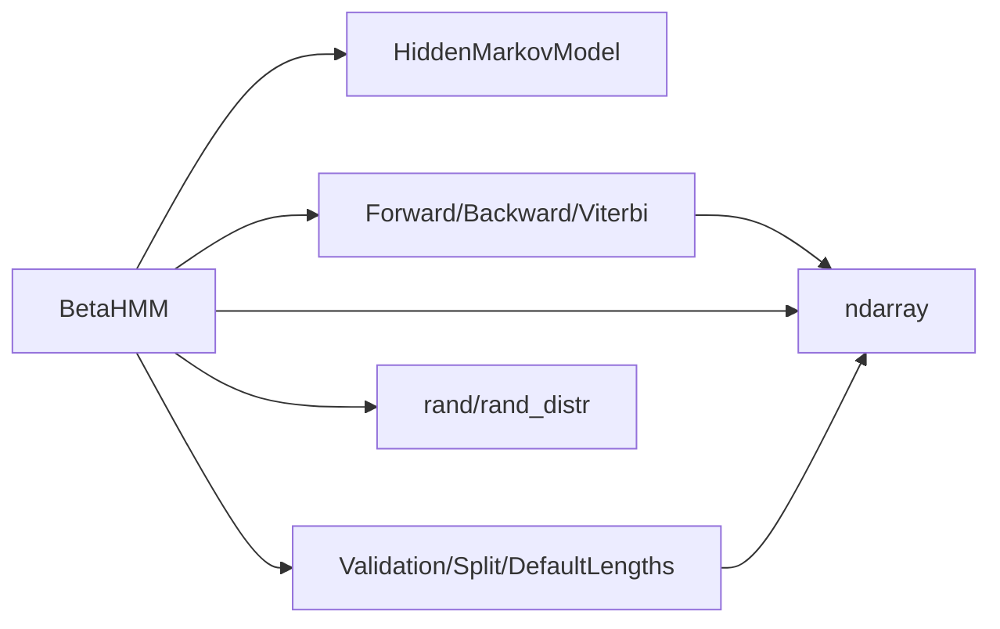

# 贝塔 HMM API

<cite>
**本文引用的文件列表**
- [src/lib.rs](file://src/lib.rs)
- [src/models/beta.rs](file://src/models/beta.rs)
- [src/base/hmm.rs](file://src/base/hmm.rs)
- [src/base/types.rs](file://src/base/types.rs)
- [src/algorithms/mod.rs](file://src/algorithms/mod.rs)
- [src/algorithms/forward.rs](file://src/algorithms/forward.rs)
- [src/algorithms/viterbi.rs](file://src/algorithms/viterbi.rs)
- [src/utils/validation.rs](file://src/utils/validation.rs)
- [src/utils/mod.rs](file://src/utils/mod.rs)
- [examples/beta_hmm_example.rs](file://examples/beta_hmm_example.rs)
- [README.md](file://README.md)
</cite>

## 目录
1. [简介](#简介)
2. [项目结构](#项目结构)
3. [核心组件](#核心组件)
4. [架构总览](#架构总览)
5. [详细组件分析](#详细组件分析)
6. [依赖关系分析](#依赖关系分析)
7. [性能考量](#性能考量)
8. [故障排查指南](#故障排查指南)
9. [结论](#结论)
10. [附录：使用示例与最佳实践](#附录使用示例与最佳实践)

## 简介
本文件为贝塔隐马尔可夫模型（Beta HMM）的完整 API 文档。重点覆盖：
- BetaHMM 结构体的公共方法与属性
- 构造函数与参数初始化策略
- 贝塔分布发射概率的特性与适用场景（用于 [0,1] 比例/概率数据）
- 核心属性与方法：参数初始化、贝塔 PDF 计算、参数估计（EM 算法）、预测、评分、采样
- 与高斯 HMM 的对比分析
- 完整使用示例与最佳实践

## 项目结构
该仓库采用模块化组织，核心模块如下：
- models：模型定义（BetaHMM、GaussianHMM、GMM、Multinomial）
- base：通用 trait 与类型别名（HiddenMarkovModel、CovarianceType 等）
- algorithms：标准 HMM 算法（Forward、Backward、Viterbi、Baum-Welch）
- utils：验证、序列拆分、归一化、采样等工具
- examples：示例程序（含贝塔 HMM 使用示例）

图表来源
- [src/models/beta.rs](file://src/models/beta.rs#L1-L734)
- [src/base/hmm.rs](file://src/base/hmm.rs#L1-L62)
- [src/base/types.rs](file://src/base/types.rs#L1-L61)
- [src/algorithms/mod.rs](file://src/algorithms/mod.rs#L1-L12)
- [src/utils/mod.rs](file://src/utils/mod.rs#L1-L12)

章节来源
- [src/lib.rs](file://src/lib.rs#L1-L28)
- [README.md](file://README.md#L1-L303)

## 核心组件
- BetaHMM：基于贝塔分布的发射概率的隐马尔可夫模型，适用于 [0,1] 区间的比例/概率数据。
- HiddenMarkovModel：所有 HMM 模型必须实现的统一接口，包含 fit/predict/score/sample 等方法。
- 类型别名：TransitionMatrix、InitialProbs、Observations、States 等，提升代码一致性与可读性。
- 算法模块：Forward、Backward、Viterbi、Baum-Welch（EM）等标准算法。
- 工具模块：参数校验、序列拆分、默认长度、归一化与采样等。

章节来源
- [src/models/beta.rs](file://src/models/beta.rs#L1-L734)
- [src/base/hmm.rs](file://src/base/hmm.rs#L1-L62)
- [src/base/types.rs](file://src/base/types.rs#L1-L61)
- [src/algorithms/mod.rs](file://src/algorithms/mod.rs#L1-L12)
- [src/utils/mod.rs](file://src/utils/mod.rs#L1-L12)

## 架构总览
BetaHMM 实现了 HiddenMarkovModel 接口，内部通过 Forward/Viterbi 算法完成推理，通过 Baum-Welch（EM）进行参数估计。观测数据维度在 fit 阶段确定，贝塔 PDF 在每个状态与特征上独立计算，参数更新采用加权矩估计。

图表来源
- [src/base/hmm.rs](file://src/base/hmm.rs#L1-L62)
- [src/models/beta.rs](file://src/models/beta.rs#L1-L734)
- [src/models/gaussian.rs](file://src/models/gaussian.rs#L1-L200)

## 详细组件分析

### BetaHMM 结构体与公共 API
- 构造函数
  - new(n_states)：创建指定隐藏状态数的 BetaHMM，默认 n_features=0，未拟合。
- 属性访问器
  - alphas()/betas()：返回各状态-特征的贝塔形状参数。
  - transition_matrix()/start_prob()：返回转移矩阵与初始概率向量。
  - is_fitted()：判断模型是否已拟合。
- 辅助计算
  - compute_means()：按 α/(α+β) 计算每状态每特征的期望。
  - compute_variances()：按 (αβ)/((α+β)^2*(α+β+1)) 计算方差。
- 关键内部方法
  - initialize_parameters(observations)：基于方法矩估计初始化 α/β。
  - moments_to_params(mean,var)：从均值与方差映射到 α/β。
  - beta_pdf(x,alpha,beta)：对每个特征计算贝塔 PDF 并求乘积；使用 log 空间避免数值下溢。
  - compute_emission_probs(observations)：逐样本逐状态计算发射概率，强制观测在 (0,1)。
  - compute_xi(...)：计算转移相关的联合概率（xi），用于 M 步统计。
  - update_emission_parameters(...)：基于权重后的均值与方差更新 α/β。
- 统一接口实现
  - fit(observations, lengths)：EM/Baum-Welch 训练，支持多序列；收敛阈值与迭代上限固定。
  - predict(observations)：Viterbi 解码。
  - score(observations)：Forward 计算对数似然。
  - sample(n_samples)：从模型生成观测与状态序列。

章节来源
- [src/models/beta.rs](file://src/models/beta.rs#L14-L383)
- [src/base/hmm.rs](file://src/base/hmm.rs#L7-L61)

### 参数初始化与贝塔 PDF 计算
- 初始化策略
  - 若未设置初始参数，则随机分配观测到各状态，按各状态子集的均值与方差用方法矩估计得到 α/β；若某状态无观测，则退回到整体统计。
- 贝塔 PDF
  - 对每个特征独立计算 (x^(α-1)*(1-x)^(β-1))/B(α,β)，并以 log 空间稳定计算，最后指数还原。
  - 观测值被夹紧到 (1e-10, 1-1e-10)，参数夹紧到 [1e-6, +∞)，避免边界问题。
- 均值/方差
  - 均值：α/(α+β)
  - 方差：(αβ)/((α+β)^2*(α+β+1))

图表来源
- [src/models/beta.rs](file://src/models/beta.rs#L126-L197)
- [src/models/beta.rs](file://src/models/beta.rs#L227-L286)

章节来源
- [src/models/beta.rs](file://src/models/beta.rs#L126-L197)
- [src/models/beta.rs](file://src/models/beta.rs#L227-L286)

### 参数估计流程（EM/Baum-Welch）
- E 步：计算发射概率、Forward/Backward 概率，得到 γ（状态占用概率）与 xi（转移联合概率）。
- M 步：更新
  - 初始概率：按首步 γ 归一化
  - 转移矩阵：按各起点的 xi 归一化
  - 发射参数（α/β）：对每个状态 i，计算加权均值与方差，再映射到 α/β
- 收敛：当对数似然增量小于阈值时停止；最大迭代次数固定。

图表来源
- [src/models/beta.rs](file://src/models/beta.rs#L393-L668)
- [src/algorithms/forward.rs](file://src/algorithms/forward.rs#L20-L47)
- [src/algorithms/viterbi.rs](file://src/algorithms/viterbi.rs#L20-L74)

章节来源
- [src/models/beta.rs](file://src/models/beta.rs#L393-L668)
- [src/algorithms/forward.rs](file://src/algorithms/forward.rs#L20-L47)
- [src/algorithms/viterbi.rs](file://src/algorithms/viterbi.rs#L20-L74)

### 预测、评分与采样
- predict：先计算发射概率，再调用 Viterbi 得到最可能状态序列。
- score：先计算发射概率，再调用 Forward 得到对数似然。
- sample：按初始概率选择首个状态与观测，随后按转移概率与贝塔分布逐步生成观测与状态。

章节来源
- [src/models/beta.rs](file://src/models/beta.rs#L549-L668)
- [src/algorithms/viterbi.rs](file://src/algorithms/viterbi.rs#L20-L74)
- [src/algorithms/forward.rs](file://src/algorithms/forward.rs#L60-L69)

### 与高斯 HMM 的对比
- 数据范围
  - Beta HMM：发射分布为贝塔，适合 [0,1] 比例/概率数据（如转化率、份额、成功率）。
  - Gaussian HMM：发射分布为高斯，适合连续实值数据（如语音特征、传感器读数）。
- 分布参数
  - Beta HMM：按状态与特征分别估计 α/β；可通过均值与方差稳定映射。
  - Gaussian HMM：按状态估计均值与协方差（支持对角/球面/全协方差等类型）。
- 数值稳定性
  - 两者均采用 log 空间计算以增强数值稳定性。
- 适用场景
  - Beta HMM：市场份额、点击率、转化率、质量控制中的成功比例。
  - Gaussian HMM：语音识别、金融时间序列、生物信息学特征建模。

章节来源
- [README.md](file://README.md#L121-L139)
- [src/models/gaussian.rs](file://src/models/gaussian.rs#L11-L194)
- [src/base/types.rs](file://src/base/types.rs#L18-L29)

## 依赖关系分析
- 模块耦合
  - BetaHMM 强依赖 HiddenMarkovModel 接口与算法模块（Forward/Backward/Viterbi）。
  - 参数校验与序列处理由 utils 提供，保证输入合法性与多序列支持。
- 外部依赖
  - ndarray：数组运算与线性代数。
  - rand/rand_distr：随机数与概率分布采样。
  - thiserror：错误类型与传播。
- 可能的循环依赖
  - 当前模块划分清晰，未发现循环导入。

图表来源
- [src/models/beta.rs](file://src/models/beta.rs#L3-L12)
- [src/algorithms/mod.rs](file://src/algorithms/mod.rs#L1-L12)
- [src/utils/mod.rs](file://src/utils/mod.rs#L1-L12)

章节来源
- [src/models/beta.rs](file://src/models/beta.rs#L3-L12)
- [src/algorithms/mod.rs](file://src/algorithms/mod.rs#L1-L12)
- [src/utils/mod.rs](file://src/utils/mod.rs#L1-L12)

## 性能考量
- 向量化与日志空间：发射概率与参数更新广泛使用向量化与 log 空间，降低数值误差与提升速度。
- 内存复用：在 E 步中累积统计量（初始概率、转移计数、γ、xi），避免重复分配。
- 收敛控制：固定最大迭代次数与对数似然阈值，平衡精度与速度。
- 建议
  - 多序列训练时提供明确的 lengths，减少不必要的序列拆分。
  - 观测数据尽量标准化至 [0,1] 区间，确保贝塔分布适用性。

[本节为一般性指导，不直接分析具体文件]

## 故障排查指南
- 模型未拟合错误
  - 现象：predict/score/sample 前未 fit 或 fit 失败。
  - 处理：先调用 fit，确认 is_fitted 为真。
- 观测范围非法
  - 现象：观测不在 (0,1)。
  - 处理：将数据归一化到 (0,1) 区间，或改用高斯 HMM。
- 维度不匹配
  - 现象：n_features 与观测列数不一致。
  - 处理：确保 fit 与后续调用的观测维度一致。
- 参数初始化失败
  - 现象：某些状态无观测导致初始化异常。
  - 处理：提供足够样本，或手动设置初始参数（当前实现会回退到整体统计）。

章节来源
- [src/models/beta.rs](file://src/models/beta.rs#L126-L145)
- [src/models/beta.rs](file://src/models/beta.rs#L549-L600)
- [src/utils/validation.rs](file://src/utils/validation.rs#L58-L74)

## 结论
BetaHMM 提供了面向 [0,1] 比例/概率数据的稳健建模能力，通过 EM/Baum-Welch 实现参数估计，结合 Forward/Viterbi 完成推理与解码。其 API 设计遵循统一接口，便于与其他模型（如高斯 HMM）进行对比与组合使用。在实际应用中，应关注观测范围、参数初始化与收敛控制，以获得更优的拟合效果。

[本节为总结性内容，不直接分析具体文件]

## 附录：使用示例与最佳实践
- 示例程序
  - 贝塔 HMM 示例展示了电商转化率分析的完整流程：数据准备、模型训练、参数解读、状态预测、评分与采样。
- 最佳实践
  - 数据预处理：确保观测在 (0,1) 区间；必要时使用归一化或单调变换。
  - 模型选择：若数据为连续实值，优先考虑高斯 HMM；若为比例/概率，优先考虑 Beta HMM。
  - 多序列训练：提供 lengths 明确序列边界，提高训练稳定性。
  - 参数解释：通过 compute_means/compute_variances 查看每状态的期望与离散程度，辅助业务解读。
  - 评估与可视化：使用 score 获取对数似然，结合 predict 结果进行业务解释与趋势分析。

章节来源
- [examples/beta_hmm_example.rs](file://examples/beta_hmm_example.rs#L1-L266)
- [README.md](file://README.md#L89-L119)