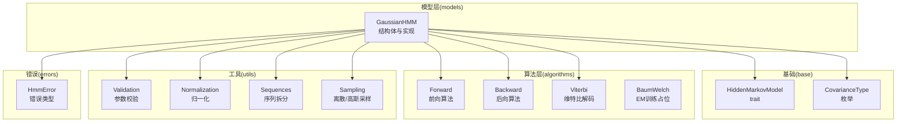
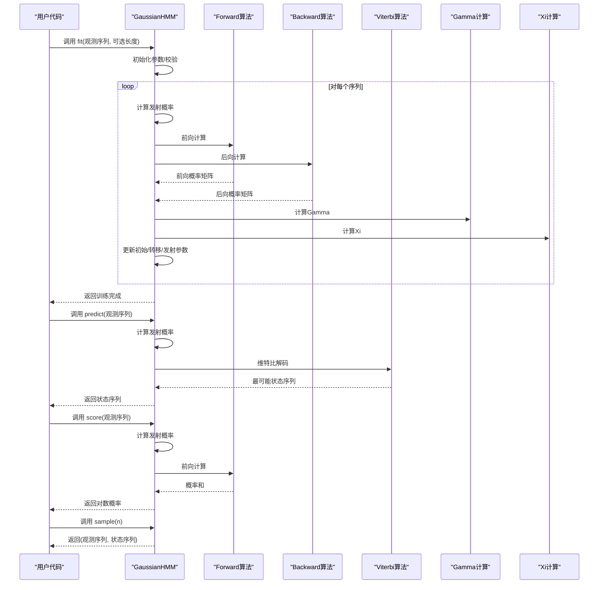
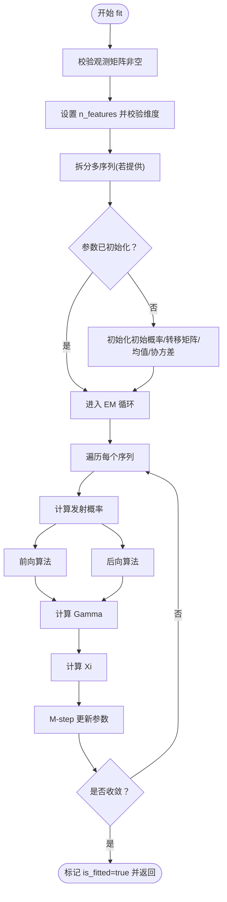
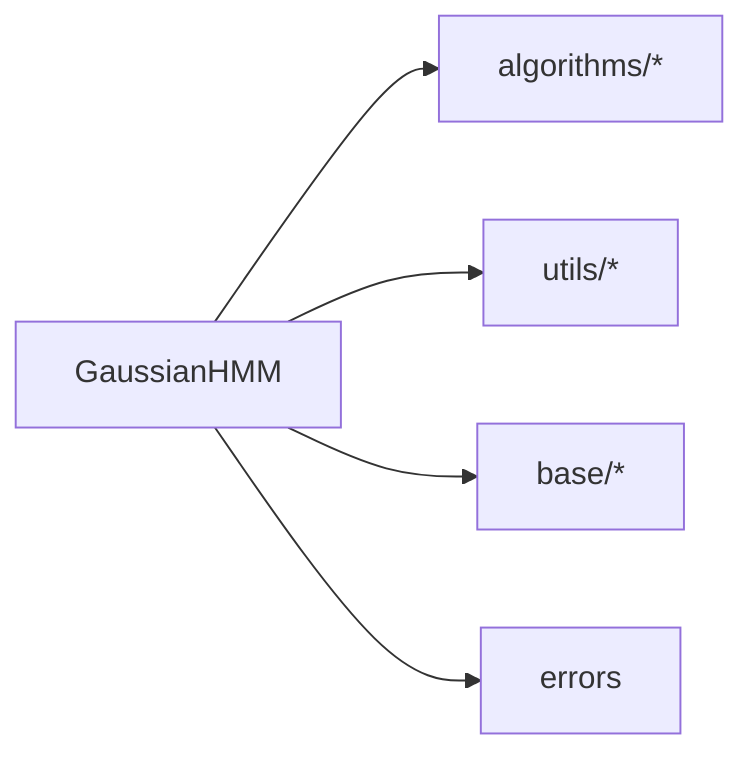

# 高斯 HMM API

<cite>
**本文引用的文件**
- [src/lib.rs](file://src/lib.rs)
- [src/models/gaussian.rs](file://src/models/gaussian.rs)
- [src/base/types.rs](file://src/base/types.rs)
- [src/base/hmm.rs](file://src/base/hmm.rs)
- [src/algorithms/forward.rs](file://src/algorithms/forward.rs)
- [src/algorithms/backward.rs](file://src/algorithms/backward.rs)
- [src/algorithms/viterbi.rs](file://src/algorithms/viterbi.rs)
- [src/algorithms/baum_welch.rs](file://src/algorithms/baum_welch.rs)
- [src/utils/validation.rs](file://src/utils/validation.rs)
- [src/utils/normalization.rs](file://src/utils/normalization.rs)
- [src/utils/sequences.rs](file://src/utils/sequences.rs)
- [src/utils/sampling.rs](file://src/utils/sampling.rs)
- [src/errors.rs](file://src/errors.rs)
- [README.md](file://README.md)
</cite>

## 目录
1. [简介](#简介)
2. [项目结构](#项目结构)
3. [核心组件](#核心组件)
4. [架构总览](#架构总览)
5. [详细组件分析](#详细组件分析)
6. [依赖关系分析](#依赖关系分析)
7. [性能考量](#性能考量)
8. [故障排查指南](#故障排查指南)
9. [结论](#结论)
10. [附录](#附录)

## 简介
本文件为高斯隐马尔可夫模型（Gaussian HMM）的完整 API 文档，面向希望在 Rust 中使用高斯 HMM 进行建模与推理的开发者。文档覆盖以下内容：
- GaussianHMM 结构体的公共方法与属性
- 构造函数 new() 与 with_covariance_type() 的用法
- 协方差类型 CovarianceType 的选项与差异
- 核心属性：n_states、n_features、covariance_type、means、covars 等
- 训练方法 fit() 的流程：参数初始化、Baum-Welch 算法、收敛判断
- 预测 predict()、评分 score()、采样 sample() 的使用方式与返回值
- 参数校验规则与错误处理机制
- 实际使用示例（以路径代替具体代码）

## 项目结构
该库采用模块化组织，按功能分层：
- models：模型实现（如 GaussianHMM）
- base：通用类型与核心 trait（HiddenMarkovModel、CovarianceType）
- algorithms：算法实现（Forward、Backward、Viterbi、Baum-Welch）
- utils：工具模块（校验、归一化、序列拆分、采样）
- errors：统一错误类型定义
- lib.rs：对外 re-export 与模块入口

图表来源
- [src/models/gaussian.rs](file://src/models/gaussian.rs#L1-L681)
- [src/base/hmm.rs](file://src/base/hmm.rs#L1-L62)
- [src/base/types.rs](file://src/base/types.rs#L1-L61)
- [src/algorithms/forward.rs](file://src/algorithms/forward.rs#L1-L129)
- [src/algorithms/backward.rs](file://src/algorithms/backward.rs#L1-L90)
- [src/algorithms/viterbi.rs](file://src/algorithms/viterbi.rs#L1-L118)
- [src/algorithms/baum_welch.rs](file://src/algorithms/baum_welch.rs#L1-L75)
- [src/utils/validation.rs](file://src/utils/validation.rs#L1-L141)
- [src/utils/normalization.rs](file://src/utils/normalization.rs#L1-L102)
- [src/utils/sequences.rs](file://src/utils/sequences.rs#L1-L153)
- [src/utils/sampling.rs](file://src/utils/sampling.rs#L1-L130)
- [src/errors.rs](file://src/errors.rs#L1-L105)

章节来源
- [src/lib.rs](file://src/lib.rs#L1-L28)
- [README.md](file://README.md#L1-L303)

## 核心组件
- GaussianHMM：高斯 HMM 的具体实现，遵循 HiddenMarkovModel trait，提供训练、预测、评分、采样能力。
- HiddenMarkovModel：所有 HMM 模型必须实现的 trait，定义了 n_states、n_features、fit、predict、score、sample、decode 等接口。
- CovarianceType：协方差类型枚举，支持 Full、Diagonal、Spherical、Tied 四种。

章节来源
- [src/models/gaussian.rs](file://src/models/gaussian.rs#L1-L681)
- [src/base/hmm.rs](file://src/base/hmm.rs#L1-L62)
- [src/base/types.rs](file://src/base/types.rs#L1-L61)

## 架构总览
下图展示了 GaussianHMM 在训练与推理阶段的关键交互：

图表来源
- [src/models/gaussian.rs](file://src/models/gaussian.rs#L337-L612)
- [src/algorithms/forward.rs](file://src/algorithms/forward.rs#L20-L69)
- [src/algorithms/backward.rs](file://src/algorithms/backward.rs#L19-L45)
- [src/algorithms/viterbi.rs](file://src/algorithms/viterbi.rs#L20-L74)
- [src/algorithms/baum_welch.rs](file://src/algorithms/baum_welch.rs#L25-L44)

## 详细组件分析

### GaussianHMM 结构体与公共 API
- 字段
  - n_states：隐藏状态数
  - n_features：特征维度
  - covariance_type：协方差类型
  - start_prob：初始状态概率
  - transition_matrix：状态转移矩阵
  - means：各状态均值（n_states × n_features）
  - covars：各状态协方差（n_states × n_features 或按协方差类型变化）
  - is_fitted：是否已完成训练
- 公共方法
  - new(n_states)：创建新模型，未设置特征维度与协方差类型
  - with_covariance_type(n_states, covariance_type)：指定协方差类型
  - covariance_type()：读取当前协方差类型
  - means()、covars()、transition_matrix()、start_prob()：读取已训练参数
  - is_fitted()：检查是否已训练
  - fit(observations, lengths)：训练模型（EM/Baum-Welch）
  - predict(observations)：维特比解码，返回最可能状态序列
  - score(observations)：返回对数概率
  - sample(n_samples)：从模型生成观测与状态序列

章节来源
- [src/models/gaussian.rs](file://src/models/gaussian.rs#L14-L100)
- [src/models/gaussian.rs](file://src/models/gaussian.rs#L328-L612)

### 协方差类型 CovarianceType
- 枚举项
  - Full：全协方差矩阵（当前简化实现按对角处理）
  - Diagonal：对角协方差（默认）
  - Spherical：球面协方差（单个方差）
  - Tied：所有状态共享同一协方差（当前简化实现按对角处理）
- 默认值：Diagonal
- 影响范围：gaussian_pdf() 内部根据类型选择不同计算路径；训练时 update_emission_parameters() 更新对角元素

章节来源
- [src/base/types.rs](file://src/base/types.rs#L17-L29)

### 训练流程 fit()
- 输入校验
  - 观测矩阵非空且列数为 n_features
  - 若已有 n_features，则校验观测列数一致
- 序列处理
  - 支持多序列：通过 lengths 拆分为独立序列
  - 默认单序列：将整段作为单一序列
- 参数初始化
  - 初始概率：均匀分布
  - 转移矩阵：均匀分布
  - 均值与协方差：基于数据的简单初始化（随机样本与全局方差）
- E-M 步骤
  - E-step：计算发射概率、前向/后向概率、Gamma、Xi
  - M-step：更新初始概率、转移矩阵、均值与协方差
- 收敛判断
  - 最大迭代次数与对数似然增量阈值

图表来源
- [src/models/gaussian.rs](file://src/models/gaussian.rs#L337-L491)
- [src/utils/sequences.rs](file://src/utils/sequences.rs#L53-L70)
- [src/algorithms/forward.rs](file://src/algorithms/forward.rs#L20-L47)
- [src/algorithms/backward.rs](file://src/algorithms/backward.rs#L19-L45)
- [src/algorithms/baum_welch.rs](file://src/algorithms/baum_welch.rs#L25-L44)

章节来源
- [src/models/gaussian.rs](file://src/models/gaussian.rs#L337-L491)
- [src/utils/sequences.rs](file://src/utils/sequences.rs#L1-L153)

### 预测 predict() 与评分 score()
- predict()
  - 要求模型已训练
  - 校验观测列数等于 n_features
  - 计算发射概率，调用 Viterbi 算法得到最可能状态序列
- score()
  - 要求模型已训练
  - 校验观测列数等于 n_features
  - 计算发射概率，调用前向算法，返回对数概率

章节来源
- [src/models/gaussian.rs](file://src/models/gaussian.rs#L493-L544)
- [src/algorithms/viterbi.rs](file://src/algorithms/viterbi.rs#L20-L74)
- [src/algorithms/forward.rs](file://src/algorithms/forward.rs#L60-L69)

### 采样 sample()
- 要求模型已训练
- 从初始状态按 start_prob 抽样首个状态与观测
- 后续每步：按转移矩阵抽样下一个状态，再按对应均值/标准差的高斯分布抽样观测
- 返回观测矩阵与状态序列

章节来源
- [src/models/gaussian.rs](file://src/models/gaussian.rs#L546-L612)
- [src/utils/sampling.rs](file://src/utils/sampling.rs#L51-L70)

### 发射概率与高斯 PDF
- compute_emission_probs()
  - 对每个时间步与每个状态，计算高斯密度
- gaussian_pdf()
  - Diagonal：逐维计算对角协方差密度
  - Spherical：单方差球面模型
  - Full/Tied：当前简化实现按对角处理（完整实现需矩阵运算）

章节来源
- [src/models/gaussian.rs](file://src/models/gaussian.rs#L102-L194)

### 参数初始化与更新
- initialize_parameters()
  - 均值：随机选取观测样本
  - 协方差：按特征维度计算全局方差并复制到各状态
- update_emission_parameters()
  - 均值：按 Gamma 权重的加权平均
  - 协方差：按 Gamma 权重的加权方差（最小值保护）

章节来源
- [src/models/gaussian.rs](file://src/models/gaussian.rs#L196-L325)

### 核心 trait 与类型别名
- HiddenMarkovModel
  - n_states()、n_features()、fit()、predict()、score()、sample()、decode()
- 类型别名
  - TransitionMatrix、InitialProbs、Observations、States
- CovarianceType
  - Full、Diagonal（默认）、Spherical、Tied

章节来源
- [src/base/hmm.rs](file://src/base/hmm.rs#L1-L62)
- [src/base/types.rs](file://src/base/types.rs#L1-L61)

## 依赖关系分析
- GaussianHMM 依赖
  - algorithms：Forward、Backward、Viterbi、Gamma 计算
  - utils：参数校验、序列拆分、归一化、采样
  - base：CovarianceType、HiddenMarkovModel、类型别名
  - errors：统一错误类型
- 模块内聚性高，跨模块耦合清晰，无循环依赖迹象

图表来源
- [src/models/gaussian.rs](file://src/models/gaussian.rs#L1-L10)
- [src/base/hmm.rs](file://src/base/hmm.rs#L1-L62)
- [src/base/types.rs](file://src/base/types.rs#L1-L61)
- [src/errors.rs](file://src/errors.rs#L1-L105)

章节来源
- [src/models/gaussian.rs](file://src/models/gaussian.rs#L1-L10)
- [src/lib.rs](file://src/lib.rs#L19-L27)

## 性能考量
- 使用 ndarray 进行向量化操作，减少内存分配
- 多序列训练时按序列边界累积统计，避免跨序列信息泄露
- 对数空间计算与归一化，提升数值稳定性
- 当前 Full/Tied 协方差类型采用对角近似，避免矩阵求逆开销

## 故障排查指南
- 训练前未设置特征维度或维度不匹配
  - 现象：fit() 返回维度不匹配错误
  - 处理：确保观测列数与模型 n_features 一致，或先 fit 再检查 n_features
- 模型未训练即调用 predict/score/sample
  - 现象：返回“模型未训练”错误
  - 处理：先 fit() 再进行推理
- 观测为空或列数为 0
  - 现象：fit() 返回无效参数错误
  - 处理：检查输入数据形状
- 初始概率/转移矩阵非法
  - 现象：概率向量或转移矩阵校验失败
  - 处理：确保概率和为 1 且落入 [0,1] 区间
- 协方差类型与数据分布不匹配
  - 现象：对角近似导致拟合效果欠佳
  - 处理：尝试 Diagonal/Spherical；Full/Tied 当前简化实现建议谨慎使用

章节来源
- [src/models/gaussian.rs](file://src/models/gaussian.rs#L337-L544)
- [src/utils/validation.rs](file://src/utils/validation.rs#L58-L74)
- [src/errors.rs](file://src/errors.rs#L10-L34)

## 结论
本库提供了完整的高斯 HMM 能力：灵活的协方差类型、稳定的训练流程、高效的推理算法与完善的错误处理。对于连续观测数据，推荐优先使用 Diagonal 协方差；若追求更少参数可考虑 Spherical；Full/Tied 当前为对角近似，适合进一步扩展实现。

## 附录

### API 一览（方法与用途）
- 构造
  - new(n_states)：创建模型
  - with_covariance_type(n_states, covariance_type)：指定协方差类型
- 属性访问
  - covariance_type()、means()、covars()、transition_matrix()、start_prob()、is_fitted()
- 训练
  - fit(observations, lengths)：EM/Baum-Welch 训练
- 推理
  - predict(observations)：维特比解码
  - score(observations)：对数概率
  - sample(n_samples)：生成观测与状态序列
- 解码
  - decode(observations)：同时返回对数概率与状态序列

章节来源
- [src/base/hmm.rs](file://src/base/hmm.rs#L14-L61)
- [src/models/gaussian.rs](file://src/models/gaussian.rs#L34-L100)
- [src/models/gaussian.rs](file://src/models/gaussian.rs#L328-L612)

### 使用示例（路径）
- 快速开始（Gaussian HMM）
  - 创建模型与训练：参考 [README.md](file://README.md#L55-L87)
- 多序列训练
  - 使用 lengths 参数：参考 [README.md](file://README.md#L232-L240)
- 自定义初始化
  - 在 fit 前设置初始参数：参考 [README.md](file://README.md#L242-L250)
- 协方差类型选择
  - Diagonal/Spherical/Full：参考 [README.md](file://README.md#L252-L265)

章节来源
- [README.md](file://README.md#L55-L87)
- [README.md](file://README.md#L232-L265)