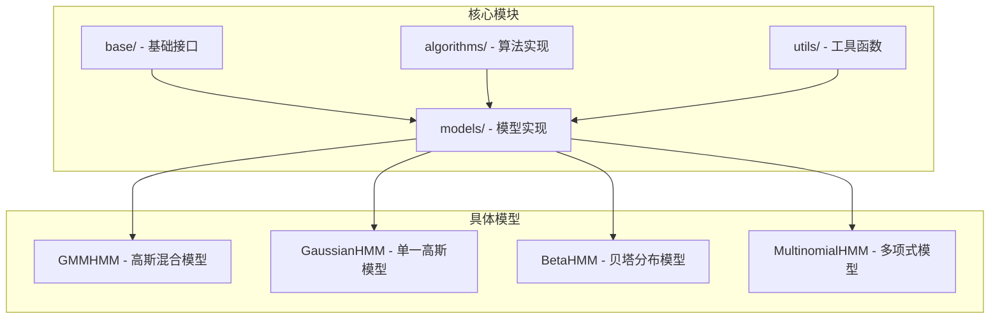
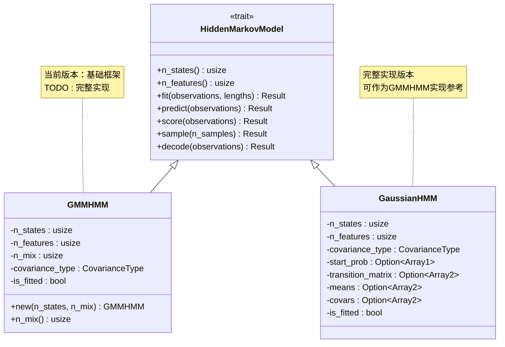
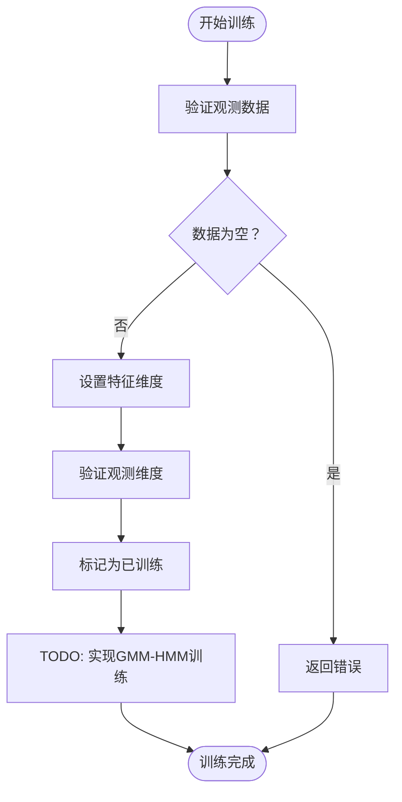
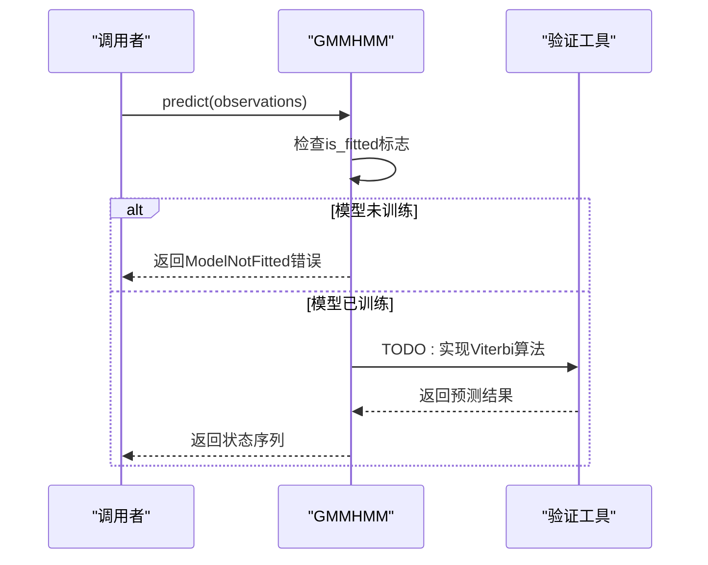
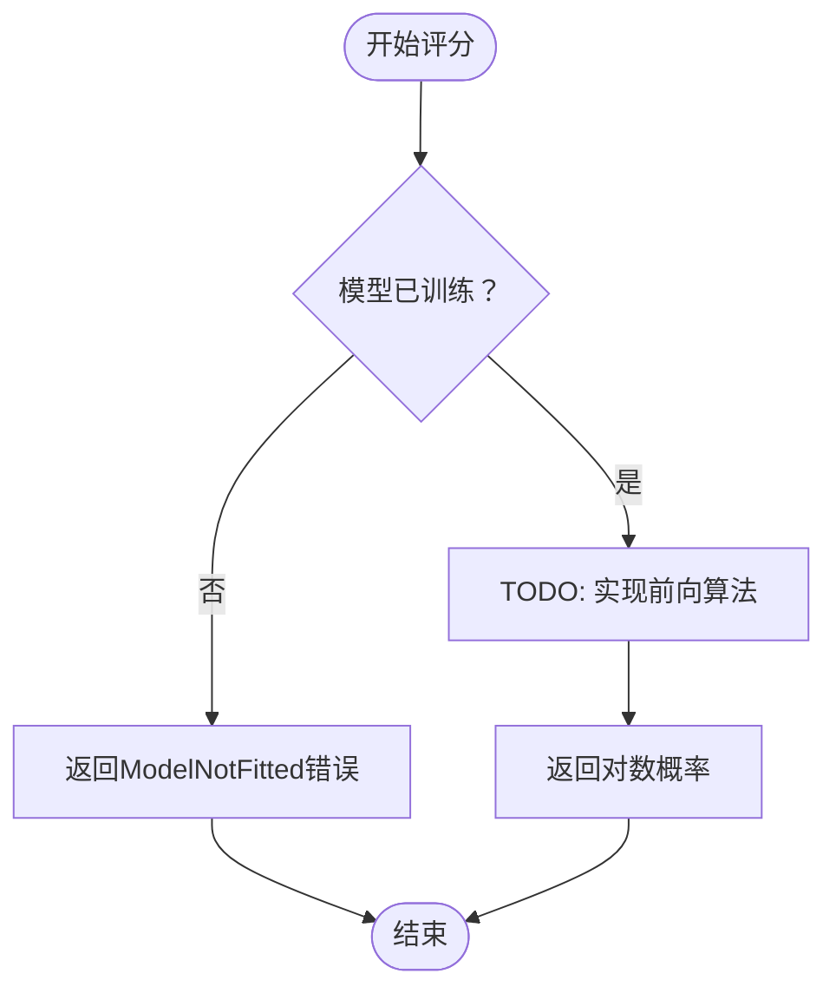
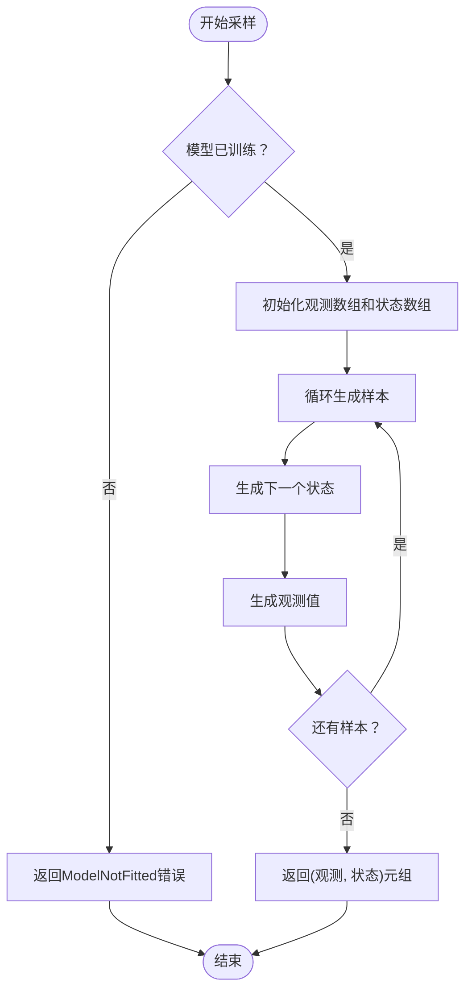
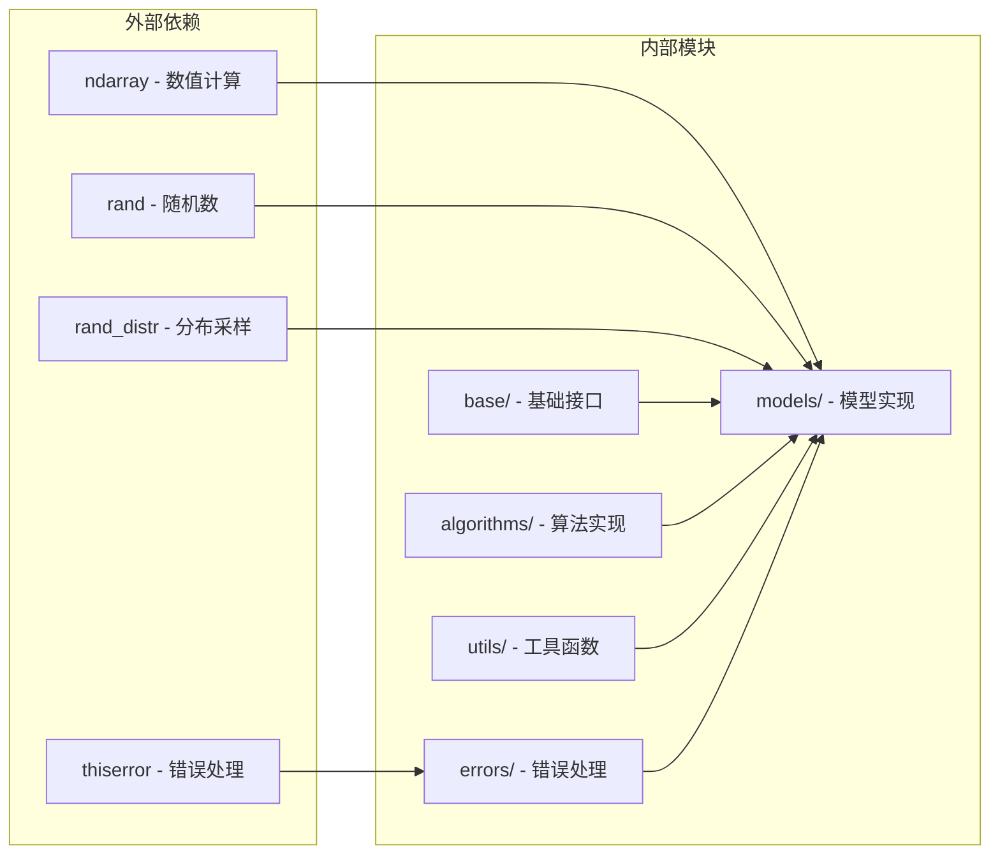
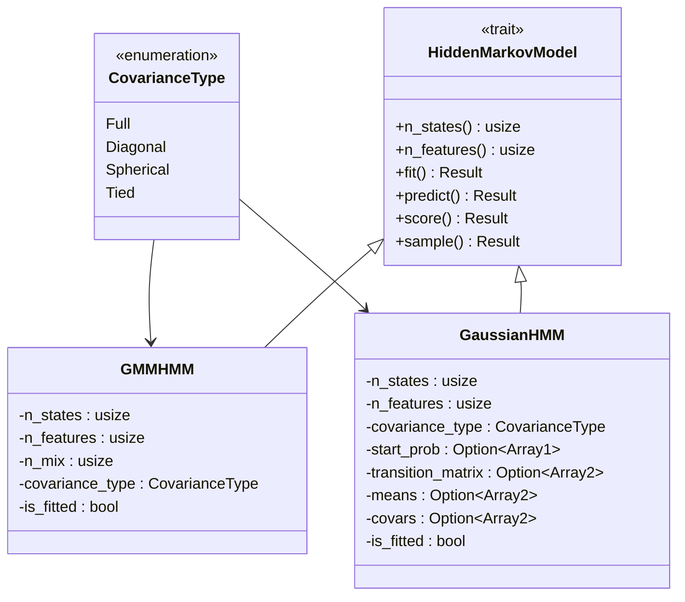
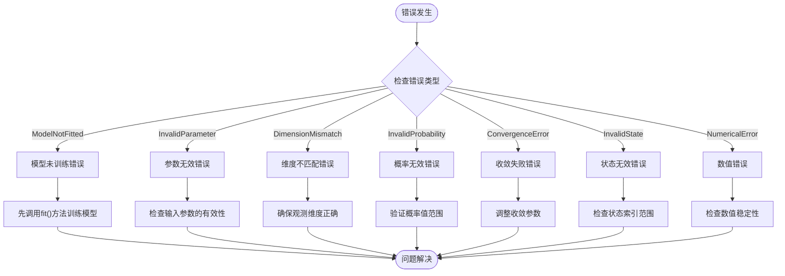

# 高斯混合模型 HMM API

<cite>
**本文档引用的文件**
- [gmm.rs](file://src/models/gmm.rs)
- [gaussian.rs](file://src/models/gaussian.rs)
- [hmm.rs](file://src/base/hmm.rs)
- [types.rs](file://src/base/types.rs)
- [baud_welch.rs](file://src/algorithms/baum_welch.rs)
- [validation.rs](file://src/utils/validation.rs)
- [errors.rs](file://src/errors.rs)
- [lib.rs](file://src/lib.rs)
- [mod.rs](file://src/models/mod.rs)
</cite>

## 目录
1. [简介](#简介)
2. [项目结构](#项目结构)
3. [核心组件](#核心组件)
4. [架构概览](#架构概览)
5. [详细组件分析](#详细组件分析)
6. [依赖关系分析](#依赖关系分析)
7. [性能考虑](#性能考虑)
8. [故障排除指南](#故障排除指南)
9. [结论](#结论)
10. [附录](#附录)

## 简介

本文件为高斯混合模型隐马尔可夫模型（GMM-HMM）的完整API文档。GMM-HMM是传统高斯HMM的扩展版本，通过在每个隐藏状态下引入多个高斯分量来更好地建模复杂的概率分布。该库采用Rust语言实现，提供了类型安全的API设计和高效的数值计算能力。

GMM-HMM的核心优势在于其能够：
- 使用多个高斯分量组合来近似任意复杂的概率密度函数
- 通过混合权重控制各分量的贡献程度
- 在保持马尔可夫性质的同时提高模型表达能力
- 支持多种协方差矩阵类型（球面、对角、完整）

## 项目结构

该项目采用模块化设计，主要包含以下核心模块：



**图表来源**
- [lib.rs](file://src/lib.rs#L1-L28)
- [models/mod.rs](file://src/models/mod.rs#L1-L12)

**章节来源**
- [lib.rs](file://src/lib.rs#L1-L28)
- [models/mod.rs](file://src/models/mod.rs#L1-L12)

## 核心组件

### GMMHMM 结构体

GMMHMM是高斯混合模型隐马尔可夫模型的核心实现，当前版本提供了基础框架但尚未完全实现所有功能。

#### 主要属性

| 属性名 | 类型 | 描述 | 默认值 |
|--------|------|------|--------|
| `n_states` | `usize` | 隐藏状态数量 | 无（必需参数） |
| `n_features` | `usize` | 观测特征维度 | 0 |
| `n_mix` | `usize` | 每个状态的混合分量数量 | 无（必需参数） |
| `covariance_type` | `CovarianceType` | 协方差矩阵类型 | `CovarianceType::Diagonal` |
| `is_fitted` | `bool` | 模型是否已训练 | `false` |

#### 构造函数

```rust
pub fn new(n_states: usize, n_mix: usize) -> Self
```

创建新的GMMHMM实例，需要指定隐藏状态数量和每个状态的混合分量数量。

**章节来源**
- [gmm.rs](file://src/models/gmm.rs#L11-L42)

## 架构概览

GMMHMM遵循统一的HMM接口设计，实现了`HiddenMarkovModel` trait定义的所有方法。整体架构采用分层设计：



**图表来源**
- [hmm.rs](file://src/base/hmm.rs#L6-L61)
- [gmm.rs](file://src/models/gmm.rs#L11-L42)
- [gaussian.rs](file://src/models/gaussian.rs#L14-L32)

## 详细组件分析

### GMMHMM 接口实现

#### fit() 方法 - 训练流程

当前实现仅进行基本验证，完整的EM算法实现标记为TODO：



**图表来源**
- [gmm.rs](file://src/models/gmm.rs#L53-L71)

#### predict() 方法 - 状态预测



**图表来源**
- [gmm.rs](file://src/models/gmm.rs#L73-L82)

#### score() 方法 - 概率评分



**图表来源**
- [gmm.rs](file://src/models/gmm.rs#L84-L93)

#### sample() 方法 - 数据采样



**图表来源**
- [gmm.rs](file://src/models/gmm.rs#L95-L106)

**章节来源**
- [gmm.rs](file://src/models/gmm.rs#L44-L107)

### 与单一高斯HMM的对比分析

为了更好地理解GMMHMM的优势，我们将其与已实现的GaussianHMM进行对比：

| 特性 | GaussianHMM | GMMHMM（当前） | GMMHMM（预期） |
|------|-------------|----------------|----------------|
| **模型复杂度** | 单一高斯分布 | 混合高斯分布 | 混合高斯分布 |
| **参数数量** | O(S×F) | O(S×M×F) | O(S×M×F) |
| **计算复杂度** | O(T×S²×F) | O(T×S²×M×F) | O(T×S²×M×F) |
| **表达能力** | 中等 | 高 | 最高 |
| **收敛性** | 确定性 | 可能性 | 可能性 |
| **实现状态** | 完整 | 基础框架 | 待实现 |

#### 计算复杂度分析

GMMHMM相比GaussianHMM的主要性能权衡：

1. **内存使用增加**：每个状态需要存储M个高斯分量的参数
2. **计算时间增加**：发射概率计算从O(F)增加到O(M×F)
3. **训练难度增加**：需要处理混合权重和分量分配问题

**章节来源**
- [gaussian.rs](file://src/models/gaussian.rs#L328-L491)

## 依赖关系分析

### 核心依赖关系



**图表来源**
- [lib.rs](file://src/lib.rs#L1-L28)
- [gmm.rs](file://src/models/gmm.rs#L3-L6)

### 关键接口依赖



**图表来源**
- [types.rs](file://src/base/types.rs#L17-L29)
- [hmm.rs](file://src/base/hmm.rs#L6-L61)
- [gmm.rs](file://src/models/gmm.rs#L11-L19)
- [gaussian.rs](file://src/models/gaussian.rs#L14-L32)

**章节来源**
- [types.rs](file://src/base/types.rs#L1-L61)
- [hmm.rs](file://src/base/hmm.rs#L1-L62)

## 性能考虑

### 当前实现的性能特点

由于GMMHMM当前仅实现基础框架，其性能特性主要体现在：

1. **内存效率**：只存储必要的状态信息，没有实际的参数矩阵
2. **计算开销**：所有核心算法方法都返回占位符结果
3. **扩展性**：为未来的完整实现预留了良好的架构基础

### 预期性能优化策略

当实现完整功能时，可以考虑以下优化：

1. **并行计算**：利用多核处理器加速矩阵运算
2. **内存池**：重用临时数组减少内存分配开销
3. **数值稳定性**：实现更好的数值精度控制
4. **稀疏矩阵**：对于大维度数据使用稀疏表示

## 故障排除指南

### 常见错误类型



**图表来源**
- [errors.rs](file://src/errors.rs#L8-L34)

### 错误处理最佳实践

1. **参数验证**：始终在训练前验证输入数据的有效性
2. **状态检查**：在执行任何操作前检查模型是否已训练
3. **维度一致性**：确保观测数据的特征维度与训练时一致
4. **数值稳定性**：在计算概率密度时添加适当的数值稳定措施

**章节来源**
- [errors.rs](file://src/errors.rs#L1-L105)
- [validation.rs](file://src/utils/validation.rs#L58-L74)

## 结论

GMMHMM作为rhmm库的重要组成部分，虽然当前版本仍处于基础框架阶段，但已经建立了清晰的架构设计和完整的接口规范。与GaussianHMM相比，GMMHMM具有更强的模型表达能力和更高的灵活性，但也带来了更大的计算复杂度和实现挑战。

未来的发展方向包括：
1. 完成所有核心算法的实现（训练、预测、评分、采样）
2. 优化数值计算的稳定性和效率
3. 添加更多协方差矩阵类型的完整支持
4. 实现更高级的功能如模型选择和超参数优化

## 附录

### 使用示例

虽然GMMHMM当前版本的API相对简单，但可以参考GaussianHMM的使用模式：

```rust
use rhmm::models::GaussianHMM;

// 创建模型实例
let mut hmm = GaussianHMM::new(3);

// 准备训练数据
let observations = ndarray::array![[1.0, 2.0], [2.0, 3.0], [3.0, 4.0]];

// 训练模型
hmm.fit(&observations, None).expect("训练失败");

// 进行预测
let predictions = hmm.predict(&observations).expect("预测失败");
```

### 相关资源

- **理论基础**：隐马尔可夫模型与高斯混合模型的数学原理
- **算法实现**：EM算法、维特比算法、前向后向算法的具体实现
- **性能基准**：不同模型复杂度下的性能表现对比
- **应用场景**：语音识别、生物信息学、金融建模等实际应用案例