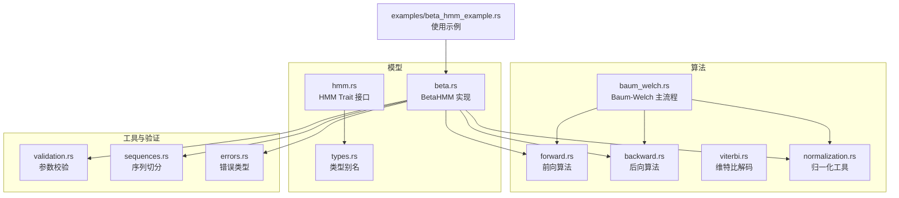
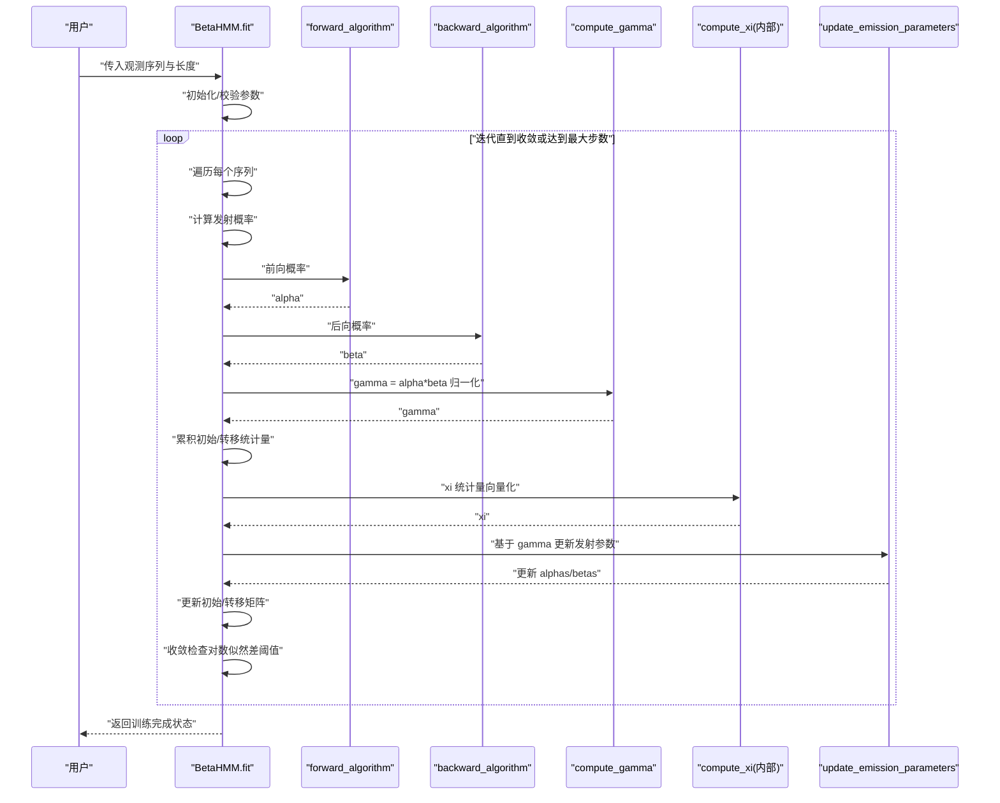
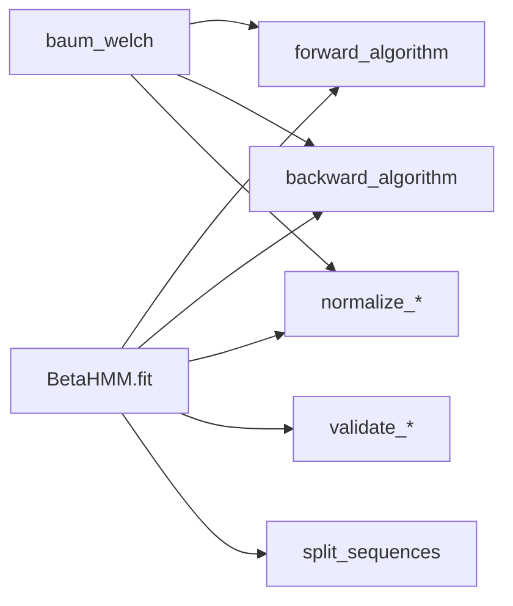
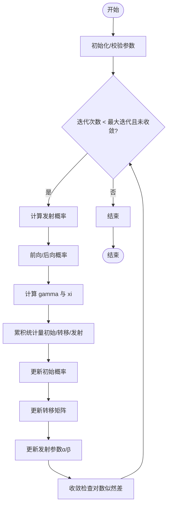

# Baum-Welch 算法 API

<cite>
**本文引用的文件**
- [src/algorithms/baum_welch.rs](file://src/algorithms/baum_welch.rs)
- [src/algorithms/forward.rs](file://src/algorithms/forward.rs)
- [src/algorithms/backward.rs](file://src/algorithms/backward.rs)
- [src/algorithms/viterbi.rs](file://src/algorithms/viterbi.rs)
- [src/models/beta.rs](file://src/models/beta.rs)
- [src/base/hmm.rs](file://src/base/hmm.rs)
- [src/base/types.rs](file://src/base/types.rs)
- [src/utils/normalization.rs](file://src/utils/normalization.rs)
- [src/utils/validation.rs](file://src/utils/validation.rs)
- [src/utils/sequences.rs](file://src/utils/sequences.rs)
- [src/errors.rs](file://src/errors.rs)
- [examples/beta_hmm_example.rs](file://examples/beta_hmm_example.rs)
- [src/lib.rs](file://src/lib.rs)
- [Cargo.toml](file://Cargo.toml)
</cite>

## 目录
1. [简介](#简介)
2. [项目结构](#项目结构)
3. [核心组件](#核心组件)
4. [架构总览](#架构总览)
5. [详细组件分析](#详细组件分析)
6. [依赖关系分析](#依赖关系分析)
7. [性能考虑](#性能考虑)
8. [故障排查指南](#故障排查指南)
9. [结论](#结论)
10. [附录](#附录)

## 简介
本文件为 Baum-Welch 算法（期望最大化 EM）在隐马尔可夫模型（HMM）参数估计中的 API 与实现规范文档。内容覆盖：
- 接口定义：参数估计与模型训练的输入输出、收敛条件与迭代流程
- EM 算法细节：E 步与 M 步的具体实现与统计量计算
- 实现要点：前向/后向概率、gamma/xi 统计量、参数更新规则
- 训练示例：数据准备、参数初始化、训练过程监控
- 收敛性与性能：收敛判定、数值稳定性与优化建议
- 应用场景：无监督学习中的状态识别与序列建模

## 项目结构
该仓库采用模块化组织，核心围绕“算法”“基础类型与接口”“模型实现”“工具与验证”“错误处理”展开，并通过示例展示使用方式。

图表来源
- [src/algorithms/baum_welch.rs](file://src/algorithms/baum_welch.rs#L1-L75)
- [src/algorithms/forward.rs](file://src/algorithms/forward.rs#L1-L129)
- [src/algorithms/backward.rs](file://src/algorithms/backward.rs#L1-L90)
- [src/algorithms/viterbi.rs](file://src/algorithms/viterbi.rs#L1-L118)
- [src/models/beta.rs](file://src/models/beta.rs#L1-L734)
- [src/base/hmm.rs](file://src/base/hmm.rs#L1-L62)
- [src/base/types.rs](file://src/base/types.rs#L1-L61)
- [src/utils/normalization.rs](file://src/utils/normalization.rs#L1-L102)
- [src/utils/validation.rs](file://src/utils/validation.rs#L1-L141)
- [src/utils/sequences.rs](file://src/utils/sequences.rs#L1-L153)
- [src/errors.rs](file://src/errors.rs#L1-L105)
- [examples/beta_hmm_example.rs](file://examples/beta_hmm_example.rs#L1-L266)

章节来源
- [src/lib.rs](file://src/lib.rs#L1-L28)
- [Cargo.toml](file://Cargo.toml#L1-L23)

## 核心组件
- Baum-Welch 主流程：提供参数估计入口，当前为占位实现，标注了完整的 E/M 步骤与收敛检查流程。
- 前向/后向算法：用于 E 步计算观测序列的前向/后向概率，支撑 gamma/xi 统计量。
- gamma/xi 统计量：状态占用概率与状态转移概率的统计量，用于 M 步参数更新。
- BetaHMM 模型：实现了 fit/predict/score/sample 等方法，内部完成 Baum-Welch 的 E/M 步与参数更新。
- HMM Trait：统一的模型接口，定义 fit/predict/score/sample 等能力。
- 工具与验证：概率向量/转移矩阵校验、序列切分、数值稳定归一化等。

章节来源
- [src/algorithms/baum_welch.rs](file://src/algorithms/baum_welch.rs#L1-L75)
- [src/algorithms/forward.rs](file://src/algorithms/forward.rs#L1-L129)
- [src/algorithms/backward.rs](file://src/algorithms/backward.rs#L1-L90)
- [src/algorithms/viterbi.rs](file://src/algorithms/viterbi.rs#L1-L118)
- [src/models/beta.rs](file://src/models/beta.rs#L384-L547)
- [src/base/hmm.rs](file://src/base/hmm.rs#L1-L62)
- [src/utils/normalization.rs](file://src/utils/normalization.rs#L1-L102)
- [src/utils/validation.rs](file://src/utils/validation.rs#L1-L141)
- [src/utils/sequences.rs](file://src/utils/sequences.rs#L1-L153)

## 架构总览
Baum-Welch 在 BetaHMM 中以 EM 算法实现，训练流程如下：

图表来源
- [src/models/beta.rs](file://src/models/beta.rs#L393-L547)
- [src/algorithms/forward.rs](file://src/algorithms/forward.rs#L20-L47)
- [src/algorithms/backward.rs](file://src/algorithms/backward.rs#L19-L44)
- [src/algorithms/baum_welch.rs](file://src/algorithms/baum_welch.rs#L56-L74)

## 详细组件分析

### Baum-Welch 主流程 API 规范
- 函数签名与职责
  - 输入：观测序列、初始概率、转移矩阵、发射概率（将被就地更新）、最大迭代次数、收敛容差
  - 输出：实际执行的迭代次数
  - 当前实现为占位，标注了完整的 E/M 步骤与收敛检查流程
- 收敛条件
  - 使用对数似然的增量作为收敛指标；当两次迭代间对数似然差小于容差时停止
- 迭代过程
  - E 步：计算前向/后向概率，得到 gamma 与 xi 统计量
  - M 步：基于统计量更新初始概率、转移矩阵与发射参数
- 参数更新规则
  - 初始概率：由首时刻 gamma 累积求和归一化
  - 转移矩阵：按行累积 xi 并归一化
  - 发射参数（Beta 分布）：使用加权矩估计更新 α/β

章节来源
- [src/algorithms/baum_welch.rs](file://src/algorithms/baum_welch.rs#L8-L44)
- [src/models/beta.rs](file://src/models/beta.rs#L439-L547)

### 前向/后向算法与 gamma/xi 统计量
- 前向算法
  - 计算前向概率矩阵，支持对数概率输出
- 后向算法
  - 计算后向概率矩阵
- gamma 统计量
  - 定义为 alpha 与 beta 对应元素乘积并逐行归一化
- xi 统计量（BetaHMM 内部实现）
  - 通过向量化广播计算每一步的状态转移联合概率，并进行数值稳定的归一化

章节来源
- [src/algorithms/forward.rs](file://src/algorithms/forward.rs#L20-L69)
- [src/algorithms/backward.rs](file://src/algorithms/backward.rs#L19-L44)
- [src/algorithms/baum_welch.rs](file://src/algorithms/baum_welch.rs#L56-L74)
- [src/models/beta.rs](file://src/models/beta.rs#L288-L332)

### BetaHMM 的 E/M 步实现细节
- E 步
  - 计算发射概率（Beta PDF），随后调用前向/后向算法
  - 计算 gamma 并累积到全局累加器
  - 计算 xi 并累积到全局累加器（不跨越序列边界）
- M 步
  - 更新初始概率：按 gamma 首时刻累积并归一化
  - 更新转移矩阵：按 xi 行累积并归一化
  - 更新发射参数（alpha/beta）：使用加权矩估计（weighted moments to Beta params）

章节来源
- [src/models/beta.rs](file://src/models/beta.rs#L439-L547)
- [src/utils/normalization.rs](file://src/utils/normalization.rs#L14-L23)

### HMM 接口与类型系统
- HMM Trait
  - n_states/n_features、fit/predict/score/sample/decode 等统一接口
- 类型别名
  - 转移矩阵、初始概率、观测序列、状态序列等类型别名，提升可读性

章节来源
- [src/base/hmm.rs](file://src/base/hmm.rs#L6-L61)
- [src/base/types.rs](file://src/base/types.rs#L5-L15)

### 参数初始化与校验
- 初始化策略
  - 初始概率：均匀分布
  - 转移矩阵：均匀分布
  - 发射参数（Beta）：按状态采样观测并用矩估计转换为 α/β，若无样本则使用整体统计
- 校验
  - 概率向量与转移矩阵行和校验
  - 观测维度一致性校验
  - 多序列长度校验与切分

章节来源
- [src/models/beta.rs](file://src/models/beta.rs#L413-L437)
- [src/utils/validation.rs](file://src/utils/validation.rs#L6-L74)
- [src/utils/sequences.rs](file://src/utils/sequences.rs#L16-L70)

### 训练示例与使用流程
- 示例概览
  - 创建 BetaHMM，拟合观测序列，打印学习到的参数与均值/方差，预测状态序列，评估对数似然，生成新样本，对新数据做预测
- 数据准备
  - 将观测序列组织为二维数组，特征维度对应 Beta 分布参数个数
- 参数初始化
  - 由模型内部完成，无需手动设置
- 训练过程监控
  - 内部通过收敛阈值控制迭代次数；可结合日志观察对数似然变化趋势

章节来源
- [examples/beta_hmm_example.rs](file://examples/beta_hmm_example.rs#L15-L266)
- [src/models/beta.rs](file://src/models/beta.rs#L393-L547)

## 依赖关系分析
- 模块耦合
  - BetaHMM 依赖前向/后向算法、gamma 计算、归一化工具、参数校验与序列切分
  - Baum-Welch 主流程标注了与前向/后向及 gamma 的协作关系
- 外部依赖
  - ndarray、rand、rand_distr、thiserror、serde 等

图表来源
- [src/models/beta.rs](file://src/models/beta.rs#L393-L547)
- [src/algorithms/baum_welch.rs](file://src/algorithms/baum_welch.rs#L1-L75)
- [src/algorithms/forward.rs](file://src/algorithms/forward.rs#L1-L129)
- [src/algorithms/backward.rs](file://src/algorithms/backward.rs#L1-L90)
- [src/utils/normalization.rs](file://src/utils/normalization.rs#L1-L102)
- [src/utils/validation.rs](file://src/utils/validation.rs#L1-L141)
- [src/utils/sequences.rs](file://src/utils/sequences.rs#L1-L153)

## 性能考虑
- 向量化与广播
  - xi 计算使用广播与矩阵操作，避免显式循环，提高吞吐
- 数值稳定性
  - 对数空间计算与 log-sum-exp 技巧（如对数似然）减少下溢风险
  - gamma 在每行内归一化，xi 在每步内归一化，防止数值退化
- 收敛控制
  - 使用对数似然增量作为收敛指标，合理设置容差与最大迭代次数
- 批量处理
  - 支持多序列训练，按序列独立计算并累积统计量，避免跨序列边界

章节来源
- [src/models/beta.rs](file://src/models/beta.rs#L288-L332)
- [src/utils/normalization.rs](file://src/utils/normalization.rs#L25-L35)
- [src/algorithms/forward.rs](file://src/algorithms/forward.rs#L60-L69)

## 故障排查指南
- 常见错误类型
  - 参数非法、维度不匹配、概率无效、模型未拟合、收敛失败、数值错误
- 定位建议
  - 检查观测维度与特征数量是否一致
  - 校验初始概率与转移矩阵是否满足概率约束
  - 关注对数似然是否单调递增、是否提前收敛
  - 若出现 NaN/Inf，检查发射 PDF 的输入范围与归一化步骤

章节来源
- [src/errors.rs](file://src/errors.rs#L9-L34)
- [src/utils/validation.rs](file://src/utils/validation.rs#L6-L74)
- [src/models/beta.rs](file://src/models/beta.rs#L137-L145)

## 结论
本实现以 EM 算法为核心，结合前向/后向算法与 gamma/xi 统计量，在 BetaHMM 中完成了对初始概率、转移矩阵与发射参数（α/β）的联合估计。接口设计遵循 HMM Trait，具备良好的扩展性与可维护性。通过数值稳定与向量化优化，能够在多序列场景下高效训练模型。

## 附录

### API 参考（BetaHMM.fit）
- 功能：拟合并训练 HMM 参数
- 输入
  - 观测序列：形状 (N, F)，N 为样本数，F 为特征数
  - 长度数组：可选，用于多序列训练；默认单序列
- 输出
  - 成功时返回空结果，模型标记为已拟合
- 收敛与迭代
  - 最大迭代次数：固定为 100
  - 容差：1e-4
  - 收敛判断：对数似然增量小于容差即停止

章节来源
- [src/base/hmm.rs](file://src/base/hmm.rs#L14-L20)
- [src/models/beta.rs](file://src/models/beta.rs#L393-L547)

### E 步与 M 步伪代码流程

图表来源
- [src/models/beta.rs](file://src/models/beta.rs#L439-L547)
- [src/algorithms/forward.rs](file://src/algorithms/forward.rs#L20-L47)
- [src/algorithms/backward.rs](file://src/algorithms/backward.rs#L19-L44)
- [src/algorithms/baum_welch.rs](file://src/algorithms/baum_welch.rs#L56-L74)