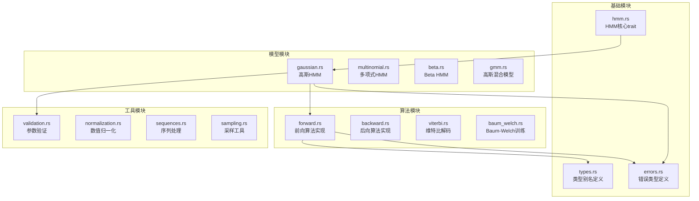
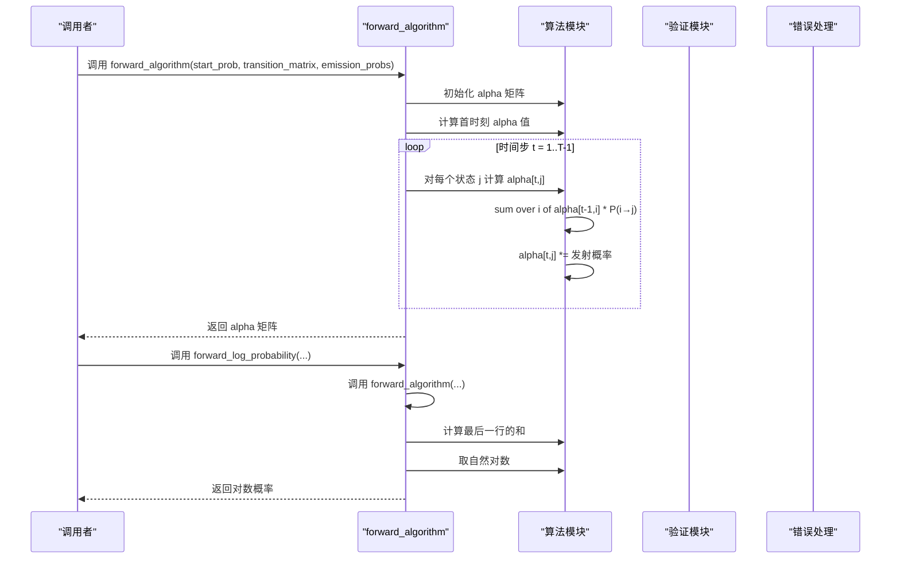
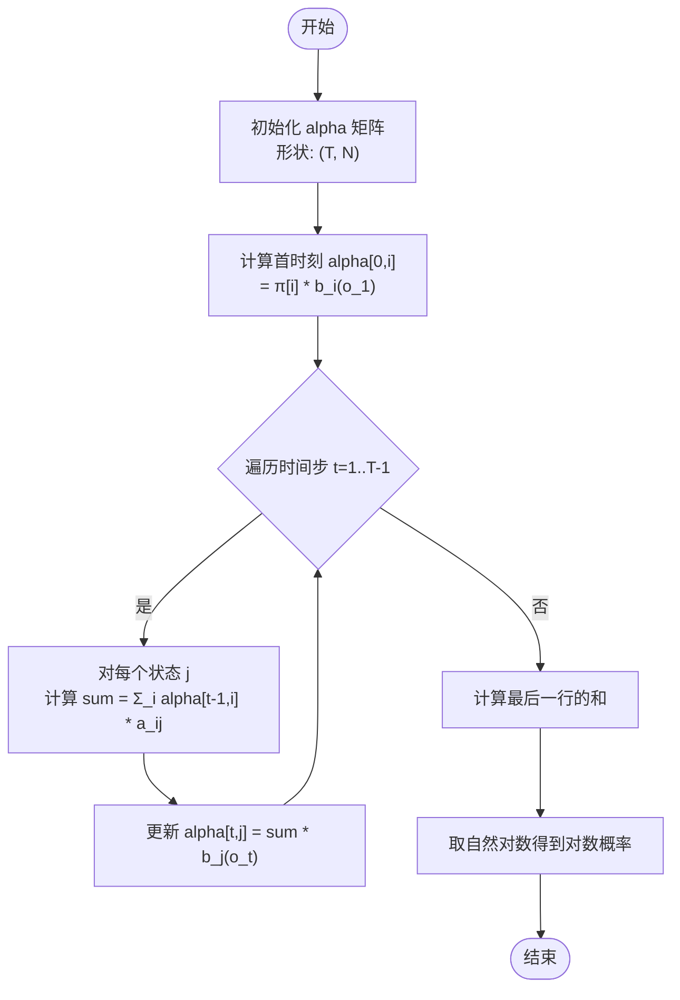
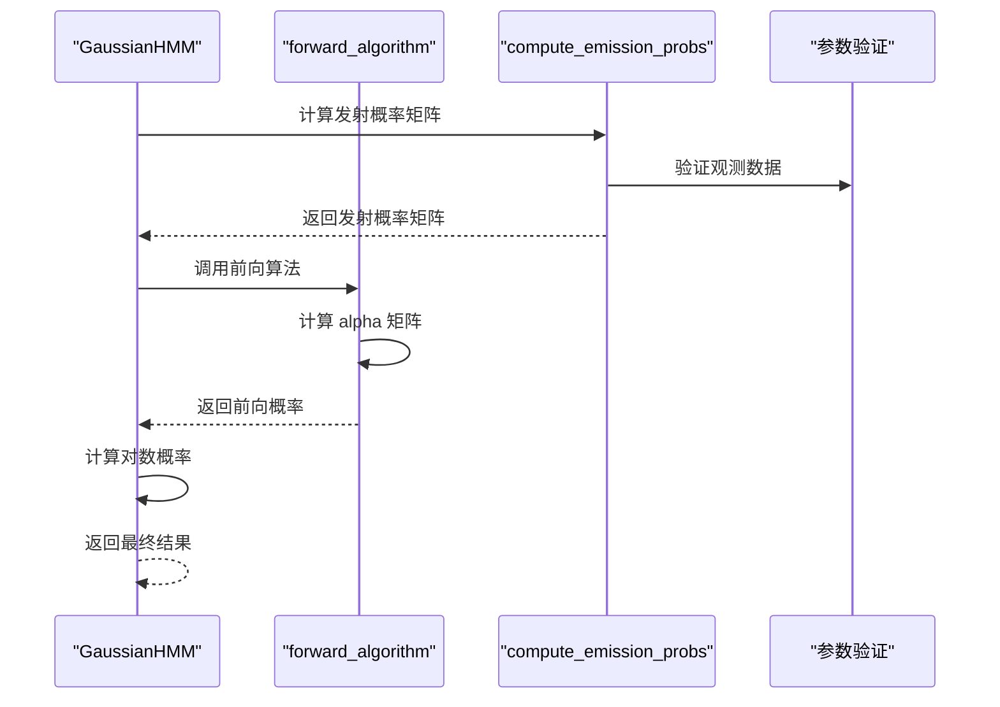
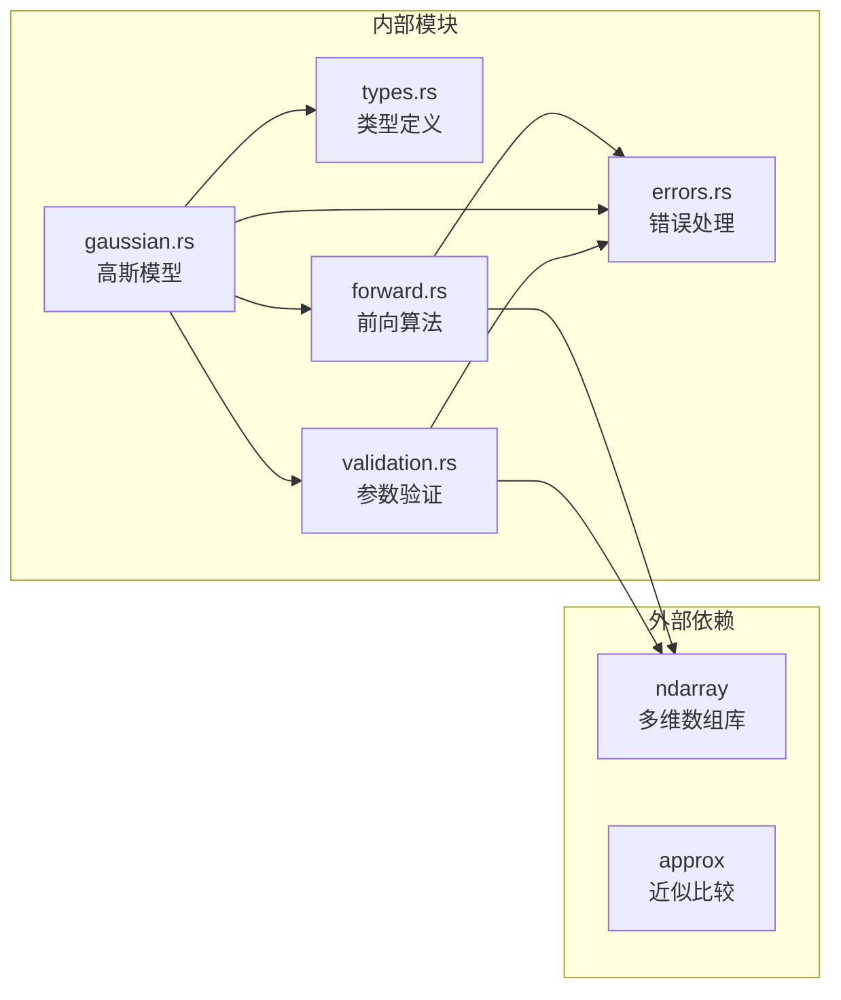

# 前向算法 API

<cite>
**本文引用的文件**
- [src/algorithms/forward.rs](file://src/algorithms/forward.rs)
- [src/base/types.rs](file://src/base/types.rs)
- [src/utils/validation.rs](file://src/utils/validation.rs)
- [src/errors.rs](file://src/errors.rs)
- [src/algorithms/mod.rs](file://src/algorithms/mod.rs)
- [src/lib.rs](file://src/lib.rs)
- [src/models/gaussian.rs](file://src/models/gaussian.rs)
</cite>

## 目录
1. [简介](#简介)
2. [项目结构](#项目结构)
3. [核心组件](#核心组件)
4. [架构概览](#架构概览)
5. [详细组件分析](#详细组件分析)
6. [依赖关系分析](#依赖关系分析)
7. [性能考虑](#性能考虑)
8. [故障排除指南](#故障排除指南)
9. [结论](#结论)
10. [附录](#附录)

## 简介
本文件为前向算法的详细API文档，涵盖 forward_algorithm 和 forward_log_probability 函数的完整接口规范。文档详细说明了前向算法的数学原理、计算步骤、alpha 值的含义与用途，并提供了具体的应用场景、参数验证规则、边界条件处理以及复杂度分析。

## 项目结构
rhmm 是一个基于 Rust 的隐马尔可夫模型库，采用模块化设计：
- algorithms 模块：包含前向、后向、维特比等标准算法实现
- base 模块：定义基础类型别名和 HMM 核心 trait
- models 模块：实现不同类型的 HMM（高斯、多项式等）
- utils 模块：提供参数验证、归一化等工具函数
- errors 模块：统一的错误类型定义

**图表来源**
- [src/algorithms/forward.rs](file://src/algorithms/forward.rs#L1-L129)
- [src/base/types.rs](file://src/base/types.rs#L1-L61)
- [src/models/gaussian.rs](file://src/models/gaussian.rs#L1-L200)

**章节来源**
- [src/lib.rs](file://src/lib.rs#L1-L28)
- [src/algorithms/mod.rs](file://src/algorithms/mod.rs#L1-L12)

## 核心组件
本节详细介绍前向算法的两个核心函数及其相关组件。

### 前向算法核心函数
前向算法通过递推方式计算观测序列的前向概率，得到 alpha 值矩阵。

#### forward_algorithm 函数
- **功能**：计算前向概率（alpha 值）
- **输入参数**：
  - `start_prob`: 初始状态概率向量，长度为 N
  - `transition_matrix`: 状态转移矩阵，形状为 (N, N)
  - `emission_probs`: 观测发射概率矩阵，形状为 (T, N)
- **输出**：前向概率矩阵 alpha，形状为 (T, N)
- **返回类型**：Result<Array2<f64>>
- **异常处理**：可能返回 HmmError 类型的错误

#### forward_log_probability 函数
- **功能**：计算观测序列的对数概率
- **输入参数**：同上
- **输出**：观测序列的对数概率值
- **返回类型**：Result<f64>
- **异常处理**：继承自 forward_algorithm 的错误处理

**章节来源**
- [src/algorithms/forward.rs](file://src/algorithms/forward.rs#L6-L69)

## 架构概览
前向算法在整个 HMM 库中的位置和交互关系如下：

**图表来源**
- [src/algorithms/forward.rs](file://src/algorithms/forward.rs#L20-L69)

## 详细组件分析

### 数学原理与计算步骤

#### alpha 值的定义与含义
alpha[t,i] 表示在时间 t 处于状态 i 的条件下，观测到前 t 步部分序列的概率：
- **初始条件**：alpha[0,i] = π[i] * b_i(o_1)
- **递推关系**：alpha[t,j] = [sum over i] alpha[t-1,i] * a_ij * b_j(o_t)

其中：
- π[i] 为初始状态概率
- a_ij 为从状态 i 转移到状态 j 的概率
- b_j(o_t) 为在状态 j 下观测到 o_t 的发射概率

#### 计算流程图

**图表来源**
- [src/algorithms/forward.rs](file://src/algorithms/forward.rs#L28-L44)

### 参数验证与边界条件

#### 输入参数验证规则
1. **初始概率向量验证**：
   - 长度必须等于状态数 N
   - 所有元素必须在 [0,1] 区间内
   - 元素之和必须等于 1.0（容差 1e-6）

2. **转移矩阵验证**：
   - 必须为方阵（N×N）
   - 每行元素必须在 [0,1] 区间内
   - 每行元素之和必须等于 1.0（容差 1e-6）

3. **观测数据验证**：
   - 观测矩阵必须非空
   - 列数必须等于特征维度
   - 支持单个观测或多个观测序列

#### 边界条件处理
- **单观测序列**：当 T=1 时，直接计算首时刻的 alpha 值
- **空观测序列**：返回维度不匹配错误
- **概率越界**：所有概率必须在有效范围内
- **数值稳定性**：对数概率避免下溢问题

**章节来源**
- [src/utils/validation.rs](file://src/utils/validation.rs#L6-L74)
- [src/errors.rs](file://src/errors.rs#L8-L34)

### 错误处理机制

#### 错误类型定义
库中定义了多种错误类型：
- `InvalidParameter`: 参数无效
- `DimensionMismatch`: 维度不匹配
- `InvalidProbability`: 概率值无效
- `ModelNotFitted`: 模型未训练
- `ConvergenceError`: 收敛失败
- `NumericalError`: 数值错误

#### 错误传播机制
前向算法的错误处理遵循以下模式：
1. 参数验证阶段：检查输入参数的有效性
2. 算法执行阶段：捕获数值计算中的异常
3. 结果返回阶段：统一包装为 Result 类型

**章节来源**
- [src/errors.rs](file://src/errors.rs#L9-L34)

### 复杂度分析

#### 时间复杂度
- **总体复杂度**：O(T × N²)
- **分解**：
  - 初始化阶段：O(N)
  - 主循环：O(T × N²)
  - 其中 T 为观测序列长度，N 为状态数

#### 空间复杂度
- **总体复杂度**：O(T × N)
- **分解**：
  - alpha 矩阵：O(T × N)
  - 其他临时变量：O(N)

#### 性能优化建议
1. **内存复用**：在连续计算中重用 alpha 矩阵
2. **并行化**：对不同时间步的状态更新可以并行
3. **数值稳定**：使用对数域计算避免下溢

**章节来源**
- [src/algorithms/forward.rs](file://src/algorithms/forward.rs#L25-L44)

### 应用场景

#### 模型评分与概率计算
前向算法主要用于：
1. **序列概率计算**：评估给定模型下观测序列的可能性
2. **模型选择**：比较不同模型的拟合优度
3. **异常检测**：识别低概率的异常序列
4. **语音识别**：计算观测序列的对数似然

#### 在 HMM 模型中的集成
高斯 HMM 中的使用流程：

**图表来源**
- [src/models/gaussian.rs](file://src/models/gaussian.rs#L102-L134)
- [src/algorithms/forward.rs](file://src/algorithms/forward.rs#L20-L69)

**章节来源**
- [src/models/gaussian.rs](file://src/models/gaussian.rs#L102-L134)

## 依赖关系分析

### 模块间依赖关系

**图表来源**
- [src/algorithms/forward.rs](file://src/algorithms/forward.rs#L3-L4)
- [src/models/gaussian.rs](file://src/models/gaussian.rs#L6)

### 类型系统设计

#### 类型别名体系
- `TransitionMatrix`: Array2<f64> - 状态转移矩阵
- `InitialProbs`: Array1<f64> - 初始状态概率
- `Observations`: Array2<f64> - 观测序列
- `States`: Array1<usize> - 状态序列

#### 数据结构特点
- 使用 ndarray 库提供高效的多维数组操作
- 类型安全的数组索引和切片操作
- 支持动态维度的灵活设计

**章节来源**
- [src/base/types.rs](file://src/base/types.rs#L5-L15)

## 性能考虑

### 内存使用优化
1. **矩阵尺寸控制**：合理设置状态数 N，避免过大的内存占用
2. **数据类型选择**：使用 f64 提供足够的数值精度
3. **内存布局**：利用 ndarray 的内存布局优化

### 计算效率提升
1. **循环展开**：在关键循环中减少分支判断
2. **向量化操作**：利用 ndarray 的向量化特性
3. **缓存友好**：优化内存访问模式

### 数值稳定性
1. **对数域计算**：使用对数概率避免数值下溢
2. **精度控制**：使用适当的容差值进行比较
3. **异常处理**：及时发现和处理数值异常

## 故障排除指南

### 常见错误及解决方案

#### 参数验证错误
- **错误类型**：InvalidProbability
- **可能原因**：概率值不在 [0,1] 范围内
- **解决方法**：检查输入数据的合理性

#### 维度不匹配错误
- **错误类型**：DimensionMismatch
- **可能原因**：观测矩阵列数与特征数不一致
- **解决方法**：确保观测数据的维度正确

#### 模型未训练错误
- **错误类型**：ModelNotFitted
- **可能原因**：在模型训练前就尝试预测
- **解决方法**：先调用 fit 方法训练模型

### 调试技巧
1. **单元测试**：使用提供的测试用例验证算法正确性
2. **边界测试**：测试单观测、空序列等边界情况
3. **数值检查**：验证概率和矩阵的数值范围

**章节来源**
- [src/utils/validation.rs](file://src/utils/validation.rs#L7-L55)
- [src/algorithms/forward.rs](file://src/algorithms/forward.rs#L71-L128)

## 结论
前向算法作为 HMM 理论的核心组成部分，在 rhmm 库中实现了高效、健壮的概率计算功能。通过清晰的 API 设计、完善的参数验证和错误处理机制，该实现能够满足实际应用中的各种需求。算法具有良好的时间复杂度 O(T×N²)，适合处理中等规模的 HMM 问题。

## 附录

### API 接口规范

#### forward_algorithm
- **函数签名**：forward_algorithm(&Array1<f64>, &Array2<f64>, &Array2<f64>) -> Result<Array2<f64>>
- **参数说明**：
  - start_prob: 初始状态概率向量，长度为 N
  - transition_matrix: 状态转移矩阵，形状为 (N, N)
  - emission_probs: 观测发射概率矩阵，形状为 (T, N)
- **返回值**：前向概率矩阵 alpha，形状为 (T, N)
- **异常**：可能返回 InvalidParameter、InvalidProbability、DimensionMismatch 等错误

#### forward_log_probability
- **函数签名**：forward_log_probability(&Array1<f64>, &Array2<f64>, &Array2<f64>) -> Result<f64>
- **参数说明**：同上
- **返回值**：观测序列的对数概率值
- **异常**：继承自 forward_algorithm 的错误处理

### 使用示例路径
具体的使用示例可以在以下文件中找到：
- [src/algorithms/forward.rs 测试用例](file://src/algorithms/forward.rs#L77-L127)
- [src/models/gaussian.rs 训练和评分示例](file://src/models/gaussian.rs#L102-L134)