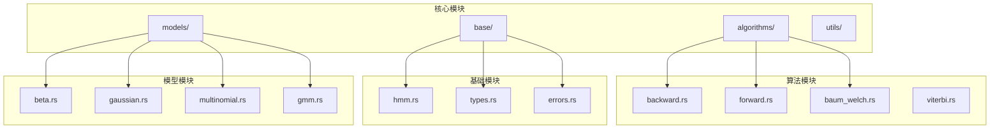
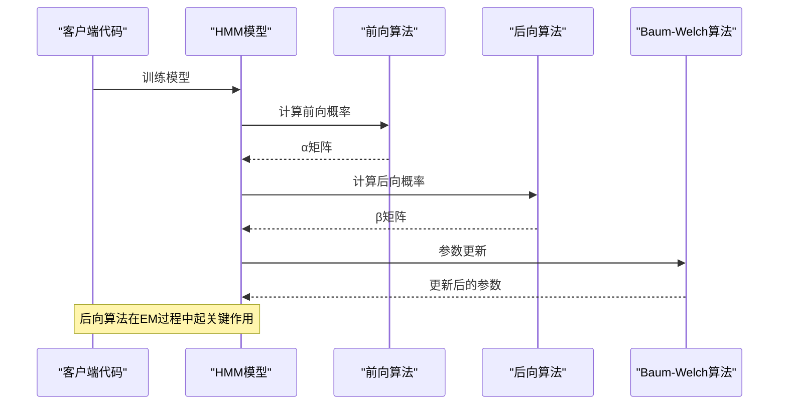
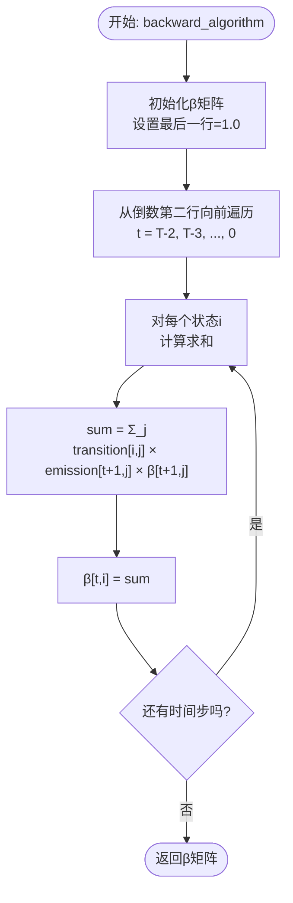
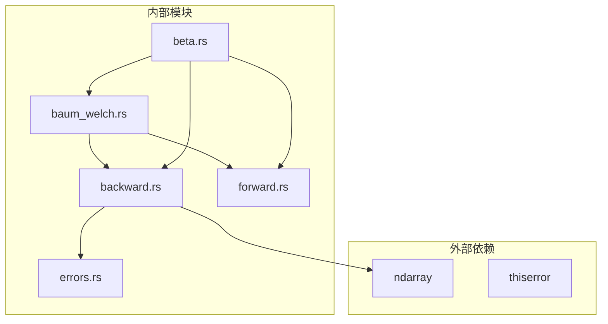
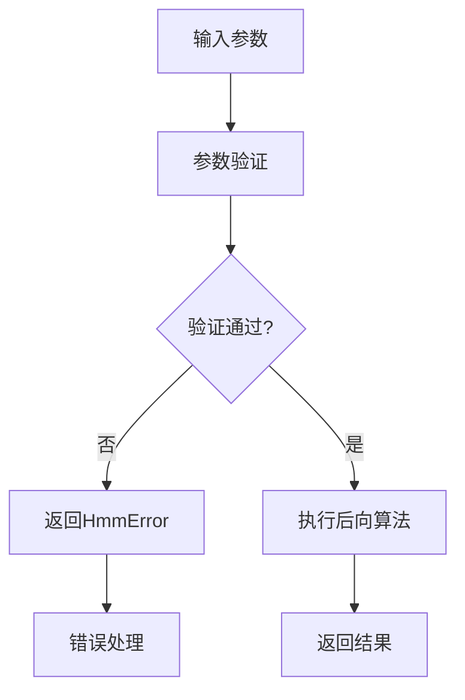

# 后向算法 API

<cite>
**本文引用的文件**
- [backward.rs](file://src/algorithms/backward.rs)
- [forward.rs](file://src/algorithms/forward.rs)
- [baum_welch.rs](file://src/algorithms/baum_welch.rs)
- [beta.rs](file://src/models/beta.rs)
- [hmm.rs](file://src/base/hmm.rs)
- [types.rs](file://src/base/types.rs)
- [integration_tests.rs](file://tests/integration_tests.rs)
- [beta_hmm_example.rs](file://examples/beta_hmm_example.rs)
- [lib.rs](file://src/lib.rs)
- [errors.rs](file://src/errors.rs)
</cite>

## 目录
1. [简介](#简介)
2. [项目结构](#项目结构)
3. [核心组件](#核心组件)
4. [架构概览](#架构概览)
5. [详细组件分析](#详细组件分析)
6. [依赖关系分析](#依赖关系分析)
7. [性能考虑](#性能考虑)
8. [故障排除指南](#故障排除指南)
9. [结论](#结论)
10. [附录](#附录)

## 简介

后向算法是隐马尔可夫模型（HMM）中的重要算法之一，用于计算给定时间步状态条件下剩余观测序列的概率。该算法与前向算法形成互补，共同构成HMM参数估计和推理的基础。

在本库中，后向算法通过 `backward_algorithm` 函数实现，采用标准的动态规划方法，从序列末尾向前递推计算后向概率（β值）。这些概率值在贝叶斯参数估计、模型评分和状态序列解码等任务中发挥关键作用。

## 项目结构

该项目采用模块化设计，将不同功能按职责分离到相应的模块中：



**图表来源**
- [lib.rs](file://src/lib.rs#L19-L28)
- [algorithms/mod.rs](file://src/algorithms/mod.rs#L1-L12)

**章节来源**
- [lib.rs](file://src/lib.rs#L1-L28)
- [algorithms/mod.rs](file://src/algorithms/mod.rs#L1-L12)

## 核心组件

后向算法的核心实现位于 `src/algorithms/backward.rs` 文件中，包含以下关键要素：

### 主要函数接口

后向算法的主要入口函数为 `backward_algorithm`，其接口规范如下：

- **函数名**: `backward_algorithm`
- **返回类型**: `Result<Array2<f64>>`
- **参数类型**: 
  - `transition_matrix`: `&Array2<f64>` - 状态转移矩阵
  - `emission_probs`: `&Array2<f64>` - 每个观测的状态发射概率

### 数据结构特性

- **输入验证**: 自动检查矩阵维度一致性
- **内存管理**: 使用零初始化创建结果矩阵
- **错误处理**: 通过 `Result` 类型返回错误信息
- **数值稳定性**: 采用标准的浮点数运算

**章节来源**
- [backward.rs](file://src/algorithms/backward.rs#L1-L90)

## 架构概览

后向算法在整个HMM框架中的位置和作用：



**图表来源**
- [beta.rs](file://src/models/beta.rs#L468-L470)
- [baum_welch.rs](file://src/algorithms/baum_welch.rs#L36-L41)

## 详细组件分析

### 后向算法数学原理

后向算法计算的是条件概率 P(O_{t+1:T} | q_t = i)，其中：
- O_{t+1:T} 表示从时间 t+1 到 T 的观测序列
- q_t = i 表示在时间 t 处于状态 i

算法的核心递推公式为：

β_t(i) = Σ_j P(i→j) × P(o_{t+1} | j) × β_{t+1}(j)

边界条件：β_T(i) = 1 对所有状态 i 成立

### 函数实现细节



**图表来源**
- [backward.rs](file://src/algorithms/backward.rs#L28-L42)

### 与前向算法的关系

前后向算法形成完整的概率计算体系：

```mermaid
graph LR
subgraph "前向算法 (Forward)"
Alpha[α矩阵<br/>P(O_1:t, q_t=i)]
end
subgraph "后向算法 (Backward)"
Beta[β矩阵<br/>P(O_{t+1:T} | q_t=i)]
end
subgraph "联合应用"
Gamma[γ_t(i)=α_t(i)β_t(i)<br/>状态占用概率]
Xi[Xi_t(i,j)=α_t(i)P(i→j)P(o_{t+1}|j)β_{t+1}(j)<br/>状态转移概率]
end
Alpha --> Gamma
Beta --> Gamma
Alpha --> Xi
Beta --> Xi
```

**图表来源**
- [forward.rs](file://src/algorithms/forward.rs#L20-L47)
- [backward.rs](file://src/algorithms/backward.rs#L19-L45)
- [baum_welch.rs](file://src/algorithms/baum_welch.rs#L56-L74)

### 在Baum-Welch算法中的作用

后向算法是Baum-Welch期望最大化算法的关键组成部分：

1. **E步**: 计算前向和后向概率
2. **M步**: 基于γ和ξ值更新模型参数
3. **收敛检查**: 重复直到满足停止准则

γ值的计算直接依赖于后向算法的结果。

**章节来源**
- [baum_welch.rs](file://src/algorithms/baum_welch.rs#L56-L74)
- [beta.rs](file://src/models/beta.rs#L468-L470)

### 实际使用示例

#### 基本使用模式

```rust
// 创建状态转移矩阵和发射概率矩阵
let transition_matrix = array![[0.7, 0.3], [0.4, 0.6]];
let emission_probs = array![[0.9, 0.1], [0.8, 0.2], [0.7, 0.3]];

// 计算后向概率
let beta = backward_algorithm(&transition_matrix, &emission_probs)?;

// 验证结果维度
assert_eq!(beta.shape(), &[3, 2]); // 3个观测, 2个状态
```

#### 在Beta HMM中的应用

在Beta HMM模型中，后向算法被用于：

1. **参数估计**: 在Baum-Welch算法的E步中计算后向概率
2. **模型评分**: 计算观测序列的对数似然
3. **状态解码**: 结合前向算法进行状态序列预测

**章节来源**
- [beta.rs](file://src/models/beta.rs#L468-L470)
- [beta_hmm_example.rs](file://examples/beta_hmm_example.rs#L1-L266)

## 依赖关系分析

后向算法的依赖关系图：



**图表来源**
- [backward.rs](file://src/algorithms/backward.rs#L3-L4)
- [lib.rs](file://src/lib.rs#L19-L28)

### 关键依赖关系

1. **数据结构依赖**: 使用 `ndarray::Array2<f64>` 进行高效数值计算
2. **错误处理依赖**: 通过 `thiserror` 提供统一的错误处理机制
3. **算法协作**: 与前向算法、Baum-Welch算法形成完整的算法族

**章节来源**
- [backward.rs](file://src/algorithms/backward.rs#L1-L90)
- [errors.rs](file://src/errors.rs#L1-L105)

## 性能考虑

### 时间复杂度

后向算法的时间复杂度为 O(T × N²)，其中：
- T 是观测序列长度
- N 是隐藏状态数量

空间复杂度为 O(T × N)，用于存储β矩阵。

### 性能优化策略

1. **内存局部性**: 使用连续内存布局提高缓存效率
2. **向量化操作**: 利用ndarray的向量化能力
3. **数值稳定性**: 避免不必要的数值溢出和下溢

### 适用场景

- **批量处理**: 适合处理长序列数据
- **实时应用**: 可以并行化处理多个序列
- **大规模训练**: 支持多序列同时训练

## 故障排除指南

### 常见错误类型

1. **维度不匹配**: 输入矩阵维度与模型配置不符
2. **数值异常**: 发射概率或转移概率不在有效范围内
3. **内存不足**: 序列过长导致内存溢出

### 错误处理机制



**图表来源**
- [errors.rs](file://src/errors.rs#L10-L34)

### 调试技巧

1. **单元测试**: 使用提供的测试用例验证算法正确性
2. **边界检查**: 验证单观测序列和空序列的处理
3. **性能监控**: 监控内存使用和计算时间

**章节来源**
- [integration_tests.rs](file://tests/integration_tests.rs#L29-L45)
- [backward.rs](file://src/algorithms/backward.rs#L47-L89)

## 结论

后向算法作为HMM理论的重要组成部分，在本库中实现了高效、稳定的数值计算。通过与前向算法的完美配合，以及在Baum-Welch算法中的关键作用，后向算法为整个HMM框架提供了坚实的理论基础。

该实现具有以下特点：
- **数学严谨**: 严格遵循HMM理论定义
- **性能优秀**: 优化的内存使用和计算效率
- **易于使用**: 清晰的接口设计和完善的错误处理
- **扩展性强**: 与各种HMM模型的良好兼容性

## 附录

### API参考

#### 函数签名
```rust
pub fn backward_algorithm(
    transition_matrix: &Array2<f64>,
    emission_probs: &Array2<f64>,
) -> Result<Array2<f64>>
```

#### 参数说明
- `transition_matrix`: 状态转移概率矩阵，形状为 (N, N)
- `emission_probs`: 发射概率矩阵，形状为 (T, N)

#### 返回值
- `Array2<f64>`: 后向概率矩阵，形状为 (T, N)

#### 错误类型
- `HmmError::InvalidParameter`: 参数无效
- `HmmError::DimensionMismatch`: 维度不匹配
- `HmmError::NumericalError`: 数值计算错误

### 使用建议

1. **数据预处理**: 确保发射概率矩阵的每一行都经过适当的归一化
2. **内存管理**: 对于长序列，考虑分批处理策略
3. **数值稳定性**: 在计算过程中注意避免数值溢出
4. **性能调优**: 根据具体应用场景调整算法参数