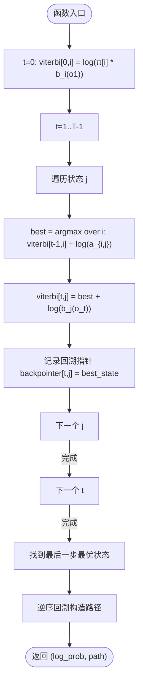

# 算法实现 API

<cite>
**本文引用的文件**
- [src/lib.rs](file://src/lib.rs)
- [src/algorithms/mod.rs](file://src/algorithms/mod.rs)
- [src/algorithms/forward.rs](file://src/algorithms/forward.rs)
- [src/algorithms/backward.rs](file://src/algorithms/backward.rs)
- [src/algorithms/viterbi.rs](file://src/algorithms/viterbi.rs)
- [src/algorithms/baum_welch.rs](file://src/algorithms/baum_welch.rs)
- [src/base/mod.rs](file://src/base/mod.rs)
- [src/base/hmm.rs](file://src/base/hmm.rs)
- [src/base/types.rs](file://src/base/types.rs)
- [src/utils/mod.rs](file://src/utils/mod.rs)
- [src/utils/normalization.rs](file://src/utils/normalization.rs)
- [src/errors.rs](file://src/errors.rs)
- [examples/beta_hmm_example.rs](file://examples/beta_hmm_example.rs)
- [README.md](file://README.md)
</cite>

## 目录
1. [引言](#引言)
2. [项目结构](#项目结构)
3. [核心组件](#核心组件)
4. [架构总览](#架构总览)
5. [详细组件分析](#详细组件分析)
6. [依赖关系分析](#依赖关系分析)
7. [性能考量](#性能考量)
8. [故障排查指南](#故障排查指南)
9. [结论](#结论)
10. [附录](#附录)

## 引言
本文件为 HMM（隐马尔可夫模型）算法实现的详细 API 文档，覆盖前向算法、后向算法、维特比算法与 Baum-Welch 算法的接口规范、输入输出、复杂度、使用示例与性能建议。文档同时说明各算法在训练与推理阶段的应用场景，并给出参数调优与最佳实践建议。

## 项目结构
该仓库采用模块化组织：算法层、基础类型与 trait、模型层、工具函数与错误类型等。对外通过 re-export 暴露常用类型与 trait，便于上层模型直接使用。

图表来源
- [src/lib.rs](file://src/lib.rs#L19-L27)
- [src/algorithms/mod.rs](file://src/algorithms/mod.rs#L1-L12)
- [src/base/mod.rs](file://src/base/mod.rs#L1-L8)
- [src/utils/mod.rs](file://src/utils/mod.rs#L1-L12)

章节来源
- [src/lib.rs](file://src/lib.rs#L1-L28)
- [README.md](file://README.md#L1-L303)

## 核心组件
- 核心 trait：HiddenMarkovModel 定义了模型通用能力（训练、预测、评分、采样、解码），统一了不同模型类型的接口。
- 类型别名：TransitionMatrix、InitialProbs、Observations、States 等，提升代码可读性与一致性。
- 常量枚举：CovarianceType 提供高斯模型协方差类型选择（全/对角/球面/绑定）。
- 错误体系：HmmError 统一错误类型，配合 Result 返回值，便于上层处理。

章节来源
- [src/base/hmm.rs](file://src/base/hmm.rs#L6-L61)
- [src/base/types.rs](file://src/base/types.rs#L5-L29)
- [src/errors.rs](file://src/errors.rs#L8-L34)

## 架构总览
下图展示算法模块与基础模块之间的关系，以及工具与错误类型在流程中的作用。

图表来源
- [src/algorithms/forward.rs](file://src/algorithms/forward.rs#L20-L47)
- [src/algorithms/backward.rs](file://src/algorithms/backward.rs#L19-L45)
- [src/algorithms/viterbi.rs](file://src/algorithms/viterbi.rs#L20-L74)
- [src/algorithms/baum_welch.rs](file://src/algorithms/baum_welch.rs#L25-L74)
- [src/utils/normalization.rs](file://src/utils/normalization.rs#L5-L35)
- [src/base/types.rs](file://src/base/types.rs#L5-L29)

## 详细组件分析

### 前向算法（Forward Algorithm）
- 功能：计算前向概率（alpha），即到时间 t 为止观察到部分序列且处于状态 i 的概率。
- 接口
  - 函数：forward_algorithm(start_prob, transition_matrix, emission_probs) -> Result<Array2<f64>>
  - 输入
    - start_prob: 初始状态概率向量，长度为 n_states
    - transition_matrix: 状态转移矩阵，形状 n_states × n_states
    - emission_probs: 观测发射概率矩阵，形状 n_samples × n_states
  - 输出
    - 前向概率矩阵 alpha，形状 n_samples × n_states
  - 复杂度
    - 时间：O(T × N^2)，T 为序列长度，N 为状态数
    - 空间：O(T × N)
  - 使用场景
    - 训练阶段：用于 E 步计算前向/后向概率，辅助参数更新
    - 推理阶段：结合后向算法计算单点状态概率（gamma）
  - 示例路径
    - 参见测试用例路径：[src/algorithms/forward.rs](file://src/algorithms/forward.rs#L71-L128)
    - 快速开始示例中模型评分会间接使用前向概率：[README.md](file://README.md#L79-L86)

图表来源
- [src/algorithms/forward.rs](file://src/algorithms/forward.rs#L20-L47)

章节来源
- [src/algorithms/forward.rs](file://src/algorithms/forward.rs#L6-L69)

### 后向算法（Backward Algorithm）
- 功能：计算后向概率（beta），即在状态 i 时，从 t+1 到 T 的剩余观测序列的概率。
- 接口
  - 函数：backward_algorithm(transition_matrix, emission_probs) -> Result<Array2<f64>>
  - 输入
    - transition_matrix: 状态转移矩阵，形状 n_states × n_states
    - emission_probs: 观测发射概率矩阵，形状 n_samples × n_states
  - 输出
    - 后向概率矩阵 beta，形状 n_samples × n_states
  - 复杂度
    - 时间：O(T × N^2)
    - 空间：O(T × N)
  - 使用场景
    - 训练阶段：与前向概率联合计算 gamma（单点状态概率）
    - 推理阶段：与前向概率共同得到状态后验概率
  - 示例路径
    - 参见测试用例路径：[src/algorithms/backward.rs](file://src/algorithms/backward.rs#L47-L90)

图表来源
- [src/algorithms/backward.rs](file://src/algorithms/backward.rs#L19-L45)

章节来源
- [src/algorithms/backward.rs](file://src/algorithms/backward.rs#L6-L45)

### 维特比算法（Viterbi Algorithm）
- 功能：寻找最可能的状态序列（最优路径），即给定观测下的最大后验路径。
- 接口
  - 函数：viterbi_algorithm(start_prob, transition_matrix, emission_probs) -> Result<(f64, Array1<usize>)>
  - 输入
    - start_prob: 初始状态概率向量，长度为 n_states
    - transition_matrix: 状态转移矩阵，形状 n_states × n_states
    - emission_probs: 观测发射概率矩阵，形状 n_samples × n_states
  - 输出
    - 元组：(log_max_prob, 最可能状态序列)
  - 复杂度
    - 时间：O(T × N^2)
    - 空间：O(T × N)
  - 使用场景
    - 推理阶段：进行状态路径预测（decode/predict）
  - 示例路径
    - 参见测试用例路径：[src/algorithms/viterbi.rs](file://src/algorithms/viterbi.rs#L76-L118)

图表来源
- [src/algorithms/viterbi.rs](file://src/algorithms/viterbi.rs#L20-L74)

章节来源
- [src/algorithms/viterbi.rs](file://src/algorithms/viterbi.rs#L6-L74)

### Baum-Welch 算法（Expectation-Maximization 参数估计）
- 功能：使用 EM 算法对 HMM 参数进行无监督学习（起始概率、转移矩阵、发射参数）。
- 接口
  - 函数：baum_welch(observations, start_prob, transition_matrix, emission_probs, max_iter, tol) -> Result<usize>
    - 当前占位实现：直接返回 max_iter，未实现完整 EM 迭代
    - 完整实现应包含：E 步（前向/后向）、计算 gamma/xi、M 步（参数更新）、收敛判断
  - 辅助函数：compute_gamma(alpha, beta) -> Result<Array2<f64>>
    - 计算单点状态概率 gamma[t,i] ∝ α[t,i]β[t,i]，并对每行进行归一化
  - 输入
    - observations: 观测序列，形状 n_samples × n_features
    - start_prob: 初始概率（就地更新）
    - transition_matrix: 转移矩阵（就地更新）
    - emission_probs: 发射概率（就地更新）
    - max_iter: 最大迭代次数
    - tol: 收敛阈值
  - 输出
    - 实际执行的迭代次数
  - 复杂度
    - 单次迭代：O(T × N^2 + T × N × F)，F 为特征维度
    - 总体：O(迭代次数 × (T × N^2 + T × N × F))
  - 使用场景
    - 训练阶段：无监督学习模型参数
  - 示例路径
    - 参见占位实现与注释：[src/algorithms/baum_welch.rs](file://src/algorithms/baum_welch.rs#L8-L44)
    - gamma 计算实现：[src/algorithms/baum_welch.rs](file://src/algorithms/baum_welch.rs#L56-L74)

图表来源
- [src/algorithms/baum_welch.rs](file://src/algorithms/baum_welch.rs#L8-L44)
- [src/algorithms/forward.rs](file://src/algorithms/forward.rs#L20-L47)
- [src/algorithms/backward.rs](file://src/algorithms/backward.rs#L19-L45)
- [src/utils/normalization.rs](file://src/utils/normalization.rs#L14-L23)

章节来源
- [src/algorithms/baum_welch.rs](file://src/algorithms/baum_welch.rs#L8-L74)

### 工具与归一化
- 归一化
  - normalize_vector(vec): 将向量按和为 1 归一化
  - normalize_matrix_rows(matrix): 对矩阵的每一行进行和归一化
  - log_normalize/probability：安全地在对数空间与概率空间转换，避免下溢
- 在 Baum-Welch 中，compute_gamma 使用 normalize_vector 对每行进行归一化，确保概率和为 1

章节来源
- [src/utils/normalization.rs](file://src/utils/normalization.rs#L5-L35)
- [src/algorithms/baum_welch.rs](file://src/algorithms/baum_welch.rs#L56-L74)

### 错误类型与结果
- Result<T> = Result<T, HmmError>
- 常见错误
  - InvalidParameter、DimensionMismatch、InvalidProbability、ModelNotFitted、ConvergenceError、InvalidState、NumericalError、IoError
- 建议
  - 在调用 predict/score/sample/deocde 前确保模型已完成 fit
  - 设置合理的 max_iter 与 tol，避免过拟合或欠收敛

章节来源
- [src/errors.rs](file://src/errors.rs#L8-L34)

## 依赖关系分析
- 模块耦合
  - 算法模块依赖基础类型与工具函数；错误类型贯穿所有模块
  - Baum-Welch 依赖前向/后向算法与归一化工具
- 外部依赖
  - ndarray、ndarray-linalg、rand、rand_distr、thiserror、serde（详见 README）

图表来源
- [src/algorithms/forward.rs](file://src/algorithms/forward.rs#L3-L4)
- [src/algorithms/backward.rs](file://src/algorithms/backward.rs#L3-L4)
- [src/algorithms/viterbi.rs](file://src/algorithms/viterbi.rs#L3-L4)
- [src/algorithms/baum_welch.rs](file://src/algorithms/baum_welch.rs#L3-L6)
- [src/utils/normalization.rs](file://src/utils/normalization.rs#L3-L4)
- [src/base/hmm.rs](file://src/base/hmm.rs#L3-L4)
- [src/base/types.rs](file://src/base/types.rs#L3-L4)
- [src/errors.rs](file://src/errors.rs#L3-L6)

章节来源
- [README.md](file://README.md#L44-L51)

## 性能考量
- 数值稳定性
  - 对数空间运算：log_normalize 与 exp_normalize 避免下溢/上溢
  - 前向/后向概率在 log 空间累积，提高数值稳定
- 矩阵运算
  - 使用 ndarray 向量化操作，减少内存分配
  - 按行归一化（normalize_matrix_rows）避免重复计算
- 复杂度
  - 单序列：前向/后向/维特比均为 O(T × N^2)
  - Baum-Welch：每次迭代 O(T × N^2 + T × N × F)，整体取决于收敛速度
- 实践建议
  - 合理设置状态数 N 与序列长度 T，避免过大导致内存与时间开销
  - 多序列训练时，优先使用 lengths 参数以支持变长序列
  - 使用合适的协方差类型（高斯模型）平衡精度与性能

[本节为通用性能指导，不直接分析具体文件]

## 故障排查指南
- 常见问题与定位
  - 维度不匹配：检查观测矩阵列数与模型特征数一致
  - 概率非法：确保初始/转移/发射概率非负且按行和为 1
  - 模型未拟合：先调用 fit 再进行 predict/score/sample
  - 收敛失败：增大 max_iter 或调整 tol，检查数据质量
- 错误类型参考
  - InvalidParameter、DimensionMismatch、InvalidProbability、ModelNotFitted、ConvergenceError、InvalidState、NumericalError、IoError
- 建议流程
  - 数据预处理：标准化/归一化观测，确保范围合理
  - 参数初始化：使用默认或启发式初始化，避免全零
  - 迭代监控：记录 log-likelihood 变化，绘制收敛曲线

章节来源
- [src/errors.rs](file://src/errors.rs#L10-L34)

## 结论
本库提供了前向、后向、维特比与 Baum-Welch 算法的核心实现与统一的模型接口。通过 ndarray 的高效数值计算与对数空间的数值稳定性设计，能够在多种 HMM 模型（高斯、Beta 等）上进行训练与推理。建议在实际应用中结合数据特点选择合适的模型与参数，并遵循本文的性能与调优建议。

[本节为总结性内容，不直接分析具体文件]

## 附录

### 使用示例与最佳实践
- 快速开始（高斯 HMM）
  - 创建模型、训练、预测、评分、采样：参见 [README.md](file://README.md#L55-L86)
- Beta HMM 示例（转化率分析）
  - 展示训练、参数查看、状态预测、评分、采样与新数据预测：参见 [examples/beta_hmm_example.rs](file://examples/beta_hmm_example.rs#L15-L265)
- 多序列训练
  - 使用 lengths 参数拼接多段序列：参见 [README.md](file://README.md#L232-L240)
- 自定义初始化与协方差类型
  - 参见 [README.md](file://README.md#L242-L265)

### 算法应用场景对照
- 训练阶段
  - Baum-Welch：无监督参数估计
  - 前向/后向：EM 的 E 步与状态后验计算
- 推理阶段
  - 维特比：状态路径预测（decode/predict）
  - 评分：对数似然评估（score）

[本节为概念性总结，不直接分析具体文件]