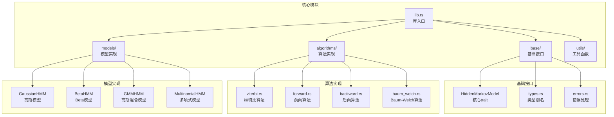
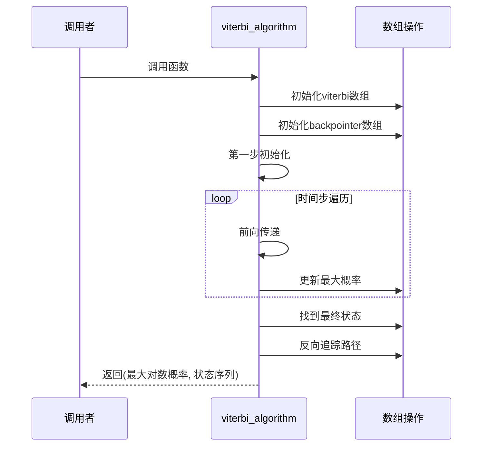
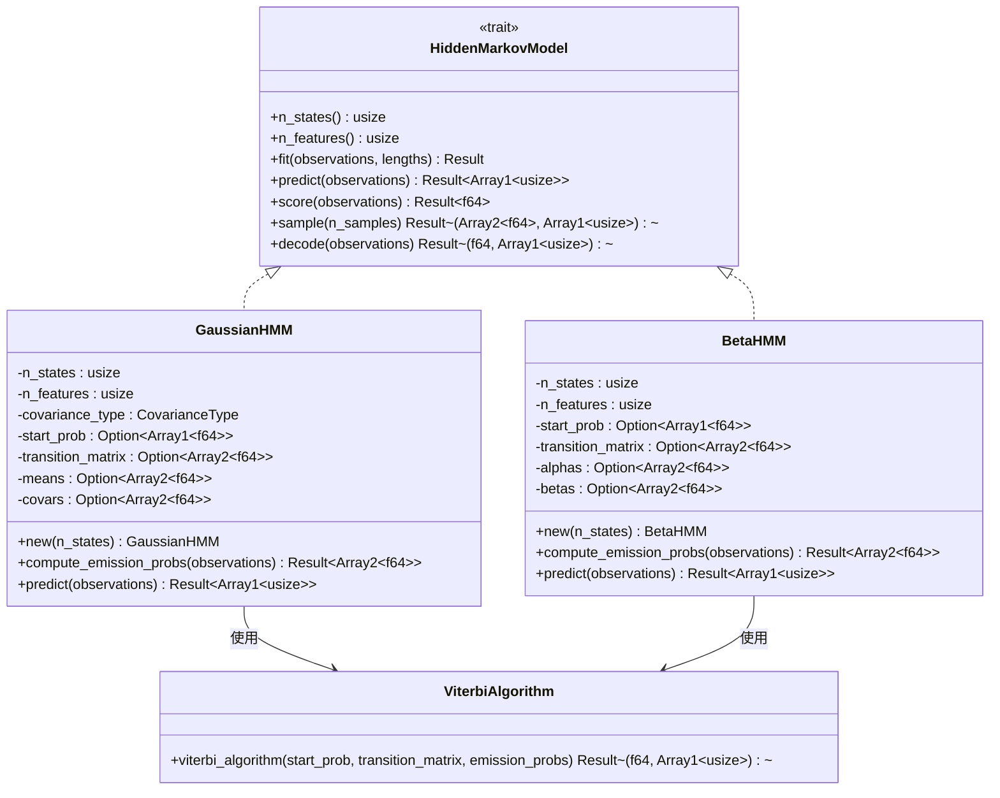
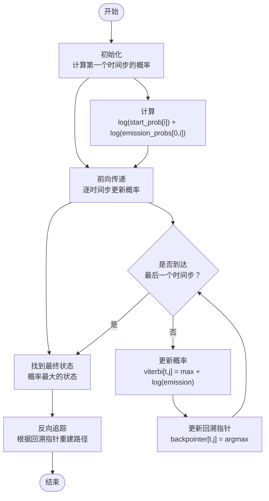
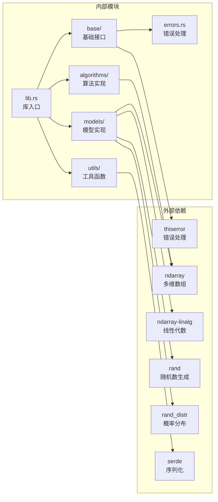

# 维特比算法 API

<cite>
**本文档引用的文件**
- [viterbi.rs](file://src/algorithms/viterbi.rs)
- [hmm.rs](file://src/base/hmm.rs)
- [lib.rs](file://src/lib.rs)
- [types.rs](file://src/base/types.rs)
- [errors.rs](file://src/errors.rs)
- [gaussian.rs](file://src/models/gaussian.rs)
- [beta.rs](file://src/models/beta.rs)
- [beta_hmm_example.rs](file://examples/beta_hmm_example.rs)
- [README.md](file://README.md)
- [Cargo.toml](file://Cargo.toml)
</cite>

## 目录
1. [简介](#简介)
2. [项目结构](#项目结构)
3. [核心组件](#核心组件)
4. [架构概览](#架构概览)
5. [详细组件分析](#详细组件分析)
6. [依赖关系分析](#依赖关系分析)
7. [性能考虑](#性能考虑)
8. [故障排除指南](#故障排除指南)
9. [结论](#结论)
10. [附录](#附录)

## 简介

维特比算法是隐马尔可夫模型（HMM）中的核心算法之一，用于寻找给定观测序列的最可能隐藏状态序列。该算法基于动态规划原理，在所有可能的状态序列中找到概率最大的一条路径。

本库提供了完整的维特比算法实现，支持多种HMM模型类型，包括高斯HMM、Beta HMM等，并提供了丰富的使用示例和错误处理机制。

## 项目结构



**图表来源**
- [lib.rs](file://src/lib.rs#L1-L28)
- [hmm.rs](file://src/base/hmm.rs#L1-L62)
- [viterbi.rs](file://src/algorithms/viterbi.rs#L1-L118)

**章节来源**
- [lib.rs](file://src/lib.rs#L1-L28)
- [README.md](file://README.md#L1-L303)

## 核心组件

### 维特比算法函数

维特比算法的核心函数定义如下：



**图表来源**
- [viterbi.rs](file://src/algorithms/viterbi.rs#L20-L74)

### 参数定义

维特比算法接受三个主要参数：

1. **初始状态概率向量** (`start_prob`: Array1<f64>)
   - 长度为隐藏状态数量
   - 每个元素表示对应状态的初始概率
   - 必须满足概率和为1的约束

2. **状态转移矩阵** (`transition_matrix`: Array2<f64>)
   - 形状为 (n_states × n_states)
   - 元素 [[i, j]] 表示从状态 i 转移到状态 j 的概率
   - 每行必须是有效的概率分布

3. **发射概率矩阵** (`emission_probs`: Array2<f64>)
   - 形状为 (n_samples × n_states)
   - 元素 [[t, i]] 表示在时间 t 处于状态 i 时观测到数据的概率
   - 对于每个时间步，概率和必须为1

### 返回值格式

函数返回一个元组：
- **最大对数概率** (f64): 最可能状态序列的对数概率
- **状态序列** (Array1<usize>): 长度为 n_samples 的状态索引序列

**章节来源**
- [viterbi.rs](file://src/algorithms/viterbi.rs#L11-L19)

## 架构概览



**图表来源**
- [hmm.rs](file://src/base/hmm.rs#L6-L61)
- [gaussian.rs](file://src/models/gaussian.rs#L11-L32)
- [beta.rs](file://src/models/beta.rs#L14-L39)
- [viterbi.rs](file://src/algorithms/viterbi.rs#L20-L24)

## 详细组件分析

### 维特比算法实现详解

#### 动态规划原理

维特比算法采用动态规划方法解决最优路径搜索问题：

1. **初始化阶段**
   - 计算第一个时间步各状态的对数概率
   - 使用公式：`viterbi[0, i] = log(start_prob[i]) + log(emission_probs[0, i])`

2. **前向传递阶段**
   - 对于每个时间步 t 和状态 j
   - 寻找使 `viterbi[t-1, i] + log(transition_matrix[i, j])` 最大的状态 i
   - 更新：`viterbi[t, j] = max + log(emission_probs[t, j])`
   - 记录回溯指针：`backpointer[t, j] = argmax`

3. **反向追踪阶段**
   - 从最后一个时间步找到概率最大的状态
   - 通过回溯指针逐步向前追踪最优路径

#### 算法流程图



**图表来源**
- [viterbi.rs](file://src/algorithms/viterbi.rs#L31-L71)

#### 实现细节分析

1. **数值稳定性**
   - 使用对数空间进行计算，避免小概率相乘导致的下溢
   - 所有概率运算转换为对数加法

2. **内存管理**
   - 创建二维数组存储累积概率和回溯指针
   - 空间复杂度为 O(T×N)，其中 T 为观测序列长度，N 为状态数量

3. **错误处理**
   - 输入参数验证
   - 数值稳定性检查
   - 返回统一的错误类型

**章节来源**
- [viterbi.rs](file://src/algorithms/viterbi.rs#L20-L74)

### HMM 模型集成

#### 高斯HMM中的维特比实现

高斯HMM通过以下步骤集成维特比算法：

1. **发射概率计算**
   - 使用高斯概率密度函数计算每个时间步的状态发射概率
   - 支持多种协方差类型（对角、球面、完整）

2. **参数验证**
   - 验证均值和协方差矩阵的有效性
   - 确保协方差矩阵正定

3. **预测实现**
   - 调用维特比算法获取最优状态序列
   - 返回状态序列和对应的对数概率

#### Beta HMM中的维特比实现

Beta HMM的实现特点：

1. **Beta分布发射概率**
   - 使用Beta概率密度函数计算发射概率
   - 支持多特征维度的联合概率计算

2. **参数范围限制**
   - 观测值必须在开区间 (0, 1) 内
   - Beta参数必须为正数

3. **统计特性计算**
   - 提供均值和方差的计算方法
   - 支持参数的可视化和分析

**章节来源**
- [gaussian.rs](file://src/models/gaussian.rs#L102-L134)
- [beta.rs](file://src/models/beta.rs#L116-L157)

## 依赖关系分析



**图表来源**
- [Cargo.toml](file://Cargo.toml#L13-L19)
- [lib.rs](file://src/lib.rs#L1-L28)

### 错误处理机制

库提供了全面的错误处理机制：

```mermaid
classDiagram
class HmmError {
<<enumeration>>
InvalidParameter(String)
DimensionMismatch {expected : usize, actual : usize}
InvalidProbability(String)
ModelNotFitted(String)
ConvergenceError(String)
InvalidState(String)
NumericalError(String)
IoError(Error)
}
class Result~T~ {
<<type alias>>
Result<T> = Result<T, HmmError>
}
HmmError --> Result~T~ : "作为错误类型"
```

**图表来源**
- [errors.rs](file://src/errors.rs#L9-L34)

**章节来源**
- [errors.rs](file://src/errors.rs#L1-L105)

## 性能考虑

### 时间复杂度分析

维特比算法的时间复杂度为 O(T×N²)，其中：
- T 是观测序列长度
- N 是隐藏状态数量

具体分析：
- 初始化阶段：O(N)
- 前向传递阶段：O(T×N²)（每个时间步需要遍历所有状态对）
- 反向追踪阶段：O(T)
- 总体：O(T×N²)

### 空间复杂度分析

空间复杂度为 O(T×N)：
- viterbi 数组：O(T×N)
- backpointer 数组：O(T×N)
- 其他临时变量：O(1)

### 性能优化策略

1. **内存局部性**
   - 使用连续内存布局的数组
   - 减少缓存未命中的次数

2. **数值稳定性**
   - 对数空间计算避免下溢
   - 适当的数值截断和校正

3. **并行化潜力**
   - 状态间的独立性允许并行计算
   - 可在多核环境下进一步优化

## 故障排除指南

### 常见问题及解决方案

#### 参数维度不匹配

**症状**：运行时出现维度不匹配错误
**原因**：输入数组的形状与期望不符
**解决方案**：
- 确保 `start_prob` 长度等于状态数量
- 确保 `transition_matrix` 形状为 (N×N)
- 确保 `emission_probs` 行数等于观测序列长度

#### 概率无效

**症状**：出现概率相关的错误
**原因**：概率值不在有效范围内或不满足概率分布要求
**解决方案**：
- 确保所有概率值非负
- 验证概率和为1的约束
- 检查观测值范围（特别是Beta HMM）

#### 模型未训练

**症状**：调用预测函数时报模型未训练错误
**原因**：在训练之前就尝试进行预测
**解决方案**：
- 先调用 `fit()` 方法训练模型
- 确认训练过程成功完成

**章节来源**
- [errors.rs](file://src/errors.rs#L14-L21)

### 调试技巧

1. **单元测试**
   - 利用提供的测试用例验证算法正确性
   - 测试边界条件和异常情况

2. **日志输出**
   - 在实际应用中添加适当的日志记录
   - 监控概率值的变化趋势

3. **可视化分析**
   - 可视化状态序列和发射概率
   - 分析模型参数的学习效果

## 结论

维特比算法API提供了完整的隐马尔可夫模型状态序列预测功能。该实现具有以下特点：

1. **数值稳定性**：使用对数空间计算确保数值精度
2. **类型安全**：利用Rust的类型系统防止常见错误
3. **扩展性**：支持多种HMM模型类型
4. **性能优化**：高效的内存管理和算法实现

该库适用于语音识别、生物信息学、金融建模等多个领域，为状态序列分析提供了强大的工具。

## 附录

### 使用示例

#### 基本使用模式

```rust
use rhmm::models::BetaHMM;
use rhmm::base::HiddenMarkovModel;

// 创建和训练模型
let mut model = BetaHMM::new(2);
model.fit(&observations, None)?;

// 预测状态序列
let states = model.predict(&observations)?;
let (log_prob, states) = model.decode(&observations)?;
```

#### 高级用法

```rust
// 获取学习到的参数
if let (Some(alphas), Some(betas)) = (model.alphas(), model.betas()) {
    // 分析Beta分布参数
}

// 计算模型评分
let log_likelihood = model.score(&observations)?;
```

### 应用场景

1. **语音识别**
   - 语音信号的音素识别
   - 说话人身份识别

2. **生物信息学**
   - 基因序列分析
   - 蛋白质结构预测

3. **金融建模**
   - 市场状态识别
   - 风险评估

4. **自然语言处理**
   - 词性标注
   - 命名实体识别

**章节来源**
- [beta_hmm_example.rs](file://examples/beta_hmm_example.rs#L15-L265)
- [README.md](file://README.md#L121-L139)