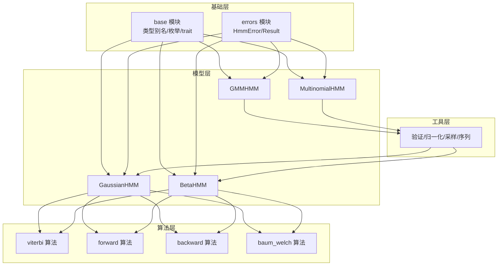
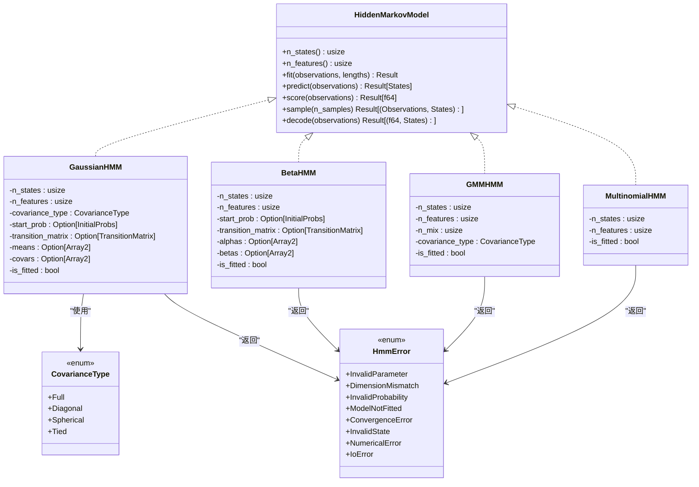
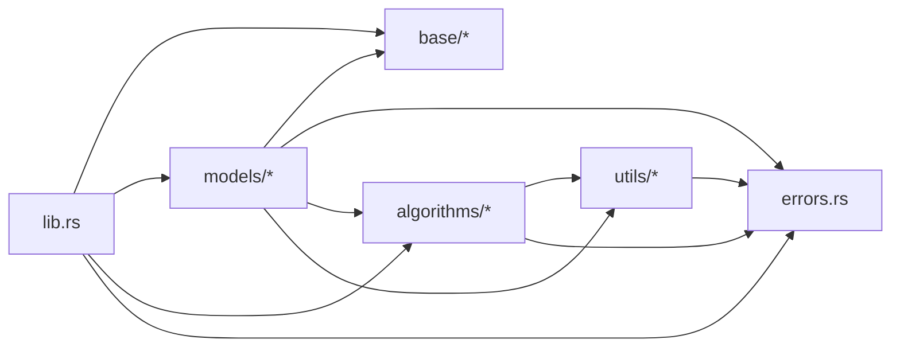

# 类型定义

<cite>
**本文引用的文件**
- [lib.rs](file://src/lib.rs)
- [base/mod.rs](file://src/base/mod.rs)
- [base/types.rs](file://src/base/types.rs)
- [base/hmm.rs](file://src/base/hmm.rs)
- [errors.rs](file://src/errors.rs)
- [models/mod.rs](file://src/models/mod.rs)
- [models/gaussian.rs](file://src/models/gaussian.rs)
- [models/gmm.rs](file://src/models/gmm.rs)
- [models/multinomial.rs](file://src/models/multinomial.rs)
- [models/beta.rs](file://src/models/beta.rs)
- [algorithms/mod.rs](file://src/algorithms/mod.rs)
- [algorithms/viterbi.rs](file://src/algorithms/viterbi.rs)
- [algorithms/forward.rs](file://src/algorithms/forward.rs)
- [algorithms/backward.rs](file://src/algorithms/backward.rs)
- [algorithms/baum_welch.rs](file://src/algorithms/baum_welch.rs)
- [utils/mod.rs](file://src/utils/mod.rs)
- [Cargo.toml](file://Cargo.toml)
- [examples/beta_hmm_example.rs](file://examples/beta_hmm_example.rs)
</cite>

## 目录
1. [简介](#简介)
2. [项目结构](#项目结构)
3. [核心组件](#核心组件)
4. [架构总览](#架构总览)
5. [详细组件分析](#详细组件分析)
6. [依赖分析](#依赖分析)
7. [性能考虑](#性能考虑)
8. [故障排查指南](#故障排查指南)
9. [结论](#结论)
10. [附录](#附录)

## 简介
本文件系统性梳理 rhmm 库中的公共类型定义与使用规范，覆盖：
- 枚举类型：CovarianceType（协方差类型）
- 错误类型：HmmError 及 Result 别名
- 结构体类型：GaussianHMM、BetaHMM、GMMHMM、MultinomialHMM
- 公共类型别名：状态转移矩阵、初始概率向量、观测序列、状态序列等
- 泛型参数约束与使用方式
- 类型转换与序列化支持现状
- 最佳实践与注意事项
- 类型间的关系与继承结构
- 使用示例与常见陷阱提示

## 项目结构
rhmm 采用按功能域划分的模块组织方式，核心模块包括：
- base：基础类型与核心 trait（HiddenMarkovModel）
- models：具体模型实现（高斯、贝塔、GMM、多项式）
- algorithms：HMM 核心算法（前向、后向、维特比、Baum-Welch）
- utils：验证、归一化、采样、序列处理等工具
- errors：统一错误类型与结果别名
- lib：对外 re-export

**图表来源**
- [base/mod.rs](file://src/base/mod.rs#L1-L8)
- [base/types.rs](file://src/base/types.rs#L1-L61)
- [base/hmm.rs](file://src/base/hmm.rs#L1-L62)
- [errors.rs](file://src/errors.rs#L1-L105)
- [models/mod.rs](file://src/models/mod.rs#L1-L12)
- [models/gaussian.rs](file://src/models/gaussian.rs#L1-L681)
- [models/beta.rs](file://src/models/beta.rs#L1-L734)
- [models/gmm.rs](file://src/models/gmm.rs#L1-L108)
- [models/multinomial.rs](file://src/models/multinomial.rs#L1-L95)
- [algorithms/mod.rs](file://src/algorithms/mod.rs#L1-L12)
- [algorithms/viterbi.rs](file://src/algorithms/viterbi.rs#L1-L118)
- [algorithms/forward.rs](file://src/algorithms/forward.rs#L1-L129)
- [algorithms/backward.rs](file://src/algorithms/backward.rs#L1-L90)
- [algorithms/baum_welch.rs](file://src/algorithms/baum_welch.rs#L1-L75)
- [utils/mod.rs](file://src/utils/mod.rs#L1-L12)

**章节来源**
- [lib.rs](file://src/lib.rs#L1-L28)
- [base/mod.rs](file://src/base/mod.rs#L1-L8)
- [models/mod.rs](file://src/models/mod.rs#L1-L12)
- [algorithms/mod.rs](file://src/algorithms/mod.rs#L1-L12)
- [utils/mod.rs](file://src/utils/mod.rs#L1-L12)

## 核心组件
本节聚焦公共类型别名、枚举与错误类型。

- 类型别名（全部来自 base/types.rs）：
  - TransitionMatrix：状态转移矩阵，二维浮点数组
  - InitialProbs：初始状态概率向量，一维浮点数组
  - Observations：观测序列，二维浮点数组
  - States：状态序列，一维 usize 数组
- 枚举 CovarianceType（用于高斯模型协方差结构）：
  - Full：全协方差矩阵
  - Diagonal：对角协方差（默认）
  - Spherical：球面协方差（单个方差）
  - Tied：所有状态共享同一协方差
- 错误类型 HmmError 与结果别名 Result：
  - InvalidParameter、DimensionMismatch、InvalidProbability、ModelNotFitted、ConvergenceError、InvalidState、NumericalError、IoError
  - Result<T> = std::result::Result<T, HmmError>

这些类型在 lib.rs 中被 re-export，作为对外公共 API 的一部分。

**章节来源**
- [base/types.rs](file://src/base/types.rs#L1-L61)
- [errors.rs](file://src/errors.rs#L1-L105)
- [lib.rs](file://src/lib.rs#L25-L28)

## 架构总览
下图展示类型与模块间的依赖关系，突出基础类型别名与枚举如何被模型与算法共同使用。

**图表来源**
- [base/hmm.rs](file://src/base/hmm.rs#L6-L61)
- [base/types.rs](file://src/base/types.rs#L17-L29)
- [errors.rs](file://src/errors.rs#L8-L34)
- [models/gaussian.rs](file://src/models/gaussian.rs#L11-L32)
- [models/beta.rs](file://src/models/beta.rs#L14-L39)
- [models/gmm.rs](file://src/models/gmm.rs#L8-L19)
- [models/multinomial.rs](file://src/models/multinomial.rs#L8-L17)

## 详细组件分析

### CovarianceType 枚举
- 设计目的：为高斯模型提供协方差矩阵的不同假设，平衡模型复杂度与拟合能力。
- 成员语义：
  - Full：全协方差矩阵，适合任意特征相关性建模，计算成本高
  - Diagonal：对角协方差（默认），假设特征相互独立，兼顾精度与效率
  - Spherical：球面协方差（单方差），进一步简化，适合特征尺度相近场景
  - Tied：所有状态共享同一协方差，减少参数数量，提高样本效率
- 默认值：Diagonal（通过 derive(Default) 指定）
- 使用位置：GaussianHMM 内部根据该枚举选择不同的密度函数实现路径

最佳实践与注意事项：
- 在数据维度较高或样本较少时，优先选择 Diagonal 或 Spherical，避免过拟合
- Full 实现当前简化为对角实现，若需严格全协方差，需扩展矩阵运算与求逆逻辑
- Tied 会强制所有状态使用相同协方差，适合跨状态协方差一致的场景

**章节来源**
- [base/types.rs](file://src/base/types.rs#L17-L29)
- [models/gaussian.rs](file://src/models/gaussian.rs#L155-L194)

### HmmError 错误类型与 Result 别名
- 错误分类：
  - 参数类：InvalidParameter、InvalidProbability、InvalidState
  - 维度类：DimensionMismatch
  - 模型状态类：ModelNotFitted、ConvergenceError
  - 数值类：NumericalError
  - 输入输出类：IoError（从标准 io::Error 转换而来）
- Result 别名：Result<T> = std::result::Result<T, HmmError>
- 使用约定：所有模型方法在失败时返回 Err(HmmError::...)；成功返回 Ok(T)

最佳实践与注意事项：
- 在调用 predict、score、sample 前确保模型已 fit
- 对于 Baum-Welch 迭代，关注 ConvergenceError 以判断收敛性
- 数值错误（如分布参数非法）应捕获并重试初始化策略

**章节来源**
- [errors.rs](file://src/errors.rs#L5-L34)
- [models/gaussian.rs](file://src/models/gaussian.rs#L115-L122)
- [models/beta.rs](file://src/models/beta.rs#L130-L145)

### 类型别名与数据结构
- 类型别名（base/types.rs）：
  - TransitionMatrix：Array2<f64>
  - InitialProbs：Array1<f64>
  - Observations：Array2<f64>
  - States：Array1<usize>
- 这些别名统一了算法与模型中矩阵/向量的形状与元素类型，便于跨模块协作

最佳实践与注意事项：
- 观测矩阵的列数必须与模型 n_features 一致
- 初始概率与转移矩阵需满足概率非负与行归一化要求（由验证工具保障）

**章节来源**
- [base/types.rs](file://src/base/types.rs#L5-L15)
- [utils/mod.rs](file://src/utils/mod.rs#L1-L12)

### GaussianHMM 结构体
- 字段设计：
  - n_states、n_features：模型规模
  - covariance_type：协方差类型（影响密度函数与参数数量）
  - start_prob、transition_matrix：初始与转移概率（可选，训练时初始化）
  - means、covars：发射参数（高斯均值与协方差）
  - is_fitted：是否完成训练
- 关键方法：
  - new、with_covariance_type：构造器
  - fit：基于 Baum-Welch 的 EM 训练（多序列支持、收敛检查）
  - predict：Viterbi 解码
  - score：前向算法计算对数似然
  - sample：从拟合模型生成观测与状态序列
  - compute_emission_probs：根据协方差类型计算发射概率
  - initialize_parameters/update_emission_parameters：参数初始化与更新

使用示例与常见陷阱：
- 示例参考：examples/beta_hmm_example.rs 展示了如何训练与使用模型，GaussianHMM 同理
- 陷阱：
  - 未设置 n_features 即进行预测/评分会触发维度不匹配
  - 初始化协方差时需保证最小方差，防止数值不稳定
  - Full/Tied 当前简化为对角实现，若需要严格全协方差需扩展

**章节来源**
- [models/gaussian.rs](file://src/models/gaussian.rs#L11-L32)
- [models/gaussian.rs](file://src/models/gaussian.rs#L34-L100)
- [models/gaussian.rs](file://src/models/gaussian.rs#L328-L612)
- [examples/beta_hmm_example.rs](file://examples/beta_hmm_example.rs#L1-L266)

### BetaHMM 结构体
- 字段设计：
  - n_states、n_features：模型规模
  - start_prob、transition_matrix：初始与转移概率
  - alphas、betas：发射参数（贝塔分布形状参数）
  - is_fitted：是否完成训练
- 关键方法：
  - new：构造器
  - compute_means/compute_variances：基于贝塔参数计算均值与方差
  - compute_emission_probs：对每个时间步与状态计算密度（对数稳定）
  - beta_pdf：贝塔密度函数（对数形式避免下溢）
  - initialize_parameters：基于矩估计初始化参数
  - fit/predict/score/sample：与通用流程一致，但发射密度为贝塔

使用示例与常见陷阱：
- 示例参考：examples/beta_hmm_example.rs 展示了贝塔 HMM 的典型用法
- 陷阱：
  - 观测值必须位于开区间 (0,1)，否则抛出 InvalidParameter
  - 参数 alphas/betas 需保持正数，内部做了最小值钳制
  - log_gamma 使用 Stirling 近似，小参数时数值稳定性需注意

**章节来源**
- [models/beta.rs](file://src/models/beta.rs#L14-L39)
- [models/beta.rs](file://src/models/beta.rs#L116-L157)
- [models/beta.rs](file://src/models/beta.rs#L173-L197)
- [models/beta.rs](file://src/models/beta.rs#L226-L286)
- [models/beta.rs](file://src/models/beta.rs#L384-L669)
- [examples/beta_hmm_example.rs](file://examples/beta_hmm_example.rs#L1-L266)

### GMMHMM 结构体
- 字段设计：
  - n_states、n_features、n_mix：混合成分数量
  - covariance_type：保留字段（当前未使用）
  - is_fitted：是否完成训练
- 关键方法：
  - new：构造器
  - fit/predict/score/sample：占位实现（TODO），当前直接返回错误或零结果

使用示例与常见陷阱：
- 当前未实现完整 GMM-HMM，使用前请确认其状态与行为
- 若计划使用，需补充发射密度（高斯混合）与参数更新逻辑

**章节来源**
- [models/gmm.rs](file://src/models/gmm.rs#L8-L19)
- [models/gmm.rs](file://src/models/gmm.rs#L21-L42)
- [models/gmm.rs](file://src/models/gmm.rs#L44-L107)

### MultinomialHMM 结构体
- 字段设计：
  - n_states、n_features：离散观测空间大小
  - is_fitted：是否完成训练
- 关键方法：
  - new：构造器
  - fit/predict/score/sample：占位实现（TODO），当前直接返回错误或零结果

使用示例与常见陷阱：
- 当前未实现完整多项式 HMM，使用前请确认其状态与行为
- 若计划使用，需补充离散发射密度与参数更新逻辑

**章节来源**
- [models/multinomial.rs](file://src/models/multinomial.rs#L8-L17)
- [models/multinomial.rs](file://src/models/multinomial.rs#L19-L33)
- [models/multinomial.rs](file://src/models/multinomial.rs#L35-L94)

### HiddenMarkovModel trait
- 方法契约：
  - n_states、n_features：查询模型规模
  - fit：训练（支持多序列长度 lengths）
  - predict：Viterbi 解码
  - score：对数似然
  - sample：生成观测与状态
  - decode：同时返回对数似然与路径
- 所有模型均实现该 trait，保证统一接口

最佳实践与注意事项：
- 在调用 predict/score/sample 前务必先 fit
- 对于多序列数据，正确传递 lengths 以避免跨序列边界统计

**章节来源**
- [base/hmm.rs](file://src/base/hmm.rs#L6-L61)

### 算法模块与类型关系
- 算法模块导出：
  - forward_algorithm、backward_algorithm、viterbi_algorithm、baum_welch、compute_gamma
- 与模型的交互：
  - 模型在 fit/predict/score 中调用相应算法，传入初始概率、转移矩阵与发射概率
  - compute_gamma 用于从前向/后向概率推断状态占用概率

最佳实践与注意事项：
- 发射概率通常由模型内部 compute_emission_probs 计算
- 多序列场景需正确分割与累加统计

**章节来源**
- [algorithms/mod.rs](file://src/algorithms/mod.rs#L1-L12)
- [algorithms/viterbi.rs](file://src/algorithms/viterbi.rs#L20-L74)
- [algorithms/forward.rs](file://src/algorithms/forward.rs#L20-L69)
- [algorithms/backward.rs](file://src/algorithms/backward.rs#L19-L44)
- [algorithms/baum_welch.rs](file://src/algorithms/baum_welch.rs#L25-L74)

## 依赖分析
- 外部依赖（Cargo.toml）：
  - ndarray、ndarray-linalg：多维数组与线性代数
  - rand、rand_distr：随机采样与分布
  - thiserror：错误派生宏
  - serde：序列化支持（启用 derive 特性）
- 内部模块耦合：
  - models 依赖 base（类型别名、枚举、trait）、errors（错误类型）、utils（验证/归一化/采样/序列）、algorithms（算法）
  - algorithms 依赖 utils（归一化）与 errors（结果类型）

**图表来源**
- [lib.rs](file://src/lib.rs#L19-L27)
- [Cargo.toml](file://Cargo.toml#L13-L20)

**章节来源**
- [Cargo.toml](file://Cargo.toml#L13-L20)
- [lib.rs](file://src/lib.rs#L19-L27)

## 性能考虑
- 计算复杂度：
  - Viterbi/前向/后向：O(N^2 T)，N 为状态数，T 为序列长度
  - Baum-Welch：每轮迭代 O(N^2 T)，受收敛阈值与最大迭代次数限制
- 内存占用：
  - 主要消耗在 alpha/beta/gamma/xi 矩阵上，随 N、T 增长
- 优化建议：
  - 对于高维观测（n_features 较大），优先 Diagonal/Spherical 协方差
  - 使用稳定的对数计算（如 log-sum-exp）避免下溢
  - 多序列训练时合理切分与累加统计，避免跨序列边界错误

[本节为通用指导，无需列出具体文件来源]

## 故障排查指南
- 常见错误与定位：
  - ModelNotFitted：在未训练情况下调用 predict/score/sample
  - DimensionMismatch：观测列数与模型 n_features 不一致
  - InvalidParameter：观测范围不合法（如 BetaHMM 的 (0,1) 要求）
  - ConvergenceError：Baum-Welch 收敛失败，检查初始参数与数据质量
  - NumericalError：分布参数非法或数值不稳定
- 排查步骤：
  - 确认模型已 fit 且 is_fitted 为真
  - 检查观测矩阵形状与取值范围
  - 调整初始参数（如随机种子、协方差类型）
  - 增加最大迭代次数或调整收敛阈值

**章节来源**
- [errors.rs](file://src/errors.rs#L8-L34)
- [models/gaussian.rs](file://src/models/gaussian.rs#L493-L544)
- [models/beta.rs](file://src/models/beta.rs#L549-L599)

## 结论
rhmm 提供了清晰的类型体系与统一的模型接口：
- 通过类型别名与枚举统一了数据结构与协方差假设
- 以 HmmError 与 Result 明确错误传播路径
- 以 HiddenMarkovModel 为契约，使多种模型具备一致的训练与推理流程
- 算法模块与模型模块解耦良好，便于扩展与维护

建议在实际使用中遵循“先训练再推理”的流程，并根据数据特性选择合适的协方差类型与模型。

[本节为总结性内容，无需列出具体文件来源]

## 附录

### 类型转换与序列化
- 序列化支持现状：
  - 依赖 serde 并启用了 derive 特性，理论上可为公共类型派生序列化 trait
  - 当前各模型与类型未显式实现 serde 的序列化/反序列化方法
- 建议：
  - 如需持久化模型参数（如 GaussianHMM 的 means/covars、BetaHMM 的 alphas/betas），可在应用层自行实现序列化
  - 注意 ndarray 数组的序列化兼容性，必要时转换为 Vec/数组

**章节来源**
- [Cargo.toml](file://Cargo.toml#L19-L19)

### 使用示例与最佳实践清单
- 使用示例：
  - 参考 examples/beta_hmm_example.rs，展示训练、参数查看、预测、评分与采样的完整流程
- 最佳实践清单：
  - 训练前检查观测矩阵形状与取值范围
  - 选择合适的协方差类型（Diagonal 为默认，Spherical 适合高维近似）
  - 多序列训练时正确传递 lengths
  - 捕获并处理 HmmError，区分不同错误类别采取相应措施
  - 对数值不稳定问题使用对数域计算与最小正值钳制

**章节来源**
- [examples/beta_hmm_example.rs](file://examples/beta_hmm_example.rs#L1-L266)