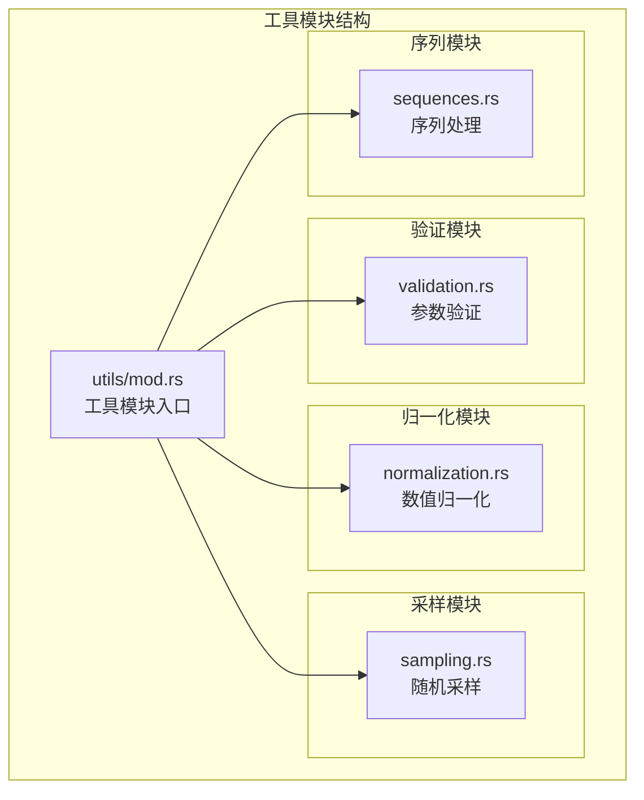
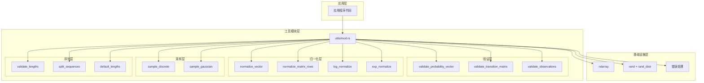
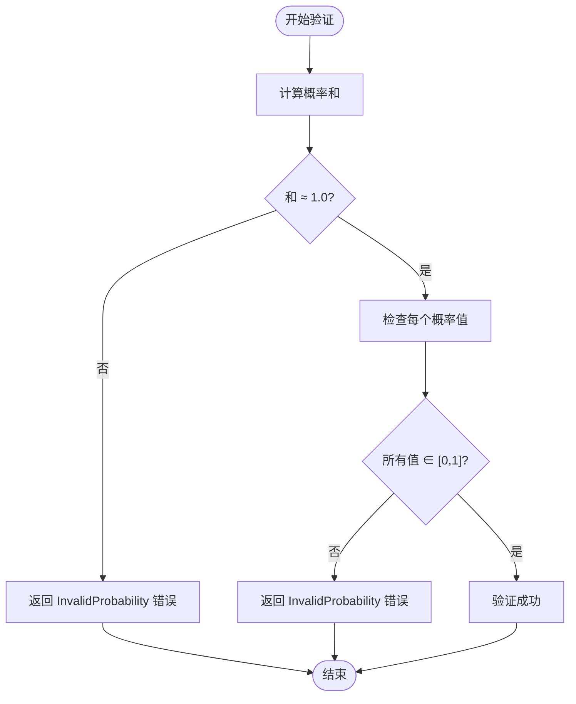
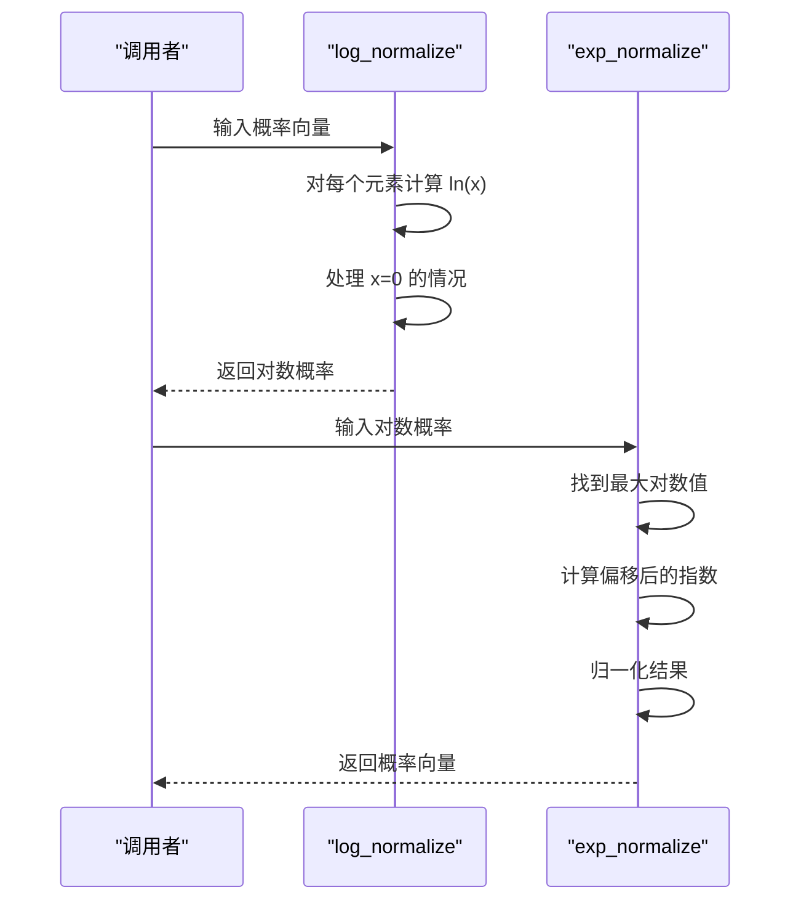
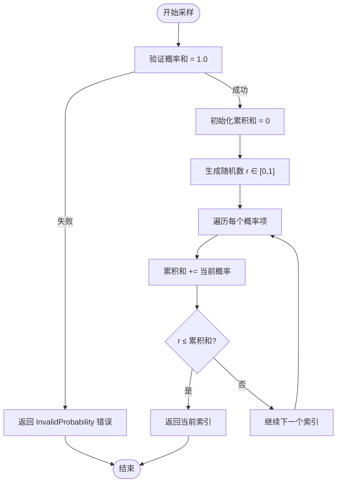
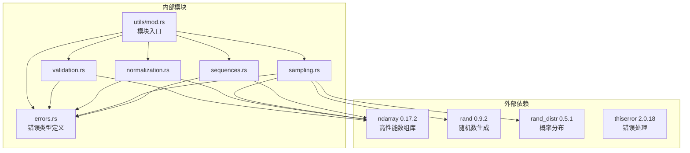

# 工具模块

<cite>
**本文档引用的文件**
- [src/utils/mod.rs](file://src/utils/mod.rs)
- [src/utils/validation.rs](file://src/utils/validation.rs)
- [src/utils/normalization.rs](file://src/utils/normalization.rs)
- [src/utils/sampling.rs](file://src/utils/sampling.rs)
- [src/utils/sequences.rs](file://src/utils/sequences.rs)
- [src/errors.rs](file://src/errors.rs)
- [src/lib.rs](file://src/lib.rs)
- [Cargo.toml](file://Cargo.toml)
- [examples/beta_hmm_example.rs](file://examples/beta_hmm_example.rs)
- [tests/integration_tests.rs](file://tests/integration_tests.rs)
</cite>

## 目录
1. [简介](#简介)
2. [项目结构](#项目结构)
3. [核心组件](#核心组件)
4. [架构概览](#架构概览)
5. [详细组件分析](#详细组件分析)
6. [依赖关系分析](#依赖关系分析)
7. [性能考虑](#性能考虑)
8. [故障排除指南](#故障排除指南)
9. [结论](#结论)
10. [附录](#附录)

## 简介

rhmm 库的工具模块提供了构建和操作隐马尔可夫模型所需的核心实用功能。该模块包含四个主要子模块：数据验证工具、数值归一化工具、随机采样工具和序列处理工具。这些工具为 HMM 的训练、预测和评估提供了坚实的基础支持。

工具模块的设计遵循以下原则：
- **类型安全**：使用 Rust 的强类型系统确保参数的有效性
- **数值稳定性**：实现数值稳定的算法以避免精度损失
- **错误处理**：提供清晰的错误信息和适当的错误类型
- **性能优化**：利用 ndarray 进行高效的数组操作

## 项目结构

工具模块位于 `src/utils/` 目录下，采用模块化设计，每个功能领域都有独立的模块文件。



**图表来源**
- [src/utils/mod.rs](file://src/utils/mod.rs#L1-L12)
- [src/utils/validation.rs](file://src/utils/validation.rs#L1-L141)
- [src/utils/normalization.rs](file://src/utils/normalization.rs#L1-L102)
- [src/utils/sampling.rs](file://src/utils/sampling.rs#L1-L130)
- [src/utils/sequences.rs](file://src/utils/sequences.rs#L1-L153)

**章节来源**
- [src/utils/mod.rs](file://src/utils/mod.rs#L1-L12)
- [src/lib.rs](file://src/lib.rs#L19-L23)

## 核心组件

工具模块包含四个核心组件，每个都针对特定的功能需求：

### 数据验证工具
- **概率向量验证**：检查概率分布的和是否等于1，且所有值在[0,1]范围内
- **转移矩阵验证**：验证马尔可夫转移矩阵的平方性和行和约束
- **观测数据验证**：确保观测数据具有正确的维度和非空性

### 数值归一化工具
- **向量归一化**：将任意正数向量转换为概率分布
- **矩阵行归一化**：对矩阵的每一行进行概率归一化
- **对数空间转换**：提供概率和对数概率之间的安全转换

### 随机采样工具
- **离散分布采样**：从给定的概率分布中进行索引采样
- **高斯分布采样**：从多变量高斯分布生成样本

### 序列处理工具
- **长度验证**：验证序列长度参数的正确性
- **序列分割**：将连接的观测序列分割为多个独立序列
- **默认长度**：提供单序列场景的默认长度配置

**章节来源**
- [src/utils/validation.rs](file://src/utils/validation.rs#L6-L74)
- [src/utils/normalization.rs](file://src/utils/normalization.rs#L5-L35)
- [src/utils/sampling.rs](file://src/utils/sampling.rs#L7-L70)
- [src/utils/sequences.rs](file://src/utils/sequences.rs#L16-L83)

## 架构概览

工具模块采用分层架构设计，通过统一的入口模块导出所有功能。



**图表来源**
- [src/utils/mod.rs](file://src/utils/mod.rs#L1-L12)
- [src/utils/validation.rs](file://src/utils/validation.rs#L1-L141)
- [src/utils/normalization.rs](file://src/utils/normalization.rs#L1-L102)
- [src/utils/sampling.rs](file://src/utils/sampling.rs#L1-L130)
- [src/utils/sequences.rs](file://src/utils/sequences.rs#L1-L153)

## 详细组件分析

### 数据验证工具

数据验证工具确保输入到 HMM 模型中的所有参数都符合数学约束和实际要求。

#### 概率向量验证

概率向量验证函数检查一维概率分布的两个关键属性：
1. **和的约束**：概率之和必须等于1.0（允许小的浮点误差）
2. **范围约束**：所有概率值必须在[0,1]范围内



**图表来源**
- [src/utils/validation.rs](file://src/utils/validation.rs#L6-L26)

#### 转移矩阵验证

转移矩阵验证确保马尔可夫链的数学正确性：
1. **矩阵形状**：必须是方阵（行数等于列数）
2. **行和约束**：每行的概率和必须等于1.0
3. **范围约束**：所有转移概率必须在[0,1]范围内

#### 观测数据验证

观测数据验证确保输入数据的维度正确性：
1. **非空性**：观测矩阵不能为空
2. **特征匹配**：列数必须与期望的特征数量一致

**章节来源**
- [src/utils/validation.rs](file://src/utils/validation.rs#L6-L74)

### 数值归一化工具

数值归一化工具提供概率分布转换和数值稳定性处理的核心功能。

#### 向量归一化

向量归一化将任意正数向量转换为概率分布：
- **零和处理**：当向量和为0时，保持原向量不变
- **逐元素除法**：每个元素除以向量和
- **和为1保证**：结果向量的和恒等于1.0

#### 矩阵行归一化

矩阵行归一化对每一行独立进行概率归一化：
- **轴迭代**：使用 ndarray 的轴迭代器高效处理
- **独立归一化**：每行内部独立计算和并进行归一化
- **内存效率**：就地修改减少内存分配

#### 对数空间转换

对数空间转换提供数值稳定性的概率表示：
- **安全对数**：对大于0的值计算自然对数，对0值返回负无穷
- **数值稳定**：使用最大值偏移技术防止溢出
- **反变换**：安全地将对数概率转换回概率空间



**图表来源**
- [src/utils/normalization.rs](file://src/utils/normalization.rs#L25-L35)

**章节来源**
- [src/utils/normalization.rs](file://src/utils/normalization.rs#L5-L35)

### 随机采样工具

随机采样工具提供从各种概率分布中生成样本的能力。

#### 离散分布采样

离散分布采样实现轮盘赌选择算法：
1. **概率验证**：确保输入概率和为1.0
2. **累积分布**：构建累积概率分布
3. **均匀采样**：生成[0,1]区间内的均匀随机数
4. **二分查找**：找到对应的索引位置



**图表来源**
- [src/utils/sampling.rs](file://src/utils/sampling.rs#L17-L38)

#### 高斯分布采样

高斯分布采样支持多变量正态分布：
- **独立采样**：每个维度独立从正态分布采样
- **参数验证**：验证均值和协方差参数的有效性
- **对角协方差**：当前版本仅支持对角协方差矩阵

**章节来源**
- [src/utils/sampling.rs](file://src/utils/sampling.rs#L7-L70)

### 序列处理工具

序列处理工具专门处理变长序列的组织和管理。

#### 长度验证

长度验证确保序列分割的正确性：
1. **非空检查**：长度数组不能为空
2. **总和匹配**：长度总和必须等于观测行数
3. **零长度检查**：不允许存在零长度序列

#### 序列分割

序列分割将连接的观测序列转换为独立序列：
- **视图操作**：使用 ndarray 的切片视图避免数据复制
- **内存效率**：通过视图共享底层数据
- **边界检查**：确保索引不越界

#### 默认长度

默认长度提供单序列场景的简化接口：
- **简单场景**：当只有一个序列时的便捷函数
- **向后兼容**：保持与单序列 API 的兼容性

**章节来源**
- [src/utils/sequences.rs](file://src/utils/sequences.rs#L16-L83)

## 依赖关系分析

工具模块的依赖关系体现了清晰的分层架构和最小耦合原则。



**图表来源**
- [Cargo.toml](file://Cargo.toml#L13-L19)
- [src/utils/mod.rs](file://src/utils/mod.rs#L1-L12)
- [src/errors.rs](file://src/errors.rs#L1-L35)

**章节来源**
- [Cargo.toml](file://Cargo.toml#L13-L19)
- [src/utils/mod.rs](file://src/utils/mod.rs#L1-L12)

## 性能考虑

工具模块在设计时充分考虑了性能优化和内存使用效率。

### 内存优化策略

1. **就地操作**：归一化函数直接修改输入数组，避免额外内存分配
2. **视图共享**：序列分割使用 ndarray 切片视图，共享底层数据
3. **零拷贝设计**：尽量避免不必要的数据复制

### 算法复杂度

- **验证操作**：O(n) 时间复杂度，其中 n 是向量或矩阵的元素数量
- **归一化操作**：O(n) 时间复杂度，需要遍历所有元素
- **采样操作**：O(k) 时间复杂度，k 是概率向量的长度
- **序列分割**：O(m) 时间复杂度，m 是序列数量

### 数值稳定性

1. **对数空间**：使用对数概率避免数值下溢
2. **最大值偏移**：在指数转换前减去最大值防止溢出
3. **容差比较**：使用1e-6的容差处理浮点精度问题

## 故障排除指南

### 常见错误类型

工具模块定义了专门的错误类型来处理各种异常情况：

```mermaid
classDiagram
class HmmError {
<<enumeration>>
+InvalidParameter(String)
+DimensionMismatch {expected : usize, actual : usize}
+InvalidProbability(String)
+ModelNotFitted(String)
+ConvergenceError(String)
+InvalidState(String)
+NumericalError(String)
+IoError(Error)
}
class ValidationError {
+InvalidProbability
+InvalidParameter
+DimensionMismatch
}
class SamplingError {
+InvalidProbability
+InvalidParameter
}
class SequenceError {
+InvalidParameter
}
HmmError <|-- ValidationError
HmmError <|-- SamplingError
HmmError <|-- SequenceError
```

**图表来源**
- [src/errors.rs](file://src/errors.rs#L9-L34)

### 错误诊断步骤

1. **验证输入参数**：使用相应的验证函数检查参数有效性
2. **检查维度匹配**：确保矩阵和向量的维度符合预期
3. **确认概率约束**：验证概率和是否为1.0，概率值是否在[0,1]范围内
4. **检查序列长度**：对于变长序列，确保长度数组的正确性

**章节来源**
- [src/errors.rs](file://src/errors.rs#L9-L34)

## 结论

rhmm 库的工具模块提供了构建高质量 HMM 应用程序所需的完整工具集。该模块的设计体现了以下优势：

1. **完整性**：涵盖了 HMM 开发所需的所有核心工具功能
2. **安全性**：通过严格的类型检查和错误处理确保程序稳定性
3. **性能**：优化的算法和内存使用策略提高了运行效率
4. **可维护性**：清晰的模块化设计便于理解和扩展

工具模块的成功实施为整个 rhmm 库奠定了坚实的基础，使得开发者能够专注于 HMM 模型的高级功能而无需担心底层实现细节。

## 附录

### 使用示例

#### 数据验证示例
```rust
use rhmm::utils::validate_probability_vector;
use ndarray::array;

let probs = array![0.3, 0.5, 0.2];
validate_probability_vector(&probs, "测试概率")?;
```

#### 数值归一化示例
```rust
use rhmm::utils::normalize_vector;
use ndarray::array;

let vec = array![1.0, 2.0, 3.0];
let normalized = normalize_vector(vec);
```

#### 随机采样示例
```rust
use rhmm::utils::sample_discrete;
use ndarray::array;
use rand::thread_rng;

let mut rng = thread_rng();
let probs = array![0.5, 0.3, 0.2];
let sample_index = sample_discrete(&probs, &mut rng)?;
```

#### 序列处理示例
```rust
use rhmm::utils::{split_sequences, default_lengths};
use ndarray::array;

let observations = array![[1.0, 2.0], [3.0, 4.0], [5.0, 6.0]];
let lengths = default_lengths(3);
let sequences = split_sequences(&observations, &lengths)?;
```

### 最佳实践建议

1. **始终验证输入**：在使用任何工具函数之前，先验证输入参数的有效性
2. **处理错误情况**：正确处理和响应各种错误类型
3. **内存管理**：优先使用就地操作以减少内存分配
4. **数值稳定性**：在涉及概率计算时使用对数空间
5. **性能监控**：对于大规模数据，考虑批处理和并行化策略

### 扩展指导

要扩展工具模块，建议遵循以下模式：

1. **添加新功能**：在相应的模块文件中添加新函数
2. **更新模块入口**：在 `utils/mod.rs` 中导出新函数
3. **编写测试**：为新功能编写全面的单元测试
4. **文档注释**：添加详细的文档注释和使用示例
5. **性能测试**：确保新功能的性能符合预期