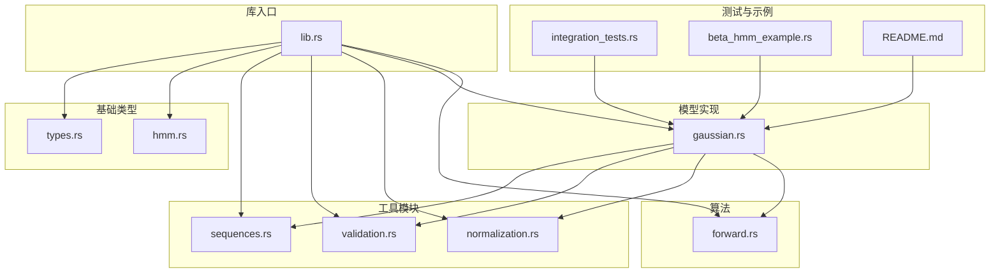
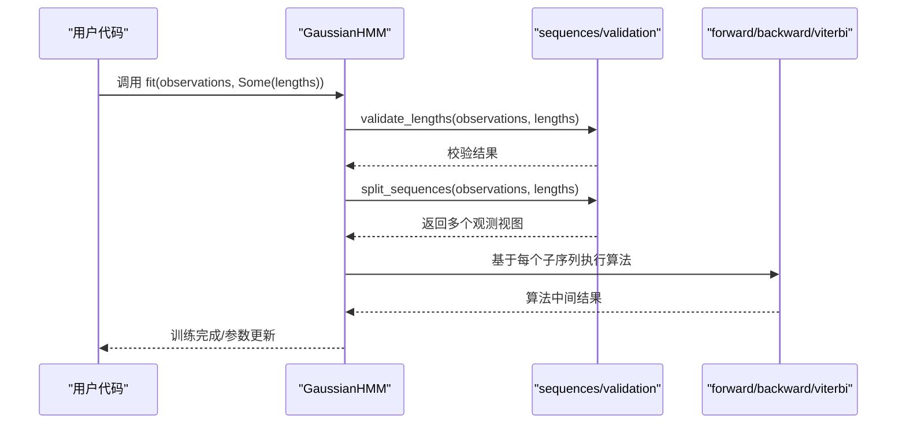
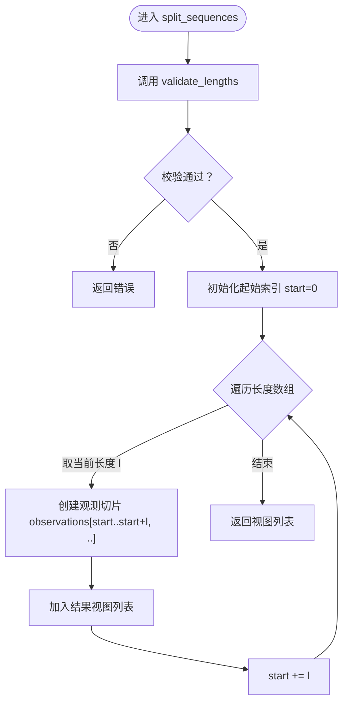
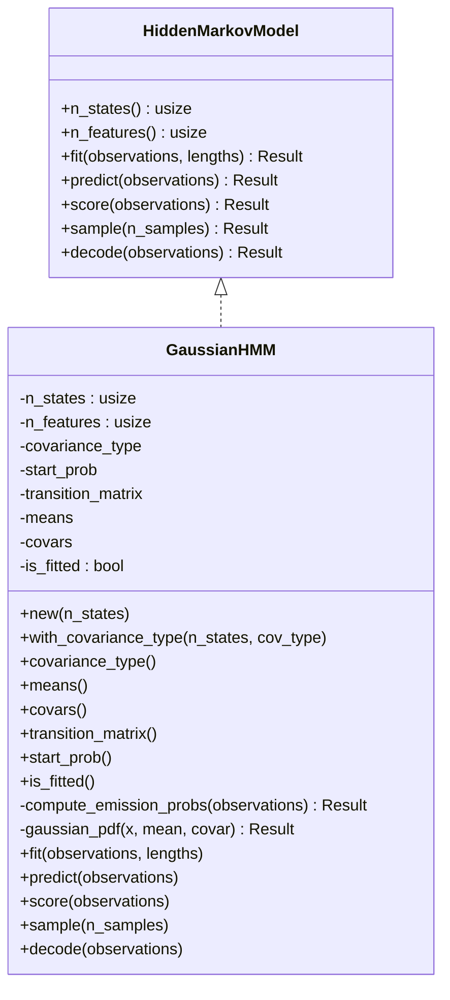
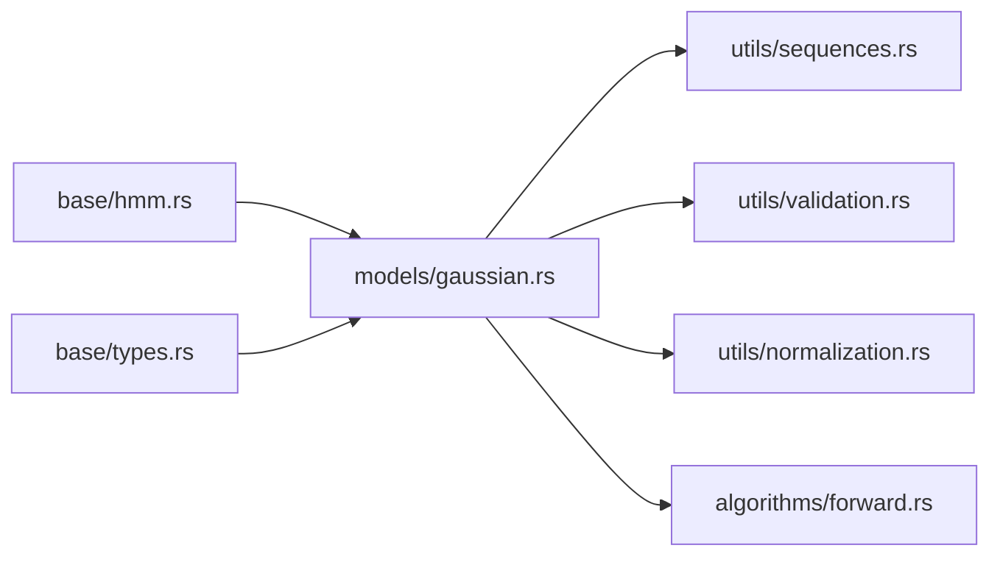

# 序列处理工具

<cite>
**本文引用的文件**
- [src/lib.rs](file://src/lib.rs)
- [src/utils/sequences.rs](file://src/utils/sequences.rs)
- [src/utils/validation.rs](file://src/utils/validation.rs)
- [src/utils/normalization.rs](file://src/utils/normalization.rs)
- [src/base/hmm.rs](file://src/base/hmm.rs)
- [src/base/types.rs](file://src/base/types.rs)
- [src/models/gaussian.rs](file://src/models/gaussian.rs)
- [src/algorithms/forward.rs](file://src/algorithms/forward.rs)
- [src/errors.rs](file://src/errors.rs)
- [tests/integration_tests.rs](file://tests/integration_tests.rs)
- [examples/beta_hmm_example.rs](file://examples/beta_hmm_example.rs)
- [README.md](file://README.md)
</cite>

## 目录
1. [简介](#简介)
2. [项目结构](#项目结构)
3. [核心组件](#核心组件)
4. [架构总览](#架构总览)
5. [详细组件分析](#详细组件分析)
6. [依赖关系分析](#依赖关系分析)
7. [性能考量](#性能考量)
8. [故障排查指南](#故障排查指南)
9. [结论](#结论)
10. [附录：使用示例与最佳实践](#附录使用示例与最佳实践)

## 简介
本文件聚焦于 rhmm 库中的“序列处理工具”，系统阐述以下主题：
- 变长序列的处理机制：长度校验、拆分与默认长度策略
- 批量序列数据的组织：二维数组的内存布局与访问模式
- 序列索引与切片：边界检查与性能优化思路
- 多序列 HMM 训练中的应用：如何将多个变长序列拼接后传入模型，并通过长度参数进行正确分割
- 函数使用示例与最佳实践
- 与模型训练流程的集成方式
- 大数据序列处理的性能与内存管理策略

## 项目结构
rhmm 使用模块化设计，序列处理工具位于 utils 子模块中，配合基础类型定义、模型实现与算法模块共同完成多序列 HMM 的训练与推理。

**图示来源**
- [src/lib.rs](file://src/lib.rs#L1-L28)
- [src/base/types.rs](file://src/base/types.rs#L1-L61)
- [src/base/hmm.rs](file://src/base/hmm.rs#L1-L62)
- [src/utils/sequences.rs](file://src/utils/sequences.rs#L1-L153)
- [src/utils/validation.rs](file://src/utils/validation.rs#L1-L141)
- [src/utils/normalization.rs](file://src/utils/normalization.rs#L1-L102)
- [src/models/gaussian.rs](file://src/models/gaussian.rs#L1-L200)
- [src/algorithms/forward.rs](file://src/algorithms/forward.rs#L1-L129)
- [tests/integration_tests.rs](file://tests/integration_tests.rs#L1-L103)
- [examples/beta_hmm_example.rs](file://examples/beta_hmm_example.rs#L1-L266)
- [README.md](file://README.md#L1-L303)

**章节来源**
- [src/lib.rs](file://src/lib.rs#L1-L28)
- [README.md](file://README.md#L1-L303)

## 核心组件
- 序列长度校验与拆分：提供 validate_lengths、split_sequences、default_lengths，确保输入观测矩阵的行数与长度数组之和一致，且无零长度；支持将拼接后的观测矩阵按长度拆分为多个视图。
- 观测数据组织：统一使用二维数组（ndarray::Array2<f64>）表示观测序列，形状为 (样本数, 特征维数)，便于向量化计算与算法复用。
- 参数验证与归一化：提供概率向量与转移矩阵的合法性校验，以及向量/矩阵行的归一化与对数空间转换，保障数值稳定与概率语义正确。
- 模型接口与训练流程：HiddenMarkovModel trait 的 fit 方法接受可选的长度数组，用于多序列场景下的分段训练。

**章节来源**
- [src/utils/sequences.rs](file://src/utils/sequences.rs#L16-L83)
- [src/base/types.rs](file://src/base/types.rs#L11-L12)
- [src/utils/validation.rs](file://src/utils/validation.rs#L6-L74)
- [src/utils/normalization.rs](file://src/utils/normalization.rs#L5-L35)
- [src/base/hmm.rs](file://src/base/hmm.rs#L14-L20)

## 架构总览
下图展示了多序列 HMM 训练中“序列处理工具”与“模型实现”的交互关系，以及数据在各模块间的流转。

**图示来源**
- [src/models/gaussian.rs](file://src/models/gaussian.rs#L1-L200)
- [src/utils/sequences.rs](file://src/utils/sequences.rs#L16-L70)
- [src/algorithms/forward.rs](file://src/algorithms/forward.rs#L20-L47)

## 详细组件分析

### 组件A：序列长度校验与拆分
- 功能要点
  - validate_lengths：校验长度数组非空、元素均为正整数、其和等于观测矩阵的行数（样本总数）
  - split_sequences：基于长度数组对观测矩阵进行切片，返回多个 ArrayView2 视图，避免复制
  - default_lengths：当仅有一个序列时，生成单元素长度数组
- 数据结构与复杂度
  - 长度数组长度为 K，时间复杂度 O(K)，空间复杂度 O(1)
  - 切片操作为视图创建，O(1) 时间与常量空间
- 边界检查与错误处理
  - 空长度数组、零长度、总和不匹配均触发错误
  - 错误类型由库内 HmmError 提供，便于上层捕获与处理
- 性能优化
  - 使用视图而非复制，减少内存占用与拷贝开销
  - 预分配 Vec 容量，降低扩容成本

**图示来源**
- [src/utils/sequences.rs](file://src/utils/sequences.rs#L16-L70)

**章节来源**
- [src/utils/sequences.rs](file://src/utils/sequences.rs#L16-L83)
- [src/errors.rs](file://src/errors.rs#L9-L34)

### 组件B：观测数据组织与访问模式
- 内存布局
  - 观测矩阵采用行主序存储，每行代表一个时间步的观测，每列代表一个特征维度
  - 对于多序列拼接，仍保持同一二维布局，通过长度数组在算法层进行分段
- 访问模式
  - 行迭代：适合按时间步遍历
  - 切片视图：避免复制，提升缓存局部性
- 与算法的契合
  - 算法模块（如前向算法）直接以二维数组作为输入，无需额外转换

**章节来源**
- [src/base/types.rs](file://src/base/types.rs#L11-L12)
- [src/algorithms/forward.rs](file://src/algorithms/forward.rs#L20-L47)

### 组件C：参数验证与数值稳定性
- 概率向量与转移矩阵校验
  - 概率向量：要求非负且和为 1
  - 转移矩阵：要求方阵且每行和为 1 且非负
- 归一化与对数空间
  - 向量/矩阵行归一化，保证概率语义
  - 对数归一化与指数反变换，避免下溢并保持数值稳定

**章节来源**
- [src/utils/validation.rs](file://src/utils/validation.rs#L6-L74)
- [src/utils/normalization.rs](file://src/utils/normalization.rs#L5-L35)

### 组件D：模型接口与多序列训练集成
- 接口约定
  - HiddenMarkovModel::fit 接受可选长度数组，用于指示多序列拼接后的各序列长度
- 实现要点
  - 模型内部先进行长度校验，再拆分观测，随后对每个子序列执行算法
  - 支持不同协方差类型的高斯 HMM，训练流程与序列处理解耦

**图示来源**
- [src/base/hmm.rs](file://src/base/hmm.rs#L7-L61)
- [src/models/gaussian.rs](file://src/models/gaussian.rs#L11-L100)

**章节来源**
- [src/base/hmm.rs](file://src/base/hmm.rs#L14-L20)
- [src/models/gaussian.rs](file://src/models/gaussian.rs#L1-L200)

## 依赖关系分析
- 模块耦合
  - 模型实现依赖序列处理工具与验证/归一化工具，形成清晰的分层
  - 算法模块独立于具体模型，仅依赖观测与概率矩阵，便于复用
- 外部依赖
  - ndarray 为核心数值库，提供高效的多维数组与视图能力
  - 通过 trait 将模型与算法解耦，利于扩展新模型或新算法

**图示来源**
- [src/models/gaussian.rs](file://src/models/gaussian.rs#L1-L200)
- [src/utils/sequences.rs](file://src/utils/sequences.rs#L1-L153)
- [src/utils/validation.rs](file://src/utils/validation.rs#L1-L141)
- [src/utils/normalization.rs](file://src/utils/normalization.rs#L1-L102)
- [src/algorithms/forward.rs](file://src/algorithms/forward.rs#L1-L129)
- [src/base/hmm.rs](file://src/base/hmm.rs#L1-L62)
- [src/base/types.rs](file://src/base/types.rs#L1-L61)

**章节来源**
- [src/lib.rs](file://src/lib.rs#L19-L27)

## 性能考量
- 内存效率
  - 使用视图（ArrayView2）替代复制，显著降低内存占用与拷贝成本
  - 预分配结果容器容量，减少动态扩容
- 计算效率
  - 以二维数组为统一数据结构，便于向量化与缓存友好访问
  - 在算法中优先使用就地归一化与对数空间运算，避免频繁分配
- 大数据处理
  - 对于超长序列，建议分批处理或分段训练，结合长度数组进行多序列建模
  - 控制协方差类型与特征维度，平衡模型复杂度与内存占用

[本节为通用性能指导，不直接分析特定文件]

## 故障排查指南
- 常见错误类型
  - 参数非法：长度数组为空、存在零长度、总和与样本数不一致
  - 维度不匹配：观测列数与期望特征数不符
  - 概率非法：概率向量或转移矩阵不满足非负与和为 1 的约束
  - 模型未拟合：在预测或评分前未完成 fit
- 定位与修复
  - 先调用 validate_lengths 与 validate_observations 进行预检
  - 使用 normalize_vector/normalize_matrix_rows 修正概率分布
  - 在 fit 前确保已设置必要的初始参数（如起始概率、转移矩阵）

**章节来源**
- [src/utils/sequences.rs](file://src/utils/sequences.rs#L16-L41)
- [src/utils/validation.rs](file://src/utils/validation.rs#L58-L74)
- [src/errors.rs](file://src/errors.rs#L9-L34)

## 结论
rhmm 的序列处理工具以简洁而稳健的方式支撑了多序列 HMM 的训练与推理：通过严格的长度校验与视图切分，实现了对变长序列的高效组织；配合参数验证与数值稳定技术，保障了模型训练的可靠性。该工具与模型接口、算法模块协同良好，适用于多种实际应用场景。

[本节为总结性内容，不直接分析特定文件]

## 附录：使用示例与最佳实践

### 使用示例
- 多序列拼接与长度数组
  - 将多个变长序列按时间顺序拼接为一个二维观测矩阵
  - 提供长度数组，指示每个序列的样本数
  - 通过模型的 fit 方法传入 Some(&lengths)，启用多序列训练路径
- 示例参考
  - README 中提供了多序列训练的示例片段
  - 集成测试覆盖了多序列 fit 的流程
  - Beta HMM 示例展示了完整的建模流程（可迁移至多序列场景）

**章节来源**
- [README.md](file://README.md#L232-L240)
- [tests/integration_tests.rs](file://tests/integration_tests.rs#L75-L85)
- [examples/beta_hmm_example.rs](file://examples/beta_hmm_example.rs#L57-L70)

### 最佳实践建议
- 数据准备
  - 明确特征维度，确保所有序列的列数一致
  - 对观测进行必要的归一化或标准化，提升模型稳定性
- 长度数组管理
  - 严格校验长度数组，避免零长度与总和不匹配
  - 若仅有一个序列，使用 default_lengths 生成单元素数组
- 训练流程
  - 先进行参数与观测校验，再执行 fit
  - 对于长序列，考虑分段训练或调整协方差类型以控制内存
- 错误处理
  - 捕获并区分不同类型的错误，针对性修复
  - 在预测/评分前检查模型是否已拟合

**章节来源**
- [src/utils/sequences.rs](file://src/utils/sequences.rs#L72-L83)
- [src/utils/validation.rs](file://src/utils/validation.rs#L6-L26)
- [src/errors.rs](file://src/errors.rs#L9-L34)