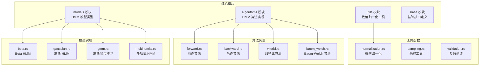
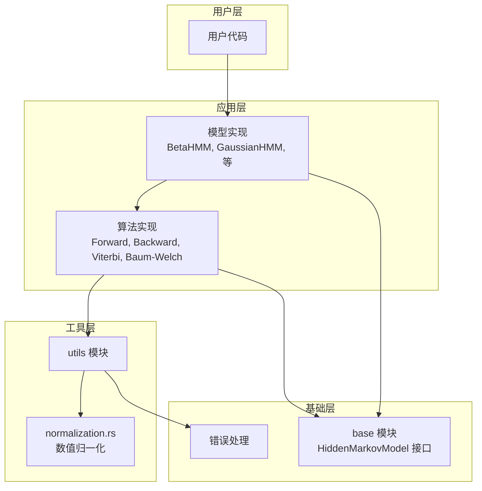
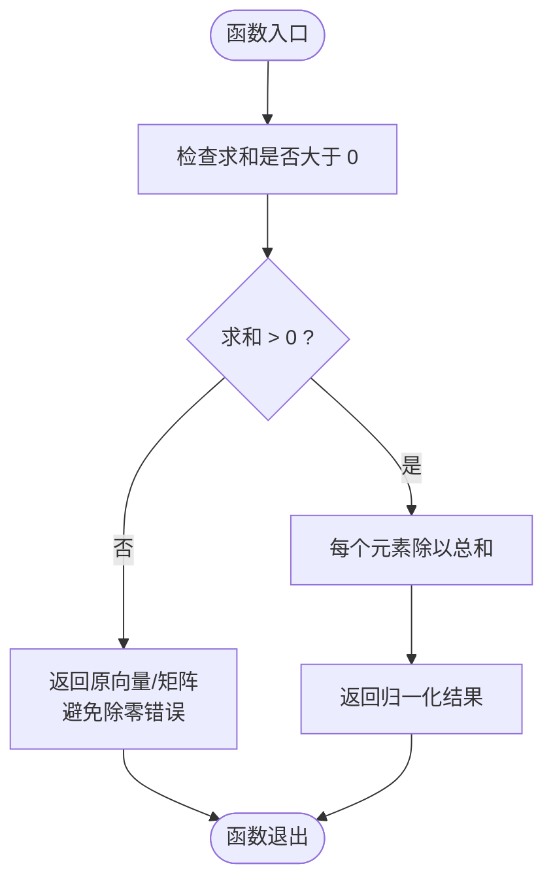
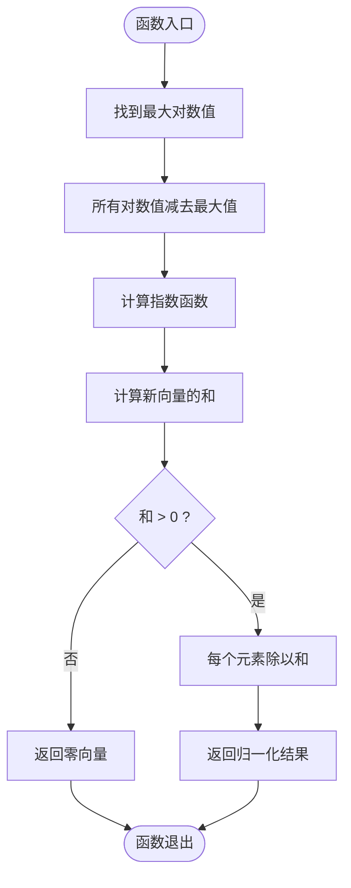
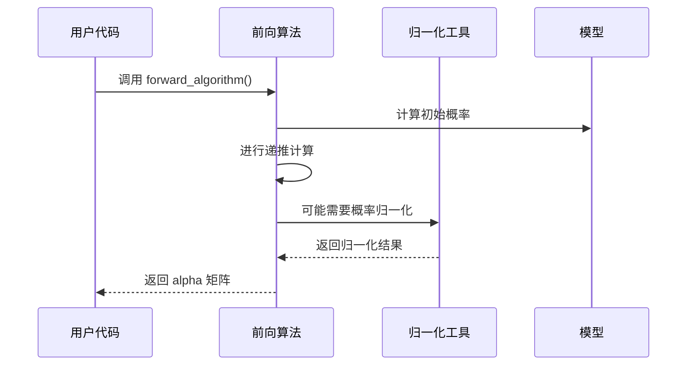
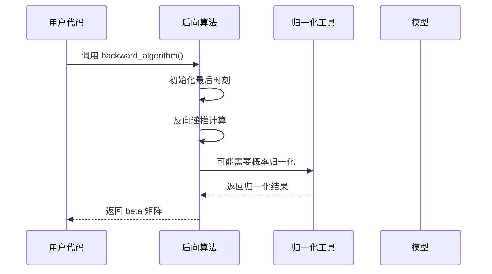
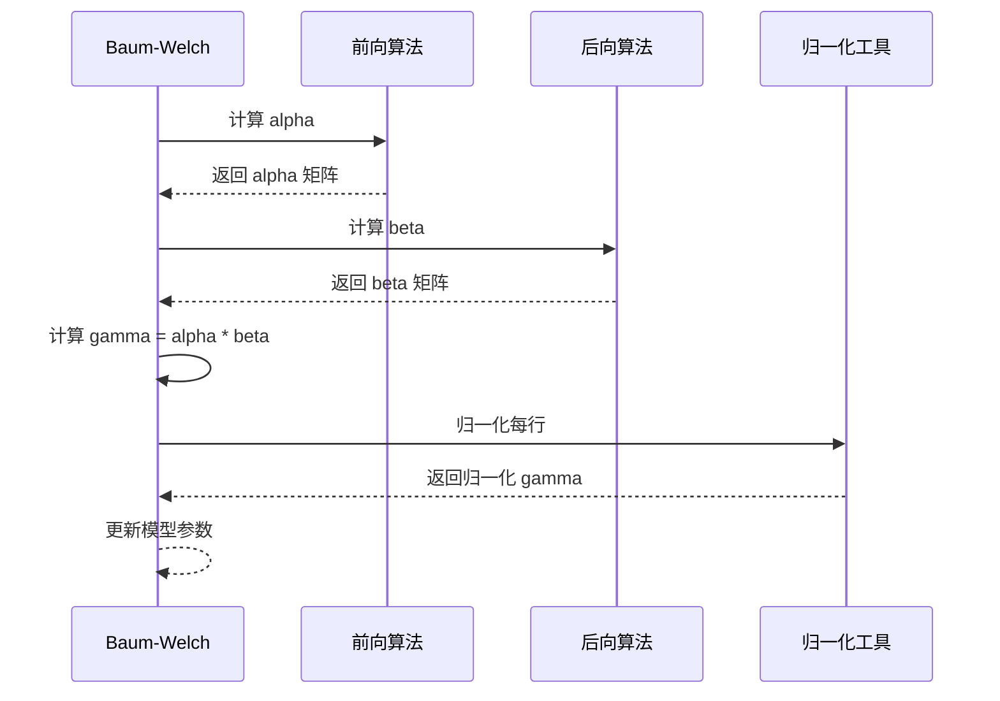
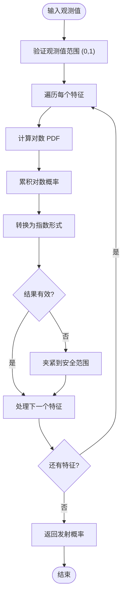
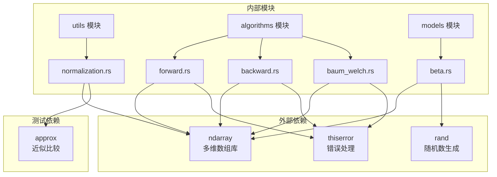

# 数值归一化工具

<cite>
**本文档引用的文件**
- [src/utils/normalization.rs](file://src/utils/normalization.rs)
- [src/algorithms/forward.rs](file://src/algorithms/forward.rs)
- [src/algorithms/backward.rs](file://src/algorithms/backward.rs)
- [src/algorithms/baum_welch.rs](file://src/algorithms/baum_welch.rs)
- [src/models/beta.rs](file://src/models/beta.rs)
- [src/utils/mod.rs](file://src/utils/mod.rs)
- [src/algorithms/mod.rs](file://src/algorithms/mod.rs)
- [src/lib.rs](file://src/lib.rs)
- [README.md](file://README.md)
- [examples/beta_hmm_example.rs](file://examples/beta_hmm_example.rs)
</cite>

## 目录
1. [简介](#简介)
2. [项目结构](#项目结构)
3. [核心组件](#核心组件)
4. [架构概览](#架构概览)
5. [详细组件分析](#详细组件分析)
6. [依赖关系分析](#依赖关系分析)
7. [性能考虑](#性能考虑)
8. [故障排除指南](#故障排除指南)
9. [结论](#结论)

## 简介

rhmm 库的数值归一化工具是隐藏马尔可夫模型（HMM）算法中的关键组件，专门用于处理概率计算中的数值稳定性问题。该工具集提供了多种归一化方法，包括标准概率归一化和对数概率归一化，确保在高维数据和长时间序列分析中的数值精度。

该库的设计理念是通过数学上的 log-sum-exp 技巧来解决数值溢出和下溢问题，同时保持计算效率。归一化工具在前向算法、后向算法和发射概率计算中发挥着至关重要的作用，为整个 HMM 算法栈提供了坚实的数值基础。

## 项目结构

rhmm 库采用模块化设计，将功能按职责清晰分离：

**图表来源**
- [src/lib.rs](file://src/lib.rs#L19-L27)
- [src/utils/mod.rs](file://src/utils/mod.rs#L1-L12)
- [src/algorithms/mod.rs](file://src/algorithms/mod.rs#L1-L12)

**章节来源**
- [src/lib.rs](file://src/lib.rs#L1-L28)
- [src/utils/mod.rs](file://src/utils/mod.rs#L1-L12)
- [src/algorithms/mod.rs](file://src/algorithms/mod.rs#L1-L12)

## 核心组件

数值归一化工具的核心功能由四个主要函数组成：

### 1. 标准概率归一化

- `normalize_vector`: 将概率向量归一化为和为 1
- `normalize_matrix_rows`: 将矩阵的每一行归一化为和为 1

### 2. 对数概率归一化

- `log_normalize`: 安全地将概率转换到对数空间
- `exp_normalize`: 将对数概率转换回概率空间

这些函数共同构成了完整的数值归一化解决方案，解决了 HMM 算法中的核心数值稳定性问题。

**章节来源**
- [src/utils/normalization.rs](file://src/utils/normalization.rs#L5-L35)

## 架构概览

数值归一化工具在整个 HMM 系统中的架构位置如下：

**图表来源**
- [src/lib.rs](file://src/lib.rs#L19-L27)
- [src/utils/mod.rs](file://src/utils/mod.rs#L1-L12)
- [src/algorithms/mod.rs](file://src/algorithms/mod.rs#L1-L12)

## 详细组件分析

### 数值归一化函数实现

#### 标准概率归一化

标准概率归一化函数实现了基本的概率向量和矩阵行归一化：

**图表来源**
- [src/utils/normalization.rs](file://src/utils/normalization.rs#L6-L23)

#### 对数概率归一化

对数概率归一化采用了 log-sum-exp 技巧来处理数值稳定性：

**图表来源**
- [src/utils/normalization.rs](file://src/utils/normalization.rs#L31-L35)

### 数学基础和实现原理

#### L1 归一化原理

L1 归一化基于概率论的基本原理：
- 概率向量的所有元素必须非负
- 所有概率的和必须等于 1
- 归一化公式：`p_i' = p_i / Σ_j p_j`

#### 数值稳定性处理

对数概率归一化通过以下技巧确保数值稳定性：

1. **log-sum-exp 技巧**: 使用 `max_log` 避免指数运算溢出
2. **数值溢出防护**: 在计算指数之前先进行数值移位
3. **零概率处理**: 对于零概率直接映射到负无穷大

**章节来源**
- [src/utils/normalization.rs](file://src/utils/normalization.rs#L5-L35)

### 在 HMM 算法中的应用

#### 前向算法中的归一化

前向算法在计算过程中会产生非常小的概率值，需要适当的归一化处理：

**图表来源**
- [src/algorithms/forward.rs](file://src/algorithms/forward.rs#L20-L47)
- [src/utils/normalization.rs](file://src/utils/normalization.rs#L6-L12)

#### 后向算法中的归一化

后向算法同样需要处理概率归一化：

**图表来源**
- [src/algorithms/backward.rs](file://src/algorithms/backward.rs#L19-L45)
- [src/utils/normalization.rs](file://src/utils/normalization.rs#L6-L12)

#### Baum-Welch 算法中的归一化

Baum-Welch 算法在 E 步骤中需要计算 gamma 值：

**图表来源**
- [src/algorithms/baum_welch.rs](file://src/algorithms/baum_welch.rs#L56-L74)
- [src/utils/normalization.rs](file://src/utils/normalization.rs#L6-L12)

**章节来源**
- [src/algorithms/forward.rs](file://src/algorithms/forward.rs#L20-L69)
- [src/algorithms/backward.rs](file://src/algorithms/backward.rs#L19-L45)
- [src/algorithms/baum_welch.rs](file://src/algorithms/baum_welch.rs#L56-L74)

### 发射概率计算中的数值稳定处理

Beta HMM 的发射概率计算展示了归一化工具在实际应用中的重要作用：

**图表来源**
- [src/models/beta.rs](file://src/models/beta.rs#L126-L157)
- [src/models/beta.rs](file://src/models/beta.rs#L173-L197)

**章节来源**
- [src/models/beta.rs](file://src/models/beta.rs#L126-L157)
- [src/models/beta.rs](file://src/models/beta.rs#L173-L197)

## 依赖关系分析

数值归一化工具与其他模块的依赖关系：

**图表来源**
- [src/utils/normalization.rs](file://src/utils/normalization.rs#L3)
- [src/algorithms/forward.rs](file://src/algorithms/forward.rs#L3-L4)
- [src/algorithms/backward.rs](file://src/algorithms/backward.rs#L3-L4)
- [src/algorithms/baum_welch.rs](file://src/algorithms/baum_welch.rs#L3-L6)
- [src/models/beta.rs](file://src/models/beta.rs#L3-L12)

**章节来源**
- [src/utils/normalization.rs](file://src/utils/normalization.rs#L1-L102)
- [src/algorithms/forward.rs](file://src/algorithms/forward.rs#L1-L129)
- [src/algorithms/backward.rs](file://src/algorithms/backward.rs#L1-L90)
- [src/algorithms/baum_welch.rs](file://src/algorithms/baum_welch.rs#L1-L75)
- [src/models/beta.rs](file://src/models/beta.rs#L1-L200)

## 性能考虑

### 内存使用优化

1. **就地操作**: 归一化函数支持就地修改，减少内存分配
2. **向量化操作**: 利用 ndarray 的向量化特性提高计算效率
3. **最小化临时对象**: 避免不必要的中间变量创建

### 计算复杂度

- **向量归一化**: 时间复杂度 O(n)，空间复杂度 O(1)
- **矩阵行归一化**: 时间复杂度 O(m×n)，空间复杂度 O(1)
- **对数概率转换**: 时间复杂度 O(n)，空间复杂度 O(n)

### 数值精度控制

1. **浮点数精度**: 使用 f64 提供双精度计算
2. **溢出防护**: 通过 log-sum-exp 技巧避免数值溢出
3. **零值处理**: 正确处理零概率和零和的情况

**章节来源**
- [src/utils/normalization.rs](file://src/utils/normalization.rs#L6-L35)

## 故障排除指南

### 常见问题和解决方案

#### 归一化失败

**问题**: 概率和为零导致归一化失败
**解决方案**: 检查输入数据的有效性，确保概率值非负且至少有一个正值

#### 数值溢出

**问题**: 对数概率过大导致指数运算溢出
**解决方案**: 使用 log-sum-exp 技巧，先减去最大值再计算指数

#### 性能问题

**问题**: 大规模数据处理时内存不足
**解决方案**: 考虑分块处理或使用更高效的数据结构

### 测试策略

归一化工具包含全面的测试覆盖：

- **边界条件测试**: 零向量、单元素向量等
- **精度测试**: 使用近似比较确保数值精度
- **异常情况测试**: 非法输入、空输入等

**章节来源**
- [src/utils/normalization.rs](file://src/utils/normalization.rs#L37-L101)

## 结论

rhmm 库的数值归一化工具为 HMM 算法提供了坚实的数值稳定性基础。通过精心设计的归一化函数和 log-sum-exp 技巧，该工具成功解决了概率计算中的核心数值问题。

### 主要优势

1. **数值稳定性**: 通过 log-sum-exp 技巧确保计算精度
2. **性能优化**: 就地操作和向量化计算提高执行效率
3. **模块化设计**: 清晰的接口设计便于集成和扩展
4. **全面测试**: 完善的测试套件保证代码质量

### 应用场景

该归一化工具适用于各种 HMM 应用场景，包括：
- 金融时间序列分析
- 生物信息学序列建模
- 自然语言处理
- 信号处理和模式识别

通过合理使用这些归一化工具，开发者可以构建更加稳健和高效的 HMM 应用程序，处理从简单到复杂的各种实际问题。