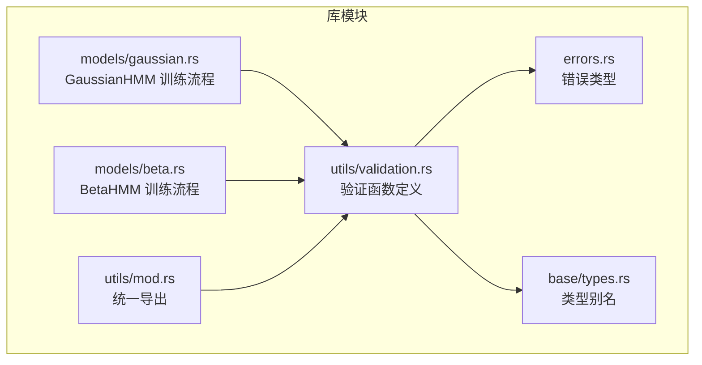
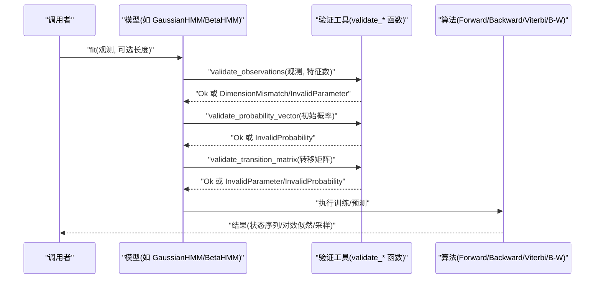
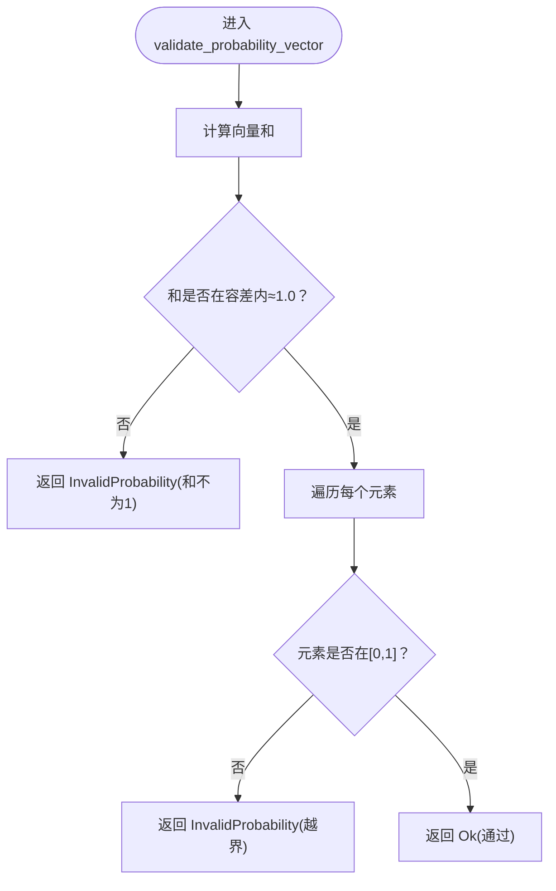
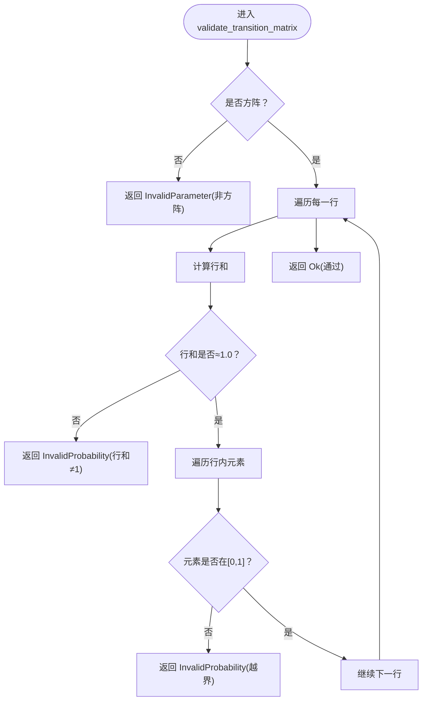
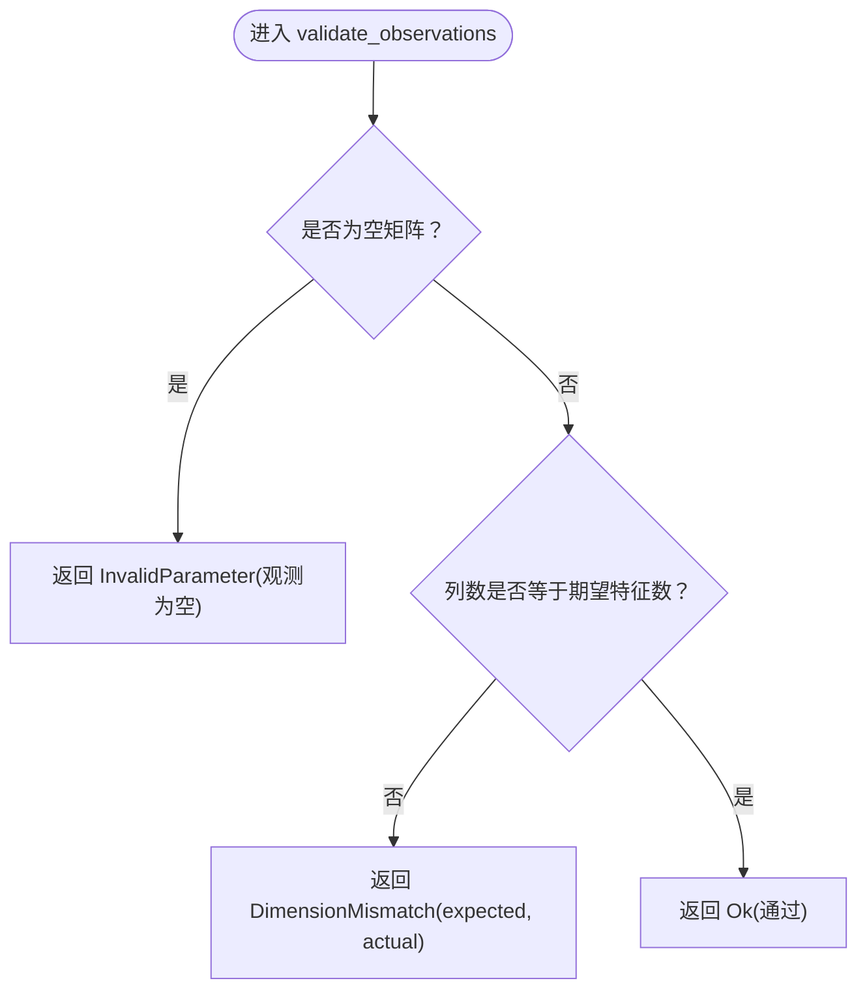
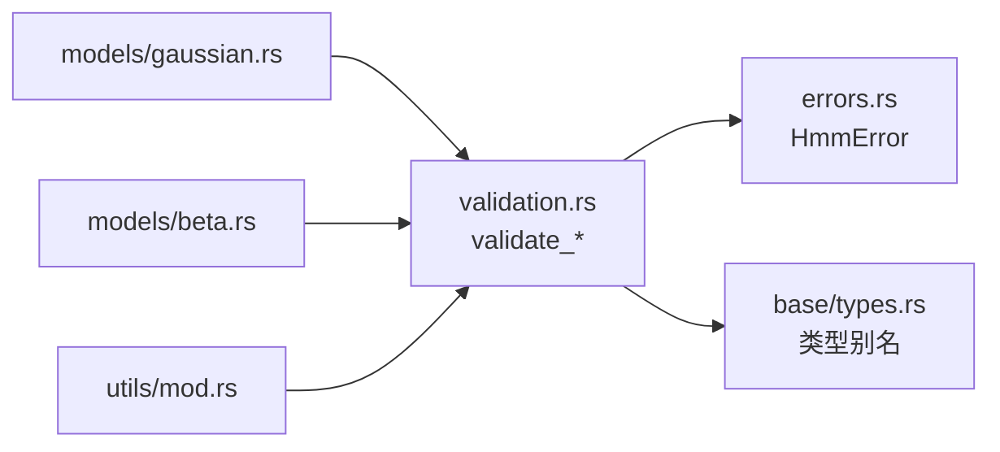

# 数据验证工具

<cite>
**本文引用的文件**
- [src/utils/validation.rs](file://src/utils/validation.rs)
- [src/errors.rs](file://src/errors.rs)
- [src/models/gaussian.rs](file://src/models/gaussian.rs)
- [src/models/beta.rs](file://src/models/beta.rs)
- [src/utils/mod.rs](file://src/utils/mod.rs)
- [src/base/types.rs](file://src/base/types.rs)
- [tests/integration_tests.rs](file://tests/integration_tests.rs)
- [examples/beta_hmm_example.rs](file://examples/beta_hmm_example.rs)
</cite>

## 目录
1. [简介](#简介)
2. [项目结构](#项目结构)
3. [核心组件](#核心组件)
4. [架构总览](#架构总览)
5. [详细组件分析](#详细组件分析)
6. [依赖关系分析](#依赖关系分析)
7. [性能考量](#性能考量)
8. [故障排查指南](#故障排查指南)
9. [结论](#结论)
10. [附录：使用示例与最佳实践](#附录使用示例与最佳实践)

## 简介
本文件聚焦于 rhmm 库中的数据验证工具，系统性阐述以下三个关键验证函数的实现原理与使用方式：
- 概率向量验证函数 validate_probability_vector：确保向量元素在 [0,1] 范围内且求和为 1（允许浮点误差）
- 转移矩阵验证函数 validate_transition_matrix：确保矩阵为方阵、每行和为 1（允许浮点误差）且元素在 [0,1] 范围内
- 观测数据验证函数 validate_observations：确保观测矩阵非空且列数（特征维度）与期望一致

文档还说明这些验证在 HMM 训练与预测流程中的作用、数值精度处理策略、错误处理机制以及性能优化建议，并提供可直接参考的代码片段路径。

## 项目结构
验证工具位于 utils/validation.rs，通过 re-export 在库根模块中暴露；多个模型在训练前调用这些验证函数进行参数合法性检查。

图表来源
- [src/utils/validation.rs](file://src/utils/validation.rs#L1-L141)
- [src/errors.rs](file://src/errors.rs#L1-L105)
- [src/base/types.rs](file://src/base/types.rs#L1-L61)
- [src/models/gaussian.rs](file://src/models/gaussian.rs#L1-L200)
- [src/models/beta.rs](file://src/models/beta.rs#L1-L200)
- [src/utils/mod.rs](file://src/utils/mod.rs#L1-L12)

章节来源
- [src/utils/validation.rs](file://src/utils/validation.rs#L1-L141)
- [src/utils/mod.rs](file://src/utils/mod.rs#L1-L12)

## 核心组件
- validate_probability_vector：对一维概率向量进行范围与归一化校验，用于初始状态概率、发射概率等场景
- validate_transition_matrix：对二维转移矩阵进行方阵性、行和与范围校验，用于状态转移概率
- validate_observations：对观测序列进行维度一致性与非空校验，用于训练与预测阶段

章节来源
- [src/utils/validation.rs](file://src/utils/validation.rs#L6-L26)
- [src/utils/validation.rs](file://src/utils/validation.rs#L28-L56)
- [src/utils/validation.rs](file://src/utils/validation.rs#L58-L74)

## 架构总览
验证工具在模型训练前被调用，确保输入参数满足概率分布的基本约束，从而避免后续算法（如前向/后向、维特比、Baum-Welch）因非法输入导致数值不稳定或逻辑错误。

图表来源
- [src/models/gaussian.rs](file://src/models/gaussian.rs#L351-L386)
- [src/models/beta.rs](file://src/models/beta.rs#L423-L442)
- [src/utils/validation.rs](file://src/utils/validation.rs#L58-L74)

## 详细组件分析

### 概率向量验证函数 validate_probability_vector
- 功能要点
  - 行为：计算向量元素之和，判断是否在容差范围内等于 1.0
  - 范围：逐元素检查是否在闭区间 [0,1]
  - 错误：若和不为 1 或存在越界元素，返回 InvalidProbability 类型的错误
- 数值精度
  - 使用绝对误差比较 (sum - 1.0).abs() ≤ 1e-6，避免浮点误差累积导致的误判
- 边界条件
  - 对空向量不会触发该函数（由上层调用保证非空），但该函数本身不显式检查长度
- 错误处理
  - 返回类型为 Result<()>，便于链式调用与错误传播
- 典型调用位置
  - GaussianHMM/BetaHMM 在 fit 前对初始概率进行校验

图表来源
- [src/utils/validation.rs](file://src/utils/validation.rs#L6-L26)

章节来源
- [src/utils/validation.rs](file://src/utils/validation.rs#L6-L26)
- [src/models/gaussian.rs](file://src/models/gaussian.rs#L362-L365)
- [src/models/beta.rs](file://src/models/beta.rs#L430-L433)

### 转移矩阵验证函数 validate_transition_matrix
- 功能要点
  - 方阵性：检查行数与列数相等
  - 行和：逐行求和，判断是否在容差范围内等于 1.0
  - 范围：逐元素检查是否在闭区间 [0,1]
  - 错误：不满足方阵性返回 InvalidParameter，行和不为 1 或元素越界返回 InvalidProbability
- 数值精度
  - 同样采用绝对误差比较 (row_sum - 1.0).abs() ≤ 1e-6
- 边界条件
  - 对空矩阵会因行列不等而报错（方阵性优先检查）
- 错误处理
  - 返回 Result<()>，错误类型区分“形状问题”和“概率范围/和问题”
- 典型调用位置
  - GaussianHMM/BetaHMM 在 fit 前对转移矩阵进行校验

图表来源
- [src/utils/validation.rs](file://src/utils/validation.rs#L28-L56)

章节来源
- [src/utils/validation.rs](file://src/utils/validation.rs#L28-L56)
- [src/models/gaussian.rs](file://src/models/gaussian.rs#L374-L377)
- [src/models/beta.rs](file://src/models/beta.rs#L423-L433)

### 观测数据验证函数 validate_observations
- 功能要点
  - 非空：至少包含一行样本与一列特征
  - 维度匹配：列数必须等于期望特征数
  - 错误：空观测返回 InvalidParameter，维度不匹配返回 DimensionMismatch
- 边界条件
  - 仅检查非空与列数，不检查行数（支持单样本或多样本）
- 错误处理
  - 返回 Result<()>，维度不匹配携带 expected/actual 字段
- 典型调用位置
  - 所有模型在 fit/predict 前都会调用此函数

图表来源
- [src/utils/validation.rs](file://src/utils/validation.rs#L58-L74)

章节来源
- [src/utils/validation.rs](file://src/utils/validation.rs#L58-L74)
- [src/models/gaussian.rs](file://src/models/gaussian.rs#L351-L356)
- [src/models/beta.rs](file://src/models/beta.rs#L423-L428)

## 依赖关系分析
- 错误类型
  - 验证函数统一返回 HmmError，涵盖 InvalidParameter、DimensionMismatch、InvalidProbability 等
- 类型别名
  - 初始概率向量与转移矩阵使用 Array1<f64> 与 Array2<f64>，便于与 ndarray 生态无缝集成
- 模块导出
  - utils/mod.rs 将验证函数 re-export，方便外部按需导入

图表来源
- [src/utils/validation.rs](file://src/utils/validation.rs#L1-L141)
- [src/errors.rs](file://src/errors.rs#L1-L105)
- [src/base/types.rs](file://src/base/types.rs#L1-L61)
- [src/models/gaussian.rs](file://src/models/gaussian.rs#L1-L200)
- [src/models/beta.rs](file://src/models/beta.rs#L1-L200)
- [src/utils/mod.rs](file://src/utils/mod.rs#L1-L12)

章节来源
- [src/errors.rs](file://src/errors.rs#L1-L105)
- [src/base/types.rs](file://src/base/types.rs#L1-L61)
- [src/utils/mod.rs](file://src/utils/mod.rs#L1-L12)

## 性能考量
- 时间复杂度
  - validate_probability_vector：O(n)，n 为向量长度
  - validate_transition_matrix：O(n×m)，n 为行数，m 为列数（逐行求和与范围检查）
  - validate_observations：O(1)（仅检查形状与列数，不检查具体数值）
- 空间复杂度
  - 均为 O(1) 额外空间（不复制观测数据）
- 优化建议
  - 在训练前尽早调用，避免重复校验
  - 对大矩阵可考虑分块或并行化（当前实现为顺序扫描，适合 ndarray 的内存局部性）
  - 使用容差比较避免浮点误差导致的反复失败

[本节为通用性能讨论，无需特定文件来源]

## 故障排查指南
- 常见错误与定位
  - InvalidParameter：通常来自空观测或非方阵转移矩阵
  - DimensionMismatch：观测列数与模型期望特征数不一致
  - InvalidProbability：概率向量和不为 1 或存在负值/大于 1 的值
- 定位步骤
  - 检查输入数据形状与取值范围
  - 使用单元测试覆盖的边界用例（和不为 1、含负值/超界、非方阵、空矩阵、列数不匹配）
- 单元测试参考
  - 概率向量：和不为 1、含负值、含超界
  - 转移矩阵：非方阵、行和不为 1、含越界
  - 观测数据：空矩阵、列数不匹配

章节来源
- [src/utils/validation.rs](file://src/utils/validation.rs#L76-L140)
- [tests/integration_tests.rs](file://tests/integration_tests.rs#L62-L89)

## 结论
数据验证工具通过严格的边界条件与数值精度控制，为 HMM 模型的训练与预测提供了可靠输入保障。它们在 GaussianHMM 与 BetaHMM 的 fit 流程中扮演关键角色，确保初始概率、转移矩阵与观测数据满足概率分布的基本要求，从而提升算法稳定性与结果可信度。

[本节为总结性内容，无需特定文件来源]

## 附录：使用示例与最佳实践

### 使用示例（路径参考）
- 在 GaussianHMM 中使用验证函数
  - 初始概率校验：参见 [src/models/gaussian.rs](file://src/models/gaussian.rs#L362-L365)
  - 转移矩阵校验：参见 [src/models/gaussian.rs](file://src/models/gaussian.rs#L374-L377)
  - 观测数据校验：参见 [src/models/gaussian.rs](file://src/models/gaussian.rs#L351-L356)
- 在 BetaHMM 中使用验证函数
  - 转移矩阵校验：参见 [src/models/beta.rs](file://src/models/beta.rs#L430-L433)
  - 观测数据校验：参见 [src/models/beta.rs](file://src/models/beta.rs#L423-L428)
- 示例程序中的观测数据构造
  - 参见 [examples/beta_hmm_example.rs](file://examples/beta_hmm_example.rs#L32-L48)

### 错误处理策略
- 在模型训练前集中调用验证函数，尽早失败
- 对返回的错误进行分类处理：维度不匹配、概率非法、形状不合法
- 在日志中记录具体字段（如行号、期望/实际维度），便于调试

### 数值精度最佳实践
- 使用绝对误差比较而非相对误差，避免接近 0 的数值导致的不稳定
- 容差设置为 1e-6，兼顾精度与鲁棒性
- 对概率向量先做归一化再校验，确保和为 1 的前提下进行范围检查

### 性能优化建议
- 避免重复校验同一输入
- 对批量数据可考虑分块处理，减少内存占用
- 在高维观测场景中，优先确保特征维度正确，避免不必要的行扫描