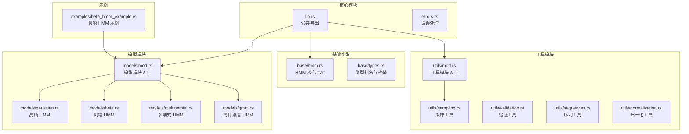
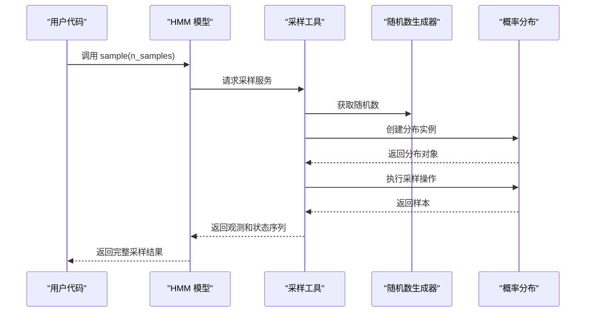
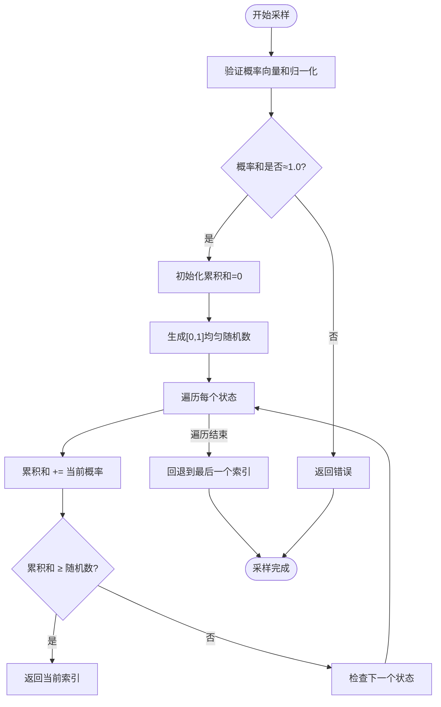
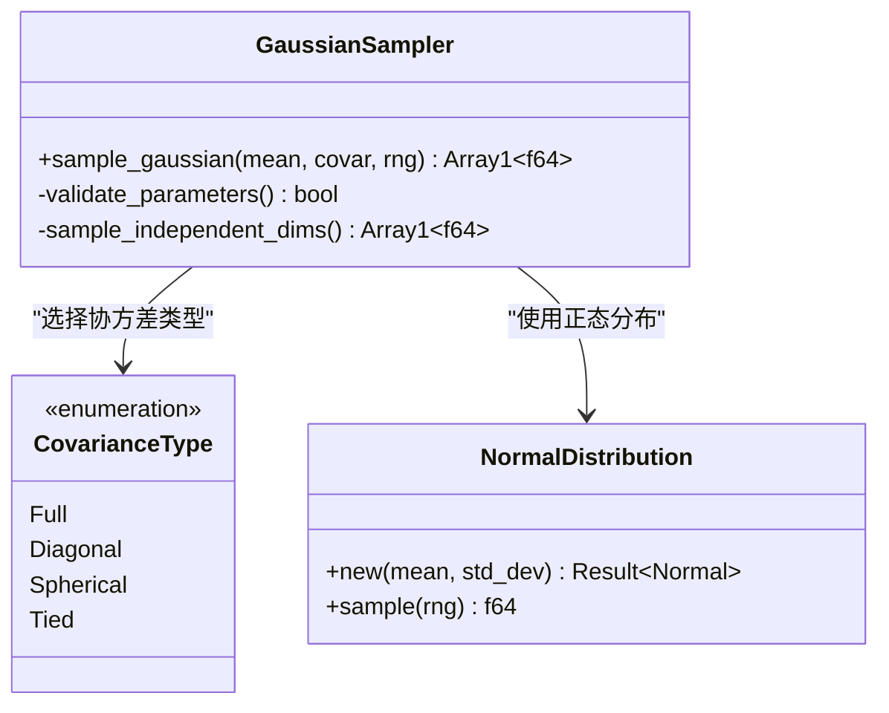
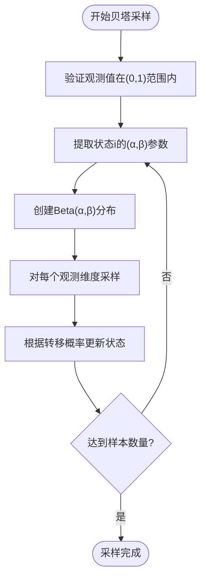
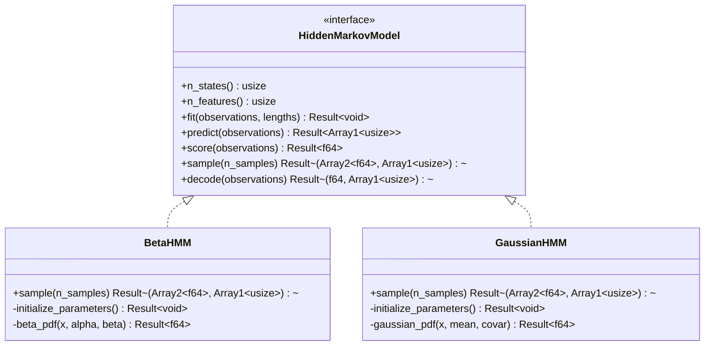
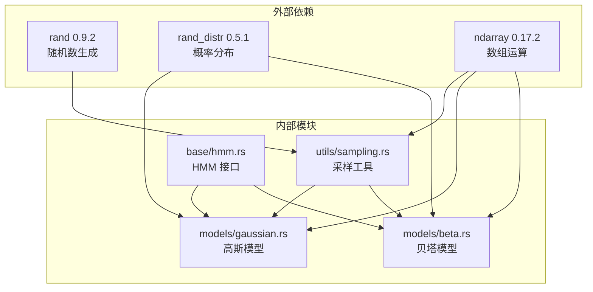

# 随机采样工具

<cite>
**本文档引用的文件**
- [src/utils/sampling.rs](file://src/utils/sampling.rs)
- [src/models/beta.rs](file://src/models/beta.rs)
- [src/models/gaussian.rs](file://src/models/gaussian.rs)
- [src/models/multinomial.rs](file://src/models/multinomial.rs)
- [src/base/types.rs](file://src/base/types.rs)
- [src/base/hmm.rs](file://src/base/hmm.rs)
- [src/utils/mod.rs](file://src/utils/mod.rs)
- [src/lib.rs](file://src/lib.rs)
- [examples/beta_hmm_example.rs](file://examples/beta_hmm_example.rs)
- [Cargo.toml](file://Cargo.toml)
- [README.md](file://README.md)
</cite>

## 目录
1. [简介](#简介)
2. [项目结构](#项目结构)
3. [核心组件](#核心组件)
4. [架构概览](#架构概览)
5. [详细组件分析](#详细组件分析)
6. [依赖关系分析](#依赖关系分析)
7. [性能考虑](#性能考虑)
8. [故障排除指南](#故障排除指南)
9. [结论](#结论)
10. [附录](#附录)

## 简介
本文件专注于 rhmm 库中随机采样工具的功能文档。该库提供了多种隐马尔可夫模型（HMM）及其对应的采样机制，包括：
- 离散分布采样：基于累积分布函数（CDF）和逆变换采样技术
- 多维高斯分布采样：使用独立正态分布采样（当前实现为对角协方差）
- 贝塔分布采样：用于 [0,1] 区间数据的参数化采样

文档将深入解释这些采样的数学原理、实现细节、在 HMM 训练中的应用以及最佳实践。

## 项目结构
rhmm 库采用模块化设计，采样功能主要位于 utils 子模块中，并被各 HMM 模型在训练后进行采样时调用。

**图表来源**
- [src/lib.rs](file://src/lib.rs#L1-L28)
- [src/utils/mod.rs](file://src/utils/mod.rs#L1-L12)
- [src/models/mod.rs](file://src/models/mod.rs#L1-L20)

**章节来源**
- [src/lib.rs](file://src/lib.rs#L1-L28)
- [src/utils/mod.rs](file://src/utils/mod.rs#L1-L12)
- [src/models/mod.rs](file://src/models/mod.rs#L1-L20)

## 核心组件
本节聚焦于随机采样工具的核心实现，包括离散分布采样、高斯分布采样以及贝塔分布采样。

### 离散分布采样
离散分布采样通过累积分布函数（CDF）和逆变换采样技术实现。该方法的核心思想是：
- 将概率质量函数（PMF）累加形成 CDF
- 在 [0,1] 区间均匀生成随机数 u
- 找到最小索引 i，使得 CDF(i) ≥ u

实现要点：
- 输入概率向量必须归一化（求和为 1.0）
- 使用浮点误差容差（约 1e-6）进行校验
- 通过单次遍历完成采样，时间复杂度 O(k)，k 为状态数
- 对于边界情况（如浮点精度问题），回退到最后一个索引

### 多维高斯分布采样
当前实现采用对角协方差的简化方案：
- 假设特征维度相互独立
- 对每个维度独立采样一维正态分布
- 协方差矩阵的对角元素作为各维度的方差
- 通过标准正态分布转换得到目标均值和方差的样本

实现要点：
- 支持对角协方差类型（Diagonal）
- 通过独立正态分布采样实现多维样本
- 对协方差进行数值稳定处理（最小正值约束）

### 贝塔分布采样
贝塔分布采样用于建模 [0,1] 区间的连续数据：
- 参数化：两个形状参数 α 和 β
- 通过 rand_distr::Beta 实现直接采样
- 在 HMM 中，每个隐藏状态对每个观测维度都有独立的 α 和 β 参数

实现要点：
- 观测值必须严格在 (0,1) 区间内
- 使用对数伽马函数避免数值下溢
- 初始化阶段使用矩估计法确定初始参数

**章节来源**
- [src/utils/sampling.rs](file://src/utils/sampling.rs#L1-L130)
- [src/models/beta.rs](file://src/models/beta.rs#L1-L734)
- [src/models/gaussian.rs](file://src/models/gaussian.rs#L1-L681)

## 架构概览
随机采样工具在整个 HMM 生态系统中的位置如下：

**图表来源**
- [src/base/hmm.rs](file://src/base/hmm.rs#L44-L53)
- [src/utils/sampling.rs](file://src/utils/sampling.rs#L1-L130)
- [src/models/beta.rs](file://src/models/beta.rs#L601-L668)
- [src/models/gaussian.rs](file://src/models/gaussian.rs#L546-L611)

## 详细组件分析

### 离散分布采样器
离散分布采样器实现了标准的逆变换采样算法：

**图表来源**
- [src/utils/sampling.rs](file://src/utils/sampling.rs#L17-L38)

实现特点：
- 时间复杂度：O(k)，k 为状态数
- 空间复杂度：O(1)
- 数值稳定性：通过容差检查确保概率和正确性
- 边界处理：浮点精度导致的微小偏差通过回退机制解决

**章节来源**
- [src/utils/sampling.rs](file://src/utils/sampling.rs#L17-L38)

### 多维高斯采样器
高斯采样器支持多种协方差类型，但当前实现主要针对对角协方差：

**图表来源**
- [src/models/gaussian.rs](file://src/models/gaussian.rs#L546-L611)
- [src/base/types.rs](file://src/base/types.rs#L18-L29)

实现细节：
- 对角协方差：每个维度独立采样
- 球面协方差：所有维度共享单一方差
- 全协方差：当前简化实现为对角协方差
- 数值稳定性：协方差添加最小正值防止数值问题

**章节来源**
- [src/models/gaussian.rs](file://src/models/gaussian.rs#L546-L611)
- [src/base/types.rs](file://src/base/types.rs#L18-L29)

### 贝塔分布采样器
贝塔采样器专门处理 [0,1] 区间的观测数据：

**图表来源**
- [src/models/beta.rs](file://src/models/beta.rs#L601-L668)

参数控制选项：
- 形状参数 α 和 β：控制分布的形状和集中度
- 初始参数：通过矩估计法从数据统计量推导
- 观测范围：严格限制在 (0,1) 区间内

**章节来源**
- [src/models/beta.rs](file://src/models/beta.rs#L601-L668)

### HMM 模型采样接口
所有 HMM 模型都实现了统一的采样接口：

**图表来源**
- [src/base/hmm.rs](file://src/base/hmm.rs#L6-L61)
- [src/models/beta.rs](file://src/models/beta.rs#L601-L668)
- [src/models/gaussian.rs](file://src/models/gaussian.rs#L546-L611)

**章节来源**
- [src/base/hmm.rs](file://src/base/hmm.rs#L6-L61)
- [src/models/beta.rs](file://src/models/beta.rs#L601-L668)
- [src/models/gaussian.rs](file://src/models/gaussian.rs#L546-L611)

## 依赖关系分析
随机采样工具的依赖关系图：

**图表来源**
- [Cargo.toml](file://Cargo.toml#L13-L19)
- [src/utils/sampling.rs](file://src/utils/sampling.rs#L3-L5)
- [src/models/gaussian.rs](file://src/models/gaussian.rs#L6-L8)
- [src/models/beta.rs](file://src/models/beta.rs#L6-L12)

**章节来源**
- [Cargo.toml](file://Cargo.toml#L13-L19)
- [src/utils/sampling.rs](file://src/utils/sampling.rs#L3-L5)
- [src/models/gaussian.rs](file://src/models/gaussian.rs#L6-L8)
- [src/models/beta.rs](file://src/models/beta.rs#L6-L12)

## 性能考虑
基于源码分析，以下是一些关键的性能特性：

### 时间复杂度
- 离散分布采样：O(k)，k 为状态数
- 高斯分布采样：O(d)，d 为特征维度数
- 贝塔分布采样：O(d)，d 为特征维度数

### 内存使用
- 采样过程中的内存分配最小化
- 使用 ndarray 进行向量化操作
- 避免不必要的中间变量创建

### 数值稳定性
- 浮点精度容差检查（约 1e-6）
- 对数空间计算避免数值下溢
- 协方差矩阵的最小正值约束

## 故障排除指南
常见问题及解决方案：

### 采样失败错误
**问题**：离散分布采样返回概率和不为 1 的错误
**原因**：输入概率向量未正确归一化
**解决**：确保概率向量求和等于 1.0

**问题**：高斯分布采样返回无效参数错误
**原因**：协方差参数为负或零
**解决**：确保协方差参数为正值

**问题**：贝塔分布采样返回观测值超出范围错误
**原因**：观测值不在 (0,1) 区间内
**解决**：预处理数据确保观测值在 (0,1) 范围内

### 性能问题
**问题**：采样速度慢
**原因**：大量小规模采样导致开销
**解决**：批量采样或使用更高效的随机数生成器

**章节来源**
- [src/utils/sampling.rs](file://src/utils/sampling.rs#L18-L24)
- [src/models/gaussian.rs](file://src/models/gaussian.rs#L577-L582)
- [src/models/beta.rs](file://src/models/beta.rs#L137-L145)

## 结论
rhmm 库的随机采样工具提供了：
- 数学严谨的离散分布采样实现
- 高效的多维高斯分布采样（当前为对角协方差）
- 专门针对 [0,1] 区间的贝塔分布采样
- 统一的 HMM 采样接口

这些工具在 HMM 模型训练中发挥重要作用：
- 参数初始化阶段的数据生成
- 模型验证和调试的数据集生成
- 业务场景下的合成数据生成

## 附录

### 使用示例路径
完整的使用示例可在以下文件中找到：
- [贝塔 HMM 示例](file://examples/beta_hmm_example.rs#L1-L266)
- [快速开始示例](file://README.md#L53-L119)

### 随机种子管理策略
虽然源码中未直接展示显式的种子管理，但推荐的实践包括：
- 使用 `rand::SeedableRng` 实现可重现的结果
- 在测试环境中固定种子以确保一致性
- 在生产环境中使用系统熵源

### 性能优化建议
- 优先使用批量采样而非多次小规模采样
- 对于大量重复采样，考虑重用随机数生成器实例
- 在高维数据场景下，利用 ndarray 的向量化操作优势