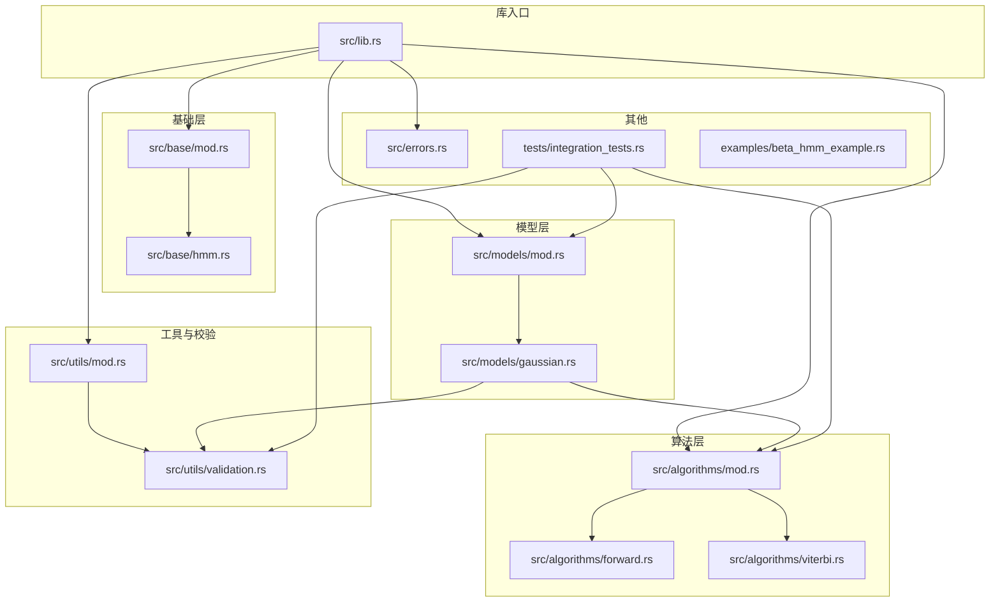
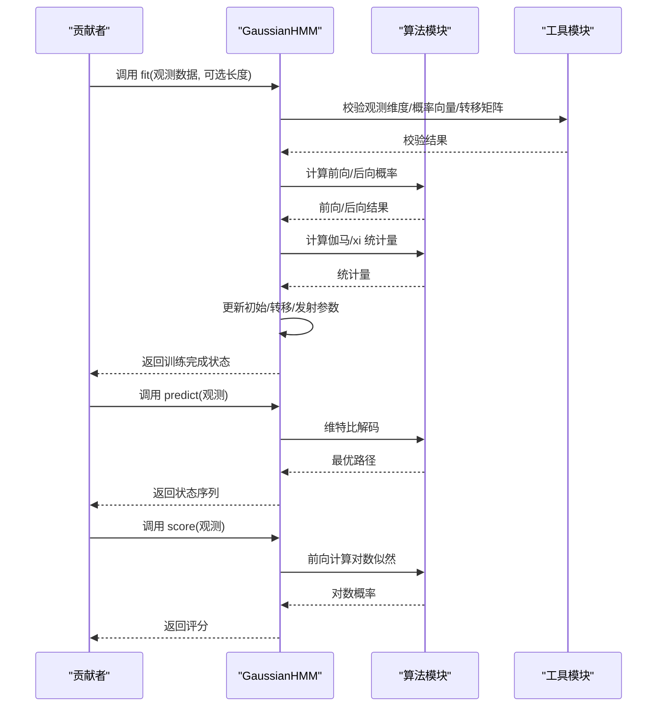
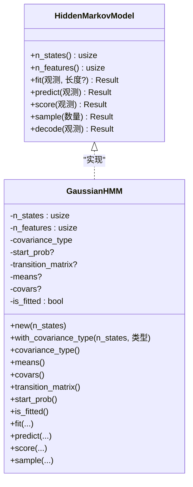
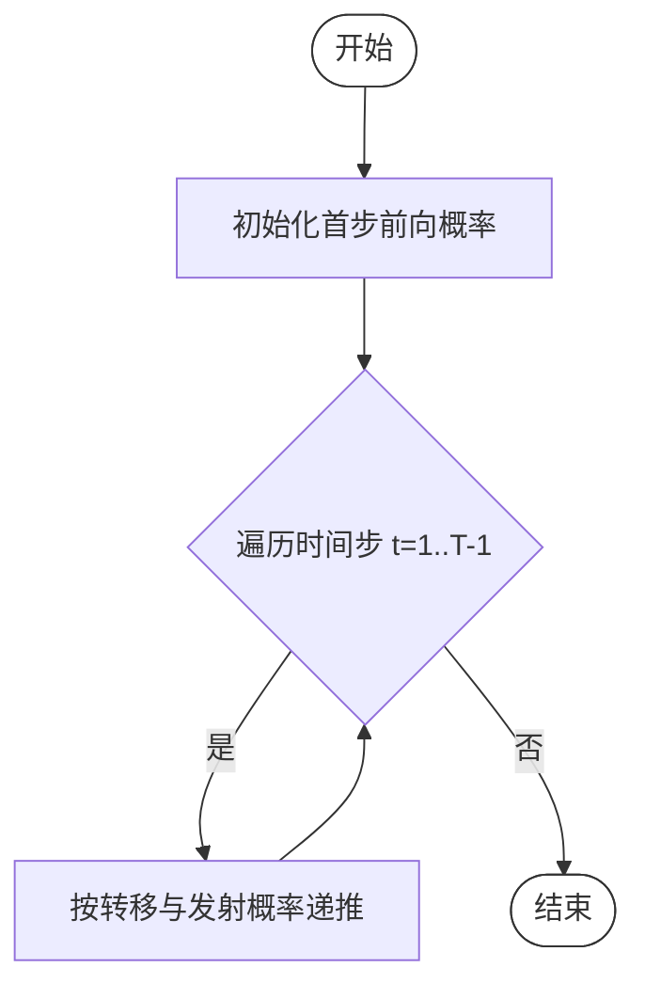
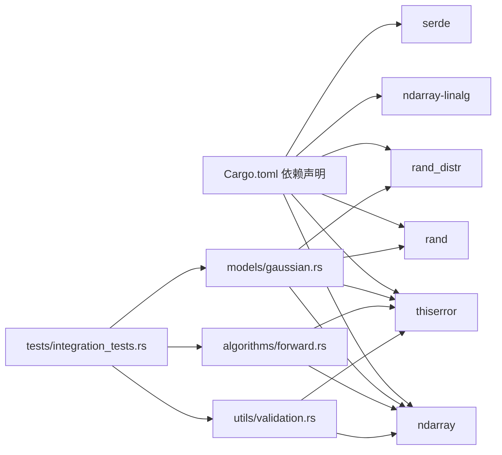

# 代码贡献

<cite>
**本文引用的文件**
- [Cargo.toml](file://Cargo.toml)
- [README.md](file://README.md)
- [src/lib.rs](file://src/lib.rs)
- [src/base/mod.rs](file://src/base/mod.rs)
- [src/base/hmm.rs](file://src/base/hmm.rs)
- [src/algorithms/mod.rs](file://src/algorithms/mod.rs)
- [src/algorithms/forward.rs](file://src/algorithms/forward.rs)
- [src/algorithms/viterbi.rs](file://src/algorithms/viterbi.rs)
- [src/models/mod.rs](file://src/models/mod.rs)
- [src/models/gaussian.rs](file://src/models/gaussian.rs)
- [src/utils/mod.rs](file://src/utils/mod.rs)
- [src/utils/validation.rs](file://src/utils/validation.rs)
- [src/errors.rs](file://src/errors.rs)
- [tests/integration_tests.rs](file://tests/integration_tests.rs)
- [examples/beta_hmm_example.rs](file://examples/beta_hmm_example.rs)
</cite>

## 目录
1. [简介](#简介)
2. [项目结构](#项目结构)
3. [核心组件](#核心组件)
4. [架构总览](#架构总览)
5. [详细组件分析](#详细组件分析)
6. [依赖关系分析](#依赖关系分析)
7. [性能考量](#性能考量)
8. [故障排查指南](#故障排查指南)
9. [结论](#结论)
10. [附录：贡献流程与规范](#附录贡献流程与规范)

## 简介
本指南面向希望为 rhmm 库贡献代码的开发者，覆盖从 Fork 仓库到发起 Pull Request 的完整流程；统一的代码风格与命名约定；单元与集成测试要求及覆盖率目标；代码审查标准与流程；持续集成与自动化测试配置建议；文档更新要求与最佳实践；以及常见贡献场景（Bug 修复、功能新增、性能优化）的操作指导。内容基于仓库现有实现与文档进行提炼，确保新贡献者能快速上手并产出高质量代码。

## 项目结构
rhmm 是一个基于 Rust 的隐马尔可夫模型（HMM）库，采用模块化组织，核心模块包括基础接口、算法实现、模型类型、工具函数与错误类型，并配套示例与集成测试。

图表来源
- [src/lib.rs](file://src/lib.rs#L1-L28)
- [src/base/mod.rs](file://src/base/mod.rs#L1-L8)
- [src/algorithms/mod.rs](file://src/algorithms/mod.rs#L1-L12)
- [src/models/mod.rs](file://src/models/mod.rs#L1-L12)
- [src/utils/mod.rs](file://src/utils/mod.rs#L1-L12)
- [src/errors.rs](file://src/errors.rs#L1-L105)
- [tests/integration_tests.rs](file://tests/integration_tests.rs#L1-L103)
- [examples/beta_hmm_example.rs](file://examples/beta_hmm_example.rs#L1-L266)

章节来源
- [src/lib.rs](file://src/lib.rs#L1-L28)
- [Cargo.toml](file://Cargo.toml#L1-L23)

## 核心组件
- 基础接口：定义统一的 HMM 行为契约，所有模型均需实现该接口，包含训练、预测、评分、采样等方法。
- 算法实现：提供前向、后向、维特比、Baum-Welch 等标准 HMM 算法。
- 模型实现：当前提供高斯 HMM；其他模型类型预留扩展点。
- 工具与校验：参数校验、序列拆分、归一化、采样等辅助能力。
- 错误体系：统一的错误类型与 Result 别名，便于传播与处理。

章节来源
- [src/base/hmm.rs](file://src/base/hmm.rs#L1-L62)
- [src/algorithms/mod.rs](file://src/algorithms/mod.rs#L1-L12)
- [src/models/gaussian.rs](file://src/models/gaussian.rs#L1-L681)
- [src/utils/validation.rs](file://src/utils/validation.rs#L1-L141)
- [src/errors.rs](file://src/errors.rs#L1-L105)

## 架构总览
下图展示模型训练与推理的关键调用链，体现“模型实现”对“算法与工具”的依赖关系。

图表来源
- [src/models/gaussian.rs](file://src/models/gaussian.rs#L337-L544)
- [src/algorithms/forward.rs](file://src/algorithms/forward.rs#L20-L69)
- [src/algorithms/viterbi.rs](file://src/algorithms/viterbi.rs#L20-L74)
- [src/utils/validation.rs](file://src/utils/validation.rs#L58-L74)

## 详细组件分析

### 组件：GaussianHMM（高斯 HMM）
- 角色：实现 HiddenMarkovModel 接口，提供训练、预测、评分、采样能力。
- 关键职责：
  - 参数初始化与校验（初始概率、转移矩阵、均值、协方差）。
  - 使用 Baum-Welch 迭代估计参数。
  - 通过前向/后向与维特比算法完成推理。
- 数据结构与复杂度：
  - 训练复杂度与序列长度、状态数、特征维数相关，迭代收敛通常在固定次数内。
  - 内存占用与观测矩阵与状态矩阵规模成正比。
- 错误处理：严格使用统一错误类型与 Result，避免 panic。
- 性能特性：利用 ndarray 向量化操作，日志空间计算提升数值稳定性。

图表来源
- [src/base/hmm.rs](file://src/base/hmm.rs#L6-L61)
- [src/models/gaussian.rs](file://src/models/gaussian.rs#L11-L100)

章节来源
- [src/models/gaussian.rs](file://src/models/gaussian.rs#L1-L681)
- [src/base/hmm.rs](file://src/base/hmm.rs#L1-L62)

### 组件：算法模块（前向/维特比）
- 前向算法：计算前向概率矩阵，用于评估观测序列的概率或作为 M 步统计的基础。
- 维特比算法：在已知发射概率下，寻找最可能的状态序列。
- 复杂度：时间 O(T·N^2)，空间 O(T·N)，其中 T 为序列长度，N 为状态数。

图表来源
- [src/algorithms/forward.rs](file://src/algorithms/forward.rs#L20-L47)

章节来源
- [src/algorithms/forward.rs](file://src/algorithms/forward.rs#L1-L129)
- [src/algorithms/viterbi.rs](file://src/algorithms/viterbi.rs#L1-L118)

### 组件：参数校验工具
- 功能：验证概率向量、转移矩阵、观测维度是否合法。
- 设计：返回 Result，失败时携带明确错误信息，便于上层处理。

章节来源
- [src/utils/validation.rs](file://src/utils/validation.rs#L1-L141)

### 组件：错误体系
- Result 类型别名与错误枚举统一了错误传播方式。
- 建议：新增功能时优先返回对应错误变体，避免使用通用错误。

章节来源
- [src/errors.rs](file://src/errors.rs#L1-L105)

## 依赖关系分析
- 依赖管理：通过 Cargo.toml 统一声明运行时与开发时依赖。
- 模块耦合：模型实现依赖算法与工具模块；测试覆盖算法与模型行为。
- 外部依赖：ndarray、ndarray-linalg、rand、rand_distr、thiserror、serde 等。

图表来源
- [Cargo.toml](file://Cargo.toml#L13-L22)
- [src/models/gaussian.rs](file://src/models/gaussian.rs#L1-L10)
- [src/algorithms/forward.rs](file://src/algorithms/forward.rs#L1-L10)
- [src/utils/validation.rs](file://src/utils/validation.rs#L1-L10)
- [tests/integration_tests.rs](file://tests/integration_tests.rs#L1-L10)

章节来源
- [Cargo.toml](file://Cargo.toml#L1-L23)
- [tests/integration_tests.rs](file://tests/integration_tests.rs#L1-L103)

## 性能考量
- 数值稳定性：算法实现多处采用 log 概率与稳定归一化策略。
- 向量化：大量使用 ndarray 的数组运算，减少循环开销。
- 内存分配：尽量避免热路径上的临时对象重复分配，必要时复用缓冲区。
- 收敛控制：EM 过程设置最大迭代与容忍度，防止无限循环。

章节来源
- [src/algorithms/forward.rs](file://src/algorithms/forward.rs#L60-L69)
- [src/models/gaussian.rs](file://src/models/gaussian.rs#L384-L487)

## 故障排查指南
- 常见错误类型与触发条件：
  - 参数非法：观测为空、维度不匹配、概率越界等。
  - 模型未拟合：在未训练情况下执行预测/评分/采样。
  - 收敛失败：EM 迭代未达到收敛阈值。
- 定位建议：
  - 在调用链中逐层检查输入维度与概率约束。
  - 使用测试用例定位边界条件（空观测、单观测、确定性路径等）。
  - 对照错误信息与错误枚举的描述字段进行判断。

章节来源
- [src/errors.rs](file://src/errors.rs#L9-L34)
- [src/utils/validation.rs](file://src/utils/validation.rs#L58-L74)
- [tests/integration_tests.rs](file://tests/integration_tests.rs#L87-L102)

## 结论
本指南总结了 rhmm 的模块化架构、核心接口与关键算法实现，明确了代码风格、测试与审查要求，并提供了常见贡献场景的操作建议。遵循本文规范，可确保贡献代码与现有实现风格一致、质量可靠、易于维护与演进。

## 附录：贡献流程与规范

### 一、贡献流程（Fork 到 PR）
- Fork 仓库至个人账号。
- 创建功能分支，命名建议以“feat/”“fix/”“perf/”开头，例如 feat/add-beta-hmm。
- 提交代码并推送分支。
- 在 GitHub 上发起 Pull Request，描述变更动机、影响范围与测试情况。
- 根据审阅意见修改并更新 PR。

章节来源
- [README.md](file://README.md#L267-L276)

### 二、代码风格与命名约定
- 模块与文件：
  - 模块目录与文件名使用小写加下划线，如 algorithms、utils。
  - 公共模块在 mod.rs 中 re-export，保持对外 API 清晰。
- 函数与方法：
  - 函数名使用小驼峰，方法名与公共 API 使用帕斯卡命名。
  - 参数与返回值类型清晰，错误使用 Result<T, E>。
- 文档注释：
  - 公共 API 必须包含参数说明、返回值说明与错误说明。
  - 示例与使用场景建议在模块或示例文件中给出。
- 错误处理：
  - 优先使用统一错误类型与错误变体，避免抛出未定义错误。
- 代码组织：
  - 将相关逻辑放入同一模块，避免跨模块循环依赖。
  - 新增算法或模型时，同步补充测试与示例。

章节来源
- [src/lib.rs](file://src/lib.rs#L1-L28)
- [src/base/mod.rs](file://src/base/mod.rs#L1-L8)
- [src/algorithms/mod.rs](file://src/algorithms/mod.rs#L1-L12)
- [src/models/mod.rs](file://src/models/mod.rs#L1-L12)
- [src/utils/mod.rs](file://src/utils/mod.rs#L1-L12)
- [src/errors.rs](file://src/errors.rs#L1-L105)

### 三、单元测试与集成测试
- 单元测试：
  - 每个模块的工具函数与算法应有对应的单元测试，覆盖正常与异常路径。
  - 使用断言库进行近似相等比较，注意容差设置。
- 集成测试：
  - 覆盖端到端工作流，如模型训练、预测、评分、采样与错误处理。
  - 包含多序列场景与边界条件（空观测、维度不匹配、未拟合等）。
- 测试运行：
  - 使用 Cargo 提供的测试命令运行全部或指定测试集。
- 覆盖率目标：
  - 建议核心算法与模型实现的测试覆盖率达到较高水平（建议不低于 80%），并逐步提升。

章节来源
- [tests/integration_tests.rs](file://tests/integration_tests.rs#L1-L103)
- [src/algorithms/forward.rs](file://src/algorithms/forward.rs#L71-L129)
- [src/algorithms/viterbi.rs](file://src/algorithms/viterbi.rs#L76-L118)
- [src/utils/validation.rs](file://src/utils/validation.rs#L76-L141)
- [README.md](file://README.md#L207-L220)

### 四、代码审查标准与流程
- 接口一致性：新增模型或算法需实现统一接口，保持行为一致。
- 错误处理：确保所有错误路径都有明确的错误类型与提示信息。
- 性能与健壮性：避免不必要的内存分配，保证数值稳定性与边界条件处理。
- 文档与示例：新增功能需配套文档注释与示例，便于用户理解与使用。
- 审阅流程：提交 PR 后至少一名维护者审阅，根据反馈修改直至通过。

章节来源
- [src/base/hmm.rs](file://src/base/hmm.rs#L6-L61)
- [src/errors.rs](file://src/errors.rs#L1-L105)
- [README.md](file://README.md#L267-L276)

### 五、持续集成与自动化测试
- 建议在 CI 中执行：
  - 编译检查（稳定版本 Rust）。
  - 运行全部测试并输出详细日志。
  - 可选：格式检查与 lint（如 rustfmt、clippy）。
- 配置位置：可在仓库根目录添加 CI 配置文件（如 .github/workflows/ci.yml），并在 PR 中自动触发。
- 与 Cargo 的关系：CI 步骤直接复用 Cargo 命令，确保与本地一致。

章节来源
- [Cargo.toml](file://Cargo.toml#L1-L23)
- [README.md](file://README.md#L207-L220)

### 六、文档更新要求与最佳实践
- 更新 README 或新增文档时，确保：
  - API 使用示例清晰、可运行。
  - 参数说明与返回值说明完整。
  - 与实现保持一致，避免过期信息。
- 示例文件：
  - 示例应独立可运行，便于用户快速上手。
  - 对于新增模型或算法，提供简短示例程序。

章节来源
- [README.md](file://README.md#L1-L303)
- [examples/beta_hmm_example.rs](file://examples/beta_hmm_example.rs#L1-L266)

### 七、常见贡献场景操作指导
- Bug 修复：
  - 明确问题现象与触发条件，补充最小化测试用例。
  - 修改后确保回归测试通过，必要时更新错误消息或行为说明。
- 功能添加：
  - 新增模型或算法时，先设计接口与数据结构，再实现算法与测试。
  - 在模块中提供必要的工具函数与校验逻辑。
- 性能优化：
  - 分析热点路径，减少内存分配与重复计算。
  - 使用向量化与稳定的数值方法，避免数值不稳定导致的性能退化。

章节来源
- [src/models/gaussian.rs](file://src/models/gaussian.rs#L337-L544)
- [src/algorithms/forward.rs](file://src/algorithms/forward.rs#L20-L69)
- [src/utils/validation.rs](file://src/utils/validation.rs#L58-L74)