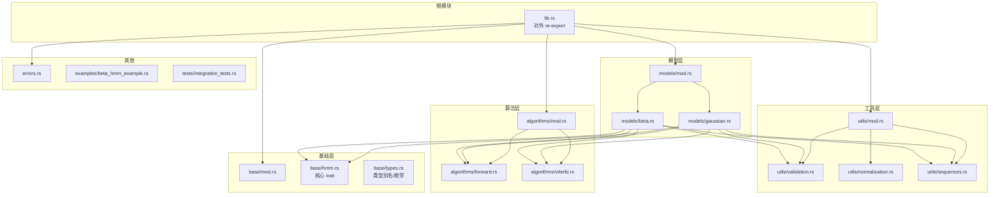
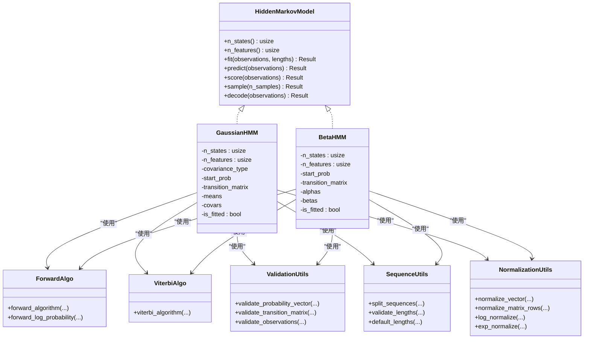
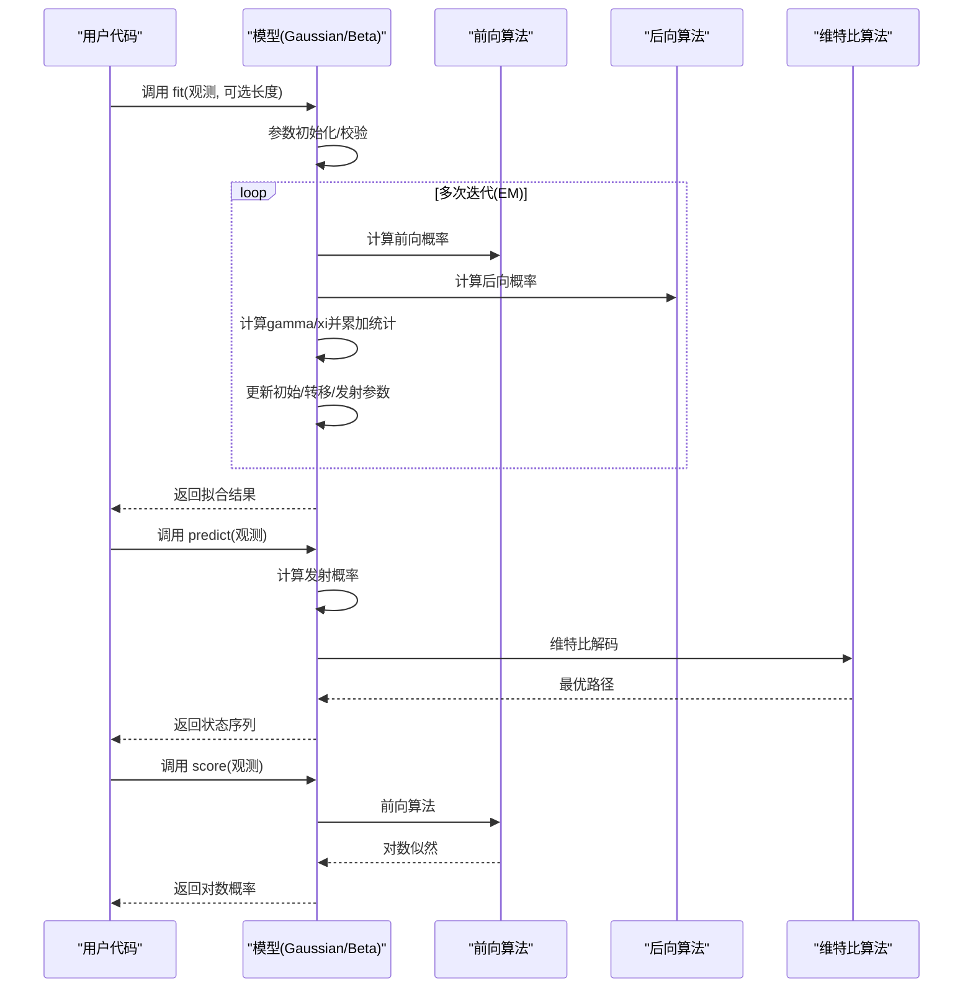
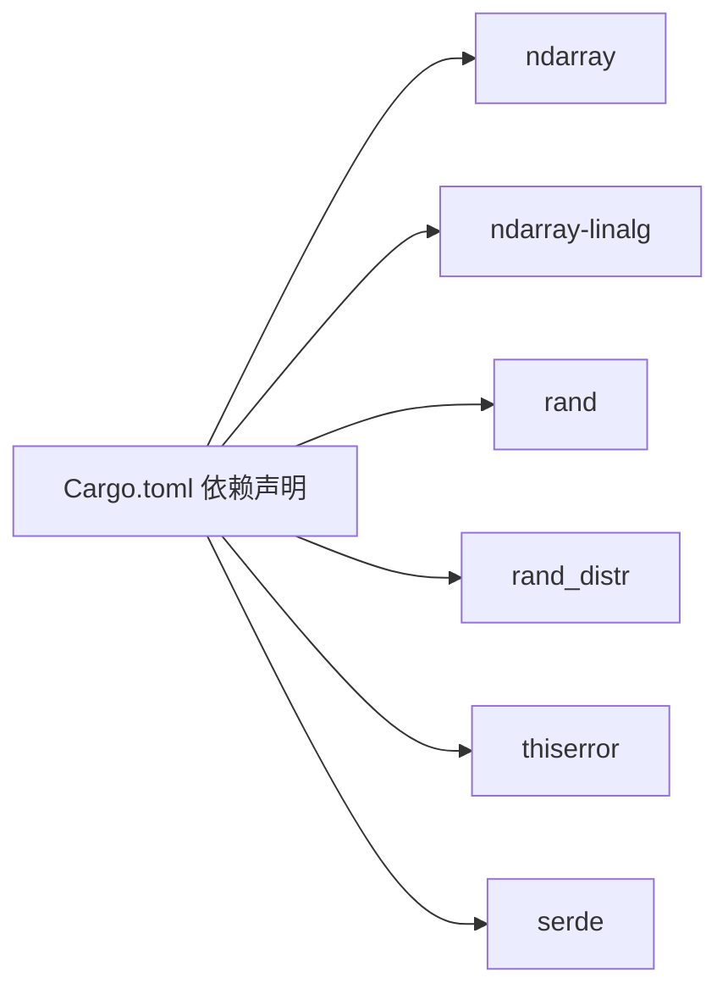

# 开发指南

<cite>
**本文引用的文件**
- [Cargo.toml](file://Cargo.toml)
- [README.md](file://README.md)
- [src/lib.rs](file://src/lib.rs)
- [src/base/mod.rs](file://src/base/mod.rs)
- [src/base/hmm.rs](file://src/base/hmm.rs)
- [src/base/types.rs](file://src/base/types.rs)
- [src/models/mod.rs](file://src/models/mod.rs)
- [src/models/gaussian.rs](file://src/models/gaussian.rs)
- [src/models/beta.rs](file://src/models/beta.rs)
- [src/algorithms/mod.rs](file://src/algorithms/mod.rs)
- [src/algorithms/forward.rs](file://src/algorithms/forward.rs)
- [src/algorithms/viterbi.rs](file://src/algorithms/viterbi.rs)
- [src/utils/mod.rs](file://src/utils/mod.rs)
- [src/utils/validation.rs](file://src/utils/validation.rs)
- [src/utils/normalization.rs](file://src/utils/normalization.rs)
- [src/utils/sequences.rs](file://src/utils/sequences.rs)
- [src/errors.rs](file://src/errors.rs)
- [examples/beta_hmm_example.rs](file://examples/beta_hmm_example.rs)
- [tests/integration_tests.rs](file://tests/integration_tests.rs)
</cite>

## 目录
1. [简介](#简介)
2. [项目结构](#项目结构)
3. [核心组件](#核心组件)
4. [架构总览](#架构总览)
5. [详细组件分析](#详细组件分析)
6. [依赖关系分析](#依赖关系分析)
7. [性能考虑](#性能考虑)
8. [故障排查指南](#故障排查指南)
9. [结论](#结论)
10. [附录](#附录)

## 简介
本开发指南面向核心维护者与社区贡献者，目标是帮助你快速理解 rhmm 的代码结构、模块组织原则与扩展机制，并掌握从开发到发布的全流程。rhmm 是一个基于 Rust 的隐马尔可夫模型（HMM）库，采用 ndarray 进行高效数值计算，提供多种发射分布模型与标准 HMM 算法。

## 项目结构
rhmm 采用按功能域划分的模块化组织方式：基础接口与类型定义位于 base 模块；具体模型实现在 models；算法实现位于 algorithms；通用工具在 utils；错误类型集中于 errors；examples 提供使用示例；tests 提供集成测试。

图表来源
- [src/lib.rs](file://src/lib.rs#L1-L28)
- [src/base/mod.rs](file://src/base/mod.rs#L1-L8)
- [src/base/hmm.rs](file://src/base/hmm.rs#L1-L62)
- [src/base/types.rs](file://src/base/types.rs#L1-L61)
- [src/models/mod.rs](file://src/models/mod.rs#L1-L12)
- [src/models/gaussian.rs](file://src/models/gaussian.rs#L1-L681)
- [src/models/beta.rs](file://src/models/beta.rs#L1-L734)
- [src/algorithms/mod.rs](file://src/algorithms/mod.rs#L1-L12)
- [src/algorithms/forward.rs](file://src/algorithms/forward.rs#L1-L129)
- [src/algorithms/viterbi.rs](file://src/algorithms/viterbi.rs#L1-L118)
- [src/utils/mod.rs](file://src/utils/mod.rs#L1-L12)
- [src/utils/validation.rs](file://src/utils/validation.rs#L1-L141)
- [src/utils/normalization.rs](file://src/utils/normalization.rs#L1-L102)
- [src/utils/sequences.rs](file://src/utils/sequences.rs#L1-L153)
- [src/errors.rs](file://src/errors.rs#L1-L105)

章节来源
- [src/lib.rs](file://src/lib.rs#L1-L28)
- [src/base/mod.rs](file://src/base/mod.rs#L1-L8)
- [src/models/mod.rs](file://src/models/mod.rs#L1-L12)
- [src/algorithms/mod.rs](file://src/algorithms/mod.rs#L1-L12)
- [src/utils/mod.rs](file://src/utils/mod.rs#L1-L12)

## 核心组件
- 核心 trait：HiddenMarkovModel 定义了统一的模型接口，包括拟合、预测、评分、采样与解码等方法。
- 类型系统：通过类型别名与枚举（如协方差类型 CovarianceType）统一数据形状与参数语义。
- 错误体系：统一的 Result 类型与 HmmError 枚举，覆盖参数、维度、概率、收敛、状态与数值错误等场景。
- 工具集：验证、归一化、序列拆分等通用能力，贯穿训练与推理流程。
- 算法集：前向、后向、维特比、Baum-Welch 等标准 HMM 算法，作为模型训练与推理的基础。

章节来源
- [src/base/hmm.rs](file://src/base/hmm.rs#L1-L62)
- [src/base/types.rs](file://src/base/types.rs#L1-L61)
- [src/errors.rs](file://src/errors.rs#L1-L105)
- [src/utils/validation.rs](file://src/utils/validation.rs#L1-L141)
- [src/utils/normalization.rs](file://src/utils/normalization.rs#L1-L102)
- [src/utils/sequences.rs](file://src/utils/sequences.rs#L1-L153)
- [src/algorithms/forward.rs](file://src/algorithms/forward.rs#L1-L129)
- [src/algorithms/viterbi.rs](file://src/algorithms/viterbi.rs#L1-L118)

## 架构总览
rhmm 的架构遵循“接口抽象—具体实现—算法支撑—工具保障”的分层设计。所有模型均实现统一的 HiddenMarkovModel trait，内部通过算法模块完成前向/后向/维特比等计算，并借助工具模块进行参数校验、归一化与多序列处理。

图表来源
- [src/base/hmm.rs](file://src/base/hmm.rs#L1-L62)
- [src/models/gaussian.rs](file://src/models/gaussian.rs#L1-L681)
- [src/models/beta.rs](file://src/models/beta.rs#L1-L734)
- [src/algorithms/forward.rs](file://src/algorithms/forward.rs#L1-L129)
- [src/algorithms/viterbi.rs](file://src/algorithms/viterbi.rs#L1-L118)
- [src/utils/validation.rs](file://src/utils/validation.rs#L1-L141)
- [src/utils/normalization.rs](file://src/utils/normalization.rs#L1-L102)
- [src/utils/sequences.rs](file://src/utils/sequences.rs#L1-L153)

## 详细组件分析

### 基础层：核心 trait 与类型
- HiddenMarkovModel：定义模型统一接口，包含 n_states、n_features、fit、predict、score、sample、decode 等方法。
- 类型别名与枚举：如 TransitionMatrix、InitialProbs、Observations、States、CovarianceType，提升代码可读性与一致性。
- 设计要点：通过 trait 抽象屏蔽不同模型差异，使算法模块与工具模块对具体模型透明。

章节来源
- [src/base/hmm.rs](file://src/base/hmm.rs#L1-L62)
- [src/base/types.rs](file://src/base/types.rs#L1-L61)

### 模型层：高斯 HMM 与 Beta HMM
- 高斯 HMM：支持多种协方差类型（全/对角/球面/绑定），通过 Baum-Welch 算法估计参数，结合前向/后向/维特比算法完成训练与推理。
- Beta HMM：专用于 [0,1] 区间数据（如转化率、比例），通过贝塔分布参数化发射概率，使用方法矩初始化与 EM 更新。
- 共同点：均实现 HiddenMarkovModel trait；均支持多序列训练与长度参数；均提供预测、评分、采样与解码能力。

图表来源
- [src/models/gaussian.rs](file://src/models/gaussian.rs#L337-L491)
- [src/models/beta.rs](file://src/models/beta.rs#L393-L547)
- [src/algorithms/forward.rs](file://src/algorithms/forward.rs#L20-L69)
- [src/algorithms/viterbi.rs](file://src/algorithms/viterbi.rs#L20-L74)

章节来源
- [src/models/gaussian.rs](file://src/models/gaussian.rs#L1-L681)
- [src/models/beta.rs](file://src/models/beta.rs#L1-L734)

### 算法层：前向/后向/维特比/Baum-Welch
- 前向算法：计算前向概率矩阵，用于评估观测序列的概率或作为 EM 的输入。
- 后向算法：计算后向概率矩阵，常与前向算法配合得到 gamma/xi 等统计量。
- 维特比算法：在给定观测下寻找最可能的状态序列。
- Baum-Welch：期望最大化（EM）框架下的参数估计过程，迭代更新初始概率、转移矩阵与发射参数。

章节来源
- [src/algorithms/forward.rs](file://src/algorithms/forward.rs#L1-L129)
- [src/algorithms/viterbi.rs](file://src/algorithms/viterbi.rs#L1-L118)

### 工具层：验证/归一化/序列处理
- 参数验证：概率向量与转移矩阵合法性检查，观测维度一致性校验。
- 归一化：向量与矩阵行的归一化，以及对数空间的安全转换。
- 序列处理：多序列长度校验与切分，单序列默认长度生成。

章节来源
- [src/utils/validation.rs](file://src/utils/validation.rs#L1-L141)
- [src/utils/normalization.rs](file://src/utils/normalization.rs#L1-L102)
- [src/utils/sequences.rs](file://src/utils/sequences.rs#L1-L153)

### 错误体系：HmmError 与 Result
- Result 类型别名统一返回值；HmmError 覆盖无效参数、维度不匹配、概率非法、未拟合、收敛失败、状态非法、数值错误与 IO 错误等。
- 在模型训练与推理中广泛使用，确保错误传播一致且可诊断。

章节来源
- [src/errors.rs](file://src/errors.rs#L1-L105)

### 示例与测试：端到端工作流
- 示例：beta_hmm_example 展示了 Beta HMM 的建模、参数解读、状态预测、评分与采样。
- 集成测试：覆盖 Gaussian HMM 的训练/预测/评分、前向/后向一致性、维特比确定性路径、归一化与多序列训练、错误处理等。

章节来源
- [examples/beta_hmm_example.rs](file://examples/beta_hmm_example.rs#L1-L266)
- [tests/integration_tests.rs](file://tests/integration_tests.rs#L1-L103)

## 依赖关系分析
- 外部依赖：ndarray、ndarray-linalg、rand、rand_distr、thiserror、serde。
- 内部依赖：lib.rs 统一 re-export；各模块通过 mod.rs 汇聚导出；模型依赖算法与工具模块；examples 与 tests 依赖库公开 API。

图表来源
- [Cargo.toml](file://Cargo.toml#L13-L22)

章节来源
- [Cargo.toml](file://Cargo.toml#L1-L23)

## 性能考虑
- 数值稳定性：log 空间归一化与对数概率计算，避免下溢；在 Beta HMM 中使用对数伽马函数近似。
- 向量化与最小分配：优先使用 ndarray 的广播与视图操作，减少中间拷贝；在热路径上避免不必要的所有权转移。
- 协方差类型选择：对角/球面协方差简化计算复杂度；全/绑定协方差需权衡精度与性能。
- 多序列处理：通过序列切分与累积统计降低跨序列边界带来的额外开销。

章节来源
- [src/utils/normalization.rs](file://src/utils/normalization.rs#L25-L35)
- [src/models/beta.rs](file://src/models/beta.rs#L199-L224)
- [src/models/gaussian.rs](file://src/models/gaussian.rs#L155-L194)

## 故障排查指南
- 常见错误类型与定位
  - 未拟合模型：在 predict/score/sample 前必须先 fit。
  - 维度不匹配：观测特征数与模型 n_features 不一致。
  - 非法概率：概率向量/转移矩阵元素越界或和不为 1。
  - 观测为空：观测数组行列为 0。
- 排查步骤
  - 使用集成测试中的断言模式复现问题。
  - 检查参数初始化与校验逻辑（validation/normalization/sequences）。
  - 在算法模块中插入日志或断言确认 alpha/beta/gamma/xi 的形状与范围。

章节来源
- [src/errors.rs](file://src/errors.rs#L1-L105)
- [tests/integration_tests.rs](file://tests/integration_tests.rs#L88-L102)
- [src/utils/validation.rs](file://src/utils/validation.rs#L1-L141)

## 结论
rhmm 通过清晰的分层架构与统一的模型接口，提供了可扩展、可维护且高性能的 HMM 实现。贡献者可依据本文档的结构与流程，快速添加新模型或改进现有算法，并确保质量与性能达标。

## 附录

### 代码贡献流程（建议）
- 分支管理
  - 新功能：基于主分支创建 feature/xxx 分支，命名清晰描述变更内容。
  - 热修复：基于主分支创建 hotfix/xxx 分支。
- 提交规范
  - 提交信息格式：类型(作用域)：简要说明；正文解释动机与影响；关闭 Issue 编号（如适用）。
  - 类型建议：feat、fix、docs、style、refactor、perf、test、build、ci、chore。
- 代码审查
  - 至少一名维护者审查；关注：正确性、性能、可读性、测试覆盖、文档更新。
- 测试
  - 单元测试：覆盖关键函数与边界条件。
  - 集成测试：覆盖端到端工作流与回归场景。
- 文档
  - 更新 README 或新增示例；补充 API 文档注释。

### 新模型开发扩展机制与实现模板
- 扩展步骤
  - 在 models/mod.rs 中添加新模块并导出类型。
  - 实现 HiddenMarkovModel trait 的核心方法：n_states、n_features、fit、predict、score、sample、decode。
  - 在 fit 中完成参数初始化、校验与 EM 迭代；在 predict/score 中调用相应算法模块。
  - 在 utils 中复用 validation/normalization/sequences 工具，必要时新增工具函数。
- 算法集成
  - 将前向/后向/维特比等算法作为独立模块，通过函数式接口被模型调用。
  - 在 EM 过程中计算 gamma/xi 并更新参数，注意数值稳定性与收敛判断。
- 示例与测试
  - 在 examples 中添加使用示例；在 tests 中补充集成测试与单元测试。

章节来源
- [src/base/hmm.rs](file://src/base/hmm.rs#L1-L62)
- [src/models/mod.rs](file://src/models/mod.rs#L1-L12)
- [src/algorithms/forward.rs](file://src/algorithms/forward.rs#L1-L129)
- [src/algorithms/viterbi.rs](file://src/algorithms/viterbi.rs#L1-L118)
- [src/utils/validation.rs](file://src/utils/validation.rs#L1-L141)
- [src/utils/normalization.rs](file://src/utils/normalization.rs#L1-L102)
- [src/utils/sequences.rs](file://src/utils/sequences.rs#L1-L153)

### 开发环境搭建与工具配置
- Rust 版本与工具链
  - 使用 Cargo 管理依赖与构建；确保安装稳定版 Rust。
- 依赖安装
  - 依赖项已在 Cargo.toml 中声明，直接执行构建与测试。
- 常用命令
  - 构建：cargo build
  - 发布构建：cargo build --release
  - 测试：cargo test；带输出：cargo test -- --nocapture
  - 运行示例：cargo run --example beta_hmm_example
- IDE/编辑器
  - 建议启用 rust-analyzer 以获得更好的补全与诊断。

章节来源
- [Cargo.toml](file://Cargo.toml#L1-L23)
- [README.md](file://README.md#L27-L220)

### 发布流程与版本管理策略（建议）
- 版本号：遵循语义化版本控制（主.次.修订），在 Cargo.toml 中维护 version 字段。
- 变更记录：在每次发布前整理变更日志，标注破坏性变更、新增功能与修复。
- 发布步骤
  - 合并至主分支；更新版本号与依赖；运行测试确保无回归。
  - 打标签并推送；发布到 crates.io（如适用）。
- 回归测试：在发布前执行全量测试与性能回归检查。

### 代码质量保证与静态分析
- 静态分析工具
  - rustc 默认检查；可选：clippy（lint 规则）；miri（内存安全）。
- 规范建议
  - 保持模块职责单一；函数短小明确；错误处理显式；注释与示例齐全。
- 测试策略
  - 单元测试覆盖边界与异常路径；集成测试覆盖真实工作流；使用 approx 断言浮点近似相等。

### 社区贡献与沟通
- 贡献方式：Fork 仓库 → 创建功能分支 → 提交 PR → 代码审查 → 合并。
- 沟通渠道：Issue 讨论需求与问题；PR 代码评审；README 中提供联系信息与路线图。

章节来源
- [README.md](file://README.md#L267-L303)