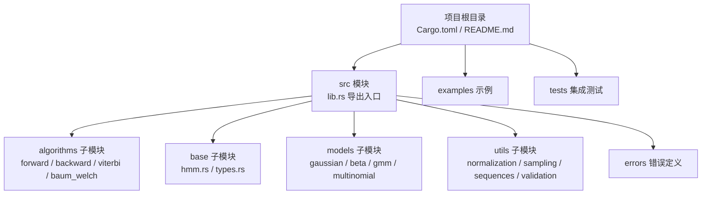
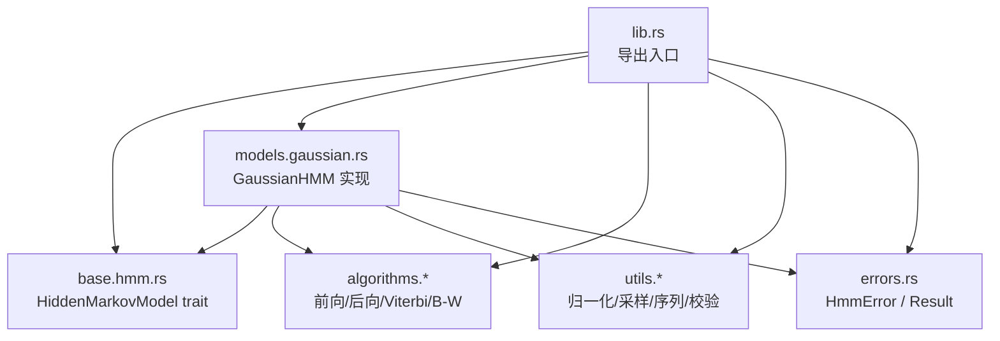
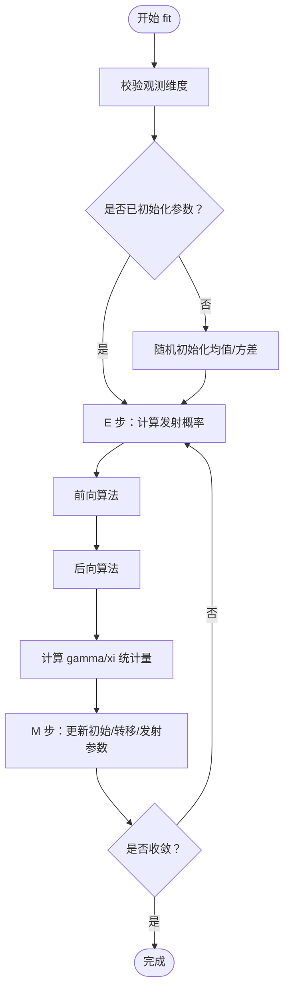
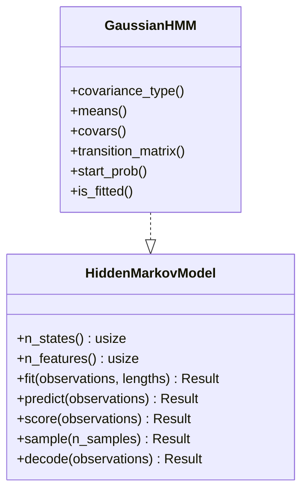
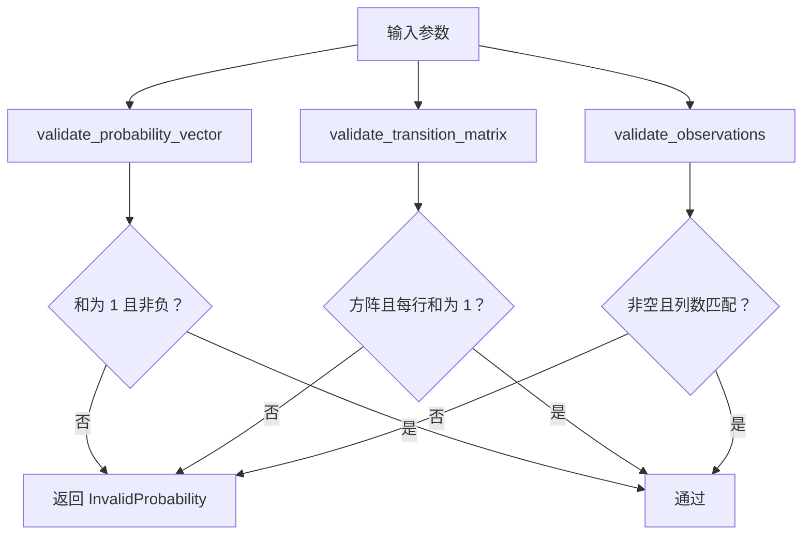
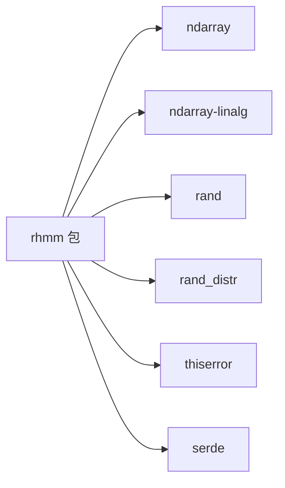

# 开发环境

<cite>
**本文引用的文件**
- [Cargo.toml](file://Cargo.toml)
- [README.md](file://README.md)
- [src/lib.rs](file://src/lib.rs)
- [src/base/hmm.rs](file://src/base/hmm.rs)
- [src/models/gaussian.rs](file://src/models/gaussian.rs)
- [src/utils/validation.rs](file://src/utils/validation.rs)
- [src/errors.rs](file://src/errors.rs)
- [examples/beta_hmm_example.rs](file://examples/beta_hmm_example.rs)
- [tests/integration_tests.rs](file://tests/integration_tests.rs)
</cite>

## 目录
1. [简介](#简介)
2. [项目结构](#项目结构)
3. [核心组件](#核心组件)
4. [架构总览](#架构总览)
5. [详细组件分析](#详细组件分析)
6. [依赖关系分析](#依赖关系分析)
7. [性能考量](#性能考量)
8. [故障排查指南](#故障排查指南)
9. [结论](#结论)
10. [附录](#附录)

## 简介
本指南面向 rhmm 库的开发者，提供从零搭建一致高效开发环境的完整步骤，覆盖 Rust 工具链、IDE/编辑器配置、调试工具、依赖管理与更新、代码格式化与静态分析、文档与 API 维护、容器化开发环境以及常见问题排查。内容基于仓库现有配置与源码进行提炼，确保可操作性与一致性。

## 项目结构
rhmm 是一个以模块化方式组织的 Rust 库，采用按功能域分层的目录结构：
- 根目录包含包元数据与示例、测试入口
- src 下按领域拆分：algorithms（算法）、base（核心 trait/类型）、models（模型实现）、utils（工具）、errors（错误类型）
- examples 提供使用示例
- tests 提供集成测试

图表来源
- [src/lib.rs](file://src/lib.rs#L1-L28)
- [src/base/mod.rs](file://src/base/mod.rs#L1-L8)
- [src/models/mod.rs](file://src/models/mod.rs#L1-L12)
- [src/algorithms/mod.rs](file://src/algorithms/mod.rs#L1-L12)

章节来源
- [Cargo.toml](file://Cargo.toml#L1-L23)
- [README.md](file://README.md#L1-L303)
- [src/lib.rs](file://src/lib.rs#L1-L28)

## 核心组件
- 包与工具链
  - 包管理：Cargo（版本与工作流见后文“依赖管理与更新”）
  - 编译器：Rust 1.80+（来自 README 中的徽章与依赖）
  - 版本策略：edition = "2021"（来自 Cargo.toml）
- 核心接口
  - HiddenMarkovModel trait：统一的训练、预测、评分、采样与解码接口（来自 src/base/hmm.rs）
- 关键实现
  - GaussianHMM：高斯发射分布的 HMM 实现（来自 src/models/gaussian.rs），包含多种协方差类型支持
- 工具与验证
  - 参数校验：概率向量、转移矩阵、观测维度等（来自 src/utils/validation.rs）
- 错误体系
  - 统一 Result 类型与 HmmError 枚举（来自 src/errors.rs）

章节来源
- [Cargo.toml](file://Cargo.toml#L1-L23)
- [README.md](file://README.md#L3-L4)
- [src/base/hmm.rs](file://src/base/hmm.rs#L1-L62)
- [src/models/gaussian.rs](file://src/models/gaussian.rs#L1-L681)
- [src/utils/validation.rs](file://src/utils/validation.rs#L1-L141)
- [src/errors.rs](file://src/errors.rs#L1-L105)

## 架构总览
下图展示库的模块关系与交互：lib.rs 作为导出入口，base 定义核心接口，models 实现具体模型，algorithms 提供通用算法，utils 提供辅助能力，errors 统一错误处理。

图表来源
- [src/lib.rs](file://src/lib.rs#L1-L28)
- [src/base/hmm.rs](file://src/base/hmm.rs#L1-L62)
- [src/models/gaussian.rs](file://src/models/gaussian.rs#L1-L681)
- [src/algorithms/mod.rs](file://src/algorithms/mod.rs#L1-L12)
- [src/utils/validation.rs](file://src/utils/validation.rs#L1-L141)
- [src/errors.rs](file://src/errors.rs#L1-L105)

## 详细组件分析

### 组件：GaussianHMM（高斯 HMM）
- 设计要点
  - 支持多种协方差类型（对角、球面、全/联结），通过 CovarianceType 控制
  - 使用 ndarray 进行数值计算，参数初始化采用随机选择与数据方差估计
  - 训练采用 Baum-Welch（EM）迭代，收敛阈值与最大迭代次数可调
  - 预测使用 Viterbi，评分使用前向算法，采样结合初始状态与转移矩阵
- 数据结构与复杂度
  - 观测矩阵形状 (n_samples, n_features)，状态矩阵 (n_states, n_states)
  - 训练复杂度近似 O(N·S²·T)（N 为样本数，S 为状态数，T 为迭代次数）
- 关键流程（拟合）

图表来源
- [src/models/gaussian.rs](file://src/models/gaussian.rs#L337-L491)

章节来源
- [src/models/gaussian.rs](file://src/models/gaussian.rs#L1-L681)

### 组件：HiddenMarkovModel trait（核心接口）
- 职责
  - 统一模型能力：n_states、n_features、fit、predict、score、sample、decode
- 与实现的关系
  - GaussianHMM 等模型均实现该 trait，保证多态与一致的 API

图表来源
- [src/base/hmm.rs](file://src/base/hmm.rs#L1-L62)
- [src/models/gaussian.rs](file://src/models/gaussian.rs#L14-L32)

章节来源
- [src/base/hmm.rs](file://src/base/hmm.rs#L1-L62)

### 组件：参数校验与错误处理
- 校验逻辑
  - 概率向量校验：非负、和为 1
  - 转移矩阵校验：方阵、每行和为 1 且非负
  - 观测维度校验：非空、列数匹配
- 错误类型
  - InvalidParameter、DimensionMismatch、InvalidProbability、ModelNotFitted、ConvergenceError、InvalidState、NumericalError、IoError

图表来源
- [src/utils/validation.rs](file://src/utils/validation.rs#L1-L141)
- [src/errors.rs](file://src/errors.rs#L1-L105)

章节来源
- [src/utils/validation.rs](file://src/utils/validation.rs#L1-L141)
- [src/errors.rs](file://src/errors.rs#L1-L105)

### 组件：示例与测试
- 示例
  - beta_hmm_example.rs 展示 Beta HMM 在转化率场景下的建模与推理流程
- 测试
  - integration_tests.rs 覆盖 GaussianHMM 的训练、预测、评分、前向/后向一致性、多序列、错误处理等

章节来源
- [examples/beta_hmm_example.rs](file://examples/beta_hmm_example.rs#L1-L266)
- [tests/integration_tests.rs](file://tests/integration_tests.rs#L1-L103)

## 依赖关系分析
- 包依赖（来自 Cargo.toml）
  - ndarray、ndarray-linalg：数值计算与线性代数
  - rand、rand_distr：随机数与概率分布
  - thiserror：错误派生
  - serde：序列化支持
- 开发依赖
  - approx：浮点近似断言

图表来源
- [Cargo.toml](file://Cargo.toml#L13-L22)

章节来源
- [Cargo.toml](file://Cargo.toml#L1-L23)

## 性能考量
- 数值稳定性
  - 对数空间计算与日志概率累积，避免下溢
  - 协方差正则化（最小方差）防止奇异矩阵
- 向量化与内存
  - 尽可能使用 ndarray 向量化操作
  - 热路径减少临时分配
- 训练收敛
  - Baum-Welch 设置合理容差与最大迭代次数

## 故障排查指南
- 常见错误与定位
  - 模型未拟合即预测/评分：检查 is_fitted 与 fit 调用
  - 维度不匹配：核对观测列数与模型 n_features
  - 概率非法：检查初始概率与转移矩阵是否非负且和为 1
  - 观测为空或列数为 0：确保输入有效
- 定位建议
  - 使用测试用例复现问题（integration_tests.rs）
  - 在示例中最小化复现（beta_hmm_example.rs）
  - 打开详细输出：cargo test -- --nocapture

章节来源
- [src/errors.rs](file://src/errors.rs#L1-L105)
- [src/utils/validation.rs](file://src/utils/validation.rs#L1-L141)
- [tests/integration_tests.rs](file://tests/integration_tests.rs#L1-L103)
- [README.md](file://README.md#L207-L220)

## 结论
通过遵循本指南，开发者可在本地快速搭建一致的 Rust 开发环境，并基于现有模块化架构高效扩展新模型与算法。建议在团队内统一工具链版本、格式化与静态分析规则，以保障代码质量与协作效率。

## 附录

### A. Rust 工具链安装与配置
- 安装 rustup（Rust 官方工具链管理器）
- 设置默认工具链版本：Rust 1.80+（来自 README 徽章）
- 编译器版本策略：edition = "2021"（来自 Cargo.toml）
- 常用命令
  - cargo build / cargo run / cargo test
  - cargo check（快速检查语法与类型）
  - cargo doc（生成文档）

章节来源
- [README.md](file://README.md#L3-L4)
- [Cargo.toml](file://Cargo.toml#L4-L4)

### B. IDE 与编辑器配置（VS Code / IntelliJ IDEA）
- VS Code
  - 插件：Rust (rls 或 rust-analyzer)、Even Better TOML、Bracket Pair Colorizer
  - 设置：启用 rust-analyzer、格式化与 clippy 集成
- IntelliJ IDEA / RustRover
  - 插件：IntelliJ Rust / RustRover
  - 设置：启用 Cargo 集成、内联预览、错误突出显示

[本节为通用实践建议，不直接分析具体文件]

### C. 调试工具使用
- GDB/LLDB
  - 使用 cargo build 生成可调试二进制
  - 在符号完整（debug）构建下进行断点调试
- Rust 特定调试器
  - cargo run -- --debugger（若使用特定前端）
  - 利用断言与日志定位问题

[本节为通用实践建议，不直接分析具体文件]

### D. 依赖管理与更新
- 使用 Cargo
  - 添加依赖：在 Cargo.toml [dependencies] 区段添加
  - 更新依赖：cargo update
  - 锁定版本：Cargo.lock 由 Cargo 自动生成与维护
- 版本策略
  - 保持与 README 中最低版本一致（1.80+）
  - edition = "2021" 保持稳定

章节来源
- [Cargo.toml](file://Cargo.toml#L13-L22)
- [README.md](file://README.md#L3-L4)

### E. 代码格式化与静态分析
- rustfmt
  - 命令：cargo fmt
  - 建议：在 CI 中加入格式化检查
- clippy
  - 命令：cargo clippy
  - 建议：在 PR 中强制执行，关注性能与安全性提示

[本节为通用实践建议，不直接分析具体文件]

### F. 文档生成与 API 维护
- 生成文档
  - cargo doc --open
- API 文档维护
  - 在源码中完善注释与示例
  - 参考 README.md 的 API 概览与示例风格

章节来源
- [README.md](file://README.md#L141-L193)

### G. Docker 容器化开发环境
- 建议镜像
  - 基于 Debian/Alpine 的 Rust 镜像
  - 预装 rustup、编译器、Git
- 工作流
  - 在容器内执行 cargo build / test
  - 映射宿主机项目目录以保留缓存与构建产物

[本节为通用实践建议，不直接分析具体文件]