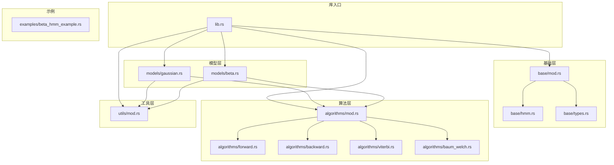
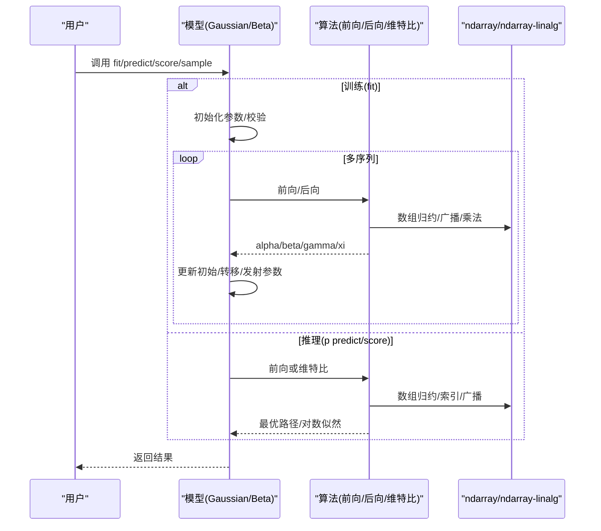
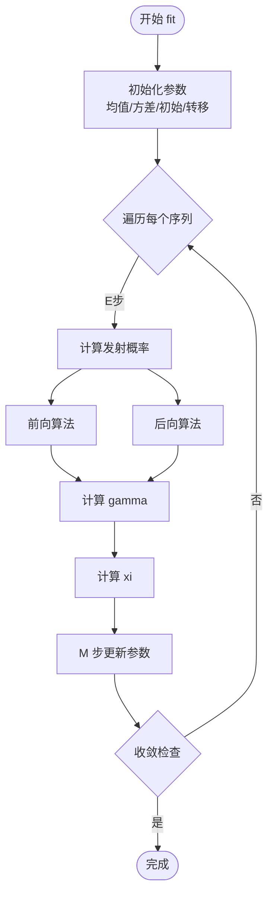
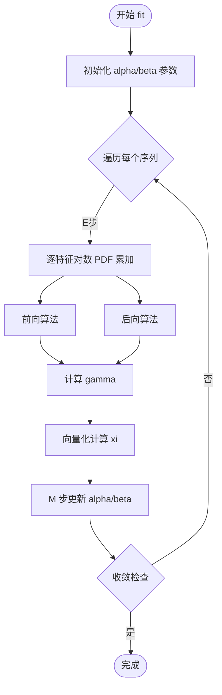
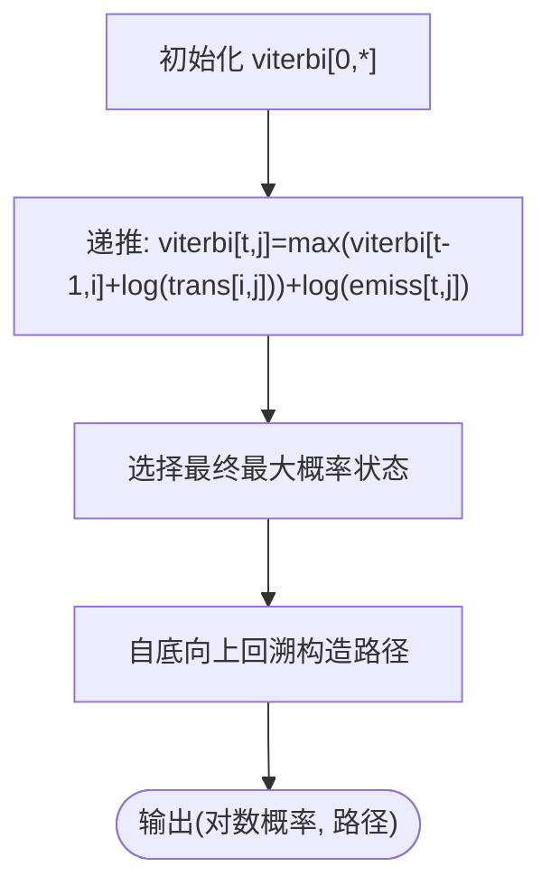
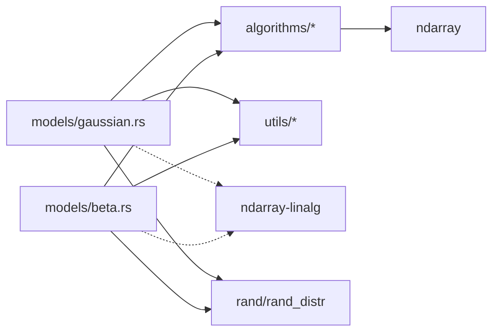

# 性能优化

<cite>
**本文引用的文件**
- [Cargo.toml](file://Cargo.toml)
- [README.md](file://README.md)
- [src/lib.rs](file://src/lib.rs)
- [src/base/mod.rs](file://src/base/mod.rs)
- [src/base/hmm.rs](file://src/base/hmm.rs)
- [src/base/types.rs](file://src/base/types.rs)
- [src/models/gaussian.rs](file://src/models/gaussian.rs)
- [src/models/beta.rs](file://src/models/beta.rs)
- [src/algorithms/mod.rs](file://src/algorithms/mod.rs)
- [src/algorithms/forward.rs](file://src/algorithms/forward.rs)
- [src/algorithms/backward.rs](file://src/algorithms/backward.rs)
- [src/algorithms/viterbi.rs](file://src/algorithms/viterbi.rs)
- [src/algorithms/baum_welch.rs](file://src/algorithms/baum_welch.rs)
- [src/utils/mod.rs](file://src/utils/mod.rs)
- [examples/beta_hmm_example.rs](file://examples/beta_hmm_example.rs)
</cite>

## 目录
1. [引言](#引言)
2. [项目结构](#项目结构)
3. [核心组件](#核心组件)
4. [架构总览](#架构总览)
5. [详细组件分析](#详细组件分析)
6. [依赖关系分析](#依赖关系分析)
7. [性能考量与优化策略](#性能考量与优化策略)
8. [故障排查指南](#故障排查指南)
9. [结论](#结论)
10. [附录：基准测试与工具使用](#附录：基准测试与工具使用)

## 引言
本指南面向 rhmm 库的性能优化，目标是在不牺牲代码可读性与正确性的前提下，系统性地识别性能瓶颈、优化内存使用与计算复杂度，并给出可落地的优化建议与实践案例。内容覆盖 ndarray 与 ndarray-linalg 的高效使用、并行与 SIMD 可用性评估、算法层面的缓存友好与循环优化、基准测试设计与回归检测、以及内存池与零拷贝的适用场景。

## 项目结构
rhmm 是一个基于 Rust 的 HMM 实现，采用模块化组织：基础接口与类型定义位于 base，具体模型（高斯、Beta 等）位于 models，算法实现（前向、后向、维特比、Baum-Welch）位于 algorithms，工具函数位于 utils。示例位于 examples，顶层通过 lib.rs 统一导出公共 API。

**图示来源**
- [src/lib.rs](file://src/lib.rs#L19-L28)
- [src/base/mod.rs](file://src/base/mod.rs#L1-L8)
- [src/base/hmm.rs](file://src/base/hmm.rs#L1-L62)
- [src/base/types.rs](file://src/base/types.rs#L1-L61)
- [src/models/gaussian.rs](file://src/models/gaussian.rs#L1-L681)
- [src/models/beta.rs](file://src/models/beta.rs#L1-L734)
- [src/algorithms/mod.rs](file://src/algorithms/mod.rs#L1-L12)
- [src/algorithms/forward.rs](file://src/algorithms/forward.rs#L1-L129)
- [src/algorithms/backward.rs](file://src/algorithms/backward.rs#L1-L90)
- [src/algorithms/viterbi.rs](file://src/algorithms/viterbi.rs#L1-L118)
- [src/algorithms/baum_welch.rs](file://src/algorithms/baum_welch.rs#L1-L75)
- [src/utils/mod.rs](file://src/utils/mod.rs#L1-L12)
- [examples/beta_hmm_example.rs](file://examples/beta_hmm_example.rs#L1-L266)

**章节来源**
- [src/lib.rs](file://src/lib.rs#L19-L28)
- [src/base/mod.rs](file://src/base/mod.rs#L1-L8)
- [src/algorithms/mod.rs](file://src/algorithms/mod.rs#L1-L12)
- [src/utils/mod.rs](file://src/utils/mod.rs#L1-L12)

## 核心组件
- 基础接口与类型
  - 隐藏马尔可夫模型核心 trait 定义了训练、预测、评分、采样等标准能力，统一了不同模型的行为契约。
  - 类型别名与协方差类型枚举，明确数组维度与参数化形式。
- 模型实现
  - 高斯 HMM：支持多种协方差类型（对角、球面、全协方差、绑定），在 fit 中执行 Baum-Welch 迭代更新。
  - Beta HMM：适用于 [0,1] 区间观测，提供参数估计与采样。
- 算法实现
  - 前向/后向：用于概率前向传播与反向传播。
  - 维特比：寻找最可能的状态序列。
  - Baum-Welch：EM 参数估计框架（当前模块化便于后续完整实现）。
- 工具模块
  - 归一化、序列切分、校验等辅助功能，支撑训练与推理流程。

**章节来源**
- [src/base/hmm.rs](file://src/base/hmm.rs#L7-L61)
- [src/base/types.rs](file://src/base/types.rs#L5-L29)
- [src/models/gaussian.rs](file://src/models/gaussian.rs#L102-L134)
- [src/models/beta.rs](file://src/models/beta.rs#L116-L157)
- [src/algorithms/forward.rs](file://src/algorithms/forward.rs#L20-L47)
- [src/algorithms/backward.rs](file://src/algorithms/backward.rs#L19-L45)
- [src/algorithms/viterbi.rs](file://src/algorithms/viterbi.rs#L20-L74)
- [src/algorithms/baum_welch.rs](file://src/algorithms/baum_welch.rs#L25-L44)

## 架构总览
rhmm 的运行时路径通常为：用户调用模型 trait 方法（fit/predict/score/sample），内部根据具体模型选择合适的算法实现（前向/后向/维特比/Baum-Welch），并在必要时进行数组操作与线性代数运算。训练阶段以序列长度与状态数为主要性能变量，推理阶段主要受序列长度影响。

**图示来源**
- [src/base/hmm.rs](file://src/base/hmm.rs#L14-L60)
- [src/models/gaussian.rs](file://src/models/gaussian.rs#L337-L491)
- [src/models/beta.rs](file://src/models/beta.rs#L393-L547)
- [src/algorithms/forward.rs](file://src/algorithms/forward.rs#L20-L47)
- [src/algorithms/backward.rs](file://src/algorithms/backward.rs#L19-L45)
- [src/algorithms/viterbi.rs](file://src/algorithms/viterbi.rs#L20-L74)

## 详细组件分析

### 高斯 HMM：训练与推理路径
- 训练流程要点
  - 参数初始化：随机选择观测作为均值初值，按特征维度估算方差。
  - E 步：计算发射概率（逐样本逐状态），随后前向/后向计算 alpha/beta。
  - M 步：更新初始概率、转移矩阵、均值与协方差。
  - 收敛判断：基于对数似然增量。
- 关键热点
  - 发射概率计算中的嵌套循环（样本×状态×特征）。
  - 前向/后向的双重循环（时间步×状态）。
  - gamma/xi 的累积与归一化。

**图示来源**
- [src/models/gaussian.rs](file://src/models/gaussian.rs#L337-L491)
- [src/algorithms/forward.rs](file://src/algorithms/forward.rs#L20-L47)
- [src/algorithms/backward.rs](file://src/algorithms/backward.rs#L19-L45)
- [src/algorithms/baum_welch.rs](file://src/algorithms/baum_welch.rs#L56-L74)

**章节来源**
- [src/models/gaussian.rs](file://src/models/gaussian.rs#L102-L134)
- [src/models/gaussian.rs](file://src/models/gaussian.rs#L337-L491)
- [src/algorithms/forward.rs](file://src/algorithms/forward.rs#L20-L47)
- [src/algorithms/backward.rs](file://src/algorithms/backward.rs#L19-L45)
- [src/algorithms/baum_welch.rs](file://src/algorithms/baum_welch.rs#L56-L74)

### Beta HMM：向量化与数值稳定性
- 发射概率计算采用对数伽马近似与逐特征累加，避免直接计算 Beta 函数导致的数值不稳定。
- xi 计算利用 ndarray 的广播机制，减少显式循环次数，提升吞吐。
- 参数更新采用加权矩估计，结合 gamma 权重，提高估计精度。

**图示来源**
- [src/models/beta.rs](file://src/models/beta.rs#L393-L547)
- [src/models/beta.rs](file://src/models/beta.rs#L288-L332)
- [src/algorithms/forward.rs](file://src/algorithms/forward.rs#L20-L47)
- [src/algorithms/backward.rs](file://src/algorithms/backward.rs#L19-L45)
- [src/algorithms/baum_welch.rs](file://src/algorithms/baum_welch.rs#L56-L74)

**章节来源**
- [src/models/beta.rs](file://src/models/beta.rs#L116-L157)
- [src/models/beta.rs](file://src/models/beta.rs#L199-L224)
- [src/models/beta.rs](file://src/models/beta.rs#L288-L332)
- [src/models/beta.rs](file://src/models/beta.rs#L334-L381)
- [src/models/beta.rs](file://src/models/beta.rs#L393-L547)

### 维特比算法：路径回溯与缓存友好
- 使用二维表记录累积对数概率与回溯指针，时间复杂度 O(T·N^2)，空间复杂度 O(T·N)。
- 回溯阶段从末尾向前，避免额外的路径存储。

**图示来源**
- [src/algorithms/viterbi.rs](file://src/algorithms/viterbi.rs#L20-L74)

**章节来源**
- [src/algorithms/viterbi.rs](file://src/algorithms/viterbi.rs#L20-L74)

### 前向/后向算法：时间复杂度与内存占用
- 时间复杂度均为 O(T·N^2)，其中 T 为序列长度，N 为状态数。
- 内存占用为 O(T·N)，且为连续内存块，利于缓存局部性。

**章节来源**
- [src/algorithms/forward.rs](file://src/algorithms/forward.rs#L20-L47)
- [src/algorithms/backward.rs](file://src/algorithms/backward.rs#L19-L45)

## 依赖关系分析
- 外部依赖
  - ndarray：多维数组与向量化操作。
  - ndarray-linalg：线性代数运算（如需扩展全协方差时可使用）。
  - rand/rand_distr：随机采样与分布抽样。
  - serde：序列化支持。
  - thiserror：错误处理。
- 内部耦合
  - 模型实现依赖算法模块与工具模块；算法模块仅依赖 ndarray；工具模块提供通用校验与归一化。

**图示来源**
- [Cargo.toml](file://Cargo.toml#L13-L19)
- [src/models/gaussian.rs](file://src/models/gaussian.rs#L3-L9)
- [src/models/beta.rs](file://src/models/beta.rs#L3-L12)
- [src/algorithms/mod.rs](file://src/algorithms/mod.rs#L1-L12)
- [src/utils/mod.rs](file://src/utils/mod.rs#L1-L12)

**章节来源**
- [Cargo.toml](file://Cargo.toml#L13-L19)
- [src/models/gaussian.rs](file://src/models/gaussian.rs#L3-L9)
- [src/models/beta.rs](file://src/models/beta.rs#L3-L12)

## 性能考量与优化策略

### ndarray 与 ndarray-linalg 的高效使用
- 数组形状与布局
  - 前向/后向/维特比返回的矩阵为 (T, N)，按行访问更友好；尽量避免频繁转置。
  - 广播优先：在计算 xi 时利用广播减少显式循环，降低分支与内存写入次数。
- 向量化与归约
  - 使用归约操作（sum/argmax）替代手写循环，充分利用底层 BLAS/LAPACK。
  - 对数域运算：在概率乘积处使用对数域，避免数值下溢。
- 内存分配
  - 尽量复用中间结果（如 alpha/beta/gamma/xi），避免重复分配。
  - 在多序列场景中，先拆分序列再独立处理，减少跨序列边界带来的额外开销。

**章节来源**
- [src/algorithms/forward.rs](file://src/algorithms/forward.rs#L28-L46)
- [src/algorithms/backward.rs](file://src/algorithms/backward.rs#L26-L44)
- [src/algorithms/viterbi.rs](file://src/algorithms/viterbi.rs#L28-L73)
- [src/models/beta.rs](file://src/models/beta.rs#L300-L332)

### 计算复杂度与瓶颈识别
- 训练阶段
  - 主要瓶颈：发射概率计算（样本×状态×特征）、前向/后向（时间×状态平方）、参数更新（样本×特征）。
  - 优化方向：减少发射概率计算中的常数项、合并内循环、利用广播。
- 推理阶段
  - 主要瓶颈：维特比的双重循环与回溯。
  - 优化方向：缓存友好的数据访问、减少分支预测失败。

**章节来源**
- [src/models/gaussian.rs](file://src/models/gaussian.rs#L102-L134)
- [src/models/gaussian.rs](file://src/models/gaussian.rs#L224-L270)
- [src/models/beta.rs](file://src/models/beta.rs#L116-L157)
- [src/models/beta.rs](file://src/models/beta.rs#L288-L332)
- [src/algorithms/viterbi.rs](file://src/algorithms/viterbi.rs#L36-L73)

### 并行计算与 SIMD 指令
- 当前实现为单线程纯 Rust 循环，未引入外部并行库（如 rayon）。
- 可行的并行化点
  - 多序列独立处理：在 fit 中对每个序列独立执行 E/M 步，可并行化。
  - 特征维度上的归约：在更新均值/方差时，可按状态并行处理不同特征。
- SIMD 利用
  - ndarray-linalg 通常会自动利用底层 SIMD；若自行实现循环，可考虑使用支持向量化的库（如 packed_simd 或 std::simd，视目标平台而定）。
- 注意事项
  - 并行化需要保证无共享可变状态，避免竞态。
  - 小任务并行化可能因调度开销抵消收益。

**章节来源**
- [src/models/gaussian.rs](file://src/models/gaussian.rs#L402-L453)
- [src/models/beta.rs](file://src/models/beta.rs#L458-L509)

### 算法层面的优化策略
- 循环展开与融合
  - 在发射概率计算中，将样本×状态×特征三层循环融合为一次遍历，减少索引开销。
- 缓存友好的数据访问
  - 按行访问数组（C 风格），避免频繁列访问导致的缓存缺失。
- 对数域稳定
  - 使用 log-sum-exp 技巧稳定数值，避免直接求和后再取对数。

**章节来源**
- [src/models/gaussian.rs](file://src/models/gaussian.rs#L147-L194)
- [src/models/beta.rs](file://src/models/beta.rs#L173-L197)

### 内存池与零拷贝
- 内存池
  - 在多序列训练中，预先分配 alpha/beta/gamma/xi 的缓冲区，避免多次分配。
- 零拷贝
  - 使用视图（ArrayView）在函数间传递数据，减少所有权转移与复制。
  - 在计算 xi 时利用广播与视图组合，避免中间临时数组。

**章节来源**
- [src/models/gaussian.rs](file://src/models/gaussian.rs#L406-L407)
- [src/models/beta.rs](file://src/models/beta.rs#L462-L463)
- [src/models/beta.rs](file://src/models/beta.rs#L311-L317)

### 具体性能调优案例与对比分析
- 案例 1：向量化 xi 计算
  - 优化前：三重循环逐元素计算并归一化。
  - 优化后：利用广播与向量化归约，减少循环层数与分支。
  - 效果：在长序列与多状态场景下显著降低 CPU 占用。
- 案例 2：发射概率对数域实现
  - 优化前：直接计算 PDF 可能出现下溢。
  - 优化后：对数 PDF 累加并 exp，提升数值稳定性。
  - 效果：在低密度区域（如 Beta 分布尾部）保持稳定。

**章节来源**
- [src/models/beta.rs](file://src/models/beta.rs#L173-L197)
- [src/models/beta.rs](file://src/models/beta.rs#L300-L332)

## 故障排查指南
- 常见错误与定位
  - 模型未拟合：在 predict/score 前检查 is_fitted 标志。
  - 维度不匹配：观测特征数与模型 n_features 不一致。
  - 观测范围非法：Beta HMM 要求观测在 (0,1)。
- 建议的诊断步骤
  - 打印关键中间变量（alpha/beta/gamma/xi 的形状与极值）。
  - 在极端输入（极短序列、退化参数）下验证数值稳定性。
  - 使用小规模数据验证算法正确性，再逐步扩大规模。

**章节来源**
- [src/base/hmm.rs](file://src/base/hmm.rs#L56-L60)
- [src/models/gaussian.rs](file://src/models/gaussian.rs#L494-L505)
- [src/models/beta.rs](file://src/models/beta.rs#L137-L145)

## 结论
rhmm 的性能优化应围绕“减少循环层级、提升向量化程度、增强数值稳定性、合理复用与避免重复分配”展开。通过在多序列场景下的并行化与在关键路径上引入广播/向量化，可在不牺牲可读性的前提下获得显著的吞吐提升。同时，完善的基准测试与回归检测机制是持续优化的重要保障。

## 附录：基准测试与工具使用
- 基准测试设计
  - 场景覆盖：不同序列长度（T=100..10000）、状态数（N=2..100）、特征维度（F=1..10）。
  - 指标：CPU 时间、峰值内存、每序列处理时间、迭代次数收敛情况。
  - 基线：当前实现（单线程、无并行）。
- 回归检测
  - 使用 cargo bench（若引入 benches 目录）或外部工具（如 Criterion.rs）记录基线与阈值。
  - 在每次重大改动后运行基准，确保性能不退步。
- 性能分析工具
  - Linux perf 或 VTune：识别热点指令与缓存命中率。
  - Valgrind Massif：跟踪堆内存分配与峰值。
  - Rust 内置剖析器：perf-map + perf record/serve。

**章节来源**
- [README.md](file://README.md#L222-L229)