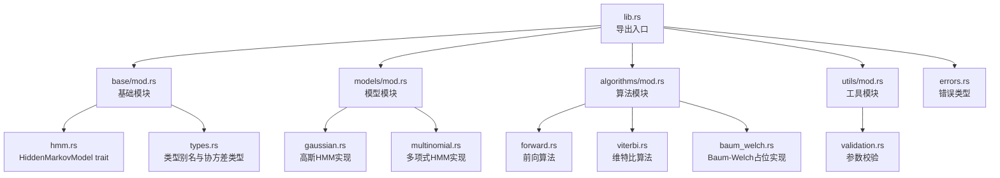
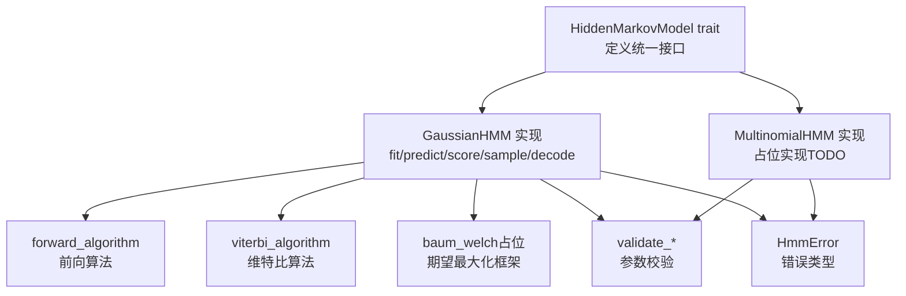
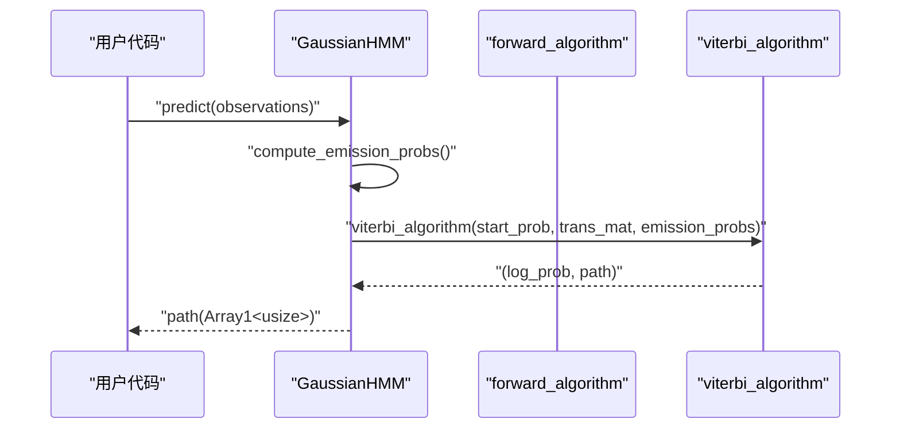
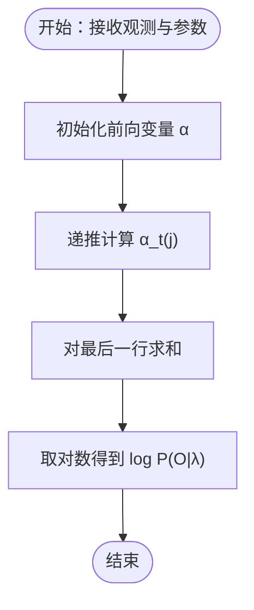
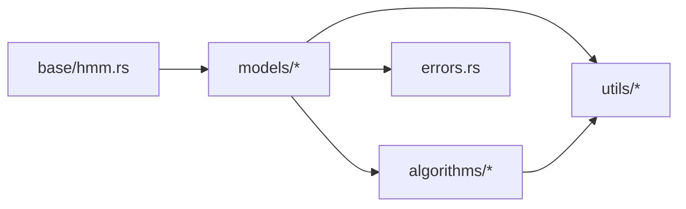

# Trait 接口设计

<cite>
**本文引用的文件**
- [src/lib.rs](file://src/lib.rs)
- [src/base/mod.rs](file://src/base/mod.rs)
- [src/base/hmm.rs](file://src/base/hmm.rs)
- [src/base/types.rs](file://src/base/types.rs)
- [src/models/gaussian.rs](file://src/models/gaussian.rs)
- [src/models/multinomial.rs](file://src/models/multinomial.rs)
- [src/algorithms/forward.rs](file://src/algorithms/forward.rs)
- [src/algorithms/viterbi.rs](file://src/algorithms/viterbi.rs)
- [src/algorithms/baum_welch.rs](file://src/algorithms/baum_welch.rs)
- [src/utils/validation.rs](file://src/utils/validation.rs)
- [src/errors.rs](file://src/errors.rs)
- [examples/beta_hmm_example.rs](file://examples/beta_hmm_example.rs)
- [Cargo.toml](file://Cargo.toml)
</cite>

## 目录
1. [引言](#引言)
2. [项目结构](#项目结构)
3. [核心组件](#核心组件)
4. [架构总览](#架构总览)
5. [详细组件分析](#详细组件分析)
6. [依赖关系分析](#依赖关系分析)
7. [性能考量](#性能考量)
8. [故障排查指南](#故障排查指南)
9. [结论](#结论)
10. [附录：完整接口实现示例路径](#附录完整接口实现示例路径)

## 引言
本文件围绕 HiddenMarkovModel trait 的设计与实现进行系统化说明，目标是帮助读者从“理念—接口—实现—最佳实践”的全链路理解该 trait 及其在高斯/多项式等模型中的落地。文档重点覆盖：
- 设计理念与方法签名设计原则
- 各方法的功能、输入输出规范与错误处理
- n_states() 与 n_features() 的作用与实现要求
- fit() 的训练流程与参数处理逻辑
- predict() 与 score() 的数学原理与实现细节
- sample() 的数据生成机制
- decode() 的组合功能与使用场景
- 实现最佳实践与常见陷阱
- 完整接口实现示例的代码路径指引

## 项目结构
该项目采用模块化组织，核心接口位于 base 模块，具体模型实现在 models 子模块，算法实现位于 algorithms，工具与校验位于 utils，错误类型定义于 errors。

图表来源
- [src/lib.rs](file://src/lib.rs#L19-L27)
- [src/base/mod.rs](file://src/base/mod.rs#L1-L8)
- [src/models/mod.rs](file://src/models/mod.rs#L1-L12)
- [src/algorithms/mod.rs](file://src/algorithms/mod.rs#L1-L12)

章节来源
- [src/lib.rs](file://src/lib.rs#L1-L28)
- [src/base/mod.rs](file://src/base/mod.rs#L1-L8)
- [src/models/mod.rs](file://src/models/mod.rs#L1-L12)
- [src/algorithms/mod.rs](file://src/algorithms/mod.rs#L1-L12)

## 核心组件
本节聚焦 HiddenMarkovModel trait 的设计与职责边界，以及与之配套的类型别名与错误体系。

- 核心 trait：HiddenMarkovModel
  - 职责：统一所有 HMM 模型的公共行为，包括状态数查询、特征维度查询、训练、预测、评分、采样与解码。
  - 关键方法：
    - n_states(): 返回隐藏状态数
    - n_features(): 返回观测特征维度
    - fit(): 训练模型（支持多序列拼接长度）
    - predict(): 使用维特比算法预测最可能的状态序列
    - score(): 使用前向算法计算对数概率
    - sample(): 从已拟合模型中生成观测与状态序列
    - decode(): 组合 predict 与 score，返回对数概率与状态序列
  - 方法签名设计原则：
    - 输入统一使用 ndarray::Array2<f64> 表示观测矩阵 (n_samples, n_features)，便于批处理与向量化运算
    - Option<&[usize]> lengths 支持多序列场景，若未提供则默认单序列
    - 返回值统一 Result<T>，错误类型集中于 HmmError，便于上层统一处理
  - 参数约束：
    - 观测矩阵非空且列数必须等于 n_features
    - 初始分布与转移矩阵需满足概率合法（非负、按行和为1）
    - 模型必须先 fit 才能执行 predict、score、sample、decode

- 类型别名与枚举
  - TransitionMatrix、InitialProbs、Observations、States 等类型别名提升可读性
  - CovarianceType 提供多种协方差结构（Full、Diagonal、Spherical、Tied），用于高斯模型的发射分布建模

- 错误体系
  - InvalidParameter、DimensionMismatch、InvalidProbability、ModelNotFitted、ConvergenceError、InvalidState、NumericalError、IoError
  - Result<T> 统一返回类型，便于链式调用与错误传播

章节来源
- [src/base/hmm.rs](file://src/base/hmm.rs#L1-L62)
- [src/base/types.rs](file://src/base/types.rs#L1-L61)
- [src/errors.rs](file://src/errors.rs#L1-L105)

## 架构总览
下图展示了 HiddenMarkovModel trait 与其算法依赖关系，以及模型实现如何通过算法模块完成训练与推理。

图表来源
- [src/base/hmm.rs](file://src/base/hmm.rs#L7-L61)
- [src/models/gaussian.rs](file://src/models/gaussian.rs#L328-L612)
- [src/models/multinomial.rs](file://src/models/multinomial.rs#L35-L94)
- [src/algorithms/forward.rs](file://src/algorithms/forward.rs#L20-L47)
- [src/algorithms/viterbi.rs](file://src/algorithms/viterbi.rs#L20-L74)
- [src/algorithms/baum_welch.rs](file://src/algorithms/baum_welch.rs#L25-L44)
- [src/utils/validation.rs](file://src/utils/validation.rs#L58-L74)
- [src/errors.rs](file://src/errors.rs#L9-L34)

## 详细组件分析

### HiddenMarkovModel trait 方法详解
- n_states() 与 n_features()
  - 作用：分别返回隐藏状态数与观测特征维度，用于约束输入尺寸与初始化参数规模
  - 实现要求：n_features 在 fit() 中首次从观测矩阵推断并固定；后续 predict/score/sample 必须保持一致
- fit(observations, lengths)
  - 功能：使用 EM（Baum-Welch）估计参数，支持多序列拼接
  - 输入规范：
    - observations: (n_samples, n_features)，非空
    - lengths: 可选，指定各序列长度；未提供时默认单序列
  - 处理逻辑要点：
    - 校验观测维度与合法性
    - 初始化初始分布与转移矩阵（均匀或随机）
    - 初始化发射参数（如高斯模型的均值与协方差）
    - 迭代执行 E 步（前向/后向）与 M 步（参数更新），直至收敛或达到最大迭代
    - 设置 is_fitted 标志
  - 错误处理：观测为空、维度不匹配、概率非法、收敛失败等
- predict(observations)
  - 功能：使用维特比算法求最优状态路径
  - 输入输出：(n_samples, n_features) → Array1<usize>（长度为 n_samples）
  - 错误处理：未拟合、维度不匹配
- score(observations)
  - 功能：使用前向算法计算对数概率
  - 输入输出：(n_samples, n_features) → f64
  - 错误处理：未拟合、维度不匹配
- sample(n_samples)
  - 功能：从已拟合模型中生成观测与状态序列
  - 输入输出：n_samples → (Array2<f64>, Array1<usize>)
  - 错误处理：未拟合
- decode(observations)
  - 功能：组合 predict 与 score，返回 (log_prob, states)
  - 默认实现：直接委托 predict 与 score

章节来源
- [src/base/hmm.rs](file://src/base/hmm.rs#L7-L61)

### 高斯 HMM（GaussianHMM）实现
- 结构要点
  - 字段：n_states、n_features、covariance_type、start_prob、transition_matrix、means、covars、is_fitted
  - 发射概率计算：根据协方差类型（Diagonal/Spherical/Full/Tied）选择不同密度函数
  - 参数初始化：基于数据统计的简单初始化策略
  - 训练流程：E 步（前向/后向）→ 统计累积 → M 步（更新初始分布、转移矩阵、均值与协方差）→ 收敛判断
- 方法实现要点
  - n_states()/n_features()：直接返回字段
  - fit()：见“架构总览”流程；注意 lengths 处理与序列拆分
  - predict()：compute_emission_probs → viterbi_algorithm
  - score()：compute_emission_probs → forward_algorithm → 对数概率
  - sample()：按初始分布抽初态与观测，随后按转移矩阵迭代抽状态与观测
  - decode()：默认实现组合 predict 与 score

图表来源
- [src/models/gaussian.rs](file://src/models/gaussian.rs#L493-L517)
- [src/algorithms/viterbi.rs](file://src/algorithms/viterbi.rs#L20-L74)

章节来源
- [src/models/gaussian.rs](file://src/models/gaussian.rs#L1-L681)

### 多项式 HMM（MultinomialHMM）实现
- 当前实现：占位（TODO），仅完成基本接口与最小校验
- 建议实现方向：
  - 发射概率：多项式分布参数（每个状态一个类别概率向量）
  - 训练：EM 框架，E 步计算 gamma/xi，M 步更新参数
  - 预测/评分：使用前向/维特比算法
  - 采样：按多项式分布生成离散观测

章节来源
- [src/models/multinomial.rs](file://src/models/multinomial.rs#L1-L95)

### 算法模块与数学原理
- 前向算法（forward_algorithm）
  - 数学原理：递推计算前向变量 α_t(i)，表示到时间 t 为止观测到前缀且处于状态 i 的概率
  - 输出：α 矩阵，最终行和的对数即为序列对数似然
- 维特比算法（viterbi_algorithm）
  - 数学原理：动态规划求最可能的状态序列（Viterbi 路径）
  - 输出：(log_prob, path)
- Baum-Welch（占位）
  - 数学原理：EM 算法估计 HMM 参数；当前提供占位以体现框架完整性

图表来源
- [src/algorithms/forward.rs](file://src/algorithms/forward.rs#L20-L69)

章节来源
- [src/algorithms/forward.rs](file://src/algorithms/forward.rs#L1-L129)
- [src/algorithms/viterbi.rs](file://src/algorithms/viterbi.rs#L1-L118)
- [src/algorithms/baum_welch.rs](file://src/algorithms/baum_welch.rs#L1-L75)

### 参数校验与错误处理
- validate_observations：检查观测非空与维度一致性
- validate_probability_vector：检查概率向量非负且和为 1
- validate_transition_matrix：检查转移矩阵为方阵且每行和为 1、非负
- 错误类型：InvalidParameter、DimensionMismatch、InvalidProbability、ModelNotFitted、ConvergenceError、InvalidState、NumericalError、IoError

章节来源
- [src/utils/validation.rs](file://src/utils/validation.rs#L1-L141)
- [src/errors.rs](file://src/errors.rs#L1-L105)

## 依赖关系分析
- 模块耦合
  - models 依赖 base::HiddenMarkovModel 与 algorithms、utils、errors
  - algorithms 依赖 utils（归一化等）与 errors
  - base 提供 trait 与类型别名，被 models 依赖
- 外部依赖
  - ndarray、rand、rand_distr、thiserror、serde 等

图表来源
- [src/base/hmm.rs](file://src/base/hmm.rs#L3-L4)
- [src/models/gaussian.rs](file://src/models/gaussian.rs#L3-L6)
- [src/algorithms/mod.rs](file://src/algorithms/mod.rs#L1-L12)
- [src/utils/validation.rs](file://src/utils/validation.rs#L1-L5)
- [src/errors.rs](file://src/errors.rs#L1-L6)

章节来源
- [Cargo.toml](file://Cargo.toml#L13-L22)

## 性能考量
- 向量化优先：统一使用 ndarray 矩阵操作，避免逐元素循环
- 内存复用：在 fit() 中使用累积数组（acc）减少重复分配
- 收敛控制：设置最大迭代与容忍度，防止无限循环
- 协方差类型选择：Diagonal/Spherical 在高维时更稳定且计算更快
- 多序列处理：合理拆分与偏移索引，避免跨序列边界统计

## 故障排查指南
- “模型未拟合”错误
  - 现象：predict/score/sample/decode 报错
  - 排查：确认是否调用 fit() 且成功
- “维度不匹配”
  - 现象：观测列数与 n_features 不一致
  - 排查：fit() 时会自动设定 n_features；确保后续 predict/score 使用相同维度
- “概率非法”
  - 现象：初始分布或转移矩阵不合法
  - 排查：使用 validate_* 工具或依赖实现内部校验
- “收敛失败”
  - 现象：训练未收敛
  - 排查：增加最大迭代、调整初始参数、检查数据质量

章节来源
- [src/models/gaussian.rs](file://src/models/gaussian.rs#L337-L491)
- [src/models/multinomial.rs](file://src/models/multinomial.rs#L44-L94)
- [src/utils/validation.rs](file://src/utils/validation.rs#L58-L74)
- [src/errors.rs](file://src/errors.rs#L10-L34)

## 结论
HiddenMarkovModel trait 将 HMM 的训练、推理与采样抽象为统一接口，配合算法模块与工具模块，实现了高斯与多项式等模型的一致实现体验。实现者应重点关注：
- n_states/n_features 的一致性与初始化策略
- fit() 的 E/M 步与收敛控制
- predict/score 的算法正确性与数值稳定性
- sample() 的参数生成与分布构造
- decode() 的组合使用场景

## 附录：完整接口实现示例路径
以下示例展示了如何正确实现 HiddenMarkovModel 接口的关键步骤与调用方式，便于对照参考：

- 高斯 HMM 的训练、预测、评分与采样
  - 训练与参数查看：[examples/beta_hmm_example.rs](file://examples/beta_hmm_example.rs#L62-L70)
  - 预测状态序列：[examples/beta_hmm_example.rs](file://examples/beta_hmm_example.rs#L154-L173)
  - 计算对数似然：[examples/beta_hmm_example.rs](file://examples/beta_hmm_example.rs#L180-L186)
  - 生成合成数据：[examples/beta_hmm_example.rs](file://examples/beta_hmm_example.rs#L195-L217)
  - 新数据预测：[examples/beta_hmm_example.rs](file://examples/beta_hmm_example.rs#L231-L250)

- 高斯 HMM 的接口实现（方法与流程）
  - n_states/n_features：[src/models/gaussian.rs](file://src/models/gaussian.rs#L329-L335)
  - fit() 流程与参数更新：[src/models/gaussian.rs](file://src/models/gaussian.rs#L337-L491)
  - predict() 与 score()：[src/models/gaussian.rs](file://src/models/gaussian.rs#L493-L544)
  - sample()：[src/models/gaussian.rs](file://src/models/gaussian.rs#L546-L611)
  - decode() 默认实现：[src/base/hmm.rs](file://src/base/hmm.rs#L56-L60)

- 多项式 HMM 的接口实现（占位）
  - fit/predict/score/sample 占位实现：[src/models/multinomial.rs](file://src/models/multinomial.rs#L35-L94)

- 算法与校验
  - 前向算法：[src/algorithms/forward.rs](file://src/algorithms/forward.rs#L20-L69)
  - 维特比算法：[src/algorithms/viterbi.rs](file://src/algorithms/viterbi.rs#L20-L74)
  - 参数校验：[src/utils/validation.rs](file://src/utils/validation.rs#L58-L74)