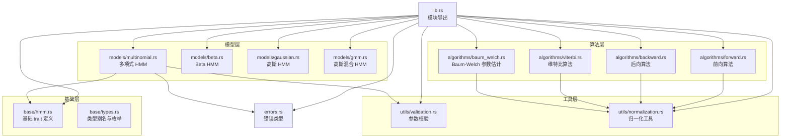
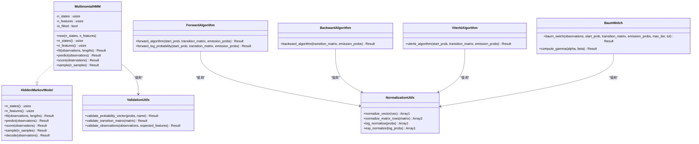
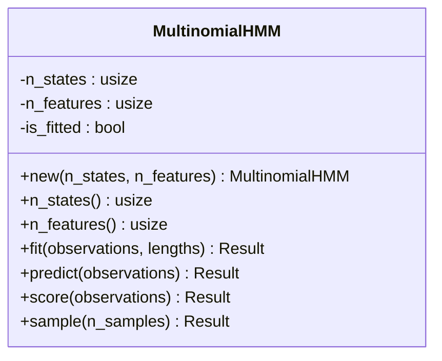
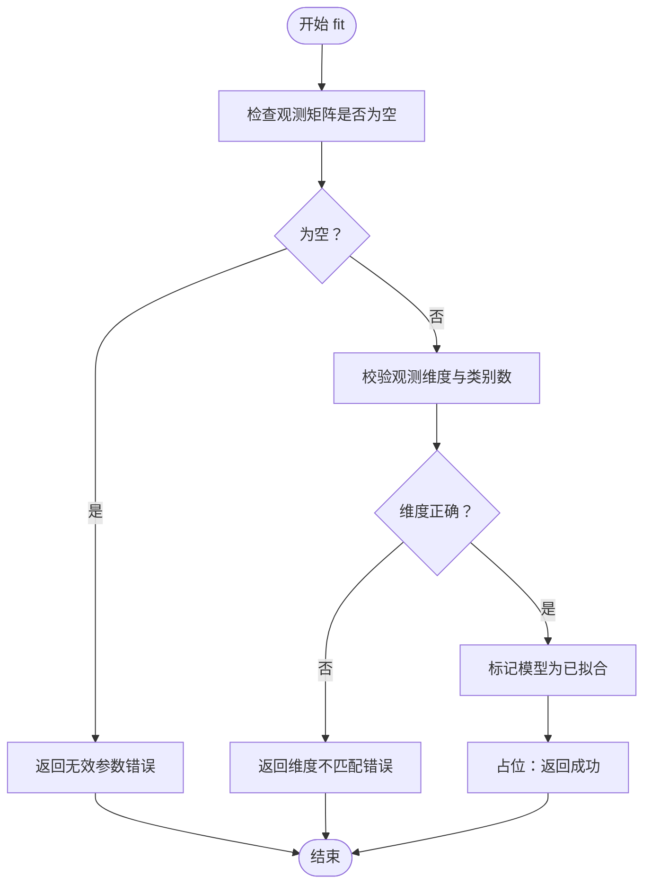
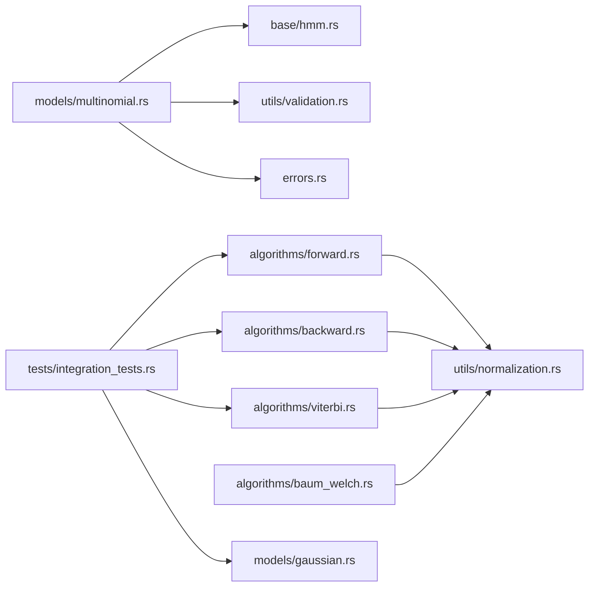

# 多项式 HMM 实现

<cite>
**本文档引用的文件**
- [README.md](file://README.md)
- [lib.rs](file://src/lib.rs)
- [hmm.rs](file://src/base/hmm.rs)
- [types.rs](file://src/base/types.rs)
- [multinomial.rs](file://src/models/multinomial.rs)
- [validation.rs](file://src/utils/validation.rs)
- [normalization.rs](file://src/utils/normalization.rs)
- [forward.rs](file://src/algorithms/forward.rs)
- [backward.rs](file://src/algorithms/backward.rs)
- [viterbi.rs](file://src/algorithms/viterbi.rs)
- [baum_welch.rs](file://src/algorithms/baum_welch.rs)
- [errors.rs](file://src/errors.rs)
- [integration_tests.rs](file://tests/integration_tests.rs)
- [beta_hmm_example.rs](file://examples/beta_hmm_example.rs)
</cite>

## 目录
1. [简介](#简介)
2. [项目结构](#项目结构)
3. [核心组件](#核心组件)
4. [架构总览](#架构总览)
5. [详细组件分析](#详细组件分析)
6. [依赖关系分析](#依赖关系分析)
7. [性能考虑](#性能考虑)
8. [故障排除指南](#故障排除指南)
9. [结论](#结论)
10. [附录](#附录)

## 简介
本项目为基于 Rust 的隐马尔可夫模型（HMM）库，受 Python hmmlearn 启发，提供多种发射分布类型的实现与标准 HMM 算法。当前已实现高斯 HMM、Beta HMM 以及多项式 HMM（Multinomial HMM），并支持前向、后向、维特比与 Baum-Welch 等核心算法。本文档聚焦于多项式 HMM 的实现，解释多项式分布作为发射分布的理论基础、参数初始化与估计流程、发射概率矩阵的更新机制、多项式概率质量函数的计算实现，并对比其与连续分布 HMM 的差异及适用场景。

## 项目结构
该仓库采用模块化组织方式，按功能域划分目录：基础接口定义在 base，具体模型实现在 models，算法实现位于 algorithms，工具函数在 utils，错误类型在 errors，示例与测试分别在 examples 与 tests。

**图表来源**
- [lib.rs](file://src/lib.rs#L19-L27)
- [hmm.rs](file://src/base/hmm.rs#L7-L61)
- [multinomial.rs](file://src/models/multinomial.rs#L35-L94)
- [validation.rs](file://src/utils/validation.rs#L58-L74)
- [normalization.rs](file://src/utils/normalization.rs#L14-L23)
- [forward.rs](file://src/algorithms/forward.rs#L20-L47)
- [backward.rs](file://src/algorithms/backward.rs#L19-L44)
- [viterbi.rs](file://src/algorithms/viterbi.rs#L20-L74)
- [baum_welch.rs](file://src/algorithms/baum_welch.rs#L25-L44)

**章节来源**
- [lib.rs](file://src/lib.rs#L19-L27)
- [README.md](file://README.md#L1-L303)

## 核心组件
- 基础 trait：所有 HMM 模型必须实现的统一接口，包括状态数、特征数、训练、预测（维特比）、评分（对数似然）、采样等方法。
- 类型别名与枚举：定义转移矩阵、初始概率、观测序列、状态序列等常用类型，以及高斯模型的协方差类型枚举。
- 多项式 HMM：离散多类发射分布的 HMM 实现，当前处于开发阶段，提供占位的训练、预测、评分与采样逻辑。
- 工具函数：参数校验（概率向量、转移矩阵、观测维度）、数值稳定性归一化（向量、矩阵行、对数空间转换）。
- 算法实现：前向、后向、维特比与 Baum-Welch（占位）等核心算法。

**章节来源**
- [hmm.rs](file://src/base/hmm.rs#L7-L61)
- [types.rs](file://src/base/types.rs#L5-L29)
- [multinomial.rs](file://src/models/multinomial.rs#L13-L33)
- [validation.rs](file://src/utils/validation.rs#L6-L74)
- [normalization.rs](file://src/utils/normalization.rs#L5-L35)
- [forward.rs](file://src/algorithms/forward.rs#L20-L69)
- [backward.rs](file://src/algorithms/backward.rs#L19-L44)
- [viterbi.rs](file://src/algorithms/viterbi.rs#L20-L74)
- [baum_welch.rs](file://src/algorithms/baum_welch.rs#L25-L74)

## 架构总览
多项式 HMM 的整体架构遵循“模型实现 + 算法调用 + 工具支撑”的分层设计。模型通过基础 trait 对外暴露统一接口；算法模块提供前向、后向、维特比与参数估计等能力；工具模块负责参数校验与数值稳定性；错误模块集中管理各类异常。

**图表来源**
- [hmm.rs](file://src/base/hmm.rs#L7-L61)
- [multinomial.rs](file://src/models/multinomial.rs#L13-L94)
- [validation.rs](file://src/utils/validation.rs#L6-L74)
- [normalization.rs](file://src/utils/normalization.rs#L5-L35)
- [forward.rs](file://src/algorithms/forward.rs#L20-L69)
- [backward.rs](file://src/algorithms/backward.rs#L19-L44)
- [viterbi.rs](file://src/algorithms/viterbi.rs#L20-L74)
- [baum_welch.rs](file://src/algorithms/baum_welch.rs#L25-L74)

## 详细组件分析

### 多项式 HMM 组件分析
- 设计目标：用于建模离散符号序列（如文本词元、DNA 字符等），发射分布采用多项式分布。
- 当前实现状态：模型结构与基础接口已就绪，但训练、预测、评分与采样均为占位实现，尚未完成参数估计与概率计算的具体逻辑。
- 关键字段与方法：
  - n_states：隐藏状态数量
  - n_features：离散观测的类别数（特征维数）
  - is_fitted：是否已完成训练
  - new：构造函数
  - fit/predict/score/sample：占位实现，需后续完善

**图表来源**
- [multinomial.rs](file://src/models/multinomial.rs#L13-L33)

**章节来源**
- [multinomial.rs](file://src/models/multinomial.rs#L13-L94)

### 参数初始化与参数估计流程
- 初始化策略（当前实现）：MultinomialHMM 仅设置内部状态标记 is_fitted，未进行具体的参数初始化。
- 参数估计（当前实现）：fit 占位返回成功，未执行任何训练步骤；Baum-Welch 算法亦为占位实现，返回给定迭代次数。
- 发射概率矩阵更新机制（当前实现）：尚未实现，需在后续版本中补充。

**图表来源**
- [multinomial.rs](file://src/models/multinomial.rs#L44-L58)
- [validation.rs](file://src/utils/validation.rs#L58-L74)

**章节来源**
- [multinomial.rs](file://src/models/multinomial.rs#L44-L58)
- [validation.rs](file://src/utils/validation.rs#L58-L74)
- [baum_welch.rs](file://src/algorithms/baum_welch.rs#L25-L44)

### 多项式概率质量函数的计算实现
- 多项式分布用于建模单次试验中各离散类别的出现次数，适用于离散符号序列的发射概率建模。
- 在当前实现中，多项式的 PMF 计算尚未在代码中直接体现；后续应在发射概率矩阵构建与前向/后向/维特比算法中引入多项式概率的计算与归一化。

（本节为概念性说明，不直接分析具体源码）

### 与其他连续分布 HMM 的区别与应用场景
- 与高斯 HMM 的区别：高斯 HMM 使用连续发射分布，适合建模连续特征；多项式 HMM 使用离散发射分布，适合建模离散符号序列。
- 与 Beta HMM 的区别：Beta HMM 适用于 [0,1] 区间的比例数据；多项式 HMM 适用于离散类别数据。
- 典型应用：自然语言处理中的词性标注、生物信息学中的 DNA 序列建模、用户行为点击流分析等离散符号序列任务。

**章节来源**
- [README.md](file://README.md#L121-L139)

### 实际使用示例与最佳实践
- 文本数据处理：将词汇映射为离散类别，使用多项式 HMM 进行词性标注或主题建模。
- DNA 序列：将核苷酸（如 A、T、G、C）编码为离散类别，使用多项式 HMM 建模序列模式。
- 最佳实践：
  - 数据预处理：确保观测为离散类别索引，且类别数与 n_features 一致。
  - 参数校验：利用 validate_observations 与 validate_probability_vector 确保输入合法。
  - 数值稳定：使用 log_normalize 与 exp_normalize 避免下溢与上溢。
  - 错误处理：捕获并处理 ModelNotFitted、InvalidParameter、DimensionMismatch 等错误。

**章节来源**
- [README.md](file://README.md#L135-L139)
- [validation.rs](file://src/utils/validation.rs#L58-L74)
- [normalization.rs](file://src/utils/normalization.rs#L25-L35)
- [errors.rs](file://src/errors.rs#L10-L34)

## 依赖关系分析
- 模块耦合：模型层依赖基础 trait 与工具层；算法层依赖工具层的归一化与数值稳定函数；错误类型贯穿全库。
- 外部依赖：ndarray 用于数组操作，ndarray-linalg 提供线性代数运算，rand/rand_distr 支持随机采样与分布生成，thiserror 提供错误处理，serde 支持序列化。

**图表来源**
- [multinomial.rs](file://src/models/multinomial.rs#L3-L6)
- [hmm.rs](file://src/base/hmm.rs#L3-L4)
- [validation.rs](file://src/utils/validation.rs#L3-L4)
- [normalization.rs](file://src/utils/normalization.rs#L3-L4)
- [forward.rs](file://src/algorithms/forward.rs#L3-L5)
- [backward.rs](file://src/algorithms/backward.rs#L3-L4)
- [viterbi.rs](file://src/algorithms/viterbi.rs#L3-L4)
- [baum_welch.rs](file://src/algorithms/baum_welch.rs#L3-L6)
- [integration_tests.rs](file://tests/integration_tests.rs#L5-L8)

**章节来源**
- [lib.rs](file://src/lib.rs#L19-L27)
- [integration_tests.rs](file://tests/integration_tests.rs#L1-L103)

## 性能考虑
- 数组操作：使用 ndarray 进行向量化计算，减少内存分配与循环开销。
- 数值稳定性：log-space 归一化避免概率乘积导致的下溢；exp_normalize 在指数空间安全恢复概率。
- 算法复杂度：前向/后向/维特比算法的时间复杂度为 O(T·N^2)，其中 T 为序列长度，N 为状态数；Baum-Welch 的每次迭代包含相同复杂度的 E 步与 M 步。

（本节提供一般性指导，不直接分析具体源码）

## 故障排除指南
- 常见错误类型与触发条件：
  - InvalidParameter：观测为空或参数非法
  - DimensionMismatch：观测列数与 n_features 不一致
  - InvalidProbability：概率向量或转移矩阵元素不在 [0,1] 或行和不为 1
  - ModelNotFitted：在未训练完成时调用预测/评分/采样
- 排查建议：
  - 使用 validate_observations 与 validate_probability_vector 进行输入校验
  - 确保 is_fitted 标志正确设置
  - 在训练前后检查观测形状与数值范围

**章节来源**
- [errors.rs](file://src/errors.rs#L10-L34)
- [validation.rs](file://src/utils/validation.rs#L58-L74)
- [multinomial.rs](file://src/models/multinomial.rs#L60-L94)

## 结论
多项式 HMM 为离散符号序列建模提供了合适的发射分布选择。当前实现完成了基础框架与占位逻辑，后续应重点补齐参数估计（Baum-Welch）、发射概率矩阵更新、多项式 PMF 计算以及完整的预测与评分实现。配合现有的参数校验与数值稳定工具，可为文本处理、DNA 序列建模等应用提供稳健的解决方案。

## 附录
- 示例参考：Beta HMM 示例展示了完整的训练、参数查看、预测、评分与采样流程，可作为多项式 HMM 后续实现的参考模板。
- 测试参考：集成测试覆盖了前向/后向一致性、维特比路径、归一化与多序列训练等关键场景，可迁移至多项式 HMM 的单元测试。

**章节来源**
- [beta_hmm_example.rs](file://examples/beta_hmm_example.rs#L1-L266)
- [integration_tests.rs](file://tests/integration_tests.rs#L1-L103)