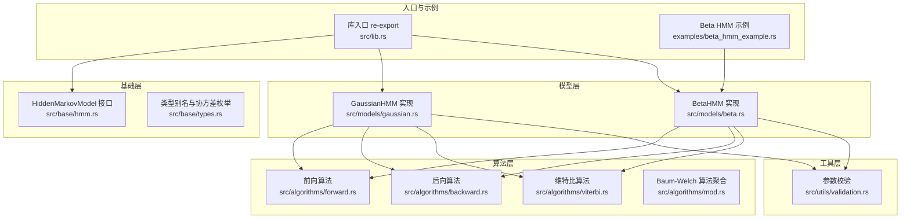
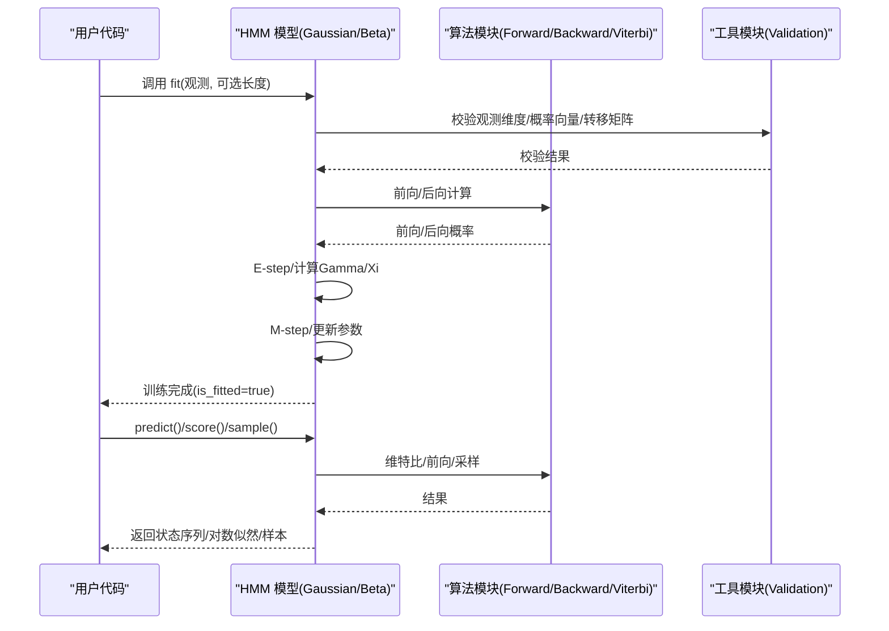
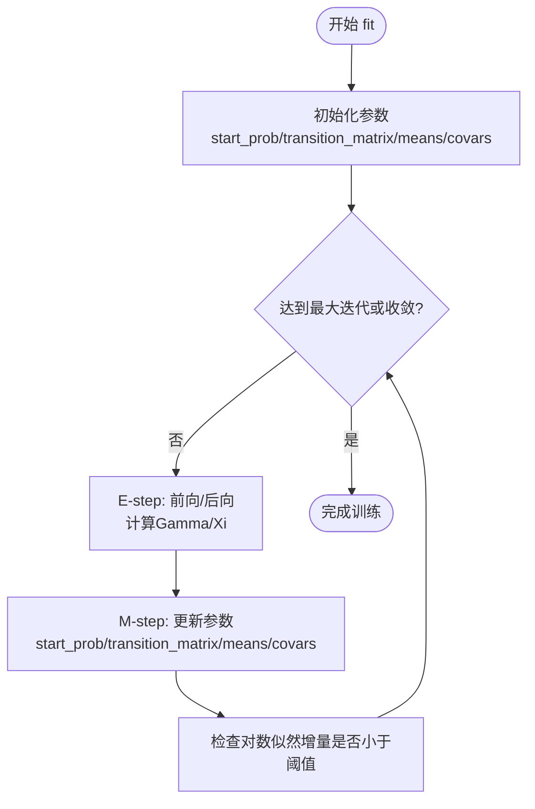
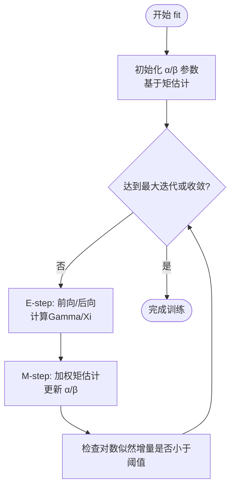
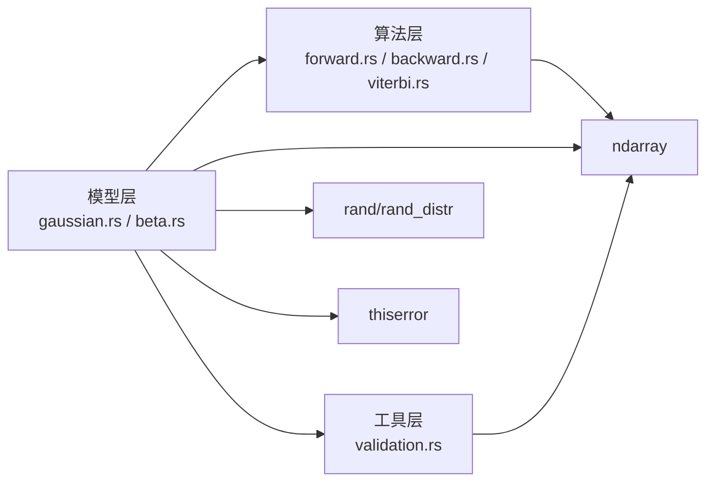

# 模型实现模式

<cite>
**本文引用的文件**
- [README.md](file://README.md)
- [lib.rs](file://src/lib.rs)
- [base/mod.rs](file://src/base/mod.rs)
- [base/hmm.rs](file://src/base/hmm.rs)
- [base/types.rs](file://src/base/types.rs)
- [models/mod.rs](file://src/models/mod.rs)
- [models/gaussian.rs](file://src/models/gaussian.rs)
- [models/beta.rs](file://src/models/beta.rs)
- [algorithms/mod.rs](file://src/algorithms/mod.rs)
- [algorithms/forward.rs](file://src/algorithms/forward.rs)
- [algorithms/backward.rs](file://src/algorithms/backward.rs)
- [algorithms/viterbi.rs](file://src/algorithms/viterbi.rs)
- [utils/mod.rs](file://src/utils/mod.rs)
- [utils/validation.rs](file://src/utils/validation.rs)
- [examples/beta_hmm_example.rs](file://examples/beta_hmm_example.rs)
</cite>

## 目录
1. [简介](#简介)
2. [项目结构](#项目结构)
3. [核心组件](#核心组件)
4. [架构总览](#架构总览)
5. [详细组件分析](#详细组件分析)
6. [依赖关系分析](#依赖关系分析)
7. [性能考量](#性能考量)
8. [故障排查指南](#故障排查指南)
9. [结论](#结论)
10. [附录](#附录)

## 简介
本指南围绕隐藏马尔可夫模型（HMM）在该 Rust 库中的实现模式与架构进行系统化阐述，重点覆盖以下方面：
- 不同类型 HMM 的实现模式与数据结构设计
- 高斯 HMM 的协方差类型处理与参数估计方法
- 贝塔 HMM 的发射分布实现与参数学习流程
- 模型参数的数据结构与内存布局
- 初始化策略与约束条件
- 训练算法实现模式与收敛判断机制
- 模型验证与测试实践
- 多序列与变长序列的处理方式
- 具体代码实现示例与最佳实践

## 项目结构
该项目采用模块化分层组织，核心模块包括：
- 基础接口与类型：定义统一的 HMM 行为接口与通用类型别名
- 模型实现：高斯 HMM、贝塔 HMM 等具体模型
- 算法实现：前向、后向、维特比、Baum-Welch 等标准算法
- 工具模块：参数校验、序列切分、采样等辅助能力
- 示例与测试：演示用例与单元测试

图表来源
- [lib.rs](file://src/lib.rs#L19-L28)
- [base/hmm.rs](file://src/base/hmm.rs#L7-L61)
- [base/types.rs](file://src/base/types.rs#L18-L29)
- [models/gaussian.rs](file://src/models/gaussian.rs#L14-L32)
- [models/beta.rs](file://src/models/beta.rs#L24-L39)
- [algorithms/forward.rs](file://src/algorithms/forward.rs#L20-L47)
- [algorithms/backward.rs](file://src/algorithms/backward.rs#L19-L45)
- [algorithms/viterbi.rs](file://src/algorithms/viterbi.rs#L20-L74)
- [utils/validation.rs](file://src/utils/validation.rs#L6-L74)
- [examples/beta_hmm_example.rs](file://examples/beta_hmm_example.rs#L11-L13)

章节来源
- [lib.rs](file://src/lib.rs#L19-L28)
- [README.md](file://README.md#L1-L303)

## 核心组件
- 统一接口：所有 HMM 模型均实现统一 trait，提供拟合、预测、评分、采样、解码等能力
- 类型别名：对状态转移矩阵、初始概率向量、观测序列、状态序列等进行强类型封装
- 协方差类型：高斯 HMM 支持 Full、Diagonal、Spherical、Tied 四种协方差类型
- 算法组合：前向/后向/维特比/Baum-Welch 算法以模块形式提供，便于复用与扩展

章节来源
- [base/hmm.rs](file://src/base/hmm.rs#L7-L61)
- [base/types.rs](file://src/base/types.rs#L18-L29)
- [algorithms/mod.rs](file://src/algorithms/mod.rs#L1-L12)

## 架构总览
下图展示了模型层与算法层之间的交互关系，以及参数校验在训练阶段的嵌入位置。

图表来源
- [models/gaussian.rs](file://src/models/gaussian.rs#L337-L491)
- [models/beta.rs](file://src/models/beta.rs#L393-L547)
- [algorithms/forward.rs](file://src/algorithms/forward.rs#L20-L47)
- [algorithms/backward.rs](file://src/algorithms/backward.rs#L19-L45)
- [algorithms/viterbi.rs](file://src/algorithms/viterbi.rs#L20-L74)
- [utils/validation.rs](file://src/utils/validation.rs#L6-L74)

## 详细组件分析

### 高斯 HMM 实现模式与协方差处理
- 数据结构与内存布局
  - 参数存储：初始概率、转移矩阵、每状态均值与协方差（按状态-特征二维数组）
  - 观测与中间变量：观测矩阵、前向/后向概率矩阵、Gamma/Xi 等统计量
- 协方差类型处理
  - Diagonal：使用对角元素作为协方差，计算高效且数值稳定
  - Spherical：单个方差值，适用于特征间同方差假设
  - Full/Tied：当前实现简化为对角处理；完整实现需矩阵分解与求逆
- 发射概率计算
  - 基于高斯密度函数，支持不同协方差类型的对数密度与归一化
- 参数估计（Baum-Welch）
  - E-step：前向/后向计算，得到 Gamma（状态占用概率）与 Xi（状态转移概率）
  - M-step：更新初始概率、转移矩阵、均值与协方差
- 收敛判断
  - 连续两次迭代对数似然增量小于阈值时停止
- 初始化策略
  - 初始均值随机选择观测样本
  - 初始协方差基于全局或状态内方差，设置最小正数以避免数值问题
- 多序列与变长序列
  - 通过长度数组将拼接序列切分为独立序列，分别执行 E/M 步并在累积器中合并统计量

图表来源
- [models/gaussian.rs](file://src/models/gaussian.rs#L337-L491)
- [algorithms/forward.rs](file://src/algorithms/forward.rs#L20-L47)
- [algorithms/backward.rs](file://src/algorithms/backward.rs#L19-L45)

章节来源
- [models/gaussian.rs](file://src/models/gaussian.rs#L14-L32)
- [models/gaussian.rs](file://src/models/gaussian.rs#L102-L194)
- [models/gaussian.rs](file://src/models/gaussian.rs#L196-L222)
- [models/gaussian.rs](file://src/models/gaussian.rs#L224-L270)
- [models/gaussian.rs](file://src/models/gaussian.rs#L272-L326)
- [models/gaussian.rs](file://src/models/gaussian.rs#L337-L491)

### 贝塔 HMM 实现模式与发射分布
- 数据结构与内存布局
  - 参数存储：初始概率、转移矩阵、每状态每特征的 α 与 β 参数
  - 观测范围限制：要求观测位于开区间 (0,1)，内部进行夹紧处理
- 发射分布实现
  - 使用逐特征对数密度累加的方式，避免直接计算 Beta 函数
  - 对数域计算提升数值稳定性
- 参数学习（Baum-Welch）
  - E-step：前向/后向，计算 Gamma
  - M-step：基于加权均值与方差，转换为新的 α/β 参数
- 初始化策略
  - 使用“矩估计”方法，从每个状态的样本计算均值与方差，再映射到 α/β
  - 若某状态无样本，回退到整体统计量
- 收敛判断与多序列
  - 与高斯 HMM 类似的迭代框架与序列切分策略

图表来源
- [models/beta.rs](file://src/models/beta.rs#L393-L547)
- [algorithms/forward.rs](file://src/algorithms/forward.rs#L20-L47)
- [algorithms/backward.rs](file://src/algorithms/backward.rs#L19-L45)

章节来源
- [models/beta.rs](file://src/models/beta.rs#L24-L39)
- [models/beta.rs](file://src/models/beta.rs#L116-L157)
- [models/beta.rs](file://src/models/beta.rs#L159-L197)
- [models/beta.rs](file://src/models/beta.rs#L226-L286)
- [models/beta.rs](file://src/models/beta.rs#L288-L332)
- [models/beta.rs](file://src/models/beta.rs#L334-L381)
- [models/beta.rs](file://src/models/beta.rs#L393-L547)

### 统一接口与算法模块
- 接口职责
  - 统一暴露 n_states、n_features、fit、predict、score、sample、decode 等方法
- 算法模块
  - 前向/后向/维特比算法以纯函数形式提供，输入输出均为 ndarray 数组
  - Baum-Welch 在模型层聚合调用，负责统计量累积与参数更新

章节来源
- [base/hmm.rs](file://src/base/hmm.rs#L7-L61)
- [algorithms/forward.rs](file://src/algorithms/forward.rs#L20-L69)
- [algorithms/backward.rs](file://src/algorithms/backward.rs#L19-L45)
- [algorithms/viterbi.rs](file://src/algorithms/viterbi.rs#L20-L74)
- [algorithms/mod.rs](file://src/algorithms/mod.rs#L1-L12)

### 参数数据结构与内存布局
- 高斯 HMM
  - means: (n_states × n_features)
  - covars: (n_states × n_features) 或 (n_states × n_features × n_features)（视协方差类型）
  - start_prob: (n_states)
  - transition_matrix: (n_states × n_states)
- 贝塔 HMM
  - alphas/betas: (n_states × n_features)
  - start_prob/transition_matrix: 同上
- 中间变量
  - emission_probs: (n_samples × n_states)
  - alpha/beta: (n_samples × n_states)
  - gamma: (n_samples × n_states)
  - xi: 每时刻 (n_states × n_states) 的矩阵列表

章节来源
- [models/gaussian.rs](file://src/models/gaussian.rs#L14-L32)
- [models/beta.rs](file://src/models/beta.rs#L24-L39)
- [algorithms/forward.rs](file://src/algorithms/forward.rs#L20-L47)
- [algorithms/backward.rs](file://src/algorithms/backward.rs#L19-L45)

### 初始化策略与约束条件
- 初始化策略
  - 高斯 HMM：随机选择观测样本作为均值初值；协方差基于数据方差并设最小正值
  - 贝塔 HMM：按状态采样计算均值/方差，映射到 α/β；无样本时回退到整体统计
- 约束条件
  - 初始概率与转移矩阵必须为概率分布（非负且行和为 1）
  - 观测维度需与模型一致
  - 贝塔 HMM 观测值需在 (0,1)

章节来源
- [models/gaussian.rs](file://src/models/gaussian.rs#L196-L222)
- [models/beta.rs](file://src/models/beta.rs#L226-L286)
- [utils/validation.rs](file://src/utils/validation.rs#L6-L74)

### 训练算法实现模式与收敛判断
- 实现模式
  - E-step：前向/后向计算，得到 Gamma 与 Xi
  - M-step：更新初始概率、转移矩阵、发射参数（均值/协方差或 α/β）
- 收敛判断
  - 连续两次迭代对数似然增量绝对值小于阈值时停止
- 多序列与变长序列
  - 通过长度数组将拼接序列拆分为多个子序列，分别处理并合并统计量

章节来源
- [models/gaussian.rs](file://src/models/gaussian.rs#L383-L491)
- [models/beta.rs](file://src/models/beta.rs#L439-L547)

### 模型验证与测试实践
- 参数校验
  - 初始概率与转移矩阵的概率合法性校验
  - 观测维度一致性校验
- 测试要点
  - 创建/拟合/预测/评分/采样的端到端流程
  - 异常路径：未拟合模型的预测/评分、维度不匹配、空观测等
- 示例参考
  - 提供了完整的贝塔 HMM 使用示例，涵盖训练、参数查看、预测、评分与采样

章节来源
- [utils/validation.rs](file://src/utils/validation.rs#L6-L74)
- [models/gaussian.rs](file://src/models/gaussian.rs#L614-L681)
- [models/beta.rs](file://src/models/beta.rs#L671-L734)
- [examples/beta_hmm_example.rs](file://examples/beta_hmm_example.rs#L15-L266)

## 依赖关系分析
- 模块耦合
  - 模型层依赖算法层与工具层；算法层保持纯函数风格，便于复用
  - 模型层与工具层通过错误类型与 ndarray 数据结构耦合
- 外部依赖
  - ndarray、rand、rand_distr、thiserror、serde 等
- 循环依赖
  - 未发现循环导入；各模块职责清晰

图表来源
- [models/gaussian.rs](file://src/models/gaussian.rs#L3-L9)
- [models/beta.rs](file://src/models/beta.rs#L3-L12)
- [algorithms/forward.rs](file://src/algorithms/forward.rs#L3-L4)
- [algorithms/backward.rs](file://src/algorithms/backward.rs#L3-L4)
- [algorithms/viterbi.rs](file://src/algorithms/viterbi.rs#L3-L4)
- [utils/validation.rs](file://src/utils/validation.rs#L3-L4)

章节来源
- [lib.rs](file://src/lib.rs#L19-L28)
- [README.md](file://README.md#L44-L51)

## 性能考量
- 数值稳定性
  - 所有密度计算在对数域进行，避免下溢
  - 高斯 HMM 的对角/球面协方差避免矩阵运算
- 内存与计算
  - 尽量使用向量化操作与就地更新
  - 在 Baum-Welch 中使用累积器减少重复分配
- 并行化
  - 当前实现为串行；可考虑在多序列之间并行处理

## 故障排查指南
- 常见错误与定位
  - 未拟合模型即进行预测/评分：检查 is_fitted 标志
  - 观测维度不匹配：核对 n_features 与观测列数
  - 初始概率/转移矩阵非法：使用 validate_probability_vector/validate_transition_matrix
  - 贝塔 HMM 观测越界：确保值在 (0,1)
- 调试建议
  - 逐步打印 emission_probs、alpha、beta、gamma、xi
  - 检查对数似然是否单调递增、是否达到阈值

章节来源
- [models/gaussian.rs](file://src/models/gaussian.rs#L493-L544)
- [models/beta.rs](file://src/models/beta.rs#L549-L599)
- [utils/validation.rs](file://src/utils/validation.rs#L6-L74)

## 结论
该库以清晰的模块划分与统一接口实现了多种 HMM 模型，结合稳健的数值计算与严格的参数校验，提供了高斯与贝塔两类发射分布的完整训练与推理流程。通过前向/后向/维特比/Baum-Welch 等标准算法的模块化设计，既保证了易用性，也为扩展新模型与算法提供了良好基础。

## 附录
- 快速开始与示例
  - 高斯 HMM 与贝塔 HMM 的使用示例可参考文档与示例文件
- 多序列与变长序列
  - 通过长度数组将多个序列拼接后传入 fit，内部自动切分并独立处理

章节来源
- [README.md](file://README.md#L53-L119)
- [README.md](file://README.md#L232-L266)
- [examples/beta_hmm_example.rs](file://examples/beta_hmm_example.rs#L15-L266)