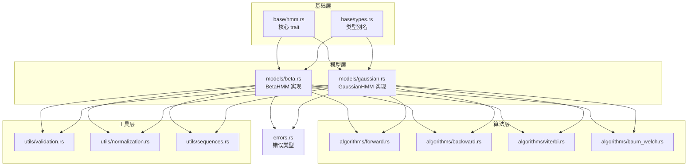
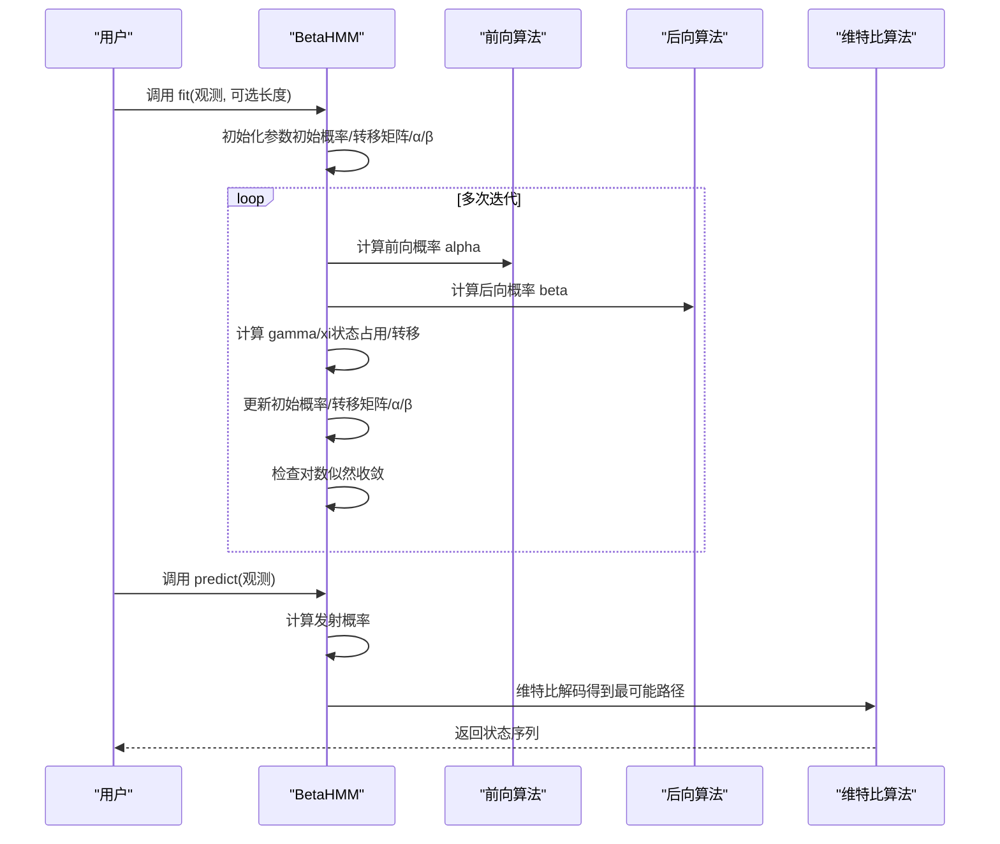
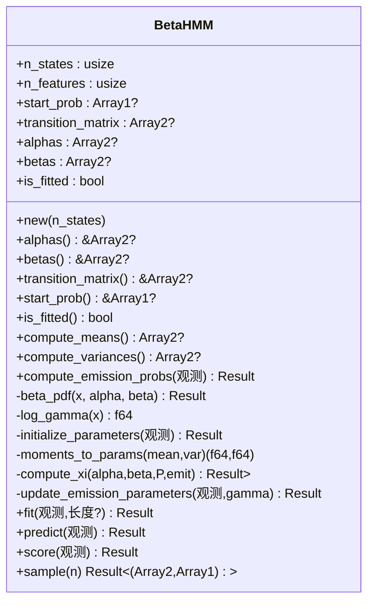
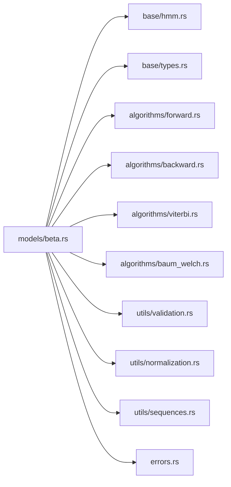

# 贝塔 HMM 实现

<cite>
**本文引用的文件**   
- [README.md](file://README.md)
- [lib.rs](file://src/lib.rs)
- [hmm.rs](file://src/base/hmm.rs)
- [types.rs](file://src/base/types.rs)
- [beta.rs](file://src/models/beta.rs)
- [gaussian.rs](file://src/models/gaussian.rs)
- [forward.rs](file://src/algorithms/forward.rs)
- [backward.rs](file://src/algorithms/backward.rs)
- [viterbi.rs](file://src/algorithms/viterbi.rs)
- [baum_welch.rs](file://src/algorithms/baum_welch.rs)
- [validation.rs](file://src/utils/validation.rs)
- [normalization.rs](file://src/utils/normalization.rs)
- [sequences.rs](file://src/utils/sequences.rs)
- [errors.rs](file://src/errors.rs)
- [beta_hmm_example.rs](file://examples/beta_hmm_example.rs)
- [integration_tests.rs](file://tests/integration_tests.rs)
</cite>

## 目录
1. [引言](#引言)
2. [项目结构](#项目结构)
3. [核心组件](#核心组件)
4. [架构总览](#架构总览)
5. [详细组件分析](#详细组件分析)
6. [依赖关系分析](#依赖关系分析)
7. [性能考量](#性能考量)
8. [故障排查指南](#故障排查指南)
9. [结论](#结论)
10. [附录：使用示例与可视化](#附录使用示例与可视化)

## 引言
本文件系统性阐述贝塔 HMM（Beta Hidden Markov Model）在该 Rust 库中的实现与使用。内容覆盖：
- 贝塔分布作为发射分布的理论基础与适用场景
- 参数化方法、形状参数估计与更新流程
- 概率密度函数的实现与数值稳定性处理
- 初始化策略与收敛判断机制
- 与高斯 HMM 的对比与适用场景
- 完整使用示例、参数可视化与调试技巧

## 项目结构
该仓库采用模块化组织，核心模块如下：
- base：定义 HMM 核心 trait 与通用类型别名
- models：具体模型实现（BetaHMM、GaussianHMM 等）
- algorithms：前向/后向/维特比/鲍姆-韦尔奇等算法
- utils：校验、归一化、序列拆分、数值稳定辅助
- examples/tests：示例与集成测试

图表来源
- [hmm.rs](file://src/base/hmm.rs#L6-L61)
- [types.rs](file://src/base/types.rs#L5-L29)
- [beta.rs](file://src/models/beta.rs#L14-L39)
- [gaussian.rs](file://src/models/gaussian.rs#L14-L32)
- [forward.rs](file://src/algorithms/forward.rs#L20-L47)
- [backward.rs](file://src/algorithms/backward.rs#L19-L44)
- [viterbi.rs](file://src/algorithms/viterbi.rs#L20-L74)
- [baum_welch.rs](file://src/algorithms/baum_welch.rs#L25-L44)
- [validation.rs](file://src/utils/validation.rs#L6-L56)
- [normalization.rs](file://src/utils/normalization.rs#L5-L35)
- [sequences.rs](file://src/utils/sequences.rs#L43-L70)
- [errors.rs](file://src/errors.rs#L9-L34)

章节来源
- [lib.rs](file://src/lib.rs#L19-L27)
- [README.md](file://README.md#L1-L303)

## 核心组件
- 贝塔 HMM（BetaHMM）
  - 发射分布为贝塔分布，适合建模 [0,1] 区间内的比例/比率数据（如转化率、点击率、市场份额）
  - 参数为每状态每特征的形状参数 α（alpha）、β（beta）
  - 提供拟合（EM/Baum-Welch）、预测（Viterbi）、评分（前向）、采样（从模型生成新样本）

- 核心 trait HiddenMarkovModel
  - 统一接口：n_states、n_features、fit、predict、score、sample、decode

- 算法与工具
  - 前向/后向/维特比/γ/ξ 计算
  - 观测校验、概率向量/转移矩阵校验、序列拆分、数值稳定（log 空间、Stirling 近似）

章节来源
- [beta.rs](file://src/models/beta.rs#L14-L39)
- [hmm.rs](file://src/base/hmm.rs#L6-L61)
- [forward.rs](file://src/algorithms/forward.rs#L20-L47)
- [backward.rs](file://src/algorithms/backward.rs#L19-L44)
- [viterbi.rs](file://src/algorithms/viterbi.rs#L20-L74)
- [validation.rs](file://src/utils/validation.rs#L6-L56)
- [sequences.rs](file://src/utils/sequences.rs#L43-L70)

## 架构总览
贝塔 HMM 的训练与推理流程遵循标准 HMM 的 EM 思路：E 步（前向/后向计算 γ/ξ），M 步（更新初始概率、转移矩阵、发射参数）。贝塔发射的 M 步通过加权矩估计更新 α/β。

图表来源
- [beta.rs](file://src/models/beta.rs#L393-L547)
- [forward.rs](file://src/algorithms/forward.rs#L20-L47)
- [backward.rs](file://src/algorithms/backward.rs#L19-L44)
- [viterbi.rs](file://src/algorithms/viterbi.rs#L20-L74)

## 详细组件分析

### 贝塔 HMM 类与参数化
- 结构体字段
  - n_states、n_features、start_prob、transition_matrix、alphas、betas、is_fitted
- 关键方法
  - 新建与访问器：new、alphas、betas、transition_matrix、start_prob、is_fitted
  - 统计量：compute_means、compute_variances（基于 α/(α+β) 与方差公式）
  - 发射概率：compute_emission_probs（逐样本逐状态调用 beta_pdf）
  - 贝塔 PDF：beta_pdf（log 空间 + 对数 Gamma 函数，避免溢出）
  - 参数初始化：initialize_parameters（按状态随机分配观测，用方法矩估计 α/β；若无观测则用整体统计）
  - 矩估计到参数：moments_to_params（约束有效范围，保证最小值）
  - EM 更新：update_emission_parameters（基于 γ 的加权均值/方差，再转为 α/β）
  - 收敛：Baum-Welch 主循环（最大迭代 100，容差 1e-4，检查对数似然增量）

图表来源
- [beta.rs](file://src/models/beta.rs#L24-L38)
- [beta.rs](file://src/models/beta.rs#L41-L64)
- [beta.rs](file://src/models/beta.rs#L91-L114)
- [beta.rs](file://src/models/beta.rs#L116-L197)
- [beta.rs](file://src/models/beta.rs#L226-L286)
- [beta.rs](file://src/models/beta.rs#L288-L381)
- [beta.rs](file://src/models/beta.rs#L393-L669)

章节来源
- [beta.rs](file://src/models/beta.rs#L14-L734)

### 发射概率与数值稳定性
- 观测范围限制：要求观测严格位于开区间 (0,1)，否则报错
- 数值稳定策略：
  - 使用 log 空间：log PDF = (α-1)·log x + (β-1)·log(1-x) - log B(α,β)
  - 用 Stirling 近似计算 log Γ（对大参数直接近似，小参数通过 Γ(x+1)=x·Γ(x) 上移后再近似）
  - 将 x 限幅到 (ε, 1-ε) 避免 log(0)
  - α/β 最小值约束（例如 ≥ 1e-6），防止数值退化
- 多特征独立乘积：对每个特征累加 log 概率，最后指数还原

章节来源
- [beta.rs](file://src/models/beta.rs#L126-L197)
- [beta.rs](file://src/models/beta.rs#L199-L224)

### 参数初始化与更新
- 初始化
  - 初始概率/转移矩阵：默认均匀初始化
  - α/β：对每个状态/特征，先随机将观测分配给该状态，计算该状态样本的均值/方差，用方法矩转换为 α/β；若无样本则用整体均值/方差
- 更新
  - 初始概率：由首步 γ 归一化累积
  - 转移矩阵：按 ξ 在状态边界处归一化累积
  - α/β：对每个状态，使用 γ 作为权重计算加权均值/方差，再用方法矩映射回 α/β

章节来源
- [beta.rs](file://src/models/beta.rs#L413-L547)
- [beta.rs](file://src/models/beta.rs#L226-L286)
- [beta.rs](file://src/models/beta.rs#L334-L381)

### 推理与采样
- 预测（Viterbi）：先计算发射概率，再用维特比求最优路径
- 评分（前向）：前向算法累积对数似然
- 采样：先按初始概率抽初态与初观测（贝塔分布），随后按转移概率与当前状态的贝塔参数迭代抽样

章节来源
- [beta.rs](file://src/models/beta.rs#L549-L669)
- [viterbi.rs](file://src/algorithms/viterbi.rs#L20-L74)
- [forward.rs](file://src/algorithms/forward.rs#L20-L69)

### 与高斯 HMM 的对比与适用场景
- 适用数据类型
  - 贝塔 HMM：连续值在 [0,1] 的比例/比率（转化率、点击率、市场份额）
  - 高斯 HMM：任意实数域的连续特征（价格、温度、传感器读数）
- 参数空间
  - 贝塔 HMM：仅两个正形状参数 α、β，参数少、意义明确（均值=α/(α+β)）
  - 高斯 HMM：均值向量与协方差矩阵，参数多、可建模更复杂相关性
- 数值稳定性
  - 贝塔 HMM：log 空间 + 对数 Gamma 近似；需确保观测在 (0,1)
  - 高斯 HMM：对协方差正定性与数值病态更敏感
- 收敛性
  - 两者均使用 EM；贝塔 HMM 的矩估计通常更稳定

章节来源
- [README.md](file://README.md#L121-L139)
- [gaussian.rs](file://src/models/gaussian.rs#L136-L194)

## 依赖关系分析
- 模块耦合
  - BetaHMM 依赖 algorithms（前向/后向/维特比）、utils（校验/归一化/序列拆分）、base（trait/类型别名）、errors（错误）
  - 算法模块彼此独立，通过数组接口交互
- 外部依赖
  - ndarray、rand、rand_distr、thiserror、serde（用于序列化）

图表来源
- [beta.rs](file://src/models/beta.rs#L3-L9)
- [hmm.rs](file://src/base/hmm.rs#L6-L61)
- [types.rs](file://src/base/types.rs#L5-L29)
- [forward.rs](file://src/algorithms/forward.rs#L20-L47)
- [backward.rs](file://src/algorithms/backward.rs#L19-L44)
- [viterbi.rs](file://src/algorithms/viterbi.rs#L20-L74)
- [baum_welch.rs](file://src/algorithms/baum_welch.rs#L25-L44)
- [validation.rs](file://src/utils/validation.rs#L6-L56)
- [normalization.rs](file://src/utils/normalization.rs#L5-L35)
- [sequences.rs](file://src/utils/sequences.rs#L43-L70)
- [errors.rs](file://src/errors.rs#L9-L34)

章节来源
- [lib.rs](file://src/lib.rs#L19-L27)

## 性能考量
- 向量化与内存
  - 大量使用 ndarray 的向量化操作，减少循环开销
  - 在 E 步中对每个序列独立处理，避免跨序列统计交叉
- 数值稳定
  - log 空间与 log 归一化，避免概率下溢
  - 对 α/β 与观测值做最小阈值钳制
- 迭代控制
  - 固定最大迭代次数与对数似然容差，平衡精度与速度

章节来源
- [normalization.rs](file://src/utils/normalization.rs#L25-L35)
- [beta.rs](file://src/models/beta.rs#L199-L224)
- [beta.rs](file://src/models/beta.rs#L440-L515)

## 故障排查指南
- 常见错误与定位
  - 观测不在 (0,1)：fit/predict/score 前会校验，修正数据范围或采用归一化
  - 维度不匹配：n_features 与观测列数不符，检查数据构造
  - 模型未拟合：predict/score 前必须 fit
  - 收敛失败：增大迭代上限或调整容差，检查初始化是否合理
- 调试建议
  - 打印学习到的 α/β、均值与方差，确认是否符合预期
  - 使用 sample 生成合成数据，验证发射分布是否合理
  - 检查 γ/ξ 是否出现极端稀疏或均匀分布，提示初始化或数据问题

章节来源
- [validation.rs](file://src/utils/validation.rs#L58-L74)
- [errors.rs](file://src/errors.rs#L10-L34)
- [beta.rs](file://src/models/beta.rs#L549-L669)

## 结论
该贝塔 HMM 实现以清晰的模块划分与稳健的数值策略，提供了在 [0,1] 比例数据上的高效建模能力。通过方法矩初始化与 EM 更新，结合 log 空间的数值稳定，能够在多数实际场景中取得良好效果。与高斯 HMM 相比，贝塔 HMM 更专注于比例/比率数据，参数直观且收敛稳定。

## 附录：使用示例与可视化

### 使用示例（转化率分析）
- 示例脚本展示了如何：
  - 准备每日转化率（0~1）数据
  - 创建并训练两状态贝塔 HMM
  - 查看学习到的 α/β、均值、方差与转移概率
  - 预测隐藏状态序列、评分、采样新数据、对新数据进行预测

章节来源
- [beta_hmm_example.rs](file://examples/beta_hmm_example.rs#L15-L266)
- [README.md](file://README.md#L89-L119)

### 参数可视化与调试技巧
- 可视化 α/β 与均值
  - 使用 compute_means/compute_variances 获取每状态每特征的均值与方差，绘制柱状图或热力图
- 残差与拟合诊断
  - 比较 score 返回的对数似然随迭代的变化曲线，观察收敛
  - 对 sample 生成的数据与原始数据进行分布对比（直方图/核密度）
- 调试要点
  - 若 α/β 过小导致方差接近 0，检查 moments_to_params 的约束与观测钳制
  - 若 γ/ξ 不稳定，检查观测是否过于集中在边界（0 或 1），必要时加入少量噪声或重采样

章节来源
- [beta.rs](file://src/models/beta.rs#L91-L114)
- [beta.rs](file://src/models/beta.rs#L549-L669)