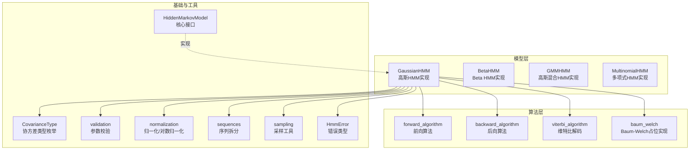
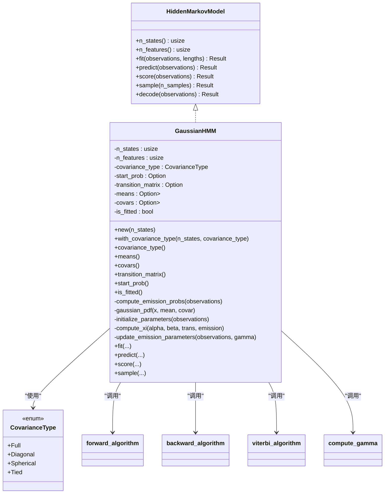
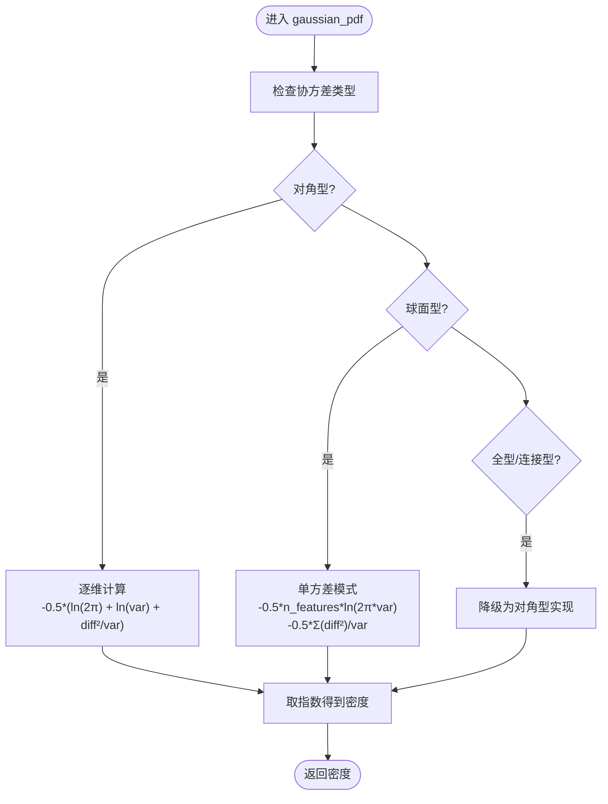
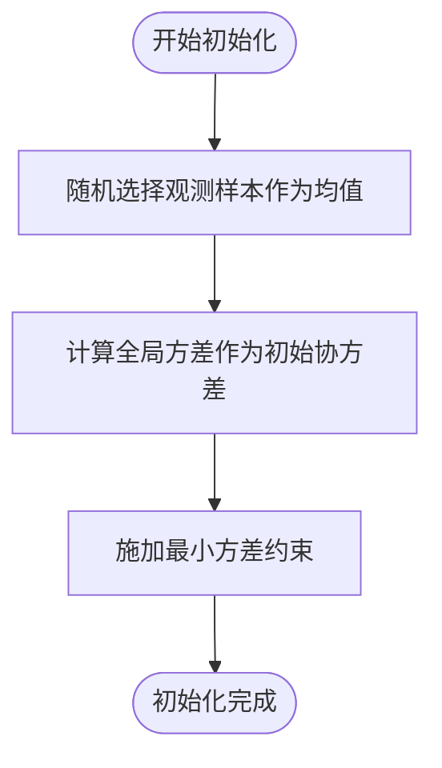
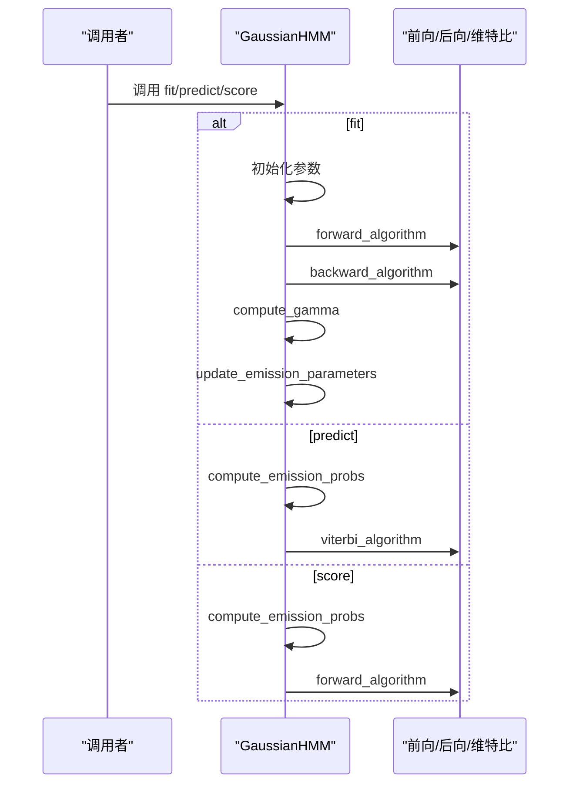
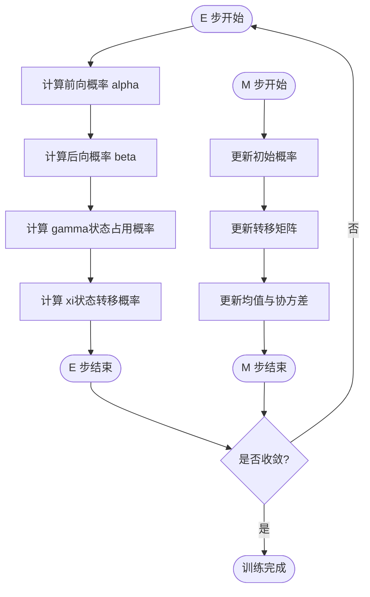
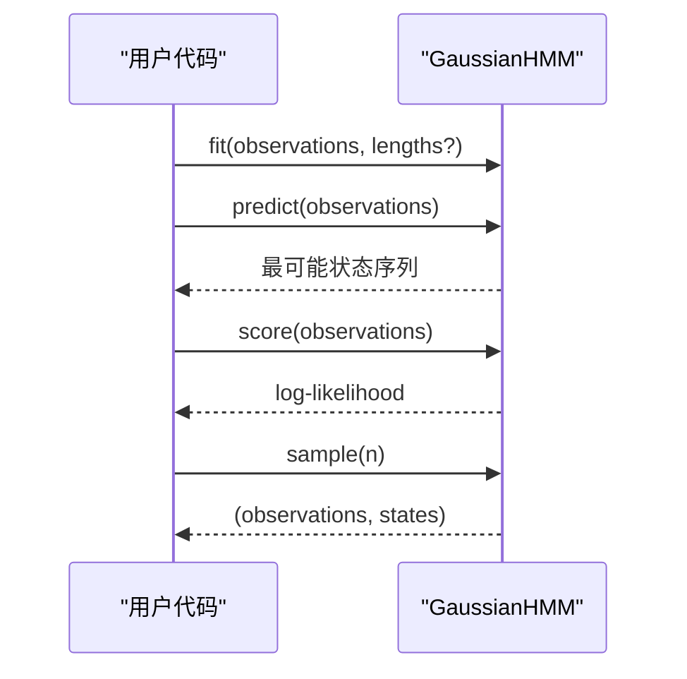
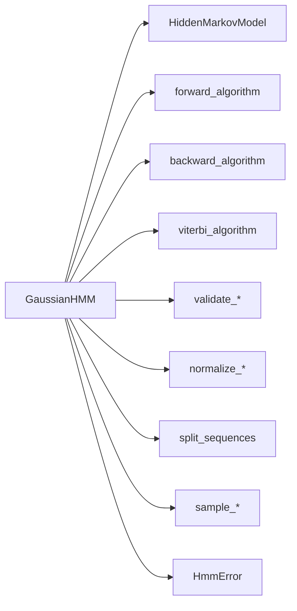

# 高斯 HMM 实现

<cite>
**本文引用的文件**
- [src/lib.rs](file://src/lib.rs)
- [README.md](file://README.md)
- [src/models/gaussian.rs](file://src/models/gaussian.rs)
- [src/base/hmm.rs](file://src/base/hmm.rs)
- [src/base/types.rs](file://src/base/types.rs)
- [src/algorithms/forward.rs](file://src/algorithms/forward.rs)
- [src/algorithms/backward.rs](file://src/algorithms/backward.rs)
- [src/algorithms/viterbi.rs](file://src/algorithms/viterbi.rs)
- [src/algorithms/baum_welch.rs](file://src/algorithms/baum_welch.rs)
- [src/utils/mod.rs](file://src/utils/mod.rs)
- [src/utils/validation.rs](file://src/utils/validation.rs)
- [src/utils/normalization.rs](file://src/utils/normalization.rs)
- [src/utils/sequences.rs](file://src/utils/sequences.rs)
- [src/utils/sampling.rs](file://src/utils/sampling.rs)
- [src/errors.rs](file://src/errors.rs)
- [examples/beta_hmm_example.rs](file://examples/beta_hmm_example.rs)
</cite>

## 目录
1. [简介](#简介)
2. [项目结构](#项目结构)
3. [核心组件](#核心组件)
4. [架构总览](#架构总览)
5. [详细组件分析](#详细组件分析)
6. [依赖关系分析](#依赖关系分析)
7. [性能考量](#性能考量)
8. [故障排查指南](#故障排查指南)
9. [结论](#结论)
10. [附录：使用示例与最佳实践](#附录使用示例与最佳实践)

## 简介
本文件系统性解析高斯隐马尔可夫模型（Gaussian HMM）在该 Rust 库中的实现，覆盖以下主题：
- 协方差类型的处理策略（对角型、球面型、全型、连接型）
- 参数初始化方法（K-means 类似的初始化思路与参数估计流程）
- 发射概率计算的数学原理与实现细节（高斯概率密度函数）
- Baum-Welch 算法在高斯 HMM 中的具体实现（E 步与 M 步统计量累积）
- 状态转移概率与初始状态概率的更新机制
- 完整的训练、预测与评分使用示例
- 性能优化建议与数值稳定性考虑

## 项目结构
该项目采用模块化组织，按功能域划分：
- models：模型实现（高斯、Beta、GMM、多项式等）
- algorithms：算法实现（前向、后向、维特比、Baum-Welch）
- base：通用接口与类型定义
- utils：验证、归一化、序列拆分、采样等工具
- errors：统一错误类型
- examples：示例程序

**图表来源**
- [src/models/gaussian.rs](file://src/models/gaussian.rs#L1-L681)
- [src/algorithms/forward.rs](file://src/algorithms/forward.rs#L1-L129)
- [src/algorithms/backward.rs](file://src/algorithms/backward.rs#L1-L90)
- [src/algorithms/viterbi.rs](file://src/algorithms/viterbi.rs#L1-L118)
- [src/algorithms/baum_welch.rs](file://src/algorithms/baum_welch.rs#L1-L75)
- [src/base/hmm.rs](file://src/base/hmm.rs#L1-L62)
- [src/base/types.rs](file://src/base/types.rs#L1-L61)
- [src/utils/validation.rs](file://src/utils/validation.rs#L1-L141)
- [src/utils/normalization.rs](file://src/utils/normalization.rs#L1-L102)
- [src/utils/sequences.rs](file://src/utils/sequences.rs#L1-L153)
- [src/utils/sampling.rs](file://src/utils/sampling.rs#L1-L130)
- [src/errors.rs](file://src/errors.rs#L1-L105)

**章节来源**
- [src/lib.rs](file://src/lib.rs#L1-L28)
- [README.md](file://README.md#L1-L303)

## 核心组件
- 高斯 HMM（GaussianHMM）：实现连续观测的高斯发射分布，支持多种协方差类型；提供 fit/predict/score/sample 等标准接口。
- 前向/后向/维特比算法：用于概率计算、解码与评分。
- Baum-Welch（占位）：当前以 E/M 步统计量在高斯 HMM 内部实现，未单独导出独立函数。
- 参数校验与归一化：确保概率向量与转移矩阵合法，提供 log/exp 归一化工具。
- 序列拆分：支持多序列训练时的长度校验与切分。
- 错误类型：统一的错误体系，便于定位问题。

**章节来源**
- [src/models/gaussian.rs](file://src/models/gaussian.rs#L1-L681)
- [src/base/hmm.rs](file://src/base/hmm.rs#L1-L62)
- [src/algorithms/forward.rs](file://src/algorithms/forward.rs#L1-L129)
- [src/algorithms/backward.rs](file://src/algorithms/backward.rs#L1-L90)
- [src/algorithms/viterbi.rs](file://src/algorithms/viterbi.rs#L1-L118)
- [src/algorithms/baum_welch.rs](file://src/algorithms/baum_welch.rs#L1-L75)
- [src/utils/validation.rs](file://src/utils/validation.rs#L1-L141)
- [src/utils/normalization.rs](file://src/utils/normalization.rs#L1-L102)
- [src/utils/sequences.rs](file://src/utils/sequences.rs#L1-L153)
- [src/errors.rs](file://src/errors.rs#L1-L105)

## 架构总览
下图展示了高斯 HMM 的核心类与算法交互关系：

**图表来源**
- [src/base/hmm.rs](file://src/base/hmm.rs#L1-L62)
- [src/models/gaussian.rs](file://src/models/gaussian.rs#L1-L681)
- [src/base/types.rs](file://src/base/types.rs#L1-L61)
- [src/algorithms/forward.rs](file://src/algorithms/forward.rs#L1-L129)
- [src/algorithms/backward.rs](file://src/algorithms/backward.rs#L1-L90)
- [src/algorithms/viterbi.rs](file://src/algorithms/viterbi.rs#L1-L118)
- [src/algorithms/baum_welch.rs](file://src/algorithms/baum_welch.rs#L1-L75)

## 详细组件分析

### 协方差类型与实现策略
- 对角型（Diagonal）：每个特征维度独立方差，协方差矩阵为对角。实现中逐维计算高斯密度，避免矩阵运算，数值稳定且高效。
- 球面型（Spherical）：所有维度共享单一方差，进一步简化协方差矩阵。实现中将方差视为标量，计算更简单。
- 全型（Full）与连接型（Tied）：当前实现简化为对角型处理，完整矩阵版本需要矩阵求逆与行列式计算，属于扩展点。
- 更新策略：在 M 步中，均值与协方差通过 gamma 权重的样本矩进行更新，保证正定性与稳定性。

**图表来源**
- [src/models/gaussian.rs](file://src/models/gaussian.rs#L147-L194)

**章节来源**
- [src/models/gaussian.rs](file://src/models/gaussian.rs#L147-L194)
- [src/base/types.rs](file://src/base/types.rs#L17-L29)

### 参数初始化方法
- 初始化思路：随机从观测数据中选取样本作为各状态的初始均值；基于全局观测的方差初始化协方差（对角型），并设置最小方差以保证数值稳定。
- 初始概率与转移矩阵：若未显式设置，自动初始化为均匀分布；随后进行合法性校验。
- 初始化后进入 Baum-Welch 训练流程。

**图表来源**
- [src/models/gaussian.rs](file://src/models/gaussian.rs#L196-L222)

**章节来源**
- [src/models/gaussian.rs](file://src/models/gaussian.rs#L196-L222)
- [src/utils/validation.rs](file://src/utils/validation.rs#L1-L141)

### 发射概率计算与高斯 PDF
- 发射概率矩阵：对每个时间步与每个状态，计算观测向量的高斯密度，形成 (n_samples, n_states) 的发射概率矩阵。
- 数值稳定性：对零概率或极小值进行下界截断，避免 log(0) 或溢出。
- 多序列支持：通过序列拆分工具将拼接后的观测按长度切分为独立序列，分别计算发射概率。

**图表来源**
- [src/models/gaussian.rs](file://src/models/gaussian.rs#L328-L612)
- [src/algorithms/forward.rs](file://src/algorithms/forward.rs#L1-L129)
- [src/algorithms/backward.rs](file://src/algorithms/backward.rs#L1-L90)
- [src/algorithms/viterbi.rs](file://src/algorithms/viterbi.rs#L1-L118)

**章节来源**
- [src/models/gaussian.rs](file://src/models/gaussian.rs#L102-L134)
- [src/utils/sequences.rs](file://src/utils/sequences.rs#L43-L70)

### Baum-Welch 算法在高斯 HMM 中的实现
- E 步：计算前向概率 alpha、后向概率 beta，进而得到状态占用概率 gamma 与状态转移概率 xi。
- M 步：更新初始概率、转移矩阵与发射参数（均值与协方差）。
- 收敛判断：以对数似然的变化量作为停止准则。
- 多序列处理：按序列边界累积统计量，避免跨序列转移。

**图表来源**
- [src/models/gaussian.rs](file://src/models/gaussian.rs#L383-L491)
- [src/algorithms/forward.rs](file://src/algorithms/forward.rs#L20-L47)
- [src/algorithms/backward.rs](file://src/algorithms/backward.rs#L19-L45)
- [src/algorithms/baum_welch.rs](file://src/algorithms/baum_welch.rs#L25-L44)

**章节来源**
- [src/models/gaussian.rs](file://src/models/gaussian.rs#L224-L326)
- [src/algorithms/baum_welch.rs](file://src/algorithms/baum_welch.rs#L1-L75)

### 状态转移概率与初始状态概率的更新机制
- 初始概率：由各序列首步的 gamma 累加得到，再按总和归一化。
- 转移矩阵：对每条序列的 xi 在时间步上累加，按行归一化得到转移概率。
- 参数更新：均值与协方差通过 gamma 权重的样本均值与方差更新，保证正定性与数值稳定。

**章节来源**
- [src/models/gaussian.rs](file://src/models/gaussian.rs#L461-L487)

### 使用示例（训练、预测、评分）
- 训练：创建 GaussianHMM，调用 fit 完成参数估计。
- 预测：调用 predict 获取最可能的状态序列。
- 评分：调用 score 返回对数似然。
- 采样：调用 sample 生成观测与状态序列。

**图表来源**
- [src/base/hmm.rs](file://src/base/hmm.rs#L14-L53)
- [README.md](file://README.md#L53-L87)

**章节来源**
- [README.md](file://README.md#L53-L87)
- [src/models/gaussian.rs](file://src/models/gaussian.rs#L493-L612)

## 依赖关系分析
- 模块耦合：GaussianHMM 依赖算法模块（前向/后向/维特比）、工具模块（校验/归一化/序列拆分/采样）与错误类型。
- 接口契约：所有模型实现必须满足 HiddenMarkovModel trait，确保统一的训练/预测/评分/采样接口。
- 外部依赖：ndarray、rand、rand_distr、thiserror 等。

**图表来源**
- [src/models/gaussian.rs](file://src/models/gaussian.rs#L1-L681)
- [src/base/hmm.rs](file://src/base/hmm.rs#L1-L62)
- [src/utils/validation.rs](file://src/utils/validation.rs#L1-L141)
- [src/utils/normalization.rs](file://src/utils/normalization.rs#L1-L102)
- [src/utils/sequences.rs](file://src/utils/sequences.rs#L1-L153)
- [src/utils/sampling.rs](file://src/utils/sampling.rs#L1-L130)
- [src/errors.rs](file://src/errors.rs#L1-L105)

**章节来源**
- [src/lib.rs](file://src/lib.rs#L19-L28)
- [src/base/hmm.rs](file://src/base/hmm.rs#L1-L62)

## 性能考量
- 数据结构：使用 ndarray 进行向量化操作，减少内存分配与循环开销。
- 数值稳定性：log-space 归一化与对数概率运算，避免概率下溢；协方差添加最小值以保持正定。
- 算法复杂度：前向/后向/维特比均为 O(T·N²)，其中 T 为序列长度，N 为状态数；Baum-Welch 迭代次数通常较少。
- 扩展建议：全型协方差需矩阵运算，可引入矩阵分解与条件数控制；多序列并行训练可进一步提升吞吐。

[本节为通用性能讨论，不直接分析具体文件]

## 故障排查指南
- 模型未拟合：在 predict/score/sample 前必须先 fit，否则抛出模型未拟合错误。
- 维度不匹配：观测特征数与模型 n_features 不一致会触发维度不匹配错误。
- 概率非法：初始概率或转移矩阵不合法（非负、和为 1）将报错。
- 收敛失败：若达到最大迭代仍未收敛，可能需要调整初始化或协方差类型。

**章节来源**
- [src/models/gaussian.rs](file://src/models/gaussian.rs#L493-L612)
- [src/utils/validation.rs](file://src/utils/validation.rs#L6-L74)
- [src/errors.rs](file://src/errors.rs#L10-L34)

## 结论
该实现以清晰的模块化架构提供了高斯 HMM 的核心能力：多协方差类型支持、稳定的参数估计流程、完善的训练/预测/评分/采样接口。通过对角型与球面型协方差在保证效率的同时兼顾了实用性；全型与连接型协方差为后续扩展预留空间。配合 log-space 计算与严格的参数校验，整体具备良好的数值稳定性与工程可用性。

[本节为总结性内容，不直接分析具体文件]

## 附录：使用示例与最佳实践
- 快速入门示例见 README 的高斯 HMM 示例段落，涵盖训练、预测、评分与采样。
- 多序列训练：通过 lengths 参数指定各序列长度，内部自动拆分并按序列边界累积统计量。
- 自定义初始化：可在 fit 前设置初始参数（如初始概率、转移矩阵），以引导收敛方向。
- 协方差类型选择：默认对角型已覆盖大多数场景；若特征间相关性强可尝试球面型；全型/连接型需自行扩展实现。

**章节来源**
- [README.md](file://README.md#L53-L87)
- [README.md](file://README.md#L232-L266)
- [src/models/gaussian.rs](file://src/models/gaussian.rs#L357-L382)