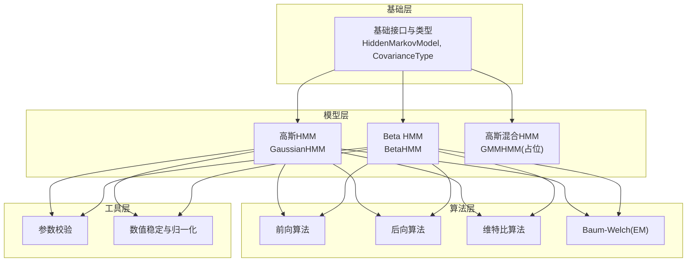
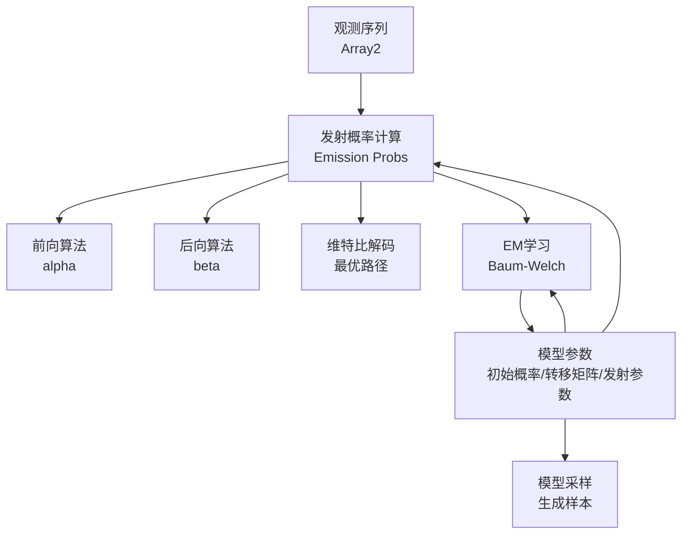
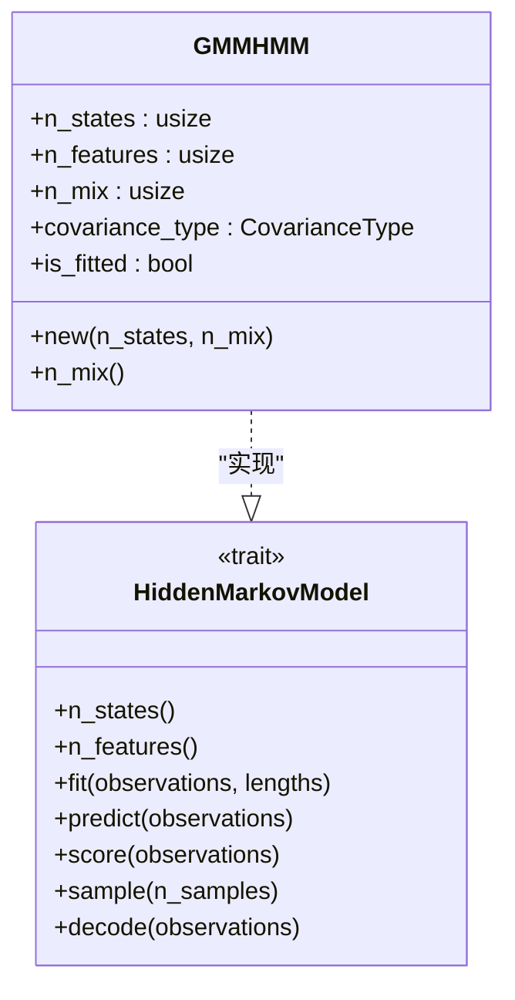
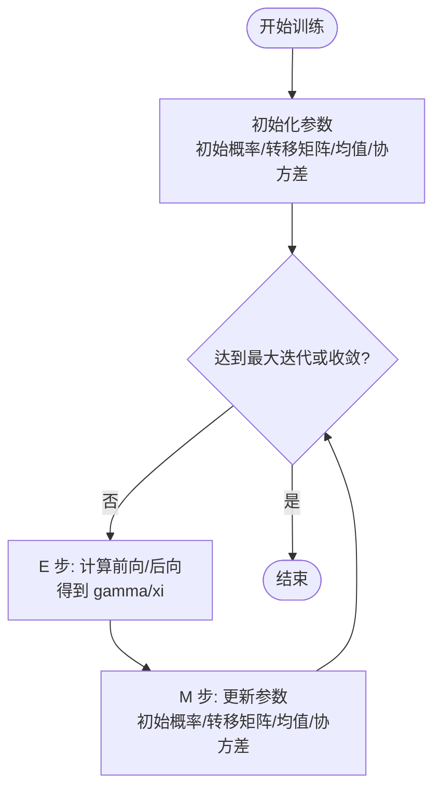
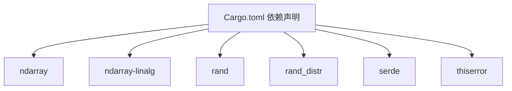

# 高斯混合模型 HMM 实现

<cite>
**本文档引用的文件**
- [README.md](file://README.md)
- [lib.rs](file://src/lib.rs)
- [gmm.rs](file://src/models/gmm.rs)
- [gaussian.rs](file://src/models/gaussian.rs)
- [hmm.rs](file://src/base/hmm.rs)
- [types.rs](file://src/base/types.rs)
- [forward.rs](file://src/algorithms/forward.rs)
- [backward.rs](file://src/algorithms/backward.rs)
- [baum_welch.rs](file://src/algorithms/baum_welch.rs)
- [validation.rs](file://src/utils/validation.rs)
- [normalization.rs](file://src/utils/normalization.rs)
- [integration_tests.rs](file://tests/integration_tests.rs)
- [Cargo.toml](file://Cargo.toml)
</cite>

## 目录
1. [引言](#引言)
2. [项目结构](#项目结构)
3. [核心组件](#核心组件)
4. [架构总览](#架构总览)
5. [详细组件分析](#详细组件分析)
6. [依赖关系分析](#依赖关系分析)
7. [性能考虑](#性能考虑)
8. [故障排除指南](#故障排除指南)
9. [结论](#结论)
10. [附录](#附录)

## 引言
本项目为 Rust 实现的隐马尔可夫模型（HMM）库，支持多种发射分布类型，包括高斯 HMM、Beta HMM、以及计划中的高斯混合模型 HMM（GMM-HMM）。GMM-HMM 将高斯混合模型作为发射分布，能够更好地建模复杂的多峰连续分布，相比单一高斯 HMM 具有更强的表达能力。本文档围绕 GMM-HMM 的理论基础、实现现状、参数估计流程、复杂度与性能、以及可视化与诊断方法进行系统化阐述。

## 项目结构
项目采用模块化组织，按功能域划分：基础接口、模型实现、算法实现、工具函数与验证、错误处理等。核心模块如下：
- 基础接口与类型：定义 HMM 核心 trait 与通用类型别名、协方差类型枚举
- 模型实现：高斯 HMM、Beta HMM、GMM-HMM（占位实现）
- 算法实现：前向/后向/维特比/ Baum-Welch（EM）等
- 工具与验证：观测维度校验、概率向量/转移矩阵校验、归一化等
- 示例与测试：集成测试覆盖高斯 HMM 的训练、预测、评分与多序列场景

图表来源
- [lib.rs](file://src/lib.rs#L19-L28)
- [hmm.rs](file://src/base/hmm.rs#L6-L61)
- [types.rs](file://src/base/types.rs#L17-L29)
- [gaussian.rs](file://src/models/gaussian.rs#L14-L32)
- [gmm.rs](file://src/models/gmm.rs#L11-L19)
- [forward.rs](file://src/algorithms/forward.rs#L6-L47)
- [backward.rs](file://src/algorithms/backward.rs#L6-L45)
- [baum_welch.rs](file://src/algorithms/baum_welch.rs#L8-L44)
- [validation.rs](file://src/utils/validation.rs#L58-L74)
- [normalization.rs](file://src/utils/normalization.rs#L5-L35)

章节来源
- [lib.rs](file://src/lib.rs#L19-L28)
- [README.md](file://README.md#L1-L303)

## 核心组件
- HMM 核心 trait：定义 fit/predict/score/sample/deocde 等统一接口，确保各模型实现一致性
- 协方差类型：支持 Full/Diagonal/Spherical/Tied 四种协方差类型，用于高斯 HMM 的不同约束
- 高斯 HMM：完整实现了发射密度计算、参数初始化、Baum-Welch（EM）迭代、前向/后向/维特比算法
- GMM-HMM：当前为占位实现，预留 n_mix 参数，训练/预测/评分/采样均为 TODO，尚未完成

章节来源
- [hmm.rs](file://src/base/hmm.rs#L6-L61)
- [types.rs](file://src/base/types.rs#L17-L29)
- [gaussian.rs](file://src/models/gaussian.rs#L14-L32)
- [gmm.rs](file://src/models/gmm.rs#L11-L19)

## 架构总览
下图展示了 GMM-HMM 的整体架构与数据流：输入观测序列经由模型参数（初始概率、转移矩阵、发射分布参数）计算发射概率，再通过前向/后向/维特比等算法完成推理与学习；GMM-HMM 的发射分布由混合权重、均值向量、协方差矩阵共同决定。

图表来源
- [gaussian.rs](file://src/models/gaussian.rs#L337-L491)
- [forward.rs](file://src/algorithms/forward.rs#L20-L47)
- [backward.rs](file://src/algorithms/backward.rs#L19-L45)
- [hmm.rs](file://src/base/hmm.rs#L14-L53)

## 详细组件分析

### GMM-HMM 组件分析
- 设计目标：以高斯混合模型作为每个隐藏状态的发射分布，允许对多峰连续分布进行建模
- 当前实现状态：仅保留结构体与基本接口，训练、预测、评分、采样均为占位实现，尚未完成
- 关键参数：
  - n_states：隐藏状态数
  - n_mix：每状态混合成分数
  - n_features：特征维度
  - covariance_type：协方差类型（继承自高斯 HMM 的枚举）

图表来源
- [gmm.rs](file://src/models/gmm.rs#L11-L42)
- [hmm.rs](file://src/base/hmm.rs#L6-L61)
- [types.rs](file://src/base/types.rs#L17-L29)

章节来源
- [gmm.rs](file://src/models/gmm.rs#L11-L108)

### 高斯 HMM：理论基础与实现要点
- 发射分布：高斯密度，支持多种协方差类型（对角、球面、满秩、绑定），通过协方差类型控制复杂度与稳定性
- 参数初始化：随机选择观测点作为均值初值，基于全数据方差初始化协方差，保证数值稳定
- E-M 学习（Baum-Welch）：
  - E 步：计算前向/后向概率，得到状态占用概率 gamma 与状态转移概率 xi
  - M 步：更新初始概率、转移矩阵、发射参数（均值与协方差）
- 推理算法：前向算法用于计算观测序列概率；维特比算法用于最可能状态序列解码

图表来源
- [gaussian.rs](file://src/models/gaussian.rs#L383-L487)
- [forward.rs](file://src/algorithms/forward.rs#L20-L47)
- [backward.rs](file://src/algorithms/backward.rs#L19-L45)
- [baum_welch.rs](file://src/algorithms/baum_welch.rs#L25-L44)

章节来源
- [gaussian.rs](file://src/models/gaussian.rs#L196-L326)
- [gaussian.rs](file://src/models/gaussian.rs#L337-L491)
- [forward.rs](file://src/algorithms/forward.rs#L20-L47)
- [backward.rs](file://src/algorithms/backward.rs#L19-L45)
- [baum_welch.rs](file://src/algorithms/baum_welch.rs#L25-L75)

### GMM-HMM 的期望最大化（EM）应用
- E 步（GMM-HMM）：由于发射分布为混合密度，需要对每个观测在每个状态下的混合成分计算责任（posterior），并据此计算 gamma 与 xi 的加权版本
- M 步（GMM-HMM）：联合估计混合权重、均值向量与协方差矩阵，通常采用软聚类思想更新各混合参数
- 收敛判断：基于对数似然增量或参数变化幅度

注意：当前仓库中 GMM-HMM 的 E/M 步尚未实现，以上为理论流程说明。

### 混合权重、均值与协方差的联合估计
- 混合权重：表示每个状态内各混合成分的比重，通过 M 步迭代更新，满足非负且和为一
- 均值向量：按混合责任加权观测值进行更新
- 协方差矩阵：按混合责任加权残差平方进行更新，保持正定性与数值稳定

注意：上述流程为标准 GMM 参数估计方法，当前仓库未在 GMM-HMM 中实现。

### 与单一高斯 HMM 的复杂度与性能对比
- 复杂度：GMM-HMM 的发射密度计算与参数更新随混合成分数 n_mix 增长而线性增长；E 步需对每个时间步与每个状态的每个混合成分计算责任，M 步更新也相应扩展
- 性能：GMM-HMM 在多峰分布建模上更优，但计算开销更大；可通过合理设置 n_mix 与协方差类型平衡表达能力与效率

### 实现示例与使用指引
- 高斯 HMM 使用示例：见 README 快速开始部分，展示训练、预测、评分与采样的完整流程
- GMM-HMM 使用示例：当前占位实现，接口已预留 n_states 与 n_mix 参数，实际训练/预测/评分/采样需等待实现完成

章节来源
- [README.md](file://README.md#L53-L87)
- [gmm.rs](file://src/models/gmm.rs#L21-L42)

### 性能基准测试建议
- 数据规模：从中小规模（如百级样本）起步，逐步扩大到千级样本
- 混合成分数：n_mix ∈ {2, 4, 8}，观察性能与拟合质量变化
- 协方差类型：对比 Diagonal/Spherical/Full/Tied 的运行时与内存占用
- 多序列：评估序列分割与累积统计的并行化潜力
- 数值稳定性：记录 log-space 计算与最小方差约束的效果

说明：当前仓库未包含基准测试脚本，以上为建议方案。

### 可视化与诊断方法
- 参数可视化：绘制各状态的混合权重条形图、均值散点图与协方差椭圆
- 拟合诊断：绘制对数似然随迭代变化曲线，检查收敛性
- 残差分析：计算观测与重构之间的残差分布
- 聚类质量：若将 GMM-HMM 视作无监督聚类，可用轮廓系数或互信息评估

说明：当前仓库未包含可视化模块，以上为通用实践建议。

## 依赖关系分析
- ndarray/ndarray-linalg：高性能数组与线性代数运算
- rand/rand_distr：随机数与概率分布采样
- serde：序列化支持（可选）
- thiserror：错误处理

图表来源
- [Cargo.toml](file://Cargo.toml#L13-L19)

章节来源
- [Cargo.toml](file://Cargo.toml#L1-L23)

## 性能考虑
- 数值稳定性：使用 log-space 计算与归一化，避免下溢；对协方差添加最小值约束
- 向量化与内存：优先使用 ndarray 的向量化操作，减少临时对象分配
- 迭代收敛：设置合理的最大迭代次数与收敛阈值，避免过拟合
- 并行化：多序列训练可考虑并行处理，但需注意跨序列边界不合并统计量

## 故障排除指南
- 观测维度不匹配：当观测列数与模型 n_features 不一致时会报错
- 模型未拟合：在调用 predict/score/sample 前必须先 fit
- 参数非法：初始概率/转移矩阵需满足概率约束，否则校验失败
- 空观测：观测数组为空时直接返回错误

章节来源
- [validation.rs](file://src/utils/validation.rs#L58-L74)
- [gaussian.rs](file://src/models/gaussian.rs#L53-L93)
- [integration_tests.rs](file://tests/integration_tests.rs#L88-L102)

## 结论
本仓库提供了高斯 HMM 的完整实现与丰富的工具函数，为 GMM-HMM 的后续实现奠定了坚实基础。GMM-HMM 通过引入混合成分显著增强了发射分布的表达能力，适合建模多峰连续数据；但同时带来更高的计算成本。建议在实际应用中根据数据特性与资源限制合理选择 n_mix 与协方差类型，并结合日志似然与可视化手段进行模型诊断与优化。

## 附录
- API 概览与示例：参见 README 的 API 概览与快速开始章节
- 集成测试：覆盖高斯 HMM 的训练、预测、评分与多序列场景

章节来源
- [README.md](file://README.md#L141-L194)
- [integration_tests.rs](file://tests/integration_tests.rs#L10-L27)