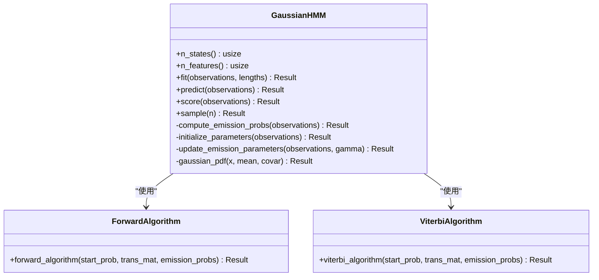

# 模型开发

<cite>
**本文引用的文件**
- [src/lib.rs](file://src/lib.rs)
- [src/base/mod.rs](file://src/base/mod.rs)
- [src/base/hmm.rs](file://src/base/hmm.rs)
- [src/base/types.rs](file://src/base/types.rs)
- [src/models/mod.rs](file://src/models/mod.rs)
- [src/models/gaussian.rs](file://src/models/gaussian.rs)
- [src/models/beta.rs](file://src/models/beta.rs)
- [src/models/multinomial.rs](file://src/models/multinomial.rs)
- [src/algorithms/mod.rs](file://src/algorithms/mod.rs)
- [src/algorithms/forward.rs](file://src/algorithms/forward.rs)
- [src/algorithms/viterbi.rs](file://src/algorithms/viterbi.rs)
- [src/utils/validation.rs](file://src/utils/validation.rs)
- [src/utils/normalization.rs](file://src/utils/normalization.rs)
- [examples/beta_hmm_example.rs](file://examples/beta_hmm_example.rs)
- [Cargo.toml](file://Cargo.toml)
</cite>

## 目录
1. [简介](#简介)
2. [项目结构](#项目结构)
3. [核心组件](#核心组件)
4. [架构总览](#架构总览)
5. [详细组件分析](#详细组件分析)
6. [依赖关系分析](#依赖关系分析)
7. [性能考虑](#性能考虑)
8. [故障排查指南](#故障排查指南)
9. [结论](#结论)
10. [附录](#附录)

## 简介
本指南面向希望在 rhmm 库中开发“新模型”的开发者，系统讲解 HiddenMarkovModel trait 的设计原理与实现要求，提供从基础 trait 实现到高级功能集成的完整步骤，并覆盖不同发射分布类型的实现模式（如高斯分布、贝塔分布等）。同时给出参数初始化最佳实践、训练与预测方法的实现要点、模型验证与测试建议、性能优化与内存管理策略，以及真实实现案例与参考路径。

## 项目结构
rhmm 采用模块化组织：核心 trait 定义于 base 模块，具体模型实现在 models 子模块，通用算法封装在 algorithms 子模块，工具函数位于 utils 子模块；examples 提供使用示例。

图表来源
- [src/lib.rs](file://src/lib.rs#L19-L28)
- [src/base/mod.rs](file://src/base/mod.rs#L1-L8)
- [src/models/mod.rs](file://src/models/mod.rs#L1-L12)
- [src/algorithms/mod.rs](file://src/algorithms/mod.rs#L1-L12)

章节来源
- [src/lib.rs](file://src/lib.rs#L1-L28)
- [src/base/mod.rs](file://src/base/mod.rs#L1-L8)
- [src/models/mod.rs](file://src/models/mod.rs#L1-L12)
- [src/algorithms/mod.rs](file://src/algorithms/mod.rs#L1-L12)

## 核心组件
- HiddenMarkovModel trait：定义所有 HMM 模型必须实现的标准接口，包括状态数与特征数查询、拟合、预测、评分、采样与解码。
- 类型别名与枚举：统一状态转移矩阵、初始概率向量、观测序列、状态序列等类型；定义高斯模型协方差类型枚举。
- 算法库：前向算法、Viterbi 算法、Baum-Welch 辅助函数等。
- 工具库：参数校验（概率向量、转移矩阵、观测维度）、数值稳定归一化、日志空间转换等。

章节来源
- [src/base/hmm.rs](file://src/base/hmm.rs#L7-L61)
- [src/base/types.rs](file://src/base/types.rs#L5-L29)
- [src/algorithms/mod.rs](file://src/algorithms/mod.rs#L1-L12)
- [src/utils/validation.rs](file://src/utils/validation.rs#L6-L74)
- [src/utils/normalization.rs](file://src/utils/normalization.rs#L5-L35)

## 架构总览
下图展示了模型层与算法层的交互关系，以及训练流程中的 E 步与 M 步统计累积。

图表来源
- [src/models/gaussian.rs](file://src/models/gaussian.rs#L328-L612)
- [src/models/beta.rs](file://src/models/beta.rs#L384-L669)
- [src/models/multinomial.rs](file://src/models/multinomial.rs#L35-L94)
- [src/algorithms/forward.rs](file://src/algorithms/forward.rs#L20-L47)
- [src/algorithms/viterbi.rs](file://src/algorithms/viterbi.rs#L20-L74)
- [src/utils/validation.rs](file://src/utils/validation.rs#L6-L74)

## 详细组件分析

### HiddenMarkovModel trait 设计与实现要求
- 必需方法签名与行为规范
  - n_states(): 返回隐藏状态数
  - n_features(): 返回观测特征维数
  - fit(&mut self, observations, lengths): 训练模型；支持多序列拼接长度 lengths
  - predict(&self, observations): 使用 Viterbi 解码得到最可能状态序列
  - score(&self, observations): 计算对数似然
  - sample(&self, n_samples): 从模型生成观测与状态序列
  - decode(&self, observations): 预留别名，返回 (log_prob, states)
- 行为约束
  - 所有方法在未拟合时应返回明确错误
  - 维度不匹配时返回错误
  - 参数合法性（概率向量和转移矩阵）需通过校验工具验证
  - 训练收敛阈值与迭代次数由具体模型自行设定

章节来源
- [src/base/hmm.rs](file://src/base/hmm.rs#L7-L61)

### 高斯 HMM（GaussianHMM）
- 关键点
  - 协方差类型：全/对角/球面/绑定；对角与球面已实现，全/绑定可按需扩展
  - 发射概率计算：基于对数密度避免数值下溢；对角协方差逐维计算
  - 初始化：随机选择观测作为均值初值，用数据方差作为协方差初值
  - 训练：Baum-Welch 迭代，E 步计算前向/后向与 gamma/xi，M 步更新初始概率、转移矩阵、均值与协方差
  - 预测与评分：调用前向/后向与 Viterbi 算法
  - 采样：按初始与转移采样状态，按状态对应的正态分布采样观测
- 参数初始化最佳实践
  - 初始均值：从观测集中随机选取样本
  - 初始协方差：使用全局方差并设置最小下界
  - 初始概率与转移矩阵：均匀分布并随后归一化
- 训练与预测实现要点
  - 多序列处理：通过 lengths 分割序列，独立处理每条序列，避免跨边界累加
  - 收敛判断：以对数似然增量作为停止准则
  - 数值稳定性：log 空间与稳定归一化
- 参考路径
  - 结构体与构造函数：[src/models/gaussian.rs](file://src/models/gaussian.rs#L14-L70)
  - 发射概率与 PDF：[src/models/gaussian.rs](file://src/models/gaussian.rs#L111-L194)
  - 参数初始化：[src/models/gaussian.rs](file://src/models/gaussian.rs#L197-L222)
  - E/M 步统计与更新：[src/models/gaussian.rs](file://src/models/gaussian.rs#L224-L325)
  - fit/predict/score/sample 主流程：[src/models/gaussian.rs](file://src/models/gaussian.rs#L337-L612)

图表来源
- [src/models/gaussian.rs](file://src/models/gaussian.rs#L14-L70)
- [src/models/gaussian.rs](file://src/models/gaussian.rs#L111-L194)
- [src/models/gaussian.rs](file://src/models/gaussian.rs#L197-L325)
- [src/models/gaussian.rs](file://src/models/gaussian.rs#L337-L612)
- [src/algorithms/forward.rs](file://src/algorithms/forward.rs#L20-L47)
- [src/algorithms/viterbi.rs](file://src/algorithms/viterbi.rs#L20-L74)

章节来源
- [src/models/gaussian.rs](file://src/models/gaussian.rs#L14-L612)
- [src/algorithms/forward.rs](file://src/algorithms/forward.rs#L20-L47)
- [src/algorithms/viterbi.rs](file://src/algorithms/viterbi.rs#L20-L74)

### 贝塔 HMM（BetaHMM）
- 关键点
  - 观测范围：(0,1)，适合比例/概率/转化率等数据
  - 发射概率：对每个特征使用对数 PDF 并求和，避免数值下溢
  - 参数：每状态每特征一对形状参数 α/β，通过矩估计或加权矩估计更新
  - 初始化：按状态分配观测，计算各状态的均值与方差，再转回 α/β
  - 训练：Baum-Welch，E 步 gamma/xi，M 步更新 α/β
  - 采样：按状态从 Beta 分布采样
- 参数初始化最佳实践
  - 若某状态下无观测，回退到整体数据的均值/方差
  - 对 α/β 设置最小值，保证数值稳定
- 参考路径
  - 结构体与构造函数：[src/models/beta.rs](file://src/models/beta.rs#L24-L64)
  - 发射概率与 PDF：[src/models/beta.rs](file://src/models/beta.rs#L126-L197)
  - 参数初始化与矩估计：[src/models/beta.rs](file://src/models/beta.rs#L227-L286)
  - E/M 步统计与更新：[src/models/beta.rs](file://src/models/beta.rs#L288-L381)
  - fit/predict/score/sample 主流程：[src/models/beta.rs](file://src/models/beta.rs#L393-L669)

图表来源
- [src/models/beta.rs](file://src/models/beta.rs#L393-L547)

章节来源
- [src/models/beta.rs](file://src/models/beta.rs#L24-L669)

### 多项式 HMM（MultinomialHMM）
- 当前状态
  - 接口已实现，但核心训练、预测、评分、采样为占位实现（TODO）
- 开发建议
  - 发射概率：每状态为离散分布（多项式），参数为类别概率向量
  - 训练：使用最大似然估计或 EM（若引入隐变量）
  - 预测：Viterbi 解码
  - 评分：前向算法
  - 采样：按类别概率采样

章节来源
- [src/models/multinomial.rs](file://src/models/multinomial.rs#L12-L94)

### 新模型开发完整步骤模板
- 步骤 1：定义结构体与字段
  - 至少包含 n_states、n_features、拟合标记、初始概率、转移矩阵、发射参数等
  - 参考：[src/models/gaussian.rs](file://src/models/gaussian.rs#L14-L32)、[src/models/beta.rs](file://src/models/beta.rs#L24-L39)
- 步骤 2：实现必需 trait 方法
  - n_states/n_features/fit/predict/score/sample/deocde
  - 参考：[src/base/hmm.rs](file://src/base/hmm.rs#L7-L61)
- 步骤 3：实现发射概率计算
  - 遵循对数空间与数值稳定策略
  - 参考：[src/models/gaussian.rs](file://src/models/gaussian.rs#L111-L194)、[src/models/beta.rs](file://src/models/beta.rs#L126-L197)
- 步骤 4：实现参数初始化
  - 基于经验或矩估计，设置最小下界
  - 参考：[src/models/gaussian.rs](file://src/models/gaussian.rs#L197-L222)、[src/models/beta.rs](file://src/models/beta.rs#L227-L286)
- 步骤 5：实现训练算法（Baum-Welch 或其他）
  - E 步：前向/后向、gamma/xi
  - M 步：更新初始概率、转移矩阵、发射参数
  - 参考：[src/models/gaussian.rs](file://src/models/gaussian.rs#L383-L491)、[src/models/beta.rs](file://src/models/beta.rs#L439-L547)
- 步骤 6：实现预测与评分
  - 预测：Viterbi
  - 评分：前向算法
  - 参考：[src/algorithms/viterbi.rs](file://src/algorithms/viterbi.rs#L20-L74)、[src/algorithms/forward.rs](file://src/algorithms/forward.rs#L20-L69)
- 步骤 7：实现采样
  - 先采状态，再按状态采观测
  - 参考：[src/models/gaussian.rs](file://src/models/gaussian.rs#L546-L611)、[src/models/beta.rs](file://src/models/beta.rs#L601-L668)
- 步骤 8：参数校验与归一化
  - 初始概率与转移矩阵校验
  - 数值稳定与 log/exp 归一化
  - 参考：[src/utils/validation.rs](file://src/utils/validation.rs#L6-L74)、[src/utils/normalization.rs](file://src/utils/normalization.rs#L5-L35)

章节来源
- [src/base/hmm.rs](file://src/base/hmm.rs#L7-L61)
- [src/models/gaussian.rs](file://src/models/gaussian.rs#L111-L612)
- [src/models/beta.rs](file://src/models/beta.rs#L126-L669)
- [src/algorithms/viterbi.rs](file://src/algorithms/viterbi.rs#L20-L74)
- [src/algorithms/forward.rs](file://src/algorithms/forward.rs#L20-L69)
- [src/utils/validation.rs](file://src/utils/validation.rs#L6-L74)
- [src/utils/normalization.rs](file://src/utils/normalization.rs#L5-L35)

### 不同发射分布类型的实现模式
- 高斯分布
  - 使用对数密度与对角/球面协方差，避免直接计算矩阵逆
  - 参考：[src/models/gaussian.rs](file://src/models/gaussian.rs#L147-L194)
- 贝塔分布
  - 观测必须在 (0,1)，使用对数 PDF 并逐特征相加
  - 参考：[src/models/beta.rs](file://src/models/beta.rs#L126-L197)
- 多项式分布
  - 每状态为离散概率分布，参数为各类别概率
  - 参考：[src/models/multinomial.rs](file://src/models/multinomial.rs#L12-L33)

章节来源
- [src/models/gaussian.rs](file://src/models/gaussian.rs#L147-L194)
- [src/models/beta.rs](file://src/models/beta.rs#L126-L197)
- [src/models/multinomial.rs](file://src/models/multinomial.rs#L12-L33)

### 参数初始化最佳实践与约束条件
- 初始概率与转移矩阵
  - 必须非负且行和为 1；通过校验工具验证
  - 参考：[src/utils/validation.rs](file://src/utils/validation.rs#L28-L56)
- 高斯模型协方差
  - 最小方差下界，防止数值不稳定
  - 参考：[src/models/gaussian.rs](file://src/models/gaussian.rs#L214-L219)
- 贝塔模型参数
  - α/β 最小值与有效范围，避免对数 Γ 函数退化
  - 参考：[src/models/beta.rs](file://src/models/beta.rs#L182-L196)
- 观测维度一致性
  - 训练与预测的特征维数必须一致
  - 参考：[src/utils/validation.rs](file://src/utils/validation.rs#L58-L74)

章节来源
- [src/utils/validation.rs](file://src/utils/validation.rs#L28-L74)
- [src/models/gaussian.rs](file://src/models/gaussian.rs#L214-L219)
- [src/models/beta.rs](file://src/models/beta.rs#L182-L196)

### 训练算法与预测方法实现要点
- 训练算法（Baum-Welch）
  - E 步：前向/后向、gamma/xi 统计
  - M 步：更新初始概率、转移矩阵、发射参数
  - 收敛：对数似然增量阈值
  - 参考：[src/models/gaussian.rs](file://src/models/gaussian.rs#L383-L491)、[src/models/beta.rs](file://src/models/beta.rs#L439-L547)
- 预测方法（Viterbi）
  - 在 log 空间进行，避免下溢
  - 参考：[src/algorithms/viterbi.rs](file://src/algorithms/viterbi.rs#L20-L74)
- 评分方法（前向算法）
  - 返回对数似然
  - 参考：[src/algorithms/forward.rs](file://src/algorithms/forward.rs#L20-L69)

章节来源
- [src/models/gaussian.rs](file://src/models/gaussian.rs#L383-L491)
- [src/models/beta.rs](file://src/models/beta.rs#L439-L547)
- [src/algorithms/viterbi.rs](file://src/algorithms/viterbi.rs#L20-L74)
- [src/algorithms/forward.rs](file://src/algorithms/forward.rs#L20-L69)

### 模型验证与测试指导
- 单元测试建议
  - 创建/初始化：检查 n_states、n_features、拟合标记
  - 训练：空观测、维度不匹配、未拟合预测/评分/采样的错误路径
  - 发射概率：PDF 非负、有限
  - 参数：均值/方差/α/β 合理性
- 参考路径
  - 高斯模型测试：[src/models/gaussian.rs](file://src/models/gaussian.rs#L614-L681)
  - 贝塔模型测试：[src/models/beta.rs](file://src/models/beta.rs#L671-L734)
  - 参数校验测试：[src/utils/validation.rs](file://src/utils/validation.rs#L76-L141)

章节来源
- [src/models/gaussian.rs](file://src/models/gaussian.rs#L614-L681)
- [src/models/beta.rs](file://src/models/beta.rs#L671-L734)
- [src/utils/validation.rs](file://src/utils/validation.rs#L76-L141)

### 性能优化与内存管理策略
- 内存复用与零拷贝
  - 将 ArrayView2 转为 owned Array2 仅在必要时（如需要修改）
  - 参考：[src/models/gaussian.rs](file://src/models/gaussian.rs#L407-L408)
- 向量化与广播
  - 使用 ndarray 的广播与轴操作减少显式循环
  - 参考：[src/models/beta.rs](file://src/models/beta.rs#L312-L317)
- 数值稳定
  - 对数空间与 log-sum-exp 归一化
  - 参考：[src/utils/normalization.rs](file://src/utils/normalization.rs#L25-L35)
- 收敛控制
  - 合理设置迭代上限与容忍度，避免过拟合与长运行时间
  - 参考：[src/models/gaussian.rs](file://src/models/gaussian.rs#L384-L386)、[src/models/beta.rs](file://src/models/beta.rs#L440-L442)

章节来源
- [src/models/gaussian.rs](file://src/models/gaussian.rs#L407-L408)
- [src/models/beta.rs](file://src/models/beta.rs#L312-L317)
- [src/utils/normalization.rs](file://src/utils/normalization.rs#L25-L35)
- [src/models/gaussian.rs](file://src/models/gaussian.rs#L384-L386)
- [src/models/beta.rs](file://src/models/beta.rs#L440-L442)

### 实际模型实现案例与参考路径
- 贝塔 HMM 示例
  - 展示了完整的训练、参数查看、预测、评分、采样与新数据预测流程
  - 参考：[examples/beta_hmm_example.rs](file://examples/beta_hmm_example.rs#L15-L266)
- 高斯 HMM 示例
  - 展示了 n_states 构造、fit、predict、score、sample 的基本用法
  - 参考：[src/lib.rs](file://src/lib.rs#L10-L17)

章节来源
- [examples/beta_hmm_example.rs](file://examples/beta_hmm_example.rs#L15-L266)
- [src/lib.rs](file://src/lib.rs#L10-L17)

## 依赖关系分析
- 外部依赖
  - ndarray：数组与线性代数运算
  - rand/rand_distr：随机采样与分布
  - serde：序列化支持（可选）
  - thiserror：错误类型
- 内部模块耦合
  - models 依赖 base（trait 与类型）、algorithms（算法）、utils（校验/归一化）
  - algorithms 与 utils 相互独立，被 models 复用

图表来源
- [Cargo.toml](file://Cargo.toml#L13-L22)
- [src/models/gaussian.rs](file://src/models/gaussian.rs#L3-L9)
- [src/models/beta.rs](file://src/models/beta.rs#L3-L12)
- [src/models/multinomial.rs](file://src/models/multinomial.rs#L3-L6)

章节来源
- [Cargo.toml](file://Cargo.toml#L13-L22)
- [src/models/gaussian.rs](file://src/models/gaussian.rs#L3-L9)
- [src/models/beta.rs](file://src/models/beta.rs#L3-L12)
- [src/models/multinomial.rs](file://src/models/multinomial.rs#L3-L6)

## 性能考虑
- 算法复杂度
  - 前向/后向/评分：O(T·N^2)，T 为序列长度，N 为状态数
  - Viterbi：O(T·N^2)
  - Baum-Welch：每轮 O(T·N^2)，受收敛迭代次数影响
- 内存占用
  - 主要来自 alpha/beta/gamma/xi 等中间变量矩阵
  - 建议按序列处理，避免一次性持有全部序列的中间结果
- 并行化机会
  - 多序列独立处理天然可并行
  - E 步 gamma/xi 计算可向量化（已有广播示例）

## 故障排查指南
- 常见错误与定位
  - 模型未拟合：在 predict/score/sample 前检查 is_fitted
  - 维度不匹配：n_features 与观测列数不符
  - 概率非法：初始概率或转移矩阵未满足非负与和为 1
  - 观测越界：贝塔模型要求观测在 (0,1)
- 定位手段
  - 使用单元测试覆盖错误分支
  - 逐步打印中间变量（alpha/beta/emission/gamma/xi）确认数值稳定性
- 参考路径
  - 错误与校验：[src/utils/validation.rs](file://src/utils/validation.rs#L6-L74)
  - 测试用例：[src/models/gaussian.rs](file://src/models/gaussian.rs#L614-L681)、[src/models/beta.rs](file://src/models/beta.rs#L671-L734)

章节来源
- [src/utils/validation.rs](file://src/utils/validation.rs#L6-L74)
- [src/models/gaussian.rs](file://src/models/gaussian.rs#L614-L681)
- [src/models/beta.rs](file://src/models/beta.rs#L671-L734)

## 结论
通过遵循 HiddenMarkovModel trait 的统一接口、复用 algorithms 与 utils 模块、严格遵守参数校验与数值稳定策略，开发者可以高效地在 rhmm 中实现新的发射分布模型。高斯与贝塔模型提供了完整的实现范式，可作为新模型开发的参考模板。建议优先实现最小可用版本，再逐步完善训练稳定性、收敛控制与性能优化。

## 附录
- re-export 入口
  - [src/lib.rs](file://src/lib.rs#L25-L28)
- 类型别名与枚举
  - [src/base/types.rs](file://src/base/types.rs#L5-L29)
- 算法导出
  - [src/algorithms/mod.rs](file://src/algorithms/mod.rs#L8-L11)