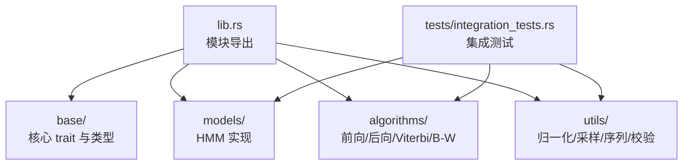
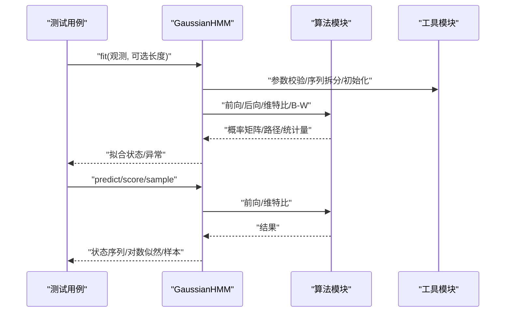
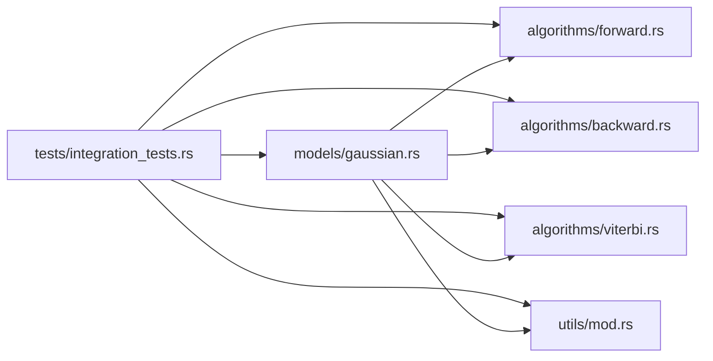

# 测试验证框架

<cite>
**本文引用的文件**
- [Cargo.toml](file://Cargo.toml)
- [README.md](file://README.md)
- [src/lib.rs](file://src/lib.rs)
- [src/base/mod.rs](file://src/base/mod.rs)
- [src/base/hmm.rs](file://src/base/hmm.rs)
- [src/base/types.rs](file://src/base/types.rs)
- [src/models/mod.rs](file://src/models/mod.rs)
- [src/models/gaussian.rs](file://src/models/gaussian.rs)
- [src/algorithms/mod.rs](file://src/algorithms/mod.rs)
- [src/algorithms/forward.rs](file://src/algorithms/forward.rs)
- [src/algorithms/backward.rs](file://src/algorithms/backward.rs)
- [src/algorithms/viterbi.rs](file://src/algorithms/viterbi.rs)
- [src/algorithms/baum_welch.rs](file://src/algorithms/baum_welch.rs)
- [src/utils/mod.rs](file://src/utils/mod.rs)
- [tests/integration_tests.rs](file://tests/integration_tests.rs)
</cite>

## 目录
1. [简介](#简介)
2. [项目结构](#项目结构)
3. [核心组件](#核心组件)
4. [架构总览](#架构总览)
5. [详细组件分析](#详细组件分析)
6. [依赖关系分析](#依赖关系分析)
7. [性能与精度测试](#性能与精度测试)
8. [故障排查指南](#故障排查指南)
9. [结论](#结论)
10. [附录](#附录)

## 简介
本指南围绕 RHMM（Rust 隐马尔可夫模型）项目的测试与验证框架展开，系统阐述单元测试与集成测试的设计原则、测试用例编写方法、模型验证指标与评估方法、数值精度与边界条件测试、回归测试自动化与持续集成配置建议、性能与基准测试方法、测试数据生成与验证工具使用、模型比较与效果评估、以及测试覆盖率与质量保证措施。文档以仓库现有代码为依据，结合实际可落地的实践建议，帮助开发者在不改变现有代码结构的前提下，完善测试体系。

## 项目结构
RHMM 采用模块化组织：核心接口定义于 base 模块，具体模型实现在 models 子模块，算法实现位于 algorithms 子模块，工具函数位于 utils 子模块；顶层 lib.rs 负责模块导出与公共类型重导出；测试集中于 tests 目录。

图表来源
- [src/lib.rs](file://src/lib.rs#L19-L27)
- [src/base/mod.rs](file://src/base/mod.rs#L1-L8)
- [src/models/mod.rs](file://src/models/mod.rs#L1-L12)
- [src/algorithms/mod.rs](file://src/algorithms/mod.rs#L1-L12)
- [src/utils/mod.rs](file://src/utils/mod.rs#L1-L12)
- [tests/integration_tests.rs](file://tests/integration_tests.rs#L1-L103)

章节来源
- [src/lib.rs](file://src/lib.rs#L19-L27)
- [src/base/mod.rs](file://src/base/mod.rs#L1-L8)
- [src/models/mod.rs](file://src/models/mod.rs#L1-L12)
- [src/algorithms/mod.rs](file://src/algorithms/mod.rs#L1-L12)
- [src/utils/mod.rs](file://src/utils/mod.rs#L1-L12)
- [tests/integration_tests.rs](file://tests/integration_tests.rs#L1-L103)

## 核心组件
- 核心 trait：HiddenMarkovModel 定义了 fit/predict/score/sample/decode 等标准接口，确保各模型实现的一致性与可测试性。
- 类型别名与枚举：CovarianceType、Observations、InitialProbs、TransitionMatrix、States 等统一了数据结构约定，便于测试中构造一致输入。
- 算法模块：前向/后向/维特比/B-W 等算法均提供独立函数，便于单元测试覆盖。
- 工具模块：归一化、序列处理、参数校验等工具函数，支撑训练与预测流程的稳定性与可验证性。
- 模型实现：GaussianHMM 展示了完整的 fit/predict/score/sample 流程，是集成测试与回归测试的关键目标。

章节来源
- [src/base/hmm.rs](file://src/base/hmm.rs#L7-L61)
- [src/base/types.rs](file://src/base/types.rs#L17-L29)
- [src/algorithms/forward.rs](file://src/algorithms/forward.rs#L20-L47)
- [src/algorithms/backward.rs](file://src/algorithms/backward.rs#L19-L44)
- [src/algorithms/viterbi.rs](file://src/algorithms/viterbi.rs#L20-L74)
- [src/algorithms/baum_welch.rs](file://src/algorithms/baum_welch.rs#L25-L44)
- [src/utils/mod.rs](file://src/utils/mod.rs#L1-L12)
- [src/models/gaussian.rs](file://src/models/gaussian.rs#L328-L612)

## 架构总览
下图展示了从测试到模型与算法的调用路径，体现测试对核心接口与算法的覆盖方式。

图表来源
- [tests/integration_tests.rs](file://tests/integration_tests.rs#L10-L27)
- [src/models/gaussian.rs](file://src/models/gaussian.rs#L337-L491)
- [src/algorithms/forward.rs](file://src/algorithms/forward.rs#L20-L47)
- [src/algorithms/backward.rs](file://src/algorithms/backward.rs#L19-L44)
- [src/algorithms/viterbi.rs](file://src/algorithms/viterbi.rs#L20-L74)
- [src/algorithms/baum_welch.rs](file://src/algorithms/baum_welch.rs#L56-L74)

## 详细组件分析

### 单元测试设计原则与用例编写
- 原则
  - 针对算法函数（前向/后向/维特比/B-W）编写独立测试，覆盖维度一致性、边界输入（单观测、空序列）、确定性路径等。
  - 针对工具函数（归一化、概率向量校验、序列拆分）编写边界与错误场景测试。
  - 针对模型 fit/predict/score/sample 的关键分支（未拟合、维度不匹配、空观测）进行断言。
- 典型用例
  - 前向算法：检查输出形状、首步初值、单观测一致性、对数概率符号。
  - 后向算法：检查输出形状、末步初值、单观测一致性。
  - 维特比算法：检查路径长度、确定性路径、对数概率符号。
  - B-W 算法：当前占位实现，后续补充收敛与参数更新测试。
  - 工具函数：归一化和概率向量校验的数值精度与边界条件。
  - 模型：拟合成功/失败、预测前检查、维度不匹配、采样一致性。

章节来源
- [src/algorithms/forward.rs](file://src/algorithms/forward.rs#L71-L128)
- [src/algorithms/backward.rs](file://src/algorithms/backward.rs#L47-L89)
- [src/algorithms/viterbi.rs](file://src/algorithms/viterbi.rs#L76-L117)
- [src/algorithms/baum_welch.rs](file://src/algorithms/baum_welch.rs#L1-L75)
- [src/base/types.rs](file://src/base/types.rs#L31-L60)
- [src/models/gaussian.rs](file://src/models/gaussian.rs#L614-L680)

### 集成测试实施策略与场景设计
- 场景
  - 模型工作流：fit → predict → score 的端到端链路。
  - 算法一致性：前向/后向概率矩阵维度一致性。
  - 已知路径：构造确定性发射/转移矩阵，验证维特比路径。
  - 归一化与校验：对概率向量进行归一化与有效性校验。
  - 多序列训练：按长度切分序列，分别拟合并累积统计量。
  - 错误处理：空观测、零列观测、未拟合预测等。
- 断言
  - 使用相对误差断言（如 approx）处理浮点精度差异。
  - 对形状、类型、异常返回进行显式断言。

章节来源
- [tests/integration_tests.rs](file://tests/integration_tests.rs#L10-L102)

### 模型验证指标与评估方法
- 指标
  - 对数似然：通过前向算法计算观测序列的对数概率，用于模型评分与收敛监控。
  - 最佳路径：通过维特比算法得到最可能的状态序列，用于解码评估。
  - 参数稳定性：在多轮迭代中检查初始概率、转移矩阵、均值与协方差的收敛性。
- 方法
  - 训练前后对比：比较对数似然单调递增与收敛阈值。
  - 交叉序列评估：对不同长度序列分别评分，观察稳定性。
  - 采样一致性：对已拟合模型进行采样，统计与训练数据分布的近似一致性。

章节来源
- [src/models/gaussian.rs](file://src/models/gaussian.rs#L519-L544)
- [src/algorithms/forward.rs](file://src/algorithms/forward.rs#L60-L69)
- [src/algorithms/viterbi.rs](file://src/algorithms/viterbi.rs#L20-L74)

### 数值精度测试与边界条件测试
- 精度
  - 使用相对误差断言（如 epsilon=1e-10）处理浮点比较。
  - 对数空间计算时，注意概率和对数概率的符号与范围。
- 边界
  - 单观测序列、单状态模型、零方差/极小方差处理。
  - 空观测、零列观测、维度不匹配等非法输入。
  - 过小/过大的协方差与数值稳定性保护（如最小方差截断）。

章节来源
- [tests/integration_tests.rs](file://tests/integration_tests.rs#L63-L72)
- [src/algorithms/forward.rs](file://src/algorithms/forward.rs#L104-L114)
- [src/models/gaussian.rs](file://src/models/gaussian.rs#L163-L167)

### 回归测试自动化与持续集成配置
- 自动化
  - 使用 cargo test 运行全部测试；使用 cargo test -- --nocapture 输出调试信息。
  - 将测试拆分为单元测试与集成测试，CI 中分别运行，缩短反馈周期。
- CI 配置建议
  - 触发条件：push 到主分支或发起 PR。
  - 步骤：安装 Rust 工具链 → cargo fetch → cargo test（可并行） → 生成覆盖率报告（可选）。
  - 缓存：缓存 Cargo registry 与目标目录以提升速度。
  - 并行：利用 cargo test 的并行能力，按模块划分测试任务。
- 版本与依赖
  - 依赖版本稳定，避免频繁升级导致测试波动。

章节来源
- [README.md](file://README.md#L207-L220)
- [Cargo.toml](file://Cargo.toml#L13-L22)

### 性能测试与基准测试
- 方法
  - 使用基准测试工具（如 criterion）对关键路径（前向/后向/维特比/B-W、采样、评分）进行基准测试。
  - 控制变量：序列长度、特征维度、隐藏状态数、协方差类型。
  - 基线与回归：记录历史基准，发现回归时告警。
- 关注点
  - 向量化与内存分配：减少热路径中的临时对象创建。
  - 对数空间计算：避免概率下溢，提高数值稳定性。

章节来源
- [README.md](file://README.md#L222-L229)

### 测试数据生成与验证工具使用
- 生成
  - 使用随机数生成器（rand）与概率分布（rand_distr）生成合成数据。
  - 通过模型 sample 生成样本数据，再回测模型评分与解码一致性。
- 验证
  - 使用工具函数进行概率向量归一化与有效性校验。
  - 对观测数据进行维度与数值合法性检查。

章节来源
- [src/models/gaussian.rs](file://src/models/gaussian.rs#L546-L611)
- [src/utils/mod.rs](file://src/utils/mod.rs#L1-L12)

### 模型比较与效果评估
- 比较
  - 不同协方差类型的模型（对角/球面/全/绑定）在相同数据上的评分与路径差异。
  - 不同初始参数与随机种子下的稳定性与收敛性。
- 评估
  - 使用对数似然作为整体评分指标；结合路径稳定性与参数收敛性综合评估。

章节来源
- [src/base/types.rs](file://src/base/types.rs#L18-L29)
- [src/models/gaussian.rs](file://src/models/gaussian.rs#L328-L491)

### 测试覆盖率分析与质量保证
- 覆盖率
  - 在 CI 中集成覆盖率工具（如 cargo-tarpaulin），定期生成并报告覆盖率报告。
  - 关注核心算法与模型实现的关键分支（未拟合、维度不匹配、收敛判断）。
- 质量保证
  - 代码风格与静态检查：pre-commit 钩子或 CI 中运行 clippy。
  - 文档与示例：保持 README 示例与测试用例同步更新。

章节来源
- [README.md](file://README.md#L207-L220)

## 依赖关系分析
下图展示模块间的依赖关系，强调测试对核心接口与算法的覆盖。

图表来源
- [tests/integration_tests.rs](file://tests/integration_tests.rs#L1-L103)
- [src/models/gaussian.rs](file://src/models/gaussian.rs#L1-L10)
- [src/algorithms/forward.rs](file://src/algorithms/forward.rs#L1-L5)
- [src/algorithms/backward.rs](file://src/algorithms/backward.rs#L1-L5)
- [src/algorithms/viterbi.rs](file://src/algorithms/viterbi.rs#L1-L5)
- [src/utils/mod.rs](file://src/utils/mod.rs#L1-L12)

章节来源
- [tests/integration_tests.rs](file://tests/integration_tests.rs#L1-L103)
- [src/models/gaussian.rs](file://src/models/gaussian.rs#L1-L10)
- [src/algorithms/forward.rs](file://src/algorithms/forward.rs#L1-L5)
- [src/algorithms/backward.rs](file://src/algorithms/backward.rs#L1-L5)
- [src/algorithms/viterbi.rs](file://src/algorithms/viterbi.rs#L1-L5)
- [src/utils/mod.rs](file://src/utils/mod.rs#L1-L12)

## 性能与精度测试
- 精度测试
  - 使用相对误差断言（epsilon=1e-10）验证前向/后向/维特比算法输出。
  - 对数概率应为负值，且概率和归一化后应接近 1。
- 性能测试
  - 基准测试关注序列长度与特征维度对时间复杂度的影响。
  - 通过减少临时数组与优化循环访问顺序提升性能。

章节来源
- [tests/integration_tests.rs](file://tests/integration_tests.rs#L63-L72)
- [src/algorithms/forward.rs](file://src/algorithms/forward.rs#L78-L114)
- [src/algorithms/backward.rs](file://src/algorithms/backward.rs#L53-L88)
- [src/algorithms/viterbi.rs](file://src/algorithms/viterbi.rs#L81-L116)

## 故障排查指南
- 常见错误
  - 模型未拟合：在 predict/score/sample 前必须先 fit。
  - 维度不匹配：观测列数需与训练时一致。
  - 输入非法：空观测、零列观测、概率向量非正或不可归一化。
- 排查步骤
  - 检查 is_fitted 标志与 n_features 是否正确设置。
  - 使用工具函数 validate_observations/validate_probability_vector/validate_transition_matrix。
  - 对照单元测试用例，逐步缩小问题范围。

章节来源
- [src/models/gaussian.rs](file://src/models/gaussian.rs#L493-L544)
- [tests/integration_tests.rs](file://tests/integration_tests.rs#L88-L102)

## 结论
本指南基于 RHMM 代码库现状，提出了完善的测试验证框架实施方案：以单元测试覆盖算法与工具函数，以集成测试贯穿模型工作流，以指标与评估方法保障模型质量，以精度与边界测试确保数值稳健，以回归测试与 CI 提升交付可靠性，并辅以性能与覆盖率分析形成闭环的质量保障体系。建议在现有基础上逐步完善 B-W 算法实现、扩展基准测试与覆盖率工具，并在 CI 中引入并行化与缓存策略，持续提升测试效率与质量。

## 附录
- 快速运行测试
  - 运行全部测试：cargo test
  - 运行并输出详细日志：cargo test -- --nocapture
  - 运行特定测试：cargo test integration_tests
- 依赖与工具
  - 开发依赖：approx（相对误差断言）
  - 数值库：ndarray、ndarray-linalg
  - 随机与分布：rand、rand_distr
  - 错误处理：thiserror
  - 序列化：serde

章节来源
- [README.md](file://README.md#L207-L220)
- [Cargo.toml](file://Cargo.toml#L13-L22)