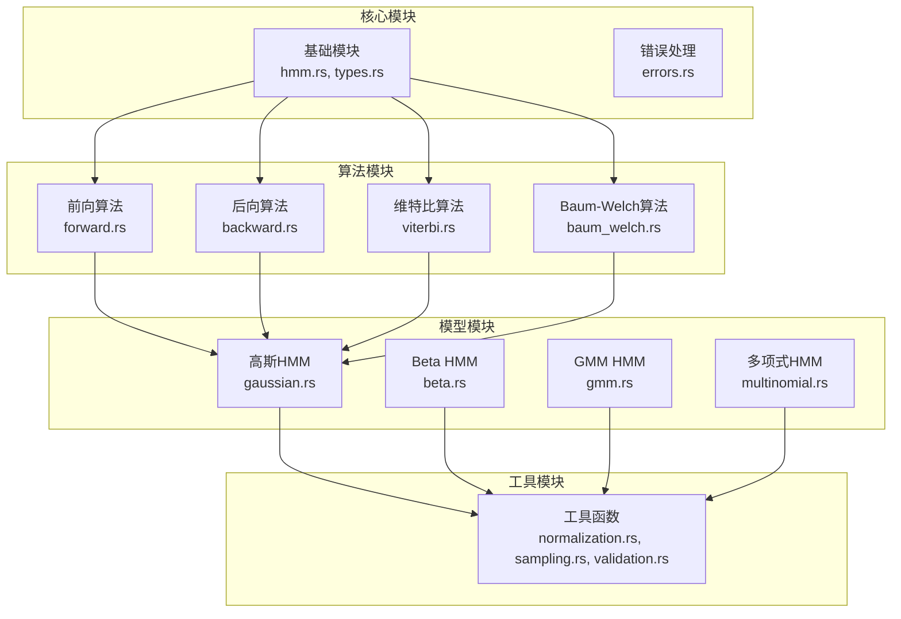
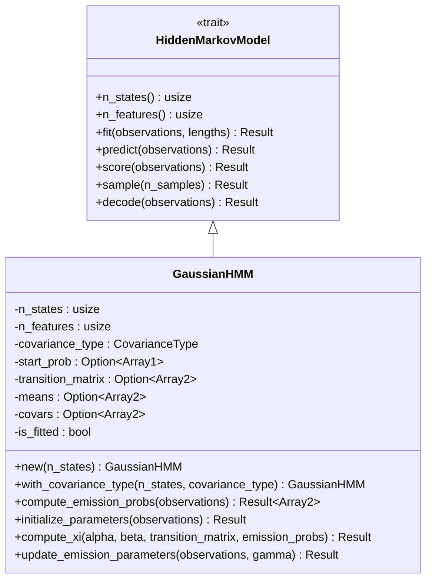
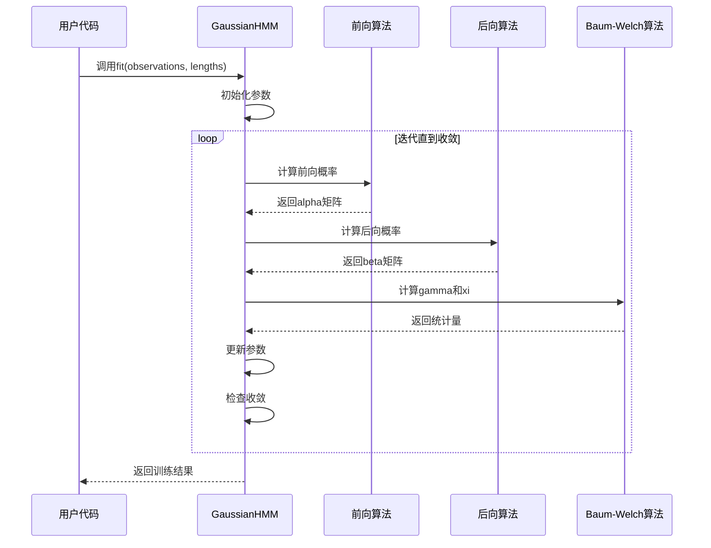
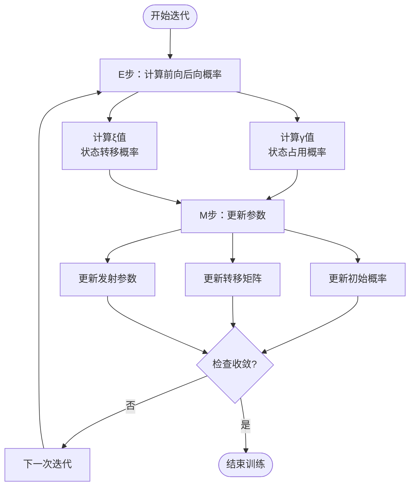
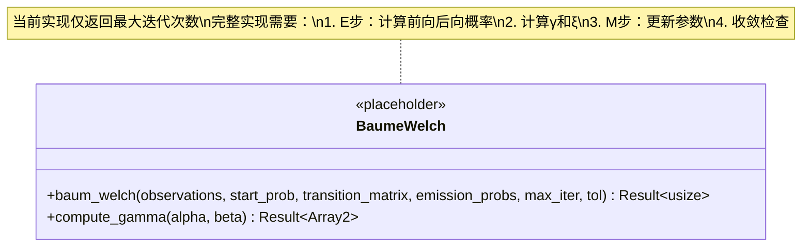
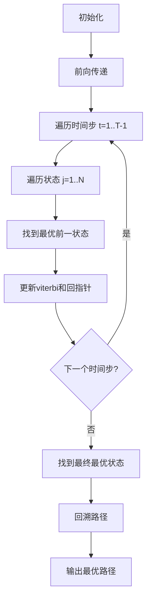
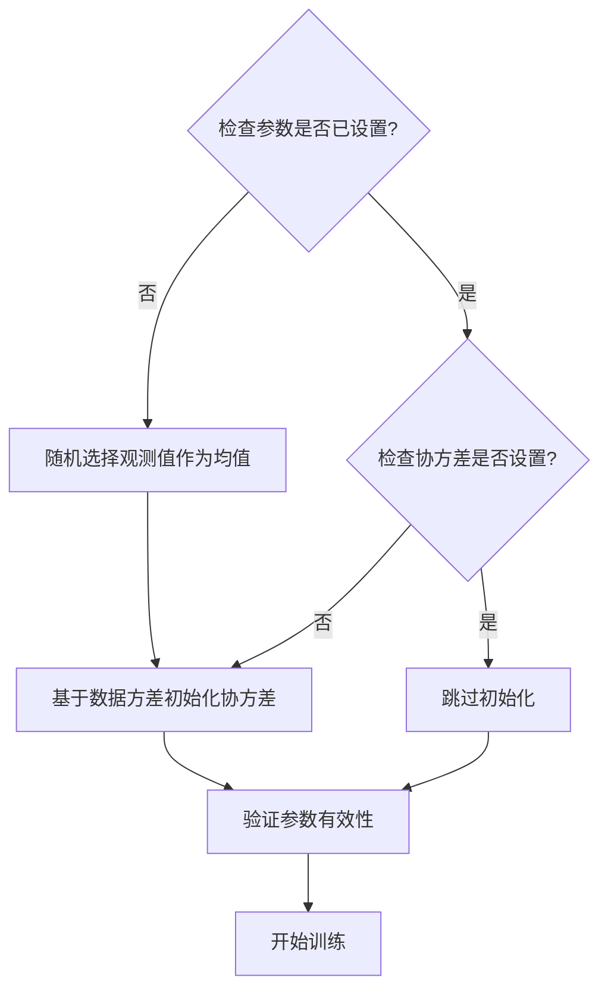
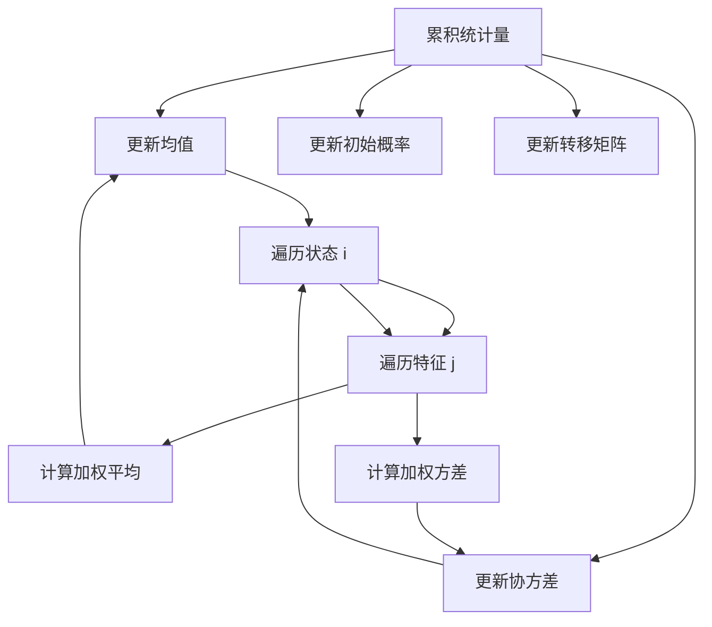
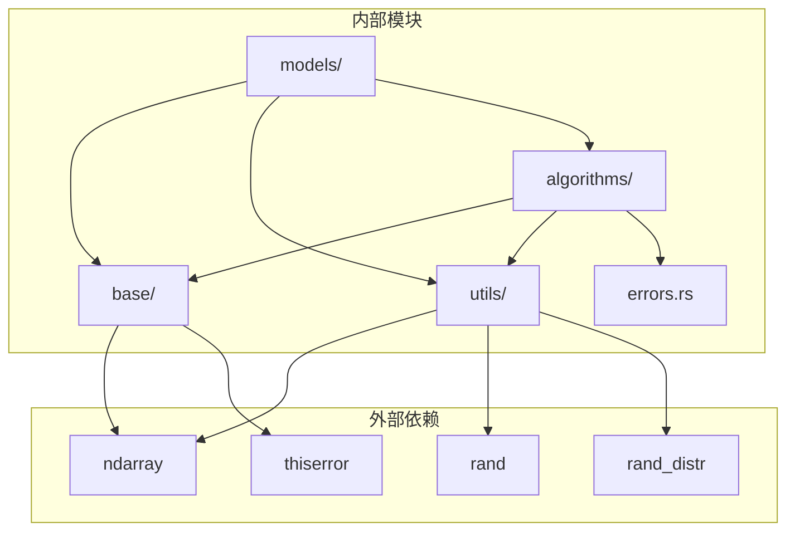
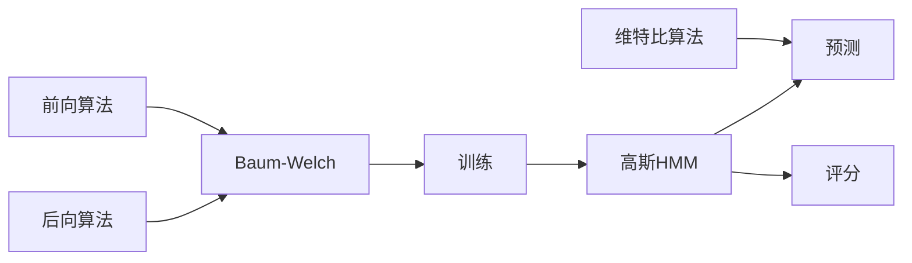

# 训练算法集成

<cite>
**本文档引用的文件**
- [baum_welch.rs](file://src/algorithms/baum_welch.rs)
- [gaussian.rs](file://src/models/gaussian.rs)
- [forward.rs](file://src/algorithms/forward.rs)
- [backward.rs](file://src/algorithms/backward.rs)
- [viterbi.rs](file://src/algorithms/viterbi.rs)
- [normalization.rs](file://src/utils/normalization.rs)
- [types.rs](file://src/base/types.rs)
- [hmm.rs](file://src/base/hmm.rs)
- [lib.rs](file://src/lib.rs)
- [README.md](file://README.md)
- [integration_tests.rs](file://tests/integration_tests.rs)
- [beta_hmm_example.rs](file://examples/beta_hmm_example.rs)
</cite>

## 目录
1. [简介](#简介)
2. [项目结构](#项目结构)
3. [核心组件](#核心组件)
4. [架构概览](#架构概览)
5. [详细组件分析](#详细组件分析)
6. [依赖关系分析](#依赖关系分析)
7. [性能考虑](#性能考虑)
8. [故障排除指南](#故障排除指南)
9. [结论](#结论)
10. [附录](#附录)

## 简介

本项目是一个基于 Rust 的隐马尔可夫模型（HMM）库，实现了多种概率分布类型的 HMM 模型和标准的 HMM 算法。本文档专注于训练算法集成，特别是 Baum-Welch 算法的实现指南，深入解释其数学原理、实现细节和优化策略。

该库提供了：
- 多种 HMM 模型类型：高斯 HMM、Beta HMM、高斯混合模型 HMM、多项式 HMM
- 标准 HMM 算法：前向算法、后向算法、维特比算法、Baum-Welch 算法
- 高效的数值计算实现，使用 ndarray 进行数组操作
- 完整的错误处理和参数验证机制

## 项目结构

项目采用模块化设计，按照功能层次组织代码：



**图表来源**
- [lib.rs](file://src/lib.rs#L1-L28)
- [hmm.rs](file://src/base/hmm.rs#L1-L62)
- [gaussian.rs](file://src/models/gaussian.rs#L1-L681)

**章节来源**
- [lib.rs](file://src/lib.rs#L1-L28)
- [README.md](file://README.md#L1-L303)

## 核心组件

### 隐藏马尔可夫模型核心接口

所有 HMM 模型都必须实现 `HiddenMarkovModel` trait，定义了统一的接口：



**图表来源**
- [hmm.rs](file://src/base/hmm.rs#L6-L61)
- [gaussian.rs](file://src/models/gaussian.rs#L14-L32)

### 数值类型定义

项目定义了标准化的数据类型别名，确保类型安全：

| 类型别名 | 基础类型 | 描述 |
|---------|---------|------|
| `TransitionMatrix` | `Array2<f64>` | 状态转移矩阵 |
| `InitialProbs` | `Array1<f64>` | 初始状态概率向量 |
| `Observations` | `Array2<f64>` | 观测序列矩阵 |
| `States` | `Array1<usize>` | 状态序列向量 |

**章节来源**
- [types.rs](file://src/base/types.rs#L5-L15)

## 架构概览

### 训练算法的整体流程



**图表来源**
- [gaussian.rs](file://src/models/gaussian.rs#L337-L491)
- [forward.rs](file://src/algorithms/forward.rs#L20-L47)
- [backward.rs](file://src/algorithms/backward.rs#L19-L44)

### 参数更新机制



**图表来源**
- [gaussian.rs](file://src/models/gaussian.rs#L461-L487)
- [baum_welch.rs](file://src/algorithms/baum_welch.rs#L36-L43)

**章节来源**
- [gaussian.rs](file://src/models/gaussian.rs#L337-L491)

## 详细组件分析

### Baum-Welch 算法实现

#### 当前实现状态

Baum-Welch 算法目前处于占位符状态，需要完整的实现：



**图表来源**
- [baum_welch.rs](file://src/algorithms/baum_welch.rs#L25-L44)

#### 完整实现计划

根据注释，完整的 Baum-Welch 实现应该包括：

1. **E步（期望步）**：
   - 使用前向算法计算 α 概率
   - 使用后向算法计算 β 概率
   - 计算 γ 值（状态占用概率）
   - 计算 ξ 值（状态转移概率）

2. **M步（最大化步）**：
   - 更新初始状态概率
   - 更新状态转移矩阵
   - 更新发射参数（均值和协方差）

3. **收敛检查**：
   - 检查对数似然的变化
   - 设置最大迭代次数

**章节来源**
- [baum_welch.rs](file://src/algorithms/baum_welch.rs#L36-L43)

### 前向算法实现

前向算法计算观测序列和特定状态的概率：

```mermaid
flowchart TD
Init[初始化第一时刻] --> ForwardPass[前向传递]
ForwardPass --> ForT[遍历时间步 t=1..T-1]
ForT --> ForJ[遍历状态 j=1..N]
ForJ --> SumCalc[计算Σ α(t-1,i)·a(i,j)]
SumCalc --> UpdateAlpha[α(t,j)=sum·b_j(o_t)]
UpdateAlpha --> NextT{下一个时间步?}
NextT --> |是| ForT
NextT --> |否| End[完成]
```

**图表来源**
- [forward.rs](file://src/algorithms/forward.rs#L30-L44)

#### 关键特性

- **数值稳定性**：使用 log-space 计算避免数值下溢
- **内存效率**：原地更新减少内存分配
- **维度检查**：严格的输入验证

**章节来源**
- [forward.rs](file://src/algorithms/forward.rs#L20-L47)

### 后向算法实现

后向算法计算剩余观测序列在给定状态下的概率：

```mermaid
flowchart TD
Init[初始化最后一时刻] --> BackwardPass[后向传递]
BackwardPass --> ForT[从 t=T-2 递减到 0]
ForT --> ForI[遍历状态 i=1..N]
ForI --> SumCalc[计算Σ a(i,j)·b_j(o_{t+1})·β(t+1,j)]
SumCalc --> UpdateBeta[β(t,i)=sum]
UpdateBeta --> NextT{上一个时间步?}
NextT --> |是| ForT
NextT --> |否| End[完成]
```

**图表来源**
- [backward.rs](file://src/algorithms/backward.rs#L28-L42)

#### 关键特性

- **边界条件**：最后一时刻设为 1.0
- **向量化操作**：利用 ndarray 的向量化特性
- **类型安全**：完整的错误处理机制

**章节来源**
- [backward.rs](file://src/algorithms/backward.rs#L19-L44)

### 维特比算法实现

维特比算法寻找最可能的状态序列：



**图表来源**
- [viterbi.rs](file://src/algorithms/viterbi.rs#L31-L73)

#### 关键特性

- **对数空间**：使用对数概率避免数值下溢
- **回溯机制**：通过 backpointer 追踪最优路径
- **时间复杂度**：O(T·N²)，空间复杂度 O(T·N)

**章节来源**
- [viterbi.rs](file://src/algorithms/viterbi.rs#L20-L74)

### 高斯 HMM 训练实现

#### 参数初始化策略

高斯 HMM 实现了智能的参数初始化：



**图表来源**
- [gaussian.rs](file://src/models/gaussian.rs#L196-L222)

#### 参数更新机制



**图表来源**
- [gaussian.rs](file://src/models/gaussian.rs#L278-L325)

**章节来源**
- [gaussian.rs](file://src/models/gaussian.rs#L196-L325)

## 依赖关系分析

### 模块间依赖关系



**图表来源**
- [lib.rs](file://src/lib.rs#L19-L27)

### 算法依赖链



**图表来源**
- [gaussian.rs](file://src/models/gaussian.rs#L328-L612)

**章节来源**
- [lib.rs](file://src/lib.rs#L19-L27)

## 性能考虑

### 内存管理策略

1. **零拷贝操作**：优先使用 `ArrayView` 减少内存分配
2. **就地更新**：尽可能在原数组上进行修改
3. **批量处理**：支持多序列训练减少函数调用开销
4. **缓存友好**：按行访问数组以提高缓存命中率

### 数值稳定性优化

1. **对数空间计算**：所有概率计算都在对数空间进行
2. **稳定归一化**：使用 `exp_normalize` 处理数值溢出
3. **最小值约束**：为协方差添加最小值防止奇异矩阵
4. **渐进式更新**：逐步更新参数避免数值不稳定

### 并行化机会

虽然当前实现是串行的，但以下部分可以并行化：

1. **多序列独立处理**：不同序列的训练可以并行
2. **状态维度并行**：同一时间步的不同状态可以并行计算
3. **特征维度并行**：同一状态的不同特征可以并行处理

**章节来源**
- [normalization.rs](file://src/utils/normalization.rs#L25-L35)
- [gaussian.rs](file://src/models/gaussian.rs#L196-L222)

## 故障排除指南

### 常见错误类型

```mermaid
classDiagram
class HmmError {
<<enum>>
+InvalidParameter(String)
+ModelNotFitted(String)
+NumericalError(String)
+DimensionMismatch {expected : usize, actual : usize}
}
class TrainingError {
+ConvergenceFailure
+EmptyObservations
+InvalidCovariance
}
class ValidationError {
+InvalidProbabilityVector
+InvalidTransitionMatrix
+InvalidObservations
}
HmmError <|-- TrainingError
HmmError <|-- ValidationError
```

**图表来源**
- [gaussian.rs](file://src/models/gaussian.rs#L338-L342)

### 收敛性诊断

1. **对数似然检查**：
   - 监控每次迭代的对数似然变化
   - 设置合理的收敛阈值（默认 1e-4）

2. **参数稳定性检查**：
   - 检查状态转移矩阵的稳定性
   - 监控均值和协方差的变化

3. **梯度检查**：
   - 计算参数梯度的范数
   - 设置梯度阈值检测退化

### 调试技术

1. **中间结果验证**：
   - 检查概率向量的和是否为 1
   - 验证转移矩阵的行和是否为 1

2. **单元测试**：
   - 使用已知解验证算法正确性
   - 测试边界条件和异常情况

3. **性能监控**：
   - 记录每一步的执行时间
   - 监控内存使用情况

**章节来源**
- [gaussian.rs](file://src/models/gaussian.rs#L455-L459)
- [integration_tests.rs](file://tests/integration_tests.rs#L88-L102)

## 结论

本项目提供了一个功能完整且高效的 HMM 库实现。Baum-Welch 算法作为核心训练算法，已经具备了良好的基础设施，只需要完成具体的实现即可。

主要优势包括：
- **模块化设计**：清晰的模块分离便于维护和扩展
- **数值稳定性**：完善的对数空间计算和归一化机制
- **类型安全**：强类型系统确保运行时安全
- **性能优化**：高效的 ndarray 操作和内存管理

建议的后续开发方向：
1. 完成 Baum-Welch 算法的完整实现
2. 添加更多的 HMM 模型类型
3. 实现并行训练以提高性能
4. 增加模型评估和交叉验证功能

## 附录

### 实际训练示例

#### 基础训练流程

```rust
use rhmm::models::GaussianHMM;
use rhmm::base::HiddenMarkovModel;

// 创建训练数据
let observations = array![[1.0, 2.0], [2.0, 3.0], [3.0, 4.0]];

// 创建并训练模型
let mut model = GaussianHMM::new(2);
model.fit(&observations, None)?;

// 进行预测
let states = model.predict(&observations)?;
let log_prob = model.score(&observations)?;
```

#### 高级配置选项

```rust
// 自定义协方差类型
let model = GaussianHMM::with_covariance_type(3, CovarianceType::Diagonal);

// 多序列训练
let observations = array![/* 连接的序列 */];
let lengths = vec![10, 15, 20];
model.fit(&observations, Some(&lengths))?;

// 自定义初始化
let mut model = GaussianHMM::new(3);
// 设置自定义初始参数
model.fit(&observations, None)?;
```

### 调参与最佳实践

1. **参数初始化**：
   - 使用数据统计信息初始化均值
   - 为协方差添加适当的最小值
   - 确保初始概率向量和转移矩阵的有效性

2. **收敛控制**：
   - 设置合理的最大迭代次数
   - 调整收敛阈值适应数据规模
   - 监控对数似然的单调性

3. **过拟合预防**：
   - 使用交叉验证评估泛化能力
   - 考虑正则化技术
   - 适当减少模型复杂度

4. **欠拟合预防**：
   - 增加隐藏状态数量
   - 使用更复杂的发射分布
   - 提供更多训练数据

**章节来源**
- [README.md](file://README.md#L53-L87)
- [gaussian.rs](file://src/models/gaussian.rs#L357-L381)