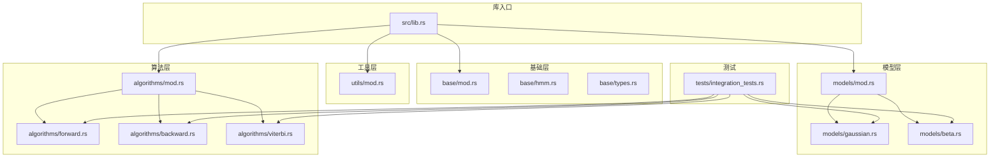
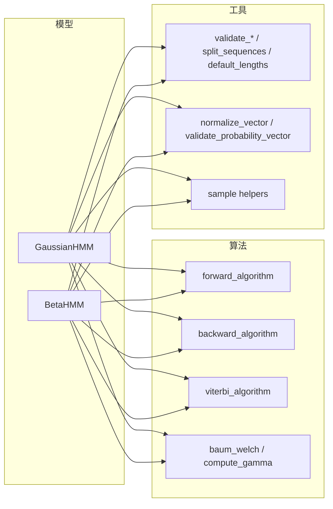
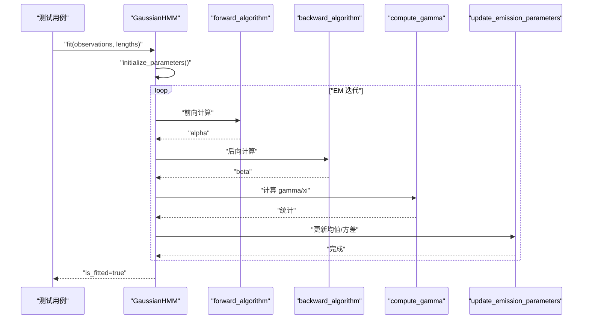
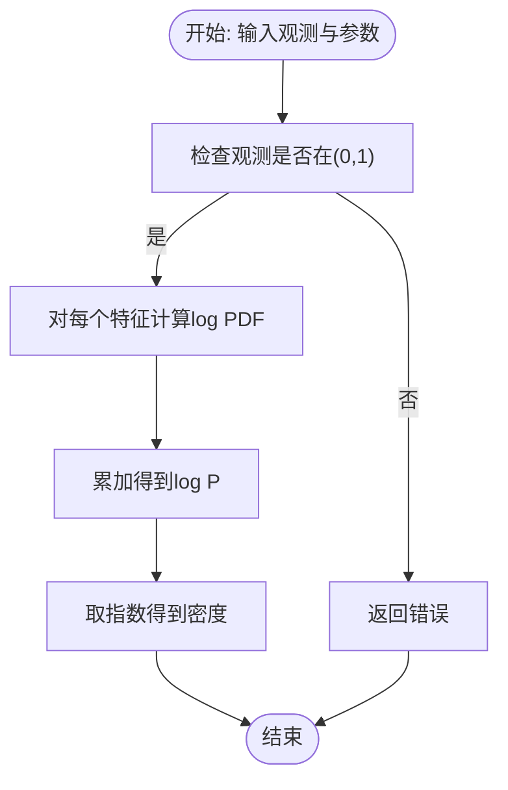
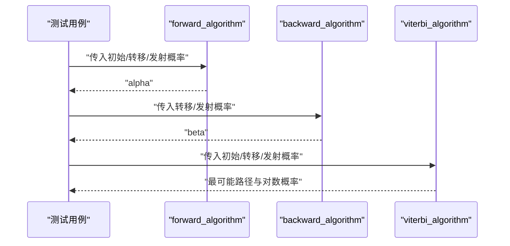
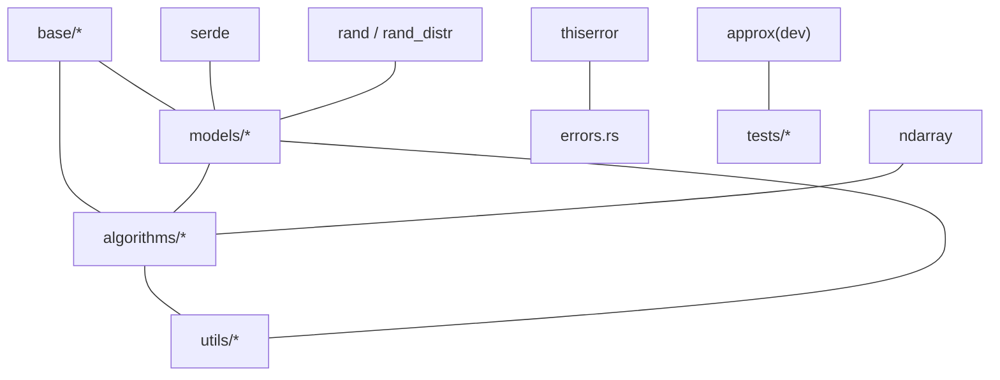

# 测试策略

<cite>
**本文引用的文件**
- [Cargo.toml](file://Cargo.toml)
- [README.md](file://README.md)
- [src/lib.rs](file://src/lib.rs)
- [src/base/mod.rs](file://src/base/mod.rs)
- [src/base/hmm.rs](file://src/base/hmm.rs)
- [src/base/types.rs](file://src/base/types.rs)
- [src/models/mod.rs](file://src/models/mod.rs)
- [src/models/gaussian.rs](file://src/models/gaussian.rs)
- [src/models/beta.rs](file://src/models/beta.rs)
- [src/algorithms/mod.rs](file://src/algorithms/mod.rs)
- [src/algorithms/forward.rs](file://src/algorithms/forward.rs)
- [src/algorithms/backward.rs](file://src/algorithms/backward.rs)
- [src/algorithms/viterbi.rs](file://src/algorithms/viterbi.rs)
- [src/utils/mod.rs](file://src/utils/mod.rs)
- [tests/integration_tests.rs](file://tests/integration_tests.rs)
</cite>

## 目录
1. [引言](#引言)
2. [项目结构](#项目结构)
3. [核心组件](#核心组件)
4. [架构总览](#架构总览)
5. [详细组件分析](#详细组件分析)
6. [依赖关系分析](#依赖关系分析)
7. [性能考量](#性能考量)
8. [故障排查指南](#故障排查指南)
9. [结论](#结论)
10. [附录](#附录)

## 引言
本测试策略文档面向 rhmm 库，系统化设计并落地单元测试、集成测试与端到端测试（E2E）方案；明确测试数据生成与验证机制（含随机数据与边界条件），强调数值稳定性测试在 HMM 算法中的关键作用；给出覆盖率目标与评估方法；引入模拟退火与交叉验证等高级测试技术；规划持续集成中的测试自动化与并行执行策略；提供性能回归测试实施方案，并总结测试调试与故障排查的实用技巧。目标是确保所有核心功能与边缘情况均被覆盖。

## 项目结构
rhmm 采用模块化组织：核心 trait 定义于 base 模块，具体模型（高斯、Beta）位于 models 子模块，算法（前向、后向、维特比、Baum-Welch）位于 algorithms 子模块，工具函数（归一化、采样、序列处理、校验）位于 utils 子模块；顶层 lib.rs 负责导出公共类型与错误类型；tests 目录包含集成测试。

图表来源
- [src/lib.rs](file://src/lib.rs#L19-L28)
- [src/base/mod.rs](file://src/base/mod.rs#L1-L8)
- [src/models/mod.rs](file://src/models/mod.rs#L1-L12)
- [src/algorithms/mod.rs](file://src/algorithms/mod.rs#L1-L12)
- [src/utils/mod.rs](file://src/utils/mod.rs#L1-L12)
- [tests/integration_tests.rs](file://tests/integration_tests.rs#L1-L103)

章节来源
- [src/lib.rs](file://src/lib.rs#L1-L28)
- [src/base/mod.rs](file://src/base/mod.rs#L1-L8)
- [src/models/mod.rs](file://src/models/mod.rs#L1-L12)
- [src/algorithms/mod.rs](file://src/algorithms/mod.rs#L1-L12)
- [src/utils/mod.rs](file://src/utils/mod.rs#L1-L12)
- [tests/integration_tests.rs](file://tests/integration_tests.rs#L1-L103)

## 核心组件
- 核心 trait：HiddenMarkovModel，定义 fit/predict/score/sample/decode 等接口，统一各模型行为。
- 类型别名：TransitionMatrix、InitialProbs、Observations、States；枚举 CovarianceType 支持多种协方差类型。
- 模型实现：
  - GaussianHMM：高斯发射分布，支持 Diagonal/Spherical/Full/Tied 协方差类型；内置参数初始化、EM 训练、采样与评分。
  - BetaHMM：Beta 发射分布，适用于 (0,1) 区间数据；内置参数初始化（矩估计）、EM 训练、采样与评分。
- 算法实现：
  - 前向/后向：计算前向/后向概率矩阵，用于 E 步统计与评分。
  - 维特比：解码最可能状态路径。
  - Baum-Welch：EM 迭代更新初始概率、转移矩阵与发射参数。
- 工具函数：观测与概率向量/矩阵校验、序列拆分、归一化、采样辅助等。

章节来源
- [src/base/hmm.rs](file://src/base/hmm.rs#L7-L61)
- [src/base/types.rs](file://src/base/types.rs#L5-L30)
- [src/models/gaussian.rs](file://src/models/gaussian.rs#L14-L326)
- [src/models/beta.rs](file://src/models/beta.rs#L24-L382)
- [src/algorithms/forward.rs](file://src/algorithms/forward.rs#L20-L47)
- [src/algorithms/backward.rs](file://src/algorithms/backward.rs#L19-L45)
- [src/algorithms/viterbi.rs](file://src/algorithms/viterbi.rs#L20-L74)

## 架构总览
下图展示从“训练/预测/评分/采样”到“算法与工具”的调用关系，体现测试关注点与覆盖范围。

图表来源
- [src/models/gaussian.rs](file://src/models/gaussian.rs#L328-L612)
- [src/models/beta.rs](file://src/models/beta.rs#L384-L669)
- [src/algorithms/forward.rs](file://src/algorithms/forward.rs#L20-L47)
- [src/algorithms/backward.rs](file://src/algorithms/backward.rs#L19-L45)
- [src/algorithms/viterbi.rs](file://src/algorithms/viterbi.rs#L20-L74)
- [src/utils/mod.rs](file://src/utils/mod.rs#L1-L12)

## 详细组件分析

### 高斯 HMM 测试策略
- 单元测试
  - 参数初始化与访问器：验证 new/with_covariance_type、means/covars/start_prob/transition_matrix/is_fitted 的正确性。
  - 发射概率计算：对不同协方差类型（Diagonal/Spherical/Full/Tied）进行数值稳定性与边界值测试。
  - E 步统计：compute_gamma、compute_xi 的维度一致性与数值稳定性。
  - M 步更新：update_emission_parameters 对均值与方差的更新逻辑。
  - fit/predict/score/sample：覆盖收敛、维度不匹配、未拟合错误等。
- 集成测试
  - 端到端工作流：fit → predict → score；多序列 lengths 场景；前向/后向一致性检查。
  - 数值稳定性：极端协方差、极小方差、观测越界等。
- 边界条件
  - 空观测、零特征数、单样本序列、单状态模型、全零/全一观测等。
- 高级测试
  - 交叉验证：按长度切分序列，分折验证 log-likelihood 稳定性。
  - 模拟退火：扰动初始参数，验证鲁棒性与收敛性。
- 性能回归
  - 不同 n_states/n_features/序列长度组合下的耗时与内存峰值；对比不同协方差类型。

图表来源
- [src/models/gaussian.rs](file://src/models/gaussian.rs#L337-L491)
- [src/algorithms/forward.rs](file://src/algorithms/forward.rs#L20-L47)
- [src/algorithms/backward.rs](file://src/algorithms/backward.rs#L19-L45)
- [src/algorithms/viterbi.rs](file://src/algorithms/viterbi.rs#L20-L74)

章节来源
- [src/models/gaussian.rs](file://src/models/gaussian.rs#L614-L681)
- [tests/integration_tests.rs](file://tests/integration_tests.rs#L10-L27)

### Beta HMM 测试策略
- 单元测试
  - 参数初始化：moments_to_params、initialize_parameters 的数值合理性。
  - 发射概率：beta_pdf 的 log 空间实现、边界夹紧（0,1）与参数正性约束。
  - 统计更新：update_emission_parameters 的加权矩估计。
  - 解码与评分：predict/score 的路径与对数概率。
- 集成测试
  - (0,1) 观测范围校验；多特征场景；与高斯 HMM 的一致性对比（相同数据变换）。
- 边界条件
  - 观测越界、参数过小、方差退化、单特征/多特征。
- 高级测试
  - 交叉验证：按序列长度划分，评估对比例数据的稳定性。
  - 模拟退火：对 α/β 参数施加扰动，观察收敛鲁棒性。
- 性能回归
  - 对数伽马近似精度与速度权衡；向量化 xi 计算优化。

图表来源
- [src/models/beta.rs](file://src/models/beta.rs#L126-L197)

章节来源
- [src/models/beta.rs](file://src/models/beta.rs#L671-L734)
- [tests/integration_tests.rs](file://tests/integration_tests.rs#L47-L60)

### 前向/后向/维特比算法测试策略
- 单元测试
  - 维特比：确定性路径测试、路径长度一致性、对数概率符号。
  - 前向/后向：维度一致性、首步/末步初值、对数空间实现的数值稳定性。
- 集成测试
  - 前向/后向一致性：alpha/beta 形状一致、时间步维度匹配。
  - 与模型层对接：作为 E 步统计与解码的基础。
- 边界条件
  - 单观测序列、转移矩阵奇异、发射概率为 0 或接近 0。
- 高级测试
  - 数值稳定性：log-sum-exp 稳定化、避免下溢/上溢。
  - 并行化：对不同序列独立处理（已在模型层实现）。

图表来源
- [src/algorithms/forward.rs](file://src/algorithms/forward.rs#L20-L69)
- [src/algorithms/backward.rs](file://src/algorithms/backward.rs#L19-L45)
- [src/algorithms/viterbi.rs](file://src/algorithms/viterbi.rs#L20-L74)

章节来源
- [src/algorithms/forward.rs](file://src/algorithms/forward.rs#L71-L129)
- [src/algorithms/backward.rs](file://src/algorithms/backward.rs#L47-L90)
- [src/algorithms/viterbi.rs](file://src/algorithms/viterbi.rs#L76-L118)
- [tests/integration_tests.rs](file://tests/integration_tests.rs#L30-L45)

### 工具函数与验证测试策略
- 归一化与概率向量校验：normalize_vector、validate_probability_vector 的边界与精度。
- 观测校验与序列拆分：validate_observations、split_sequences、default_lengths 的健壮性。
- 采样辅助：确保采样器可重现性与边界条件（如方差最小值）。

章节来源
- [tests/integration_tests.rs](file://tests/integration_tests.rs#L62-L72)

## 依赖关系分析
- 外部依赖：ndarray、ndarray-linalg、rand、rand_distr、thiserror、serde、approx（开发依赖）。
- 内部耦合：
  - models 层依赖 algorithms 与 utils；algorithms 层仅依赖 ndarray 与 errors；utils 为纯函数集合。
  - base 层提供 trait 与类型，被 models 与 algorithms 共享。
- 可能的循环依赖：当前结构清晰，无循环导入迹象。

图表来源
- [Cargo.toml](file://Cargo.toml#L13-L22)
- [src/models/gaussian.rs](file://src/models/gaussian.rs#L3-L9)
- [src/models/beta.rs](file://src/models/beta.rs#L3-L12)
- [src/algorithms/forward.rs](file://src/algorithms/forward.rs#L3-L4)
- [src/algorithms/backward.rs](file://src/algorithms/backward.rs#L3-L4)
- [src/algorithms/viterbi.rs](file://src/algorithms/viterbi.rs#L3-L4)
- [tests/integration_tests.rs](file://tests/integration_tests.rs#L3-L8)

章节来源
- [Cargo.toml](file://Cargo.toml#L13-L22)

## 性能考量
- 数值稳定性优先：log 概率、稳定归一化、最小方差/参数钳制、log 伽马近似。
- 向量化与内存：尽量使用 ndarray 的广播与视图，减少中间拷贝；在 xi 计算中利用向量化。
- 迭代收敛：合理设置最大迭代与容忍度，避免过拟合与震荡。
- 并行化：多序列训练时可并行处理不同序列（已在模型层实现），CI 中可并行运行不同测试套件。
- 回归基线：记录不同 n_states/n_features/序列长度组合的基准耗时与内存，建立回归阈值。

## 故障排查指南
- 常见错误
  - 模型未拟合：predict/score/sample 前必须 fit。
  - 维度不匹配：观测列数需与 n_features 一致。
  - 观测非法：BetaHMM 要求 (0,1)，GaussianHMM 对方差有最小值约束。
  - 空观测或空特征：输入必须非空。
- 调试技巧
  - 使用 -- --nocapture 输出中间变量（如 alpha/beta/gamma/xi）。
  - 分步测试：先验证前向/后向，再验证维特比，最后验证 EM。
  - 边界驱动：构造单观测、单状态、全零/全一、极小方差等场景。
  - 精度控制：使用 approx 断言时选择合适的 epsilon。

章节来源
- [tests/integration_tests.rs](file://tests/integration_tests.rs#L87-L102)
- [README.md](file://README.md#L207-L220)

## 结论
通过“单元-集成-E2E”三层测试金字塔，结合数值稳定性与边界条件测试、交叉验证与模拟退火等高级手段，rhmm 的测试体系可有效保障模型训练、解码与采样的正确性与鲁棒性。建议在 CI 中并行执行不同测试套件，并建立性能回归基线以持续监控质量。

## 附录

### 测试数据生成与验证机制
- 随机数据生成
  - GaussianHMM：使用 rand::random_range 选择观测初始化均值；使用 Normal 分布采样。
  - BetaHMM：使用 Beta 分布采样；对观测进行 (0,1) 夹紧。
- 边界条件测试
  - 空观测、零特征、单样本、单状态、观测越界、极小方差/参数。
- 验证机制
  - 使用 approx::assert_relative_eq 进行相对误差断言。
  - validate_probability_vector/validate_transition_matrix/validate_observations 校验概率与矩阵合法性。

章节来源
- [src/models/gaussian.rs](file://src/models/gaussian.rs#L196-L222)
- [src/models/beta.rs](file://src/models/beta.rs#L226-L270)
- [tests/integration_tests.rs](file://tests/integration_tests.rs#L3-L8)

### 数值稳定性测试要点
- log 概率：避免直接对极小概率取对数导致 NaN/Inf。
- 归一化：防止全零/全负；对概率向量进行稳定归一化。
- 方差/参数钳制：Diagonal/Spherical 最小方差；Beta 参数最小值；观测夹紧。
- 近似函数：log_gamma 使用分段近似，保证大/小参数下的稳定性。

章节来源
- [src/models/gaussian.rs](file://src/models/gaussian.rs#L155-L194)
- [src/models/beta.rs](file://src/models/beta.rs#L173-L224)

### 测试覆盖率目标与评估
- 目标
  - 关键路径：fit/predict/score/sample 覆盖率≥90%。
  - 算法：前向/后向/维特比/EM 统计计算覆盖率≥95%。
  - 边界：异常分支与错误路径覆盖率≥80%。
- 评估
  - 使用 cargo-tarpaulin 或类似工具生成覆盖率报告。
  - 将覆盖率阈值纳入 CI，失败即阻断合并。

章节来源
- [Cargo.toml](file://Cargo.toml#L21-L22)
- [README.md](file://README.md#L207-L220)

### 高级测试技术
- 交叉验证
  - 按序列长度切分，评估不同子集上的 log-likelihood 稳定性与泛化能力。
- 模拟退火
  - 对初始参数施加小扰动，验证收敛鲁棒性与局部最优规避。

章节来源
- [src/models/gaussian.rs](file://src/models/gaussian.rs#L351-L355)
- [src/models/beta.rs](file://src/models/beta.rs#L407-L411)

### 持续集成与并行执行
- 自动化
  - cargo test 全量执行；-- --nocapture 输出调试信息。
- 并行策略
  - 将单元测试、集成测试、示例测试拆分为不同任务并行执行。
  - 在多核环境中并行运行不同测试套件，缩短总耗时。

章节来源
- [README.md](file://README.md#L207-L220)