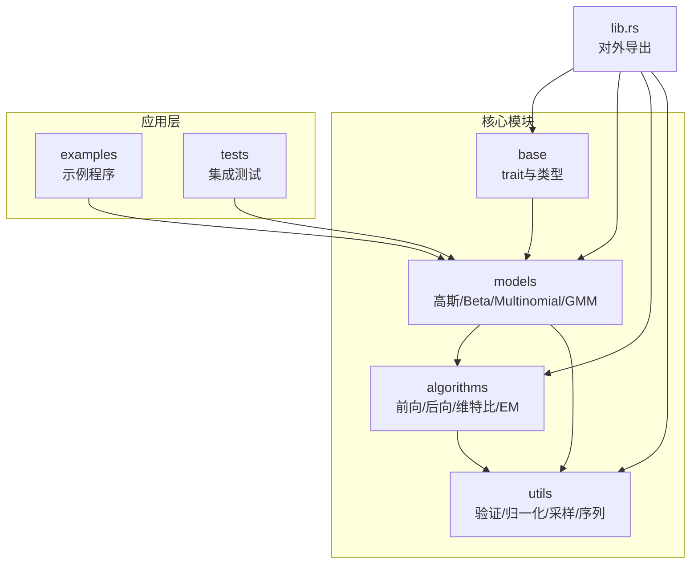
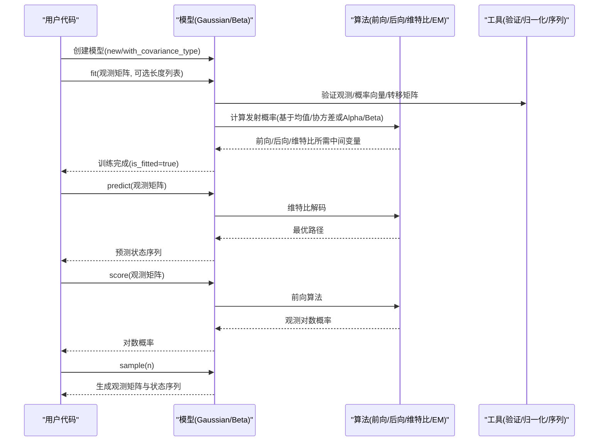
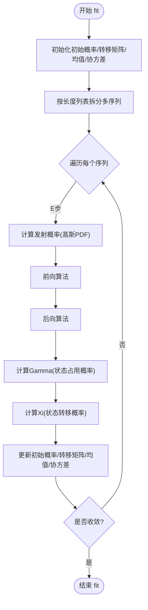
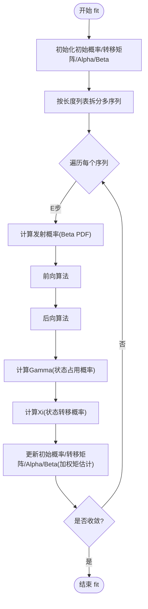
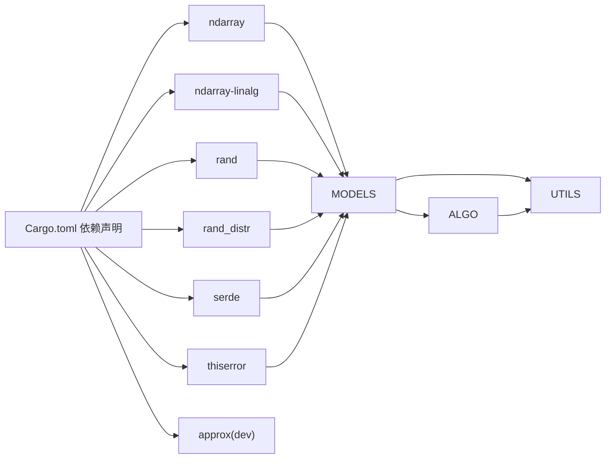

# 快速开始

<cite>
**本文引用的文件**
- [Cargo.toml](file://Cargo.toml)
- [README.md](file://README.md)
- [src/lib.rs](file://src/lib.rs)
- [src/base/mod.rs](file://src/base/mod.rs)
- [src/base/hmm.rs](file://src/base/hmm.rs)
- [src/base/types.rs](file://src/base/types.rs)
- [src/models/gaussian.rs](file://src/models/gaussian.rs)
- [src/models/beta.rs](file://src/models/beta.rs)
- [src/algorithms/mod.rs](file://src/algorithms/mod.rs)
- [src/algorithms/forward.rs](file://src/algorithms/forward.rs)
- [src/algorithms/viterbi.rs](file://src/algorithms/viterbi.rs)
- [src/utils/mod.rs](file://src/utils/mod.rs)
- [examples/beta_hmm_example.rs](file://examples/beta_hmm_example.rs)
- [tests/integration_tests.rs](file://tests/integration_tests.rs)
</cite>

## 目录
1. [简介](#简介)
2. [项目结构](#项目结构)
3. [核心组件](#核心组件)
4. [架构总览](#架构总览)
5. [详细组件分析](#详细组件分析)
6. [依赖关系分析](#依赖关系分析)
7. [性能与数值稳定性](#性能与数值稳定性)
8. [故障排除指南](#故障排除指南)
9. [结论](#结论)
10. [附录：从零到一的完整示例流程](#附录从零到一的完整示例流程)

## 简介
rhmm 是一个用 Rust 实现的隐马尔可夫模型（HMM）库，受 Python 的 hmmlearn 启发。它提供了多种 HMM 模型类型与标准算法，基于 ndarray 进行高效的数值计算。本“快速开始”指南将带你完成：
- 安装与环境准备（Cargo 依赖与 Rust 版本）
- 从源码构建与测试
- 使用高斯 HMM 与 Beta HMM 的完整工作流：数据准备、模型训练、状态预测、概率计算、数据生成
- 常见问题排查与最佳实践

## 项目结构
仓库采用模块化组织，核心模块如下：
- base：核心 trait 与通用类型定义
- models：具体模型实现（高斯、Beta、多项式、GMM 等）
- algorithms：HMM 核心算法（前向、后向、维特比、Baum-Welch）
- utils：验证、归一化、序列处理等工具
- examples：示例程序
- tests：集成测试

图表来源
- [src/lib.rs](file://src/lib.rs#L19-L28)
- [src/base/mod.rs](file://src/base/mod.rs#L1-L8)
- [src/algorithms/mod.rs](file://src/algorithms/mod.rs#L1-L12)
- [src/utils/mod.rs](file://src/utils/mod.rs#L1-L12)

章节来源
- [src/lib.rs](file://src/lib.rs#L1-L28)
- [Cargo.toml](file://Cargo.toml#L1-L23)

## 核心组件
- 核心 trait：HiddenMarkovModel，统一了 fit、predict、score、sample、decode 等接口
- 模型类型：GaussianHMM、BetaHMM（多项式、GMM 待实现）
- 算法实现：前向/后向、维特比、Baum-Welch（EM）
- 工具函数：参数验证、概率向量归一化、序列分割等

章节来源
- [src/base/hmm.rs](file://src/base/hmm.rs#L6-L61)
- [src/base/types.rs](file://src/base/types.rs#L17-L29)
- [src/algorithms/mod.rs](file://src/algorithms/mod.rs#L1-L12)
- [src/utils/mod.rs](file://src/utils/mod.rs#L1-L12)

## 架构总览
下图展示了从数据到模型再到推理的整体流程，以及各模块间的调用关系。

图表来源
- [src/models/gaussian.rs](file://src/models/gaussian.rs#L328-L612)
- [src/models/beta.rs](file://src/models/beta.rs#L384-L669)
- [src/algorithms/forward.rs](file://src/algorithms/forward.rs#L20-L47)
- [src/algorithms/viterbi.rs](file://src/algorithms/viterbi.rs#L20-L74)
- [src/base/hmm.rs](file://src/base/hmm.rs#L14-L53)

## 详细组件分析

### 高斯 HMM（GaussianHMM）
- 功能要点
  - 支持多种协方差类型：全协方差、对角协方差、球面协方差、绑定协方差
  - 使用 Baum-Welch（EM）进行参数估计
  - 支持多序列训练（通过长度列表分段）
  - 提供 predict（维特比）、score（前向对数概率）、sample（从模型生成）

- 关键流程（fit）

图表来源
- [src/models/gaussian.rs](file://src/models/gaussian.rs#L337-L491)
- [src/algorithms/forward.rs](file://src/algorithms/forward.rs#L20-L47)
- [src/algorithms/viterbi.rs](file://src/algorithms/viterbi.rs#L20-L74)

章节来源
- [src/models/gaussian.rs](file://src/models/gaussian.rs#L11-L681)

### Beta HMM（BetaHMM）
- 功能要点
  - 适用于区间 [0,1] 的比例/概率数据（如转化率、点击率）
  - 发射分布为 Beta 分布，参数由 Alpha/Beta 表示
  - 使用 Baum-Welch（EM）估计 Alpha/Beta 参数
  - 提供 compute_means/compute_variances 获取每状态的期望与方差

- 关键流程（fit）

图表来源
- [src/models/beta.rs](file://src/models/beta.rs#L393-L547)
- [src/algorithms/forward.rs](file://src/algorithms/forward.rs#L20-L47)
- [src/algorithms/viterbi.rs](file://src/algorithms/viterbi.rs#L20-L74)

章节来源
- [src/models/beta.rs](file://src/models/beta.rs#L14-L734)

### 核心算法与工具
- 前向算法：计算前向概率矩阵 alpha，用于概率评估与 EM 的 E 步
- 后向算法：计算后向概率矩阵 beta，配合 alpha 计算 gamma/xi
- 维特比算法：寻找最可能的状态序列
- 工具函数：观测与概率向量验证、概率向量归一化、序列分割、默认长度构造

章节来源
- [src/algorithms/forward.rs](file://src/algorithms/forward.rs#L6-L69)
- [src/algorithms/viterbi.rs](file://src/algorithms/viterbi.rs#L6-L74)
- [src/utils/mod.rs](file://src/utils/mod.rs#L1-L12)

## 依赖关系分析
- 外部依赖
  - ndarray：多维数组与线性代数
  - ndarray-linalg：线性代数运算
  - rand/rand_distr：随机数与概率分布
  - serde：序列化支持
  - thiserror：错误处理
  - approx（开发依赖）：测试断言

- 内部依赖
  - base 模块被 models 与 algorithms 引用
  - models 依赖 algorithms 与 utils
  - examples 与 tests 依赖 models

图表来源
- [Cargo.toml](file://Cargo.toml#L13-L19)

章节来源
- [Cargo.toml](file://Cargo.toml#L1-L23)

## 性能与数值稳定性
- 数值稳定：算法广泛使用 log 空间计算，避免概率下溢
- 向量化：大量使用 ndarray 的广播与向量化操作
- 最小分配：在热路径上尽量减少临时对象分配
- 收敛控制：EM 迭代设置最大次数与容忍度

章节来源
- [README.md](file://README.md#L222-L229)
- [src/models/gaussian.rs](file://src/models/gaussian.rs#L155-L194)
- [src/models/beta.rs](file://src/models/beta.rs#L173-L197)

## 故障排除指南
- 编译失败（Rust 版本过低）
  - 现象：编译报错，提示最低版本不满足
  - 解决：升级到 1.80+（参考 README 中的版本徽章与安装说明）
  - 参考：[README.md](file://README.md#L3)

- 依赖缺失或版本冲突
  - 现象：cargo 报告找不到依赖或版本不兼容
  - 解决：确保 Cargo.toml 中的依赖版本与当前工具链兼容；必要时清理缓存并重新拉取
  - 参考：[Cargo.toml](file://Cargo.toml#L13-L19)

- 训练时报观测为空或维度不匹配
  - 现象：fit 返回 InvalidParameter 或 DimensionMismatch 错误
  - 解决：检查观测矩阵非空且列数与模型 n_features 匹配
  - 参考：[src/models/gaussian.rs](file://src/models/gaussian.rs#L337-L350), [src/models/beta.rs](file://src/models/beta.rs#L393-L405)

- 预测前未训练
  - 现象：predict 返回 ModelNotFitted 错误
  - 解决：先调用 fit 完成训练
  - 参考：[src/models/gaussian.rs](file://src/models/gaussian.rs#L493-L505), [src/models/beta.rs](file://src/models/beta.rs#L549-L561)

- Beta HMM 观测不在 (0,1)
  - 现象：compute_emission_probs 报 InvalidParameter
  - 解决：确保观测值严格在开区间 (0,1)，或预处理到该范围
  - 参考：[src/models/beta.rs](file://src/models/beta.rs#L137-L145)

- 多序列训练边界问题
  - 现象：跨序列边界错误
  - 解决：使用 lengths 参数正确划分序列，或使用默认长度
  - 参考：[src/models/gaussian.rs](file://src/models/gaussian.rs#L351-L355), [src/models/beta.rs](file://src/models/beta.rs#L407-L411)

章节来源
- [README.md](file://README.md#L27-L52)
- [src/models/gaussian.rs](file://src/models/gaussian.rs#L337-L505)
- [src/models/beta.rs](file://src/models/beta.rs#L393-L561)

## 结论
rhmm 提供了高效、稳定的 HMM 实现，覆盖高斯与 Beta 两类常见发射分布，并内置标准算法与工具。通过本文档的安装、配置与示例流程，你可以快速上手并将其应用于实际场景（如连续特征建模与比例数据建模）。

## 附录：从零到一的完整示例流程

### 1) 安装与环境准备
- Rust 版本要求：1.80+
- 在项目中添加依赖（Cargo.toml）
- 或从源码克隆并构建
- 运行测试以验证环境

章节来源
- [README.md](file://README.md#L27-L52)
- [Cargo.toml](file://Cargo.toml#L13-L19)

### 2) 数据准备
- 高斯 HMM：准备连续观测矩阵（行=样本，列=特征）
- Beta HMM：准备区间 (0,1) 的观测矩阵（如转化率、点击率）

章节来源
- [README.md](file://README.md#L55-L119)

### 3) 模型训练（fit）
- 高斯 HMM：指定隐藏状态数，调用 fit
- Beta HMM：指定隐藏状态数，调用 fit
- 多序列：传入 lengths 列表

章节来源
- [src/models/gaussian.rs](file://src/models/gaussian.rs#L337-L491)
- [src/models/beta.rs](file://src/models/beta.rs#L393-L547)
- [README.md](file://README.md#L232-L240)

### 4) 状态预测（predict）
- 使用维特比算法得到最可能的状态序列
- 输出为状态索引数组

章节来源
- [src/models/gaussian.rs](file://src/models/gaussian.rs#L493-L517)
- [src/models/beta.rs](file://src/models/beta.rs#L549-L572)
- [src/algorithms/viterbi.rs](file://src/algorithms/viterbi.rs#L20-L74)

### 5) 概率计算（score）
- 使用前向算法计算观测序列的对数概率
- 用于模型评估与比较

章节来源
- [src/models/gaussian.rs](file://src/models/gaussian.rs#L519-L544)
- [src/models/beta.rs](file://src/models/beta.rs#L574-L599)
- [src/algorithms/forward.rs](file://src/algorithms/forward.rs#L20-L69)

### 6) 数据生成（sample）
- 从已训练模型生成新的观测矩阵与状态序列
- 用于仿真与数据增强

章节来源
- [src/models/gaussian.rs](file://src/models/gaussian.rs#L546-L611)
- [src/models/beta.rs](file://src/models/beta.rs#L601-L668)

### 7) 示例参考
- 高斯 HMM 示例：参见 README 的示例片段
- Beta HMM 示例：参见 examples/beta_hmm_example.rs 的完整演示

章节来源
- [README.md](file://README.md#L55-L119)
- [examples/beta_hmm_example.rs](file://examples/beta_hmm_example.rs#L1-L266)