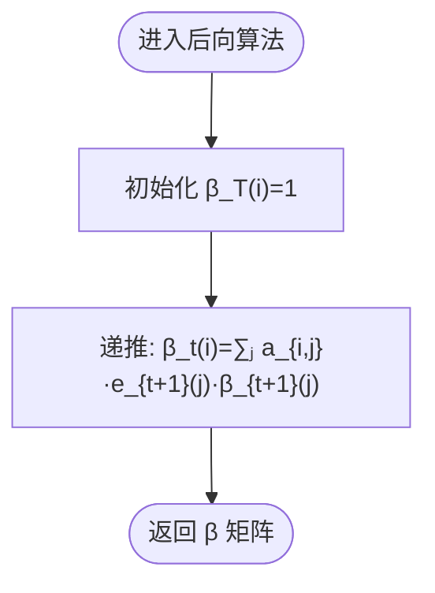

# HMM 基础理论

<cite>
**本文引用的文件**
- [README.md](file://README.md)
- [lib.rs](file://src/lib.rs)
- [hmm.rs](file://src/base/hmm.rs)
- [types.rs](file://src/base/types.rs)
- [forward.rs](file://src/algorithms/forward.rs)
- [backward.rs](file://src/algorithms/backward.rs)
- [viterbi.rs](file://src/algorithms/viterbi.rs)
- [baum_welch.rs](file://src/algorithms/baum_welch.rs)
- [gaussian.rs](file://src/models/gaussian.rs)
- [beta.rs](file://src/models/beta.rs)
- [mod.rs](file://src/models/mod.rs)
- [mod.rs](file://src/algorithms/mod.rs)
- [mod.rs](file://src/base/mod.rs)
- [mod.rs](file://src/utils/mod.rs)
- [beta_hmm_example.rs](file://examples/beta_hmm_example.rs)
</cite>

## 目录
1. [引言](#引言)
2. [项目结构](#项目结构)
3. [核心组件](#核心组件)
4. [架构总览](#架构总览)
5. [详细组件分析](#详细组件分析)
6. [依赖关系分析](#依赖关系分析)
7. [性能考量](#性能考量)
8. [故障排查指南](#故障排查指南)
9. [结论](#结论)
10. [附录](#附录)

## 引言
本文件面向隐马尔可夫模型（HMM）的理论与实践，结合代码库中的实现，系统阐述以下内容：
- HMM 的核心数学概念：隐藏状态空间、可观测输出空间、初始状态概率分布、状态转移概率矩阵、发射概率分布的定义与作用
- 马尔可夫假设（无记忆性）与条件独立性假设的含义及在 HMM 中的应用
- 三大基本问题：概率计算问题（前向算法）、学习问题（Baum-Welch 算法）、解码问题（维特比算法）
- 数学公式与状态转移图示例，帮助理解 HMM 的概率模型结构
- 实际应用场景与适用条件说明

## 项目结构
该仓库采用模块化组织方式，围绕“基础接口 + 算法实现 + 模型实现 + 工具函数”的分层设计：
- 基础模块：定义统一的 HMM 接口与通用类型别名
- 算法模块：实现前向、后向、维特比、Baum-Welch 等标准算法
- 模型模块：实现高斯、贝塔等不同发射分布的 HMM
- 工具模块：提供序列切分、参数校验、归一化、采样等辅助能力
- 示例：提供贝塔 HMM 的端到端使用示例

图表来源
- [lib.rs](file://src/lib.rs#L19-L28)
- [base/mod.rs](file://src/base/mod.rs#L1-L8)
- [algorithms/mod.rs](file://src/algorithms/mod.rs#L1-L12)
- [models/mod.rs](file://src/models/mod.rs#L1-L12)
- [utils/mod.rs](file://src/utils/mod.rs#L1-L12)

章节来源
- [lib.rs](file://src/lib.rs#L1-L28)
- [README.md](file://README.md#L1-L303)

## 核心组件
本节从数学与实现两个维度梳理 HMM 的核心要素。

- 隐藏状态空间与可观测输出空间
  - 隐藏状态空间：由状态数 n_states 决定，状态集合通常记作 Q = {1, ..., N}
  - 观测输出空间：根据模型类型而定，如连续观测（高斯）或区间 (0,1) 观测（贝塔）

- 初始状态概率分布
  - 表示在时间 t=1 处于各状态的概率，记为 π(i) = P(q1 = i)
  - 在实现中以初始概率向量表示

- 状态转移概率矩阵
  - 转移概率 aij = P(qt+1 = j | qt = i)，满足每行和为 1
  - 在实现中以转移矩阵表示

- 发射概率分布
  - 高斯 HMM：每个状态下观测遵循多元高斯分布，参数为均值与协方差
  - 贝塔 HMM：每个状态下观测遵循贝塔分布，参数为 α 和 β（形状参数），适用于 (0,1) 区间数据

- 马尔可夫假设与条件独立性假设
  - 马尔可夫假设：当前状态仅依赖于前一时刻状态，即 P(qt | qt−1, qt−2, ...) = P(qt | qt−1)
  - 条件独立性假设：在给定当前状态条件下，观测仅依赖于当前状态，且与历史无关
  - 这些假设使得联合概率分解为转移与发射两部分，是前向/后向/维特比等算法的理论基础

章节来源
- [hmm.rs](file://src/base/hmm.rs#L7-L61)
- [types.rs](file://src/base/types.rs#L5-L29)
- [gaussian.rs](file://src/models/gaussian.rs#L14-L32)
- [beta.rs](file://src/models/beta.rs#L14-L39)

## 架构总览
下图展示了 HMM 的概率模型结构与三大基本问题的对应关系：

图表来源
- [forward.rs](file://src/algorithms/forward.rs#L20-L47)
- [backward.rs](file://src/algorithms/backward.rs#L19-L44)
- [viterbi.rs](file://src/algorithms/viterbi.rs#L20-L74)
- [baum_welch.rs](file://src/algorithms/baum_welch.rs#L25-L44)

## 详细组件分析

### 数学模型与实现映射
- 隐藏状态序列与观测序列
  - 隐藏状态序列 q1:T = q1, ..., qT
  - 观测序列 O1:T = o1, ..., oT
- 联合概率分解
  - P(q1:T, O1:T | θ) = π[q1] · ∏(t=1 to T-1) a[q_{t-1}, qt] · ∏(t=1 to T) e[qt](ot)
  - 其中 e[qt](ot) 为状态 qt 下的发射密度（连续）或质量（离散）

- 参数估计与训练
  - 使用 EM（期望最大化）框架：E 步通过前向/后向计算软计数；M 步更新参数
  - 对于高斯/贝塔模型，分别更新均值/协方差或 α/β 参数

章节来源
- [gaussian.rs](file://src/models/gaussian.rs#L337-L491)
- [beta.rs](file://src/models/beta.rs#L393-L547)

### 前向算法（概率计算）
- 目标：计算观测序列的似然 P(O | θ)，或其对数值
- 核心思想：动态规划，逐时刻累加所有到达当前状态的路径概率
- 实现要点：初始化首时刻，递推更新；最终对最后一排求和得到概率

图表来源
- [forward.rs](file://src/algorithms/forward.rs#L20-L47)

章节来源
- [forward.rs](file://src/algorithms/forward.rs#L20-L69)

### 后向算法（辅助计算）
- 目标：计算 β_t(i) = P(ot+1, ot+2, ..., oT | qt = i, θ)
- 用途：与前向配合，计算 γ_t(i) 与 ξ_t(i,j)，用于参数更新

图表来源
- [backward.rs](file://src/algorithms/backward.rs#L19-L44)

章节来源
- [backward.rs](file://src/algorithms/backward.rs#L19-L44)

### 维特比算法（解码）
- 目标：找到最可能的状态序列 argmax_q P(q | O, θ)
- 核心思想：动态规划，记录最优路径与回溯指针
- 实现要点：对数域避免下溢；最后一步选择最大累积概率；向前回溯得到路径

图表来源
- [viterbi.rs](file://src/algorithms/viterbi.rs#L20-L74)

章节来源
- [viterbi.rs](file://src/algorithms/viterbi.rs#L20-L74)

### 学习问题（Baum-Welch 算法）
- 目标：在观测 O1:T 下，用 EM 最大化似然 L(θ) = log P(O | θ)
- 实现要点（概要）：
  - E 步：计算 γ_t(i) 与 ξ_t(i,j)
  - M 步：更新初始概率、转移矩阵与发射参数
  - 收敛判断：对数似然变化小于阈值时停止

图表来源
- [baum_welch.rs](file://src/algorithms/baum_welch.rs#L25-L74)
- [gaussian.rs](file://src/models/gaussian.rs#L383-L491)
- [beta.rs](file://src/models/beta.rs#L439-L547)

章节来源
- [baum_welch.rs](file://src/algorithms/baum_welch.rs#L25-L74)
- [gaussian.rs](file://src/models/gaussian.rs#L383-L491)
- [beta.rs](file://src/models/beta.rs#L439-L547)

### 高斯 HMM（连续观测）
- 发射分布：每个状态下的观测遵循多元高斯分布
- 协方差类型：支持全/对角/球面/绑定等多种协方差结构
- 训练流程：初始化参数 → E 步（前向/后向）→ M 步（均值/协方差更新）→ 收敛

图表来源
- [gaussian.rs](file://src/models/gaussian.rs#L14-L32)
- [types.rs](file://src/base/types.rs#L18-L29)

章节来源
- [gaussian.rs](file://src/models/gaussian.rs#L14-L32)
- [types.rs](file://src/base/types.rs#L18-L29)

### 贝塔 HMM（比例/速率观测）
- 发射分布：每个状态下的观测遵循贝塔分布，适合 (0,1) 区间数据
- 参数估计：基于方法矩估计初始化 α/β，再用 EM 更新
- 应用场景：转化率、点击率、市场份额、质量控制等

图表来源
- [beta.rs](file://src/models/beta.rs#L14-L39)

章节来源
- [beta.rs](file://src/models/beta.rs#L14-L39)

### 示例：贝塔 HMM 的端到端应用
- 数据：电商网站日度转化率（移动/桌面双特征）
- 流程：建模 → 训练 → 参数解读 → 预测 → 评估 → 采样 → 新数据预测

图表来源
- [beta_hmm_example.rs](file://examples/beta_hmm_example.rs#L57-L186)
- [beta.rs](file://src/models/beta.rs#L393-L668)

章节来源
- [beta_hmm_example.rs](file://examples/beta_hmm_example.rs#L1-L266)
- [beta.rs](file://src/models/beta.rs#L393-L668)

## 依赖关系分析
- 模块耦合
  - 模型实现依赖基础接口与通用类型
  - 算法模块被模型实现复用，彼此低耦合
  - 工具模块提供序列处理与参数校验，贯穿训练流程
- 外部依赖
  - ndarray/numpy 风格数组与线性代数运算
  - 随机数与概率分布（rand/rand_distr）
  - 错误处理与序列化（thiserror/serde）

图表来源
- [lib.rs](file://src/lib.rs#L19-L28)
- [models/mod.rs](file://src/models/mod.rs#L1-L12)
- [algorithms/mod.rs](file://src/algorithms/mod.rs#L1-L12)
- [utils/mod.rs](file://src/utils/mod.rs#L1-L12)

章节来源
- [lib.rs](file://src/lib.rs#L19-L28)

## 性能考量
- 数值稳定性：采用对数域计算（如维特比与前向概率），避免概率下溢
- 向量化与内存：优先使用 ndarray 的向量化操作，减少中间分配
- 收敛与迭代：EM 过程设置最大迭代次数与收敛阈值，平衡精度与速度
- 并行化：多序列训练时可考虑按序列独立处理（当前实现逐序列处理）

## 故障排查指南
- 常见错误类型
  - 模型未训练：在未 fit 的模型上调用 predict/score/sample 将报错
  - 维度不匹配：测试观测特征数与训练时不一致会触发维度错误
  - 参数非法：观测不在 (0,1) 区间（贝塔模型）或概率向量/转移矩阵不合法
- 定位建议
  - 检查 fit 的输入观测是否为空或维度异常
  - 确认 n_features 与观测列数一致
  - 校验初始概率与转移矩阵的合法性
  - 对于数值问题，确认是否使用了 log-space 计算

章节来源
- [gaussian.rs](file://src/models/gaussian.rs#L493-L544)
- [beta.rs](file://src/models/beta.rs#L549-L600)

## 结论
本文件从数学与实现两个层面梳理了 HMM 的核心概念与三大基本问题，并结合代码库中的高斯与贝塔 HMM 实现，给出了前向/后向/维特比/Baum-Welch 的算法流程与状态转移图示。通过示例可以看到如何在真实业务场景（如转化率分析）中应用 HMM，包括参数解读、状态预测、模型评估与数据生成。对于后续扩展，可考虑引入更多发射分布（泊松、指数等）与并行训练策略。

## 附录
- 实际应用场景
  - 高斯 HMM：语音识别、金融市场状态识别、传感器数据分析、生物信息学
  - 贝塔 HMM：电商转化率分析、营销点击率建模、市场份额动态、质量控制
- 适用条件
  - 数据需具备时序性与潜在的隐含状态
  - 观测可由某一状态下的发射分布生成
  - 可接受马尔可夫假设与条件独立性假设