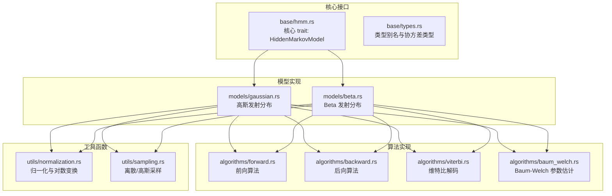
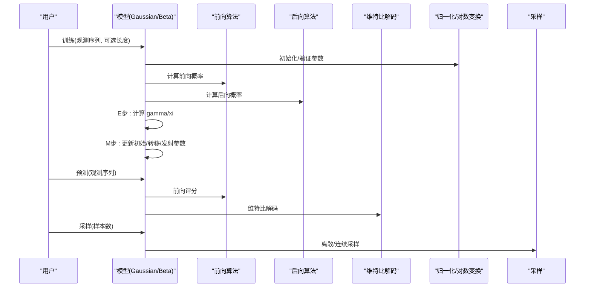
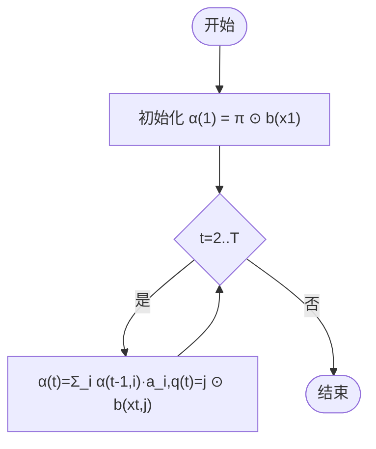
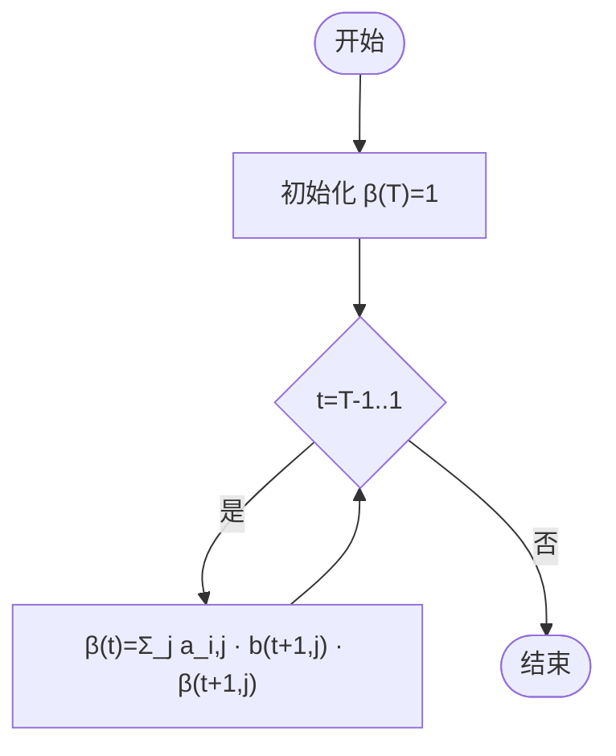
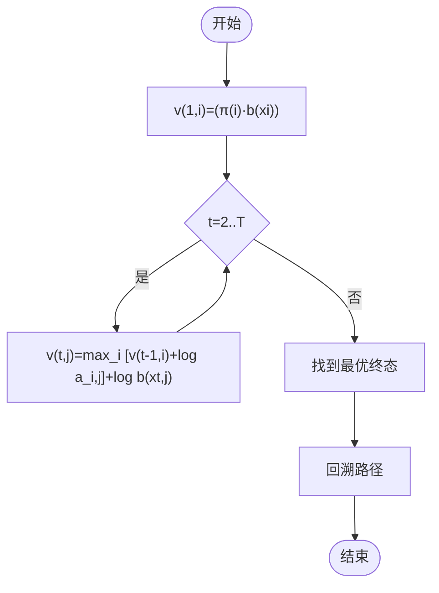
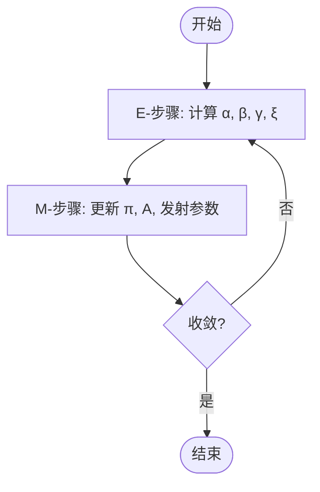
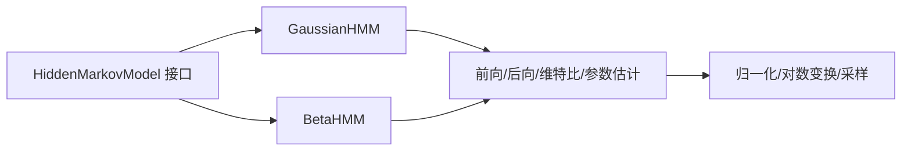

# 数学基础

<cite>
**本文引用的文件**
- [README.md](file://README.md)
- [lib.rs](file://src/lib.rs)
- [hmm.rs](file://src/base/hmm.rs)
- [types.rs](file://src/base/types.rs)
- [gaussian.rs](file://src/models/gaussian.rs)
- [beta.rs](file://src/models/beta.rs)
- [forward.rs](file://src/algorithms/forward.rs)
- [backward.rs](file://src/algorithms/backward.rs)
- [viterbi.rs](file://src/algorithms/viterbi.rs)
- [baum_welch.rs](file://src/algorithms/baum_welch.rs)
- [normalization.rs](file://src/utils/normalization.rs)
- [sampling.rs](file://src/utils/sampling.rs)
</cite>

## 目录
1. [简介](#简介)
2. [项目结构](#项目结构)
3. [核心组件](#核心组件)
4. [架构总览](#架构总览)
5. [详细组件分析](#详细组件分析)
6. [依赖关系分析](#依赖关系分析)
7. [性能考量](#性能考量)
8. [故障排查指南](#故障排查指南)
9. [结论](#结论)
10. [附录](#附录)

## 简介
本文件面向 HMM（隐马尔可夫模型）库的数学基础，系统梳理概率论与线性代数在 HMM 中的应用，涵盖概率分布、矩阵运算与向量空间概念；解释 ndarray 多维数组在数值计算中的角色（形状、索引与内存布局）；阐述数值稳定性与精度控制（对数概率与归一化）；介绍随机数生成与概率分布采样；给出数学符号约定与关键公式推导；并总结最佳实践与常见数值问题的解决方法。

## 项目结构
该库采用模块化组织：核心接口定义于 base 模块，具体模型位于 models 模块，算法实现于 algorithms 模块，工具函数位于 utils 模块，顶层对外导出公共类型与错误处理。

**图表来源**
- [hmm.rs](file://src/base/hmm.rs#L1-L62)
- [types.rs](file://src/base/types.rs#L1-L61)
- [gaussian.rs](file://src/models/gaussian.rs#L1-L681)
- [beta.rs](file://src/models/beta.rs#L1-L734)
- [forward.rs](file://src/algorithms/forward.rs#L1-L129)
- [backward.rs](file://src/algorithms/backward.rs#L1-L90)
- [viterbi.rs](file://src/algorithms/viterbi.rs#L1-L118)
- [baum_welch.rs](file://src/algorithms/baum_welch.rs#L1-L75)
- [normalization.rs](file://src/utils/normalization.rs#L1-L102)
- [sampling.rs](file://src/utils/sampling.rs#L1-L130)

**章节来源**
- [lib.rs](file://src/lib.rs#L1-L28)
- [README.md](file://README.md#L1-L303)

## 核心组件
- 隐马尔可夫模型核心接口：定义了训练、预测、评分、采样与解码等标准能力，统一不同发射分布的模型行为。
- 类型别名与协方差类型：使用 ndarray 的一维/二维数组表示初始概率、转移矩阵、观测序列与状态序列；协方差类型支持对高斯模型进行不同复杂度的协方差建模。
- 算法模块：前向/后向/维特比/参数估计（Baum-Welch）均以数组为输入输出，体现 HMM 的矩阵-向量运算本质。
- 工具模块：提供概率向量/矩阵行归一化、对数概率转换与反变换、离散与高斯采样，确保数值稳定与正确性。

**章节来源**
- [hmm.rs](file://src/base/hmm.rs#L1-L62)
- [types.rs](file://src/base/types.rs#L1-L61)
- [normalization.rs](file://src/utils/normalization.rs#L1-L102)
- [sampling.rs](file://src/utils/sampling.rs#L1-L130)

## 架构总览
下图展示从“观测序列”到“模型参数估计与推理”的端到端流程，强调数组作为数据载体与算法执行的基础。

**图表来源**
- [gaussian.rs](file://src/models/gaussian.rs#L337-L491)
- [beta.rs](file://src/models/beta.rs#L393-L547)
- [forward.rs](file://src/algorithms/forward.rs#L20-L47)
- [backward.rs](file://src/algorithms/backward.rs#L19-L45)
- [viterbi.rs](file://src/algorithms/viterbi.rs#L20-L74)
- [normalization.rs](file://src/utils/normalization.rs#L5-L35)
- [sampling.rs](file://src/utils/sampling.rs#L7-L70)

## 详细组件分析

### 数学符号约定与数据结构
- 状态数：$ N $
- 观测长度：$ T $
- 特征维度：$ D $
- 初始概率向量：$ \pi \in \mathbb{R}^N $，满足 $ \sum_i \pi_i = 1 $
- 转移矩阵：$ A \in \mathbb{R}^{N \times N} $，每行和为 1
- 观测序列：$ X \in \mathbb{R}^{T \times D} $
- 状态序列：$ Q = \{q_1, ..., q_T\} $，取值于 $ \{1..N\} $
- 发射密度/概率：$ b_k(\cdot) $，对高斯为密度函数，对 Beta 为密度函数乘积

数组维度映射：
- 初始概率：Array1<f64>，长度 N
- 转移矩阵：Array2<f64>，形状 (N, N)
- 观测序列：Array2<f64>，形状 (T, D)
- 状态序列：Array1<usize>，长度 T
- 发射概率矩阵：Array2<f64>，形状 (T, N)

**章节来源**
- [types.rs](file://src/base/types.rs#L5-L15)
- [gaussian.rs](file://src/models/gaussian.rs#L102-L134)
- [beta.rs](file://src/models/beta.rs#L116-L157)

### 概率论基础与 HMM 公式
- 前向变量：$ \alpha_t(i) = P(x_1...x_t, q_t=i \mid \lambda) $
- 后向变量：$ \beta_t(i) = P(x_{t+1}...x_T \mid q_t=i, \lambda) $
- 状态占用概率：$ \gamma_t(i) = P(q_t=i \mid X, \lambda) $
- 状态转移概率：$ \xi_t(i,j) = P(q_t=i, q_{t+1}=j \mid X, \lambda) $
- 对数概率：$ \log P(X \mid \lambda) = \log \sum_i \alpha_T(i) $

实现要点：
- 使用 log 概率避免下溢；最终通过指数与归一化恢复概率。
- gamma 由 $ \alpha_t \odot \beta_t $ 归一化得到；xi 由转移与发射项加权求和再归一化。

**章节来源**
- [forward.rs](file://src/algorithms/forward.rs#L20-L47)
- [backward.rs](file://src/algorithms/backward.rs#L19-L45)
- [viterbi.rs](file://src/algorithms/viterbi.rs#L20-L74)
- [baum_welch.rs](file://src/algorithms/baum_welch.rs#L46-L74)
- [normalization.rs](file://src/utils/normalization.rs#L5-L35)

### 线性代数与矩阵运算
- 初始概率与转移矩阵均为概率分布，需按行归一化。
- 发射概率矩阵形状 (T, N)，与前向/后向变量逐元素相乘。
- 高斯模型中协方差类型影响协方差矩阵构造与计算（对角/球面/全/绑）。
- Beta 模型中对数伽马函数用于稳定计算 Beta 函数。

数组运算特性：
- ndarray 支持广播与轴级迭代，便于行归一化与向量化计算。
- 矩阵-向量乘法与逐元素运算广泛用于前向/后向更新。

**章节来源**
- [gaussian.rs](file://src/models/gaussian.rs#L188-L194)
- [beta.rs](file://src/models/beta.rs#L199-L224)
- [normalization.rs](file://src/utils/normalization.rs#L14-L23)

### ndarray 数组操作与内存布局
- 形状与索引：Array2<T> 的形状为 (nrows, ncols)，按行主序存储；通过 row/col/视图访问子矩阵。
- 归一化：axis 迭代器逐行归一化，避免显式循环。
- 广播：在计算 xi 时，利用插入轴与逐元素乘法实现广播，提升可读性与性能。
- 内存布局：库内多数操作为就地修改或临时数组，尽量减少拷贝；在需要时进行所有权转移（如序列拆分后的数组）。

**章节来源**
- [normalization.rs](file://src/utils/normalization.rs#L14-L23)
- [gaussian.rs](file://src/models/gaussian.rs#L241-L270)
- [beta.rs](file://src/models/beta.rs#L300-L332)

### 数值稳定性与精度控制
- 对数概率：log_normalize 将正概率映射到负无穷或其对数；exp_normalize 通过减去最大值再指数化，最后行归一化，避免溢出与下溢。
- 下溢处理：gamma/xi 在归一化前检查和是否为零或极小，必要时采用均匀分布初始化。
- 高斯模型：协方差加入最小值以保证正定性；Mahalanobis 距离计算中避免除零。
- Beta 模型：观测值夹紧至 (ε, 1-ε)，参数夹紧至 [ε, 1/ε]，对数伽马近似稳定计算。

**章节来源**
- [normalization.rs](file://src/utils/normalization.rs#L25-L35)
- [gaussian.rs](file://src/models/gaussian.rs#L162-L172)
- [beta.rs](file://src/models/beta.rs#L182-L196)
- [beta.rs](file://src/models/beta.rs#L202-L224)

### 随机数生成与概率分布采样
- 离散采样：对概率向量进行累积和，比较随机数确定采样索引；要求概率和接近 1。
- 高斯采样：对每个特征维度独立采样一元正态分布，组合为多维样本。
- Beta 采样：直接使用 Beta 分布进行采样，参数来自模型学习结果。
- 采样一致性：采样过程遵循初始概率与转移矩阵，确保生成序列符合模型。

**章节来源**
- [sampling.rs](file://src/utils/sampling.rs#L7-L70)
- [gaussian.rs](file://src/models/gaussian.rs#L546-L611)
- [beta.rs](file://src/models/beta.rs#L601-L668)

### 算法流程与关键实现

#### 前向算法（Forward）

**图表来源**
- [forward.rs](file://src/algorithms/forward.rs#L20-L47)

**章节来源**
- [forward.rs](file://src/algorithms/forward.rs#L20-L47)

#### 后向算法（Backward）

**图表来源**
- [backward.rs](file://src/algorithms/backward.rs#L19-L45)

**章节来源**
- [backward.rs](file://src/algorithms/backward.rs#L19-L45)

#### 维特比解码（Viterbi）

**图表来源**
- [viterbi.rs](file://src/algorithms/viterbi.rs#L20-L74)

**章节来源**
- [viterbi.rs](file://src/algorithms/viterbi.rs#L20-L74)

#### Baum-Welch 参数估计（EM）

**图表来源**
- [gaussian.rs](file://src/models/gaussian.rs#L383-L491)
- [beta.rs](file://src/models/beta.rs#L439-L547)

**章节来源**
- [gaussian.rs](file://src/models/gaussian.rs#L383-L491)
- [beta.rs](file://src/models/beta.rs#L439-L547)

## 依赖关系分析
- 模型依赖算法：GaussianHMM 与 BetaHMM 在训练/推理中调用前向/后向/维特比与 gamma/xi 计算。
- 工具依赖：归一化与对数变换贯穿概率计算；采样依赖随机数生成器与分布库。
- 类型与接口：所有模型实现统一的 HiddenMarkovModel 接口，保证一致的 API 行为。

**图表来源**
- [hmm.rs](file://src/base/hmm.rs#L6-L61)
- [gaussian.rs](file://src/models/gaussian.rs#L328-L612)
- [beta.rs](file://src/models/beta.rs#L384-L669)
- [forward.rs](file://src/algorithms/forward.rs#L1-L129)
- [backward.rs](file://src/algorithms/backward.rs#L1-L90)
- [viterbi.rs](file://src/algorithms/viterbi.rs#L1-L118)
- [baum_welch.rs](file://src/algorithms/baum_welch.rs#L1-L75)
- [normalization.rs](file://src/utils/normalization.rs#L1-L102)
- [sampling.rs](file://src/utils/sampling.rs#L1-L130)

**章节来源**
- [lib.rs](file://src/lib.rs#L19-L28)

## 性能考量
- 向量化优先：使用 ndarray 的广播与轴级操作减少循环开销。
- 就地更新：在可能的情况下对数组进行原位修改，降低分配次数。
- 最小化拷贝：仅在必要时进行所有权转移（例如序列拆分后复制）。
- 数值稳定：log 概率与对数变换避免乘积累计导致的下溢；归一化确保概率和为 1。
- 协方差类型选择：对高维特征，对角/球面协方差可显著降低计算与存储成本。

[本节为通用指导，不直接分析具体文件]

## 故障排查指南
- 概率和校验失败：离散采样要求概率和为 1，否则报错；检查归一化步骤与输入。
- 维度不匹配：预测/评分前需确保观测列数与模型特征数一致。
- 模型未拟合：在未 fit 的模型上调用 predict/score/sample 将返回错误。
- 数值下溢/上溢：使用 log 概率与 exp_normalize；对协方差/参数设置下界。
- 观测范围非法：Beta 模型要求观测在 (0,1)，超出范围会报错。

**章节来源**
- [sampling.rs](file://src/utils/sampling.rs#L17-L38)
- [gaussian.rs](file://src/models/gaussian.rs#L493-L544)
- [beta.rs](file://src/models/beta.rs#L549-L599)

## 结论
该库以 ndarray 为核心，将 HMM 的概率论与线性代数实现为清晰的数组运算流程。通过 log 概率、行归一化与参数下界等策略，有效保障数值稳定性；通过模块化设计，使不同发射分布（高斯、Beta）共享统一接口与算法框架。遵循本文的数学约定与最佳实践，可在实际任务中稳健地构建与部署 HMM 模型。

[本节为总结性内容，不直接分析具体文件]

## 附录

### 关键公式速查
- 前向递推：$ \alpha_t(j) = \left[ \sum_i \alpha_{t-1}(i) a_{ij} \right] b_j(x_t) $
- 后向递推：$ \beta_t(i) = \sum_j a_{ij} b_j(x_{t+1}) \beta_{t+1}(j) $
- 状态占用概率：$ \gamma_t(i) = \frac{\alpha_t(i)\beta_t(i)}{\sum_i \alpha_t(i)\beta_t(i)} $
- 状态转移概率：$ \xi_t(i,j) = \frac{\alpha_t(i) a_{ij} b_{j}(x_{t+1}) \beta_{t+1}(j)}{\sum_i \sum_j \alpha_t(i) a_{ij} b_{j}(x_{t+1}) \beta_{t+1}(j)} $
- 对数概率：$ \log P(X \mid \lambda) = \log \sum_i \alpha_T(i) $

**章节来源**
- [forward.rs](file://src/algorithms/forward.rs#L20-L47)
- [backward.rs](file://src/algorithms/backward.rs#L19-L45)
- [baum_welch.rs](file://src/algorithms/baum_welch.rs#L46-L74)