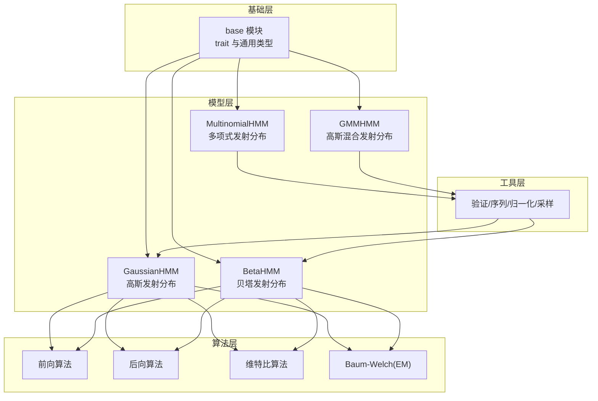
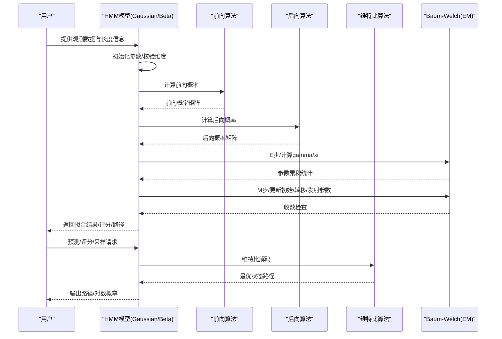
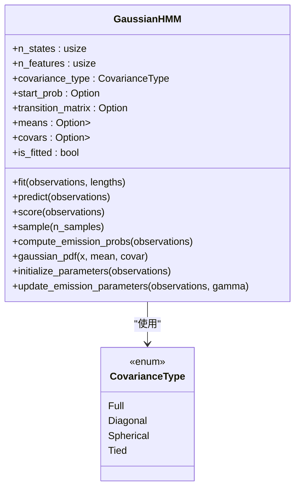
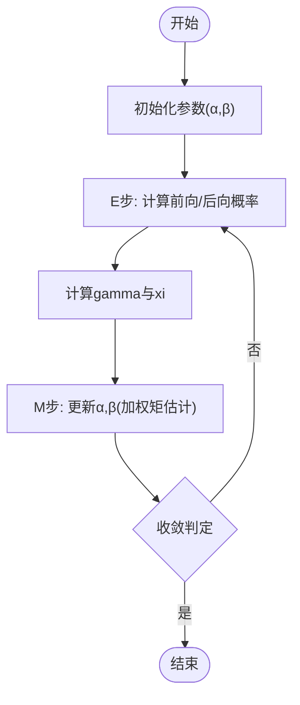
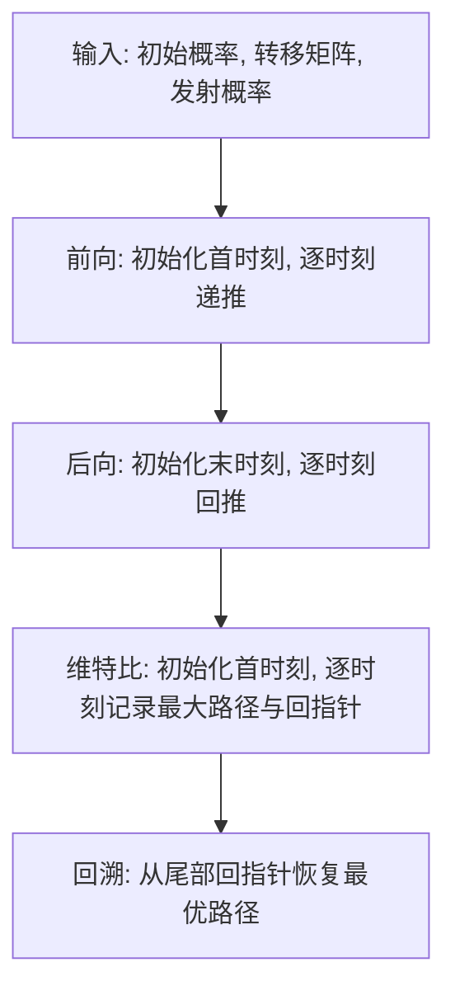
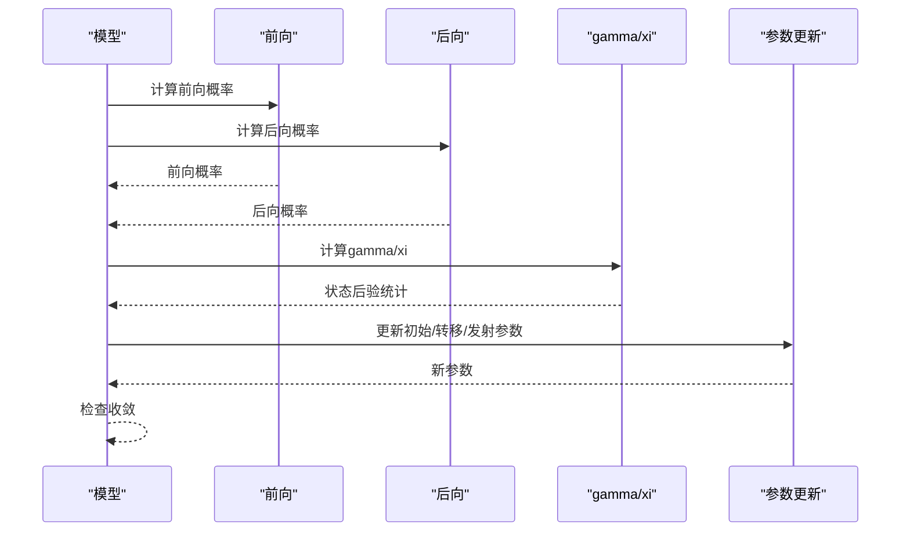
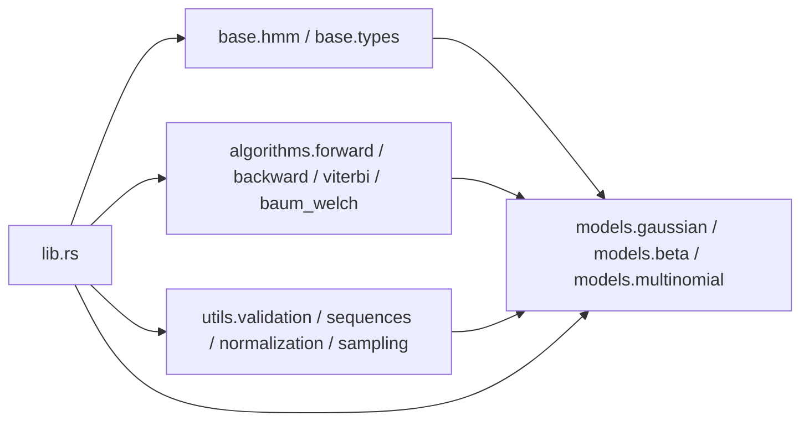

# 核心概念

<cite>
**本文引用的文件**
- [README.md](file://README.md)
- [lib.rs](file://src/lib.rs)
- [hmm.rs](file://src/base/hmm.rs)
- [types.rs](file://src/base/types.rs)
- [gaussian.rs](file://src/models/gaussian.rs)
- [beta.rs](file://src/models/beta.rs)
- [multinomial.rs](file://src/models/multinomial.rs)
- [forward.rs](file://src/algorithms/forward.rs)
- [backward.rs](file://src/algorithms/backward.rs)
- [viterbi.rs](file://src/algorithms/viterbi.rs)
- [baum_welch.rs](file://src/algorithms/baum_welch.rs)
- [mod.rs](file://src/utils/mod.rs)
</cite>

## 目录
1. [引言](#引言)
2. [项目结构](#项目结构)
3. [核心组件](#核心组件)
4. [架构总览](#架构总览)
5. [详细组件分析](#详细组件分析)
6. [依赖关系分析](#依赖关系分析)
7. [性能考量](#性能考量)
8. [故障排查指南](#故障排查指南)
9. [结论](#结论)
10. [附录](#附录)

## 引言
本文件面向初学者与进阶用户，系统梳理隐马尔可夫模型（HMM）的核心概念与数学基础，并结合代码库中的实现要点进行讲解。内容涵盖：
- 隐藏状态、可观测输出、转移概率与发射概率的定义与作用
- 马尔可夫假设与条件独立性假设
- 不同类型 HMM（高斯、贝塔、多项式、高斯混合）的适用场景与数学表示
- 协方差类型（对角、球面、完整、连接）的选择原则与影响
- EM 算法与 Baum-Welch 训练过程的数学原理
- 前向、后向与维特比算法的计算步骤与应用场景
- 可视化图表帮助理解状态转移与概率计算流程

## 项目结构
该仓库采用模块化组织，核心分为“基础接口”“模型实现”“算法实现”“工具函数”等部分，便于扩展与维护。

**图表来源**
- [lib.rs](file://src/lib.rs#L19-L28)
- [hmm.rs](file://src/base/hmm.rs#L7-L61)
- [gaussian.rs](file://src/models/gaussian.rs#L14-L32)
- [beta.rs](file://src/models/beta.rs#L24-L39)
- [multinomial.rs](file://src/models/multinomial.rs#L12-L17)
- [forward.rs](file://src/algorithms/forward.rs#L20-L47)
- [backward.rs](file://src/algorithms/backward.rs#L19-L44)
- [viterbi.rs](file://src/algorithms/viterbi.rs#L20-L74)
- [baum_welch.rs](file://src/algorithms/baum_welch.rs#L25-L44)
- [mod.rs](file://src/utils/mod.rs#L1-L12)

**章节来源**
- [lib.rs](file://src/lib.rs#L19-L28)
- [README.md](file://README.md#L1-L303)

## 核心组件
- 核心接口：所有 HMM 模型均实现统一的 trait，提供训练、预测、评分、采样与解码能力。
- 类型系统：提供状态转移矩阵、初始概率、观测序列、状态序列等类型别名；定义协方差类型枚举。
- 模型族：高斯 HMM、Beta HMM、多项式 HMM（预留）、高斯混合 HMM（预留）。
- 算法族：前向、后向、维特比、Baum-Welch（EM）。

**章节来源**
- [hmm.rs](file://src/base/hmm.rs#L7-L61)
- [types.rs](file://src/base/types.rs#L5-L29)
- [gaussian.rs](file://src/models/gaussian.rs#L14-L32)
- [beta.rs](file://src/models/beta.rs#L24-L39)
- [multinomial.rs](file://src/models/multinomial.rs#L12-L17)
- [forward.rs](file://src/algorithms/forward.rs#L20-L47)
- [backward.rs](file://src/algorithms/backward.rs#L19-L44)
- [viterbi.rs](file://src/algorithms/viterbi.rs#L20-L74)
- [baum_welch.rs](file://src/algorithms/baum_welch.rs#L25-L44)

## 架构总览
下图展示从“观测序列”到“模型参数估计与推理”的整体流程，以及各模块间的依赖关系。

**图表来源**
- [gaussian.rs](file://src/models/gaussian.rs#L337-L491)
- [beta.rs](file://src/models/beta.rs#L393-L547)
- [forward.rs](file://src/algorithms/forward.rs#L20-L47)
- [backward.rs](file://src/algorithms/backward.rs#L19-L44)
- [viterbi.rs](file://src/algorithms/viterbi.rs#L20-L74)
- [baum_welch.rs](file://src/algorithms/baum_welch.rs#L25-L44)

## 详细组件分析

### 数学基础与假设
- 隐马尔可夫模型由五元组定义：状态数、观测维数、初始状态概率、状态转移概率、发射概率（或密度）。
- 马尔可夫假设：任一时刻的状态仅依赖于前一时刻的状态；条件独立性假设：在给定当前状态的条件下，观测值与历史状态无关。
- 观测序列的概率可通过前向算法求得；最优状态序列通过维特比算法获得；参数估计使用 EM（Baum-Welch）迭代优化。

**章节来源**
- [README.md](file://README.md#L10-L26)
- [hmm.rs](file://src/base/hmm.rs#L7-L61)

### 高斯 HMM（GaussianHMM）
- 发射分布：多变量高斯分布，支持多种协方差结构以平衡拟合能力与计算复杂度。
- 协方差类型选择原则：
  - 对角协方差：假设特征之间无相关性，参数少、计算快，适用于大多数连续数据。
  - 球面协方差：约束所有特征具有相同方差，进一步简化参数。
  - 完整协方差：捕获特征间相关性，拟合能力强但计算与存储成本高。
  - 连接协方差：所有状态共享同一协方差矩阵，减少参数数量。
- 训练流程：初始化参数 → E 步（前向/后向、gamma/xi 计算）→ M 步（更新初始概率、转移矩阵、均值与协方差）→ 收敛判断。

**图表来源**
- [gaussian.rs](file://src/models/gaussian.rs#L14-L32)
- [types.rs](file://src/base/types.rs#L18-L29)

**章节来源**
- [gaussian.rs](file://src/models/gaussian.rs#L14-L32)
- [gaussian.rs](file://src/models/gaussian.rs#L102-L134)
- [gaussian.rs](file://src/models/gaussian.rs#L136-L194)
- [gaussian.rs](file://src/models/gaussian.rs#L196-L222)
- [gaussian.rs](file://src/models/gaussian.rs#L224-L270)
- [gaussian.rs](file://src/models/gaussian.rs#L272-L325)
- [gaussian.rs](file://src/models/gaussian.rs#L337-L491)
- [gaussian.rs](file://src/models/gaussian.rs#L493-L544)
- [gaussian.rs](file://src/models/gaussian.rs#L546-L611)
- [types.rs](file://src/base/types.rs#L18-L29)

### 贝塔 HMM（BetaHMM）
- 发射分布：每个状态下的每个观测维度独立服从贝塔分布，适合建模 [0,1] 区间内的比例、转化率等数据。
- 参数估计：基于方法矩估计初始化 α、β；EM 迭代中按权重矩估计更新 α、β。
- 关键点：观测需严格位于开区间 (0,1)，内部对数伽马函数近似保证数值稳定。

**图表来源**
- [beta.rs](file://src/models/beta.rs#L393-L547)
- [beta.rs](file://src/models/beta.rs#L226-L270)
- [beta.rs](file://src/models/beta.rs#L288-L332)
- [beta.rs](file://src/models/beta.rs#L334-L381)

**章节来源**
- [beta.rs](file://src/models/beta.rs#L14-L39)
- [beta.rs](file://src/models/beta.rs#L116-L157)
- [beta.rs](file://src/models/beta.rs#L159-L197)
- [beta.rs](file://src/models/beta.rs#L199-L224)
- [beta.rs](file://src/models/beta.rs#L226-L270)
- [beta.rs](file://src/models/beta.rs#L288-L332)
- [beta.rs](file://src/models/beta.rs#L334-L381)
- [beta.rs](file://src/models/beta.rs#L393-L547)
- [beta.rs](file://src/models/beta.rs#L549-L599)
- [beta.rs](file://src/models/beta.rs#L601-L668)

### 多项式 HMM（MultinomialHMM）
- 发射分布：离散多项式分布，适合建模类别型观测。
- 当前状态：训练、解码、评分与采样为占位实现，后续将完善。

**章节来源**
- [multinomial.rs](file://src/models/multinomial.rs#L8-L33)
- [multinomial.rs](file://src/models/multinomial.rs#L35-L94)

### 高斯混合 HMM（GMM-HMM）
- 发射分布：每个状态下的观测由多个高斯分量混合而成，适合复杂连续分布。
- 当前状态：预留实现，后续将补充训练与推理逻辑。

**章节来源**
- [README.md](file://README.md#L10-L14)

### 前向、后向与维特比算法
- 前向算法：递推计算“到时刻 t 且处于状态 i 的部分观测序列”的概率，用于计算观测序列概率与后验状态概率。
- 后向算法：递推计算“在时刻 t 处于状态 i 的条件下，从 t+1 到 T 的剩余观测序列”的概率，常与前向配合计算后验。
- 维特比算法：动态规划寻找最可能的隐状态序列，广泛用于解码任务。

**图表来源**
- [forward.rs](file://src/algorithms/forward.rs#L20-L47)
- [backward.rs](file://src/algorithms/backward.rs#L19-L44)
- [viterbi.rs](file://src/algorithms/viterbi.rs#L20-L74)

**章节来源**
- [forward.rs](file://src/algorithms/forward.rs#L6-L69)
- [forward.rs](file://src/algorithms/forward.rs#L71-L129)
- [backward.rs](file://src/algorithms/backward.rs#L6-L45)
- [backward.rs](file://src/algorithms/backward.rs#L47-L90)
- [viterbi.rs](file://src/algorithms/viterbi.rs#L6-L74)
- [viterbi.rs](file://src/algorithms/viterbi.rs#L76-L118)

### EM 算法与 Baum-Welch 训练
- E 步：给定当前参数，计算前向/后向概率，进而得到状态占用概率 γ 与状态转移概率 ξ。
- M 步：基于 γ 与 ξ 更新初始概率、转移矩阵与发射参数（如高斯的均值/协方差、贝塔的 α/β）。
- 收敛：比较对数似然增益，达到阈值则停止。

**图表来源**
- [gaussian.rs](file://src/models/gaussian.rs#L383-L491)
- [beta.rs](file://src/models/beta.rs#L439-L547)
- [baum_welch.rs](file://src/algorithms/baum_welch.rs#L25-L44)
- [baum_welch.rs](file://src/algorithms/baum_welch.rs#L56-L74)

**章节来源**
- [gaussian.rs](file://src/models/gaussian.rs#L224-L270)
- [gaussian.rs](file://src/models/gaussian.rs#L272-L325)
- [gaussian.rs](file://src/models/gaussian.rs#L383-L491)
- [beta.rs](file://src/models/beta.rs#L288-L332)
- [beta.rs](file://src/models/beta.rs#L334-L381)
- [beta.rs](file://src/models/beta.rs#L439-L547)
- [baum_welch.rs](file://src/algorithms/baum_welch.rs#L8-L44)

### 协方差类型选择与影响
- 对角协方差：特征独立假设，参数量适中，适合大多数连续数据。
- 球面协方差：强制同方差，参数最少，适合特征尺度相近的数据。
- 完整协方差：捕捉相关性，拟合最佳但计算与存储成本高。
- 连接协方差：降低参数规模，适合状态较多时的稳健估计。

**章节来源**
- [types.rs](file://src/base/types.rs#L18-L29)
- [gaussian.rs](file://src/models/gaussian.rs#L155-L194)

### 不同类型 HMM 的适用场景与数学表示
- 高斯 HMM：连续观测，如语音、金融、传感器数据；发射密度为多变量高斯。
- 贝塔 HMM：[0,1] 区间比例/转化率，如电商转化率、点击率；发射密度为贝塔。
- 多项式 HMM：离散类别观测，如词性标注、天气状态；发射质量为多项式。
- 高斯混合 HMM：复杂连续分布；发射密度为高斯混合。

**章节来源**
- [README.md](file://README.md#L121-L139)
- [gaussian.rs](file://src/models/gaussian.rs#L13-L14)
- [beta.rs](file://src/models/beta.rs#L16-L18)
- [multinomial.rs](file://src/models/multinomial.rs#L10-L11)

## 依赖关系分析
- 模型依赖基础 trait 与类型别名，算法模块被模型调用，工具模块提供验证、序列切分与归一化等支撑。
- 模块内聚高、耦合低，便于扩展新模型与新算法。

**图表来源**
- [lib.rs](file://src/lib.rs#L19-L28)
- [hmm.rs](file://src/base/hmm.rs#L7-L61)
- [types.rs](file://src/base/types.rs#L5-L29)
- [gaussian.rs](file://src/models/gaussian.rs#L3-L9)
- [beta.rs](file://src/models/beta.rs#L3-L9)
- [multinomial.rs](file://src/models/multinomial.rs#L3-L6)
- [forward.rs](file://src/algorithms/forward.rs#L3-L4)
- [backward.rs](file://src/algorithms/backward.rs#L3-L4)
- [viterbi.rs](file://src/algorithms/viterbi.rs#L3-L4)
- [baum_welch.rs](file://src/algorithms/baum_welch.rs#L3-L6)
- [mod.rs](file://src/utils/mod.rs#L1-L12)

**章节来源**
- [lib.rs](file://src/lib.rs#L19-L28)
- [mod.rs](file://src/utils/mod.rs#L1-L12)

## 性能考量
- 使用 ndarray 进行向量化运算，减少内存分配与循环开销。
- 日志空间计算避免数值下溢，提升稳定性。
- 针对不同协方差类型选择合适实现，平衡精度与速度。
- 多序列训练时按序列边界累积统计，避免跨序列错误。

**章节来源**
- [README.md](file://README.md#L222-L229)
- [gaussian.rs](file://src/models/gaussian.rs#L383-L491)
- [beta.rs](file://src/models/beta.rs#L439-L547)

## 故障排查指南
- 模型未拟合：在预测/评分前必须先 fit，否则返回“模型未拟合”错误。
- 维度不匹配：观测列数需与训练时一致，否则返回维度不匹配错误。
- 观测范围非法：贝塔 HMM 要求观测在 (0,1)，否则报参数非法。
- 空观测：训练数据为空将触发无效参数错误。
- 参数初始化：若未显式设置初始参数，模型会自动初始化，建议在需要时自定义。

**章节来源**
- [gaussian.rs](file://src/models/gaussian.rs#L493-L544)
- [gaussian.rs](file://src/models/gaussian.rs#L644-L650)
- [gaussian.rs](file://src/models/gaussian.rs#L659-L667)
- [beta.rs](file://src/models/beta.rs#L137-L145)
- [beta.rs](file://src/models/beta.rs#L393-L398)

## 结论
本库以清晰的模块划分与统一的接口设计，提供了 HMM 的核心能力：多模型族、标准算法与实用工具。通过前向/后向/维特比与 EM/B-W 训练，既能满足教学与入门需求，也为更复杂的实际应用打下坚实基础。建议在具体任务中根据数据特性选择合适的发射分布与协方差结构，并结合多序列训练与收敛控制获得稳定的结果。

## 附录
- 快速上手示例与 API 概览可参考项目自述文件中的“快速开始”与“API 概览”。

**章节来源**
- [README.md](file://README.md#L53-L170)