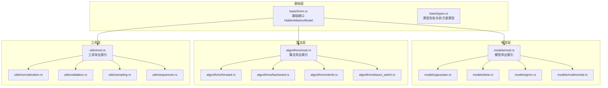
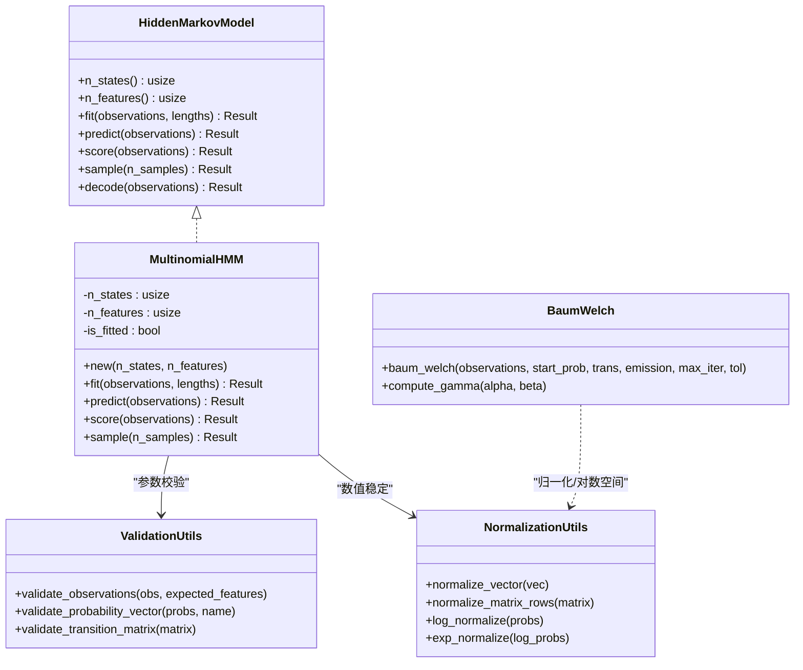
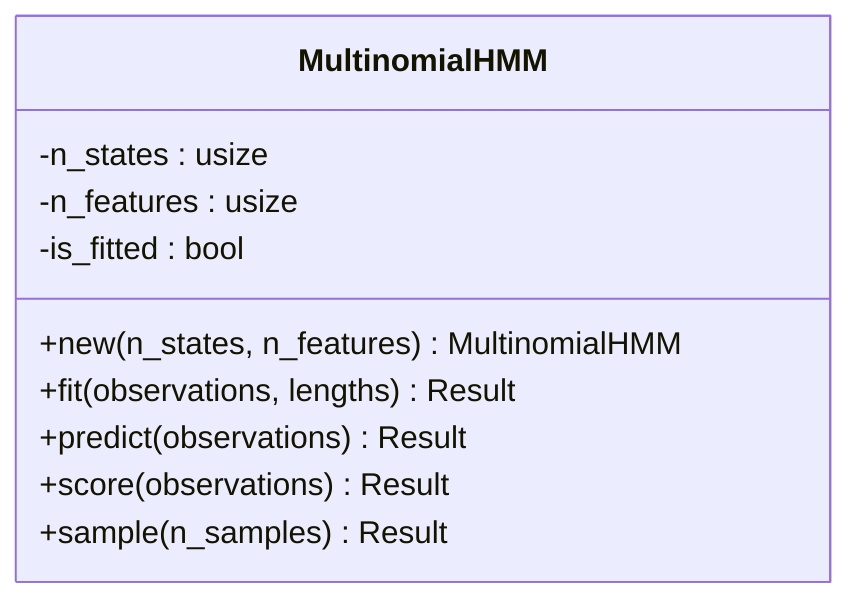
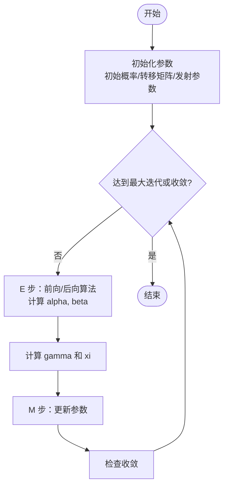
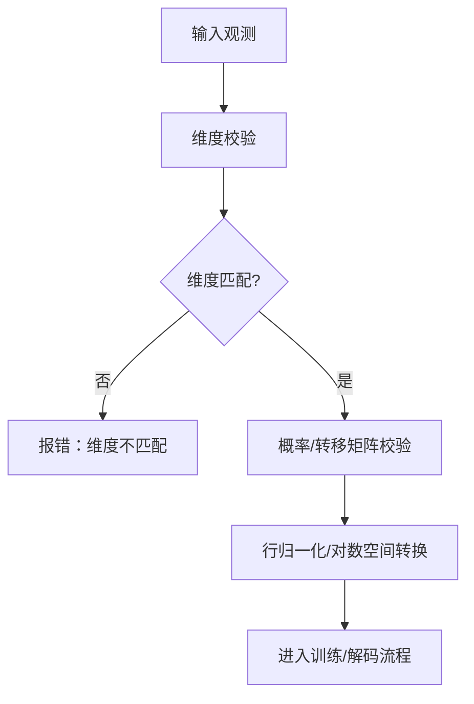
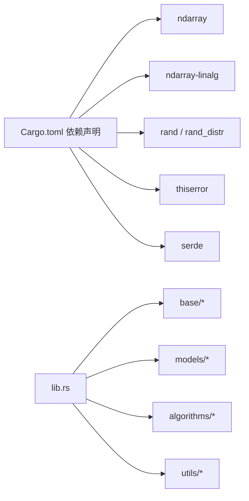

# 多项式 HMM

<cite>
**本文引用的文件**
- [README.md](file://README.md)
- [lib.rs](file://src/lib.rs)
- [hmm.rs](file://src/base/hmm.rs)
- [types.rs](file://src/base/types.rs)
- [multinomial.rs](file://src/models/multinomial.rs)
- [validation.rs](file://src/utils/validation.rs)
- [normalization.rs](file://src/utils/normalization.rs)
- [baum_welch.rs](file://src/algorithms/baum_welch.rs)
- [integration_tests.rs](file://tests/integration_tests.rs)
- [beta_hmm_example.rs](file://examples/beta_hmm_example.rs)
- [Cargo.toml](file://Cargo.toml)
</cite>

## 目录
1. [引言](#引言)
2. [项目结构](#项目结构)
3. [核心组件](#核心组件)
4. [架构总览](#架构总览)
5. [详细组件分析](#详细组件分析)
6. [依赖关系分析](#依赖关系分析)
7. [性能考虑](#性能考虑)
8. [故障排查指南](#故障排查指南)
9. [结论](#结论)
10. [附录：使用示例与最佳实践](#附录使用示例与最佳实践)

## 引言
本技术文档围绕“多项式 HMM（Multinomial HMM）”展开，系统阐述其在离散计数与分类数据建模中的数学基础、参数估计流程、稀疏性与零概率问题的处理策略，并结合文本分析、基因序列分析与市场篮子分析等典型场景给出实践建议。同时，文档梳理了当前代码库中已实现的通用框架（如前向/后向/维特比/EM 参数估计），并明确标注尚未完成的多项式 HMM 的训练与推理实现，帮助读者在现有架构上扩展与落地。

## 项目结构
该仓库采用模块化组织方式，核心分为以下层次：
- 基础接口层：定义统一的 HMM 接口与类型别名
- 模型层：包含多种发射分布的 HMM 实现（高斯、贝塔、高斯混合、多项式）
- 算法层：提供前向/后向/维特比/EM（Baum-Welch）等标准算法
- 工具层：参数校验、归一化、采样、序列处理等辅助功能
- 示例与测试：涵盖端到端工作流与集成测试

图表来源
- [lib.rs](file://src/lib.rs#L19-L27)
- [hmm.rs](file://src/base/hmm.rs#L6-L61)
- [types.rs](file://src/base/types.rs#L17-L29)
- [multinomial.rs](file://src/models/multinomial.rs#L1-L95)
- [validation.rs](file://src/utils/validation.rs#L58-L74)
- [normalization.rs](file://src/utils/normalization.rs#L5-L35)
- [baum_welch.rs](file://src/algorithms/baum_welch.rs#L25-L44)

章节来源
- [lib.rs](file://src/lib.rs#L19-L27)
- [hmm.rs](file://src/base/hmm.rs#L6-L61)
- [types.rs](file://src/base/types.rs#L17-L29)
- [multinomial.rs](file://src/models/multinomial.rs#L1-L95)
- [validation.rs](file://src/utils/validation.rs#L58-L74)
- [normalization.rs](file://src/utils/normalization.rs#L5-L35)
- [baum_welch.rs](file://src/algorithms/baum_welch.rs#L25-L44)

## 核心组件
- 基础接口 HiddenMarkovModel：定义 fit/predict/score/sample/decode 等统一方法签名，支持多序列长度输入
- 类型别名与协方差类型：提供转移矩阵、初始概率、观测序列、状态序列等类型别名，以及高斯模型的协方差类型枚举
- 工具函数：概率向量与转移矩阵校验、行归一化、对数空间转换等
- 算法模块：前向/后向/维特比/EM（Baum-Welch）等核心算法，提供 gamma 计算等中间量

章节来源
- [hmm.rs](file://src/base/hmm.rs#L6-L61)
- [types.rs](file://src/base/types.rs#L5-L29)
- [validation.rs](file://src/utils/validation.rs#L6-L74)
- [normalization.rs](file://src/utils/normalization.rs#L5-L35)
- [baum_welch.rs](file://src/algorithms/baum_welch.rs#L25-L74)

## 架构总览
下图展示了多项式 HMM 在整体架构中的定位与调用关系。当前代码库已提供通用接口与算法框架，但多项式 HMM 的训练与推理仍处于占位实现阶段，需要在此框架内补充参数估计与状态解码逻辑。

图表来源
- [hmm.rs](file://src/base/hmm.rs#L6-L61)
- [multinomial.rs](file://src/models/multinomial.rs#L13-L94)
- [validation.rs](file://src/utils/validation.rs#L58-L74)
- [normalization.rs](file://src/utils/normalization.rs#L5-L35)
- [baum_welch.rs](file://src/algorithms/baum_welch.rs#L25-L74)

## 详细组件分析

### 多项式 HMM 组件分析
- 设计目标：以离散计数或分类观测为发射分布，适合文本词频、DNA序列特征、市场篮子项等高维离散数据
- 当前实现状态：构造函数与接口已就绪，但训练、预测、评分、采样均为占位实现，需补充 EM 参数估计与维特比解码
- 关键约束：观测维度需与 n_features 匹配；训练前必须进行观测维度校验

图表来源
- [multinomial.rs](file://src/models/multinomial.rs#L13-L33)

章节来源
- [multinomial.rs](file://src/models/multinomial.rs#L1-L95)
- [validation.rs](file://src/utils/validation.rs#L58-L74)

### 参数估计与收敛机制（基于通用框架）
- EM（Baum-Welch）流程：E 步计算前向/后向概率，推导 gamma（单时刻状态概率）与 xi（转移概率）；M 步基于 gamma/xi 更新初始概率、转移矩阵与发射参数；迭代至收敛
- 收敛判断：通过最大迭代次数与容忍阈值控制；当前占位实现返回最大迭代次数
- 数值稳定性：使用行归一化与对数空间转换避免下溢与非法概率

图表来源
- [baum_welch.rs](file://src/algorithms/baum_welch.rs#L25-L44)
- [normalization.rs](file://src/utils/normalization.rs#L14-L23)

章节来源
- [baum_welch.rs](file://src/algorithms/baum_welch.rs#L25-L74)
- [normalization.rs](file://src/utils/normalization.rs#L5-L35)

### 零概率与稀疏性处理
- 观测校验：确保观测列数与模型期望特征一致，避免维度不匹配导致的零概率问题
- 概率校验：对概率向量与转移矩阵进行合法性校验，保证非负与归一
- 归一化与对数空间：通过行归一化与 log/exp 转换提升数值稳定性，避免极端小值引发的下溢

图表来源
- [validation.rs](file://src/utils/validation.rs#L58-L74)
- [normalization.rs](file://src/utils/normalization.rs#L14-L35)

章节来源
- [validation.rs](file://src/utils/validation.rs#L6-L74)
- [normalization.rs](file://src/utils/normalization.rs#L5-L35)

### 多序列训练与多类别分类
- 多序列支持：通过 lengths 参数指示不同序列长度，便于处理变长时间序列
- 多类别分类：n_features 对应类别数量，发射参数可视为每类的概率分布

章节来源
- [hmm.rs](file://src/base/hmm.rs#L14-L20)
- [integration_tests.rs](file://tests/integration_tests.rs#L75-L85)

## 依赖关系分析
- 依赖库：ndarray/ndarray-linalg 提供高性能数组与线性代数运算；rand/rand_distr 支持随机采样与分布；thiserror/serde 提供错误处理与序列化能力
- 内部模块：lib.rs 作为入口模块，统一 re-export 基础接口与错误类型；各子模块按职责划分，耦合度低、内聚性强

图表来源
- [Cargo.toml](file://Cargo.toml#L13-L19)
- [lib.rs](file://src/lib.rs#L19-L27)

章节来源
- [Cargo.toml](file://Cargo.toml#L13-L19)
- [lib.rs](file://src/lib.rs#L19-L27)

## 性能考虑
- 向量化与内存：使用 ndarray 进行向量化操作，减少循环开销；在热路径中尽量避免不必要的内存分配
- 数值稳定性：log 空间归一化与行归一化降低下溢风险；对数概率在计算中保持稳定
- 并行化与扩展：当前未见并行训练实现，可在多序列场景下进一步探索并行化策略（如独立序列并行训练）

## 故障排查指南
- 常见错误类型
  - 模型未训练：在预测/评分/采样前必须先 fit
  - 观测为空或维度不匹配：fit 时会触发维度校验错误
  - 概率非法：概率向量或转移矩阵不合法会触发校验错误
- 定位建议
  - 使用集成测试中的断言模式验证流程完整性
  - 在训练前后分别检查 is_fitted 状态与观测维度
  - 对异常路径进行单元测试覆盖

章节来源
- [integration_tests.rs](file://tests/integration_tests.rs#L88-L102)
- [validation.rs](file://src/utils/validation.rs#L58-L74)

## 结论
当前代码库提供了构建多项式 HMM 的完整基础设施：统一接口、数值工具、算法框架与示例/测试体系。尽管多项式 HMM 的训练与推理尚待实现，但其占位实现已为后续扩展预留了清晰的接口与数据结构。建议在现有框架基础上，结合 EM 流程与维特比解码，逐步完善参数估计、状态解码与采样功能，并配套严格的数值稳定性与错误处理机制。

## 附录：使用示例与最佳实践

### 多项式 HMM 使用步骤（基于现有框架）
- 准备数据：将离散观测转换为类别编码，确保列数等于 n_features
- 创建模型：指定隐藏状态数与特征数
- 训练模型：调用 fit，传入观测与可选的多序列长度
- 预测与评估：使用 predict 获取最可能状态序列，score 计算对数似然
- 采样生成：sample 生成新样本与对应状态

章节来源
- [multinomial.rs](file://src/models/multinomial.rs#L26-L58)
- [hmm.rs](file://src/base/hmm.rs#L14-L60)

### 应用场景与实践建议
- 文本分析：将词袋表示视为多项式发射，词频向量作为观测，实现主题/情感状态建模
- 基因序列分析：将核苷酸/氨基酸组成建模为多项式分布，识别功能区域或进化状态
- 市场篮子分析：将商品类别建模为多项式发射，挖掘消费状态与购买行为模式

章节来源
- [README.md](file://README.md#L135-L139)

### 参数估计与收敛策略（建议实现要点）
- 初始化：随机或基于直方图的启发式初始化发射参数
- E 步：前向/后向算法计算局部期望
- M 步：基于 gamma/xi 更新参数，注意对齐维度与正则化
- 收敛：监控对数似然变化或参数变化幅度，设定最大迭代与容忍阈值

章节来源
- [baum_welch.rs](file://src/algorithms/baum_welch.rs#L25-L44)
- [normalization.rs](file://src/utils/normalization.rs#L25-L35)

### 高维离散观测与多类别分类最佳实践
- 特征工程：对高维稀疏观测进行降维或分箱，减少参数规模
- 正则化：在 M 步中加入拉普拉斯平滑或稀疏先验，缓解零概率问题
- 模型复杂度控制：通过交叉验证选择最优状态数与特征数
- 过拟合预防：使用早停、参数共享与正则化；对小样本数据采用贝叶斯方法或集成学习

章节来源
- [validation.rs](file://src/utils/validation.rs#L6-L26)
- [normalization.rs](file://src/utils/normalization.rs#L5-L23)