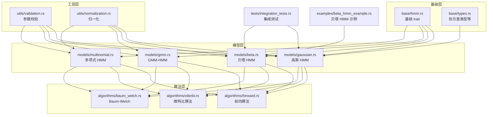
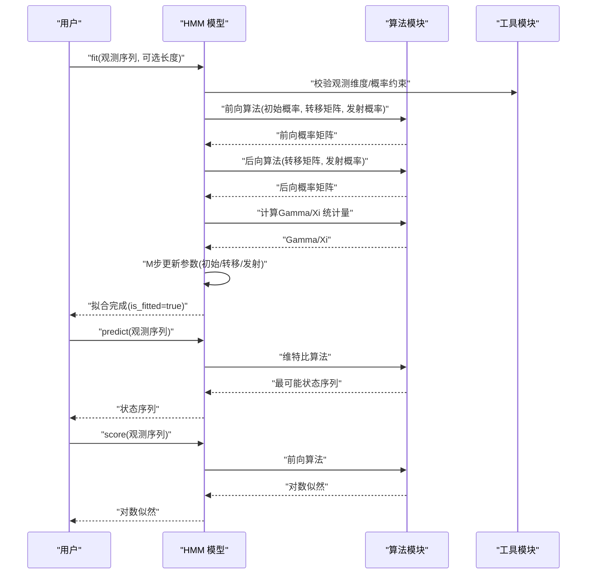
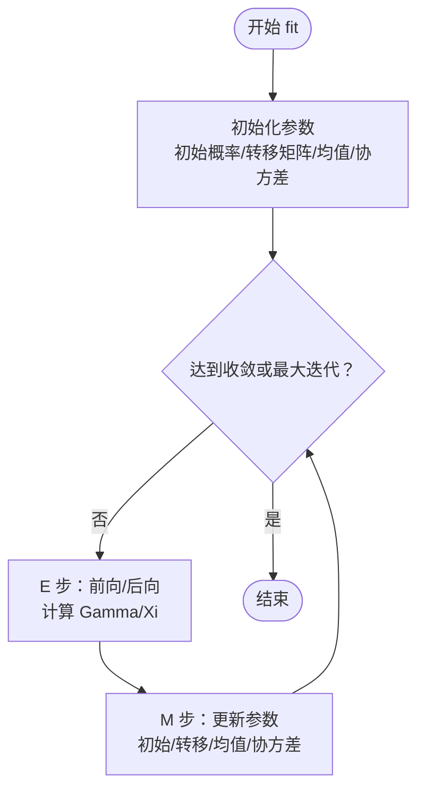
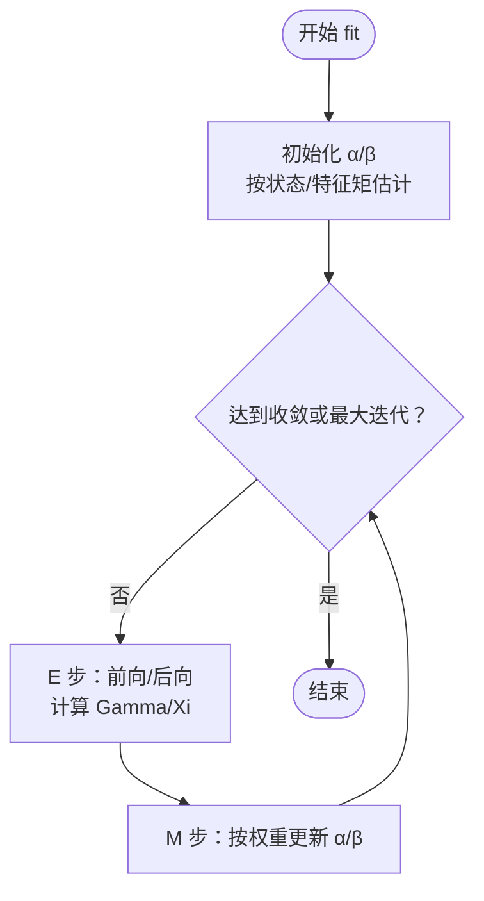
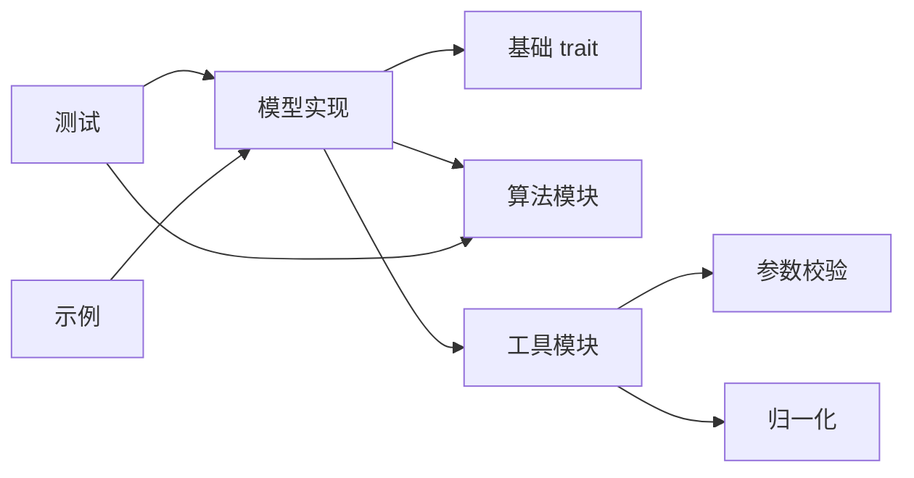

# 模型类型详解

<cite>
**本文引用的文件**
- [README.md](file://README.md)
- [lib.rs](file://src/lib.rs)
- [hmm.rs](file://src/base/hmm.rs)
- [types.rs](file://src/base/types.rs)
- [gaussian.rs](file://src/models/gaussian.rs)
- [beta.rs](file://src/models/beta.rs)
- [gmm.rs](file://src/models/gmm.rs)
- [multinomial.rs](file://src/models/multinomial.rs)
- [validation.rs](file://src/utils/validation.rs)
- [normalization.rs](file://src/utils/normalization.rs)
- [forward.rs](file://src/algorithms/forward.rs)
- [viterbi.rs](file://src/algorithms/viterbi.rs)
- [baowelch.rs](file://src/algorithms/baum_welch.rs)
- [integration_tests.rs](file://tests/integration_tests.rs)
- [beta_hmm_example.rs](file://examples/beta_hmm_example.rs)
</cite>

## 目录
1. [引言](#引言)
2. [项目结构](#项目结构)
3. [核心组件](#核心组件)
4. [架构总览](#架构总览)
5. [详细组件分析](#详细组件分析)
6. [依赖关系分析](#依赖关系分析)
7. [性能考量](#性能考量)
8. [故障排查指南](#故障排查指南)
9. [结论](#结论)
10. [附录](#附录)

## 引言
本文件面向不同类型的隐马尔可夫模型（HMM），系统性地对比与详解以下模型：
- 高斯 HMM：适用于连续观测数据，支持多种协方差类型（对角、球面、完整、连接）
- 贝塔 HMM：适用于区间 [0,1] 的比例/比率数据（如转化率、份额）
- 多项式 HMM：用于离散分类观测（当前仓库中尚未实现）
- 高斯混合模型 HMM（GMM-HMM）：用于复杂连续分布建模（当前仓库中尚未实现）

文档将从数学表示、适用场景、参数设置、协方差类型选择策略、参数初始化、训练收敛条件、性能特征对比等方面进行深入解析，并提供实际数据适配示例与模型选择指导。

## 项目结构
该仓库采用模块化组织，核心模块包括：
- base：定义 HMM 核心 trait 与通用类型（如协方差类型）
- models：各模型实现（高斯、贝塔、GMM、多项式）
- algorithms：前向、后向、维特比、Baum-Welch 等算法
- utils：参数校验、归一化、序列切分等工具
- tests：集成测试与单元测试
- examples：使用示例（如贝塔 HMM 示例）

图表来源
- [lib.rs](file://src/lib.rs#L19-L28)
- [hmm.rs](file://src/base/hmm.rs#L6-L61)
- [types.rs](file://src/base/types.rs#L17-L29)
- [gaussian.rs](file://src/models/gaussian.rs#L328-L612)
- [beta.rs](file://src/models/beta.rs#L384-L669)
- [gmm.rs](file://src/models/gmm.rs#L44-L107)
- [multinomial.rs](file://src/models/multinomial.rs#L35-L94)
- [forward.rs](file://src/algorithms/forward.rs#L20-L69)
- [viterbi.rs](file://src/algorithms/viterbi.rs#L20-L74)
- [baowelch.rs](file://src/algorithms/baum_welch.rs#L25-L44)
- [validation.rs](file://src/utils/validation.rs#L6-L74)
- [normalization.rs](file://src/utils/normalization.rs#L5-L35)
- [integration_tests.rs](file://tests/integration_tests.rs#L10-L27)
- [beta_hmm_example.rs](file://examples/beta_hmm_example.rs#L15-L265)

章节来源
- [lib.rs](file://src/lib.rs#L19-L28)
- [README.md](file://README.md#L1-L303)

## 核心组件
- 基础 trait：所有 HMM 模型均实现统一接口，包括拟合、预测（维特比）、评分（对数似然）、采样与解码（同时返回对数似然与路径）。
- 协方差类型：高斯 HMM 支持四种协方差类型（完整、对角、球面、连接），通过枚举类型统一管理。
- 参数校验与归一化：提供概率向量与转移矩阵的合法性校验，以及向量/矩阵行的归一化工具，确保数值稳定性。
- 算法实现：前向、后向、维特比、Baum-Welch（EM）等标准算法均已实现，贯穿于各模型训练与推理流程。

章节来源
- [hmm.rs](file://src/base/hmm.rs#L6-L61)
- [types.rs](file://src/base/types.rs#L17-L29)
- [validation.rs](file://src/utils/validation.rs#L6-L74)
- [normalization.rs](file://src/utils/normalization.rs#L5-L35)
- [forward.rs](file://src/algorithms/forward.rs#L20-L69)
- [viterbi.rs](file://src/algorithms/viterbi.rs#L20-L74)
- [baowelch.rs](file://src/algorithms/baum_welch.rs#L25-L44)

## 架构总览
下图展示模型层与算法层的交互关系，以及训练与推理的关键步骤。

图表来源
- [gaussian.rs](file://src/models/gaussian.rs#L337-L491)
- [beta.rs](file://src/models/beta.rs#L393-L547)
- [forward.rs](file://src/algorithms/forward.rs#L20-L69)
- [viterbi.rs](file://src/algorithms/viterbi.rs#L20-L74)
- [baowelch.rs](file://src/algorithms/baum_welch.rs#L56-L74)
- [validation.rs](file://src/utils/validation.rs#L58-L74)

## 详细组件分析

### 高斯 HMM（Gaussian HMM）
- 数学表示
  - 发射分布：多变量高斯分布，参数为每状态的均值向量与协方差矩阵（支持对角、球面、完整、连接四种类型）。
  - 状态转移：由初始概率向量与转移矩阵控制。
- 适用场景
  - 连续观测（如语音特征、金融时间序列、传感器读数、生物信息学序列）。
- 参数设置
  - 协方差类型：通过构造函数或带协方差类型的构造函数指定；默认为对角协方差。
  - 初始参数：若未显式设置，会自动初始化（初始概率均匀、转移矩阵均匀、均值随机、协方差基于数据方差）。
- 协方差类型选择策略
  - 对角协方差：在特征间独立假设下，平衡性能与计算；默认推荐。
  - 球面协方差：单一方差，进一步简化，适合特征尺度相近且无相关性假设。
  - 完整协方差：捕获特征间的相关性，但参数量大、计算成本高。
  - 连接协方差：所有状态共享同一协方差矩阵，降低自由度，提升小样本鲁棒性。
- 训练与收敛
  - 使用 EM（Baum-Welch）算法迭代优化；收敛阈值与最大迭代次数固定在实现中。
  - E 步：前向/后向计算与 Gamma/Xi 统计量；M 步：更新初始概率、转移矩阵与发射参数（均值与协方差）。
- 性能特征
  - 对角/球面协方差实现简洁、速度较快；完整/连接协方差更灵活但计算开销更大。
- 实际数据适配示例
  - 参考 README 中的“快速开始”示例，演示连续数据建模、预测与采样。
- 代码片段路径
  - 构造与协方差类型：[gaussian.rs](file://src/models/gaussian.rs#L34-L70)
  - 发射概率计算（含协方差类型分支）：[gaussian.rs](file://src/models/gaussian.rs#L102-L194)
  - 参数初始化（均值/协方差）：[gaussian.rs](file://src/models/gaussian.rs#L196-L222)
  - Baum-Welch 主循环与统计累积：[gaussian.rs](file://src/models/gaussian.rs#L383-L491)
  - 采样（正态分布）：[gaussian.rs](file://src/models/gaussian.rs#L546-L611)

图表来源
- [gaussian.rs](file://src/models/gaussian.rs#L383-L491)

章节来源
- [gaussian.rs](file://src/models/gaussian.rs#L14-L681)
- [types.rs](file://src/base/types.rs#L17-L29)
- [README.md](file://README.md#L53-L87)

### 贝塔 HMM（Beta HMM）
- 数学表示
  - 发射分布：每状态每特征独立的贝塔分布，参数为 α（形状参数1）与 β（形状参数2），适用于 (0,1) 区间数据。
  - 状态转移：初始概率向量与转移矩阵。
- 适用场景
  - 比例/转化率/份额等在 (0,1) 区间内的数据（如电商转化率、点击率、市场份额）。
- 参数设置
  - 初始化：基于各状态观测的样本均值与方差，用“矩估计法”转换为 α/β 参数；若某状态无样本则回退到整体统计。
  - 训练：EM（Baum-Welch）迭代，M 步以加权样本均值/方差更新 α/β。
- 协方差类型
  - 贝塔 HMM 不涉及协方差类型；其灵活性来自 α/β 的状态与特征维度。
- 训练与收敛
  - E 步：前向/后向与 Gamma/Xi；M 步：按权重更新 α/β。
- 性能特征
  - 对 (0,1) 数据建模稳健；当数据接近边界时，建议使用数值稳定的对数形式（已内置）。
- 实际数据适配示例
  - 参考示例程序，演示转化率分析任务：训练、参数解读（均值/方差）、预测、评分与采样。
- 代码片段路径
  - 发射概率（贝塔 PDF，含对数稳定）：[beta.rs](file://src/models/beta.rs#L116-L197)
  - 矩估计法转 α/β：[beta.rs](file://src/models/beta.rs#L226-L286)
  - 参数初始化（按状态采样/整体统计）：[beta.rs](file://src/models/beta.rs#L227-L270)
  - Baum-Welch 主循环与统计累积：[beta.rs](file://src/models/beta.rs#L393-L547)
  - 采样（贝塔分布）：[beta.rs](file://src/models/beta.rs#L601-L668)

图表来源
- [beta.rs](file://src/models/beta.rs#L393-L547)

章节来源
- [beta.rs](file://src/models/beta.rs#L14-L734)
- [beta_hmm_example.rs](file://examples/beta_hmm_example.rs#L15-L265)
- [README.md](file://README.md#L89-L119)

### 多项式 HMM（Multinomial HMM）
- 当前状态
  - 仓库中尚未实现训练、预测、评分与采样逻辑（占位实现）。
- 适用场景
  - 离散分类观测（如词类标注、DNA 序列建模、天气状态等）。
- 参数设置与训练
  - 观测需满足离散类别约束；后续版本将实现 EM 与维特比。
- 代码片段路径
  - 占位实现与待办注释：[multinomial.rs](file://src/models/multinomial.rs#L19-L94)

章节来源
- [multinomial.rs](file://src/models/multinomial.rs#L1-L95)
- [README.md](file://README.md#L10-L14)

### 高斯混合模型 HMM（GMM-HMM）
- 当前状态
  - 仓库中尚未实现训练、预测、评分与采样逻辑（占位实现）。
- 适用场景
  - 复杂连续分布（多峰/非单峰）建模，每个状态内使用高斯混合。
- 参数设置与训练
  - 每状态混合成分数量 n_mix 作为超参数；协方差类型可配置；后续版本将实现 EM 与维特比。
- 代码片段路径
  - 占位实现与待办注释：[gmm.rs](file://src/models/gmm.rs#L21-L107)

章节来源
- [gmm.rs](file://src/models/gmm.rs#L1-L108)
- [README.md](file://README.md#L10-L14)

## 依赖关系分析
- 模型与算法耦合
  - 各模型均依赖基础 trait 与算法模块（前向/后向/维特比/EM 统计量），形成清晰的分层。
- 工具模块支撑
  - 参数校验与归一化贯穿训练与推理，保证数值稳定性与合法性。
- 错误处理
  - 统一通过错误类型与结果包装，便于在训练/预测阶段快速定位问题。

图表来源
- [hmm.rs](file://src/base/hmm.rs#L6-L61)
- [gaussian.rs](file://src/models/gaussian.rs#L328-L612)
- [beta.rs](file://src/models/beta.rs#L384-L669)
- [validation.rs](file://src/utils/validation.rs#L6-L74)
- [normalization.rs](file://src/utils/normalization.rs#L5-L35)
- [integration_tests.rs](file://tests/integration_tests.rs#L10-L27)
- [beta_hmm_example.rs](file://examples/beta_hmm_example.rs#L15-L265)

章节来源
- [lib.rs](file://src/lib.rs#L19-L28)
- [hmm.rs](file://src/base/hmm.rs#L6-L61)
- [validation.rs](file://src/utils/validation.rs#L6-L74)
- [normalization.rs](file://src/utils/normalization.rs#L5-L35)
- [integration_tests.rs](file://tests/integration_tests.rs#L10-L27)

## 性能考量
- 计算复杂度
  - 前向/后向/维特比的时间复杂度通常为 O(T·N^2)，其中 T 为序列长度，N 为状态数；发射概率计算随特征维度变化。
- 协方差类型影响
  - 对角/球面协方差实现简单、内存占用低；完整/连接协方差参数更多、计算更昂贵。
- 数值稳定性
  - 使用 log 概率与稳定归一化，避免下溢；贝塔 HMM 在 PDF 计算中采用对数形式。
- 并行与向量化
  - 依赖 ndarray 的向量化操作，尽量减少临时对象分配，提高热路径性能。

章节来源
- [README.md](file://README.md#L222-L229)
- [gaussian.rs](file://src/models/gaussian.rs#L155-L194)
- [beta.rs](file://src/models/beta.rs#L173-L197)
- [normalization.rs](file://src/utils/normalization.rs#L25-L35)

## 故障排查指南
- 常见错误与处理
  - 观测为空或维度不匹配：检查输入数组大小与期望特征数；参考参数校验工具。
  - 模型未拟合即预测/评分：先调用 fit，再进行 predict 或 score。
  - 初始概率/转移矩阵非法：确保概率在 [0,1] 且行和为 1。
- 单元测试与集成测试
  - 提供了前向/后向一致性、维特比确定性路径、多序列训练、空观测与未拟合错误等测试用例，可作为调试参考。
- 代码片段路径
  - 参数校验（概率向量/转移矩阵/观测维度）：[validation.rs](file://src/utils/validation.rs#L6-L74)
  - 集成测试（工作流/一致性/错误处理）：[integration_tests.rs](file://tests/integration_tests.rs#L10-L103)

章节来源
- [validation.rs](file://src/utils/validation.rs#L6-L74)
- [integration_tests.rs](file://tests/integration_tests.rs#L88-L103)

## 结论
- 高斯 HMM 适合连续数据，对角协方差为默认首选；完整/连接协方差在需要捕捉相关性或小样本时更具弹性。
- 贝塔 HMM 专治 (0,1) 比例数据，基于 α/β 的矩估计法初始化稳健，EM 训练稳定。
- 多项式与 GMM-HMM 当前处于开发中，后续将覆盖离散分类与复杂密度估计场景。
- 建议根据数据特性（连续/比例/离散/复杂分布）与资源约束（参数规模/计算成本）选择模型与协方差类型；优先使用默认设置并结合示例与测试进行验证。

## 附录
- 模型选择指导原则
  - 连续数据：优先高斯 HMM，默认对角协方差；若特征强相关或需更高精度，考虑完整/连接协方差。
  - 比例/比率数据：优先贝塔 HMM，天然限制在 (0,1)。
  - 离散分类数据：等待多项式 HMM 实现。
  - 复杂密度估计：等待 GMM-HMM 实现。
- 实际数据适配建议
  - 高斯 HMM：注意特征缩放与协方差初始化；多序列训练时提供正确长度列表。
  - 贝塔 HMM：确保观测严格在 (0,1)；必要时对边界值做微小夹紧以避免数值问题。
- 参考示例
  - 高斯 HMM 快速开始与多序列训练：[README.md](file://README.md#L53-L87)
  - 贝塔 HMM 转化率分析全流程：[beta_hmm_example.rs](file://examples/beta_hmm_example.rs#L15-L265)