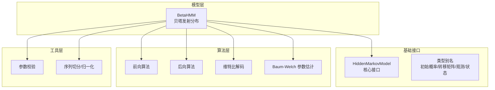
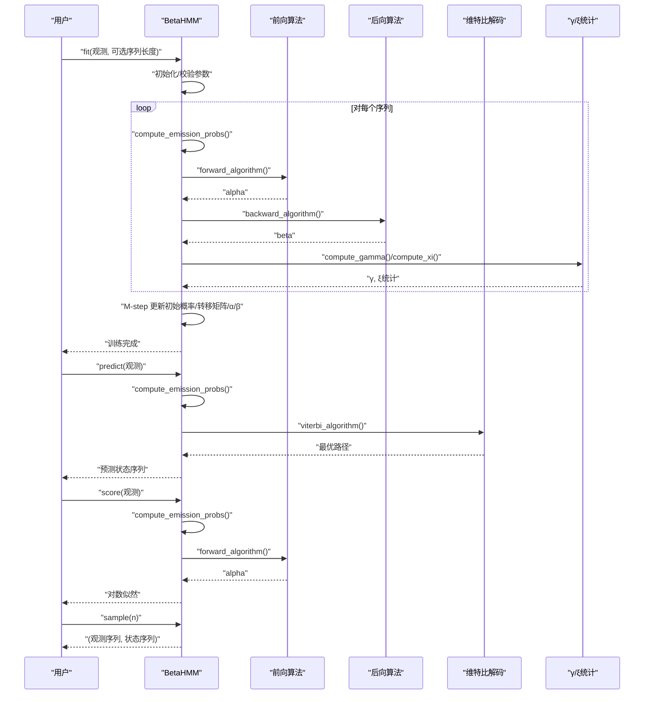
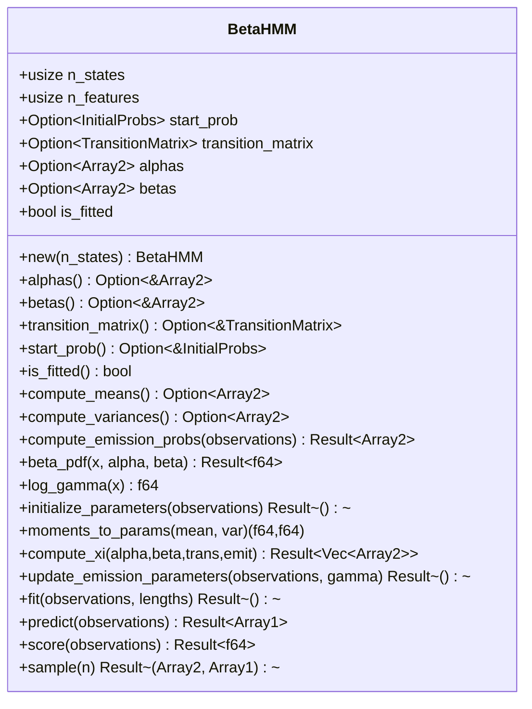
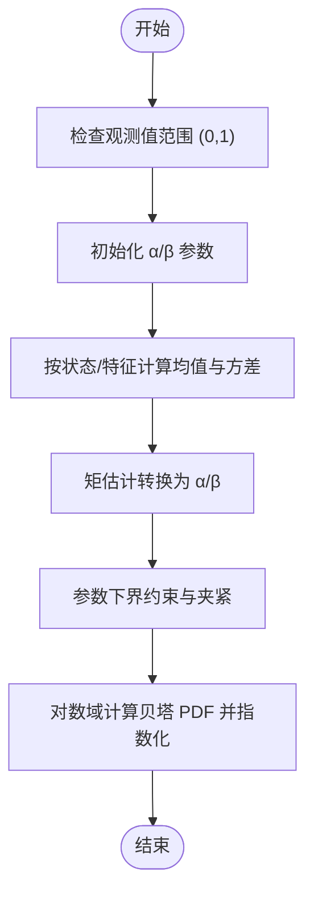
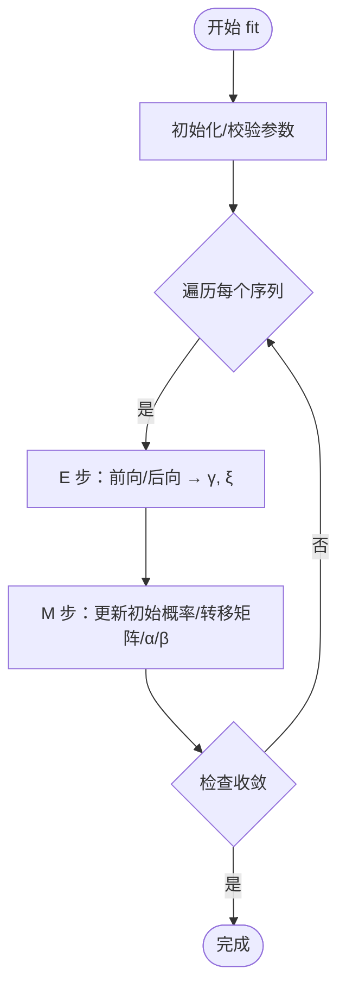
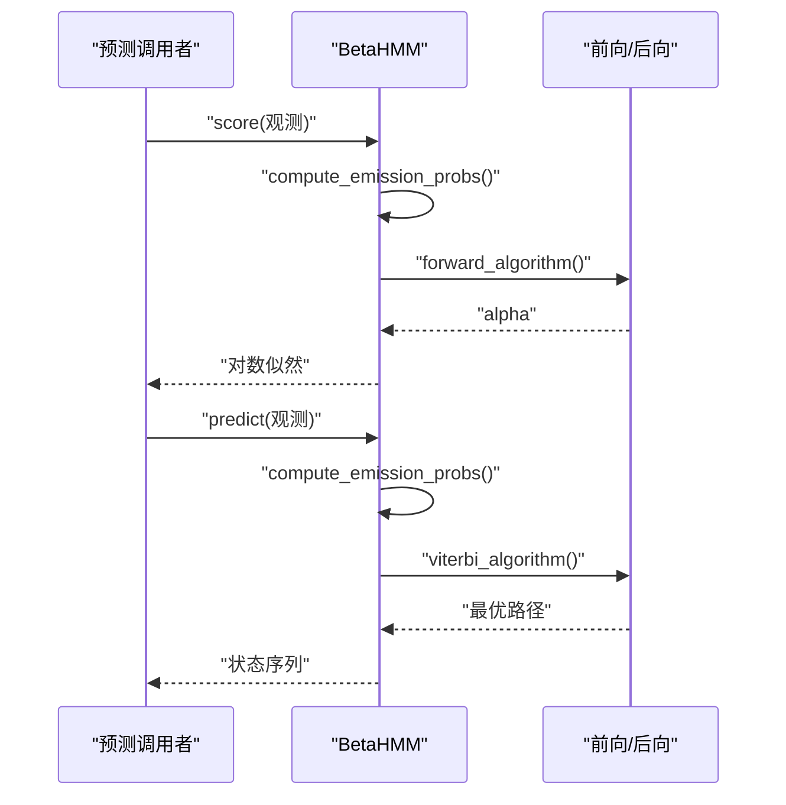
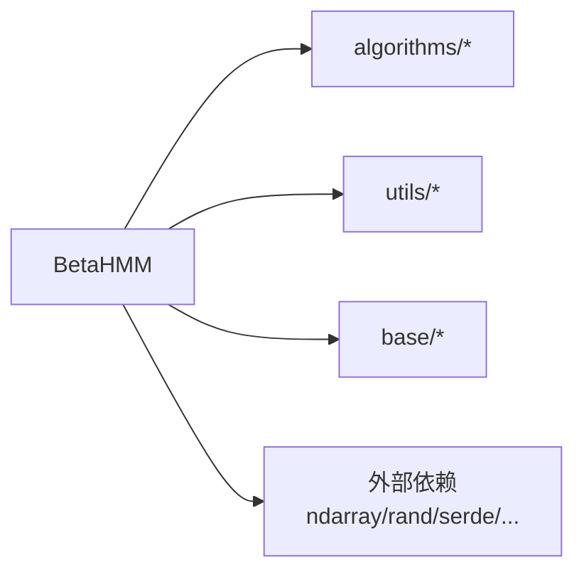

# 贝塔 HMM

<cite>
**本文引用的文件**
- [README.md](file://README.md)
- [Cargo.toml](file://Cargo.toml)
- [src/lib.rs](file://src/lib.rs)
- [src/models/beta.rs](file://src/models/beta.rs)
- [src/base/hmm.rs](file://src/base/hmm.rs)
- [src/base/types.rs](file://src/base/types.rs)
- [src/algorithms/mod.rs](file://src/algorithms/mod.rs)
- [src/algorithms/forward.rs](file://src/algorithms/forward.rs)
- [src/algorithms/backward.rs](file://src/algorithms/backward.rs)
- [src/algorithms/viterbi.rs](file://src/algorithms/viterbi.rs)
- [src/algorithms/baum_welch.rs](file://src/algorithms/baum_welch.rs)
- [src/utils/validation.rs](file://src/utils/validation.rs)
- [examples/beta_hmm_example.rs](file://examples/beta_hmm_example.rs)
</cite>

## 目录
1. [简介](#简介)
2. [项目结构](#项目结构)
3. [核心组件](#核心组件)
4. [架构总览](#架构总览)
5. [详细组件分析](#详细组件分析)
6. [依赖关系分析](#依赖关系分析)
7. [性能与数值稳定性](#性能与数值稳定性)
8. [故障排查指南](#故障排查指南)
9. [结论](#结论)
10. [附录：使用示例与对比](#附录使用示例与对比)

## 简介
本文件为贝塔 HMM（Beta Hidden Markov Model）提供全面技术文档。贝塔 HMM 使用贝塔分布作为发射概率模型，适用于观测值位于开区间 (0,1) 的连续比例或概率数据，如转化率、点击通过率、市场份额占比等。该模型基于标准 HMM 的框架，采用期望最大化（EM）在 Baum-Welch 算法中进行参数估计，支持多序列训练、Viterbi 解码、对数似然评分与采样。

本库以 Rust 实现，使用 ndarray 进行高效数值计算，并提供日志空间运算与数值稳定策略，确保在高维与长序列场景下的稳健性。

## 项目结构
仓库采用模块化组织，核心模块如下：
- models：各 HMM 模型实现，其中包含 BetaHMM
- base：公共 trait 与类型别名定义
- algorithms：前向、后向、维特比、Baum-Welch 等算法
- utils：校验、归一化、序列切分等工具
- examples：示例程序（含贝塔 HMM 的完整用例）
- tests：集成测试（包含贝塔 HMM 的单元测试）

图表来源
- [src/models/beta.rs](file://src/models/beta.rs#L1-L734)
- [src/base/hmm.rs](file://src/base/hmm.rs#L1-L62)
- [src/base/types.rs](file://src/base/types.rs#L1-L61)
- [src/algorithms/forward.rs](file://src/algorithms/forward.rs#L1-L129)
- [src/algorithms/backward.rs](file://src/algorithms/backward.rs#L1-L90)
- [src/algorithms/viterbi.rs](file://src/algorithms/viterbi.rs#L1-L118)
- [src/algorithms/baum_welch.rs](file://src/algorithms/baum_welch.rs#L1-L75)
- [src/utils/validation.rs](file://src/utils/validation.rs#L1-L141)

章节来源
- [src/lib.rs](file://src/lib.rs#L1-L28)
- [README.md](file://README.md#L1-L303)

## 核心组件
- 贝塔 HMM（BetaHMM）
  - 发射分布：每个状态对每个特征使用独立的贝塔分布（α、β 形状参数）
  - 观测范围：要求观测值严格位于 (0,1)，内部会进行范围夹紧与校验
  - 参数估计：基于 EM 的 Baum-Welch 算法，更新初始概率、转移矩阵与 α/β 参数
  - 推理：支持 Viterbi 最优路径解码与对数似然评分
  - 采样：从已训练模型生成新样本序列
- 核心接口（HiddenMarkovModel）
  - 统一的 fit/predict/score/sample/decode 方法签名
- 算法实现
  - 前向/后向：用于计算前向变量、后向变量与 γ、ξ 统计量
  - 维特比：用于最优状态路径解码
  - Baum-Welch：EM 参数估计流程（在 BetaHMM 中完整实现）
- 工具与校验
  - 初始概率与转移矩阵的合法性校验
  - 观测维度一致性检查
  - 序列长度切分与默认长度生成

章节来源
- [src/models/beta.rs](file://src/models/beta.rs#L1-L734)
- [src/base/hmm.rs](file://src/base/hmm.rs#L1-L62)
- [src/algorithms/forward.rs](file://src/algorithms/forward.rs#L1-L129)
- [src/algorithms/backward.rs](file://src/algorithms/backward.rs#L1-L90)
- [src/algorithms/viterbi.rs](file://src/algorithms/viterbi.rs#L1-L118)
- [src/algorithms/baum_welch.rs](file://src/algorithms/baum_welch.rs#L1-L75)
- [src/utils/validation.rs](file://src/utils/validation.rs#L1-L141)

## 架构总览
下图展示了贝塔 HMM 的训练与推理主流程，以及与算法模块的交互关系：

图表来源
- [src/models/beta.rs](file://src/models/beta.rs#L393-L668)
- [src/algorithms/forward.rs](file://src/algorithms/forward.rs#L20-L47)
- [src/algorithms/backward.rs](file://src/algorithms/backward.rs#L19-L44)
- [src/algorithms/viterbi.rs](file://src/algorithms/viterbi.rs#L20-L74)
- [src/algorithms/baum_welch.rs](file://src/algorithms/baum_welch.rs#L56-L74)

## 详细组件分析

### 贝塔 HMM 类设计与职责
- 结构体字段
  - n_states/n_features：隐藏状态数与特征维数
  - start_prob/transition_matrix：初始概率与状态转移矩阵
  - alphas/betas：每个状态每个特征的贝塔分布形状参数
  - is_fitted：是否已完成训练
- 关键方法
  - 新建与访问器：new、alphas、betas、transition_matrix、start_prob、is_fitted
  - 统计量：compute_means、compute_variances
  - 发射概率：compute_emission_probs（逐样本逐状态计算 PDF）
  - 贝塔 PDF：beta_pdf（对数域计算，避免数值下溢）
  - 参数初始化：initialize_parameters（按时间步随机分配观测到状态，再用矩估计转换为 α/β）
  - 参数更新：update_emission_parameters（基于 γ 的加权均值与方差，再转回 α/β）
  - Baum-Welch 主流程：fit（E-step/M-step 循环，收敛判断）
  - 推理与采样：predict（Viterbi）、score（前向求对数似然）、sample（按状态转移与贝塔采样）

图表来源
- [src/models/beta.rs](file://src/models/beta.rs#L24-L668)

章节来源
- [src/models/beta.rs](file://src/models/beta.rs#L1-L734)

### 发射概率与贝塔分布
- 参数化
  - 每个状态 i 与每个特征 j 配置一对形状参数 (α[i,j], β[i,j])，控制分布的均值与方差
  - 均值 = α/(α+β)，方差 = (αβ)/((α+β)^2(α+β+1))
- 数值稳定性
  - 使用对数 PDF 并借助对数伽马函数 log Γ(x) 进行稳定计算
  - 观测值在 (0,1) 区间内进行夹紧，参数 α/β 下界约束，避免极端情况
- 初始化策略
  - 若某状态下无观测，则退回到整体样本的均值与方差，再用矩估计转换为 α/β
  - 否则对每个状态计算其观测的加权均值与方差，再转为 α/β

图表来源
- [src/models/beta.rs](file://src/models/beta.rs#L126-L197)
- [src/models/beta.rs](file://src/models/beta.rs#L227-L286)

章节来源
- [src/models/beta.rs](file://src/models/beta.rs#L116-L197)
- [src/models/beta.rs](file://src/models/beta.rs#L226-L286)

### 参数估计与收敛
- 训练流程（Baum-Welch）
  - E 步：计算前向/后向变量，得到 γ（状态占用概率）与 ξ（状态转移概率）
  - M 步：更新
    - 初始概率：由 γ 在 t=0 的累积归一化
    - 转移矩阵：由 ξ 在时间 t 的累积按行归一化
    - α/β：由 γ 加权均值与方差，再经矩估计转换
  - 收敛：对数似然增量小于阈值或达到最大迭代次数
- 多序列支持
  - 通过 lengths 将拼接序列切分为多个子序列，分别计算 α/β 与统计量，最后汇总更新

图表来源
- [src/models/beta.rs](file://src/models/beta.rs#L393-L547)
- [src/algorithms/forward.rs](file://src/algorithms/forward.rs#L20-L47)
- [src/algorithms/backward.rs](file://src/algorithms/backward.rs#L19-L44)
- [src/algorithms/baum_welch.rs](file://src/algorithms/baum_welch.rs#L56-L74)

章节来源
- [src/models/beta.rs](file://src/models/beta.rs#L393-L547)

### 推理与采样
- Viterbi 解码：在已知发射概率与转移矩阵下，寻找最可能的状态序列
- 对数似然评分：利用前向算法在最终时刻对所有状态的累加取对数
- 采样：从初始分布抽取首状态与首观测；随后每一步依据转移概率抽新状态，并按当前状态的贝塔分布抽取新观测

图表来源
- [src/models/beta.rs](file://src/models/beta.rs#L574-L599)
- [src/models/beta.rs](file://src/models/beta.rs#L549-L572)
- [src/algorithms/forward.rs](file://src/algorithms/forward.rs#L20-L47)
- [src/algorithms/viterbi.rs](file://src/algorithms/viterbi.rs#L20-L74)

章节来源
- [src/models/beta.rs](file://src/models/beta.rs#L549-L599)

### 参数更新规则与共轭先验
- 参数更新
  - 初始概率与转移矩阵：标准频率计数归一化
  - α/β：基于 γ 的加权均值与方差，再用矩估计转换
- 共轭先验
  - 贝塔分布作为二项式/伯努利的共轭先验，适合比例数据；在本实现中通过矩估计与 EM 进行参数学习，未显式引入正则化超参数
- 初始化
  - 若某状态无观测，退回到总体样本的均值/方差，保证 α/β 的可计算性与合理性

章节来源
- [src/models/beta.rs](file://src/models/beta.rs#L334-L381)
- [src/models/beta.rs](file://src/models/beta.rs#L226-L286)

### 典型应用场景
- 生物信息学：比例数据（如等位基因频率、甲基化比例）建模
- 金融建模：市场份额、资产配置比例的时间演化
- 市场研究：转化率、点击通过率、满意度比例的隐状态建模
- 质量控制：合格率、缺陷率的比例变化检测

章节来源
- [README.md](file://README.md#L121-L139)

## 依赖关系分析
- 内部模块依赖
  - BetaHMM 依赖 algorithms（前向/后向/维特比/γ/ξ）、utils（校验/序列切分/归一化）、base（接口与类型）
- 外部依赖
  - ndarray、ndarray-linalg：高性能数组与线性代数
  - rand/rand_distr：随机数与概率分布采样
  - serde：序列化支持
  - thiserror：错误处理

图表来源
- [src/models/beta.rs](file://src/models/beta.rs#L1-L39)
- [Cargo.toml](file://Cargo.toml#L13-L19)

章节来源
- [Cargo.toml](file://Cargo.toml#L1-L23)

## 性能与数值稳定性
- 数值稳定
  - 对数域计算 PDF 与对数伽马函数，避免乘积下溢
  - 观测值与参数夹紧至 (ε, 1-ε) 与 [ε, +∞)，防止边界问题
  - γ 归一化使用专用工具函数，避免每步重复归一化
- 计算效率
  - 向量化操作与广播（如 xi 的矩阵乘与归一化）
  - 多序列训练时按序列独立计算，减少跨序列边界干扰
- 收敛与迭代
  - 固定最大迭代次数与对数似然阈值，平衡精度与速度

章节来源
- [src/models/beta.rs](file://src/models/beta.rs#L173-L224)
- [src/models/beta.rs](file://src/models/beta.rs#L300-L332)
- [src/algorithms/baum_welch.rs](file://src/algorithms/baum_welch.rs#L56-L74)

## 故障排查指南
- 常见错误与处理
  - 观测不在 (0,1)：抛出无效参数错误；请预处理或使用其他模型
  - 维度不匹配：观测列数与 n_features 不一致；请检查数据与模型设置
  - 未拟合即预测/评分：返回模型未拟合错误；请先 fit
  - 转移矩阵/初始概率非法：行和不为 1 或包含负值；请检查初始化
- 调试建议
  - 打印中间统计量（α/β、γ、ξ）与对数似然曲线，观察收敛行为
  - 检查 α/β 是否出现极小或极大值，必要时调整初始化策略
  - 对于多序列数据，确认 lengths 与观测拼接顺序一致

章节来源
- [src/models/beta.rs](file://src/models/beta.rs#L126-L145)
- [src/utils/validation.rs](file://src/utils/validation.rs#L6-L74)
- [src/base/hmm.rs](file://src/base/hmm.rs#L14-L20)

## 结论
贝塔 HMM 提供了针对 (0,1) 比例数据的稳健 HMM 实现，具备良好的数值稳定性与高效的 EM 训练流程。通过贝塔发射分布与矩估计，模型能够自然地拟合转化率、点击率等比例指标，并结合 Viterbi 解码与对数似然评分支持序列建模与状态推断。对于需要处理比例/概率数据的领域（如金融、市场研究、生物信息学），贝塔 HMM 是一个实用且可扩展的选择。

## 附录：使用示例与对比

### 示例：贝塔 HMM 的完整用法
- 训练与参数查看：创建模型、拟合并打印 α/β、均值、方差、转移矩阵与初始概率
- 预测与评分：对历史数据进行状态推断与对数似然评估
- 采样与新数据预测：从模型生成合成数据，并对新观测进行状态预测

章节来源
- [examples/beta_hmm_example.rs](file://examples/beta_hmm_example.rs#L1-L266)

### 与其他 HMM 模型的对比要点
- 高斯 HMM：适用于连续标量/向量观测，发射分布为高斯；贝塔 HMM 适用于 (0,1) 比例数据
- 多项式 HMM：适用于离散类别观测；贝塔 HMM 适用于连续比例
- GMM-HMM：适用于复杂连续分布的混合建模；贝塔 HMM 以单峰贝塔近似比例数据

章节来源
- [README.md](file://README.md#L10-L20)
- [README.md](file://README.md#L174-L193)