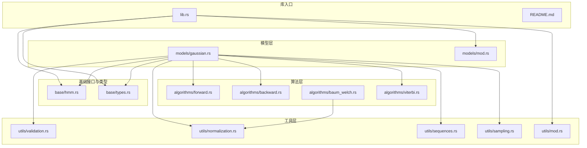
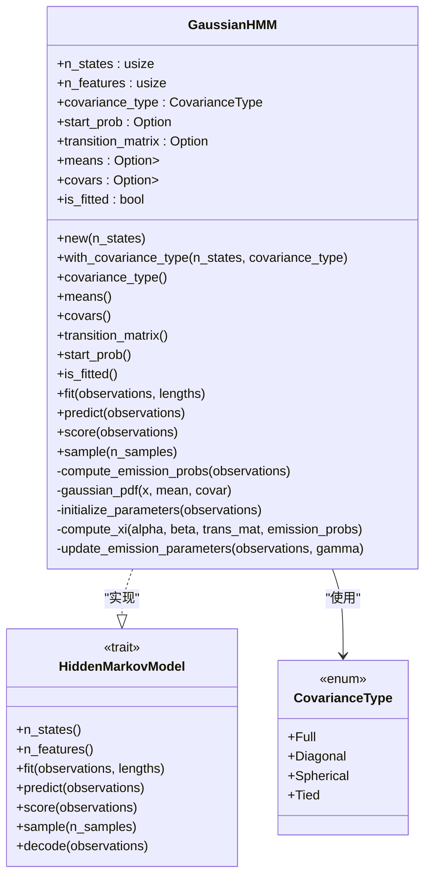
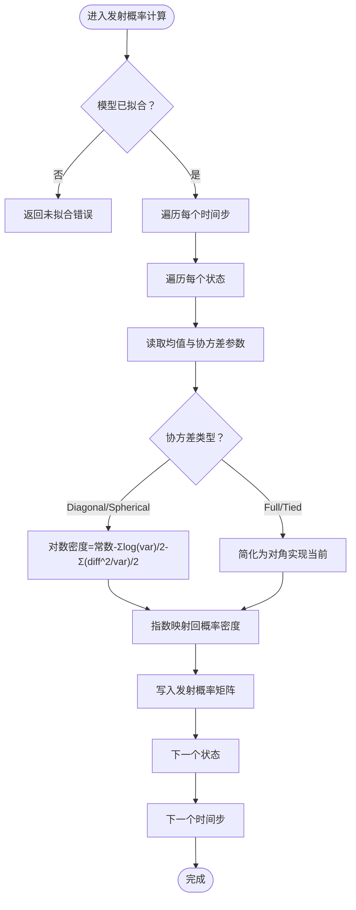
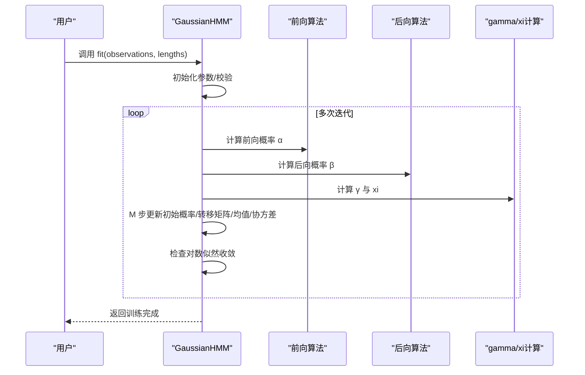
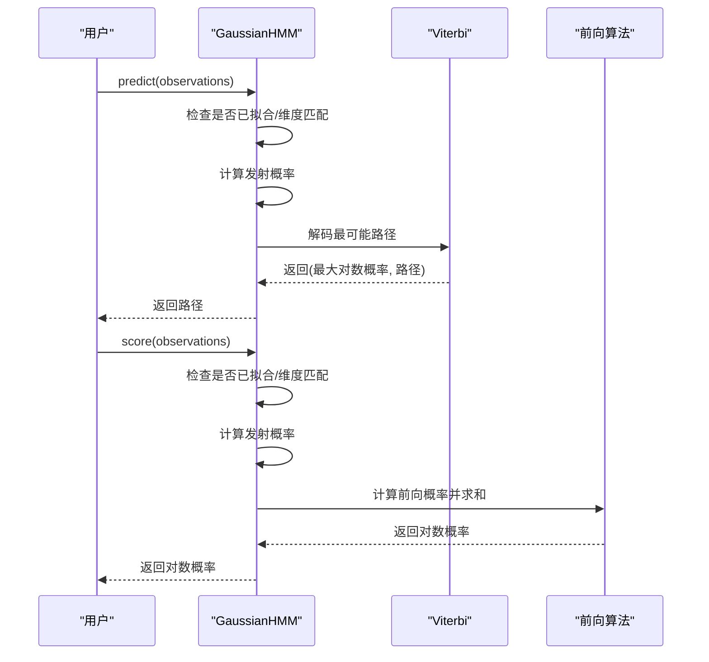
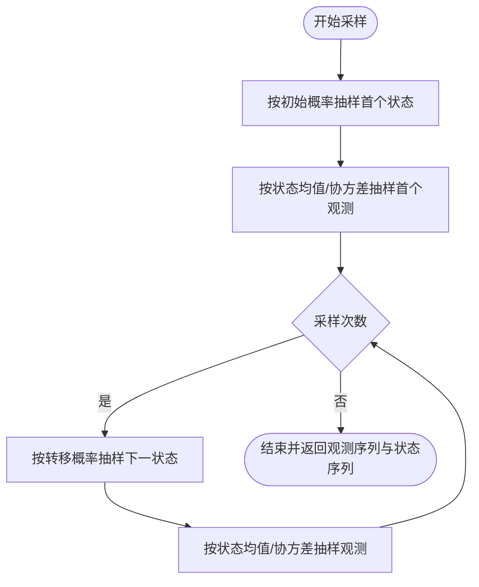
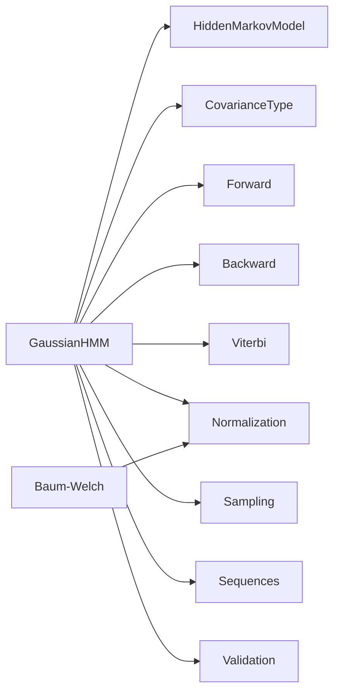

# 高斯 HMM

<cite>
**本文引用的文件**
- [src/lib.rs](file://src/lib.rs)
- [README.md](file://README.md)
- [src/models/gaussian.rs](file://src/models/gaussian.rs)
- [src/base/hmm.rs](file://src/base/hmm.rs)
- [src/base/types.rs](file://src/base/types.rs)
- [src/algorithms/forward.rs](file://src/algorithms/forward.rs)
- [src/algorithms/backward.rs](file://src/algorithms/backward.rs)
- [src/algorithms/baum_welch.rs](file://src/algorithms/baum_welch.rs)
- [src/algorithms/viterbi.rs](file://src/algorithms/viterbi.rs)
- [src/utils/validation.rs](file://src/utils/validation.rs)
- [src/utils/normalization.rs](file://src/utils/normalization.rs)
- [src/utils/sequences.rs](file://src/utils/sequences.rs)
- [src/utils/sampling.rs](file://src/utils/sampling.rs)
- [examples/beta_hmm_example.rs](file://examples/beta_hmm_example.rs)
- [Cargo.toml](file://Cargo.toml)
</cite>

## 目录
1. [简介](#简介)
2. [项目结构](#项目结构)
3. [核心组件](#核心组件)
4. [架构总览](#架构总览)
5. [详细组件分析](#详细组件分析)
6. [依赖关系分析](#依赖关系分析)
7. [性能考量](#性能考量)
8. [故障排查指南](#故障排查指南)
9. [结论](#结论)
10. [附录：API 使用示例与最佳实践](#附录api-使用示例与最佳实践)

## 简介
本文件面向高斯隐马尔可夫模型（Gaussian HMM）的实现与使用，系统阐述其数学原理、代码结构、算法流程与工程实践。重点覆盖以下方面：
- 高斯发射概率的数学基础与四种协方差类型的差异与适用场景
- 参数初始化策略、Baum-Welch 算法的 E 步与 M 步实现、状态转移概率更新机制
- 完整 API 使用示例：模型创建、训练、预测、评分、采样
- 协方差类型对模型性能与计算复杂度的影响及选择建议
- 数值稳定性、收敛判断与错误处理的最佳实践

## 项目结构
该仓库采用模块化组织，按“模型-算法-工具-基础类型”分层设计，便于扩展与维护。

**图表来源**
- [src/lib.rs](file://src/lib.rs#L19-L27)
- [src/models/gaussian.rs](file://src/models/gaussian.rs#L1-L120)
- [src/base/hmm.rs](file://src/base/hmm.rs#L6-L61)
- [src/base/types.rs](file://src/base/types.rs#L17-L29)
- [src/algorithms/forward.rs](file://src/algorithms/forward.rs#L20-L47)
- [src/algorithms/backward.rs](file://src/algorithms/backward.rs#L19-L44)
- [src/algorithms/baum_welch.rs](file://src/algorithms/baum_welch.rs#L25-L44)
- [src/algorithms/viterbi.rs](file://src/algorithms/viterbi.rs#L20-L74)
- [src/utils/validation.rs](file://src/utils/validation.rs#L6-L74)
- [src/utils/normalization.rs](file://src/utils/normalization.rs#L5-L35)
- [src/utils/sequences.rs](file://src/utils/sequences.rs#L16-L83)
- [src/utils/sampling.rs](file://src/utils/sampling.rs#L7-L70)

**章节来源**
- [src/lib.rs](file://src/lib.rs#L1-L28)
- [README.md](file://README.md#L1-L303)

## 核心组件
- 隐马尔可夫模型核心接口：定义统一的训练、预测、评分、采样与解码能力。
- 高斯 HMM 实现：封装状态数、特征维数、初始概率、转移矩阵、均值与协方差等参数；提供发射概率计算、参数初始化、Baum-Welch 训练、Viterbi 预测、前向/后向算法支持、采样生成等。
- 基础类型：协方差类型枚举（对角、球面、完整、连接），以及常用数组别名。
- 算法模块：前向、后向、维特比、Baum-Welch 统计量（gamma/xi）计算。
- 工具模块：参数校验、归一化（含对数空间）、序列切分、离散/高斯采样。

**章节来源**
- [src/base/hmm.rs](file://src/base/hmm.rs#L6-L61)
- [src/models/gaussian.rs](file://src/models/gaussian.rs#L14-L100)
- [src/base/types.rs](file://src/base/types.rs#L17-L29)
- [src/algorithms/forward.rs](file://src/algorithms/forward.rs#L20-L47)
- [src/algorithms/backward.rs](file://src/algorithms/backward.rs#L19-L44)
- [src/algorithms/viterbi.rs](file://src/algorithms/viterbi.rs#L20-L74)
- [src/algorithms/baum_welch.rs](file://src/algorithms/baum_welch.rs#L25-L44)
- [src/utils/validation.rs](file://src/utils/validation.rs#L6-L74)
- [src/utils/normalization.rs](file://src/utils/normalization.rs#L5-L35)
- [src/utils/sequences.rs](file://src/utils/sequences.rs#L53-L83)
- [src/utils/sampling.rs](file://src/utils/sampling.rs#L51-L70)

## 架构总览
下图展示高斯 HMM 的核心类与依赖关系，以及训练与推理的关键调用链。

**图表来源**
- [src/models/gaussian.rs](file://src/models/gaussian.rs#L14-L100)
- [src/base/hmm.rs](file://src/base/hmm.rs#L6-L61)
- [src/base/types.rs](file://src/base/types.rs#L17-L29)

## 详细组件分析

### 协方差类型与发射概率
- 对角协方差（Diagonal）
  - 每个状态仅保留各维度的方差，协方差为零，计算高效且稳定。
  - 适合大多数连续特征场景，平衡性能与拟合能力。
- 球面协方方差（Spherical）
  - 所有维度共享同一方差，进一步简化参数，提升稀疏小样本下的稳定性。
  - 适合各维度尺度相近、噪声水平一致的数据。
- 完整协方差（Full）
  - 每个状态保存完整的正定协方差矩阵，能捕获维度间的相关性。
  - 计算与存储开销大，需谨慎处理数值稳定性与正定性。
- 连接协方差（Tied）
  - 各状态共享同一协方差矩阵，降低参数数量，提高稳定性。
  - 适合状态间协方差相似的场景。

在当前实现中，完整与连接协方差通过简化版对角实现以规避矩阵求逆等高成本操作；若需完整矩阵运算，应在相应位置扩展实现。

**章节来源**
- [src/base/types.rs](file://src/base/types.rs#L17-L29)
- [src/models/gaussian.rs](file://src/models/gaussian.rs#L155-L194)

### 发射概率计算与数值稳定性
- 对于给定观测 x、均值 μ 与协方差 Σ，高斯密度的对数形式通常为：
  - 常数项与特征维数相关；
  - 与协方差矩阵的行列式与马氏距离有关；
  - 为避免溢出/下溢，实际实现多在对数空间进行计算。
- 当前实现针对不同协方差类型分别优化：
  - 对角/球面：直接累加对数方差与马氏距离项；
  - 完整/连接：当前简化为对角版本，完整实现需引入矩阵分解与求逆。

**图表来源**
- [src/models/gaussian.rs](file://src/models/gaussian.rs#L111-L134)
- [src/models/gaussian.rs](file://src/models/gaussian.rs#L147-L194)

**章节来源**
- [src/models/gaussian.rs](file://src/models/gaussian.rs#L111-L194)

### 参数初始化策略
- 初始状态概率：均匀初始化，保证随机性与可训练性。
- 转移矩阵：均匀初始化，确保每状态下一步可达其他状态。
- 均值：从观测集中随机采样若干点作为初始均值。
- 协方差：基于全数据各维度方差设定最小阈值，避免退化。

初始化完成后，模型标记为已拟合，随后进入 Baum-Welch 迭代。

**章节来源**
- [src/models/gaussian.rs](file://src/models/gaussian.rs#L196-L222)
- [src/models/gaussian.rs](file://src/models/gaussian.rs#L357-L381)

### Baum-Welch 算法：E 步与 M 步
- E 步
  - 计算前向概率 α 与后向概率 β；
  - 由 α、β 归一化得到状态占用概率 γ；
  - 由 α、β、转移矩阵与发射概率计算转移概率统计 xi。
- M 步
  - 更新初始概率：以首时刻 γ 的和归一化；
  - 更新转移矩阵：按行归一化累积转移计数；
  - 更新发射参数（均值与协方差）：基于 γ 加权均值与方差，设置最小方差以保持正定性。

**图表来源**
- [src/models/gaussian.rs](file://src/models/gaussian.rs#L337-L491)
- [src/algorithms/forward.rs](file://src/algorithms/forward.rs#L20-L47)
- [src/algorithms/backward.rs](file://src/algorithms/backward.rs#L19-L44)
- [src/algorithms/baum_welch.rs](file://src/algorithms/baum_welch.rs#L46-L74)

**章节来源**
- [src/models/gaussian.rs](file://src/models/gaussian.rs#L337-L491)
- [src/algorithms/forward.rs](file://src/algorithms/forward.rs#L20-L47)
- [src/algorithms/backward.rs](file://src/algorithms/backward.rs#L19-L44)
- [src/algorithms/baum_welch.rs](file://src/algorithms/baum_welch.rs#L46-L74)

### 状态转移概率更新机制
- 初始概率：按各时间步首状态的 γ 和进行归一化。
- 转移矩阵：按行累积 xi 并行归一化，确保每行和为 1。
- 发射参数：均值按 γ 加权观测均值，协方差按 γ 加权残差平方均值得到，并施加最小方差阈值。

**章节来源**
- [src/models/gaussian.rs](file://src/models/gaussian.rs#L461-L487)
- [src/models/gaussian.rs](file://src/models/gaussian.rs#L272-L325)

### 预测与评分（Viterbi 与前向）
- 预测：使用 Viterbi 算法在对数空间寻找最可能的状态路径。
- 评分：使用前向算法计算观测序列的对数概率。

**图表来源**
- [src/models/gaussian.rs](file://src/models/gaussian.rs#L493-L544)
- [src/algorithms/viterbi.rs](file://src/algorithms/viterbi.rs#L20-L74)
- [src/algorithms/forward.rs](file://src/algorithms/forward.rs#L60-L69)

**章节来源**
- [src/models/gaussian.rs](file://src/models/gaussian.rs#L493-L544)
- [src/algorithms/viterbi.rs](file://src/algorithms/viterbi.rs#L20-L74)
- [src/algorithms/forward.rs](file://src/algorithms/forward.rs#L60-L69)

### 采样（生成合成数据）
- 从初始概率抽取首个状态；
- 从对应状态的高斯分布抽取首个观测；
- 循环：依据当前状态的转移概率抽取下一状态，再据此抽取观测。

**图表来源**
- [src/models/gaussian.rs](file://src/models/gaussian.rs#L546-L611)
- [src/utils/sampling.rs](file://src/utils/sampling.rs#L51-L70)

**章节来源**
- [src/models/gaussian.rs](file://src/models/gaussian.rs#L546-L611)
- [src/utils/sampling.rs](file://src/utils/sampling.rs#L51-L70)

## 依赖关系分析
- 模块耦合
  - GaussianHMM 强依赖基础接口与类型，弱依赖算法与工具模块，内聚性良好。
  - 算法模块彼此独立，通过共享的数组类型与工具函数协作。
- 外部依赖
  - ndarray、ndarray-linalg：高性能数组与线性代数运算。
  - rand、rand_distr：随机数与概率分布采样。
  - thiserror、serde：错误处理与序列化支持。

**图表来源**
- [src/models/gaussian.rs](file://src/models/gaussian.rs#L3-L9)
- [src/algorithms/baum_welch.rs](file://src/algorithms/baum_welch.rs#L3-L6)
- [src/utils/normalization.rs](file://src/utils/normalization.rs#L3-L4)

**章节来源**
- [Cargo.toml](file://Cargo.toml#L13-L22)

## 性能考量
- 计算复杂度
  - 训练阶段：对每个序列执行 O(T·N^2) 的前向/后向与 M 步更新（T 为长度，N 为状态数）。当前完整协方差实现简化为对角，避免矩阵求逆带来的额外开销。
- 存储复杂度
  - 每状态均值与协方差分别存储为 (N×F) 与 (N×F) 或 (N×F×F)，其中 F 为特征维数。
- 数值稳定性
  - 对数空间计算与对数归一化，避免直接概率相乘导致的下溢。
  - 协方差添加最小阈值，防止奇异与除零。
- 收敛判断
  - 以对数似然增量的绝对值小于阈值作为停止条件；限制最大迭代次数以防过拟合或发散。

**章节来源**
- [src/models/gaussian.rs](file://src/models/gaussian.rs#L384-L459)
- [src/utils/normalization.rs](file://src/utils/normalization.rs#L25-L35)
- [src/utils/validation.rs](file://src/utils/validation.rs#L6-L26)

## 故障排查指南
- 常见错误与处理
  - 未拟合即预测/评分：返回模型未拟合错误。
  - 观测维度不匹配：返回维度不匹配错误。
  - 初始概率/转移矩阵非法：校验失败时抛出无效概率错误。
  - 采样时分布参数非法：捕获分布构造异常并转换为数值错误。
- 建议
  - 训练前检查数据形状与范围，必要时做标准化。
  - 小样本场景优先选择球面或对角协方差，避免过拟合。
  - 若出现 NaN/Inf，检查协方差阈值与数值归一化步骤。

**章节来源**
- [src/models/gaussian.rs](file://src/models/gaussian.rs#L494-L505)
- [src/models/gaussian.rs](file://src/models/gaussian.rs#L508-L531)
- [src/utils/validation.rs](file://src/utils/validation.rs#L6-L74)
- [src/utils/sampling.rs](file://src/utils/sampling.rs#L62-L67)

## 结论
本实现以清晰的模块划分与稳健的数值处理，提供了高斯 HMM 的完整训练与推理能力。通过对角与球面协方差在性能与稳定性之间取得良好平衡；完整与连接协方差为更复杂的建模需求预留了扩展空间。结合完善的工具函数与严格的参数校验，能够在多种连续数据场景中取得可靠效果。

## 附录：API 使用示例与最佳实践

### API 使用示例（路径指引）
- 创建与训练
  - 参考：[src/models/gaussian.rs](file://src/models/gaussian.rs#L337-L381)
  - 示例（路径）：[README.md](file://README.md#L55-L87)
- 预测与评分
  - 参考：[src/models/gaussian.rs](file://src/models/gaussian.rs#L493-L544)
  - 示例（路径）：[README.md](file://README.md#L55-L87)
- 采样
  - 参考：[src/models/gaussian.rs](file://src/models/gaussian.rs#L546-L611)
  - 示例（路径）：[README.md](file://README.md#L55-L87)
- 多序列训练
  - 参考：[src/utils/sequences.rs](file://src/utils/sequences.rs#L53-L83)
  - 示例（路径）：[README.md](file://README.md#L232-L240)
- 自定义初始化
  - 参考：[src/models/gaussian.rs](file://src/models/gaussian.rs#L357-L381)
  - 示例（路径）：[README.md](file://README.md#L242-L250)
- 协方差类型选择
  - 参考：[src/base/types.rs](file://src/base/types.rs#L17-L29)
  - 示例（路径）：[README.md](file://README.md#L252-L266)

### 协方差类型选择建议
- 数据维度高、相关性强：优先完整协方差，若资源受限可考虑连接协方差。
- 数据维度适中、相关性一般：对角协方差通常足够且高效。
- 数据维度较高、样本较少：球面协方差可显著提升稳定性。
- 特征尺度差异大：先做标准化，再评估协方差类型。

### 数值稳定性与收敛判断最佳实践
- 在对数空间进行概率运算与归一化，避免下溢。
- 为协方差添加最小阈值，确保正定性与可逆性。
- 设置合理的最大迭代次数与收敛阈值，记录对数似然变化用于诊断。
- 对初始参数进行合理约束，避免极端初始化导致的训练困难。