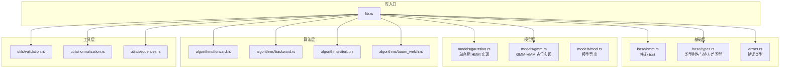
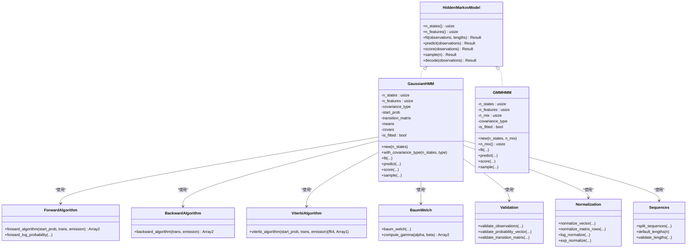
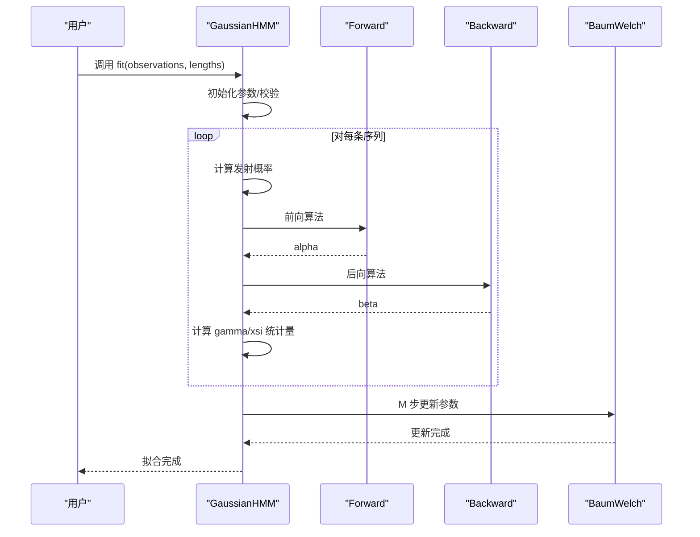
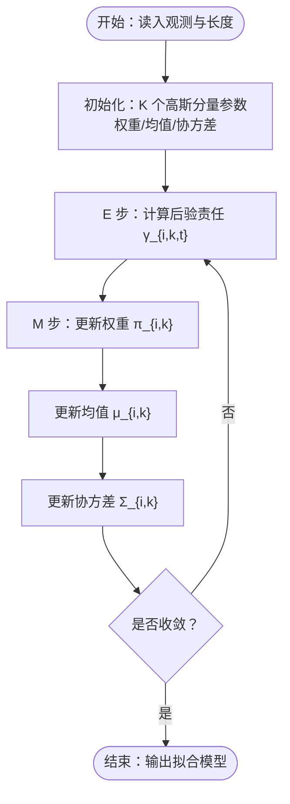

# 高斯混合模型 HMM

<cite>
**本文引用的文件**
- [lib.rs](file://src/lib.rs)
- [gmm.rs](file://src/models/gmm.rs)
- [gaussian.rs](file://src/models/gaussian.rs)
- [hmm.rs](file://src/base/hmm.rs)
- [types.rs](file://src/base/types.rs)
- [validation.rs](file://src/utils/validation.rs)
- [forward.rs](file://src/algorithms/forward.rs)
- [backward.rs](file://src/algorithms/backward.rs)
- [viterbi.rs](file://src/algorithms/viterbi.rs)
- [baum_welch.rs](file://src/algorithms/baum_welch.rs)
- [normalization.rs](file://src/utils/normalization.rs)
- [sequences.rs](file://src/utils/sequences.rs)
- [errors.rs](file://src/errors.rs)
- [README.md](file://README.md)
- [Cargo.toml](file://Cargo.toml)
</cite>

## 目录
1. [引言](#引言)
2. [项目结构](#项目结构)
3. [核心组件](#核心组件)
4. [架构总览](#架构总览)
5. [详细组件分析](#详细组件分析)
6. [依赖关系分析](#依赖关系分析)
7. [性能考虑](#性能考虑)
8. [故障排查指南](#故障排查指南)
9. [结论](#结论)
10. [附录](#附录)

## 引言
本技术文档围绕“高斯混合模型 HMM（GMM-HMM）”展开，系统阐述其在连续观测空间中对复杂多模态分布的建模能力，并与单高斯 HMM 进行对比。文档覆盖以下主题：
- 多高斯分量组合与混合权重参数化
- GMM-HMM 相比单高斯 HMM 的优势（多峰/非正态分布）
- 混合分量数量选择策略、EM 扩展实现与参数初始化方法
- 训练过程中的分量分配、权重更新与协方差处理
- 在语音识别、图像处理、生物信号分析等场景的应用思路
- 性能优化、内存管理与计算效率提升策略

当前仓库已实现基础 HMM 接口、单高斯 HMM 的完整 EM 流程与核心算法（前向、后向、维特比、Baum-Welch），但 GMM-HMM 的发射分布尚未实现。本文将以现有实现为基础，给出 GMM-HMM 的设计蓝图与落地建议。

## 项目结构
该仓库采用模块化组织，按功能域划分：基础接口与类型、模型实现、算法实现、工具与验证、错误定义与示例。核心入口 re-export 于库根模块，便于外部使用。

图表来源
- [lib.rs](file://src/lib.rs#L19-L27)
- [hmm.rs](file://src/base/hmm.rs#L6-L61)
- [types.rs](file://src/base/types.rs#L17-L29)
- [gaussian.rs](file://src/models/gaussian.rs#L14-L32)
- [gmm.rs](file://src/models/gmm.rs#L11-L19)
- [forward.rs](file://src/algorithms/forward.rs#L20-L47)
- [backward.rs](file://src/algorithms/backward.rs#L19-L45)
- [viterbi.rs](file://src/algorithms/viterbi.rs#L20-L74)
- [baum_welch.rs](file://src/algorithms/baum_welch.rs#L25-L44)
- [validation.rs](file://src/utils/validation.rs#L58-L74)
- [normalization.rs](file://src/utils/normalization.rs#L5-L35)
- [sequences.rs](file://src/utils/sequences.rs#L53-L70)
- [errors.rs](file://src/errors.rs#L9-L34)

章节来源
- [lib.rs](file://src/lib.rs#L1-L28)
- [README.md](file://README.md#L1-L303)

## 核心组件
- 核心 trait：HiddenMarkovModel 定义了状态数、特征数、拟合、预测（Viterbi）、评分（前向）、采样与解码等统一接口。
- 类型系统：CovarianceType 支持 Diagonal/Spherical/Full/Tied；提供若干类型别名以简化签名。
- 单高斯 HMM：实现了完整的 EM（Baum-Welch）流程，含前向/后向/维特比/伽马/ xsi 统计量计算与参数更新。
- 工具与验证：观测维度校验、概率向量与转移矩阵校验、序列拆分与默认长度、归一化（含 log 归一化）。
- 错误体系：统一的 HmmError 枚举，涵盖参数、维度、概率、收敛、数值等错误类别。

章节来源
- [hmm.rs](file://src/base/hmm.rs#L6-L61)
- [types.rs](file://src/base/types.rs#L17-L29)
- [gaussian.rs](file://src/models/gaussian.rs#L328-L612)
- [validation.rs](file://src/utils/validation.rs#L58-L74)
- [sequences.rs](file://src/utils/sequences.rs#L53-L83)
- [normalization.rs](file://src/utils/normalization.rs#L5-L35)
- [errors.rs](file://src/errors.rs#L9-L34)

## 架构总览
下图展示 GMM-HMM 的整体架构与关键交互：模型层负责发射分布（GMM）与参数存储；算法层提供前向/后向/维特比/Baum-Welch；工具层提供校验、归一化与序列处理；基础层提供统一接口与类型。

图表来源
- [hmm.rs](file://src/base/hmm.rs#L6-L61)
- [gaussian.rs](file://src/models/gaussian.rs#L328-L612)
- [gmm.rs](file://src/models/gmm.rs#L44-L107)
- [forward.rs](file://src/algorithms/forward.rs#L20-L69)
- [backward.rs](file://src/algorithms/backward.rs#L19-L45)
- [viterbi.rs](file://src/algorithms/viterbi.rs#L20-L74)
- [baum_welch.rs](file://src/algorithms/baum_welch.rs#L25-L74)
- [validation.rs](file://src/utils/validation.rs#L58-L74)
- [normalization.rs](file://src/utils/normalization.rs#L5-L35)
- [sequences.rs](file://src/utils/sequences.rs#L53-L83)

## 详细组件分析

### 单高斯 HMM 的 EM 实现与参数更新
- 参数初始化：若未显式设置初始参数，则随机选择观测样本作为均值初值，用全数据方差初始化每个状态的协方差（带最小阈值防止退化）。
- E 步：计算发射概率（高斯 PDF），结合初始概率与转移矩阵，调用前向/后向算法得到前向/后向概率，进而计算伽马（状态占用概率）与 xsi（状态转移概率）统计量。
- M 步：基于伽马与 xsi 更新初始概率、转移矩阵与发射参数（均值与协方差）。协方差根据加权方差更新并施加最小阈值。
- 收敛判断：以对数似然增量小于容差或达到最大迭代次数停止。

图表来源
- [gaussian.rs](file://src/models/gaussian.rs#L337-L491)
- [forward.rs](file://src/algorithms/forward.rs#L20-L47)
- [backward.rs](file://src/algorithms/backward.rs#L19-L45)
- [baum_welch.rs](file://src/algorithms/baum_welch.rs#L25-L74)

章节来源
- [gaussian.rs](file://src/models/gaussian.rs#L196-L325)
- [gaussian.rs](file://src/models/gaussian.rs#L337-L491)
- [forward.rs](file://src/algorithms/forward.rs#L20-L69)
- [backward.rs](file://src/algorithms/backward.rs#L19-L45)
- [baum_welch.rs](file://src/algorithms/baum_welch.rs#L25-L74)

### GMM-HMM 设计蓝图与实现建议
当前仓库中 GMMHMM 的 fit/predict/score/sample 方法仍为占位实现，尚未实现 GMM 发射分布与 EM 更新。以下为设计要点与实现路径：

- 发射分布参数化
  - 每个状态 i 的发射密度为 K 个高斯分量的混合：p(x_t|q_t=i) = Σ_k π_{i,k} · N(x_t; μ_{i,k}, Σ_{i,k})
  - 参数集合：π_i = {π_{i,k}}, μ_i = {μ_{i,k}}, Σ_i = {Σ_{i,k}}，满足 Σ_k π_{i,k}=1, π_{i,k}>0
  - 协方差类型：可复用 CovarianceType（Diagonal/Spherical/Full/Tied），按状态共享或独立配置

- 训练流程（EM 扩展）
  - E 步：计算后验分量责任 γ_{i,k,t} = P(q_t=i, c_{i,k,t}|X, θ)，其中 c_{i,k,t} 表示第 k 个分量生成第 t 个观测
  - M 步：更新混合权重、均值与协方差（与单高斯类似，但需对每个分量分别更新）
  - 收敛：对数似然增量小于阈值或达到最大迭代

- 参数初始化策略
  - 混合权重：Dirichlet 先验均匀扰动，或按 k-means 聚类结果初始化
  - 均值：k-means 或从观测样本中随机抽取
  - 协方差：按状态内方差初始化，Diagonal 可用全数据方差，Full/Tied 需更谨慎

- 分量数量选择
  - 信息准则：AIC/BIC 随 K 增大而变化，取局部最优
  - 交叉验证：固定 K，评估不同随机种子下的对数似然稳定性
  - 观测分布形态：多峰/厚尾分布倾向更大 K；单峰/近似正态可用较小 K

- 关键实现位置建议
  - 新增 GMM 发射概率计算函数，返回每个观测在各状态各分量上的概率
  - 扩展 gamma/xsi 统计量，使其包含分量级责任
  - 在 M 步中分别更新 π、μ、Σ（按分量维度）

图表来源
- [gmm.rs](file://src/models/gmm.rs#L53-L107)
- [gaussian.rs](file://src/models/gaussian.rs#L272-L325)

章节来源
- [gmm.rs](file://src/models/gmm.rs#L11-L107)
- [types.rs](file://src/base/types.rs#L17-L29)

### 协方差类型与数值稳定性
- 协方差类型：Diagonal/Spherical/Full/Tied，影响计算复杂度与拟合灵活性
- 数值稳定：对数概率、log 归一化、最小方差阈值、避免奇异矩阵（Full/Tied 需正则化）

章节来源
- [types.rs](file://src/base/types.rs#L17-L29)
- [gaussian.rs](file://src/models/gaussian.rs#L155-L194)
- [normalization.rs](file://src/utils/normalization.rs#L25-L35)

### 序列处理与多序列训练
- 支持多序列输入：通过 lengths 拆分为独立序列，分别进行前向/后向与统计量累加
- 默认长度：单序列时自动构造长度数组
- 边界约束：跨序列不传递转移（保持序列独立性）

章节来源
- [sequences.rs](file://src/utils/sequences.rs#L53-L83)
- [gaussian.rs](file://src/models/gaussian.rs#L403-L453)

### 算法实现要点
- 前向/后向：线性时间复杂度 O(T·N²)，支持 log 概率避免下溢
- 维特比：线性时间复杂度 O(T·N²)，输出最可能状态序列
- Baum-Welch：EM 迭代，收敛条件基于对数似然增量

章节来源
- [forward.rs](file://src/algorithms/forward.rs#L20-L69)
- [backward.rs](file://src/algorithms/backward.rs#L19-L45)
- [viterbi.rs](file://src/algorithms/viterbi.rs#L20-L74)
- [baum_welch.rs](file://src/algorithms/baum_welch.rs#L25-L74)

## 依赖关系分析
- 数据结构：ndarray 用于高效矩阵/向量运算
- 随机与分布：rand/rand_distr 用于参数初始化与采样
- 线性代数：ndarray-linalg 提供线性代数支持（Full/Tied 协方差可扩展使用）
- 序列化：serde 支持模型序列化（未来可扩展）

章节来源
- [Cargo.toml](file://Cargo.toml#L13-L22)

## 性能考虑
- 计算复杂度
  - 单高斯 HMM：前向/后向/维特比均为 O(T·N²)，Baum-Welch 每步 O(T·N²)，T 为序列长度，N 为状态数
  - GMM-HMM：每步增加 K 个分量的求和，复杂度约为 O(T·N²·K)，K 为混合分量数
- 内存管理
  - 避免不必要的拷贝：优先使用视图与就地操作
  - 统一分配：在 E 步/统计量累加阶段复用缓冲区
- 数值稳定性
  - 使用 log 概率与 log 归一化，exp_normalize 抑制溢出
  - 协方差添加最小阈值，防止数值不稳定
- 并行化潜力
  - 多序列训练可并行处理各序列的前向/后向与统计量累加
  - 分量级更新可并行（需注意同步与收敛控制）

章节来源
- [gaussian.rs](file://src/models/gaussian.rs#L384-L491)
- [normalization.rs](file://src/utils/normalization.rs#L25-L35)

## 故障排查指南
- 常见错误类型
  - 参数非法：如空观测、长度数组为空、序列长度之和不匹配
  - 概率非法：概率向量不和为 1、转移矩阵行和不为 1、概率越界
  - 维度不匹配：观测特征数与模型不一致
  - 模型未拟合：在未 fit 前调用 predict/score/sample
- 排查步骤
  - 校验观测维度与长度数组
  - 校验初始概率与转移矩阵
  - 检查协方差初始化与最小阈值
  - 若收敛失败，检查学习率/容差/最大迭代次数

章节来源
- [errors.rs](file://src/errors.rs#L9-L34)
- [validation.rs](file://src/utils/validation.rs#L58-L74)
- [sequences.rs](file://src/utils/sequences.rs#L16-L41)

## 结论
- 单高斯 HMM 已具备完整的 EM 实现与核心算法，适合近似正态或单峰连续分布
- GMM-HMM 在多峰/复杂连续分布上具有更强表达力，但带来更高的计算与内存开销
- 建议先以单高斯 HMM 建模，再依据 AIC/BIC 与可视化诊断决定是否引入 GMM-HMM
- 实现 GMM-HMM 时应重视数值稳定性、参数初始化与收敛控制，并充分利用多序列并行化

## 附录

### GMM-HMM 应用场景与实践建议
- 语音识别：多共振峰/音质变化，适合用多分量高斯建模
- 图像处理：纹理/光照变化导致的多模态灰度/颜色分布
- 生物信号分析：心电/脑电的多状态模式切换，结合分量级责任进行解释

章节来源
- [README.md](file://README.md#L121-L139)