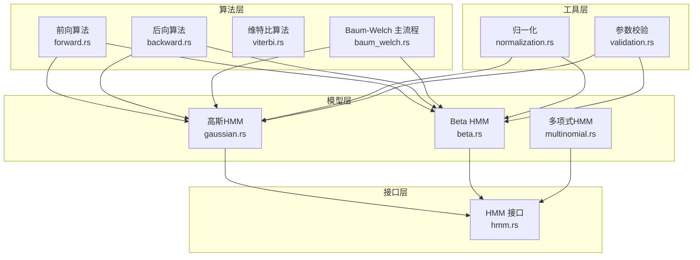
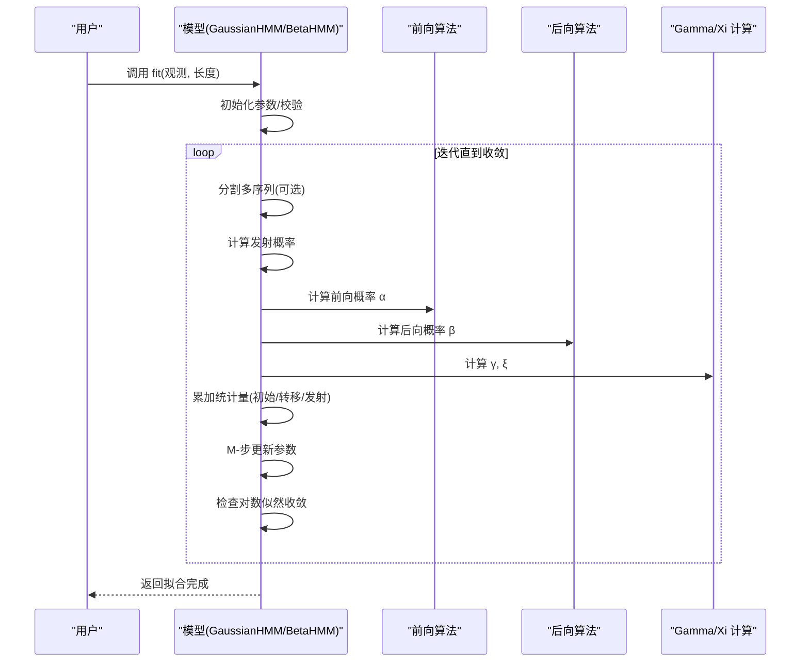
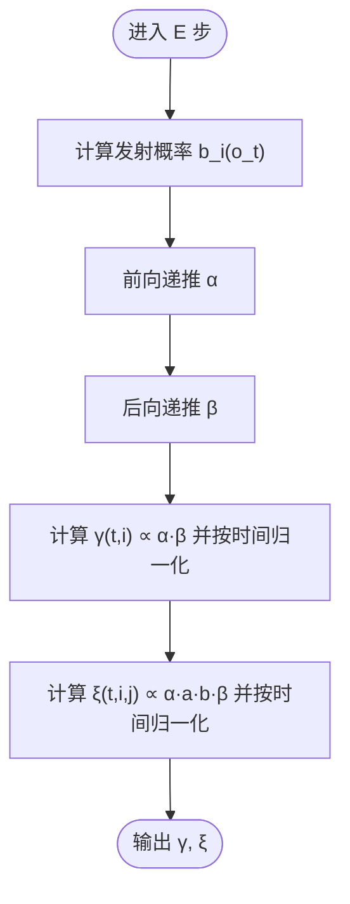
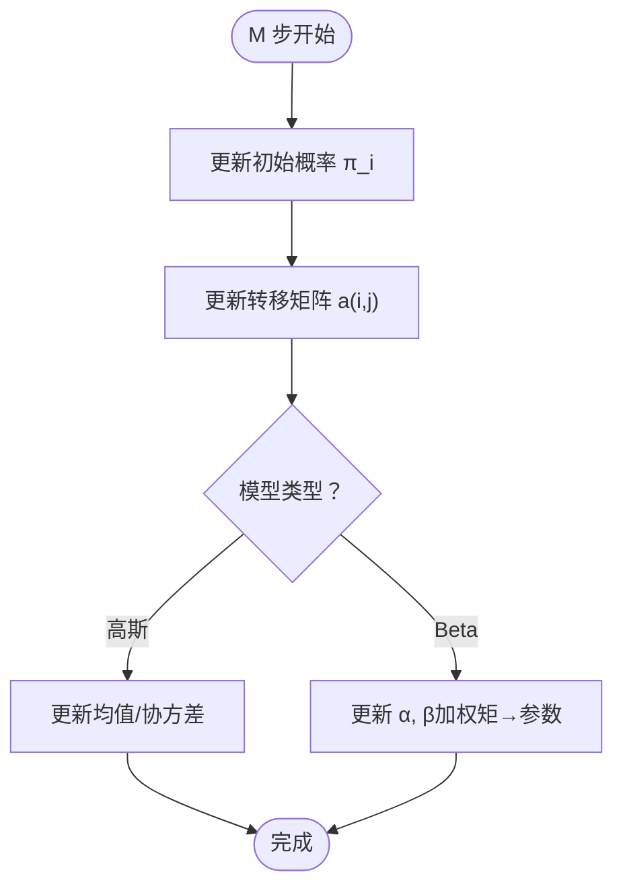
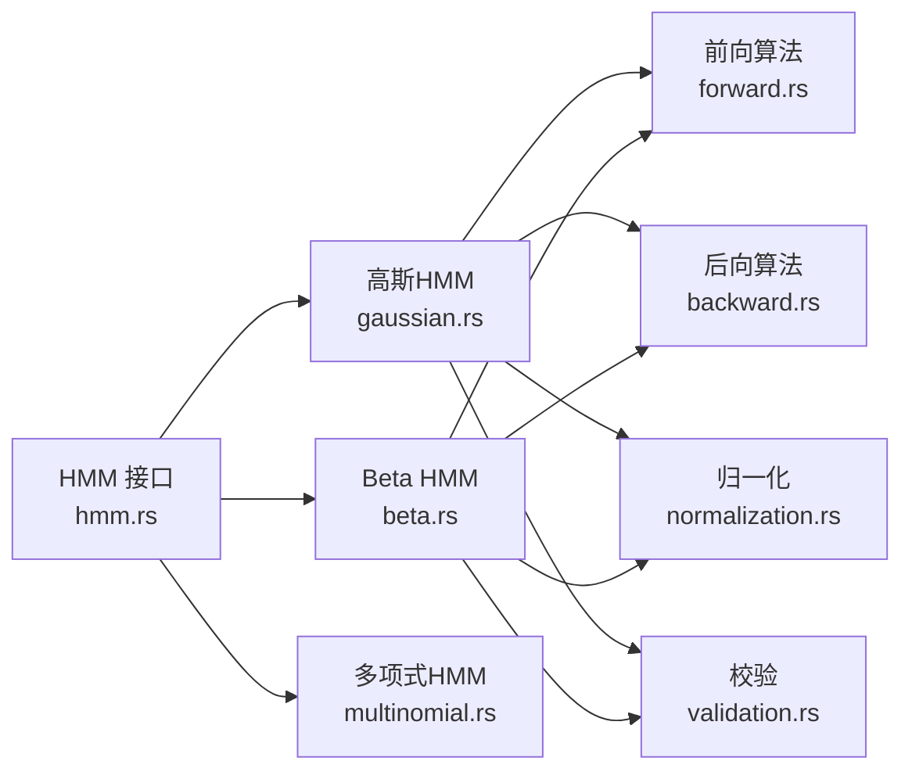
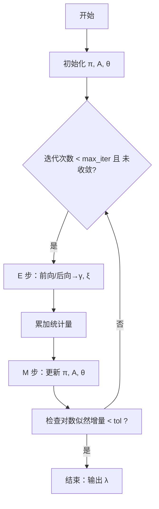

# Baum-Welch 算法

<cite>
**本文引用的文件**
- [src/algorithms/baum_welch.rs](file://src/algorithms/baum_welch.rs)
- [src/algorithms/forward.rs](file://src/algorithms/forward.rs)
- [src/algorithms/backward.rs](file://src/algorithms/backward.rs)
- [src/algorithms/viterbi.rs](file://src/algorithms/viterbi.rs)
- [src/models/gaussian.rs](file://src/models/gaussian.rs)
- [src/models/beta.rs](file://src/models/beta.rs)
- [src/models/multinomial.rs](file://src/models/multinomial.rs)
- [src/utils/normalization.rs](file://src/utils/normalization.rs)
- [src/utils/validation.rs](file://src/utils/validation.rs)
- [src/base/hmm.rs](file://src/base/hmm.rs)
- [src/lib.rs](file://src/lib.rs)
- [examples/beta_hmm_example.rs](file://examples/beta_hmm_example.rs)
- [README.md](file://README.md)
</cite>

## 目录
1. [引言](#引言)
2. [项目结构](#项目结构)
3. [核心组件](#核心组件)
4. [架构总览](#架构总览)
5. [详细组件分析](#详细组件分析)
6. [依赖关系分析](#依赖关系分析)
7. [性能与复杂度](#性能与复杂度)
8. [故障排查指南](#故障排查指南)
9. [结论](#结论)
10. [附录：算法流程与参数调优](#附录算法流程与参数调优)

## 引言
本文件系统性阐述 Baum-Welch 算法在隐马尔可夫模型（HMM）参数学习中的实现与理论基础。Baum-Welch 是期望最大化（EM）在 HMM 中的具体化：E 步通过前向-后向算法计算状态占用与转移的期望统计；M 步基于这些统计更新初始概率、转移概率与发射概率。本文结合代码库中已实现的前向/后向算法、Gamma/Xi 统计量、以及在高斯与 Beta 发射分布下的参数更新，给出完整的算法流程、收敛判断、数值稳定性与性能优化建议。

## 项目结构
该仓库采用模块化组织，核心围绕“算法”“模型”“工具”三大部分展开：
- algorithms：前向、后向、维特比、Baum-Welch 及其辅助统计函数
- models：多类 HMM 模型（高斯、Beta、多项式等），均实现统一的 HMM 接口
- utils：归一化、观测校验、序列切分等通用工具
- base：HMM 抽象接口与类型定义
- examples：使用示例（如 Beta HMM）

图表来源
- [src/algorithms/forward.rs](file://src/algorithms/forward.rs#L20-L47)
- [src/algorithms/backward.rs](file://src/algorithms/backward.rs#L19-L44)
- [src/algorithms/viterbi.rs](file://src/algorithms/viterbi.rs)
- [src/algorithms/baum_welch.rs](file://src/algorithms/baum_welch.rs#L25-L44)
- [src/models/gaussian.rs](file://src/models/gaussian.rs#L328-L491)
- [src/models/beta.rs](file://src/models/beta.rs#L384-L547)
- [src/models/multinomial.rs](file://src/models/multinomial.rs#L35-L94)
- [src/utils/normalization.rs](file://src/utils/normalization.rs#L6-L23)
- [src/utils/validation.rs](file://src/utils/validation.rs#L7-L56)
- [src/base/hmm.rs](file://src/base/hmm.rs#L7-L61)

章节来源
- [src/lib.rs](file://src/lib.rs#L19-L27)
- [README.md](file://README.md#L8-L26)

## 核心组件
- 前向算法：计算前向概率矩阵 α，用于 E 步统计
- 后向算法：计算后向概率矩阵 β，配合 α 计算 γ 与 ξ
- Gamma 统计量：γ(t,i) 表示在时间 t 处于状态 i 的后验概率
- Xi 统计量：ξ(t,i,j) 表示从状态 i 转移到状态 j 的后验概率
- Baum-Welch 主流程：在模型层中实现 E/M 步与收敛判断
- 归一化与校验：确保概率向量/矩阵合法，避免数值下溢

章节来源
- [src/algorithms/forward.rs](file://src/algorithms/forward.rs#L20-L47)
- [src/algorithms/backward.rs](file://src/algorithms/backward.rs#L19-L44)
- [src/algorithms/baum_welch.rs](file://src/algorithms/baum_welch.rs#L46-L74)
- [src/utils/normalization.rs](file://src/utils/normalization.rs#L6-L23)
- [src/utils/validation.rs](file://src/utils/validation.rs#L7-L56)

## 架构总览
Baum-Welch 在具体模型（如高斯或 Beta HMM）中被调用。以高斯 HMM 为例，fit 流程如下：
- 初始化参数（初始概率、转移矩阵、均值、协方差）
- 对每个序列执行 E 步：计算发射概率、前向/后向概率、γ、ξ
- 累加统计量：初始概率、转移计数、状态占用计数
- M 步：基于统计量更新初始概率、转移矩阵、发射参数（均值/协方差）
- 判断对数似然收敛，否则重复迭代

图表来源
- [src/models/gaussian.rs](file://src/models/gaussian.rs#L383-L491)
- [src/models/beta.rs](file://src/models/beta.rs#L439-L547)
- [src/algorithms/forward.rs](file://src/algorithms/forward.rs#L20-L47)
- [src/algorithms/backward.rs](file://src/algorithms/backward.rs#L19-L44)
- [src/algorithms/baum_welch.rs](file://src/algorithms/baum_welch.rs#L46-L74)

## 详细组件分析

### 前向-后向算法与 E 步统计
- 前向算法：递推计算 α(t,i)，表示到时间 t 且处于状态 i 的部分路径概率
- 后向算法：递推计算 β(t,i)，表示在状态 i 下的剩余观测序列概率
- E 步统计：
  - γ(t,i) ∝ α(t,i)·β(t,i)，再按时间归一化
  - ξ(t,i,j) ∝ α(t,i)·a(i,j)·b_{j}(o_{t+1})·β(t+1,j)，再按时间归一化

图表来源
- [src/algorithms/forward.rs](file://src/algorithms/forward.rs#L20-L47)
- [src/algorithms/backward.rs](file://src/algorithms/backward.rs#L19-L44)
- [src/algorithms/baum_welch.rs](file://src/algorithms/baum_welch.rs#L46-L74)

章节来源
- [src/algorithms/forward.rs](file://src/algorithms/forward.rs#L20-L47)
- [src/algorithms/backward.rs](file://src/algorithms/backward.rs#L19-L44)
- [src/algorithms/baum_welch.rs](file://src/algorithms/baum_welch.rs#L46-L74)

### M 步参数更新（以高斯与 Beta 模型为例）
- 高斯 HMM：
  - 初始概率：π_i ← Σ_t δ(1,t)·γ(t,i) / Σ_t γ(t,i)
  - 转移概率：a(i,j) ← Σ_t γ(t,i)·δ(t,T-1)·ξ(t,i,j) / Σ_t γ(t,i)
  - 发射参数（均值/协方差）：基于加权矩估计更新
- Beta HMM：
  - 初始概率与转移概率同上
  - 发射参数（α, β）：基于加权样本均值与方差，转换为 Beta 参数

图表来源
- [src/models/gaussian.rs](file://src/models/gaussian.rs#L461-L487)
- [src/models/beta.rs](file://src/models/beta.rs#L517-L543)

章节来源
- [src/models/gaussian.rs](file://src/models/gaussian.rs#L224-L325)
- [src/models/beta.rs](file://src/models/beta.rs#L288-L381)

### Gamma 与 Xi 的实现要点
- Gamma：逐行归一化，保证每时刻概率和为 1
- Xi：在高斯模型中按元素乘法与归一化；在 Beta 模型中采用更稳定的广播与归一化策略

章节来源
- [src/algorithms/baum_welch.rs](file://src/algorithms/baum_welch.rs#L46-L74)
- [src/models/gaussian.rs](file://src/models/gaussian.rs#L224-L270)
- [src/models/beta.rs](file://src/models/beta.rs#L288-L332)

### 收敛判断与迭代控制
- 使用对数似然增量作为收敛指标：若 |log P(O|λ^{(t)}) − log P(O|λ^{(t−1)})| < ε，则停止
- 提供最大迭代次数上限，防止无限循环

章节来源
- [src/models/gaussian.rs](file://src/models/gaussian.rs#L455-L459)
- [src/models/beta.rs](file://src/models/beta.rs#L511-L515)

### 数值稳定性与归一化
- 对概率向量/矩阵进行行归一化，避免下溢
- 在计算对数似然时，先求和再取对数，避免直接对极小概率取对数
- 对 Beta 发射的对数概率使用稳定形式（含对数 Gamma 函数近似）

章节来源
- [src/utils/normalization.rs](file://src/utils/normalization.rs#L6-L23)
- [src/models/beta.rs](file://src/models/beta.rs#L199-L224)

### HMM 接口与模型一致性
- 所有模型实现统一接口：n_states、n_features、fit、predict、score、sample、decode
- 便于在不同发射分布之间切换，同时共享 Baum-Welch 的 E/M 步逻辑

章节来源
- [src/base/hmm.rs](file://src/base/hmm.rs#L7-L61)
- [src/models/gaussian.rs](file://src/models/gaussian.rs#L328-L612)
- [src/models/beta.rs](file://src/models/beta.rs#L384-L669)
- [src/models/multinomial.rs](file://src/models/multinomial.rs#L35-L94)

## 依赖关系分析
- 模型依赖算法：高斯与 Beta 模型在 fit 中直接调用前向/后向与 Gamma/Xi 计算
- 工具依赖：归一化与参数校验被广泛复用，保障数值稳定与输入合法性
- 接口依赖：所有模型遵循统一 trait，便于扩展新模型类型

图表来源
- [src/base/hmm.rs](file://src/base/hmm.rs#L7-L61)
- [src/models/gaussian.rs](file://src/models/gaussian.rs#L328-L491)
- [src/models/beta.rs](file://src/models/beta.rs#L384-L547)
- [src/algorithms/forward.rs](file://src/algorithms/forward.rs#L20-L47)
- [src/algorithms/backward.rs](file://src/algorithms/backward.rs#L19-L44)
- [src/utils/normalization.rs](file://src/utils/normalization.rs#L6-L23)
- [src/utils/validation.rs](file://src/utils/validation.rs#L7-L56)

章节来源
- [src/lib.rs](file://src/lib.rs#L19-L27)

## 性能与复杂度
- 时间复杂度：单序列长度 T，状态数 N，每步 O(TN^2)，整体 O(ITN^2)，I 为迭代次数
- 内存复杂度：α/β/γ/ξ 等矩阵均为 O(TN)，空间可接受
- 优化建议：
  - 向量化：优先使用数组库的广播与批处理操作（如 Beta 模型中的广播）
  - 归一化：在每步前向/后向中进行数值稳定归一化
  - 并行：对多个序列独立处理（当前实现逐序列累加，可扩展为并行）
  - 早停：根据对数似然增量及时终止

章节来源
- [src/models/beta.rs](file://src/models/beta.rs#L300-L332)
- [README.md](file://README.md#L222-L229)

## 故障排查指南
- 观测范围不合法（如 Beta 模型要求 (0,1)）：触发参数校验错误
- 概率向量/转移矩阵非法：校验失败返回错误
- 模型未初始化即预测/评分：返回“模型未拟合”错误
- 数值下溢/NaN：检查归一化与对数空间转换是否正确

章节来源
- [src/utils/validation.rs](file://src/utils/validation.rs#L58-L74)
- [src/models/beta.rs](file://src/models/beta.rs#L137-L145)
- [src/models/gaussian.rs](file://src/models/gaussian.rs#L494-L544)

## 结论
该代码库完整实现了 Baum-Welch 的 E/M 步，并在高斯与 Beta 模型中提供了可运行的参数更新流程。通过前向-后向算法与 Gamma/Xi 统计量，模型能够稳健地估计初始概率、转移概率与发射参数。结合归一化与参数校验，系统具备良好的数值稳定性。未来可在多序列并行、收敛阈值自适应与更丰富的发射分布方面进一步增强。

## 附录：算法流程与参数调优

### 完整算法流程（伪码）
- 输入：观测序列 O，最大迭代 max_iter，收敛阈值 tol
- 初始化：π、A、发射参数 θ
- 循环直至收敛或达到 max_iter：
  - E 步：计算 α、β，得到 γ、ξ
  - 累加统计量：初始计数、转移计数、发射计数
  - M 步：更新 π、A、θ
  - 收敛判断：比较对数似然增量
- 输出：拟合后的 λ=(π,A,θ)

图表来源
- [src/models/gaussian.rs](file://src/models/gaussian.rs#L383-L491)
- [src/models/beta.rs](file://src/models/beta.rs#L439-L547)

### 实际训练示例与参数调优建议
- 示例参考：Beta HMM 示例展示了完整的 fit/predict/score/sample 流程
- 参数调优建议：
  - 初始参数：随机初始化或基于经验（如 Beta 的矩估计）
  - 收敛阈值：默认 1e-4，可根据数据规模与噪声调整
  - 最大迭代：默认 100，长序列可适当增加
  - 多序列：使用长度列表分割，避免跨序列边界统计
  - 数值稳定：始终启用行归一化与对数空间运算

章节来源
- [examples/beta_hmm_example.rs](file://examples/beta_hmm_example.rs#L15-L266)
- [src/models/gaussian.rs](file://src/models/gaussian.rs#L383-L386)
- [src/models/beta.rs](file://src/models/beta.rs#L440-L442)