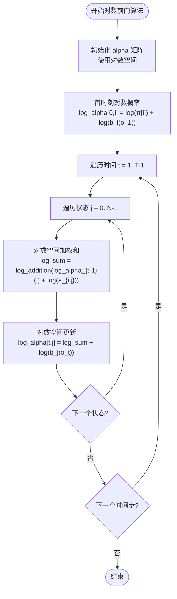

# 前向算法

<cite>
**本文档引用的文件**
- [src/algorithms/forward.rs](file://src/algorithms/forward.rs)
- [src/base/hmm.rs](file://src/base/hmm.rs)
- [src/base/types.rs](file://src/base/types.rs)
- [src/utils/normalization.rs](file://src/utils/normalization.rs)
- [src/errors.rs](file://src/errors.rs)
- [src/lib.rs](file://src/lib.rs)
- [README.md](file://README.md)
</cite>

## 目录
1. [引言](#引言)
2. [项目结构](#项目结构)
3. [核心组件](#核心组件)
4. [架构概览](#架构概览)
5. [详细组件分析](#详细组件分析)
6. [依赖关系分析](#依赖关系分析)
7. [性能考虑](#性能考虑)
8. [故障排除指南](#故障排除指南)
9. [结论](#结论)

## 引言

前向算法是隐马尔可夫模型（Hidden Markov Model, HMM）中的一个核心算法，用于计算在给定模型参数下观测到部分序列且处于特定状态的概率。该算法通过动态规划的思想，系统地计算每个时间步每个状态的前向概率（alpha值），为后续的模型评估、参数学习和状态解码提供了基础。

本项目实现了完整的前向算法，包括标准概率空间和对数概率空间两种计算方式，具有良好的数值稳定性和高效的性能表现。算法的时间复杂度为O(T×N²)，空间复杂度为O(T×N)，其中T表示观测序列长度，N表示隐藏状态数量。

## 项目结构

rhmm是一个基于Rust语言的隐马尔可夫模型库，采用模块化设计，主要包含以下核心模块：

**图表来源**
- [src/lib.rs](file://src/lib.rs#L19-L27)
- [src/algorithms/mod.rs](file://src/algorithms/mod.rs#L1-L12)

**章节来源**
- [src/lib.rs](file://src/lib.rs#L1-L28)
- [src/algorithms/mod.rs](file://src/algorithms/mod.rs#L1-L12)

## 核心组件

### 前向算法函数

前向算法的核心实现包含两个主要函数：

1. **`forward_algorithm`**: 计算前向概率矩阵（alpha值）
2. **`forward_log_probability`**: 计算观测序列的对数概率

这两个函数构成了前向算法的完整实现，提供了从概率空间到对数空间的双重计算能力。

**章节来源**
- [src/algorithms/forward.rs](file://src/algorithms/forward.rs#L20-L69)

### 数据结构和类型定义

项目使用了多种数据结构来表示HMM的各种参数：

- **初始状态概率**: `InitialProbs` 类型别名，表示每个隐藏状态的初始概率
- **转移矩阵**: `TransitionMatrix` 类型别名，表示状态间的转移概率
- **观测序列**: `Observations` 类型别名，表示观测数据
- **状态序列**: `States` 类型别名，表示隐藏状态序列

**章节来源**
- [src/base/types.rs](file://src/base/types.rs#L5-L15)

## 架构概览

前向算法在整个HMM框架中的位置和作用如下：

**图表来源**
- [src/algorithms/forward.rs](file://src/algorithms/forward.rs#L20-L69)
- [src/utils/normalization.rs](file://src/utils/normalization.rs#L1-L23)

## 详细组件分析

### 数学理论基础

前向算法基于动态规划原理，定义了前向概率的概念：

**前向概率定义**：
- αₜ(i) = P(o₁, o₂, ..., oₜ, qₜ = i | λ)
- 表示在时刻t处于状态i且观测到前t个观测值的概率

**递推公式**：
- **初始化**: α₀(i) = πᵢbᵢ(o₁)，其中πᵢ为初始概率，bᵢ(o₁)为发射概率
- **时间步进**: αₜ(j) = [∑ᵢ₌₁ᴺ αₜ₋₁(i)aᵢⱼ] × bⱼ(oₜ)，其中aᵢⱼ为转移概率

**观测序列概率**：
- P(O|λ) = ∑ᵢ₌₁ᴺ αₜ(i)，即最后一时刻所有状态的前向概率之和

### 算法实现详解

#### 初始化阶段

算法首先初始化第一个时间步的前向概率：

**图表来源**
- [src/algorithms/forward.rs](file://src/algorithms/forward.rs#L28-L33)

#### 时间步进过程

算法通过嵌套循环实现动态规划的时间步进：

**图表来源**
- [src/algorithms/forward.rs](file://src/algorithms/forward.rs#L36-L44)

#### 对数空间实现

为了提高数值稳定性，项目还提供了对数空间的实现：

**图表来源**
- [src/algorithms/forward.rs](file://src/algorithms/forward.rs#L60-L69)

### 函数签名和参数说明

#### `forward_algorithm` 函数

**函数原型**: `forward_algorithm(start_prob, transition_matrix, emission_probs) -> Result<Array2<f64>>`

**参数说明**:
- `start_prob`: 初始状态概率向量，长度为N
- `transition_matrix`: 状态转移矩阵，形状为(N, N)
- `emission_probs`: 发射概率矩阵，形状为(T, N)

**返回值**: 前向概率矩阵，形状为(T, N)

**章节来源**
- [src/algorithms/forward.rs](file://src/algorithms/forward.rs#L20-L47)

#### `forward_log_probability` 函数

**函数原型**: `forward_log_probability(start_prob, transition_matrix, emission_probs) -> Result<f64>`

**参数说明**:
- `start_prob`: 初始状态概率向量，长度为N
- `transition_matrix`: 状态转移矩阵，形状为(N, N)
- `emission_probs`: 发射概率矩阵，形状为(T, N)

**返回值**: 观测序列的对数概率

**章节来源**
- [src/algorithms/forward.rs](file://src/algorithms/forward.rs#L60-L69)

### 边界条件处理

算法实现了完善的边界条件处理机制：

1. **单观测序列**: 当只有单个观测时，直接返回初始概率与发射概率的乘积
2. **空序列**: 通过维度检查确保输入的有效性
3. **概率归一化**: 使用专门的归一化函数确保概率和为1
4. **数值稳定性**: 对于极小概率值，使用对数空间避免下溢

**章节来源**
- [src/algorithms/forward.rs](file://src/algorithms/forward.rs#L77-L127)
- [src/utils/normalization.rs](file://src/utils/normalization.rs#L1-L23)

## 依赖关系分析

前向算法的依赖关系体现了模块化的设计理念：

**图表来源**
- [src/algorithms/forward.rs](file://src/algorithms/forward.rs#L3-L4)
- [src/lib.rs](file://src/lib.rs#L19-L27)

### 错误处理机制

项目使用统一的错误处理机制，确保算法的健壮性：

- **维度不匹配**: 检查输入矩阵的维度一致性
- **无效概率**: 验证概率值的有效范围
- **数值错误**: 处理浮点运算中的异常情况

**章节来源**
- [src/errors.rs](file://src/errors.rs#L9-L34)

## 性能考虑

### 时间复杂度分析

前向算法的时间复杂度为O(T×N²)，其中：
- T: 观测序列长度（时间步数）
- N: 隐藏状态数量

具体分析：
- 初始化阶段: O(N)
- 主循环: O(T×N×N) = O(T×N²)
- 总体: O(T×N²)

### 空间复杂度分析

空间复杂度为O(T×N)，主要用于存储前向概率矩阵α。

### 性能优化策略

1. **内存局部性**: 使用连续内存布局的ndarray提高缓存效率
2. **向量化操作**: 利用ndarray的向量化特性减少循环开销
3. **数值稳定性**: 实现对数空间计算避免概率下溢
4. **错误早返回**: 在维度检查失败时立即返回错误

**章节来源**
- [src/algorithms/forward.rs](file://src/algorithms/forward.rs#L25-L26)

## 故障排除指南

### 常见问题和解决方案

#### 维度不匹配错误
**症状**: 运行时出现维度不匹配的错误
**原因**: 输入矩阵的维度与期望不符
**解决方法**: 检查输入数据的形状，确保符合算法要求

#### 概率值异常
**症状**: 计算结果出现NaN或无穷大
**原因**: 输入概率值不在有效范围内
**解决方法**: 验证输入数据的有效性，使用概率归一化工具

#### 数值下溢
**症状**: 对数概率计算结果异常
**解决方法**: 使用对数空间计算，避免直接计算很小的概率值

**章节来源**
- [src/errors.rs](file://src/errors.rs#L14-L15)
- [src/utils/normalization.rs](file://src/utils/normalization.rs#L25-L35)

### 调试技巧

1. **单元测试**: 利用提供的测试用例验证算法正确性
2. **边界测试**: 测试单观测、双观测等特殊情况
3. **可视化**: 打印中间结果检查计算过程
4. **性能监控**: 使用基准测试评估算法性能

**章节来源**
- [src/algorithms/forward.rs](file://src/algorithms/forward.rs#L71-L128)

## 结论

前向算法作为HMM理论的核心组成部分，在本项目中得到了完整而优雅的实现。算法不仅提供了标准的概率空间计算，更重要的是实现了数值稳定的对数空间版本，有效解决了实际应用中的数值问题。

项目的设计体现了以下特点：
- **模块化架构**: 清晰的模块划分便于维护和扩展
- **类型安全**: 强类型的参数传递确保运行时安全
- **数值稳定**: 对数空间计算保证了计算精度
- **性能优化**: 高效的实现充分利用了Rust语言的优势

通过本实现，开发者可以可靠地计算HMM中观测序列的概率，为后续的状态解码、参数学习和模型评估奠定了坚实的基础。算法的复杂度分析和性能优化策略使其适用于各种规模的实际应用场景。