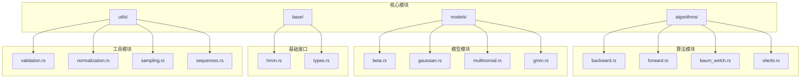
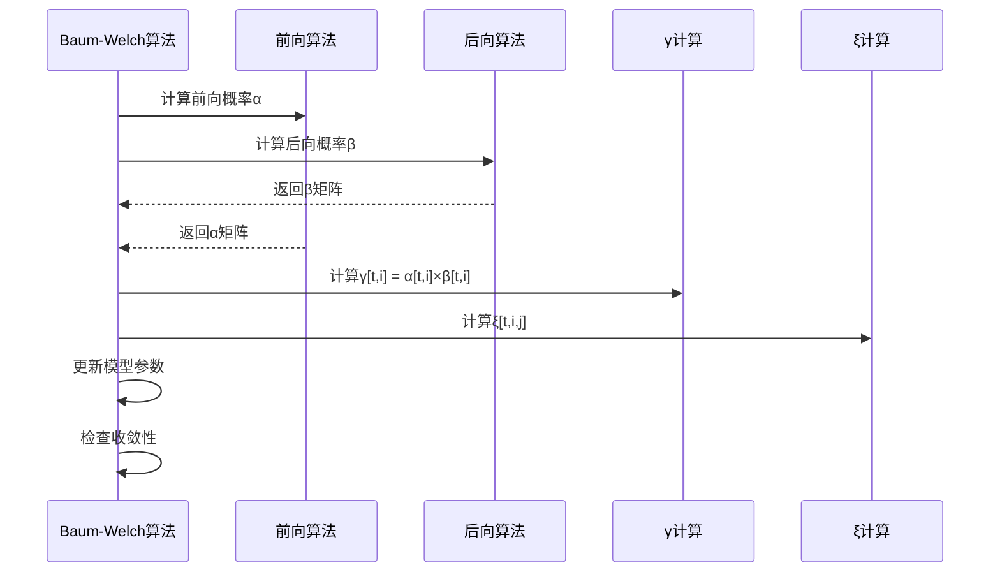
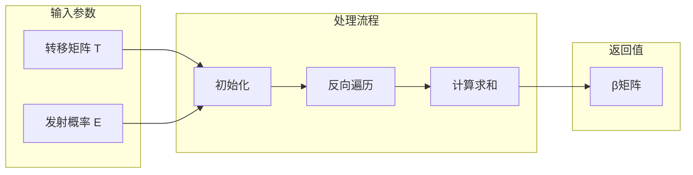
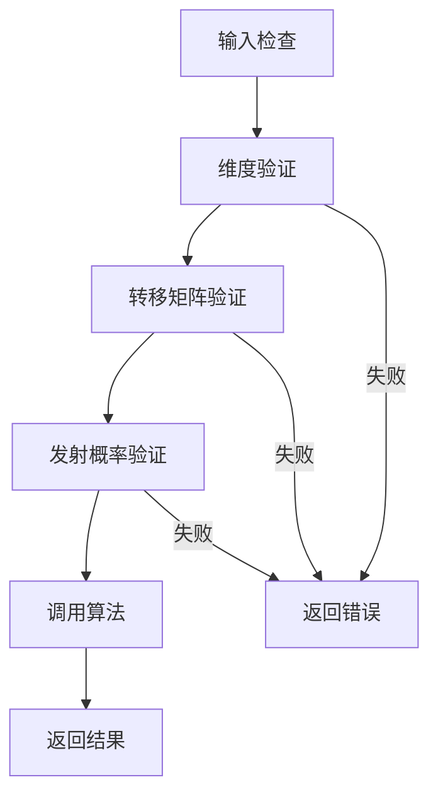
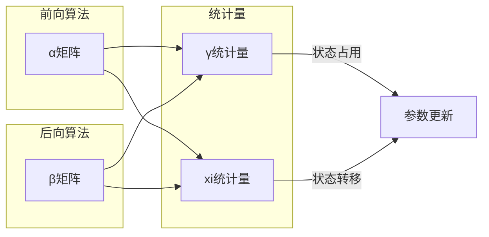
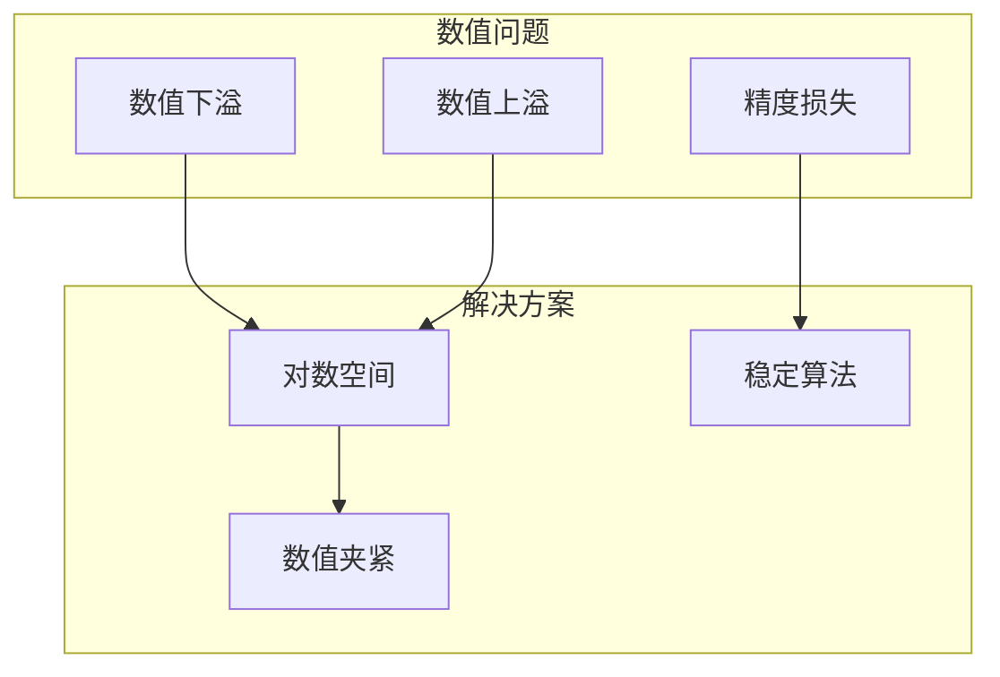
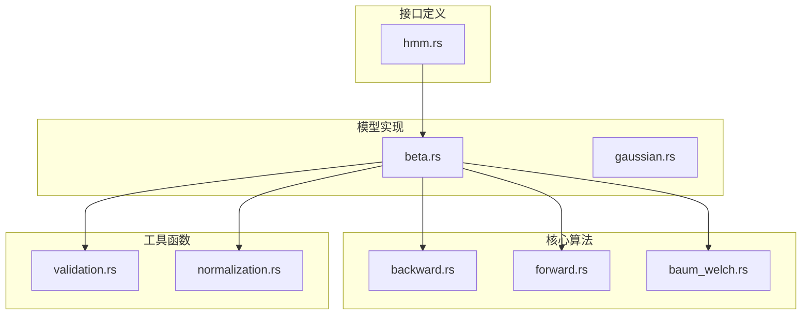
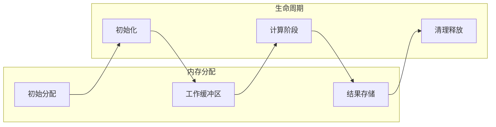
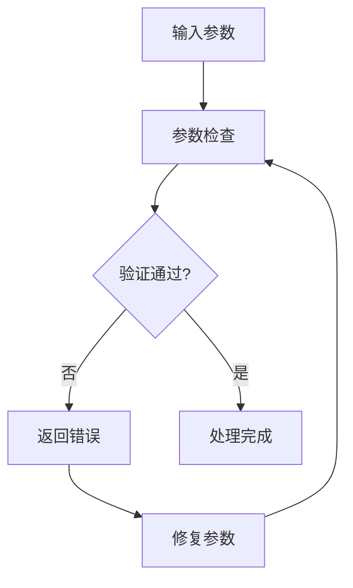

# 后向算法

<cite>
**本文档引用的文件**
- [backward.rs](file://src/algorithms/backward.rs)
- [forward.rs](file://src/algorithms/forward.rs)
- [baow_welch.rs](file://src/algorithms/baum_welch.rs)
- [beta.rs](file://src/models/beta.rs)
- [hmm.rs](file://src/base/hmm.rs)
- [validation.rs](file://src/utils/validation.rs)
- [normalization.rs](file://src/utils/normalization.rs)
- [lib.rs](file://src/lib.rs)
- [mod.rs](file://src/algorithms/mod.rs)
- [beta_hmm_example.rs](file://examples/beta_hmm_example.rs)
</cite>

## 目录
1. [引言](#引言)
2. [项目结构](#项目结构)
3. [核心组件](#核心组件)
4. [架构概览](#架构概览)
5. [详细组件分析](#详细组件分析)
6. [依赖分析](#依赖分析)
7. [性能考虑](#性能考虑)
8. [故障排除指南](#故障排除指南)
9. [结论](#结论)
10. [附录](#附录)

## 引言

后向算法是隐马尔可夫模型(HMM)中的重要组成部分，与前向算法形成互补关系。本文档全面阐述后向算法的理论基础、实现细节及其在模型训练中的应用。

后向算法的核心思想是计算在给定模型参数和当前状态下，从后续观测序列中得到的概率（β值）。这些概率值与前向算法计算的α值共同构成了HMM参数估计的基础。

## 项目结构

该HMM库采用模块化设计，主要包含以下核心模块：



**图表来源**
- [lib.rs](file://src/lib.rs#L19-L28)
- [mod.rs](file://src/algorithms/mod.rs#L1-L12)

**章节来源**
- [lib.rs](file://src/lib.rs#L1-L28)
- [mod.rs](file://src/algorithms/mod.rs#L1-L12)

## 核心组件

### 后向算法实现

后向算法的核心实现位于`src/algorithms/backward.rs`文件中，提供了计算β值的完整功能：

```mermaid
flowchart TD
START([开始: backward_algorithm]) --> INIT[初始化β矩阵<br/>尺寸: (n_samples × n_states)]
INIT --> LASTSTEP[最后时刻初始化<br/>β[T-1,i] = 1.0]
LASTSTEP --> LOOP[反向遍历时间步<br/>t = T-2, T-3, ..., 0]
LOOP --> INNERLOOP[对每个状态i<br/>计算求和]
INNERLOOP --> SUM[sum = Σ_j T[i,j] × E[t+1,j] × β[t+1,j]]
SUM --> ASSIGN[β[t,i] = sum]
ASSIGN --> NEXT[下一个时间步]
NEXT --> LOOP
ASSIGN --> END([结束: 返回β矩阵])
```

**图表来源**
- [backward.rs](file://src/algorithms/backward.rs#L19-L45)

### 前向-后向算法对比

```mermaid
classDiagram
class ForwardAlgorithm {
+forward_algorithm(start_prob, trans_mat, emission_probs)
+forward_log_probability(start_prob, trans_mat, emission_probs)
+描述 : 计算前向概率α
+初始化 : α[0,i] = π[i] × b_i(o_1)
+递推 : α[t,i] = Σ_j α[t-1,j] × a_ij × b_i(o_t)
}
class BackwardAlgorithm {
+backward_algorithm(trans_mat, emission_probs)
+描述 : 计算后向概率β
+初始化 : β[T-1,i] = 1.0
+递推 : β[t,i] = Σ_j a_ij × b_j(o_{t+1}) × β[t+1,j]
}
class GammaComputation {
+compute_gamma(alpha, beta)
+γ[t,i] = α[t,i] × β[t,i]
+用于状态占用概率估计
}
ForwardAlgorithm --> BackwardAlgorithm : "互补关系"
ForwardAlgorithm --> GammaComputation : "配合使用"
BackwardAlgorithm --> GammaComputation : "配合使用"
```

**图表来源**
- [forward.rs](file://src/algorithms/forward.rs#L20-L47)
- [backward.rs](file://src/algorithms/backward.rs#L19-L45)
- [baow_welch.rs](file://src/algorithms/baum_welch.rs#L56-L74)

**章节来源**
- [backward.rs](file://src/algorithms/backward.rs#L1-L90)
- [forward.rs](file://src/algorithms/forward.rs#L1-L129)

## 架构概览

### 算法集成架构

后向算法在HMM训练中的关键作用体现在以下架构中：



**图表来源**
- [beta.rs](file://src/models/beta.rs#L468-L547)
- [baow_welch.rs](file://src/algorithms/baum_welch.rs#L56-L74)

### 数学理论基础

后向概率的数学定义和递推关系：

**初始化条件**：
- 对于所有状态 i：β[T-1,i] = 1.0

**时间步进规则**：
- 对于所有状态 i 和时间步 t = T-2, T-3, ..., 0：
- β[t,i] = Σ_j a_ij × b_j(o_{t+1}) × β[t+1,j]

其中：
- a_ij 是从状态 i 转移到状态 j 的转移概率
- b_j(o_{t+1}) 是在状态 j 下观测到 o_{t+1} 的发射概率
- β[t,i] 表示在时间 t 处于状态 i 的条件下，从时间 t+1 到 T 的观测序列的概率

**章节来源**
- [backward.rs](file://src/algorithms/backward.rs#L28-L42)

## 详细组件分析

### 后向算法函数设计

#### 函数签名和参数处理

后向算法的核心函数具有清晰的参数设计：



**图表来源**
- [backward.rs](file://src/algorithms/backward.rs#L19-L45)

#### 参数验证和错误处理



**图表来源**
- [validation.rs](file://src/utils/validation.rs#L6-L26)

**章节来源**
- [backward.rs](file://src/algorithms/backward.rs#L19-L45)
- [validation.rs](file://src/utils/validation.rs#L1-L141)

### 与前向算法的互补关系

#### 数学联系分析

前向和后向算法通过γ和ξ统计量建立紧密联系：



**图表来源**
- [baow_welch.rs](file://src/algorithms/baum_welch.rs#L56-L74)
- [beta.rs](file://src/models/beta.rs#L288-L332)

#### 实际应用场景

在Beta HMM模型中，后向算法的应用场景包括：

1. **模型训练**：通过Baum-Welch算法结合前向-后向算法进行参数估计
2. **状态预测**：结合Viterbi算法进行最优状态路径解码
3. **模型评估**：计算观测序列的对数似然概率
4. **参数期望计数**：为EM算法提供必要的统计量

**章节来源**
- [beta.rs](file://src/models/beta.rs#L468-L547)
- [beta_hmm_example.rs](file://examples/beta_hmm_example.rs#L1-L266)

### 数值精度和稳定性

#### 对数域实现的必要性

虽然当前实现使用直接概率计算，但数值稳定性问题需要特别关注：



**图表来源**
- [normalization.rs](file://src/utils/normalization.rs#L25-L35)

#### 现有实现的数值处理

当前实现采用了以下数值稳定性措施：

1. **发射概率夹紧**：确保观测值在(0,1)范围内
2. **参数最小值约束**：防止Beta分布参数过小
3. **向量归一化**：使用专门的归一化函数

**章节来源**
- [beta.rs](file://src/models/beta.rs#L182-L197)
- [normalization.rs](file://src/utils/normalization.rs#L1-L12)

## 依赖分析

### 组件耦合关系



**图表来源**
- [lib.rs](file://src/lib.rs#L19-L28)
- [beta.rs](file://src/models/beta.rs#L3-L12)

### 外部依赖关系

系统依赖的主要外部库：

- **ndarray**: 多维数组操作和线性代数运算
- **rand**: 随机数生成
- **rand_distr**: 概率分布采样
- **thiserror**: 错误处理
- **approx**: 测试断言

**章节来源**
- [lib.rs](file://src/lib.rs#L46-L51)
- [beta.rs](file://src/models/beta.rs#L10-L12)

## 性能考虑

### 时间复杂度分析

后向算法的时间复杂度为 O(T × N²)，其中：
- T 是观测序列长度
- N 是隐藏状态数量

具体分析：
- 初始化阶段：O(N)
- 主循环：O(T × N × N) = O(T × N²)
- 总体：O(T × N²)

### 空间复杂度分析

- β矩阵存储：O(T × N)
- 额外临时变量：O(N)
- 总体：O(T × N)

### 内存使用模式



**图表来源**
- [backward.rs](file://src/algorithms/backward.rs#L26-L44)

## 故障排除指南

### 常见问题诊断

#### 参数验证错误



**图表来源**
- [validation.rs](file://src/utils/validation.rs#L6-L56)

#### 数值稳定性问题

常见数值问题及解决方案：

1. **发射概率越界**：使用`clamp`函数限制在(ε, 1-ε)范围内
2. **参数过小**：设置最小阈值避免数值不稳定
3. **归一化失败**：检查求和是否为零

**章节来源**
- [validation.rs](file://src/utils/validation.rs#L1-L141)
- [beta.rs](file://src/models/beta.rs#L182-L197)

### 单元测试覆盖

测试用例涵盖：
- 基本功能测试：验证β矩阵形状和边界条件
- 维度一致性测试：确保输入输出维度匹配
- 边界情况测试：单观测序列的特殊情况

**章节来源**
- [backward.rs](file://src/algorithms/backward.rs#L47-L89)

## 结论

后向算法作为HMM理论的重要组成部分，在实际应用中发挥着不可替代的作用。通过与前向算法的完美配合，它为模型参数估计、状态解码和模型评估提供了坚实的数学基础。

该实现具有以下特点：
- **理论严谨**：严格遵循HMM数学定义
- **实现高效**：优化的循环结构和内存使用
- **数值稳定**：完善的参数验证和数值处理
- **易于扩展**：模块化的架构设计便于功能扩展

未来可以考虑的改进方向包括：
- 对数空间实现以提高数值稳定性
- 并行化优化以提升大序列处理性能
- 更丰富的数值精度控制选项

## 附录

### 算法复杂度总结

| 组件 | 时间复杂度 | 空间复杂度 | 描述 |
|------|------------|------------|------|
| 后向算法 | O(T × N²) | O(T × N) | 核心β值计算 |
| 前向算法 | O(T × N²) | O(T × N) | α值计算 |
| γ统计量 | O(T × N) | O(T × N) | 状态占用概率 |
| ξ统计量 | O(T × N²) | O(T × N²) | 状态转移概率 |

### 实际应用建议

1. **数据预处理**：确保观测数据符合模型假设
2. **参数初始化**：合理设置初始参数以加速收敛
3. **收敛监控**：定期检查对数似然变化率
4. **数值检查**：监控概率和参数的数值范围