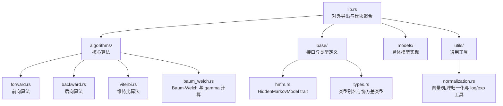
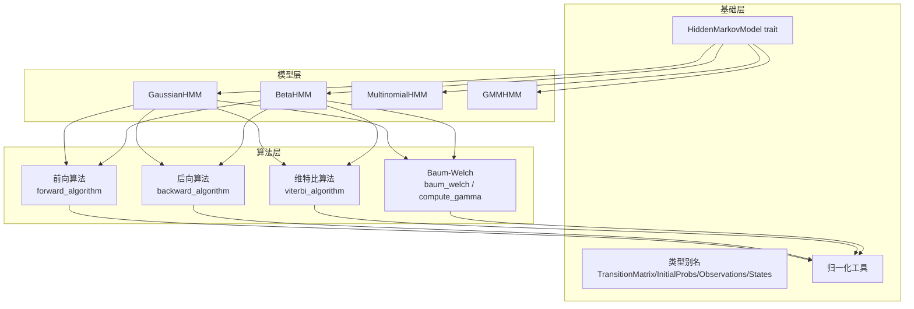
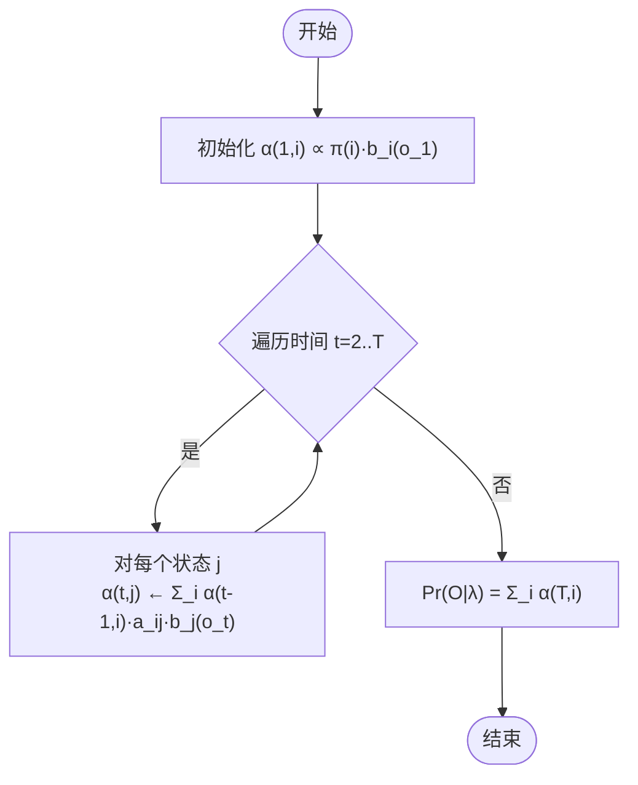
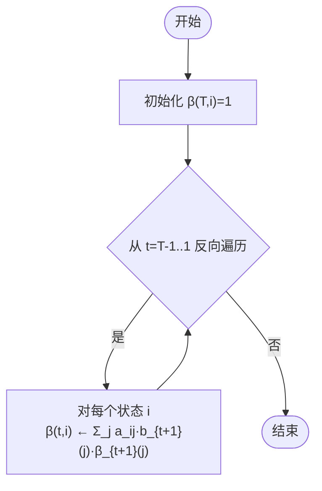
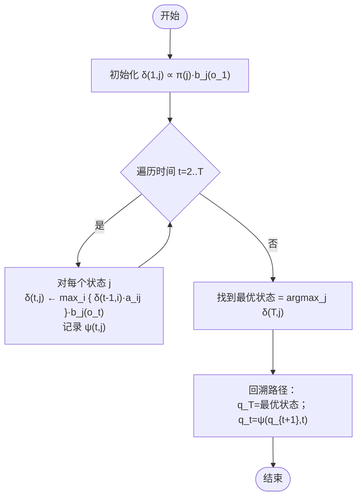
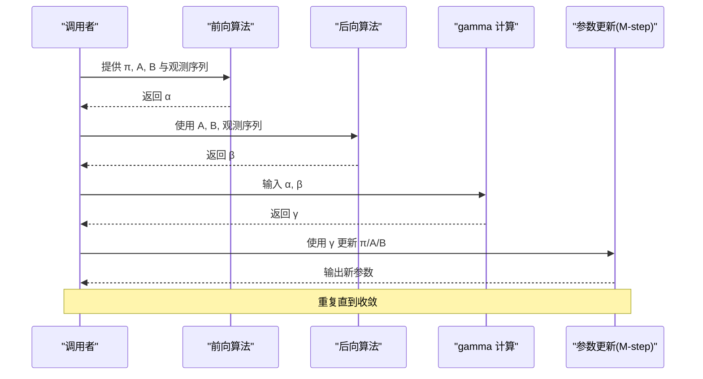
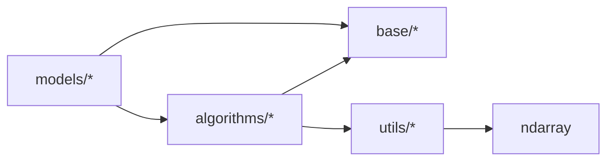

# 算法原理

<cite>
**本文引用的文件**
- [src/lib.rs](file://src/lib.rs)
- [src/algorithms/mod.rs](file://src/algorithms/mod.rs)
- [src/algorithms/forward.rs](file://src/algorithms/forward.rs)
- [src/algorithms/backward.rs](file://src/algorithms/backward.rs)
- [src/algorithms/viterbi.rs](file://src/algorithms/viterbi.rs)
- [src/algorithms/baum_welch.rs](file://src/algorithms/baum_welch.rs)
- [src/base/hmm.rs](file://src/base/hmm.rs)
- [src/base/types.rs](file://src/base/types.rs)
- [src/utils/mod.rs](file://src/utils/mod.rs)
- [src/utils/normalization.rs](file://src/utils/normalization.rs)
- [examples/beta_hmm_example.rs](file://examples/beta_hmm_example.rs)
- [tests/integration_tests.rs](file://tests/integration_tests.rs)
- [README.md](file://README.md)
</cite>

## 目录
1. [引言](#引言)
2. [项目结构](#项目结构)
3. [核心组件](#核心组件)
4. [架构总览](#架构总览)
5. [详细组件分析](#详细组件分析)
6. [依赖关系分析](#依赖关系分析)
7. [性能考量](#性能考量)
8. [故障排查指南](#故障排查指南)
9. [结论](#结论)
10. [附录](#附录)

## 引言
本文件围绕 HMM（隐马尔可夫模型）的核心算法进行系统化、深入且可操作的理论与实现说明，覆盖以下内容：
- 前向算法：递推公式、动态规划思想、观测序列概率的计算方法
- 后向算法：反向递推过程及其与前向算法的关系
- 维特比算法：最优路径搜索机制与状态序列解码过程
- Baum-Welch 算法：EM 迭代中的 E-step 与 M-step 推导、参数更新与收敛判断
- 复杂度分析：时间与空间复杂度
- 流程图与伪代码：帮助理解每一步的计算逻辑
- 收敛判断与数值稳定性：对数空间与归一化策略

该库采用 ndarray 进行高效数值计算，广泛使用 log 概率与数值稳定技巧，支持多种 HMM 模型类型（高斯、Beta 等），并通过统一的 HiddenMarkovModel trait 对外暴露训练、预测、评分与采样能力。

## 项目结构
该仓库采用按功能域划分的模块化组织方式，核心算法集中在 algorithms 子模块，基础接口在 base 中定义，工具函数在 utils 中提供，模型实现位于 models 子目录。入口模块通过 lib.rs 统一导出公共 API。

图表来源
- [src/lib.rs](file://src/lib.rs#L19-L27)
- [src/algorithms/mod.rs](file://src/algorithms/mod.rs#L1-L12)
- [src/base/hmm.rs](file://src/base/hmm.rs#L6-L61)
- [src/base/types.rs](file://src/base/types.rs#L5-L29)
- [src/utils/mod.rs](file://src/utils/mod.rs#L1-L12)

章节来源
- [src/lib.rs](file://src/lib.rs#L1-L28)
- [README.md](file://README.md#L6-L30)

## 核心组件
- HiddenMarkovModel trait：定义了模型必须提供的能力，包括 n_states、n_features、fit、predict、score、sample、decode 等。这为所有 HMM 模型提供了统一接口，便于算法模块复用。
- 类型别名：TransitionMatrix、InitialProbs、Observations、States 等，统一了数据形状与语义，降低调用方心智负担。
- 归一化工具：normalize_vector、normalize_matrix_rows、log_normalize、exp_normalize，确保概率分布合法化与数值稳定性。

章节来源
- [src/base/hmm.rs](file://src/base/hmm.rs#L6-L61)
- [src/base/types.rs](file://src/base/types.rs#L5-L29)
- [src/utils/normalization.rs](file://src/utils/normalization.rs#L5-L35)

## 架构总览
下图展示了算法模块与基础接口之间的交互关系，以及算法在模型训练与推理中的位置。

图表来源
- [src/base/hmm.rs](file://src/base/hmm.rs#L6-L61)
- [src/base/types.rs](file://src/base/types.rs#L5-L29)
- [src/algorithms/forward.rs](file://src/algorithms/forward.rs#L20-L47)
- [src/algorithms/backward.rs](file://src/algorithms/backward.rs#L19-L45)
- [src/algorithms/viterbi.rs](file://src/algorithms/viterbi.rs#L20-L74)
- [src/algorithms/baum_welch.rs](file://src/algorithms/baum_welch.rs#L25-L74)
- [src/utils/normalization.rs](file://src/utils/normalization.rs#L5-L35)

## 详细组件分析

### 前向算法（Forward Algorithm）
- 动态规划思想：定义前向变量 α_t(i) 表示到时间 t 止、处于状态 i 且已观察到前 t 个观测的概率。通过初值与递推关系逐步累积，最终观测序列的概率可由 α_T(·) 的和得到。
- 数学要点
  - 初值：α_1(i) ∝ π(i) · b_i(o_1)
  - 递推：α_{t+1}(j) ∝ Σ_i α_t(i) · a_{ij} · b_j(o_{t+1})
  - 观测概率：Pr(O|λ) = Σ_i α_T(i)
  - 实现细节：使用 ndarray 矩阵存储 α，逐行迭代；对数空间可避免下溢。
- 复杂度
  - 时间复杂度：O(T · N^2)，T 为观测长度，N 为状态数
  - 空间复杂度：O(T · N)
- 关键实现位置
  - 前向变量计算：[forward_algorithm](file://src/algorithms/forward.rs#L20-L47)
  - 观测序列对数概率：[forward_log_probability](file://src/algorithms/forward.rs#L60-L69)

图表来源
- [src/algorithms/forward.rs](file://src/algorithms/forward.rs#L20-L47)

章节来源
- [src/algorithms/forward.rs](file://src/algorithms/forward.rs#L6-L69)

### 后向算法（Backward Algorithm）
- 反向递推：定义后向变量 β_t(i) 表示在状态 i 下，从时间 t+1 到 T 的部分观测的概率。通过终值与反向递推，可与前向变量形成一致性校验。
- 数学要点
  - 终值：β_T(i) = 1
  - 递推：β_t(i) = Σ_j a_ij · b_{t+1}(j) · β_{t+1}(j)
  - 关系：Pr(O|λ) 也可由 α_t(i)·β_t(i) 的行和表示（与 α 的和一致）
- 复杂度
  - 时间复杂度：O(T · N^2)
  - 空间复杂度：O(T · N)
- 关键实现位置
  - 后向变量计算：[backward_algorithm](file://src/algorithms/backward.rs#L19-L45)

图表来源
- [src/algorithms/backward.rs](file://src/algorithms/backward.rs#L19-L45)

章节来源
- [src/algorithms/backward.rs](file://src/algorithms/backward.rs#L6-L45)

### 维特比算法（Viterbi Algorithm）
- 最优路径搜索：在所有可能的状态序列中寻找概率最大的一条，同时记录回溯指针以便重建路径。
- 数学要点
  - 定义 δ_t(j) 为到时刻 t 且状态为 j 的最优路径概率；ψ_t(j) 记录最优路径上的前一状态
  - 初值：δ_1(j) = π(j) · b_j(o_1)
  - 递推：δ_t(j) = [max_i { δ_{t-1}(i) · a_ij }] · b_j(o_t)，并记录 ψ_t(j)
  - 回溯：从 T 时刻最优状态出发，沿 ψ 回溯得到完整路径
- 复杂度
  - 时间复杂度：O(T · N^2)
  - 空间复杂度：O(T · N)
- 关键实现位置
  - 路径搜索与回溯：[viterbi_algorithm](file://src/algorithms/viterbi.rs#L20-L74)

图表来源
- [src/algorithms/viterbi.rs](file://src/algorithms/viterbi.rs#L20-L74)

章节来源
- [src/algorithms/viterbi.rs](file://src/algorithms/viterbi.rs#L6-L74)

### Baum-Welch 算法（EM 迭代）
- 目标：在给定观测序列的情况下，使用 EM 算法估计 HMM 参数（初始概率、转移概率、发射概率）的最大似然估计。
- E-step 与 M-step
  - E-step：利用前向-后向变量计算“期望占用概率”γ_t(i) 与“期望转移概率”ξ_t(i,j)
  - M-step：基于 γ 与 ξ 重新估计 π、A、B，使似然最大化
- 关键实现位置
  - EM 主流程占位符：[baum_welch](file://src/algorithms/baum_welch.rs#L25-L44)
  - γ 计算（状态占用概率）：[compute_gamma](file://src/algorithms/baum_welch.rs#L56-L74)
  - 归一化工具（行归一化）：[normalize_matrix_rows](file://src/utils/normalization.rs#L14-L23)

图表来源
- [src/algorithms/baum_welch.rs](file://src/algorithms/baum_welch.rs#L25-L74)
- [src/algorithms/forward.rs](file://src/algorithms/forward.rs#L20-L47)
- [src/algorithms/backward.rs](file://src/algorithms/backward.rs#L19-L45)
- [src/utils/normalization.rs](file://src/utils/normalization.rs#L14-L23)

章节来源
- [src/algorithms/baum_welch.rs](file://src/algorithms/baum_welch.rs#L8-L74)
- [src/utils/normalization.rs](file://src/utils/normalization.rs#L14-L23)

## 依赖关系分析
- 模块耦合
  - algorithms 子模块独立于具体模型，仅依赖基础类型与工具函数，内聚性高
  - base 层提供统一接口与类型，被 models 与 algorithms 广泛依赖
  - utils 提供概率归一化与 log/exp 工具，被各算法共享
- 外部依赖
  - ndarray：数组与线性代数运算
  - ndarray-linalg：线性代数扩展（模型实现中可能使用）
  - rand/rand_distr：随机采样与分布
  - serde：序列化支持（模型实现中可能使用）

图表来源
- [src/lib.rs](file://src/lib.rs#L19-L27)
- [src/algorithms/mod.rs](file://src/algorithms/mod.rs#L1-L12)
- [src/utils/mod.rs](file://src/utils/mod.rs#L1-L12)

章节来源
- [src/lib.rs](file://src/lib.rs#L19-L27)
- [README.md](file://README.md#L44-L52)

## 性能考量
- 数据结构与内存
  - 使用 ndarray 矩阵存储 α、β、γ、Viterbi 表等，避免频繁分配
  - 行优先布局利于缓存局部性，减少跨行访问
- 计算优化
  - 尽可能使用向量化操作与循环展开（在 Rust 中由 ndarray 与底层 BLAS 驱动）
  - 在概率计算中优先使用 log 概率，避免连乘导致的下溢
- 复杂度总结
  - 前向/后向/维特比：O(T · N^2)
  - Baum-Welch：每次迭代 O(T · N^2)，需多次迭代直至收敛
  - 空间：O(T · N)

章节来源
- [README.md](file://README.md#L222-L229)
- [src/algorithms/forward.rs](file://src/algorithms/forward.rs#L20-L47)
- [src/algorithms/backward.rs](file://src/algorithms/backward.rs#L19-L45)
- [src/algorithms/viterbi.rs](file://src/algorithms/viterbi.rs#L20-L74)
- [src/algorithms/baum_welch.rs](file://src/algorithms/baum_welch.rs#L25-L44)

## 故障排查指南
- 常见错误与定位
  - 训练前未拟合即预测：调用 predict/score 会失败，应先 fit
  - 观测为空或维度不合法：fit 时会返回错误，检查观测矩阵形状
  - 概率归一化异常：确保使用 normalize_vector/normalize_matrix_rows
- 单元测试参考
  - 前向/后向一致性：[integration_tests.rs](file://tests/integration_tests.rs#L30-L45)
  - 维特比确定性路径：[integration_tests.rs](file://tests/integration_tests.rs#L48-L60)
  - 归一化与验证：[integration_tests.rs](file://tests/integration_tests.rs#L63-L72)
  - 多序列训练：[integration_tests.rs](file://tests/integration_tests.rs#L75-L85)
  - 错误处理：[integration_tests.rs](file://tests/integration_tests.rs#L88-L102)
- 示例程序
  - Beta HMM 使用流程与输出解读：[examples/beta_hmm_example.rs](file://examples/beta_hmm_example.rs#L57-L186)

章节来源
- [tests/integration_tests.rs](file://tests/integration_tests.rs#L88-L102)
- [examples/beta_hmm_example.rs](file://examples/beta_hmm_example.rs#L57-L186)

## 结论
本库以清晰的模块化设计实现了 HMM 的四大核心算法：前向、后向、维特比与 Baum-Welch，并通过统一的 HiddenMarkovModel 接口与 ndarray 高效数值库，兼顾了易用性与性能。算法均采用 log 概率与行归一化策略，保证数值稳定性；复杂度与实现路径明确，便于扩展到更多模型类型（如 GMM、多项式等）。建议在实际工程中结合多序列训练、收敛阈值与数值稳定性策略，获得更稳健的训练效果。

## 附录
- 使用示例与工作流
  - 快速入门与 API 概览：[README.md](file://README.md#L53-L170)
  - Beta HMM 示例：[examples/beta_hmm_example.rs](file://examples/beta_hmm_example.rs#L15-L266)
- 类型与常量
  - 类型别名与协方差类型：[src/base/types.rs](file://src/base/types.rs#L5-L29)
- 工具函数
  - 归一化与 log/exp 工具：[src/utils/normalization.rs](file://src/utils/normalization.rs#L5-L35)