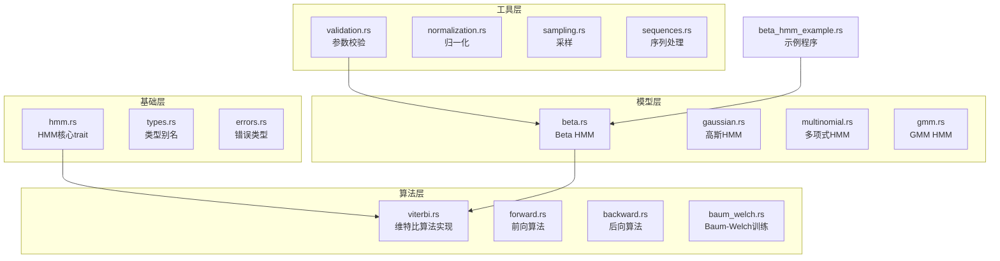
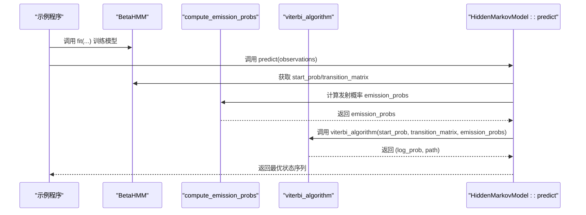
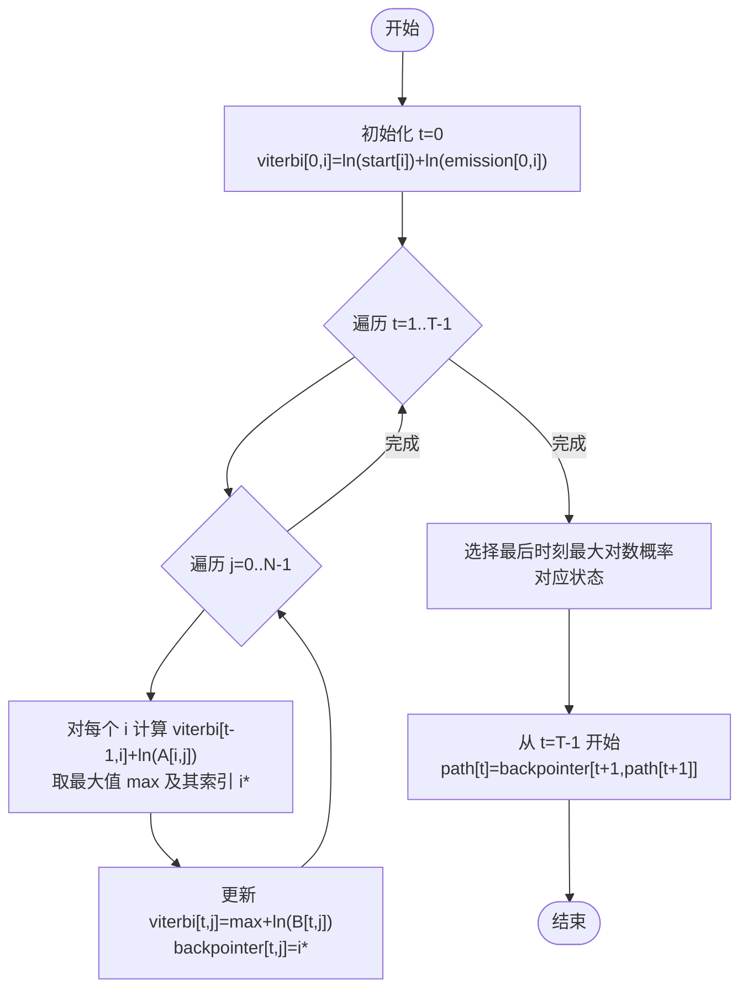
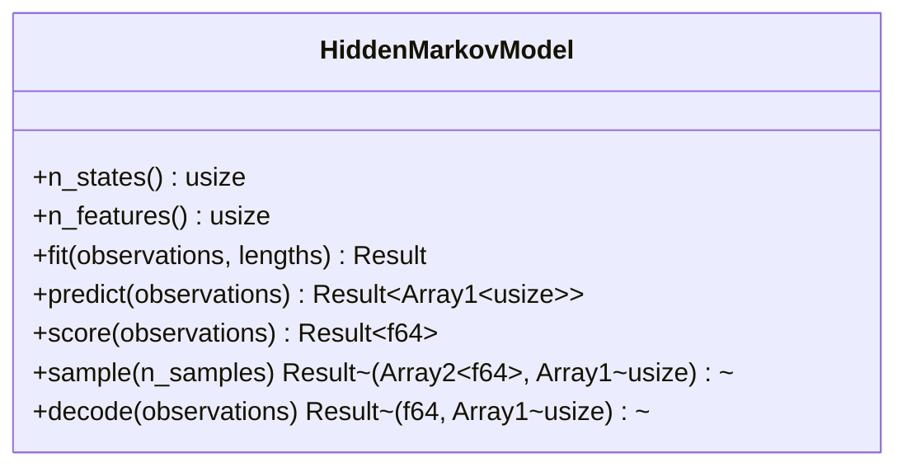
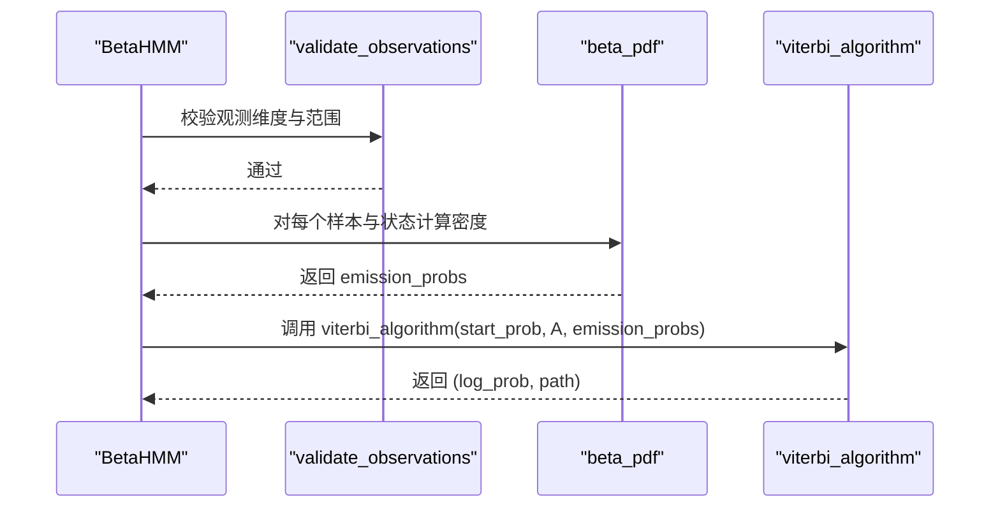
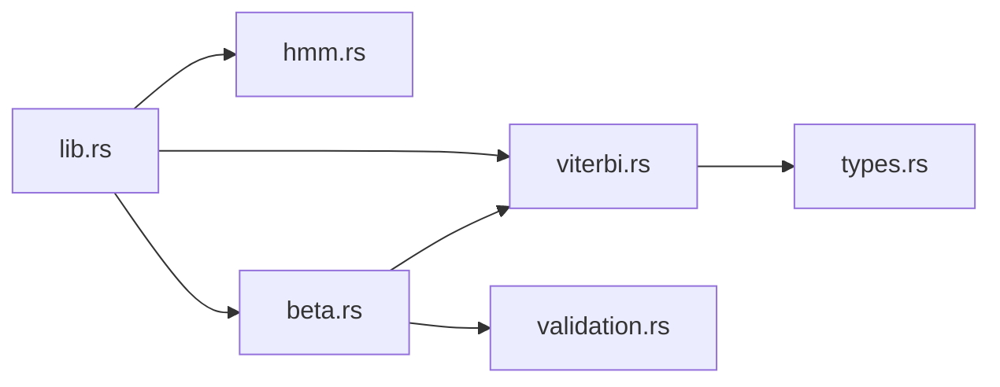

# 维特比算法

<cite>
**本文引用的文件**
- [src/algorithms/viterbi.rs](file://src/algorithms/viterbi.rs)
- [src/base/hmm.rs](file://src/base/hmm.rs)
- [src/base/types.rs](file://src/base/types.rs)
- [src/models/beta.rs](file://src/models/beta.rs)
- [src/utils/validation.rs](file://src/utils/validation.rs)
- [examples/beta_hmm_example.rs](file://examples/beta_hmm_example.rs)
- [src/lib.rs](file://src/lib.rs)
- [Cargo.toml](file://Cargo.toml)
- [README.md](file://README.md)
</cite>

## 目录
1. [引言](#引言)
2. [项目结构](#项目结构)
3. [核心组件](#核心组件)
4. [架构总览](#架构总览)
5. [详细组件分析](#详细组件分析)
6. [依赖分析](#依赖分析)
7. [性能考虑](#性能考虑)
8. [故障排查指南](#故障排查指南)
9. [结论](#结论)
10. [附录](#附录)

## 引言
本文件围绕维特比算法的理论与实现进行系统化梳理，目标是帮助读者从数学原理到工程实现全面掌握该算法。维特比算法用于在隐马尔可夫模型（HMM）中寻找最可能的状态序列（最优路径），使观测序列与状态序列同时最大化。本文将：
- 解释动态规划递推关系与概率最大化原则；
- 深入分析 delta（累积概率）与 psi（路径指针）两个关键数组；
- 说明初始化、递推与回溯三阶段的具体实现；
- 展示如何从最优概率与路径指针重建最优状态序列；
- 提供完整的代码实现分析，涵盖状态转移概率与发射概率的处理；
- 给出时间复杂度 O(T×N²) 与空间复杂度评估；
- 包含实际应用示例与调试技巧；
- 讨论适用场景与局限性。

## 项目结构
该项目采用模块化组织，核心算法位于 algorithms 子模块，基础接口定义于 base 子模块，具体模型（如 Beta HMM）位于 models 子模块，工具函数与验证逻辑位于 utils 子模块。示例程序位于 examples 目录，顶层入口在 src/lib.rs 中导出常用类型与 trait。

图表来源
- [src/algorithms/viterbi.rs](file://src/algorithms/viterbi.rs#L1-L118)
- [src/base/hmm.rs](file://src/base/hmm.rs#L1-L62)
- [src/models/beta.rs](file://src/models/beta.rs#L1-L200)
- [src/utils/validation.rs](file://src/utils/validation.rs#L1-L141)
- [examples/beta_hmm_example.rs](file://examples/beta_hmm_example.rs#L1-L266)

章节来源
- [src/lib.rs](file://src/lib.rs#L1-L28)
- [Cargo.toml](file://Cargo.toml#L1-L23)

## 核心组件
- 维特比算法实现：位于 algorithms/viterbi.rs，提供 viterbi_algorithm 函数，输入初始概率、转移矩阵与发射概率，输出最优对数概率与状态序列。
- HMM 核心 trait：位于 base/hmm.rs，定义 predict、score、sample 等方法，并提供 decode 的默认实现。
- 类型别名：位于 base/types.rs，统一了转移矩阵、初始概率、观测序列与状态序列等类型别名。
- 参数校验：位于 utils/validation.rs，提供概率向量、转移矩阵与观测维度的校验。
- 示例：位于 examples/beta_hmm_example.rs，演示 Beta HMM 的训练、预测与评估流程。

章节来源
- [src/algorithms/viterbi.rs](file://src/algorithms/viterbi.rs#L1-L118)
- [src/base/hmm.rs](file://src/base/hmm.rs#L1-L62)
- [src/base/types.rs](file://src/base/types.rs#L1-L61)
- [src/utils/validation.rs](file://src/utils/validation.rs#L1-L141)
- [examples/beta_hmm_example.rs](file://examples/beta_hmm_example.rs#L1-L266)

## 架构总览
下图展示了维特比算法在系统中的位置与调用关系：模型通过 compute_emission_probs 生成发射概率，随后调用 viterbi_algorithm 进行解码；最终由 decode 或 predict 返回最优状态序列与对数概率。

图表来源
- [src/models/beta.rs](file://src/models/beta.rs#L116-L157)
- [src/algorithms/viterbi.rs](file://src/algorithms/viterbi.rs#L20-L74)
- [src/base/hmm.rs](file://src/base/hmm.rs#L22-L31)

## 详细组件分析

### 维特比算法实现（viterbi_algorithm）
- 输入参数
  - start_prob：初始状态概率向量，长度为 N。
  - transition_matrix：状态转移矩阵，形状为 (N, N)，每行和为 1。
  - emission_probs：发射概率矩阵，形状为 (T, N)，其中 T 为观测序列长度。
- 输出
  - (log_prob, path)：最优对数概率与状态序列（长度为 T）。
- 关键数据结构
  - viterbi：二维数组，形状 (T, N)，存储每个时刻 t 的最大对数概率（log-space）。
  - backpointer：二维数组，形状 (T, N)，记录每个时刻 t 的最优前驱状态索引。
- 初始化
  - 对 t=0，计算每个状态 i 的对数概率：viterbi[0,i] = ln(start_prob[i]) + ln(emission_probs[0,i])。
- 递推
  - 对每个时刻 t∈[1..T-1] 与每个状态 j∈[0..N-1]：
    - 寻找前一时刻 i 使得 viterbi[t-1,i] + ln(transition_matrix[i,j]) 最大；
    - 更新 viterbi[t,j] = max + ln(emission_probs[t,j])，并记录 backpointer[t,j] = argmax。
- 回溯
  - 找到最后时刻的最大对数概率对应的最优状态；
  - 从 t=T-1 向前根据 backpointer 回溯得到完整路径 path。

图表来源
- [src/algorithms/viterbi.rs](file://src/algorithms/viterbi.rs#L31-L74)

章节来源
- [src/algorithms/viterbi.rs](file://src/algorithms/viterbi.rs#L1-L118)

### HMM 核心 trait 与预测流程
- HiddenMarkovModel trait 定义了模型应具备的能力：n_states、n_features、fit、predict、score、sample、decode。
- predict 默认实现会调用模型内部的解码逻辑（例如调用 viterbi_algorithm），并返回状态序列。
- decode 在 predict 基础上再计算观测序列的对数概率，返回 (log_prob, states)。

图表来源
- [src/base/hmm.rs](file://src/base/hmm.rs#L7-L61)

章节来源
- [src/base/hmm.rs](file://src/base/hmm.rs#L1-L62)

### Beta HMM 中的发射概率与维特比集成
- compute_emission_probs 将观测序列映射为发射概率矩阵 emission_probs。对于 Beta 分布，按特征维度累乘各状态下的密度值（或对数密度之和）。
- 在 BetaHMM 中，观测值需位于开区间 (0,1)，否则触发参数校验错误。
- 预测时，模型先计算发射概率，再调用 viterbi_algorithm 得到最优路径。

图表来源
- [src/models/beta.rs](file://src/models/beta.rs#L116-L157)
- [src/utils/validation.rs](file://src/utils/validation.rs#L58-L74)
- [src/algorithms/viterbi.rs](file://src/algorithms/viterbi.rs#L20-L74)

章节来源
- [src/models/beta.rs](file://src/models/beta.rs#L1-L200)
- [src/utils/validation.rs](file://src/utils/validation.rs#L1-L141)

### 实际应用示例与调试技巧
- 示例程序展示了如何使用 Beta HMM 进行转化率分析：加载观测数据、训练模型、查看学习到的参数、预测隐藏状态、计算对数似然以及生成新样本。
- 调试建议：
  - 观察发射概率是否为正且非零（log-space 下为有限值）；
  - 校验初始概率与转移矩阵是否合法（非负、行和为 1）；
  - 检查观测维度与模型期望一致；
  - 使用小规模测试数据验证路径回溯正确性。

章节来源
- [examples/beta_hmm_example.rs](file://examples/beta_hmm_example.rs#L1-L266)

## 依赖分析
- 外部依赖
  - ndarray：提供多维数组与线性代数运算；
  - ndarray-linalg：线性代数支持；
  - rand/rand_distr：随机数与概率分布；
  - thiserror：错误处理；
  - serde：序列化支持。
- 内部模块依赖
  - algorithms/viterbi.rs 依赖 base/types.rs 的类型别名；
  - models/beta.rs 依赖 algorithms/mod.rs 中的 viterbi_algorithm；
  - utils/validation.rs 提供参数校验能力，被 models/beta.rs 使用。

图表来源
- [src/algorithms/viterbi.rs](file://src/algorithms/viterbi.rs#L1-L118)
- [src/base/types.rs](file://src/base/types.rs#L1-L61)
- [src/models/beta.rs](file://src/models/beta.rs#L1-L200)
- [src/utils/validation.rs](file://src/utils/validation.rs#L1-L141)
- [src/lib.rs](file://src/lib.rs#L1-L28)

章节来源
- [Cargo.toml](file://Cargo.toml#L13-L20)
- [src/lib.rs](file://src/lib.rs#L1-L28)

## 性能考虑
- 时间复杂度
  - 维特比算法对每个时刻 t∈[1..T-1] 遍历所有状态 j∈[0..N-1]，并在每个 j 上遍历前一时刻的所有状态 i∈[0..N-1]，因此总体复杂度为 O(T×N²)。
- 空间复杂度
  - viterbi 与 backpointer 各自占用 O(T×N) 的空间；若仅需路径而不需要完整表，可优化为滚动数组以降至 O(N)。
- 数值稳定性
  - 采用对数空间（log）避免连乘导致的下溢；注意对数加法与比较的正确性。
- 向量化与内存
  - 使用 ndarray 的向量化操作可减少循环开销；尽量避免不必要的中间拷贝。

章节来源
- [src/algorithms/viterbi.rs](file://src/algorithms/viterbi.rs#L36-L53)

## 故障排查指南
- 参数校验错误
  - 初始概率或转移矩阵不合法：检查非负性与和为 1；
  - 观测维度不匹配：确保观测列数等于模型特征数；
  - Beta HMM 观测不在 (0,1)：修正数据范围或使用其他模型。
- 数值问题
  - 发射概率为 0 或 NaN：检查参数估计与数值稳定性；
  - 对数概率异常：确认 log-space 计算正确。
- 路径回溯异常
  - 回溯结果长度不符：检查 backpointer 是否正确填充；
  - 最优状态选择错误：核对 max 比较与索引记录。

章节来源
- [src/utils/validation.rs](file://src/utils/validation.rs#L6-L74)
- [src/errors.rs](file://src/errors.rs#L9-L34)

## 结论
维特比算法通过动态规划在 HMM 中高效地搜索最优状态序列，其核心在于对数空间下的累积概率与路径指针维护。在本项目中，算法以独立模块形式实现，并与模型层（如 Beta HMM）紧密协作：模型负责计算发射概率，算法负责解码最优路径。结合完善的参数校验与错误类型，系统在工程上具备良好的健壮性与可维护性。对于大规模序列与高维状态空间，建议关注内存优化与数值稳定性，以获得更佳的性能表现。

## 附录
- 适用场景
  - 序列标注与分割（如语音识别、生物信息学）；
  - 状态识别与模式检测（如金融市场状态、用户行为建模）；
  - 特定分布的数据建模（如 Beta HMM 适合比例/转化率等数据）。
- 局限性
  - 假设齐次马尔可夫性质与观测独立性；
  - 对长程依赖与复杂依赖结构表达能力有限；
  - 对噪声与异常值敏感，需配合预处理与鲁棒估计。