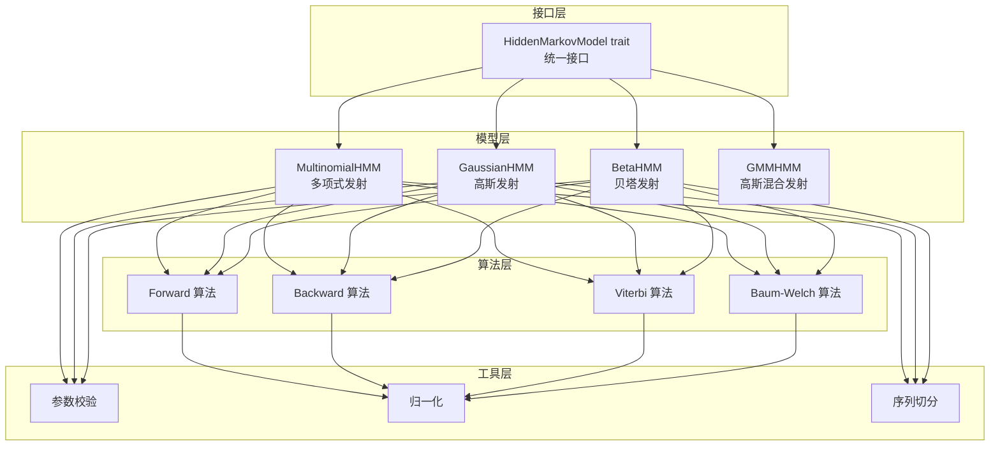
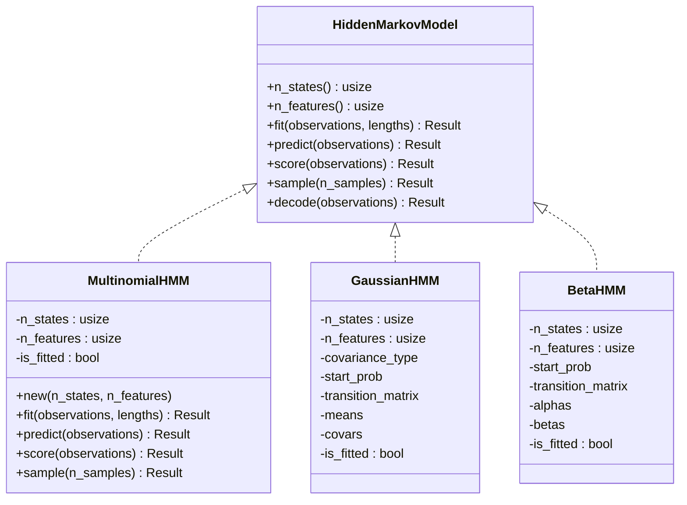
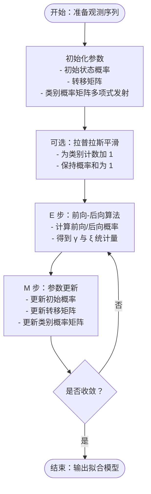
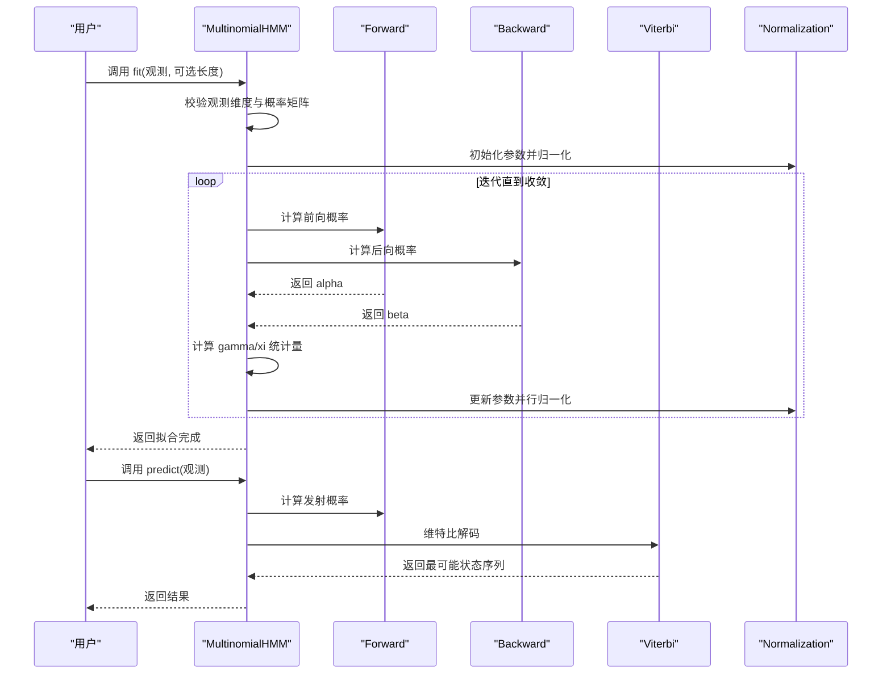
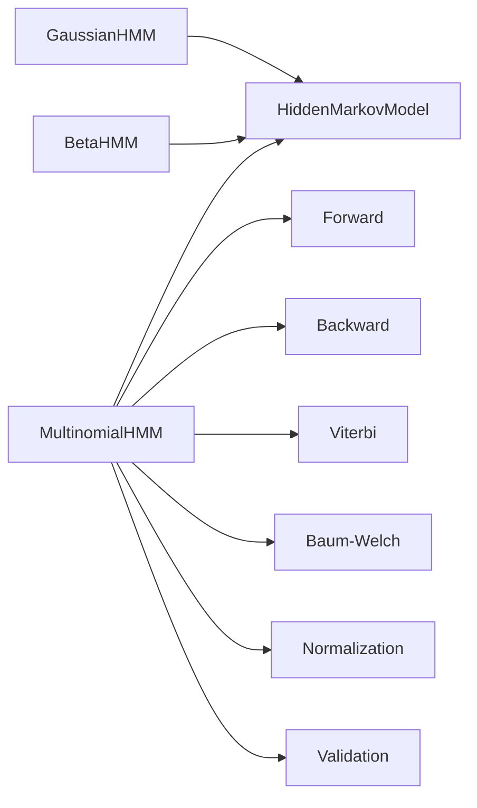
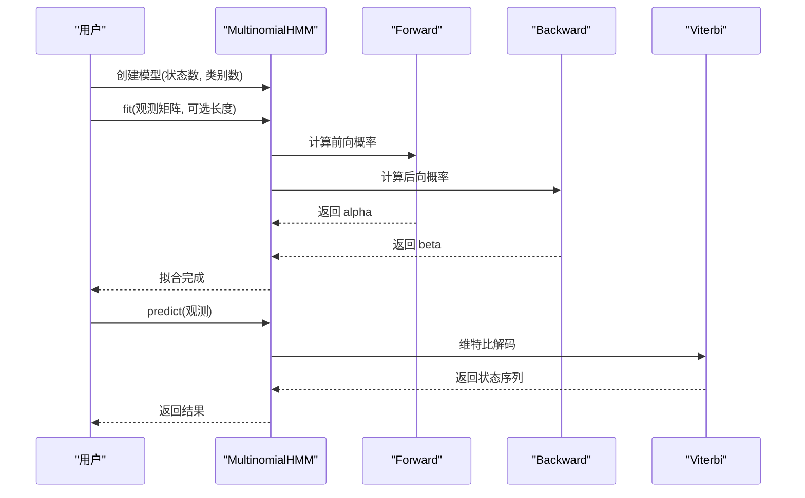

# 多项式 HMM

<cite>
**本文引用的文件**
- [src/lib.rs](file://src/lib.rs)
- [src/base/hmm.rs](file://src/base/hmm.rs)
- [src/base/types.rs](file://src/base/types.rs)
- [src/models/mod.rs](file://src/models/mod.rs)
- [src/models/multinomial.rs](file://src/models/multinomial.rs)
- [src/models/gaussian.rs](file://src/models/gaussian.rs)
- [src/models/beta.rs](file://src/models/beta.rs)
- [src/algorithms/forward.rs](file://src/algorithms/forward.rs)
- [src/algorithms/backward.rs](file://src/algorithms/backward.rs)
- [src/algorithms/viterbi.rs](file://src/algorithms/viterbi.rs)
- [src/algorithms/baum_welch.rs](file://src/algorithms/baum_welch.rs)
- [src/utils/validation.rs](file://src/utils/validation.rs)
- [src/utils/normalization.rs](file://src/utils/normalization.rs)
- [src/utils/sequences.rs](file://src/utils/sequences.rs)
- [examples/beta_hmm_example.rs](file://examples/beta_hmm_example.rs)
</cite>

## 目录
1. [引言](#引言)
2. [项目结构](#项目结构)
3. [核心组件](#核心组件)
4. [架构总览](#架构总览)
5. [详细组件分析](#详细组件分析)
6. [依赖关系分析](#依赖关系分析)
7. [性能考量](#性能考量)
8. [故障排查指南](#故障排查指南)
9. [结论](#结论)
10. [附录：使用示例与最佳实践](#附录使用示例与最佳实践)

## 引言
本文件面向“多项式 HMM（Multinomial HMM）”的实现与使用，系统性梳理其数学原理、参数估计与更新流程、与高斯 HMM 与贝塔 HMM 的差异、在自然语言处理与 DNA 序列分析中的应用、以及模型评估与性能优化建议。当前仓库中，多项式 HMM 已完成接口定义与框架集成，但训练与推理的具体实现仍处于占位状态；本文在不直接展示代码的前提下，基于现有模块化设计与通用 HMM 算法实现，给出可落地的实现细节与工程化建议。

## 项目结构
rhmm 是一个以模块化为核心的 Rust HMM 库，采用“接口 + 多模型实现 + 算法工具”的分层组织方式：
- 接口层：统一的 HMM trait 定义，约束所有模型必须实现的 fit/predict/score/sample 等能力
- 模型层：高斯、贝塔、高斯混合、多项式等不同发射分布的模型实现
- 算法层：前向、后向、维特比、Baum-Welch 等标准算法
- 工具层：参数校验、归一化、序列切分、采样等辅助功能

图表来源
- [src/base/hmm.rs](file://src/base/hmm.rs#L1-L62)
- [src/models/multinomial.rs](file://src/models/multinomial.rs#L1-L95)
- [src/models/gaussian.rs](file://src/models/gaussian.rs#L1-L681)
- [src/models/beta.rs](file://src/models/beta.rs#L1-L734)
- [src/algorithms/forward.rs](file://src/algorithms/forward.rs#L1-L129)
- [src/algorithms/backward.rs](file://src/algorithms/backward.rs#L1-L90)
- [src/algorithms/viterbi.rs](file://src/algorithms/viterbi.rs#L1-L118)
- [src/algorithms/baum_welch.rs](file://src/algorithms/baum_welch.rs#L1-L75)
- [src/utils/validation.rs](file://src/utils/validation.rs#L1-L141)
- [src/utils/normalization.rs](file://src/utils/normalization.rs#L1-L102)
- [src/utils/sequences.rs](file://src/utils/sequences.rs#L1-L153)

章节来源
- [src/lib.rs](file://src/lib.rs#L1-L28)
- [src/base/hmm.rs](file://src/base/hmm.rs#L1-L62)
- [src/models/mod.rs](file://src/models/mod.rs#L1-L12)

## 核心组件
- 统一接口：HiddenMarkovModel trait 规定模型必须具备的状态数、特征数、拟合、预测、评分、采样等能力
- 类型别名：转移矩阵、初始概率、观测序列、状态序列等类型别名，提升代码可读性
- 参数校验：概率向量与转移矩阵合法性校验，观测维度一致性检查
- 归一化工具：向量与矩阵行归一化、对数空间安全转换
- 序列处理：多序列长度校验与切分，支持非定长序列训练

章节来源
- [src/base/hmm.rs](file://src/base/hmm.rs#L1-L62)
- [src/base/types.rs](file://src/base/types.rs#L1-L61)
- [src/utils/validation.rs](file://src/utils/validation.rs#L1-L141)
- [src/utils/normalization.rs](file://src/utils/normalization.rs#L1-L102)
- [src/utils/sequences.rs](file://src/utils/sequences.rs#L1-L153)

## 架构总览
多项式 HMM 在当前仓库中通过实现 HiddenMarkovModel trait 集成到统一框架下，其核心职责是：
- 接收离散符号观测（每个样本为一个离散类别），并通过多项式发射分布建模
- 提供 fit/predict/score/sample 等能力，内部复用前向/后向/维特比/Baum-Welch 等算法
- 通过参数校验与归一化保障数值稳定性

图表来源
- [src/base/hmm.rs](file://src/base/hmm.rs#L1-L62)
- [src/models/multinomial.rs](file://src/models/multinomial.rs#L1-L95)
- [src/models/gaussian.rs](file://src/models/gaussian.rs#L1-L681)
- [src/models/beta.rs](file://src/models/beta.rs#L1-L734)

## 详细组件分析

### 多项式 HMM 数学原理与实现要点
- 发射分布：多项式分布用于建模离散符号序列，每个时间步的观测是一个固定维度的离散类别（如 one-hot 向量或整数类别）。多项式发射概率通常表示为类别概率矩阵，每行对应一个隐藏状态下的类别分布
- 参数估计与更新：
  - 初始参数：可采用经验频率估计类别概率，或引入拉普拉斯平滑以避免零概率问题
  - Baum-Welch 更新：通过 E 步计算状态占用概率 γ 与状态转移概率 ξ，M 步基于统计量更新类别概率矩阵
  - 维特比解码：在已学习的参数下，使用维特比算法求最可能的状态路径
- 数值稳定性：使用 log 概率与 log-sum-exp 技术，避免小数连乘导致的下溢；必要时对行向量进行 log 归一化

图表来源
- [src/algorithms/forward.rs](file://src/algorithms/forward.rs#L1-L129)
- [src/algorithms/backward.rs](file://src/algorithms/backward.rs#L1-L90)
- [src/algorithms/baum_welch.rs](file://src/algorithms/baum_welch.rs#L1-L75)
- [src/utils/normalization.rs](file://src/utils/normalization.rs#L1-L102)

章节来源
- [src/models/multinomial.rs](file://src/models/multinomial.rs#L1-L95)
- [src/base/hmm.rs](file://src/base/hmm.rs#L1-L62)

### 与高斯 HMM 的区别
- 发射分布：多项式 HMM 使用离散类别概率；高斯 HMM 使用连续变量的概率密度函数
- 参数估计：多项式 HMM 的类别概率通常来自计数与平滑；高斯 HMM 的均值与协方差通过矩估计或 EM 更新
- 协方差结构：高斯 HMM 支持多种协方差类型（满、对角、球面、绑定），多项式 HMM 不涉及协方差
- 应用场景：多项式适合词类标注、DNA 符号序列；高斯适合语音特征、时间序列

章节来源
- [src/models/gaussian.rs](file://src/models/gaussian.rs#L1-L681)
- [src/models/multinomial.rs](file://src/models/multinomial.rs#L1-L95)

### 与贝塔 HMM 的区别
- 发射分布：多项式 HMM 面向离散类别；贝塔 HMM 面向 [0,1] 区间连续比例数据（如转化率）
- 参数：多项式 HMM 以类别概率矩阵为主；贝塔 HMM 以形状参数 α/β 为主
- 数值稳定：贝塔 HMM 在 PDF 计算中使用对数与近似 Gamma 函数；多项式 HMM 主要关注计数与平滑

章节来源
- [src/models/beta.rs](file://src/models/beta.rs#L1-L734)
- [src/models/multinomial.rs](file://src/models/multinomial.rs#L1-L95)

### 参数初始化策略
- 初始状态概率与转移矩阵：均匀初始化并校验概率和为 1
- 类别概率矩阵（多项式）：基于观测类别计数的经验频率估计；为避免零概率，建议采用拉普拉斯平滑
- 多序列训练：先按长度切分序列，再在各序列上独立执行 E/M 步，最后汇总统计量

章节来源
- [src/utils/validation.rs](file://src/utils/validation.rs#L1-L141)
- [src/utils/sequences.rs](file://src/utils/sequences.rs#L1-L153)

### 训练算法实现细节
- 前向/后向：计算每个时间步每个状态的前向/后向概率，用于 E 步统计
- 维特比：在拟合完成后，使用维特比算法进行状态路径解码
- Baum-Welch：迭代执行 E/M 步，监控日志似然收敛

图表来源
- [src/models/multinomial.rs](file://src/models/multinomial.rs#L1-L95)
- [src/algorithms/forward.rs](file://src/algorithms/forward.rs#L1-L129)
- [src/algorithms/backward.rs](file://src/algorithms/backward.rs#L1-L90)
- [src/algorithms/viterbi.rs](file://src/algorithms/viterbi.rs#L1-L118)
- [src/algorithms/baum_welch.rs](file://src/algorithms/baum_welch.rs#L1-L75)
- [src/utils/normalization.rs](file://src/utils/normalization.rs#L1-L102)

## 依赖关系分析
- 模块耦合：模型实现依赖统一接口与算法工具；算法工具依赖归一化与验证工具
- 外部依赖：ndarray 用于数组运算；rand/rand_distr 用于采样；approx 用于测试断言
- 潜在循环依赖：当前未发现循环导入；各模块职责清晰

图表来源
- [src/models/multinomial.rs](file://src/models/multinomial.rs#L1-L95)
- [src/base/hmm.rs](file://src/base/hmm.rs#L1-L62)
- [src/algorithms/forward.rs](file://src/algorithms/forward.rs#L1-L129)
- [src/algorithms/backward.rs](file://src/algorithms/backward.rs#L1-L90)
- [src/algorithms/viterbi.rs](file://src/algorithms/viterbi.rs#L1-L118)
- [src/algorithms/baum_welch.rs](file://src/algorithms/baum_welch.rs#L1-L75)
- [src/utils/normalization.rs](file://src/utils/normalization.rs#L1-L102)
- [src/utils/validation.rs](file://src/utils/validation.rs#L1-L141)

章节来源
- [src/lib.rs](file://src/lib.rs#L1-L28)
- [src/models/mod.rs](file://src/models/mod.rs#L1-L12)

## 性能考量
- 矩阵运算：优先使用向量化操作与行归一化，减少循环开销
- 对数域计算：在发射概率与参数更新中广泛使用 log 概率，避免数值下溢
- 多序列处理：按序列切分独立处理，避免跨序列边界统计混淆
- 收敛控制：设置合理的最大迭代次数与容忍度，结合日志似然增量判断收敛

[本节为通用性能建议，无需特定文件引用]

## 故障排查指南
- 观测维度不匹配：当 n_features 与观测列数不一致时会报错
- 概率非法：初始概率或转移矩阵不合法（非概率范围或行和不为 1）会触发校验错误
- 模型未拟合：在 predict/score/sample 前需确保 fit 成功
- 数值异常：若出现 NaN/Inf，检查是否进行了 log 归一化与最小值钳制

章节来源
- [src/utils/validation.rs](file://src/utils/validation.rs#L1-L141)
- [src/models/multinomial.rs](file://src/models/multinomial.rs#L1-L95)

## 结论
多项式 HMM 作为离散符号序列建模的重要工具，在自然语言处理（如词性标注）、生物信息学（如 DNA 序列分析）等领域具有广泛应用前景。当前仓库提供了完善的接口与算法基础设施，建议在现有框架基础上补充多项式的具体参数估计与更新逻辑，并结合拉普拉斯平滑与对数域数值稳定技术，以获得更稳健的工程实现。

[本节为总结性内容，无需特定文件引用]

## 附录：使用示例与最佳实践

### 使用示例（概念性流程）
- 数据准备：将离散符号序列转换为类别索引或 one-hot 表示，确保每行代表一个时间步的观测
- 模型构建：创建多项式 HMM 实例，指定隐藏状态数与类别数
- 训练：调用 fit，传入观测矩阵与可选的序列长度列表（多序列场景）
- 解码：使用 predict 获取最可能状态序列；使用 score 计算日志似然
- 采样：使用 sample 生成新序列与对应状态

图表来源
- [src/models/multinomial.rs](file://src/models/multinomial.rs#L1-L95)
- [src/algorithms/forward.rs](file://src/algorithms/forward.rs#L1-L129)
- [src/algorithms/backward.rs](file://src/algorithms/backward.rs#L1-L90)
- [src/algorithms/viterbi.rs](file://src/algorithms/viterbi.rs#L1-L118)

### 最佳实践
- 拉普拉斯平滑：在类别计数上加 1，避免零概率导致的后验崩溃
- 多序列训练：使用序列切分工具保证长度正确性，避免跨序列统计
- 数值稳定：在发射概率与参数更新中使用 log 概率与 log-sum-exp
- 模型评估：比较不同状态数与类别数下的日志似然，选择最优模型复杂度

[本节为通用指导，无需特定文件引用]