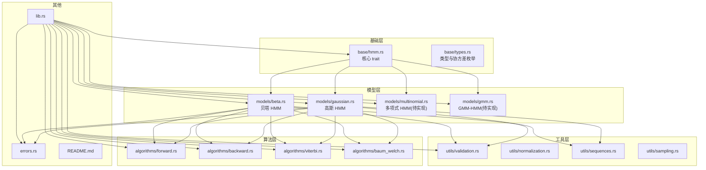
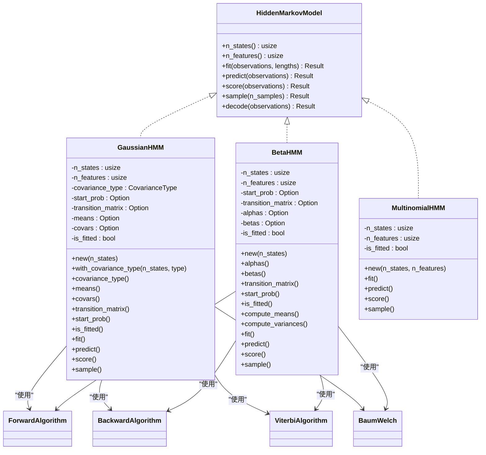
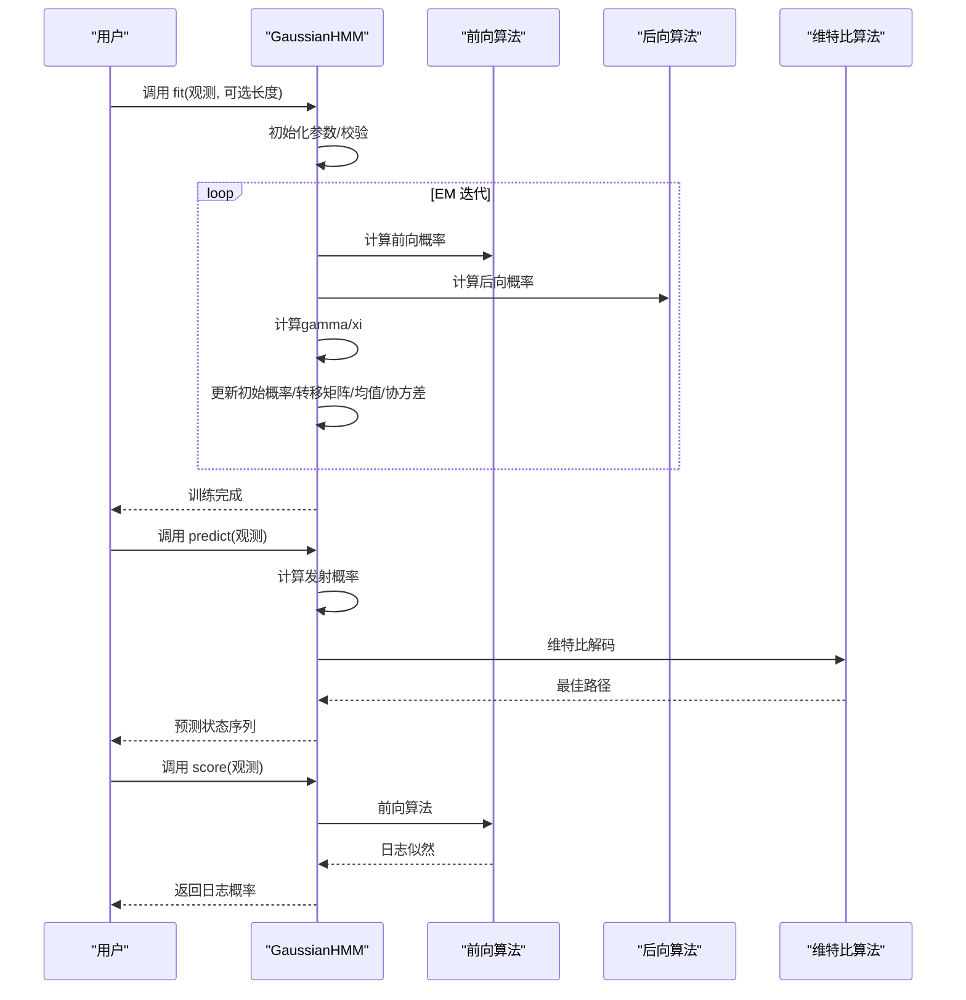
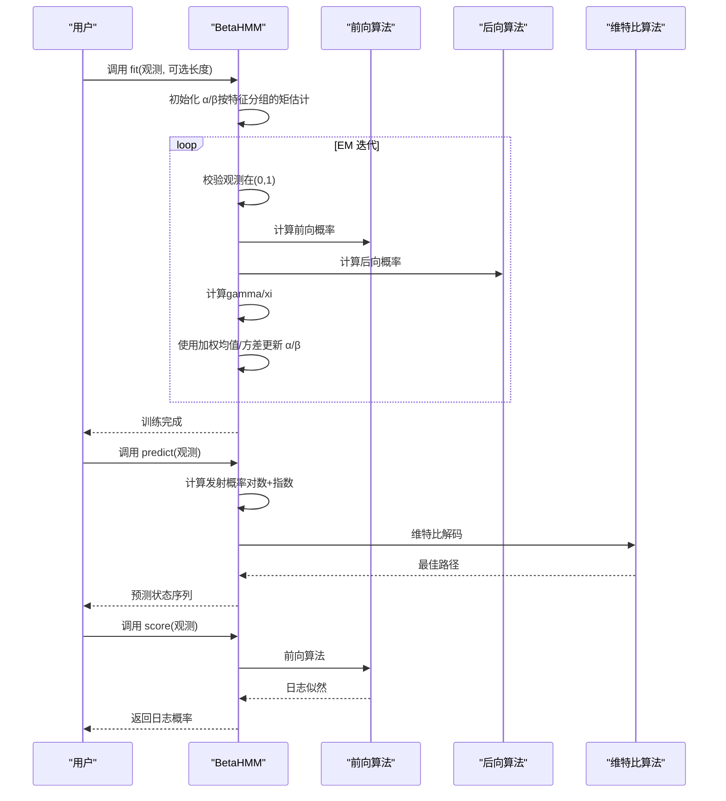
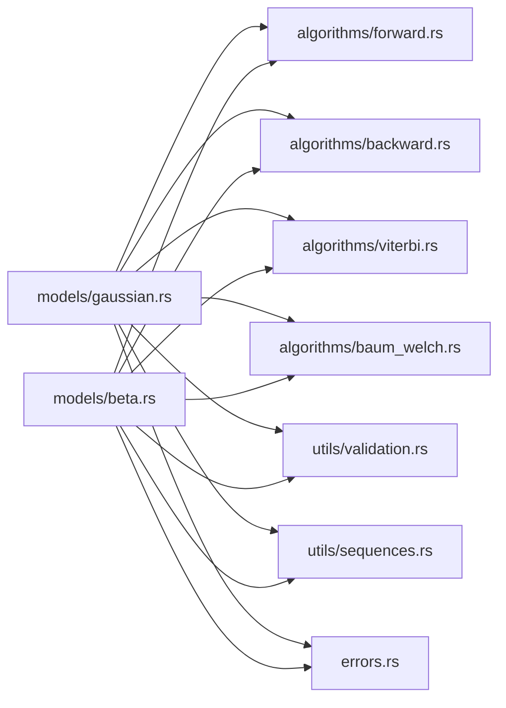

# 模型实现

<cite>
**本文引用的文件**
- [README.md](file://README.md)
- [lib.rs](file://src/lib.rs)
- [hmm.rs](file://src/base/hmm.rs)
- [types.rs](file://src/base/types.rs)
- [gaussian.rs](file://src/models/gaussian.rs)
- [beta.rs](file://src/models/beta.rs)
- [multinomial.rs](file://src/models/multinomial.rs)
- [mod.rs（models）](file://src/models/mod.rs)
- [forward.rs](file://src/algorithms/forward.rs)
- [backward.rs](file://src/algorithms/backward.rs)
- [viterbi.rs](file://src/algorithms/viterbi.rs)
- [baum_welch.rs](file://src/algorithms/baum_welch.rs)
- [validation.rs](file://src/utils/validation.rs)
- [errors.rs](file://src/errors.rs)
- [beta_hmm_example.rs](file://examples/beta_hmm_example.rs)
</cite>

## 目录
1. [简介](#简介)
2. [项目结构](#项目结构)
3. [核心组件](#核心组件)
4. [架构总览](#架构总览)
5. [详细组件分析](#详细组件分析)
6. [依赖关系分析](#依赖关系分析)
7. [性能与内存特性](#性能与内存特性)
8. [故障排除指南](#故障排除指南)
9. [结论](#结论)
10. [附录：使用示例与参数调优](#附录使用示例与参数调优)

## 简介
本库提供多种隐马尔可夫模型（HMM）的高效 Rust 实现，基于 ndarray 进行数值计算，并支持标准 HMM 算法（前向、后向、维特比、Baum-Welch）。当前已实现的模型包括：
- 高斯 HMM：用于连续观测数据
- 贝塔 HMM：用于区间 [0,1] 的比例/比率数据（如转化率、份额）
- 多项式 HMM：离散分类观测（开发中）
- 高斯混合模型 HMM（GMM-HMM）：复杂连续分布（开发中）

库强调数值稳定性（对数空间）、多序列训练、以及与 hmmlearn 的 API 对齐。

## 项目结构
模块化组织，核心分层如下：
- base：核心 trait、通用类型（状态转移矩阵、初始概率、协方差类型等）
- models：各模型实现（高斯、贝塔、多项式、GMM）
- algorithms：前向/后向/维特比/Baum-Welch 等算法
- utils：参数校验、序列切分、归一化、采样等工具
- errors：统一错误类型
- examples：示例程序（如贝塔 HMM 的电商转化率分析）

图表来源
- [lib.rs](file://src/lib.rs#L19-L28)
- [hmm.rs](file://src/base/hmm.rs#L7-L61)
- [types.rs](file://src/base/types.rs#L18-L29)
- [gaussian.rs](file://src/models/gaussian.rs#L14-L32)
- [beta.rs](file://src/models/beta.rs#L24-L39)
- [multinomial.rs](file://src/models/multinomial.rs#L12-L33)
- [forward.rs](file://src/algorithms/forward.rs#L20-L47)
- [backward.rs](file://src/algorithms/backward.rs#L19-L44)
- [viterbi.rs](file://src/algorithms/viterbi.rs#L20-L74)
- [baum_welch.rs](file://src/algorithms/baum_welch.rs#L25-L44)
- [validation.rs](file://src/utils/validation.rs#L6-L74)
- [errors.rs](file://src/errors.rs#L9-L34)

章节来源
- [lib.rs](file://src/lib.rs#L19-L28)
- [README.md](file://README.md#L1-L303)

## 核心组件
- 核心 trait：HiddenMarkovModel，定义 fit/predict/score/sample/decode 等接口
- 类型系统：InitialProbs、TransitionMatrix、Observations、States；协方差类型 CovarianceType（Full、Diagonal、Spherical、Tied）
- 错误体系：HmmError 提供参数、维度、概率、收敛、数值等错误类型
- 工具函数：参数校验（概率向量、转移矩阵、观测维度），序列切分与默认长度，向量归一化

章节来源
- [hmm.rs](file://src/base/hmm.rs#L7-L61)
- [types.rs](file://src/base/types.rs#L18-L29)
- [errors.rs](file://src/errors.rs#L9-L34)
- [validation.rs](file://src/utils/validation.rs#L6-L74)

## 架构总览
以下类图展示模型与算法、工具之间的关系：

图表来源
- [hmm.rs](file://src/base/hmm.rs#L7-L61)
- [gaussian.rs](file://src/models/gaussian.rs#L14-L32)
- [beta.rs](file://src/models/beta.rs#L24-L39)
- [multinomial.rs](file://src/models/multinomial.rs#L12-L33)
- [forward.rs](file://src/algorithms/forward.rs#L20-L47)
- [backward.rs](file://src/algorithms/backward.rs#L19-L44)
- [viterbi.rs](file://src/algorithms/viterbi.rs#L20-L74)
- [baum_welch.rs](file://src/algorithms/baum_welch.rs#L25-L44)

## 详细组件分析

### 高斯 HMM（GaussianHMM）
- 数学原理
  - 观测分布为多元高斯，状态转移由初始概率与转移矩阵控制
  - 支持多种协方差类型：对角（Diagonal，默认）、球面（Spherical，单方差）、完整（Full）、绑定（Tied）
- 参数估计（Baum-Welch EM）
  - E 步：前向/后向计算，得到状态占用概率 gamma 与转移概率 xi
  - M 步：更新初始概率、转移矩阵、均值与协方差
  - 收敛：基于日志似然增量小于阈值停止
- 数值稳定性
  - 使用对数空间（如维特比中对发射概率取对数）
  - 协方差对角化时对方差加最小值以避免奇异
- 训练与预测流程（序列图）

图表来源
- [gaussian.rs](file://src/models/gaussian.rs#L337-L491)
- [forward.rs](file://src/algorithms/forward.rs#L20-L47)
- [backward.rs](file://src/algorithms/backward.rs#L19-L44)
- [viterbi.rs](file://src/algorithms/viterbi.rs#L20-L74)

- 关键实现要点
  - 发射概率计算：根据协方差类型选择不同公式；对角/球面采用逐维方差；完整/绑定当前简化为对角形式
  - 参数初始化：随机选择观测作为均值初值，按整体方差初始化协方差
  - gamma/xi 计算：使用前向/后向结果标准化
  - 更新规则：均值为加权均值，协方差为加权方差（保证最小方差）
- 适用场景
  - 连续信号（语音、金融、传感器、生物信息）
- 注意事项
  - 当协方差类型为 Full/Tied 时，当前实现简化为对角，完整矩阵运算需扩展
  - 初始参数敏感，建议使用合理的初始化策略或先验

章节来源
- [gaussian.rs](file://src/models/gaussian.rs#L14-L681)
- [forward.rs](file://src/algorithms/forward.rs#L20-L47)
- [backward.rs](file://src/algorithms/backward.rs#L19-L44)
- [viterbi.rs](file://src/algorithms/viterbi.rs#L20-L74)
- [baum_welch.rs](file://src/algorithms/baum_welch.rs#L25-L44)

### 贝塔 HMM（BetaHMM）
- 数学原理
  - 观测分布在每个时间步独立服从贝塔分布，适合 [0,1] 区间的比例/比率数据
  - 每个状态/特征有形状参数 α、β，均值 α/(α+β)，方差 αβ/[(α+β)^2(α+β+1)]
- 参数估计（Baum-Welch EM）
  - E 步：前向/后向，计算 gamma/xi
  - M 步：使用加权样本均值/方差，通过矩估计转换为 α、β
  - 收敛：日志似然增量阈值
- 数值稳定性
  - 对观测值进行 clamp(ε, 1-ε)，参数 clamp(ε, +∞)，对数伽马函数使用斯特林近似
- 训练与预测流程（序列图）

图表来源
- [beta.rs](file://src/models/beta.rs#L393-L547)
- [forward.rs](file://src/algorithms/forward.rs#L20-L47)
- [backward.rs](file://src/algorithms/backward.rs#L19-L44)
- [viterbi.rs](file://src/algorithms/viterbi.rs#L20-L74)

- 关键实现要点
  - 发射概率：对每个特征求对数 PDF 后求和再指数化，避免下溢
  - 参数更新：对每个状态/特征使用加权样本均值与方差，再转为 α、β
  - 观测校验：确保在 (0,1) 内，否则报错
- 适用场景
  - 转化率、点击率、市场份额、成功率等比例数据
- 注意事项
  - 观测必须严格在 (0,1)，边界值会触发错误
  - 参数下界保护，避免数值不稳定

章节来源
- [beta.rs](file://src/models/beta.rs#L14-L734)
- [forward.rs](file://src/algorithms/forward.rs#L20-L47)
- [backward.rs](file://src/algorithms/backward.rs#L19-L44)
- [viterbi.rs](file://src/algorithms/viterbi.rs#L20-L74)

### 多项式 HMM（MultinomialHMM）
- 状态：当前未实现训练/预测/评分/采样，占位实现
- 适用场景：离散分类观测（如词袋、天气状态）
- 当前状态：TODO 待完善

章节来源
- [multinomial.rs](file://src/models/multinomial.rs#L12-L95)

### GMM-HMM（高斯混合模型 HMM）
- 状态：开发中（未实现）
- 扩展能力：每个状态使用多个高斯混合，适合复杂分布建模
- 当前状态：TODO 待完善

章节来源
- [mod.rs（models）](file://src/models/mod.rs#L3-L11)

## 依赖关系分析
- 模型依赖算法模块（前向/后向/维特比/Baum-Welch）
- 模型依赖工具模块（参数校验、序列切分、归一化）
- 模型依赖错误模块（统一错误处理）
- README 文档描述了安装、快速开始、用例与 API 概览

图表来源
- [gaussian.rs](file://src/models/gaussian.rs#L3-L9)
- [beta.rs](file://src/models/beta.rs#L3-L9)
- [forward.rs](file://src/algorithms/forward.rs#L3-L4)
- [backward.rs](file://src/algorithms/backward.rs#L3-L4)
- [viterbi.rs](file://src/algorithms/viterbi.rs#L3-L4)
- [baum_welch.rs](file://src/algorithms/baum_welch.rs#L3-L6)
- [validation.rs](file://src/utils/validation.rs#L3-L4)

章节来源
- [lib.rs](file://src/lib.rs#L19-L28)
- [README.md](file://README.md#L1-L303)

## 性能与内存特性
- 数值稳定性
  - 对数空间计算（维特比、前向/后向），避免概率下溢
  - 观测与参数的边界保护（贝塔 HMM 的 clamp 与最小值）
- 计算效率
  - ndarray 向量化操作，减少循环开销
  - 热路径尽量避免额外分配（如 gamma 归一化复用行）
- 时间复杂度
  - 单序列：前向/后向/维特比 O(T·N^2)，EM 每步 O(T·N^2)
  - 多序列：按序列独立处理，累计统计
- 内存使用
  - 主要消耗在 alpha/beta/gamma 矩阵与 xi 张量，随序列长度与状态数线性增长

章节来源
- [README.md](file://README.md#L222-L229)
- [gaussian.rs](file://src/models/gaussian.rs#L155-L194)
- [beta.rs](file://src/models/beta.rs#L173-L197)
- [forward.rs](file://src/algorithms/forward.rs#L20-L47)
- [backward.rs](file://src/algorithms/backward.rs#L19-L44)
- [viterbi.rs](file://src/algorithms/viterbi.rs#L20-L74)

## 故障排除指南
- 常见错误类型与定位
  - 参数无效：检查观测是否为空、维度是否匹配
  - 概率非法：初始概率/转移矩阵不合法（非负、行和为 1）
  - 模型未拟合：在预测/评分前必须 fit
  - 收敛失败：迭代次数过多或数值不稳定
  - 数值错误：对数/伽马/正态分布构造失败
- 定位步骤
  - 先验证观测维度与范围（贝塔 HMM 必须在 (0,1)）
  - 校验初始概率与转移矩阵
  - 检查协方差类型与最小方差保护
  - 逐步缩小到具体算法（前向/后向/维特比）
- 建议
  - 为高斯 HMM 提供合理初始均值/协方差
  - 贝塔 HMM 避免边界值，必要时做数据预处理
  - 增大容忍度或迭代上限以改善收敛

章节来源
- [errors.rs](file://src/errors.rs#L9-L34)
- [validation.rs](file://src/utils/validation.rs#L6-L74)
- [gaussian.rs](file://src/models/gaussian.rs#L337-L382)
- [beta.rs](file://src/models/beta.rs#L393-L438)

## 结论
该库提供了清晰的 HMM 抽象与高效的数值实现，覆盖高斯与贝塔两类重要观测分布，并预留多项式与高斯混合扩展。通过前向/后向/维特比/Baum-Welch 算法组合，满足从训练到推理的完整工作流。建议在生产中关注观测范围与数值稳定性，并结合业务场景选择合适的协方差类型与参数初始化策略。

## 附录：使用示例与参数调优
- 示例程序
  - 贝塔 HMM 电商转化率分析：演示训练、参数查看、预测、评分与采样
- 参数调优建议
  - 高斯 HMM
    - 协方差类型：优先 Diagonal；若维度高且相关性强可尝试 Full/Tied（需扩展实现）
    - 初始参数：基于聚类或领域知识设定均值/协方差
    - 收敛：增大迭代上限、减小容忍度；检查日志似然单调性
  - 贝塔 HMM
    - 观测预处理：确保严格在 (0,1)，必要时加小常数或缩放
    - 参数初始化：按特征分组做矩估计，避免极端 α/β
    - 收敛：适当提高迭代次数，观察 α/β 的稳定程度
- 多序列训练
  - 使用 lengths 指定各序列长度，避免跨序列转移统计
- API 参考
  - HiddenMarkovModel 接口：fit/predict/score/sample/decode
  - 协方差类型：CovarianceType（Full/Diagonal/Spherical/Tied）

章节来源
- [beta_hmm_example.rs](file://examples/beta_hmm_example.rs#L15-L266)
- [README.md](file://README.md#L53-L119)
- [hmm.rs](file://src/base/hmm.rs#L7-L61)
- [types.rs](file://src/base/types.rs#L18-L29)