# 贝塔 HMM 技术文档

<cite>
**本文档引用的文件**
- [README.md](file://README.md)
- [lib.rs](file://src/lib.rs)
- [beta.rs](file://src/models/beta.rs)
- [hmm.rs](file://src/base/hmm.rs)
- [types.rs](file://src/base/types.rs)
- [validation.rs](file://src/utils/validation.rs)
- [sequences.rs](file://src/utils/sequences.rs)
- [normalization.rs](file://src/utils/normalization.rs)
- [forward.rs](file://src/algorithms/forward.rs)
- [backward.rs](file://src/algorithms/backward.rs)
- [viterbi.rs](file://src/algorithms/viterbi.rs)
- [baum_welch.rs](file://src/algorithms/baum_welch.rs)
- [beta_hmm_example.rs](file://examples/beta_hmm_example.rs)
- [integration_tests.rs](file://tests/integration_tests.rs)
- [Cargo.toml](file://Cargo.toml)
</cite>

## 目录
1. [简介](#简介)
2. [项目结构](#项目结构)
3. [核心组件](#核心组件)
4. [架构概览](#架构概览)
5. [详细组件分析](#详细组件分析)
6. [依赖关系分析](#依赖关系分析)
7. [性能考量](#性能考量)
8. [故障排除指南](#故障排除指南)
9. [结论](#结论)
10. [附录](#附录)

## 简介

贝塔 HMM（Beta Hidden Markov Model）是基于贝塔分布的隐马尔可夫模型，专门用于建模范围在 [0, 1] 区间内的比例数据和概率数据。该模型在 e-commerce 转化率分析、营销点击率建模、金融市场份额动态分析等领域具有重要应用价值。

### 数学基础

贝塔分布的概率密度函数为：
$$f(x|\alpha,\beta) = \frac{1}{B(\alpha,\beta)} x^{\alpha-1}(1-x)^{\beta-1}$$

其中：
- $\alpha, \beta > 0$ 为形状参数
- $B(\alpha,\beta) = \frac{\Gamma(\alpha)\Gamma(\beta)}{\Gamma(\alpha+\beta)}$
- 均值：$\mu = \frac{\alpha}{\alpha+\beta}$
- 方差：$\sigma^2 = \frac{\alpha\beta}{(\alpha+\beta)^2(\alpha+\beta+1)}$

### 适用场景

- **电商转化率分析**：移动端和桌面端转化率建模
- **营销效果评估**：点击通过率（CTR）、展示转化率建模  
- **金融数据分析**：市场份额、违约概率、资产配置比例
- **质量控制**：产品合格率、缺陷率跟踪
- **生物信息学**：基因表达比例、突变频率建模

## 项目结构

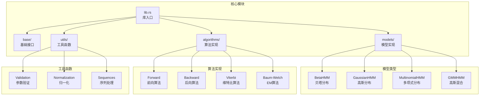

**图表来源**
- [lib.rs](file://src/lib.rs#L19-L27)
- [models/mod.rs](file://src/models/mod.rs#L1-L12)
- [algorithms/mod.rs](file://src/algorithms/mod.rs#L1-L12)

**章节来源**
- [lib.rs](file://src/lib.rs#L1-L28)
- [Cargo.toml](file://Cargo.toml#L1-L23)

## 核心组件

### 贝塔 HMM 主要特性

贝塔 HMM 实现了完整的 HMM 功能，包括参数估计、状态预测、模型评分和数据采样：

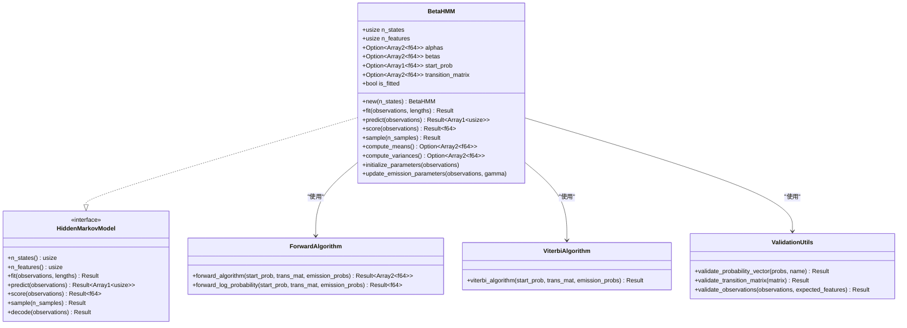

**图表来源**
- [beta.rs](file://src/models/beta.rs#L24-L39)
- [hmm.rs](file://src/base/hmm.rs#L6-L61)
- [forward.rs](file://src/algorithms/forward.rs#L20-L47)
- [viterbi.rs](file://src/algorithms/viterbi.rs#L20-L74)
- [validation.rs](file://src/utils/validation.rs#L6-L56)

### 参数初始化策略

贝塔 HMM 采用方法矩估计（Method of Moments）进行参数初始化：

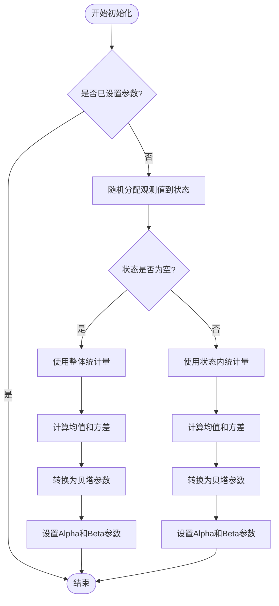

**图表来源**
- [beta.rs](file://src/models/beta.rs#L226-L270)
- [beta.rs](file://src/models/beta.rs#L272-L286)

**章节来源**
- [beta.rs](file://src/models/beta.rs#L226-L286)
- [validation.rs](file://src/utils/validation.rs#L6-L56)

## 架构概览

### 整体架构设计

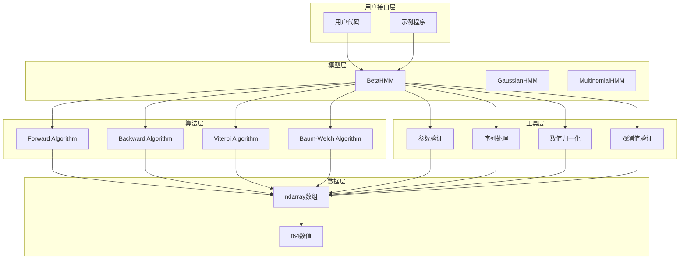

**图表来源**
- [beta.rs](file://src/models/beta.rs#L384-L669)
- [hmm.rs](file://src/base/hmm.rs#L6-L61)
- [lib.rs](file://src/lib.rs#L19-L27)

### 数据流处理

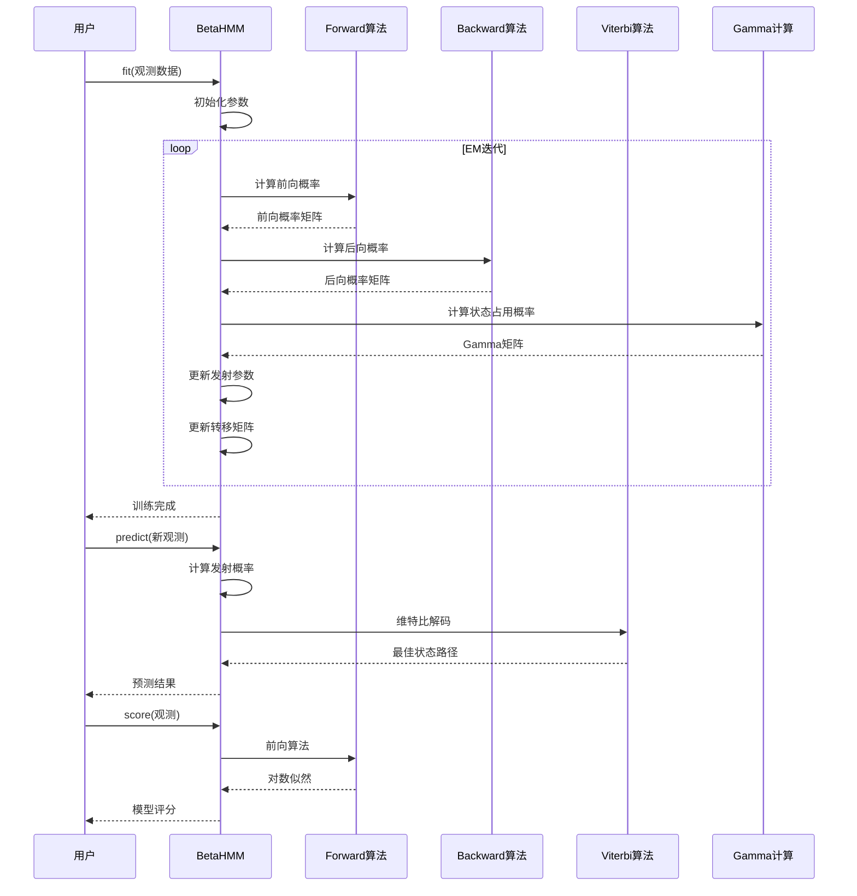

**图表来源**
- [beta.rs](file://src/models/beta.rs#L393-L547)
- [forward.rs](file://src/algorithms/forward.rs#L20-L47)
- [backward.rs](file://src/algorithms/backward.rs)
- [viterbi.rs](file://src/algorithms/viterbi.rs#L20-L74)
- [baum_welch.rs](file://src/algorithms/baum_welch.rs#L25-L44)

## 详细组件分析

### 贝塔分布发射概率计算

贝塔 HMM 的发射概率计算是其核心功能，涉及对数空间计算以确保数值稳定性：

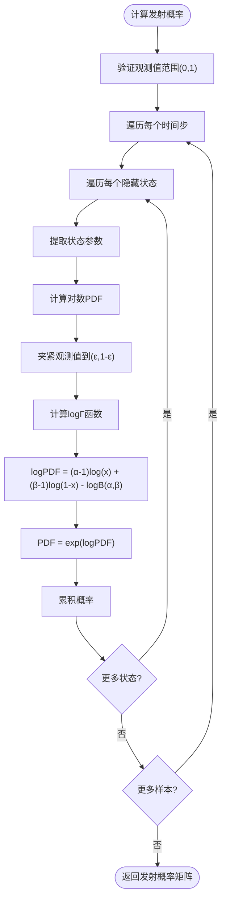

**图表来源**
- [beta.rs](file://src/models/beta.rs#L126-L157)
- [beta.rs](file://src/models/beta.rs#L173-L197)

#### 数值稳定性处理

贝塔 HMM 实现了多层数值稳定性保护：

1. **观测值边界处理**：使用 `clamp(1e-10, 1.0-1e-10)` 确保观测值在开区间 (0,1)
2. **参数正性保证**：使用 `max(1e-6)` 确保形状参数为正值
3. **对数空间计算**：使用 `log_gamma` 进行稳定计算
4. **Stirling近似**：对大数值使用Stirling公式近似计算

**章节来源**
- [beta.rs](file://src/models/beta.rs#L173-L224)

### 参数估计算法

贝塔 HMM 使用期望最大化（EM）算法进行参数估计：

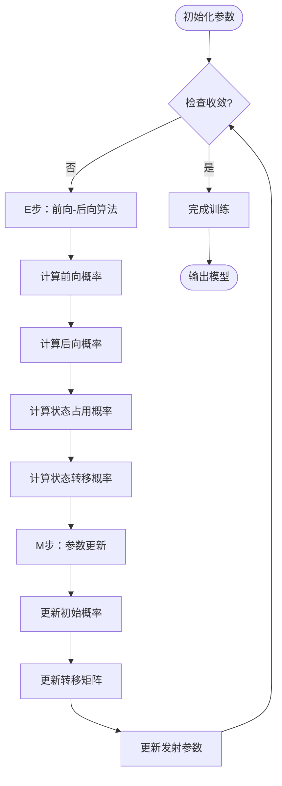

**图表来源**
- [beta.rs](file://src/models/beta.rs#L439-L547)
- [baum_welch.rs](file://src/algorithms/baum_welch.rs#L25-L44)

#### 发射参数更新策略

贝塔 HMM 的发射参数更新基于加权方法矩估计：

1. **加权均值计算**：使用状态占用概率作为权重
2. **加权方差计算**：基于加权均值得到方差
3. **参数转换**：从均值-方差转换为贝塔参数

**章节来源**
- [beta.rs](file://src/models/beta.rs#L340-L381)

### 状态解码算法

贝塔 HMM 支持多种状态解码方法：

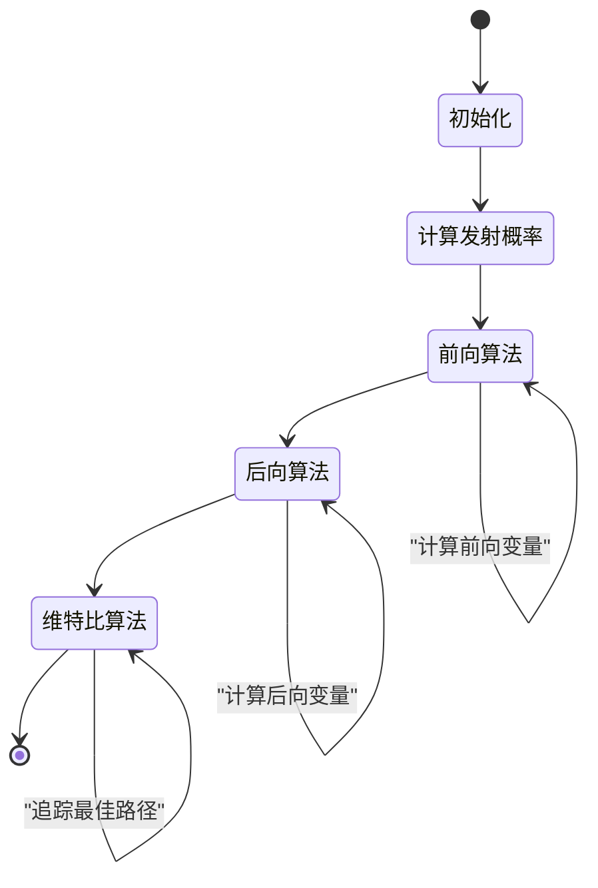

**图表来源**
- [forward.rs](file://src/algorithms/forward.rs#L20-L47)
- [backward.rs](file://src/algorithms/backward.rs)
- [viterbi.rs](file://src/algorithms/viterbi.rs#L20-L74)

**章节来源**
- [forward.rs](file://src/algorithms/forward.rs#L20-L69)
- [viterbi.rs](file://src/algorithms/viterbi.rs#L20-L74)

## 依赖关系分析

### 外部依赖关系

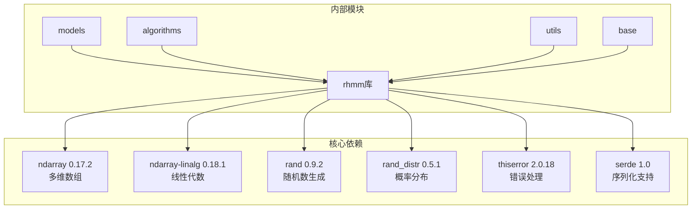

**图表来源**
- [Cargo.toml](file://Cargo.toml#L13-L19)

### 内部模块依赖

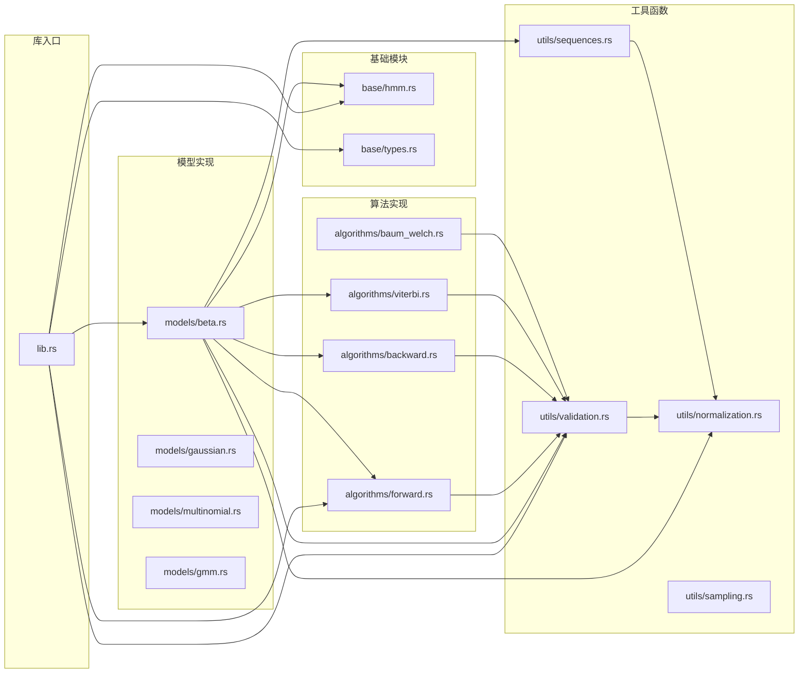

**图表来源**
- [lib.rs](file://src/lib.rs#L19-L27)
- [beta.rs](file://src/models/beta.rs#L3-L12)

**章节来源**
- [lib.rs](file://src/lib.rs#L19-L27)
- [beta.rs](file://src/models/beta.rs#L3-L12)

## 性能考量

### 数值稳定性优化

贝塔 HMM 实现了多层数值稳定性保护机制：

1. **对数空间计算**：所有概率计算都在对数空间进行，避免数值下溢
2. **Stirling近似**：对大数值使用Stirling公式近似计算Gamma函数
3. **边界夹紧**：确保观测值和参数在有效范围内
4. **向量化操作**：充分利用ndarray的向量化能力

### 内存管理

1. **零拷贝操作**：大量使用ArrayView减少内存分配
2. **就地更新**：参数更新直接在原数组上进行
3. **批量处理**：支持多个序列的批量处理

### 计算复杂度

- **参数初始化**：O(N×S×F)，其中N为样本数，S为状态数，F为特征数
- **单次迭代**：O(N×S²×F)
- **预测阶段**：O(N×S²)

## 故障排除指南

### 常见错误类型

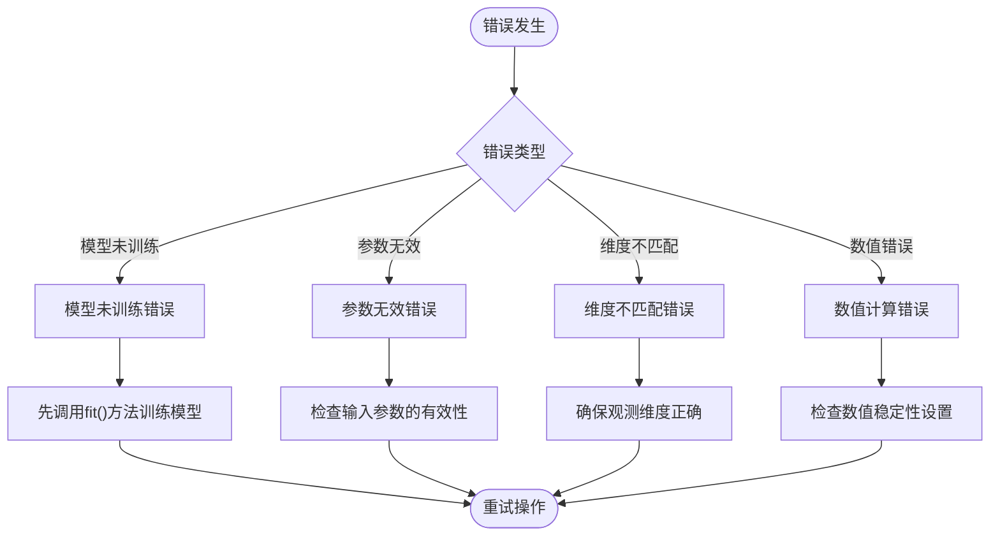

**图表来源**
- [beta.rs](file://src/models/beta.rs#L130-L145)
- [beta.rs](file://src/models/beta.rs#L550-L561)

### 参数调优建议

#### 观测数据预处理

1. **数据范围检查**：确保所有观测值在 (0,1) 区间内
2. **缺失值处理**：贝塔分布不支持边界值，需要适当处理
3. **数据质量**：检查是否存在异常值或噪声

#### 模型参数设置

1. **状态数选择**：根据业务场景和数据复杂度确定
2. **收敛阈值**：通常设置在 1e-4 到 1e-6 之间
3. **最大迭代次数**：根据数据规模设置，一般 50-200 次

#### 数值稳定性设置

1. **参数下界**：建议设置为 1e-6 或更高
2. **观测值边界**：建议设置为 1e-10 到 1-1e-10
3. **对数计算**：确保使用稳定的对数空间计算

**章节来源**
- [beta.rs](file://src/models/beta.rs#L182-L196)
- [validation.rs](file://src/utils/validation.rs#L6-L56)

## 结论

贝塔 HMM 是一个功能完整、数值稳定的隐马尔可夫模型实现，专门针对比例数据和概率数据的建模需求。其主要优势包括：

1. **专业的发射分布**：贝塔分布在 [0,1] 区间内的概率密度函数天然适合比例数据建模
2. **数值稳定性**：实现了多层数值稳定性保护，确保计算精度
3. **完整的算法实现**：包含了前向-后向算法、维特比算法和EM参数估计
4. **灵活的接口设计**：遵循统一的 HMM 接口，易于集成和扩展

在实际应用中，贝塔 HMM 特别适用于 e-commerce 转化率分析、营销效果评估、金融数据分析等场景。通过合理的参数设置和数据预处理，可以获得准确且稳定的建模结果。

## 附录

### 使用示例

#### 基本使用流程

```rust
// 创建模型
let mut model = BetaHMM::new(2);

// 准备观测数据（范围在[0,1]）
let observations = array![
    [0.12, 0.15], // 移动端转化率
    [0.10, 0.13], // 移动端转化率
    [0.75, 0.82], // 移动端转化率
];

// 训练模型
model.fit(&observations, None)?;

// 预测状态序列
let states = model.predict(&observations)?;

// 获取学习到的参数
if let (Some(alphas), Some(betas)) = (model.alphas(), model.betas()) {
    println!("Alpha参数: {:?}", alphas);
    println!("Beta参数: {:?}", betas);
}

// 计算模型评分
let log_prob = model.score(&observations)?;
```

#### 高级用法

```rust
// 处理多个序列
let observations = array![/* 连接的序列 */];
let lengths = vec![10, 15, 20]; // 每个序列的长度
model.fit(&observations, Some(&lengths))?;

// 自定义初始化
let mut model = BetaHMM::new(3);
// 设置自定义初始参数
model.fit(&observations, None)?;

// 生成合成数据
let (samples, states) = model.sample(100)?;
```

### 与其他 HMM 模型的区别

| 特性 | 贝塔 HMM | 高斯 HMM | 多项式 HMM |
|------|----------|----------|------------|
| 发射分布 | 贝塔分布 | 高斯分布 | 多项式分布 |
| 数据范围 | [0,1] | (-∞,+∞) | 离散计数 |
| 参数估计 | 方法矩估计 | 最大似然估计 | 最大似然估计 |
| 数值稳定性 | 对数空间计算 | 对数空间计算 | 直接概率计算 |
| 应用场景 | 转化率、比例数据 | 连续特征、语音 | 文本分类、标签 |

### 参数参考表

| 参数名称 | 类型 | 默认值 | 说明 |
|----------|------|--------|------|
| n_states | usize | 必需 | 隐藏状态数量 |
| n_features | usize | 自动推断 | 观测特征维度 |
| alphas | Array2<f64> | None | 贝塔分布形状参数α |
| betas | Array2<f64> | None | 贝塔分布形状参数β |
| start_prob | Array1<f64> | 均匀分布 | 初始状态概率 |
| transition_matrix | Array2<f64> | 均匀转移 | 状态转移概率矩阵 |