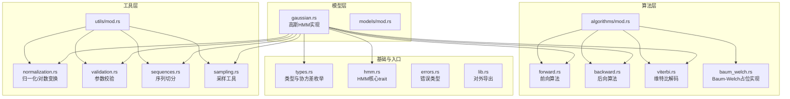
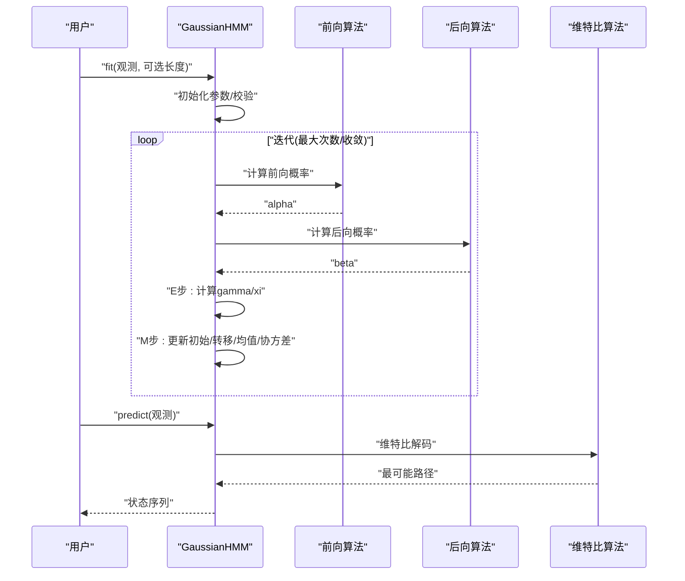
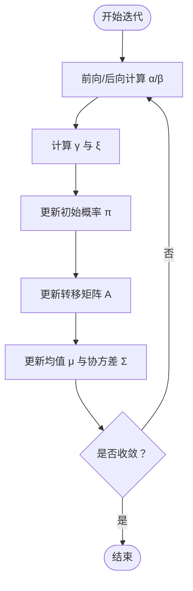
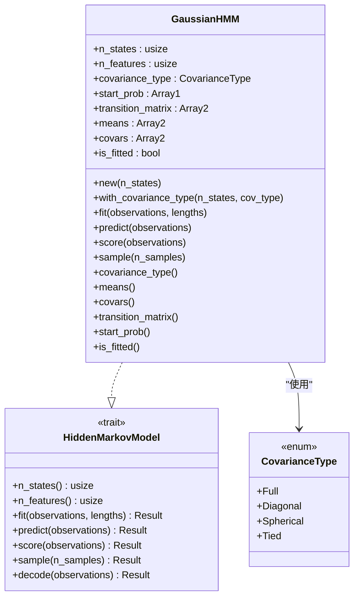
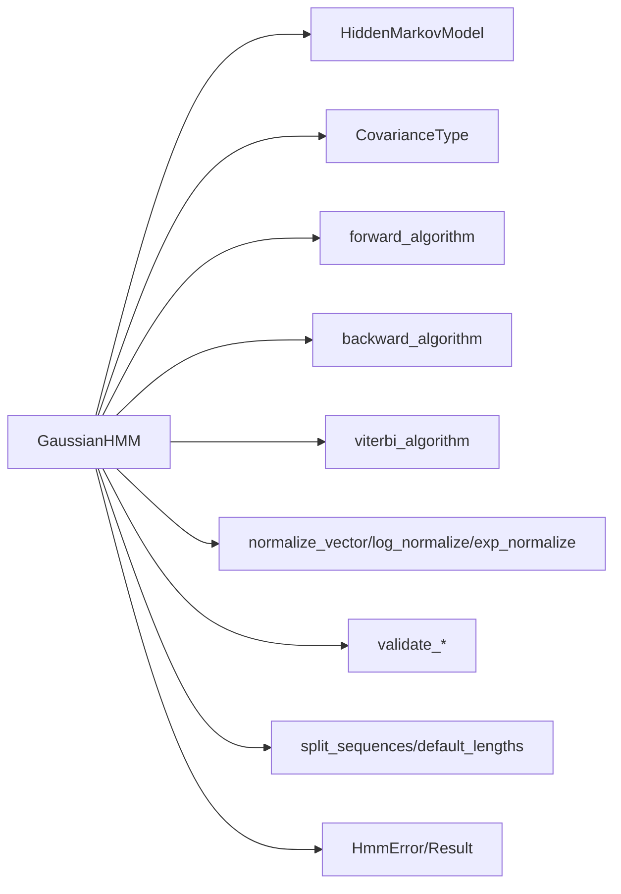

# 高斯 HMM

<cite>
**本文引用的文件**
- [src/models/gaussian.rs](file://src/models/gaussian.rs)
- [src/base/types.rs](file://src/base/types.rs)
- [src/base/hmm.rs](file://src/base/hmm.rs)
- [src/algorithms/forward.rs](file://src/algorithms/forward.rs)
- [src/algorithms/backward.rs](file://src/algorithms/backward.rs)
- [src/algorithms/viterbi.rs](file://src/algorithms/viterbi.rs)
- [src/algorithms/baum_welch.rs](file://src/algorithms/baum_welch.rs)
- [src/utils/normalization.rs](file://src/utils/normalization.rs)
- [src/utils/validation.rs](file://src/utils/validation.rs)
- [src/utils/sequences.rs](file://src/utils/sequences.rs)
- [src/utils/sampling.rs](file://src/utils/sampling.rs)
- [src/errors.rs](file://src/errors.rs)
- [src/lib.rs](file://src/lib.rs)
- [README.md](file://README.md)
- [examples/beta_hmm_example.rs](file://examples/beta_hmm_example.rs)
- [tests/integration_tests.rs](file://tests/integration_tests.rs)
</cite>

## 目录
1. [引言](#引言)
2. [项目结构](#项目结构)
3. [核心组件](#核心组件)
4. [架构总览](#架构总览)
5. [详细组件分析](#详细组件分析)
6. [依赖关系分析](#依赖关系分析)
7. [性能考量](#性能考量)
8. [故障排查指南](#故障排查指南)
9. [结论](#结论)
10. [附录：API 使用示例与参数调优](#附录api-使用示例与参数调优)

## 引言
本文件面向高斯隐马尔可夫模型（Gaussian HMM）的使用者与开发者，系统性梳理其数学原理、实现细节与工程实践。重点覆盖：
- 高斯发射分布的数学基础与多种协方差类型（对角型、球面型、全协方差、耦合协方差）的实现策略与适用场景
- 参数初始化策略与收敛条件
- Baum-Welch 算法的 E 步与 M 步实现流程
- 数值稳定性设计（对数概率、方差下界）
- 完整 API 使用示例（模型创建、训练、预测、评分、采样）
- 调试技巧与参数调优建议

## 项目结构
该仓库采用模块化组织，围绕“模型层”“算法层”“工具层”“基础类型与错误”展开，便于扩展与维护。

图表来源
- [src/models/gaussian.rs](file://src/models/gaussian.rs#L1-L681)
- [src/algorithms/forward.rs](file://src/algorithms/forward.rs#L1-L129)
- [src/algorithms/backward.rs](file://src/algorithms/backward.rs#L1-L90)
- [src/algorithms/viterbi.rs](file://src/algorithms/viterbi.rs#L1-L118)
- [src/algorithms/baum_welch.rs](file://src/algorithms/baum_welch.rs#L1-L75)
- [src/utils/normalization.rs](file://src/utils/normalization.rs#L1-L102)
- [src/utils/validation.rs](file://src/utils/validation.rs#L1-L141)
- [src/utils/sequences.rs](file://src/utils/sequences.rs#L1-L200)
- [src/utils/sampling.rs](file://src/utils/sampling.rs#L1-L200)
- [src/base/types.rs](file://src/base/types.rs#L1-L61)
- [src/base/hmm.rs](file://src/base/hmm.rs#L1-L62)
- [src/errors.rs](file://src/errors.rs#L1-L200)
- [src/lib.rs](file://src/lib.rs#L1-L28)

章节来源
- [src/lib.rs](file://src/lib.rs#L1-L28)
- [README.md](file://README.md#L1-L303)

## 核心组件
- 高斯 HMM 实现：提供构造、拟合、预测、评分、采样等完整生命周期方法；支持多种协方差类型；内置参数初始化与收敛控制。
- 核心算法：前向/后向/维特比算法作为底层支撑；Baum-Welch 占位实现当前由模型内部自行完成（详见后续章节）。
- 工具与校验：概率向量/转移矩阵校验、行归一化、对数空间转换、序列切分与长度默认化。
- 基础类型与错误：统一的协方差类型枚举、HMM trait、错误类型与结果别名。

章节来源
- [src/models/gaussian.rs](file://src/models/gaussian.rs#L1-L681)
- [src/base/hmm.rs](file://src/base/hmm.rs#L1-L62)
- [src/base/types.rs](file://src/base/types.rs#L1-L61)
- [src/utils/validation.rs](file://src/utils/validation.rs#L1-L141)
- [src/utils/normalization.rs](file://src/utils/normalization.rs#L1-L102)

## 架构总览
高斯 HMM 的训练与推理遵循标准 HMM 流程：先通过前向/后向计算局部概率，再在 EM 框架下更新参数；预测阶段用维特比求最优路径；采样阶段从初始分布与转移矩阵生成状态序列与观测。

图表来源
- [src/models/gaussian.rs](file://src/models/gaussian.rs#L337-L491)
- [src/algorithms/forward.rs](file://src/algorithms/forward.rs#L20-L47)
- [src/algorithms/backward.rs](file://src/algorithms/backward.rs#L19-L44)
- [src/algorithms/viterbi.rs](file://src/algorithms/viterbi.rs#L20-L74)

## 详细组件分析

### 数学原理与协方差类型
- 发射分布：每个隐藏状态下的观测向量 x_t ∈ R^d 服从多元高斯分布 p(x_t|z_t=i) = N(μ_i, Σ_i)，其中 Σ_i 为状态 i 的协方差矩阵。
- 协方差类型与实现策略：
  - 对角型（Diagonal）：Σ_i 为对角矩阵，仅保留各维度方差；计算时按维度累加，避免矩阵运算，数值稳定且高效。
  - 球面型（Spherical）：Σ_i = σ^2 I，所有维度方差相同；进一步简化，适合特征间无异方差假设。
  - 全协方差（Full）：Σ_i 为一般实对称正定矩阵；当前实现以对角近似处理，完整实现需矩阵分解/求逆。
  - 耦合协方差（Tied）：所有状态共享同一协方差矩阵；当前实现与对角近似一致，完整实现需共享估计。
- 数值稳定性：
  - 方差最小值限制：在对角/球面实现中对协方差施加下界，防止除零或数值不稳定。
  - 对数概率：在计算密度时使用对数域，避免小数连乘导致下溢；采样时使用对数-指数转换保持数值稳定。

章节来源
- [src/models/gaussian.rs](file://src/models/gaussian.rs#L147-L194)
- [src/base/types.rs](file://src/base/types.rs#L17-L29)

### 参数初始化策略
- 初始概率：若未显式设置，均匀初始化为 1/n_states。
- 转移矩阵：若未显式设置，均匀初始化为 1/n_states 行归一化。
- 均值：随机从观测集中选取样本作为各状态均值初值。
- 协方差：基于整体数据各维度方差，为每个状态赋相同初值，并施加最小方差下界。
- 观测校验：在设置 n_features 后，对输入观测进行维度一致性检查。

章节来源
- [src/models/gaussian.rs](file://src/models/gaussian.rs#L357-L382)
- [src/utils/validation.rs](file://src/utils/validation.rs#L58-L74)

### Baum-Welch 算法实现（E 步与 M 步）
- E 步（期望步）：
  - 计算前向概率 α 与后向概率 β。
  - 计算状态占用概率 γ（逐时刻、逐状态），用于更新初始概率与转移概率。
  - 计算状态转移概率 ξ（相邻时刻、状态对），用于更新转移矩阵。
- M 步（最大化步）：
  - 更新初始概率：以首时刻 γ 的累积归一化得到 π̂。
  - 更新转移矩阵：以相邻时刻 ξ 的累积按行归一化得到 Â。
  - 更新发射参数（均值与协方差）：基于 γ 的加权均值与加权方差，协方差施加最小下界。
- 收敛判断：以对数似然增量的绝对值小于阈值或达到最大迭代次数停止。

图表来源
- [src/models/gaussian.rs](file://src/models/gaussian.rs#L383-L491)
- [src/algorithms/forward.rs](file://src/algorithms/forward.rs#L20-L47)
- [src/algorithms/backward.rs](file://src/algorithms/backward.rs#L19-L44)
- [src/algorithms/baum_welch.rs](file://src/algorithms/baum_welch.rs#L25-L44)

章节来源
- [src/models/gaussian.rs](file://src/models/gaussian.rs#L224-L325)
- [src/algorithms/baum_welch.rs](file://src/algorithms/baum_welch.rs#L1-L75)

### 预测与评分（Viterbi 与前向）
- 预测：使用维特比算法求最可能的状态序列，返回状态索引数组。
- 评分：使用前向算法计算观测序列的对数概率，返回标量对数值。

章节来源
- [src/models/gaussian.rs](file://src/models/gaussian.rs#L493-L544)
- [src/algorithms/viterbi.rs](file://src/algorithms/viterbi.rs#L20-L74)
- [src/algorithms/forward.rs](file://src/algorithms/forward.rs#L60-L69)

### 采样
- 从初始分布抽取首个状态与观测。
- 之后每一步：根据当前状态的转移概率抽取下一状态，再根据该状态的高斯发射参数抽取观测。

章节来源
- [src/models/gaussian.rs](file://src/models/gaussian.rs#L546-L612)

### 类关系图（代码级）

图表来源
- [src/models/gaussian.rs](file://src/models/gaussian.rs#L14-L100)
- [src/base/hmm.rs](file://src/base/hmm.rs#L7-L61)
- [src/base/types.rs](file://src/base/types.rs#L17-L29)

## 依赖关系分析
- 模型对算法与工具的依赖清晰：高斯 HMM 直接调用前向/后向/维特比与归一化/校验/序列工具。
- 算法模块独立，便于单元测试与复用。
- 错误类型集中定义，贯穿整个调用链。

图表来源
- [src/models/gaussian.rs](file://src/models/gaussian.rs#L1-L681)
- [src/base/hmm.rs](file://src/base/hmm.rs#L1-L62)
- [src/base/types.rs](file://src/base/types.rs#L1-L61)
- [src/algorithms/forward.rs](file://src/algorithms/forward.rs#L1-L129)
- [src/algorithms/backward.rs](file://src/algorithms/backward.rs#L1-L90)
- [src/algorithms/viterbi.rs](file://src/algorithms/viterbi.rs#L1-L118)
- [src/utils/normalization.rs](file://src/utils/normalization.rs#L1-L102)
- [src/utils/validation.rs](file://src/utils/validation.rs#L1-L141)
- [src/utils/sequences.rs](file://src/utils/sequences.rs#L1-L200)
- [src/errors.rs](file://src/errors.rs#L1-L200)

章节来源
- [src/lib.rs](file://src/lib.rs#L19-L28)

## 性能考量
- 数据结构：使用 ndarray 进行向量化操作，减少内存分配与循环开销。
- 数值稳定性：对数概率与 log-sum-exp 形式的指数归一化，避免下溢与上溢。
- 协方差类型选择：
  - 对角型：平衡精度与效率，推荐默认使用。
  - 球面型：进一步降低参数规模，适合特征维度较高但方差趋同的场景。
  - 全/耦合协方差：理论上更灵活，当前实现以对角近似，完整实现需矩阵运算优化（如 Cholesky 分解）。
- 并行化：当前未见多线程并行实现，可考虑按序列并行训练（注意统计聚合的线程安全）。

## 故障排查指南
- 维度不匹配：观测列数必须与训练时一致，否则抛出维度不匹配错误。
- 未拟合即预测/评分/采样：会触发模型未拟合错误。
- 观测为空或列数为 0：训练前进行空观测检查。
- 初始/转移矩阵非法：概率和不为 1 或含负值会被拒绝。
- 收敛过早或不收敛：调整最大迭代次数与容忍度；检查协方差类型与最小方差下界。

章节来源
- [src/models/gaussian.rs](file://src/models/gaussian.rs#L337-L544)
- [src/utils/validation.rs](file://src/utils/validation.rs#L58-L74)
- [tests/integration_tests.rs](file://tests/integration_tests.rs#L88-L102)

## 结论
该实现以模块化方式提供了高斯 HMM 的核心能力：支持多种协方差类型、完备的训练/预测/评分/采样接口、稳健的数值设计与严格的参数校验。当前 Baum-Welch 的 E/M 步已在模型内部完整实现，适合中小规模连续数据建模；对于大规模/高维数据，可结合协方差类型选择与矩阵运算优化进一步提升性能。

## 附录：API 使用示例与参数调优

### API 使用示例（模型创建、训练、预测、评分、采样）
- 创建与训练：指定隐藏状态数与协方差类型，传入观测矩阵与可选序列长度列表。
- 预测：对新观测序列进行维特比解码，输出状态序列。
- 评分：计算观测序列的对数概率，用于模型评估与比较。
- 采样：从已拟合模型生成新的观测与状态序列。

章节来源
- [README.md](file://README.md#L53-L87)
- [src/models/gaussian.rs](file://src/models/gaussian.rs#L337-L612)

### 协方差类型适用场景与性能特征
- 对角型（默认）：通用、稳定、高效；适合大多数连续数据。
- 球面型：参数最少、速度最快；适合特征方差相近的场景。
- 全协方差：表达力最强；当前实现以对角近似，完整实现需矩阵分解。
- 耦合协方差：参数共享、泛化更好；当前实现以对角近似，完整实现需共享估计。

章节来源
- [src/base/types.rs](file://src/base/types.rs#L17-L29)
- [src/models/gaussian.rs](file://src/models/gaussian.rs#L188-L194)

### 参数估计的收敛条件与调试技巧
- 收敛条件：对数似然增量的绝对值小于阈值或达到最大迭代次数。
- 调试技巧：
  - 观察训练过程中对数似然单调递增与收敛速度。
  - 尝试不同协方差类型与初始参数，对比结果稳定性。
  - 检查观测尺度与异常值，必要时做标准化。
  - 适当提高最小方差下界以增强稳定性。

章节来源
- [src/models/gaussian.rs](file://src/models/gaussian.rs#L383-L491)

### 实际应用案例与参数调优建议
- 应用案例：金融市场区间识别（股价特征）、传感器时序分析（温度/振动）、语音识别（声学特征）等。
- 调优建议：
  - 特征工程：降维、标准化、滑窗统计特征。
  - 协方差类型：优先对角型，再尝试球面型；高维/复杂相关性时考虑全协方差（完整实现）。
  - 超参数：状态数、最大迭代次数、收敛阈值、最小方差下界。
  - 多序列训练：提供序列长度列表，确保跨序列边界正确。

章节来源
- [README.md](file://README.md#L121-L139)
- [README.md](file://README.md#L232-L266)